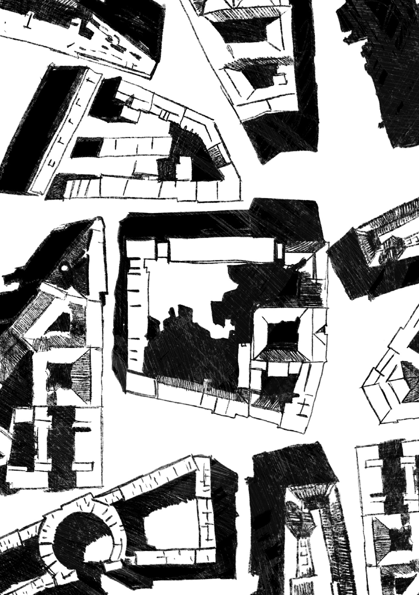

# RZUT +33

P L A N O W A N I E

W S T Ę P N I A K

~

Planowanie staje się coraz trudniejsze, zwłaszcza długofalowe. Kryzys goni kryzys: klimatyczny, uchodźczy, energetyczny, gospodarczy. Polityka i rządzenie polegają coraz częściej na gaszeniu pożarów, rozwiązywaniu doraźnych problemów. Jak w takiej sytuacji planować nie tylko na dziś i jutro, ale na całe dekady, z myślą o mieście także dla przyszłych pokoleń? Jak dobrze zaplanować zrównoważony rozwój miasta, jeśli w miesiąc czy dwa jest w nim nagle o kilkanaście procent więcej mieszkańców i użytkowników, bo za wschodnią granicą rozpętała się wojna?

numeru będzie poświęcona właśnie stolicy Polski. Od 2018 r. stołeczny ratusz przygotowuje nowe Studium Uwarunkowań i Kierunków Zagospodarowania Przestrzennego. Ta swoista przestrzenna konstytucja zapowiada nowe planowanie, które pozwoli tworzyć miasto lepsze do życia dla wszystkich, zdrowsze, wygodne, bardziej odporne na różne kryzysy.

Ten dokument był dla nas punktem wyjścia numeru RZUT-u, który powstał we współpracy z Biurem Architektury i Planowania Przestrzennego Urzędu m.st. Warszawy (BAiPP).

Podzieliliśmy go na dwie części. W pierwszej sekcji przeczytacie o tym, jak jest planowana Warszawa. Do rozmowy na ten temat zaprosiliśmy Marlenę Happach, architektkę miasta oraz dyrektorkę Biura Architektury i Planowania Przestrzennego, Monikę Konrad, jej zastępczynię oraz główną projektantkę Studium, a także Bartosza Rozbiewskiego, wicedyrektora BAiPP ds. polityki przestrzennej. To osoby, które są bezpośrednio odpowiedzialne za treść dokumentu Studium. W rozmowie z Marleną Happach przeczytamy m.in. o głównej wizji Studium, a także o tym, jakie aktualne procesy kształtujące miasto wpłynęły na ten dokument. W wywiadzie z Moniką Konrad pytamy

Właśnie dlatego mądre, wieloaspektowe i interdyscyplinarne planowanie z udziałem mieszkanek i mieszkańców staje się wręcz niezbędne. Bez tego nie poradzimy sobie w tak płynnej i ponowoczesnej rzeczywistości. Planowanie musi być bardziej elastyczne, ale musimy obstawać przy wartościach najważniejszych, z których nie możemy zrezygnować, by przetrwać. W dobie wielu nakładających się na siebie kryzysów, urbanistyki łanowej na przedmieściach czy fal letnich upałów w centrach miast to niekiedy jedyna odpowiedź na bolączki współczesności.

Warszawa mierzy się z tymi problemami w sposób szczególny, dlatego spora część niniejszego

5 — planowanie z kolei o metodologię przygotowywania Studium. Dowiemy się z niego m.in., jakiego typu analizy były prowadzone przez zespół generalnego projektanta i na jakiej podstawie wypracowywano niektóre rozwiązania przestrzenne. Bartosz Rozbiewski opowie natomiast, w jakim zakresie ustalenia nowego Studium będą miały przełożenie na rozwiązania transportowe w Warszawie, a także jakie sposoby poruszania się po mieście preferuje ten dokument.

Sharona i specyfiki planowania Izraela po II wojnie światowej, krajowego systemu schronów w Albanii oraz portugalskiego programu mieszkalnictwa dostępnego SAAL. Kacper Borek zaś opowiada historię nieotwartej galerii handlowej w Bełchatowie – Bawełnianki.

Wrażliwość w planowaniu może przejawiać się na wielu płaszczyznach. Z jednej strony będzie to zagadnienie zapewnienia infrastruktury nekropolii, które porusza Artur Brzozowski, z drugiej zaś projektowanie inkluzywne, które postuluje wizja pierwszego queer miasta w Polsce, przedstawiona przez Michała Kowalskiego. Weronika Kozak zwraca z kolei naszą uwagę na podstawowe narzędzie planowania, czyli mapy, na które powinniśmy patrzeć krytycznie. Katarzyna Kajdanek dotyka w rozmowie tematu granicy miasta, jego przedmieść i zjawiska suburbanizacji, analizując jego genezę i wynikające z niego bolączki mieszkańców. Co może je rozwiązać? Odpowiednie planowanie będzie z pewnością dobrym punktem wyjścia •

O krótkie wypowiedzi dotyczące Studium poprosiliśmy również ekspertów, którzy mieli okazję zapoznać się z tym dokumentem. Są to dr Monika Wróbel, Kuba Snopek oraz prof. Marek Krajewski.

Drugą część wypełniają teksty związane z planowaniem w różnych jego kontekstach – przyrody, historii i wrażliwości.

Jakub Węgrzynowicz przybliża zagadnienia związane z ochroną przyrody, a Magdalena Krzosek-Hołody prezentuje wyniki badań dotyczących tego, w jaki sposób błękitno-zielona infrastruktura jest wykorzystywana przez miejskie instytucje kultury.

~ Matylda Gąsiorowska

Wojciech Kacperski BAiPP Igor Łysiuk

Urszula Prokop, Anna Halek i Wiktor Martin opowiadają historie trzech projektów – planu

