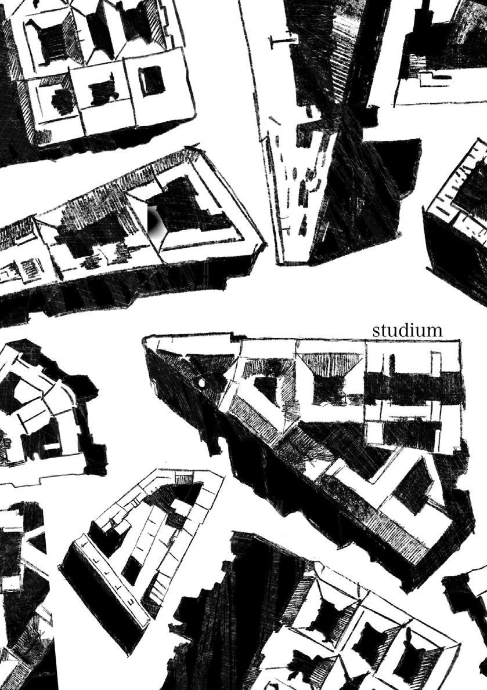

N O W E S T U D I U M WA R S Z AW Y

~

Nowe Studium zmienia dotychczasowe myślenie o mieście. Traktuje miasto jako ekosystem, w którym wszystkie elementy są ze sobą połączone – sfera społeczna, gospodarcza oraz przyrodnicza. Projektanci Studium, przygotowując dokument, przeprowadzili oraz zlecili wiele badań, które doprowadziły ich do konkretnych konkluzji, których efektem są ustalenia dokumentu. W tych badaniach skupili się m.in. na kwestiach demograficznych, gospodarczych, jak również środowiskowych oraz z obszaru mobilności. Dzięki temu powstał dokument, który kompleksowo diagnozuje Warszawę w jej aktualnym momencie rozwojowym, a także przedstawia kierunki jej rozwoju na najbliższe lata i dekady.

cesie, ponieważ w jej trakcie doświadczyliśmy już bardzo istotnego napływu osób, które zatrzymały się w Warszawie na dłużej. Przewiduje się, że liczba mieszkańców na pewno wzrośnie, więc kluczowa jest budowa mieszkań. Należy je lokalizować przede wszystkim na terenach pofabrycznych oraz pokolejowych, w obszarze zwartym i bliżej centrum. Utworzą się tam zupełnie nowe obszary zabudowy wielofunkcyjnej, które od początku i całościowo da się dobrze zaprojektować. Oprócz domów wielorodzinnych od razu powstaną szkoły, przedszkola, miejsca pracy, a także wszystkie potrzebne usługi społeczne i komercyjne. To dobry moment, aby myśleć w taki nowy sposób o planowaniu osiedli mieszkaniowych. Mieszkanki i mieszkańcy będą mieć wszędzie blisko, także na przystanki metra, kolei, tramwajów. Dostęp do transportu publicznego będzie zapewniony na odległość krótkiego i przyjemnego spaceru dobrze zagospodarowanymi przestrzeniami publicznymi z zielenią. Osobnym tematem jest takie uzupełnianie istniejącej tkanki miejskiej,

Warszawa jest największym miastem w Polsce. Na tle innych ośrodków miejskich rozwija się inaczej pod kątem demografii. Przede wszystkim jest jednym z tych miast, które mimo odpływu mieszkańców na przedmieścia ciągle wykazuje pozytywny przyrost mieszkańców wewnątrz swoich granic administracyjnych. Wojna w Ukrainie jest szczególnym doświadczeniem w tym pro-

9 — — planowaniestudium żeby zabudowa zapewniała dobrą jakość życia zarówno obecnym, jak i przyszłym mieszkańcom. To ma być urbanistyka i architektura, która nie zawiera się w haśle „coś za coś” i „kto kogo”. Nowe inwestycje powinny oznaczać korzyść dla lokalnej wspólnoty sąsiedzkiej – w lepszym zagospodarowaniu i urządzeniu przestrzeni publicznych, zieleni, wzbogaceniu terenu w nowe usługi, których brakuje.

Błękitno-Zielona Infrastruktura (BZIW) nada Warszawie nowy wymiar ekologicznej struktury urbanistycznej. Miasto ma mieć wyraźną strukturę, ale musi działać jak gąbka, a nie pancerz chroniący przed gwałtownymi zjawiskami klimatycznymi. Ma chłonąć wodę. Zatrzymać ją na miejscu, a nie odprowadzać do kanalizacji burzowej. To zupełnie nowy sposób myślenia o roli wody i terenów zieleni w mieście, które stają się równie ważnymi składowymi zagospodarowania przestrzennego jak „twarde” drogi i chodniki. Dzieje się tak przez powiązanie sieci przestrzeni publicznych z siecią BZIW. Wytyczone zostają m.in. zielone pierścienie, czyli sieć przestrzeni publicznych z dużą obecnością zieleni, tworzących liniowe połączenia między dzielnicami Warszawy. Składać się na nie będą nie tylko drogi w otulinie drzew i krzewów dla rowerów, ale również zielone ulice. Ponadto w ramach Błękitno-Zielonej Infrastruktury dokument Studium wytycza parki linearne stanowiące element wzbogacający ulice oraz zielone aleje, w których obok ulic można

Przyrost mieszkań między innymi na terenach pofabrycznych nie będzie oznaczał ubytku terenów zieleni. Wręcz przeciwnie – miejsc rekreacyjnych ma przybywać, a te już istniejące będą tylko pielęgnowane, rozwijane, doinwestowywane. W dobie zmian klimatycznych wiemy, że wygodne zamieszkiwanie w mieście jest związane z dostępem do zieleni na odległość spaceru. Jej tereny jednak nie będą traktowane tylko w kontekście rekreacji. W nowym Studium zieleń oraz woda potraktowane są w kategoriach kluczowej „miękkiej” infrastruktury, tak samo istotnej jak ta twarda z ulicami, chodnikami, latarniami, kanalizacją.

wytyczyć pasy z rzędami drzew oraz założeniami wodnymi. Dzięki temu według kierunków wyznaczonych w nowym Studium każdy warszawiak do 2050 r. będzie miał zieleń w zasięgu wzroku i umownych kilku kroków – w postaci widoku na drzewa przez okno albo pobliskiego parku czy skweru. Błękitno-Zielona Infrastruktura uodporni nasze miasto i zabezpieczy mieszkańców przed szkodliwymi efektami suszy, upałów czy deszczy nawalnych. Istotnym elementem tworzenia BZIW będzie też dążenie do zachowania bioróżnorodności.

obszarów jest bardzo ważne w dużym mieście, w którym o wiele łatwiej o poczucie odosobnienia i samotności, uwzględnia również proces starzenia się społeczeństwa. Do 2050 r. co czwarty warszawiak będzie mieć ponad 65 lat. Stworzenie przestrzeni, do których będzie mógł on dotrzeć pieszo oraz odpocząć w nich, jest niezwykle istotne.

1033 — RZUT+

Warszawa to nie tylko miejsce dobre do mieszkania, ale również do pracy. Liczba miejsc pracy w mieście ciągle rośnie. Ważnym wyzwaniem w tym zakresie jest tworzenie dzielnic mniej homogenicznych funkcjonalnie – takich, w których występują głównie biura. Niezbędne jest takie wymieszanie funkcji, ażeby mieszkańcy mogli w szybki sposób dostać się z domu do pracy oraz z powrotem. Na rozwój gospodarki Warszawy wpływają również działające na jej terenie uczelnie, które będą rozwijać swoje kampusy w obrębie centrum miasta. Dokument będzie dopuszczać w tym zakresie mieszanie funkcji, co ma wpłynąć pozytywnie na rozwój tych obszarów.

W nowym Studium wielką wagę przywiązujemy do planowania miasta zwartego. Kluczowym celem będzie koncentrowanie funkcji wokół miejsca zamieszkania. Ideałem, do którego stolica Polski będzie dążyć, jest miasto, w którym większość najważniejszych codziennych spraw (dojście do np. szkoły, przystanku, sklepu czy kawiarni) będzie można wykonać pieszo oraz w ciągu 10 minut. Nowe Studium wskaże miejsca wytworzenia centrów lokalnych oraz dzielnicowych, którym poświęcono osobne badania i analizy przy projektowaniu dokumentu. Policentryczność Warszawy, jej rozległość wymagają koncentrowania różnych funkcji nie tylko w centrum, ale też w pozostałych dzielnicach. To jedno z ważnych zadań tego dokumentu: z jednej strony zapewnić łatwy dojazd z dzielnic do centrum (wszystkie obrzeżne dzielnice znajdą się w zasięgu obsługi tramwajem, koleją lub metrem), a z drugiej umożliwić załatwienie sprawunków i codziennych spraw lokalnie w najbliższej okolicy. Przemieszczanie się po mieście i dojazdy usprawnią lepiej zaprojektowane węzły przesiadkowe – ze szczególnym uwzględnieniem w ich obrębie ruchu pieszego.

Warszawa jest miastem, które przyciąga nowych mieszkańców. Wielu z nich zostaje w stolicy na dłużej, z czasem zaczyna traktować ją jako swoje miasto. Wizja Warszawy zawarta w Studium uwzględnia te zjawiska, w szczególności planując tworzenie nowych obszarów do mieszkania, a także kładąc nacisk na wygodną lokalność.

Projektowany dokument tworzony jest w cieniu zmiany przepisów planistycznych. W trakcie powstawania nowego Studium rząd proceduje zmiany obowiązującej ustawy o planowaniu i zagospodarowaniu przestrzennym z roku 2003. Projektanci Studium, będąc tego świadomi, przygotowywali dokument, który jest wystarczająco elastyczny, aby jego ustalenia przystosować do formalnych wytycznych podyktowanych zmianą ustawy •

Miasto, w którym wygodnie się mieszka, pracuje oraz spędza czas wolny, to miasto zdrowe. Takim właśnie miastem chce być Warszawa. Wytworzenie centrów lokalnych pozytywnie wpłynie na kształtowanie się lokalnych społeczności. Lokalne parki będą blisko domów, dzięki czemu dojście do nich nie zajmie dużo czasu – co z kolei przełoży się na większą mobilność mieszkańców na krótkich dystansach. Wszystkie te elementy mają na celu poprawienie zdrowia mieszkańców. Same parki również będą miejscem do spotkań. Tworzenie takich

~ Wojciech Kacperski BAiPP

