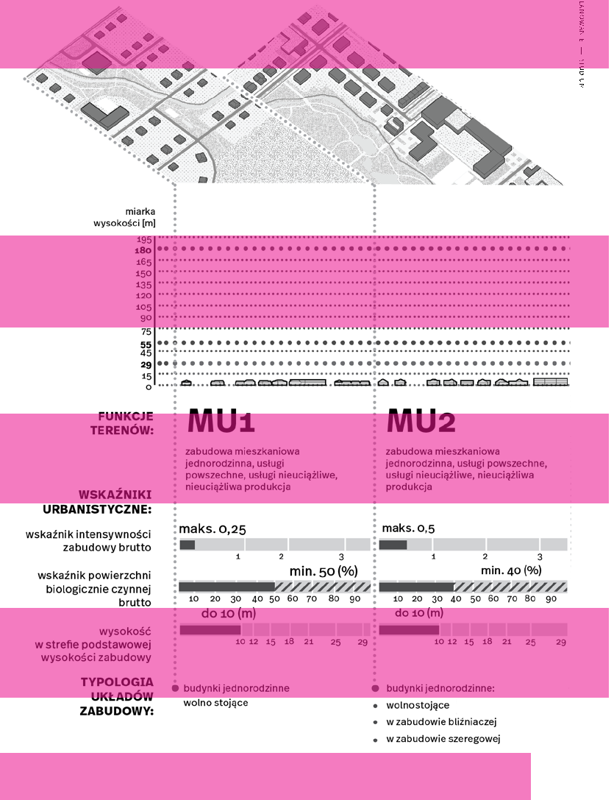
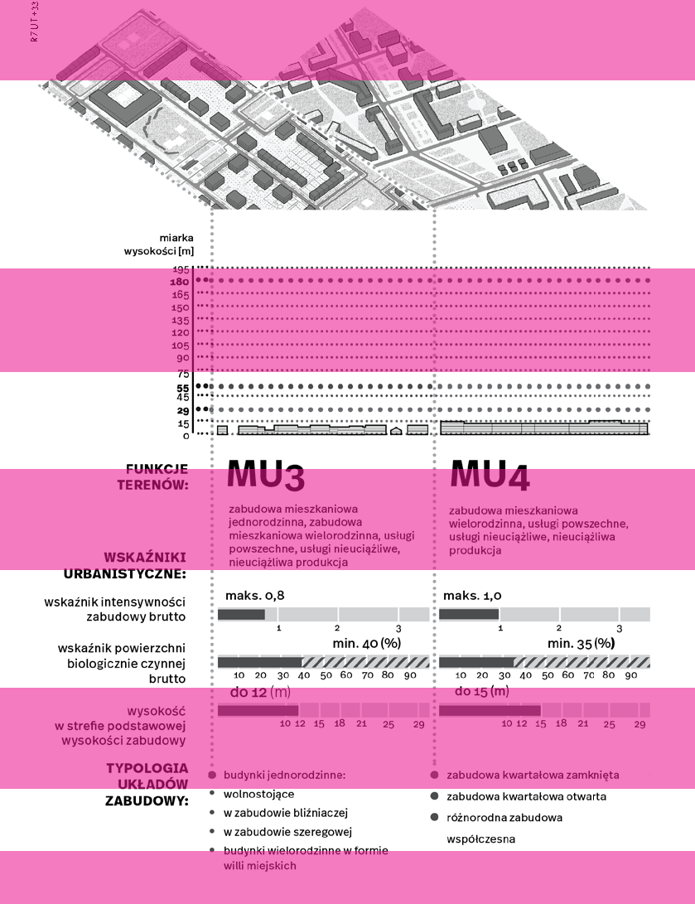
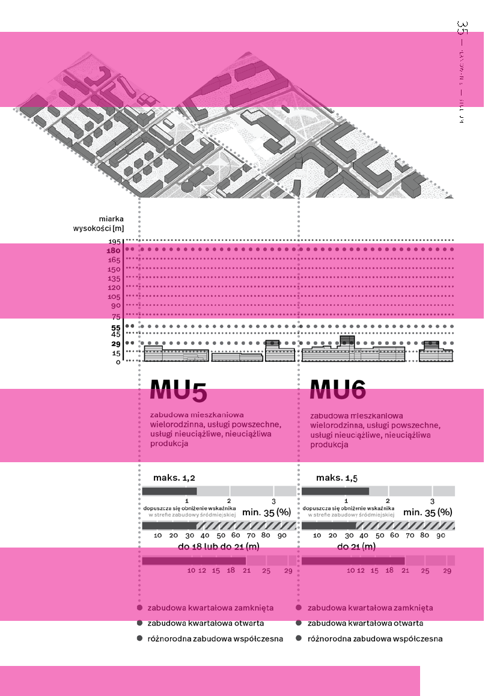
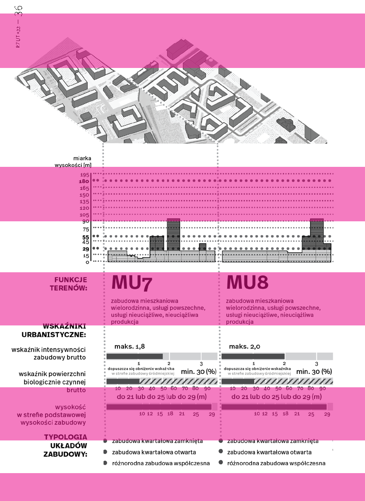
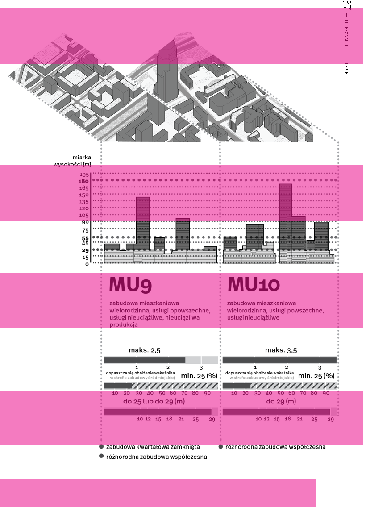
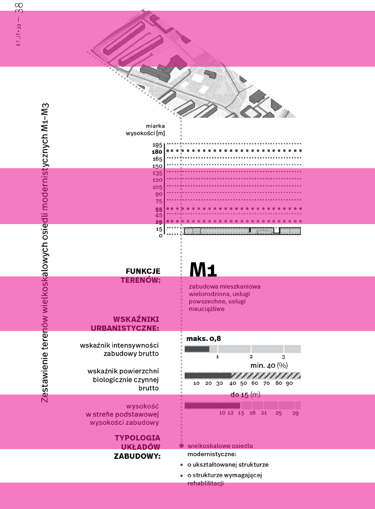

### 2233 —RZUT+

lokalnych, tych najbliżej mieszkańców, mamy też centra dzielnicowe, których przewidujemy ponad 40. Są też centra o znaczeniu w skali całej Warszawy, które określamy jako bramy wielkomiejskie. Wyznaczyliśmy cztery takie bramy. Są zwykle powiązane z dworcami kolejowymi. I wreszcie jest rdzeń wielkomiejski.

planistycznych. W skali całego miasta mówimy o ponad 270 centrów lokalnych. Nasz cel w 2050 roku jest taki: 93% mieszkańców w 10 minut dojdzie piechotą do szkoły, parku, przystanku, sklepu lub kawiarni. Przebijamy więc ideę miasta piętnastominutowego!

Skala wyzwań, żeby to wszystko zrealizować i osiągnąć, jest więc ogromna. Potrzebne są wieloletnie działania, zarówno działania akupunkturowe, wspierające lokalność tam, gdzie ona ma się już dobrze, jak i duże inwestycje, tam gdzie musimy niemal wszystko trzeba zbudować prawie od podstaw.

Projekt centra lokalne ukształtował myślenie o lokalności w nowym Studium, ale również został punktowo zrealizowany. Stanowił rodzaj laboratorium, w którym uczyliśmy się co się sprawdza.

Podam kilka przykładów centrów lokalnych urządzonych w ostatnich latach. Miasto wyremontowało lokale użytkowe przy placu gen. Józefa Hallera, który pełni teraz funkcję centrum lokalnego. Są różne usługi dla mieszkańców: cukiernia, pracownia ceramiczna, pracownia krawiecka, centrum rozrywki dla rodzin. Na zielonym skwerze są tężnia solankowa i ławki, plac zabaw. Niedaleko działa Centrum Wielokulturowe w Warszawie, kilkaset metrów dalej jest Dom Kultury Praga. Na Targówku przy ul. Siarczanej 6 w zmodernizowanej zabytkowej willi też powstało centrum lokalne połączone z parkiem. Także na Żoliborzu przy ulicy Rydygiera 6b udało się stworzyć miejsce dla lokalnej społeczności, powstał tam pawilon – miejsce spotkań połączono z placem zabaw i zielenią. Nowi mieszkańcy okolicznych osiedli bardzo chętnie z niego korzystają i życie sąsiedzkie kwitnie. Choćby te trzy przykłady pokazują, że pod jedną ideą kryją się różne miejsca, a proces ich powstawania zajmuje lata. Najważniejsze jest to, by centra lokalne wpisywały się dobrze w ducha miejsca, okolicę i potrzeby mieszkańców. Stymulowały sąsiedzkość i poprawiały jakość życia. Wiemy, że do 2050 roku ponad ¼ warszawianek i warszawiaków będzie powyżej 65 roku życia. Lokalność to także ochrona przed plagą samotności.

~Co zrobić, żeby planowanie w Warszawie wyprzedzało rzeczywistość?

Projekt nowego Studium pokazuje drogę do zrównoważonego rozwoju miasta. To dokument bardzo nowoczesny na miarę wyzwań XXI wieku, elastyczny, zarazem twardo broniący wartości fundamentalnych, które są kluczowe w dobie wyzwań klimatycznych i różnych kryzysów. Takie Studium i tworzone na ich podstawie nowe plany miejscowe powstrzymają rozlewanie się zabudowy. Są szansą na to, że wreszcie wyprzedzimy rzeczywistość. Chcemy miasta, które powstaje głównie nabrownfieldach, a nie na greenfiledach, czyli rosnącego na terenach poprzemysłowych, a nie na łąkach i polach uprawnych.

Nowe Studium ułatwi tworzenie złożonego ekosystemu Warszawy jako zrównoważonego połączenia natury, zabudowy i infrastruktury. W centrum są dla nas zawsze mieszkanki i mieszkańcy Warszawy, aby mogli żyć dobrze, wygodnie, bezpiecznie i zdrowo.

Mocno w to wierzę, w naszą nową konstytucję przestrzenną i zapisane w niej wartości. Najważniejsze, by bez względu na narzędzia planistyczne, których będziemy używać, zawsze właśnie o wartościach pamiętać •

Istniejące centra lokalne będą się rozwijać. Miejsca, które dopiero mają taki potencjał, ale wymagają uwagi i inwestycji, wskazujemy w Studium i innych dokumentach

# R A M Y ROZ WOJ U

# ~

z Moniką Konrad, rozmawiała: Zofia Piotrowska wicedyrektorką Biura Architektury i Planowania Przestrzennego Warszawy

~ Jakie są główne wyzwania w Warszawie, z którymi mierzyliście się przy opracowywaniu Studium?

~ Czy udało się je zhierarchizować?

Studium jest dokumentem, który ma określić politykę przestrzenną na następne dziesięciolecia. Jego głównym założeniem jest zrównoważony rozwój. W związku z tym nie było tematów ważniejszych i mniej ważnych. Oczywiście mogą być większe problemy z niektórymi zjawiskami, którym należało poświęcić dodatkową uwagę.

Wyzwania dotyczyły wielu aspektów planowania. Etap projektowy prac nad dokumentem poprzedziły liczne analizy wykonane zarówno przed, jak i na etapie opracowania uwarunkowań. Zespół projektowy zebrał, usystematyzował, zintegrował i przeanalizował dane ilościowe i jakościowe opisujące stolicę. Warszawa, podobnie jak większość metropolii, stoi przed istotnymi wyzwaniami, takimi jak zmiany demograficzne, klimatyczne czy potrzeba ograniczenia kosztów urbanizacji. W 2021 r. w ramach konsultacji społecznych oraz kampanii edukacyjno-informacyjnej opublikowaliśmy na stronach miasta raporty z planowania. Zawarliśmy w nich najważniejsze wyzwania planistyczne zdiagnozowane na etapie uwarunkowań, które wymagały wypracowania rozwiązań w części kierunkowej Studium1.

Jako podstawę koncepcji Studium dla Warszawy przyjęliśmy, że miasto stanowi swoisty ekosystem. To jeden organizm będący systemem naczyń połączonych. Tylko ich współdziałanie i integracja mogą zapewnić miastu długoterminową odporność, rozumianą jako zdolność adaptacji do zachodzących zmian, w tym odbudowy w sytuacji nieprzewidzianych, negatywnych zdarzeń. Takie podejście zapewni trwały zrównoważony rozwój. Sytuacje kryzysowe czy też nieoczekiwane zmiany mogą wynikać zarówno z zagrożeń środowiskowych, jak i społeczno-gospodarczych, mających wpływ na funkcjonowanie miasta i prowadzoną politykę

1 www.architektura.um.warszawa.pl/-/raporty-z-planowania-Studium (data dostępu: 30.04.2023).

przestrzenną. Już w czasie sporządzania dokumentu nastąpiły istotne zaburzenia sytuacji społeczno-gospodarczej, takie jak epidemia COVID-19 czy kryzys uchodźczy, będący wynikiem agresji Rosji na Ukrainę. W związku z pandemią zmienił się sposób pracy, co wpłynęło na preferencje i potrzeby mieszkaniowe, rozwój logistyki ostatniej mili w powiązaniu ze znacznym wzrostem handlu internetowego oraz zmianę nawyków transportowych. Szczególnie na znaczeniu zyskała bliskość terenów zieleni. Dlatego kwestie dotyczące dostępności do terenów rekreacyjnych były jednym z kluczowych zagadnień projektowych.

i mieszkańców. Wiele zjawisk, jakie zachodzą w środowisku miejskim, wymagało opracowania autorskiej metodyki badań. Zespół projektowy stanął zatem przed trudnym zadaniem stworzenia w istniejącym systemie prawnym nowoczesnego i elastycznego dokumentu, odpowiadającego na aktualne potrzeby i wyzwania.

### 2433 —RZUT+

Zależało nam na tym, aby nowe Studium nie determinowało wszystkich decyzji planistycznych, jakie będą podejmowane w ciągu następnych 30 lat, ale wyznaczało ramy rozwoju przestrzennego, czyli docelowy model miasta.

Proces sporządzania dokumentu przeprowadziliśmy za pomocą innowacyjnych narzędzi organizacyjnych, analitycznych, projektowych i partycypacyjnych. Powołaliśmy tematyczne grupy robocze, w których skład weszli projektanci Studium, pracownicy właściwych merytorycznie komórek i jednostek Urzędu Miasta oraz eksperci zewnętrzni. Grupy robocze spotykały się cyklicznie, przez cały okres sporządzania dokumentu. W tych gremiach omawiano wnioski z analiz i problemy projektowe, a najważniejsze decyzje podejmował Komitet Sterujący, złożony z dyrektorów biur miejskich oraz przedstawicieli władz miasta, który również zatwierdzał poszczególne etapy prac.

Studium stanowi o przestrzeni miasta, czyli o prowadzeniu polityki przestrzennej. Nie rozwiążemy za pomocą tego dokumentu wszystkich problemów społecznych czy też gospodarczych. Jednak zagadnienia demograficzne są podstawą do określenia kierunków rozwoju przestrzennego miasta. Jednym z najważniejszych pytań poprzedzającym prace projektowe było: dla kogo projektujemy Warszawę? W tym celu policzyliśmy, ilu mieszkańców obecnie ma stolica, i zleciliśmy przygotowanie prognozy demograficznej w kilku scenariuszach. Okazało się, że w nadchodzących latach Warszawie przybędzie mieszkańców, co jest bardzo dobrą informacją, ponieważ większość miast europejskich podlega procesowi kurczenia się. Przyrost demograficzny daje nam możliwość planowania rozwoju miasta.

Na początku procesu postawiliśmy tezy, które były niezbędne, by móc kompleksowo zbadać miasto. Przeprowadzone analizy pozwoliły zdiagnozować jego mocne i słabe strony. Stały się one podstawą do dalszych działań projektowych. Zebrane dane umożliwiły też ocenę wpływu procesów społeczno-gospodarczych, ekonomicznych i środowiskowych na dotychczasowy rozwój przestrzenny Warszawy.

W Warszawie największy potencjał rozwojowy występuje na zdegradowanych terenach poprzemysłowych czy pokolejowych, takich jak na przykład: Żerań FSO, Stare Świdry, Odolany, Ulrychów, Port Żerański, Port Praski, rejon ulicy Szwedzkiej i Kamionek.

~ Jak wyglądał proces opracowywania

~ Których danych najbardziej potrzeStudium?

bowaliście do prac?

Proces był bardzo ciekawy i twórczy. Włączyliśmy w niego zarówno licznych ekspertów z różnych dziedzin, jak

Najbardziej brakowało nam danych gospodarczych, np. dotyczących podatków od nieruchomości w podziale na funkcje.

Niedostępne bądź rozproszone są dane dotyczące opieki zdrowotnej. Dane dotyczące dynamiki rynku nieruchomości musieliśmy nabyć od sektora prywatnego. To wiąże się z dużymi kosztami, a więc i mniejszą ich dostępnością. Podobne nidogodności związane są z pozyskaniem danych demograficznych. Dotychczas nie były one systematycznie przeprowadzane, a są kluczowe dla monitorowania rozwoju miasta.

Zebrano także i poddano analizie podstawowe dane na temat aktywności mieszkańców. W tym celu zostały wykorzystane różne narzędzia, na przykład geoankieta, która m.in. pozwoliła określić dominujący rodzaj aktywności w danej lokalizacji czy wskazać np. trudne punkty przesiadkowe w komunikacji zbiorowej.

### 25 — — planowaniestudium

Wyniki licznych analiz zestawiliśmy z wnioskami mieszkańców i przedyskutowaliśmy w gronie pracowników Urzędu m.st. Warszawy oraz ekspertów zewnętrznych na posiedzeniach grup roboczych. Wnioski z tych narad dały mocny punkt wyjścia do wytyczenia celów rozwojowych i podejmowania obiektywnych decyzji projektowych. Na ich podstawie powstała wizja rozwoju przestrzennego, a następnie zapisy kierunkowe realizujące postulaty jej założeń projektowych.

~ W jaki sposób analizowano zgromadzone dane?

Do analizy innych danych wykorzystaliśmy różne narzędzia: od cyfrowych po studia in situ. W ten sposób wyznaczyliśmy na przykład centra lokalne i dzielnicowe, do których ustalenia wykorzystaliśmy wielopłaszczyznową metodę ekspercką. Najpierw wytypowaliśmy miejsca o potencjale centrotwórczym, aby na tej podstawie jak najtrafniej wskazać przyszłe centra. W projekcie wytyczyliśmy je również tam, gdzie planujemy tereny pod rozwój zabudowy. Dzięki temu powstanie sieć równomiernie rozmieszczonych centrów lokalnych i dzielnicowych obsługujących mieszkańców miasta. W projekcie nowego Studium wyznaczyliśmy także zasięg rdzenia wielkomiejskiego wraz z prowadzącymi do niego bramami wielkomiejskimi, stanowiącymi centralny obszar wspomnianej sieci.

Warszawa ma być miastem umożliwiającym wiele sposobów zamieszkiwania. Ma być zieloną stolicą, w której wszędzie jest blisko, miastem przyjaznych przestrzeni publicznych, bogatej tożsamości, zdrowym i bezpiecznym o sprawnej infrastrukturze.

~ Czy widzicie ograniczenia w polskim systemie prawnym? Jeśli tak, to jakie?

Niestety jest ich mnóstwo. Przede wszystkim fakt, że Studium z jednej strony określa politykę przestrzenną, a z drugiej nie na wszystkie działania planistyczne w mieście ma wpływ. Dla przykładu – decyzje o warunkach zabudowy nie muszą być zgodne z ustaleniami Studium. Jest to ograniczenie sprawczości tego dokumentu. W Polsce nie mamy również wielu narzędzi, które istnieją od lat w krajach europejskich, np. banku gruntów. Brakuje narzędzi prawnych nakazujących najpierw wykup i przygotowanie gruntu pod inwestycję przez samorząd. Mamy mechanizm scalania i podziałów gruntów, jednak z różnych powodów nie jest on w pełni wykorzystywany. Sprawczość

Analizy wykonywane przez zespół autorski obejmowały także badania struktur miejskich, w których zastosowano kategoryzację, na przykład przestrzeni publicznych, i parametryzację m.in. morfologii zabudowy miejskiej. To innowacyjne podejście polegało na badaniu charakterystycznych typów zagospodarowania i zabudowy występujących na obszarze miasta. Analizy pozwoliły na wyróżnienie stref morfologicznych, stanowiących podstawowy budulec tkanki miejskiej, a także wskazanie stref amorficznych, czyli obszarów wymagających działań naprawczych.

### 2633 —RZUT+

## Przykładowe centrum lokalne

T

T

publiczne tereny zieleni przystanek tramwajowy

T

zieleń osiedlowa przystanek autobusowy usługi komercyjne:

usługi powszechne:

handel: sklepy i targowiska gastronomia komunikacja zbiorowa przedszkole szkoła podstawowa podstawowa sieć przestrzeni publicznych zabudowa mieszkaniowopoczta

-usługowa trasy dla rowerów przychodnia POZ

27 — — planowaniestudium

Przykładowe centrum dzielnicowe

| | |
|---|---|
| | |

T

T

T

usługi powszechne:

usługi komercyjne:

podstawowa sieć przestrzeni publicznych komunikacja zbiorowa szkoła ponadpodstawowa biura

trasy dla rowerów stacja metra gastronomia

dom pomocy społecznej przystanek tramwajowy publiczne tereny zieleni handel: sklepy i targowiska

T

urząd dzielnicy zabudowa mieszkaniowozieleń osiedlowa biblioteka

przystanek autobusowy

-usługowa przychodnia opieki zdrowotnej

### 2833 —RZUT+

Odległość różnych typów usług od miejsca zamieszkania*

O

G

Ó a

je e

L

- n gicz olo

- o z e i jc

n

- N
- O M

zc arts

ełot s ej

- I E
- J S
- K

ini n

cz m

ije stołe

d a

nla pitale

I

ie

- n nicz ota b y

- d o gr

- o arki ,
- p

- e iej i n

- m iej

erjeisk oig

- n zcilb

sz sk

iej u

wyższe p

m ejc

e dz

utyts uczelnie

n ora

e ni

zd e

n w

a r orto

uż d o

kina, teatry, muzea, galeriesztuki sp

kty e

bi ośrodkikultury, usługi rozrywki

W

o zieleń

I

Z

place zaba

B

osiedlo wa, ośrodkisportu irekreacji, pływalnie w handel żłobki, przedszkola parki

szkołypodstawowe szkołyponadpodstawowe

Y

usługi administracjidzielnicowej

W

boiska, sale sportowe

O

w, zieleńce,parki, wybiegidlapsó we

C

e

I

plenero placówkipocztowe

N

alp n

akty

- a, dro

- b biblioteki,

L

ci p o c

- D

Z

I

- E

ś wności lokalnej ó

- n
- o m o c y nie

o w

eip d

ik w

onomi dla lu siło

ik

- o
- p centra

sp ołe z

pla c ó w d

rd ats

gi str

o słu

w cz n ej w

a nto

g o

u ki

w je

je

L

Y

O

N

K

L

A

ŹRÓDŁO:

* Opracowanie własne BAiPP na podstawie Towards a Strong Urban Renaissance, ryc. 69

dokumentów planistycznych jest z tego powodu mniejsza niż, dla przykładu, w Niemczech czy Holandii.

cieki wodne itd. To właśnie błękitno-zielona infrastruktura przyczyni się do adaptacji miasta do zmian klimatu i ochrony bioróżnorodności. Jej system stanowi też ramę, wokół której miasto może się rozwijać. Potencjał jest ogromny. To, co musieliśmy zaprojektować, to powiązania między istniejącymi terenami.

### 29 — — planowaniestudium

Odległość różnych typów usług od miejsca zamieszkania*

~ Czy są narzędzia prawne, które pozwolą zajmować się aglomeracją jako całością?

Zgodnie z ustawą o planowaniu i zagospodarowaniu przestrzennym Studium opracowuje się w granicach administracyjnych gminy. Zatem jego ustalenia nie mogą dotyczyć gmin ościennych czy aglomeracji. Tutaj rolę koordynującą rozwój obszaru metropolitalnego będzie pełniła tworzona w chwili obecnej Strategia rozwoju metropolii warszawskiej do roku 2040. W jej opracowaniu uczestniczy nasz zespół. Oba dokumenty powstają niemalże równolegle. Odpowiadając zatem na pytanie – tak, narzędzie takie istnieje, tylko nie jest nim Studium.

Działaliśmy w następującym porządku: ochrona istniejących terenów zieleni, stworzenie między nimi powiązań. W ten sposób powstały między innymi Zielone Pierścienie Warszawy, które już pokazywaliśmy przy okazji założeń do Studium. To będzie jeden z kluczowych elementów powiązań systemów błękitno-zielonej infrastruktury i przestrzeni publicznych. Stworzą go dwa ringi tras pieszo-rowerowych obiegających miasto, które połączą najważniejsze tereny rekreacyjne Warszawy, w tym obszary nadwiślańskie czy pozostałości twierdzy Warszawa, stanowiące część tożsamości kulturowej stolicy.

O

G

Ó a

je e

L

- n gicz olo

- o z e i jc

n

- N
- O M

zc arts

ełot s ej

- I E
- J S
- K

ini n

cz m

ije stołe

d a

nla pitale

I

ie

- n nicz ota b y

- d o gr

- o arki ,
- p

- e iej i n

- m iej

erjeisk oig

- n zcilb

sz sk

iej u

wyższe p

m ejc

e dz

utyts uczelnie

n ora

e ni

zd e

n w

a r orto

uż d o

kina, teatry, muzea, galeriesztuki

~ W jaki sposób myślicie o zieleni sp

kty e

w mieście?

bi ośrodkikultury, usługi rozrywki

W

o

Warszawa ma ogromny potencjał dzięki rozległym terenom zieleni. W celu oparcia zrównoważonego rozwoju miasta na racjonalnej gospodarce zasobami środowiska metodą ekspercką przeprowadziliśmy analizę usług ekosystemowych. Pozwoliło to nam na określenie potencjału terenów do tworzenia systemu błękitno-zielonej infrastruktury, który jest jednym z filarów nowego Studium. Takie badania nie były robione wcześniej w Polsce. Podobne metody są już stosowane w Europie i na świecie, np. w Barcelonie, Berlinie czy Nowym Jorku.

W trakcie prac nad dokumentem zbadaliśmy też dostępność do terenów zieleni poprzez sprawdzenie zarówno zasięgów dojścia pieszego, jak i wskaźników określających, ile metrów kwadratowych parków i zieleńców przypada na mieszkańca. W rezultacie w projekcie wskazaliśmy dodatkowe tereny zieleni urządzonej.

zieleń

I

Z

place zaba

B

osiedlo wa, ośrodkisportu irekreacji, pływalnie w handel żłobki, przedszkola parki

szkołypodstawowe szkołyponadpodstawowe

Y

usługi administracjidzielnicowej

W

boiska, sale sportowe

O

w, zieleńce,parki, wybiegidlapsó we

C

e

I

plenero placówkipocztowe

N

alp n

akty

- a, dro

- b biblioteki,

L

ci p o c

- D

Z

I

- E

ś

Ważnym elementem Studium jest dążenie do zrównoważenia gospodarki wodami opadowymi. Możemy to proponować w różnej skali, np. dbając o to, żeby woda pozostała w miejscu opadu, czyli na przykład na posesji czy w przestrzeni publicznej. Stąd hasło „odbetonowywania” podwórek. Działania takie mają ogromne znaczenie dla łagodzenia zmian klimatu i adaptacji do nich.

wności lokalnej ó

- n
- o m o c y nie

o w

eip d

ik w

onomi dla lu siło

ik

- o
- p centra

sp ołe z

pla c ó w d

rd ats

gi str

o słu

w cz n ej w

a nto

g o

u ki

w je

je

L

Y

O

N

K

L

A

~ Dlaczego błękitno-zielona infrastruktura jest tak ważna?

Nawet w samym centrum Warszawy można usłyszeć śpiew ptaków. Ja codziennie rano słyszę gawrony. Ich odgłosy trudno nazwać śpiewem, ale są (śmiech). Taki gawron jednak zazwyczaj przebywa na drzewie, a ono stanowi jeden z elementów błękitno-zielonej infrastruktury, na którą składają się też inne tereny zieleni,

ŹRÓDŁO:

* Opracowanie własne BAiPP na podstawie Towards a Strong Urban Renaissance, ryc. 69

Inne ważne usługi ekosystemowe, jakie pełni system BZIW, to zapewnienie dobrej jakości powietrza, produkcja żywności w mieście czy w końcu zaopatrzenie mieszkańców w odpowiednią ilość terenów rekreacyjnych blisko miejsca zamieszkania.

### 3033 —RZUT+

Modelowe typy tkanki miejskiej

| | | | |
|---|---|---|---|
| | | | |
| | | | |
| | | | |

MU10

różnorodna zabudowa współczesna

| | | | | |
|---|---|---|---|---|

| | | |
|---|---|---|

| | | | | | | | |
|---|---|---|---|---|---|---|---|
| | | | | | | | |
| | | | | | | | |
| | | | | | | | |
| | | | | | | | |
| | | | | | | | |
| | | | | | | | |
| | | | | | | | |
| | | | | | | | |
| | | | | | | | |
| | | | | | | | |
| | | | | | | | |
| | | | | | | | |
| | | | | | | | |
| | | | | | | | |
| | | | | | | | |

| | | | | |
|---|---|---|---|---|

| | | | | | | | | |
|---|---|---|---|---|---|---|---|---|
| | | | | | | | | |
| | | | | | | | | |
| | | | | | | | | |

| | | | | | | |
|---|---|---|---|---|---|---|
| | | | | | | |
| | | | | | | |
| | | | | | | |

MU7 MU8 MU9

zabudowa kwartałowa zamknięta lub otwarta i różnorodna zabudowa współczesna

M1 M2 M3

wielkoskalowe osiedla modernistyczne zróżnicowane ze względu na wysokość i wskaźnik intensywności

| | | |
|---|---|---|

| | | |
|---|---|---|

| | | |
|---|---|---|

| | | |
|---|---|---|

| | | |
|---|---|---|

| | | |
|---|---|---|

| | | |
|---|---|---|

| | | |
|---|---|---|

| | | |
|---|---|---|

| | | |
|---|---|---|

| | | |
|---|---|---|

| | | |
|---|---|---|

- MU3

- MU4

MU5

MU6

zabudowa kwartałowa zamknięta lub otwarta i różnorodna zabudowa współczesna

| | |
|---|---|

| | |
|---|---|

| |
|---|
| |

| | |
|---|---|

MU2

MU1

zabudowa jednorodzinna, szeregowa, bliźniacza i wielorodzinne wille miejskie zabudowa jednorodzinna, bliźniacza i szeregowa budynki jednorodzinne wolnostojące

~ Czy na obszarach rolniczych na terenie Warszawy jest produkowana żywność?

która jest prężnie rozwijającym się działem gospodarki. Jeśli chodzi o gospodarkę i przemysł, w Warszawie nacisk jest położony na nowe technologie, przemysł 4.0 i jego współpracę z uczelniami.

### 31 — — planowaniestudium

Jeszcze do niedawna produkcja rolnicza była powszechna w dzielnicach obrzeżnych, takich jak choćby Wilanów, Wawer czy Białołęka. Obecnie gospodarstwa rolne stopniowo przekształcają się w tereny inwestycyjne. Jednak chciałabym tu zwrócić uwagę, że z produkcją żywności w mieście mamy do czynienia nie tylko w gospodarstwach rolnych, ale także na innych terenach, np. w licznych rodzinnych ogrodach działkowych. Najwięcej wniosków do Studium, które zbieraliśmy na przełomie 2018 i 2019 r., dotyczyło utrzymania właśnie tych terenów. Ale żywność można produkować również na terenach mieszkaniowych czy w parkach w odpowiedniej do warunków skali.

Modelowe typy tkanki miejskiej

~ Jak widzicie rozwój kampusów uczelni w nowym Studium?

Oczywiście w Warszawie nadal mają się rozwijać. W Studium wyznaczyliśmy tereny rozwojowe, które obejmują dosyć dużą powierzchnię. Również w centrum miasta. Mogą pojawić się w nich funkcje związane z usługami, ale też przemysł czy w ramach współpracy z uczelniami ośrodki naukowo-badawcze. Nie określamy konkretnie, co to ma być. Chcemy umożliwić rozwój różnych dodatkowych funkcji na terenach mieszkaniowo-usługowych. Funkcje można mieszać w różny sposób, zarówno horyzontalnie, jak i wertykalnie. Mówimy o zupełnie nowym podejściu do produkcji w mieście, tego, jak mieszkamy, jak żyjemy. Zmiany są bardzo dynamiczne, a Studium daje im ramy. Nie zakładamy z góry tego, co konkretnie powstanie w ciągu następnych 30 lat. Zaczynając prace nad dokumentem, byliśmy w innej rzeczywistości niż obecna. Pandemia pokazała nam, jak szybko może się zmienić model pracy. Podobnie może się stać z innymi obszarami naszej egzystencji. Dynamika rynku się zmienia. Teraz jest zapotrzebowanie na zabudowę mieszkaniową, za chwilę będzie na usługową. Musimy stworzyć ogólny model, rozkładający zabudowę na terenie całego miasta w taki sposób, żeby nie wchodziła ze sobą w kolizję i aby utworzyła strukturę, która przede wszystkim będzie wynikała z dbałości o mieszkańców.

MU10

~ Czy Studium będzie wspierać ten różnorodna zabudowa współczesna kierunek?

| | | | | |
|---|---|---|---|---|

| | | |
|---|---|---|

Jak najbardziej. To, co jest novum w samym dokumencie, to podejście do przeznaczenia terenów. Już nie mówimy

| | | | | |
|---|---|---|---|---|

| | | | | | | | |
|---|---|---|---|---|---|---|---|
| | | | | | | | |
| | | | | | | | |
| | | | | | | | |

| | | | | | | |
|---|---|---|---|---|---|---|
| | | | | | | |
| | | | | | | |
| | | | | | | |

- o funkcji usługowej i mieszkaniowej jako
- o osobnych bytach. W większości mamy tereny mieszkaniowo-usługowe, na których i jedno, i drugie jest możliwe. To jest właśnie ta elastyczność, o której myśleliśmy przy tworzeniu tego dokumentu. Produkowanie żywności może być usługą albo po prostu zagospodarowaniem podwórka, dachu czy balkonu.

MU7 MU8 MU9

zabudowa kwartałowa zamknięta lub otwarta i różnorodna zabudowa współczesna

M1 M2 M3

wielkoskalowe osiedla modernistyczne zróżnicowane ze względu na wysokość i wskaźnik intensywności

~ A co z przemysłem? Jest mniej opłacalny niż biura czy mieszkania, więc jeżeli planowanie ma wesprzeć jego powrót, to musi go priorytetyzować. Czy rozwój technologii, który pozwala na mniej uciążliwe i mniej zanieczyszczające formy, umożliwi jego powrót do centrów miast?

| | | |
|---|---|---|

| | | |
|---|---|---|

| | | |
|---|---|---|

| | | |
|---|---|---|

| | | |
|---|---|---|

| | | |
|---|---|---|

| | | |
|---|---|---|

| | | |
|---|---|---|

| | | |
|---|---|---|

| | | |
|---|---|---|

| | | |
|---|---|---|

| | | |
|---|---|---|

- MU3

- MU4

MU5

MU6

zabudowa kwartałowa zamknięta lub otwarta i różnorodna zabudowa współczesna

~ Uwarunkowania pokazują, że dzielnice peryferyjne mają mniejszy dostęp do przestrzeni publicznych i infrastruktury społecznej. Czy są plany zmiany tej sytuacji?

| | |
|---|---|

| | |
|---|---|

| |
|---|
| |

| | |
|---|---|

MU2

MU1

zabudowa jednorodzinna, szeregowa, bliźniacza i wielorodzinne wille miejskie zabudowa jednorodzinna, bliźniacza i szeregowa budynki jednorodzinne wolnostojące

Zmianą systemową jest to, że nieuciążliwa produkcja będzie mogła być prowadzona właściwie wszędzie. W dokumencie przewidzieliśmy tereny zarezerwowane pod produkcję, jak również pod logistykę,

Oczywiście, jeśli mówimy o samym Studium jako dokumencie określającym ramy rozwoju, to inwestycje powinny być planowane we wszystkich dzielnicach, w zależności od zasobów finansowych lub potrzeb. Mamy już wypracowywany program operacyjny przestrzeni publicznych, który ma określony horyzont czasowy. Dla Studium jest to rok 2050. Do planowania długo- i krótkoterminowego potrzebne są inne dokumenty, które będą zgodne z założeniami i treścią Studium. Aby wdrożyć założenia polityki przestrzennej, potrzebujemy różnych narzędzi, dlatego w samym dokumencie przygotowaliśmy propozycję dodatkowych rozwiązań. Będą to m.in. programy, które przyczynią się do poprawy jakości życia zarówno w centrum, jak i na peryferiach.

Warszawa ma strukturę mozaikową, która stanowi jej piękno. Próbujemy zharmonizować zagospodarowanie przestrzenne tak, żeby nie było skrajności, dostosowując przeznaczenia i typy zabudowy do charakteru danego obszaru. Jeśli jakieś miejsce ma ukształtowany charakter, to go utrzymujemy. Aby zadbać o panoramy miasta i ochronę krajobrazu, wyznaczyliśmy punkty monitoringu oraz określiliśmy politykę wysokościową, w której wytyczyliśmy obszary zabudowy wysokiej i wysokościowej.

### 3233 —RZUT+

~ W pewien sposób zostały też docenione blokowiska, jako założenia urbanistyczne.

Tak. Te w pełni ukształtowane będą poddawane ochronie, a pozostałe, niedokończone, zostaną uzupełnione tak, żeby stanowiły spójną całość.

~ Wiele osób uważa, że Warszawa jest brzydka. Czy Studium zajmuje się ładnością miasta?

Jestem architektką, więc moim życiowym celem jest robienie rzeczy ładnych (śmiech). „Brzydkie” to bardzo subiektywne pojęcie. Warszawa naprawdę ma potencjał, żeby stać się jedną z najwspanialszych stolic europejskich. Nie ma chyba takiego drugiego miasta, które miałoby w samym centrum tak piękną przestrzeń otwartą, wypełnioną zielenią, jak Dolina Wisły. To prawda, że czasami, gdy wyjrzymy przez okno, może się nam wydawać, że jest szaro. Ale dzięki temu, że ulice w centrum zostały po II wojnie światowej poszerzone, mamy teraz potencjał, aby je zazielenić i stworzyć miasto o dużym komforcie klimatycznym. Mamy na to miejsce. Zazdroszczą nam tego takie miasta jak Paryż czy Amsterdam.

~ Co zrobić, żeby planowanie w Warszawie wyprzedzało rzeczywistość?

Mamy nadzieję, że ją wyprzedzimy, choć ściganie się z czasem może okazać się niemożliwe. Rzeczywistość może nas zaskoczyć, przyszłość nigdy nie jest pewna, dlatego Warszawa przyszłości powinna być zrównoważona i odporna. Na początku rzuciliśmy hasło „Warszawa zaplanowana” i liczę na to, że uda nam się je zrealizować. W Studium zaproponowaliśmy wizję rozwoju przestrzennego, która musi uzyskać poparcie społeczne oraz być w przyszłości konsekwentnie realizowana. Powinna być wypracowana z mieszkańcami w detalach. Jeśli w podejmowanie decyzji włączymy jak najwięcej interesariuszy, osiągniemy odporność na zmiany i szansę na realizację założeń Studium •

W skali miejskiej wprowadziliśmy kategoryzację wnętrz urbanistycznych. Wyznaczyliśmy wnętrza krajobrazowe i mniejsze wnętrza urbanistyczne, które będą odpowiednio chronione bądź kształtowane. Na przykład Dolina Wisły jest wnętrzem krajobrazowym. Dobrze przebadaliśmy charakter i strukturę tkanki miejskiej stolicy i wykorzystaliśmy to w rozwiązaniach projektowych.

### 33 — — planowaniestudium

### 3433 —RZUT+

### 35 — — planowaniestudium

### 3633 —RZUT+

### 37 — — planowaniestudium

### 3833 —RZUT+

