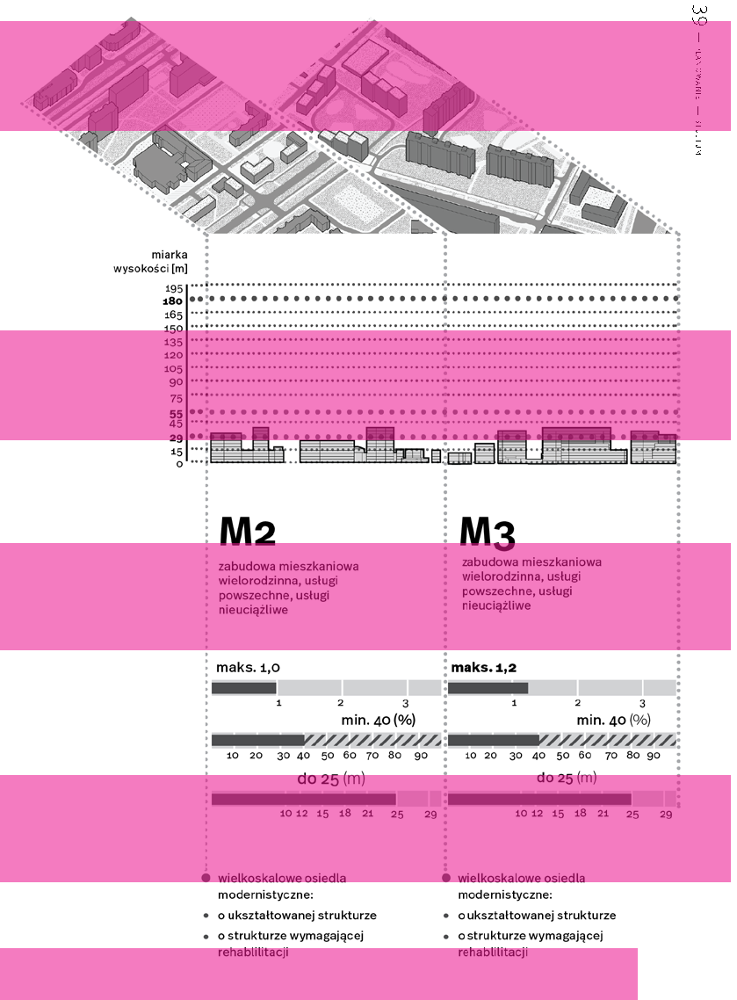
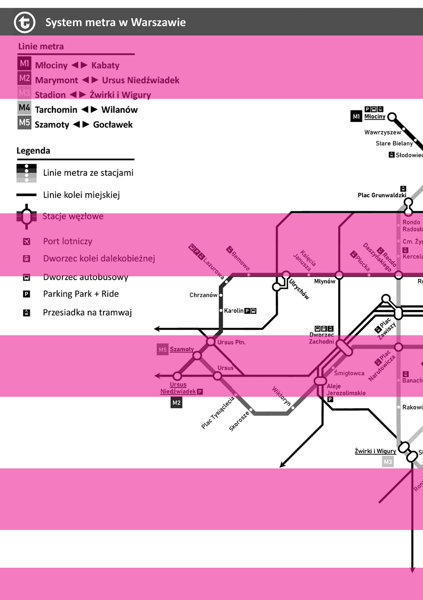
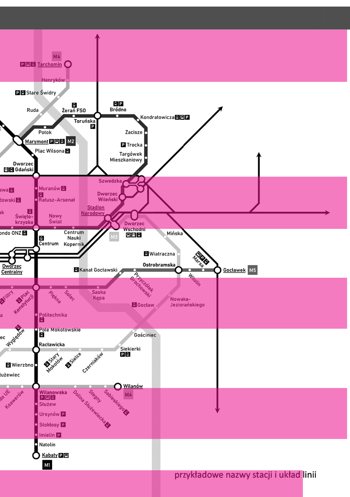

### 39 — — planowaniestudium

# RÓW N O U PR AW N I E N I E WSZ YS T K I CH U CZ E S T N I KÓW RU CH U

# ~

z Bartoszem Rozbiewskim, rozmawiała: Zofia Piotrowska wicedyrektorem Biura Architektury i Planowania Przestrzennego Warszawy

~ Jak wyglądała interdyscyplinarna praca nad Studium w kontekście transportu? Czy udało się rozwiązać bolączki Warszawy, czyli problemy przesiadkowe?

obecnie węzeł komunikacyjny w centrum. Jednakże mam nadzieję, że w przyszłości będzie on oferował podziemne przesiadki między trzema stacjami: Dworcem Centralnym, Dworcem Śródmieście oraz stacją metra Centrum. Miasto planuje we współpracy ze stroną kolejową wybudować łącznik podziemny, który umożliwi przejście od wyjścia z metra z poziomu

Węzły przesiadkowe są oczkiem w głowie całej polityki mobilności. Transport publiczny to najbardziej efektywny sposób podróżowania po mieście. Jeśli nie zapewnimy mieszkańcom wygodnej przesiadki, wybiorą inny środek transportu, na przykład samochód. Staraliśmy się kształtować Studium tak, żeby w pełni wykorzystać efekt wysokiej wydajności różnych form transportu publicznego – w szczególności szynowego. Naszym zadaniem nie jest projektowanie węzłów w detalu, lecz ustalanie zasad, którymi należy kierować się podczas ich tworzenia i poprawiania już istniejących.

WDROŻENIE ZAŁOŻEŃ STUDIUM DO 2050 R. POZWOLI NA ZOPTYMALIZOWANIE SIECI TRANSPORTU SZYNOWEGO W TAKI SPOSÓB, ABY AŻ 80% MIESZKAŃCÓW BYŁO W ZASIĘGU WYGODNEGO DOJŚCIA PIESZEGO DO STACJI TRAMWAJU, KOLEI LUB METRA

~ Jakie to zasady?

peronu, bez konieczności wychodzenia na powierzchnię aż do samego Dworca Centralnego. Mam nadzieję, że przy okazji uda nam się rozwiązać problem Patelni [przyp. red. przestrzeń przed wejściem

Priorytetem jest minimalizacja odległości i czasu potrzebnego na przesiadkę oraz zapewnienie przejścia na jednym poziomie. Negatywnym przykładem jest do metra Centrum]. Forma architektoniczna musi być dostosowana do obecnych czasów, pytaniem będzie: jak przy takiej transformacji zachować wartości społeczne?

zrealizowana jako ostatnia, nasi eksperci z firmy ILF Consulting Engineers sugerują, aby odcinek zachodni nie był prowadzony pod ziemią, lecz realizowany przy użyciu lekkiej kolei naziemnej. Oczywiście oprócz rozbudowy sieci metra i kolei nadziemnej przewidujemy także rozszerzenie zasięgu linii tramwajowych.

### 41 — — planowaniestudium

Wdrożenie założeń Studium do 2050 r. pozwoli na zoptymalizowanie sieci transportu szynowego w taki sposób, aby aż 80% mieszkańców było w zasięgu wygodnego dojścia pieszego do stacji tramwaju, kolei lub metra, które będzie dostępne w 17 z 18 dzielnic miasta.

Obecnie trwają przygotowania do wykonania fragmentu M3 na Gocław. Z kolei prezydent bardzo zainteresował się linią M4, która w skali całego miasta będzie przewozić najwięcej pasażerów. Nawet więcej niż istniejąca linia M1 o przebiegu północ–południe. Jeśli spojrzymy na mapę trasy linii M4 i przeanalizujemy obszar, przez który będzie ona przebiegać, to trudno sobie wyobrazić, aby została zbudowana na powierzchni ziemi lub na estakadzie. Obszary te są bardzo gęsto zaludnione i zabudowane, co uniemożliwia dokonanie kosztownych i radykalnych zmian w infrastrukturze oraz pochłania ogromne ilości betonu.

~ Wygodnego to znaczy jakiego?

Za wygodne przyjmujemy 10 minut dojścia, czyli stacja transportu szynowego w promieniu jednego kilometra od miejsca zamieszkania. Taka jest skala oddziaływania metra, którą określamy po zachowaniach mieszkańców. Jest to istotna różnica w porównaniu do transportu autobusowego, który często nie oferuje wystarczającej niezawodności czy punktualności, aby zmotywować do podejmowania 10-minutowych spacerów do przystanków. Mówię oczywiście o mieszkańcach, którzy nie mają ograniczonej mobilności.

Metro warszawskie zmieniło podejście do kształtowania stacji. Widać to na projektach koncepcyjnych linii M3. Deklaruje, że odchodzi od budowania podziemnego miasta i tuneli, które wychodzą za wszelką cenę na wszystkie strony skrzyżowania. Projekty są bardziej skoncentrowane na ułatwieniu przesiadek dla pasażerów już na powierzchni terenu. Trzeba będzie dostosować skrzyżowania do takich potoków pasażerów, jakie będą się wylewać z metra. Będziemy nad tym pracować w projektach dla poszczególnych stacji. Metro jest niestety budowane w trybie specustawy kolejowej, która w zasadzie zmusza inwestora do tego, żeby odtwarzał stan zastany na powierzchni w dniu wejścia na budowę. W tym kontekście musimy jako miasto przygotowywać osobną procedurę, która pozwoli przygotować istotne przekształcenia na powierzchni i tę przestrzeń uzdrowić. Obecnie to dotyczy metra Wiatraczna czy metra Dworzec Wschodni.

~ Dlaczego zdecydowano się na wykorzystanie metra jako podstawowego środka transportu mimo jego wyższych kosztów, negatywnych skutków dla środowiska oraz długiego czasu realizacji? Dlaczego nie postawiono na tramwaje lub szybkie autobusy?

Analizy do Studium wskazały korytarze, przez które powinny przebiegać najbardziej wydajne środki transportu. Jeśli chodzi o korytarze, w których przemieszcza się w szczycie komunikacyjnym powyżej 5 tys. osób, można myśleć o obsłudze najskuteczniejszymi środkami transportu miejskiego, jakimi są metro i kolej. O tym, które z rozwiązań przyjmiemy dla konkretnych linii, będziemy decydować w momencie przystąpienia do realizacji projektu. Przykładowo, dla linii M5, która prawdopodobnie zostanie

### 4233 —RZUT+

## Odwrócona piramida transportowa

PIESZY

ROWER

TRANSPORT ZBIOROWY

CARPOOLING / CARSHARING/ TAXI

SAMOCHÓD INDYWIDUALNY

~ Czy lokalizacja stacji jest powiązana z zasobami gruntowymi tak, żeby miasto jako inwestor mogło korzystać z zysków rynkowych, które przynosi metro?

zawdzięcza liniom kolejowym. To wzdłuż nich na przełomie XIX i XX w. zaczęły powstawać pod Warszawą nowe miejscowości, osiedla czy miasta ogrody, których znaczna część została czasem włączona w granice Warszawy (Włochy, Ursus, letniska wzdłuż linii otwockiej). Linie kolejowe były wyznaczane jako osie rozwoju warszawskiego zespołu miejskiego w dokumentach planistycznych już w latach 20. XX w. Dziś jednak węzeł kolejowy nadal nie jest w pełni wykorzystywany. Jest tak rozbudowany, że mógłby być lepiej zintegrowany z komunikacją miejską. Na szczęście spółka PKP PLK ma ambicje, aby poprawić funkcjonowanie węzła kolejowego w Warszawie, i w tej chwili są prowadzone studia rozwojowe wszystkich tras wybiegowych z miasta. Widać, że kolej chce budować nowe przystanki i uzupełniać sieć. Prowadzi dużą pracę koncepcyjną nad nową linią średnicową, która ma pozwolić sprawnie przejechać przez Warszawę komunikacji kolejowej dalekobieżnej i poprawić funkcjonowanie komunikacji aglomeracyjnej. Szczególnie istotne jest rozdzielanie kolejowego ruchu aglomeracyjnego i regionalnego od dalekobieżnego. Chcemy to wykorzystać. Zwracamy natomiast uwagę stronie kolejowej, żeby nie kolidowała z wyznaczonymi przez nas korytarzami, ponieważ uważamy, że są w nich tak duże potoki, że powinny być obsługiwane najbardziej niezawodnym środkiem transportu, a kolej ma swoje ograniczenia i uwarunkowania techniczne. Metro jest we własnym tunelu i nie musi się liczyć z ruchem, nie przecina się z innymi przewoźnikami.

### 43 — — planowaniestudium

Badaliśmy miasto pod względem funkcjonalności korytarzy, w których pasażerowie będą się przemieszczać, a nie pod względem zasobu miejskich gruntów. Oczywiście, przy planowanych stacjach mamy wiele inwestycji miejskich. Można przytoczyć przykład linii M4, która zapewni rozwój dużego fragmentu Białołęki, zwłaszcza na starych Świdrach. Tak się składa, że niezależnie od tego, jak było planowane i trasowane metro, miasto jest beneficjentem wzrostu wartości nieruchomości i poprawy jakości przestrzeni wokół stacji. Ale nie było naszym założeniem projektowym, żeby wiązać ze sobą grunty miejskie w ten sposób.

~ Jak unikać sytuacji, w których stacje służą niewielkiej liczbie mieszkańców, jak np. stacja Zacisze?

Nasze podejście do trasowania metra było pragmatyczne, wręcz aptekarskie. Wiemy, jaka jest metodyka przyznawania środków unijnych na tego typu inwestycje. Wiemy, że musimy w bardzo dużym stopniu oprzeć się na tym, jakie potoki będą generowane na poszczególnych odcinkach, i nie ma możliwości, żeby w nowych liniach powtórzyła się sytuacja z Zacisza. Natomiast na przykład linia M5, zwłaszcza na odcinku zachodnim, w dużym stopniu jest wytrasowana przez niezbyt intensywnie zagospodarowane rejony. Chcemy tam wykorzystać oddziaływanie metra w prorozwojowym kierunku, żeby stało się przyczynkiem nowego pasma miejskiego o dość intensywnej zabudowie opartej na planowaniu zorientowanym na transport zbiorowy.

Dzięki temu, że mamy pełnomocnika do spraw kolejowych, ta współpraca wygląda coraz lepiej. Rząd ma dość spore pieniądze przeznaczone na rozwój warszawskiego węzła kolejowego. Gdyby poprawiły się realizacja i przygotowanie, to za 30 lat kolej będzie miała dużo większe znaczenie w przemieszczaniu się po mieście niż dzisiaj. My jako samorząd już dziś wykorzystujemy istniejący potencjał

~ Czy w ostatnim czasie rola kolei w mieście się zmienia?

Aglomeracja warszawska swój charakterystyczny gwiaździsty układ przestrzenny infrastruktury kolejowej. Warszawa jako jedyna gmina w Polsce ma własnego przewoźnika kolejowego (SKM). Ponadto od wielu lat finansujemy wspólny bilet, który umożliwia podróżowanie pociągami regionalnymi (KM i WKD) po aglomeracji warszawskiej na podstawie Warszawskiej portu zbiorowego, co nie jest oczywistym wnioskiem. Należałoby spodziewać się, że transport zbiorowy w mieście, w którym jest 800 pojazdów na tysiąc mieszkańców, nie będzie funkcjonował. A jest inaczej. Mieszkańcy kupują samochody być może dla swojej wygody, być może na użytek okazjonalny albo specjalny, ale w życiu codziennym ich nie wykorzystują w takiej skali. Eksperci szacują, że 20 do 30% zarejestrowanych samochodów to są auta flotowe, które nie jeżdżą po Warszawie, ale po całej Polsce. Jednak nawet po odjęciu tych pojazdów okazuje się, że mamy znacznie więcej samochodów niż np. w Amsterdamie czy Berlinie. Właśnie dlatego szykujemy dla mieszkańców bogatą sieć transportu zbiorowego szynowego, żeby była alternatywa. Za tym muszą pójść wygodne przesiadki i utrzymanie standardu, który mamy obecnie. Częstotliwość kursowania transportu w Warszawie nawet na peryferiach jest dużo lepsza niż w centrach niektórych dużych miast w Polsce. Niestety działania planistyczne włodarzy dzielnic warszawskich z okresu transformacji spowodowały, że w stolicy jest bardzo dużo obszarów, które są systemowo uzależnione od samochodu, a transport publiczny ze względu na ich rozproszoną urbanistykę i niską gęstość zabudowy nie ma tam ekonomicznej racji bytu.

### 4433 —RZUT+

NALEŻAŁOBY SPODZIEWAĆ SIĘ, ŻE TRANSPORT ZBIOROWY W MIEŚCIE, W KTÓRYM JEST 800 POJAZDÓW NA TYSIĄC MIESZKAŃCÓW, NIE BĘDZIE FUNKCJONOWAŁ. A JEST INACZEJ

Karty Miejskiej. Mam nadzieję, że za tym pójdą też inne działania związane z integracją rozkładu jazdy transportu publicznego z przyjazdami pociągów. Nie wszędzie wygląda to tak dobrze jak np. w Wesołej, gdzie faktycznie autobusy jeżdżą pod dyktando pociągów i na odwrót. Nie ma pustych przejazdów.

~ Czy kolej ma szansę stać się korytarzem, który służy przemysłowi czy logistyce?

Kolej służyła i nadal służy logistyce, ponieważ mamy trzy duże bocznice kolejowe, na których odbywa się przeładunek. Gorzej jest z wykorzystaniem dowozu bezpośrednio do zakładów przemysłowych. Te bocznice stopniowo ulegają degradacji i nie są wykorzystywane. Ma to związek z dużo większą elastycznością transportu ciężarowego.

~ Jakich jeszcze narzędzi używa miasto, żeby wspierać politykę odchodzenia od samochodów?

Zapisy dotyczące polityki parkingowej nie będą bezpośrednio zawarte w Studium, ale zostaną opisane zalecenia dotyczące jej kształtowania. Chcemy, aby wartości liczbowe i szczegóły były każdorazowo określone przez zarządzenia prezydenta. To pozwoli na szybkie reagowanie na zmieniające się potrzeby i dynamiczną sytuację w mieście. Chcemy, aby polityka parkingowa była bardziej zróżnicowana i dopasowana do potrzeb miasta. Obecnie mamy trzy duże strefy parkingowe: śród-

~ Dlaczego mimo że transport publiczny jest rozwinięty i dość wygodny w użytkowaniu, liczba samochodów w stosunku do liczby mieszkańców cały czas rośnie?

Ponieważ nie ma żadnych form nacisku ekonomicznego sprzyjających rezygnacji z posiadania samochodu. Jednak przy dużym odsetku pojazdów na mieszkańca mamy bardzo duże wykorzystanie transmiejską, miejską i podmiejską. Jednak istnieją miejsca, w których zapotrzebowanie na transport samochodowy jest znacznie mniejsze, niż sądzimy. W miejscach, gdzie transport zbiorowy działa sprawnie i jest powszechnie dostępny, nie będzie konieczne utrzymywanie tak wysokich wskaźników parkingowych, jakie były stosowane dotychczas. W tym celu przygotowujemy algorytmy, które pozwolą na automatyczne regulowanie liczby miejsc parkingowych w zależności od sprawności lokalnego transportu zbiorowego. Wierzymy, że odpowiednia dostępność i liczba miejsc parkingowych ma duży wpływ na mobilność mieszkańców i ich decyzje dotyczące wyboru środka transportu. W Studium są zawarte również ważne zapisy dotyczące zasad i wartości projektowania, takich jak np. miejsca parkingowe dla rowerów. Zgodnie z nimi miejsca te powinny być łatwo dostępne, od wyjścia w budynku, zadaszone i nie ukryte w garażach czy na strychach, ale równoprawnie dostępne jak samochód w garażu podziemnym. Będziemy wymagać, żeby takie rzeczy były uwzględnione na poziomie projektowym.Niezbędne rozwiązanie, które w niektórych warunkach atmosferycznych jest niedostosowane, po przebudowie ulic i placów odkryją nową jakość. Po tych ulicach będzie po prostu przyjemnie jeździć. Z jednej strony zielone aleje mają zapewnić cień w czasie upału, z drugiej mniejszy hałas i spaliny spowodują zainteresowanie innymi środkami lokomocji niż samochód.

### 45 — — planowaniestudium

~ Rada miasta miała ogromne problemy z podniesieniem cen strefy parkowania.

Jest to kwestia polityczna. Gdybyśmy wraz z założeniami przestrzennymi mieli do dyspozycji rozwiązania fiskalne, byłoby na pewno łatwiej. Wzrost cen paliw i ubezpieczeń oraz koszty parkowania, które wynoszą ponad 50 zł dziennie, stanowią znaczne wydatki i dają do myślenia. W tym kontekście, wraz z ogólnym wzrostem inflacji, rachunek ekonomiczny zysków i strat stawia transport publiczny na dość atrakcyjnej pozycji względem transportu indywidualnego. Przypomnę, że ceny biletu się nie zmieniły od ponad 10 lat, a transport publiczny znacząco poprawił jakość, częstotliwość i niezawodność. Wydaje mi się, że samochód będzie stopniowo tracił na popularności ze względów jakościowych i makroekonomicznych. Nawet jeśli będzie postępować elektryfikacja aut indywidualnych, to posiadanie ich będzie dość kosztowne. Rozwiązania związane z transportem jako usługą będą się rozwijać, a miasto będzie dążyć do wprowadzenia aplikacji, która umożliwi wybór optymalnej trasy pod względem czasu i kosztów, aby ułatwić wybór środka podróży za pomocą jednego narzędzia.

- będą zmiany w planowaniu ulic i placów w Warszawie, a pojemność komunikacyjna centrum będzie się zmniejszać. Nie będzie tak, że w mieście będziemy mieli więcej miejsc parkingowych niż dzisiaj, a samochody będą miały więcej miejsca do postoju – będzie tego miejsca mniej. To pozwoli nam przekształcić uli-

- cę w miejsce, gdzie wszyscy uczestnicy ruchu czują się tak samo dobrze i bezpiecznie. Co za tym idzie mieszkańcy, którzy może do tej pory myśleli o rowerze, ale trochę się obawiali i uważali, że to jest

TO POZWOLI NAM PRZEKSZTAŁCIĆ ULICĘ W MIEJSCE, GDZIE WSZYSCY UCZESTNICY RUCHU CZUJĄ SIĘ TAK SAMO DOBRZE I BEZPIECZNIE

~ Czy niższe wskaźniki miejsc parkingowych dla zabudowy mieszkaniowej nie spowodują większego zatłoczenia parkowania samochodów na ulicach?

Są dwa klucze do tego, żeby tak się nie stało. Pierwszy, za który nasze biuro może odpowiadać, to urządzenie ulicy. Każdą ulicę można tak zagospodarować, że nie będzie

możliwości zostawienia na niej samochodu w miejscu niedozwolonym choćby na sekundę. Niekoniecznie trzeba ją osłupkowywać. Można stawiać różnego rodzaju przeszkody, które jednocześnie nie będą barierą dla pieszego czy rowerzysty. Widać to po ulicach, które są oddawane w ostatnim czasie. Urządzenie pasa drogowego ma dużo wspólnego z tym, czy odbywa się na nim nielegalne parkowanie. Powołując się na przypadek Browarów Warszawskich – wszystkie chodniki na nowej ulicy wewnętrznej są zastawione samochodami. Wygląda to fatalnie i nie przystaje do jakości całego założenia. Inwestor mógł zaplanować urządzone i legalne miejsca postojowe, a chodniki zabezpieczyć przed parkowaniem. Zakładamy, że drugim wanym elementem jest egzekwowanie przepisów prawa o ruchu drogowym oraz szybka reakcja straży miejskiej na ich łamanie. Wiemy, że to temat trudny politycznie, ale jeśli nie będziemy wymagali przestrzegania zasad, to nasza polityka mobilności nie będzie skuteczna. Te dwa filary pozwoliłyby ograniczyć ewentualne skutki przy poruszania się samochodem po mieście. Obecne przyzwyczajenia mieszkańców do swobodnego korzystania z samochodów będą musiały się zmieniać. Im szybciej, tym lepiej dla naszego zdrowia i jakości powietrza. Ograniczona przestrzeń i zwiększająca się liczba samochodów sprawiają, że nie da się pomieścić wszystkich pojazdów mieszkańców. W takiej sytuacji cierpią przestrzenie publiczne oraz ci, którzy mają inne potrzeby niż przemieszczanie się samochodem.

### 4833 —RZUT+

~ Czy istnieje tak zwane lobby samochodowe, które blokuje wprowadzenie zmian?

Nie jestem pewien, czy można to nazwać lobby, ponieważ wydaje mi się, że niczyim celem nie jest to, aby poruszanie się samochodem było jedynym sposobem przemieszczania się. Raczej wykorzystuje się samochód, ponieważ było to łatwiejsze, prawie bezkosztowe, jeśli chodzi o parkowanie, i mniej problematyczne. Jednakże ma skutki uboczne dla wszystkich mieszkańców, w tym dla ich zdrowia, komfortu klimatycznego i dla jakości przestrzeni publicznej.

NA PEWNO MIESZKAŃCY SIĘ PRZYZWYCZAILI DO NIEOGRANICZONEGO I BEZKOSZTOWEGO PORUSZANIA SIĘ SAMOCHODEM PO MIEŚCIE. OBECNE PRZYZWYCZAJENIA MIESZKAŃCÓW DO SWOBODNEGO KORZYSTANIA Z SAMOCHODÓW BĘDĄ MUSIAŁY SIĘ ZMIENIĆ

~ Jak to się udało, że po tylu latach bezskutecznych nawoływań ruchów miejskich i aktywistów powstał w końcu plan przebudowy dwóch tak zwanych ścieków komunikacyjnych – Alei Jerozolimskich i ul. Marszałkowskiej?

Nastąpiły zmiany organizacyjne w urzędzie – polityka mobilności stała się częścią planowania przestrzennego. Przez wiele lat osobne jednostki miejskie odpowiadały za urbanistykę, osobne za transport. Dzisiaj mówimy szerzej – o mobilności. Spowodowało to zwiększenie wrażliwości w mieście na to, aby uwzględniać potrzeby wszystkich użytkowników, i stało się katalizatorem szybkich zmian. Nie są to jakieś wielkie przebudowy, lecz małe przedsięwzięcia. Odnosząc się do ul. Marszałkowskiej w Warszawie, być może w przeszłości trudnością było przygotowanie zmianach w zakresie polityki parkingowej. Dopiero wszystkie te elementy działające jednocześnie spowodują, że samochód nie będzie pierwszym wyborem mieszkańców.

~ Czy istnieje konflikt między założeniami polityki mobilności a tym, czego oczekują mieszkańcy?

Na pewno mieszkańcy przyzwyczaili się do nieograniczonego i bezkosztowego

### 49 — — planowaniestudium

#### Wybrane modelowe przekroje ulic tworzących ,,zieloną sieć”

ZIELONE ALEJE

1 2 10 10 7 4 8 7 10 10 3/4

2 1 5 5

3/4 4/6 9/4

6/4

ZIELONE WJAZDY DO MIASTA

11 4 7 4 7 4 11

ULICE Z PARKAMI LINEARNYMI

| | |
|---|---|
| | |

| | |
|---|---|
| | |

1 4 12 5 4 8 9/4 7 4 5 1

ZIELONE PIERŚCIENIE

| | | | | |
|---|---|---|---|---|
| | | | | |

4 5 2 4

strefa frontowa budynku strefa piesza pas społeczno-kulturowy strefa zieleni droga rowerowa miejsce postojowe jezdnia z pasami ruchu zielone torowisko przystanek tramwajowy pas buforowy

- 1
- 2
- 3
- 4
- 5

- 6
- 7
- 8
- 9
- 10

przestrzeń współdzielona w ruchu pieszym i kołowym

- 11
- 12

rozwiązania oparte na przyrodzie przebudowy całych ulic. Dzisiaj wiadomo, że łatwiej jest przebudowywać małymi kroczkami. Wprowadzanie punktowych interwencji pokazuje mieszkańcom zmianę i kierunek, w którym można pójść. Przykładem takich małych zmian mogą być przejścia dla pieszych zamiast przejść podziemnych, jak to miało miejsce przy rondzie Dmowskiego. Wielu mieszkańców korzysta z tych zmian i docierają do nas pozytywne opinie na temat poprawy jakości przemieszczania się w tym rejonie. Z kolei za chwilę pod Alejami Jerozolimskimi będzie wielka dziura wynikająca z modernizacji linii średnicowej na odcinku od ronda de Gaulle’a do Ochoty. Poruszanie się będzie utrudnione o tyle, że ulica przestanie istnieć w obecnym kształcie. Pojawi się szansa, żeby zbudować ją na nowo. Miasto już szykuje nakładkę. Ma ona spowodować, że Aleje Jerozolimskie staną się wreszcie pełnoprawną ulicą miejską. Wyposażamy je we wszystkie elementy pozwalające w tej przestrzeni przebywać, a nie tylko przez nią przejeżdżać.

mieszkańców. Jednakże ze względu na kameralny charakter tych przestrzeni, dostosowanych do potrzeb lokalnej społeczności, nie chcemy, aby ludzie docierali tam samochodami. Dlatego wprowadzenie daleko idących zmian będzie musiało obejmować nie tylko jakość przestrzeni czy bezpieczeństwo, lecz także mobilność i rozwiązania dla wszystkich użytkowników ruchu. W tych miejscach komunikacja samochodowa będzie miała ograniczony dostęp. W tych największych centrach dzielnicowych będziemy starali się wykorzystać narzędzie, które w Studium przybrało roboczą nazwę stref ruchu lokalnego. Polegałoby na tym, że byłaby zachowana możliwość dojazdu własnymi pojazdami, natomiast uniemożliwiony byłby przejazd tranzytem. Ideowo celem jest umożliwienie dojazdu samochodem do centrum lokalnego i skorzystanie ze wszystkich udogodnień. Natomiast przez mądre i umiejętne wyłączenie pewnych odcinków ulic z ruchu kołowego i wprowadzenie rozwiązań pętlowych odciążymy jądro centrum. Nie wiem, czy wszystkie centra od razu otrzymają takie rozwiązania, bo to wymagałoby przebudowy ulic i placów, natomiast na pewno miasto nie zapomina o miejscach poza centrum.

### 5033 —RZUT+

~ Ile czasu ma trwać ta przebudowa?

Kolejarze – z tego, co wiem – rewidują swoje plany. Aktualnie planują skończyć w 2029 r. Z dużym prawdopodobieństwem do 2030 r. ta zmiana nastąpi, bo przebudowa średnicy jest miastu potrzebna, żeby zwiększyć częstotliwość kursowania pociągów aglomeracyjnych.

~ Czyli mamy oczekiwać, że zamiast konkursu na plac Konstytucji będzie konkurs na nowy plac w Białołęce albo Ursusie?

~ W kontekście policentryczności, którą zakłada Studium, czy takie zmiany też dzieją się poza centrum?

Mam nadzieję, że nie zamiast, lecz równolegle będziemy ogłaszać konkursy na place śródmiejskie i te o bardziej kameralnej roli w mieście. Miejmy nadzieję, że znajdą się pieniądze na to i na to.

Miasto Warszawa i biuro odpowiedzialne za przestrzenie publiczne przygotowały program atrakcyjnych przestrzeni publicznych. Ma on dwa cele operacyjne. Pierwszy z nich skupia się na Nowym Centrum Warszawy (NCW), a drugi ma na celu poprawę przestrzeni publicznych w dzielnicach. Wskazane w Studium centra dzielnicowe, lokalne, będą miejscami atrakcyjnymi dla

~ Jak to zrobić, żeby to planowanie wyprzedzało rzeczywistość? Problemem Warszawy jest to, że plany czy regulacje pojawiają się, kiedy już wszystko zostało wybudowane.

Niestety w planowaniu ciągle gonimy króliczka, a nie pokazujemy, dokąd ma

