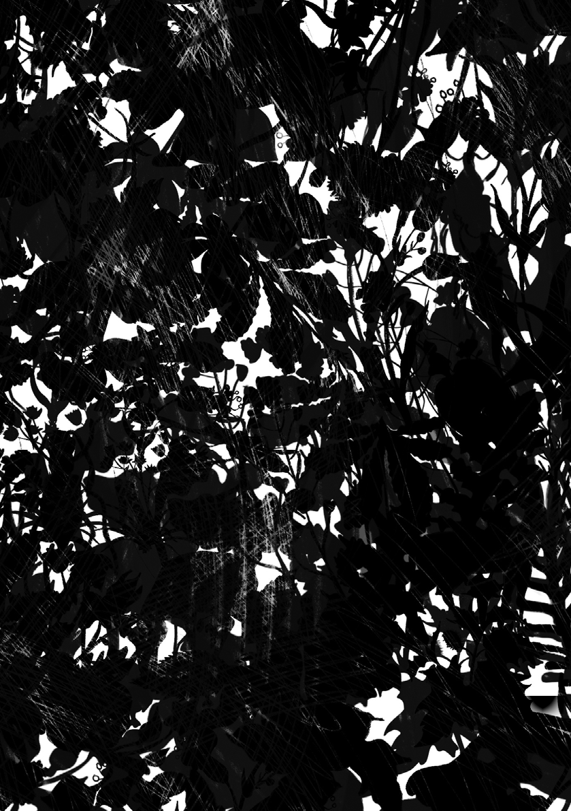

ambicję, czym Warszawa ma się stać. Ma być zieleńsza, zdrowsza, bardziej komfortowa i mieć swoją silną warszawską tożsamość. Ma umożliwiać inny – mądrzejszy i nastawiony na jakość – rodzaj rozwoju ekonomicznego niż do tej pory.

– bardziej kompleksowe projekty. Projekty mixed-use, projekty partnerstw publiczno-prywatnych, projekty, w których różne typy zabudowy się przenikają, dlatego też wymagają bardziej złożonego projektowania. Studium przewiduje moim zdaniem, że tego typu projekty będą się pojawiać i będzie ich coraz więcej. Pokazuje też, na których terenach to się będzie mogło odbywać. Właśnie po to, żeby dogęszczać istniejące centrum, a nie rozlewać się dalej.

## 55 — — planowaniestudium

~ Opinia publiczna często krytycznie odnosi się do roli deweloperów w mieście. Jak ten dokument ustosunkowuje się właśnie do tego, jak funkcjonuje ten rynek?

Potrzebna jest równowaga między tym, że musimy budować, ponieważ miasto rośnie, a tym, żeby to, co budujemy, miało dobrą jakość. Nowe Studium bardzo mocno idzie w stronę jakości. I to się przejawia na wielu płaszczyznach.

~ Współpracował pan z kierunkiem Real Estate Development and Design na Uniwersytecie w Berkeley, w jaki sposób doświadczenia stamtąd można przełożyć na obecne warszawskie realia?

Pierwsza płaszczyzna jest taka, że nie wszędzie można budować – pojawiają się tereny wyłączone spod zabudowy.

Miasta Kalifornii mają wiele poważnych problemów, takich jak ceny mieszkań, rozdrobnione przestrzenie publiczne czy brak dobrego transportu. Wydział Real Estate Development and Design powstał właśnie po to, żeby częściowo im zaradzić. Jednego warto od nich się uczyć – kompleksowego podejścia do projektowania i tworzenia mechanizmów współpracy między sektorami.

Druga sprawa jest taka, że Studium określa również nowe typy obszarów do intensywnej zabudowy. Uruchamia tereny przemysłowe, kolejowe, centrów handlowych, usługowe.

I trzecia sprawa jest taka, że ta zabudowa będzie inna niż dotychczas. Planiści zaproponowali mądre dogęszczanie już zabudowanych terenów.

W Warszawie jest coraz mniej działek do zabudowy i dobre budowanie będzie wymagało coraz bardziej wysublimowanych rozwiązań. Skończyły się czasy „dywanowej” zabudowy zupełnie pustych terytoriów: w najbliższej dekadzie deweloperzy będą zmuszeni budować na mniejszych i bardziej skomplikowanych działkach. Czekają nas o wiele bardziej złożone projekty – łączące różne funkcje i negocjowane pomiędzy stronami publiczną i prywatną. Będzie to się odbywać w formacie partnerstw publiczno-prywatnych, lex developer lub jeszcze innego prawa, które może zostać w przyszłości wprowadzone. Im lepiej nauczymy się współpracować przy tak skomplikowanych projektach, tym lepszy będzie ich rezultat •

Mądre w tym sensie, że pozostawiające istniejącą jakość. I mądre też w tym sensie, że Warszawa jest typologicznie bardzo różna. Jej fragmenty mają zabudowę o różnym charakterze, więc inaczej Studium proponuje dogęszczać osiedla z wielkiej płyty, inaczej zabudowę z XIX w., a jeszcze inaczej z ostatnich 30 lat. Jednocześnie wykorzystuje atuty każdego z typów zabudowy.

Przykładem mogą być osiedla z wielkiej płyty, których plusem jest zieleń. Ta zieleń musi zostać zachowana, ale trzeba je dogęścić na przykład terenami usługowymi i handlowymi, których tam brakuje. Dokładnie odwrotnie jest w przypadku osiedli z lat 90. czy 2000.

Rezultatem będzie to, co już w tej chwili zaczynamy obserwować w Warszawie

# S P O Ł ECZ N A W R A Ż L I WOŚ Ć

# ~

z prof. Markiem Krajewskim, rozmawiał: Igor Łysiuk socjologiem, zatrudnionym na Wydziale Socjologii UAM w Poznaniu

~ Co jest dla pana najważniejsze w nowym Studium Warszawy? Który aspekt, obszar problemowy dobrze, że został w nim poruszony?

tych bardzo licznych kwestii, to tego, że ten dokument jest trochę mało czuły na różnice klasowe.

Kolejna istotna rzecz to dostrzeżenie tego, że w mieście nie mieszkają wyłącznie ludzie, że w pewnym sensie przestrzeń odebraliśmy przyrodzie. Ten dokument planuje rozwój miasta w taki sposób, żeby ta nasza koegzystencja była bardziej harmonijna, żeby również zostawić jakieś dzikie tereny przestrzeni miejskiej oraz zadbać o zwierzęta, które w mieście są obecne.

Niezwykle dobrze się stało, że dostrzeżono cały szereg problemów trawiących współczesne miasta, również Warszawę. Chciałem bardzo pochwalić, podkreślić wysoką jakość diagnozy, która została na potrzeby Studium przeprowadzona.

To jest świetny podręcznik mapujący podstawowe dylematy, problemy, z którymi miasta dzisiaj się borykają. Rozlewanie się miast, ich niekontrolowany wzrost, dominacja ruchu samochodowego, degradacja przestrzeni publicznych na skutek jej nadmiernej, neoliberalnej eksploatacji. To jest również ogromne społeczne zróżnicowanie miast, którego bardzo często się nie dostrzega, kiedy planuje się ich rozwój. W tym ruchy migracyjne i starzenie się społeczeństw. Dostrzeżono narastającą singlizację życia społecznego, ona jest bardzo ważnym wyzwaniem. Jedyne, czego mi tak naprawdę brakowało wśród

~ Jak pana zdaniem Studium odnosi się do struktury społecznej Warszawy zarówno dziś, jak i w dłuższej perspektywie? Czy miasto stanie się bardziej inkluzywne i będzie odpowiadało na potrzeby różnych grup społecznych?

Bardzo mi się podoba idea miasta policentrycznego, akcentującego to, co w Studium jest nazywane wygodną lokalnością. Dostępność podstawowych usług w bardzo bliskim otoczeniu, zhierarchizowanie funkcji miasta, które odpowiada hierarchii naszych potrzeb.

samej przyrodzie. Ten aspekt zostaje mocno w tym Studium wydobyty.

57 — — planowaniestudium

Bardzo duży nacisk jest położony na kwestię mobilności, w tym transportu publicznego, elektromobilności oraz ruJest to jedno z najważniejszych rozwiązań, które sprawia, że uwzględnia się przede wszystkim potrzeby osób zależnych w różnym stopniu, zwłaszcza tych z niepełnosprawnościami, ale również starszych.

W STUDIUM KŁADZIE SIĘ NACISK NA ROZWÓJ

INFRASTRUKTURY, KTÓRA JEST NIEZBĘDNA DLA ZASPOKOJENIA POTRZEB STARZEJĄCEJ

Miasto zostaje podzielone na wiele obszarów, w których możliwe jest zaspokojenie podstawowych potrzeb bez konieczności przemierzania całej Warszawy. Oczywiście widzę też pewnego rodzaju niebezpieczeństwa w tej idei policentryczności. Tam, gdzie próbuje się wzmacniać tożsamość, rodzi się więź i współodpowiedzialność za przestrzeń, ale też pewne lokalne rywalizacje.

SIĘ CZĘŚCI SPOŁECZEŃSTWA

chu pieszego. Czasami są to rewolucyjne założenia dotyczące centrum, np. zmniejszanie liczby pasów drogowych, co może się wydawać nieintuicyjne w kontekście korków. Ewidentnie w tym Studium zwrócono szczególną uwagę na uprzywilejowanie ruchu pieszego i rowerowego oraz wypychanie ruchu samochodowego, zwłaszcza z centralnych części miasta.

Zmorą takich miast jak Warszawa, Kraków czy Gdańsk jest specyficzna temporalność. Rytmy funkcjonowania użytkowników i mieszkańców są częstokroć różne i konfliktowe, w Warszawie to jest na przykład konflikt wokół bulwarów wiślanych. W Studium dostrzega się, że bardzo często skonfliktowane są potrzeby mieszkańców danego miejsca i użytkowników przyjezdnych. Przestrzeń jest planowana w taki sposób, żeby mediować między funkcjami usługowymi i związanymi z potrzebami mieszkańców.

Wydobyty zostaje również aspekt związany ze starzeniem się społeczeństw. To jest wyzwanie, o którym nie chcę powiedzieć, że rzadko się mówi, ale które jest rzeczywiście bardzo istotne. W Studium kładzie się nacisk na rozwój przede wszystkim takiej infrastruktury, która jest niezbędna dla zaspokojenia potrzeb starzejącej się części społeczeństwa. Tutaj chodzi głównie o bliskość i dostęp do usług medycznych czy też podstawowych sklepów •

~ Horyzont czasowy Studium jest liczony w dekadach. Jakie Studium daje narzędzia do tego, żeby miasto było odporne na zmiany w perspektywie pięciu, dziesięciu czy trzydziestu lat?

Na pewno dostrzega się kryzys klimatyczny. Są tam rozwiązania, które pozwalają nam przynajmniej zmniejszać dotkliwość kryzysu klimatycznego i jego efektów. Z jednej strony próbują miasto schładzać, z drugiej rozwijać zieloną infrastrukturę. Zwraca się uwagę na aspekt dzikości natury. Założone jest stworzenie obszarów w mieście, oczywiście w formie zenklawizowanej, które są pozostawione

