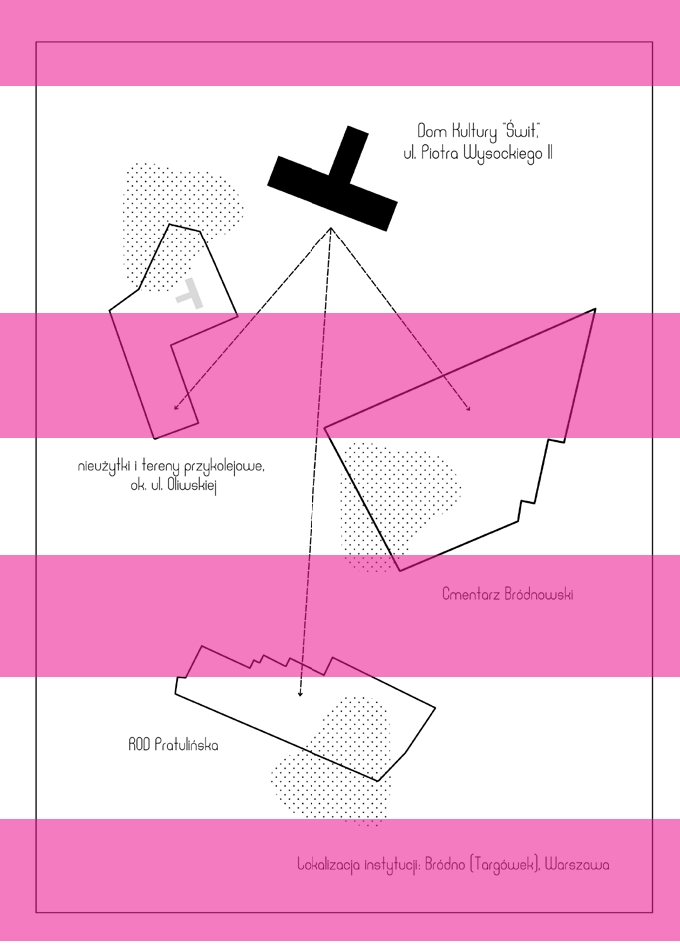
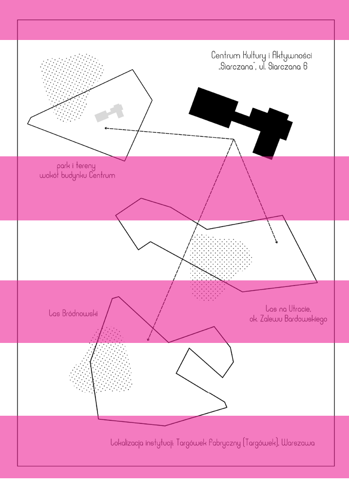

### WYCHODZENIE ZA RÓG

SIECI KULTURY A ZIELONO-BŁĘKITNA INFRASTRUKTURA MIASTA

M A G D A L E N A K R ZO S E K - H O Ł O D Y

# ~

Działalność instytucji kultury związana jest w sposób organiczny z przestrzenią fizyczną, w której funkcjonują. Położenie w obrębie miasta i dzielnicy, powierzchnia i struktura lokalowa oraz specyfika budynku odgrywają znaczącą rolę w kształtowaniu ich programu. Czasem wymienione czynniki są ograniczeniem, innym razem punktem wyjścia dla tworzenia konkretnej tożsamości instytucji1. Niejednokrotnie budynek w jakimś momencie staje się za ciasny i nie stwarza możliwości do dalszego rozwoju. Instytucja przenosi się wtedy poza swoje wytyczone odgórnie granice, wkracza na dziedzińce i skwery, wchodzi na mury i ogrodzenia. Nie tylko ogląda i podsłuchuje rzeczywistość poza siedzibą, ale zaczyna także szukać nowej przestrzeni aktywności w tym, co publicznie dostępne. Wycieczki takie mają na początku charakter nieśmiałych eksploracji, nawiązywania kontaktu i pozyskiwania opowieści. Z czasem stają się sposobem budowania trwałych więzów – zarówno społecznych, jak i przestrzennych. Coraz śmielej wybrzmiewa pytanie: co by się stało, gdyby domem kultury uczynić całe miasto, a więc jego ulice, chodniki, place, tereny zielone?

1 Na przykład duża część oferty warszawskiego Służewskiego Domu Kultury, usytuowanego bezpośrednio w dolinie Potoku Służewieckiego, opiera się na działaniach ekologicznch (projekt Dom Ekologii). Architektura budynku zanurzona jest w otaczającym krajobrazie, a plenerowa część amfiteatralna, nawiązując do rzeźby terenu, przywodzi na myśl dolinę rzeki. Innym przykładem jest oddział Domu Kultury „Praga” – Pałacyk Konopackiego, który mieści się w dawnym mieszczańskim domu. W jego wnętrzach zachowano ogólny układ pomieszczeń, a poszczególne sale nazwane zostały imionami ich poprzednich mieszkańców lub użytkowników. Profil działalności instytucji związany jest w dużym stopniu z historią miejskich rzemieślników, mamy tu pracownię krawiecką czy stolarnię.

Macki sięgające coraz głębiej w tkankę miejską pozwalają instytucji nie tylko na znajdowanie inspiracji i karmienie się nowymi bodźcami, ale także na aktywne pozyskiwanie wiedzy o bliższym i dalszym sąsiedztwie oraz potrzebach jego mieszkańców (nie tylko ludzkich). Analizując te procesy, możemy zaobserwować zmianę zarówno roli, jaką odgrywa sektor kultury, jak i tematów, które stają się dla niego interesujące. W ostatnich latach instytucje kultury zwracają się coraz częściej ku tematom ekologicznym, poddając refleksji relację człowieka ze środowiskiem, oraz zadają pytania o rolę miejskiej przyrody. Przyjmują na siebie zadania edukatorów ekologicznych, które wcześniej realizowane były przez takie jednostki, jak: zoo, ogrody botaniczne, lasy miejskie, uniwersytety czy instytuty badawcze. Opowiadając i współtworząc środowiskową historię swojego sąsiedztwa, instytucje kultury stają się także interesującym polem do badań nad stanem i potencjalnymi kierunkami rozwoju zielono-błękitnej infrastruktury miasta.

przykolejowe czy poprzemysłowe. Mówią nam one wiele o realnych interakcjach i oczekiwaniach mieszkańców dotyczących planowania przestrzeni miejskiej. Stają się sposobem nie tylko na uwrażliwienie ludzi na obecność w ich otoczeniu roślin, zwierząt czy grzybów, ale także na przekazanie im wiedzy o funkcjonowaniu zieleni miejskiej jako systemu naczyń połączonych. Często pomagają również w poprawie ogólnego dobrostanu uczestników poprzez bezinteresowne obcowanie z przyrodą. Biorąc udział w takich wydarzeniach, badacz ma szansę na wysłuchanie głosu mieszkańców oraz obserwowanie ich odczuć i reakcji na konkretne przestrzenie.

## 61 — — planowanieprzyroda sieci kultury

W ofercie warszawskich instytucji kultury z roku na rok można znaleźć coraz więcej wydarzeń związanych z edukacją ekologiczną i eksploracją miejskich terenów zielonych. Upowszechnienie się takich wydarzeń w instytucjach niespecjalistycznych, oddziałujących raczej na określone sąsiedztwo niż specyficzną grupę odbiorców, wskazuje na ważną rolę w budowaniu postaw ludzi wobec przyrody. W dłuższej perspektywie można dzięki nim stworzyć rodzaj mapy pokazującej kluczowe obszary zielono-błękitnej infrastruktury miasta, które postrzegane są przez mieszkańców jako potrzebne i ważne. Mapa taka może także odpowiedzieć na pytanie, jak mogą wyglądać przestrzenie wielofunkcyjne, których potencjał nie ogranicza się jedynie do kilku zdefiniowanych z góry funkcji rekreacyjnych.

W 2022 r. przeprowadziłam pilotażową analizę działań warszawskich instytucji kultury na terenach zielonych pod kątem zaangażowania uczestników w bezpośredni kontakt z miejską przyrodą. Brałam pod uwagę jedynie wydarzenia organizowane w przestrzeniach otwartych. Szczególnie istotne było prześledzenie sposobów wykorzystania obszarów wchodzących w skład zielono-błękitnego krwiobiegu miasta w ujęciu

CO BY SIĘ STAŁO, GDYBY DOMEM KULTURY UCZYNIĆ CAŁE MIASTO, A WIĘC JEGO ULICE, CHODNIKI, PLACE, TERENY ZIELONE?

całościowym. Analizowałam spacery i warsztaty przyrodnicze, działalność grup ogrodniczych, projekty twórcze, a także aktywności ruchowe, praktyki medytacyjne i mindfulness, dla których kluczowy był świadomy fizyczny kontakt z naturą. Przyglądałam się wydarzeniom organizowanym w takich przestrzeniach, jak: parki, skwery, ogrody działkowe, lasy, łąki i nieużytki miejskie, a nawet tereny

Potencjał kulturalny Warszawy poza miejskimi instytucjami, które trwale związane są z przydzielonymi im obszarami i zadaniami, budują także organizacje pozarządowe, zajmujące przestrzenie publiczne w sposób bardziej doraźny i spontaniczny. Tymczasowo animują określone miejsca, po czym wycofują się z nich i szukają nowych przestrzeni do działania. Mogą być też związane z konkretnym wycinkiem miasta, który staje się ich głównym obszarem zaangażowania. Instytucje kultury i organizacje pozarządowe mają kluczowy wpływ na proprzysłuchują i przyglądają, czego dotykają, co wąchają?

## 6233 —RZUT+

Wśród odwiedzonych miejsc znalazły się: park historyczny, las i park miejski, zieleniec, rodzinne ogródki działkowe, ogrody społecznościowe, zabytkowy cmentarz, tereny nadwiślańskie, tereny przykolejowe, wtórnie zdziczały plac miejski i miejskie nieużytki. W sumie poddałam obserwacji uczestniczącej dziesięć różnego typu wydarzeń na obszarze Targówka i Pragi Północ oraz kolejne dziesięć w innych częściach Warszawy. Wytypowałam też instytucje, których program zawiera elementy edukacji środowiskowej realizowanej w bezpośrednim kontakcie z naturą. Stworzyłam dzięki temu ogólną typologię projektów powielanych i rozpowszechnianych w warszawskich sieciach kultury.

KONKRETNYM WYCINKIEM MIASTA, KTÓRY STAJE SIĘ ICH GŁÓWNYM OBSZAREM ZAANGAŻOWANIA. INSTYTUCJE KULTURY I ORGANIZACJE POZARZĄDOWE MAJĄ KLUCZOWY WPŁYW NA PROCESY WYTWARZANIA SIĘ MIEJSKIEGO KAPITAŁU KULTUROWEGO I SPOŁECZNEGO. PRZYCIĄGAJĄ LOKALNYCH LIDERÓW I MOBILIZUJĄ MIESZKAŃCÓW DO ZABIERANIA GŁOSU

Na plan pierwszy wysuwają się spacery przyrodoznawcze prowadzone przez zaproszonych ekspertów i gości, często połączone z lekturą tekstów literackich lub naukowych. Ich bohaterami zazwyczaj były ptaki, drzewa i zielne rośliny dziko rosnące2. Spacery poświęcone były także grzybom, porostom czy owadom. Często zbierano rośliny jadalne lub wykazujące właściwości lecznicze (bywało to połączone z późniejszą degustacją lub sporządzaniem preparatów, kadzideł czy kompozycji dekoracyjnych i zapachowych). Osobną formę stanowiły ogrody społecznościowe i związane z nimi aktywności cykliczne i jednorazowe – od wiosennego planowania i sadzenia, przez pielęgnację i naukę kompostowania, po wspólny zbiór plonów. Bardzo popularne okazały się także praktyki medytacyjne i kształcenie uważności w terenach zielonych, często połączone z elementami cesy wytwarzania się miejskiego kapitału kulturowego i społecznego. Przyciągają lokalnych liderów i mobilizują mieszkańców do zabierania głosu – bezpośrednio lub w formie interakcji warsztatowych czy zajęciowych. Stają się w ten sposób istotnym aktorem w debacie o obecnym

- i przyszłym kształcie przestrzeni publicznych. Na potrzeby tego artykułu nazwę je zbiorczo sieciami kultury. Sieci te obejmu-
- ją wiele współzależnych od siebie podmiotów, które działają w bezpośredniej (stałej lub okresowej) współpracy, wymiennie lub komplementarnie, kształtując to, co roboczo nazywam sferą naturokultury w mieście.

w terenie

Podczas obserwacji uczestniczących szczególnie istotne było dla mnie przyjrzenie się, jak organizatorzy i uczestnicy przyrodniczych wydarzeń wchodzą w relacje z odwiedzanymi przestrzeniami i jakie one są. Jakie budzą emocje? Czy są przyjmowane entuzjastycznie, czy uczestnicy mają z nimi osobistą więź, czy wymieniają się odczuciami, historiami na ich temat? Jakie pytania zadają, czemu się

2 Patrząc na przekrój wydarzeń i działań edukacyjnych, wydaje się, że sieci kultury w Warszawie podjęły wspólną kampanię na rzecz odzyskiwania pojęcia chwastów. Pojęcie to często analizowano w perspektywie postkolonialnej. Nie pochodzi ze słownika botaniki, lecz raczej z domeny agrotechniki. Ja wolę pozostać przy określeniu „rośliny dziko rosnące”.

dyskusji nad ideami ekologicznymi3. Wydarzenia organizowane były niezależnie od pory roku.

związane z nimi historie, sypano anegdotami na ich temat i wyrażano nadzieję na pozostawienie ich w istniejącym kształcie4. Wiele wydarzeń wykorzystywało nie tyle uporządkowane, pełne wygodnej i funkcjonalnej infrastruktury miejskie parki, ile przestrzenie pewnego dyskomfortu – miejsca tranzytowe, o nieoczywistych walorach krajobrazowych. Traktowane były one przez uczestników z wielką wyrozumiałością, a niejednokrotnie ze szczególnym sentymentem (zwłaszcza wśród starszych mieszkańców, którzy wskazywali je jako miejsca dziecięcych zabaw). Z komentarzy wyłaniał się obraz pewnej nostalgii i tęsknoty za wyrwaniem się z architektonicznego i sanitarnego reżimu współczesnego miasta.

## 63 — — planowanieprzyroda

Ważnym elementem eksploracji terenów zielonych było nazywanie konkretnych obiektów – roślin, zwierząt, grzybów czy nawet kamieni. Przez używanie profesjonalnego języka następowało wyodrębnienie ich z tła, nadanie imienia i bardziej wnikliwe rozpoznanie. Uczestnicy chętniej robili zdjęcia takiemu obiektowi, notowali nazwy, sprawdzali dodatkowe informacje. Podczas niektórych wydarzeń pojawiały się istotne rekwizyty – lunety, lupy, lornetki czy latarki. Kierowały one spojrzenie ludzi w konkretne miejsca, zmieniały perspektywę patrzenia i pozwalały wyjść poza ograniczenia zmysłu wzroku. Nadawały także wyprawom specyficzny rys przygody, a ich wykorzystywanie przyjmowane było z entuzjazmem.

z notesu badacza

Przyglądając się wymienionym przeze mnie aktywnościom, w relacjach ludzi z miejską przyrodą można dostrzec pewną obszerną lukę do zapełnienia. Obejmuje ona nie tylko utraconą wrażliwość czy dyspozycję do obcowania z naturą, ale także utraconą wiedzę – dotyczącą praktyki obserwacji zachowań zwierząt, zbierania pożytecznych roślin dziko rosnących czy uprawy roślin jadalnych i ozdobnych. Wszystkie one są w jakiś sposób odzyskiwane przez udział w analizowanych wydarzeniach i w obrębie najbliższego sąsiedztwa, oswojonych i zapoznanych przestrzeni, często w grupie międzypokoleniowej. Istotnymi repozytoriami wiedzy są społeczności ogródków działkowych. Nowe bazy tworzą zaś wolontariusze ogrodów społecznościowych czy cyklicznie powracający uczestnicy przyrodniczych spotkań5.

Szczególną funkcję pełniły wszelkie miejsca niedookreślone, przestrzenie „bez architektury” – opłotki, pobocza dróg, tereny

WIELE WYDARZEŃ WYKORZYSTYWAŁO NIE TYLE UPORZĄDKOWANE, PEŁNE WYGODNEJ I FUNKCJONALNEJ INFRASTRUKTURY MIEJSKIE PARKI, ILE PRZESTRZENIE PEWNEGO DYSKOMFORTU – MIEJSCA TRANZYTOWE, O NIEOCZYWISTYCH WALORACH KRAJOBRAZOWYCH. TRAKTOWANE BYŁY ONE PRZEZ UCZESTNIKÓW Z WIELKĄ WYROZUMIAŁOŚCIĄ, A NIEJEDNOKROTNIE ZE SZCZEGÓLNYM SENTYMENTEM

przykolejowe, zaplecza, zapomniane zieleńce, przedepty przez nieużytki itp. Ich niejednoznaczny status postrzegany był jako potencjał. Mieszkańcy przytaczali

- 4 Czasem przedstawiano sugestie i pomysły zagospodarowania. Większość mówiła jednak o zachowaniu charakteru miejsca, wskazywano jedynie na konieczność oczyszczenia ze śmieci, zwiększenia bezpieczeństwa czy udrożnienia ścieżek.
- 5 Szczególnym zainteresowaniem cieszą się: uprawa permakulturowa, miejskie pszczelarstwo, poszukiwanie i rozpoznawanie roślin dziko rosnących, spacery ornitologiczne, zielarstwo.

3 Pojawiały się tu inspiracje ekologią głęboką (deep ecology) Arne Naessa z lat 70., a także odwołania do postaci takich jak James Lovelock (Ziemia jako żywy, podmiotowy organizm), Peter Wohleben (życie lasu) czy Piet Oudolf (naturalizm w ogrodach).

## 6433 —RZUT+

Jak zauważył Andrzej W. Nowak, system, w którym żyjemy, szczere zainteresowanie tym, czego mogli doświadczyć.

## 65 — — planowanieprzyroda

Analizowane przeze mnie działania oprócz dostarczania bezpośrednich bodźców do poszerzenia wiedzy o środowisku wskazywały także na alternatywne modele konsumpcji kultury i natury. Uczestnikom nie oferowano spektakularnych widoków czy ekscytujących doświadczeń. Spacery i warsztaty miały raczej charakter ucieleśnionego pozyskiwania wiedzy faworyzuje te rodzaje wiedzy, które da się łatwo przedstawić w postaci tekstowej, a najlepiej w formie elektronicznej. Tak pojmowana wiedza może być replikowana, sprzedawana, kumulowana, podobnie jak wirtualny kapitał”6.

Wiedza fachowa i kolektywna oraz wspólnotowa mądrość opierają się natomiast na wieloletniej współpracy i zdeponowane są w ciałach ludzi. Wyparcie ich to nie tylko zanik […] pewnej sprawności, to zniknięcie całego świata, horyzontu znaczenia. To zniknięcie całej sfery rytuałów kulturowych, obyczajów, które były nadbudowane nad tą praktyką7.

TWORZYŁA SIĘ PRZESTRZEŃ SPOTKANIA, NIEWYMAGAJĄCA OD UCZESTNIKÓW

ŻADNYCH NAKŁADÓW FINANSOWYCH. WARTO ZAUWAŻYĆ, ŻE NIEOBECNOŚĆ LUB

NIEDOSTĘPNOŚĆ MIEJSC, GDZIE ZA DARMO MOŻNA SPĘDZAĆ WSPÓLNIE CZAS, JEST PROBLEMEM WSPÓŁCZESNYCH MIAST

Sfera ta jest krok po kroku restytuowana, właśnie m.in. przez instytucje kultury i organizacje pozarządowe.

Wartością dodaną edukacji środowiskowej w sferze kultury jest jej inkluzywność i niski próg wejścia8. Większość z analizowanych przeze mnie wydarzeń miała charakter otwarty i bezpłatny. Na niektóre obowiązywały wcześniejsze zapisy mailowe, co nie przeszkadzało regularnym bywalcom i sympatykom określonych instytucji kultury i organizacji spontanicznie dołączać w czasie ich trwania. Czasem byli to też przypadkowi przechodnie. Wielu z nich doskonale znało odwiedzane przestrzenie i przytaczało osobiste opowieści z nimi związane, inni przyznawali, że nigdy wcześniej w danym miejscu nie byli. Niemal wszystkich łączył jednak zachwyt nad miejską bioróżnorodnością oraz i doświadczania wielozmysłowego. Była to specyficzna archeologia – zarówno przestrzeni, jak i własnego ciała. Odkrywając kolejne warstwy pozornie dobrze znanych i zwykłych miejsc, przywracano je zbiorowej wyobraźni. Często towarzyszyły im obrazy utraconej beztroski, bezinteresowności w spędzaniu czasu w otoczeniu przyrody, sielski klimat szkolnych wakacji lub ferii i zapachy dzieciństwa. Tworzyła się przestrzeń spotkania, niewymagająca od uczestników żadnych nakładów finansowych. Warto zauważyć, że nieobecność lub niedostępność miejsc, gdzie za darmo można spędzać wspólnie czas, jest problemem współczesnych miast9.

- 6 A.W. Nowak, Dezindustrializacja – wiedza utracona [w:] Perfumy. Posłowie do dezindustrializacji, red. M. Radwański, Szczecin–Bytom 2016, s. 154–156.
- 7 Tamże.
- 8 Wysoki poziom ekspercki zniechęca wiele osób do uczestnictwa w wydarzeniach organizowanych przez jednostki specjalistyczne (np. ogrody botaniczne). Są to również najczęściej wydarzenia płatne (obejmujące cenę biletu wstępu lub bilet wstępu i dodatkowo udział w wydarzeniu), nie mają więc waloru pełnej inkluzywności. Nie odbywają się też zwykle w najbliższym sąsiedztwie.

w ydarzenia i procesy

Instytucje kultury i organizacje pozarządowe możemy postrzegać jako coraz

9 Wątek ten pojawił się między innymi w wypowiedziach studentów podczas prowadzonego przeze mnie kursu Od sztuki ziemi do designu spekulatywnego (Wydział Artes Liberales, UW, 2021/22) oraz w wypowiedziach mieszkańców Targówka Fabrycznego podczas spotkania dotyczącego obszaru rewitalizacji w styczniu br.

## 6633 —RZUT+

cenniejsze źródło wiedzy o zielono-błękitnej infrastrukturze terenów zurbanizowanych. Analiza rozwijającego się dynamicznie, relatywnie nowego dla nich pola zainteresowań pomoże w tworzeniu mapy priorytetowych przestrzeni publicznych. Przedstawiciele instytucji kultury i organizacji pozarządowych mogą występować nie tylko jako aktywni uczestnicy konsultacji społecznych, ale także jako responsywna sieć wrażliwa na kluczowe wyzwania środowiskowe stojące przed planistami współczesnych miast. Rozumieją oni doskonale duże zróżnicowanie przestrzenne aglomeracji, poszatkowanie i patchworkowość jej przestrzeni publicznych, która skutkuje tym, że w wielu obszarach utracono możliwość realizacji większych założeń urbanistycznych. W tym wymiarze ich działania oddolne pomagają odnaleźć wolne przestrzenie lub te kluczowe do odzyskania.

nie udało się podtrzymać zainteresowania i zaangażowania mieszkańców. Dotyczy to bardzo często ogrodów społecznościowych i projektów z budżetu obywatelskiego. Brak perspektywy długoterminowej i modelu rozwoju sprawia, że inicjatorzy nie są zastępowani przez kolejne grupy składające się z wyposażonych w niezbędną wiedzę, zdeterminowanych działaczy.

## 67 — — planowanieprzyroda

Dzięki tym doświadczeniom instytucje kultury i organizacje pozarządowe mogą partycypować w procesie planowania jako partnerzy patrzący trzeźwym okiem na uogólnione założenia projektantów. Znając faktyczną dynamikę aktywności społecznej w danym miejscu, są w stanie wskazać miejsca zainteresowania i zaangażowania mieszkańców, a także takie, które mimo pewnych obiektywnych zalet i najlepszych intencji projektanta nie sprawdziły się.

Aktywności cykliczne i te podejmowane w dłuższej perspektywie czasowej (jak prowadzenie ogrodu społecznościowego) kształcą umiejętności współdziałania i rozumienia przyrody jako partnera wymagającego długotrwałego zaangażowania. Czasochłonna, nie zawsze zakończona sukcesem uprawa warzyw czy kwiatów lub nieskuteczne poszukiwanie roślin jadalnych uczy pokory i wyrozumiałości względem przyrody. Spacery odbywane po terenach nieużytków, miejscach zdegradowanych przez przemysł, rozwój sieci komunikacyjnych czy nieprzemyślaną urbanizację pozwalają na zmianę przyzwyczajeń estetycznych i zredefiniowanie pewnych pojęć.

Sieć kultury rozwija się organicznie i stopniowo dostosowuje do potrzeb i oczekiwań mieszkańców. Perspektywa ta jest szczególnie cenna, gdyż analizowani aktorzy bardzo często przez lata wrastają w pewne miejsca, kumulując wiedzę pozyskaną od bardzo różnych grup, mając regularny kontakt z lokalnymi liderami, aktywistami i osobami żywo zainteresowanymi społecznym, kulturalnym i przestrzennym rozwojem określonego obszaru. Dzięki analizie wydarzeń, w których biorą udział mieszkańcy danego sąsiedztwa, możemy pozyskać wiedzę o ich realnych preferencjach i faktycznych praktykach. Zbliża nas to do metod deliberatywnych, które zbierają nie tylko dane pozyskane w określonych momentach, ale także te wytworzone w bezpośredniej interakcji.

Zmiana postaw widoczna jest w wielu sytuacjach. Najbardziej żywą ilustracją tego procesu były niedawne protesty oraz głosy sprzeciwu wobec projektu zagospodarowania Łąk Golędzinowskich (zdziczałego terenu na prawym brzegu Wisły, między mostem Grota-Roweckiego a mostem Gdańskim). Władze Warszawy przedstawiły pod koniec 2022 r. plany przekształcenia tego obszaru w miejski park o charakterze naturalnym. Opinia

Działalność instytucji kultury i organizacji pozarządowych ma charakter raczej długotrwałego procesu niż serii krótkich spojrzeń. Może również zrewidować pewne założenia dotyczące zarządzania i planowania zielono-błękitnej infrastruktury miasta. Czasami weryfikacja ta opiera się na projektach, które nie powiodły się zgodnie z planem, a także takich, w których

