~

publiczna świadoma wieloznaczności haseł

6833 —RZUT+

przebudowa” bardzo szybko stawiła opór. Wielu mieszkańców, z uzasadnionych zresztą przyczyn, łączy nowe projekty włodarzy miast z planowaniem odgórnym, nieprzystającym do potrzeb i niebiorącym pod uwagę dotychczasowych, spontanicznie ukonstytuowanych aktywności na danym obszarze10. W powszechnym wyobrażeniu wiąże się to przede wszystkim z wycinką drzew, masowym usuwaniem roślinności, a także tworzeniem nadmiarowej infrastruktury (nawierzchni nieprzepuszczalnych, kosztownych elementów małej architektury itp.).

rewitalizacja” i

Obserwacje etnograficzne, na których opiera się niniejszy artykuł, objęły wybrane działania realizowane w roku 2022 przez takie warszaw-

”

”

skie instytucje, jak: Dom Kultury „Świt”, Dom

Kultury „Praga” – Pałacyk Konopackiego, Służewski Dom Kultury, Wolskie Centrum Kultury, Dom Spotkań z Historią, Muzeum Pałacu w Wilanowie oraz organizacje pozarządowe: Fundację Puszka, Stowarzyszenie Zasiej oraz

Otwarty Jazdów. Przegląd wydarzeń archiwalnych z lat 2020–2022 objął domy kultury, miejsca aktywności lokalnej oraz biblioteki m.st. Warszawy. Pozyskane dane stały się podstawą realizowanego w roku 2023 projektu

„Kultura dla natury. Badanie świadomości warszawskich instytucji kultury i organizacji

Uwzględnianie głosu mieszkańców na możliwie wczesnym etapie prac planistycznych jest dla miasta kluczowe. Instytucje kultury i organizacje pozarządowe powinny zawsze współuczestniczyć w tym procesie. Zbadane, zmapowane i oswojone dzięki ich działaniom zielono-błękitne przestrzenie nie zawsze pokrywają się z tym, co włodarze miasta uznaliby na pierwszy rzut oka za ważne i cenne. Na takiej spontanicznie rozrastającej się makromapie mają szansę pojawić się miejsca dotąd pomijane i niedoceniane, ważne dla lokalnej środowiskowej pamięci miasta, tworzące jego mikroklimaty i mikrorelacje (także ludzko-nie-ludzkie). Mapa taka może posłużyć do wyznaczenia obszarów pozarządowych w zakresie edukacji środowiskowej”, finansowanego przez m.st. Warszawa w ramach programu stypendiów badawczych.

nie-działania”, w których brak architektury staje się walorem, a nieokreślony status pozwala na spontaniczne tworzenie się okresowych sojuszy kultury z naturą. Projektowanie przez zaniechanie wydaje się zaniedbanym obszarem w sferze polskiej urbanistyki. Warto tę strategię traktować bardziej poważnie, opierając się nie tylko na uniwersalnych propozycjach projektantów i doraźnych badaniach zlecanych komercyjnym firmom, ale także na wiedzy przechowywanej przez istniejące sieci łączące miejskie społeczności •

”

10 Podobne komentarze dotyczyły także przebudowy terenu Kopca Powstania Warszawskiego na Siekierkach.

(NIE)ŚCISŁA OCHRONA PRZYRODY

J A K U B W Ę G R Z Y N O W I C Z

# ~

1

Ochrona przyrody działa. Dowodami na to są m.in. pływacz szary i bizon amerykański, które udało się uratować od zagłady. Jednak z listy gatunków zagrożonych masowo wykreślamy rośliny i zwierzęta nie z powodu ich ocalenia, ale dlatego, że wyginęły. Trwa szóste wielkie wymieranie. Zgodnie z ostatnim raportem WWF od 1970 r. naukowcy zaobserwowali 69-procentowy spadek populacji dzikich gatunków na świecie1. Odpowiedzialny za to jest wiodący model rynkowy, który bezceremonialnie wprzęga zarówno pojedyncze gatunki, jak i całe ekosystemy w zorganizowany system wyzysku. Do tego kryzysu doprowadziliśmy my, uzależnieni od komfortu mieszkańcy bogatej północy, i to my jesteśmy odpowiedzialni za jego zatrzymanie. Najwyższa pora uświadomić sobie, że nie tylko tej grupie przysługuje prawo do godnego życia na Ziemi. Mniej uprzywilejowane społeczności, a także wszystkie pozostałe byty, w tym zwierzęta, rośliny czy grzyby, również zasługują na dom i odpowiednie warunki rozwoju. Zarówno jako globalne, jak i polskie społeczeństwo generalnie zgadzamy się z koniecznością ochrony naszych pozaludzkich sąsiadów i obszarów ich habitacji, a jednak napotykamy liczne problemy przy jej realizacji. Ich źródeł możemy szukać w nierównym charakterze naszej relacji, który pozaludzkie mniejszości zamyka w zbiorczych hasłach takich jak „natura” czy „przyroda” i pełnionych przez nie „usługach ekosystemowych”2, nie odnosząc się do indywidualnych potrzeb konkretnych bytów i nie-ludzkich społeczności. Zmiana jest konieczna i możliwa,

2 Usługi ekosystemowe uznawane są za wkład naturalnych ekosystemów w szeroko pojęty dobrobyt człowieka. Mogą być interpretowane jako korzyści uzyskane z tzw. kapitału naturalnego, czyli np. wartości kulturalnych i estetycznych, utrzymywania bioróżnorodności, pochłaniania odpadów lub produkcji dóbr ekosystemowych, takich jak żywność, drewno, biopaliwa bądź produkty przemysłowe.

- 1 https://wwflpr.awsassets.panda.org/downloads/ lpr_2022_full_report.pdf (data dostępu: 22.01.2023).

lecz wymaga uwolnienia z ekonomicznych imperatywów na rzecz redystrybucji i troski o zbiorowy dobrostan. Z pomocą może przyjść rozsądne planowanie, natchnione świadomością złożonych wielogatunkowych relacji i naszych współdzielonych interesów.

krajobrazowe i obszary chronionego krajobrazu, a także cele społeczne, kulturowe

## 7033 —RZUT+

- i gospodarcze możliwe do osiągnięcia za pomocą racjonalnej polityki przestrzennej. Jednak w momencie przygotowywania tego tekstu w Polsce nie ma faktycznego aktu planistycznego obowiązującego na poziomie kraju, gdyż uchwalona w 2011 r. Koncepcja Przestrzennego Zagospodarowania Kraju 2030 została uchylona wraz z nowelizacją ustawy o zasadach prowadzenia polityki rozwoju w 2020 r.4 Zgodnie z ustawą dokumentem, który powinien

- ją zastąpić, jest zintegrowana Koncepcja Rozwoju Kraju do roku 2050, która nie doczekała się opracowania przed wyeliminowaniem z obiegu prawnego swojej poprzedniczki. W raporcie opublikowanym przez Państwową Akademię Nauk przeczytamy, że jest to stan szczególnie niekorzystny, gdyż brak dokumentu planistycznego obowiązującego na poziomie krajowym utrudnia prowadzenie efektywnej polityki przestrzennej na szczeblach samorządowych i może prowadzić do krótkowzrocznych decyzji i projektów inwestycyjnych ingerujących w długoterminowe interesy społeczne i środowiskowe5. Zdaniem autorów analizy uprzednio obowiązująca Koncepcja definiowała wszystkie problemy i kierunki gospodarowania przestrzenią państwa, jednak miała bardzo słabe umocowanie prawne, które

- 2 Czym jest planowanie, jeśli nie zabezpieczeniem wspólnych wartości i przykładaniem wagi do długoterminowych korzyści w miejsce indywidualnych krótkofalowych zysków? Może być więc ono podstawowym instrumentem ochrony środowiska. Akty planistyczne, strategie rozwoju i oficjalne polityczne deklaracje, jeśli odpowiedzialnie wdrażane i egzekwowane, mogą stanowić formalne ramy ochrony siedlisk pozaludzkich gatunków. Mogą też być katalizatorem zmiany społecznej i rozpoczynać proces odzyskiwania utraconych lub podupadłych środowiskowo obszarów. Nie jest to jednak zadanie proste, gdyż stosunkowo wysokiej świadomości ekologicznej wśród planistów towarzyszy często brak spójności między różnymi sposobami ochrony i ich niedookreślony status prawny.

Zgodnie z hierarchią planowania przestrzennego w Polsce dokumentem planistycznym o największym zasięgu jest Koncepcja Przestrzennego Zagospodarowania

Kraju3. Określa się w niej krajowy system ochrony środowiska, który obejmuje parki narodowe, rezerwaty przyrody, parki

- 3 Ustawa z dnia 27 marca 2003 r. o planowaniu i zagospodarowaniu przestrzennym, Dz.U. 2003 nr 80, poz. 717.

BRAK DOKUMENTU PLANISTYCZNEGO OBOWIĄZUJĄCEGO NA POZIOMIE

KRAJOWYM UTRUDNIA PROWADZENIE EFEKTYWNEJ POLITYKI PRZESTRZENNEJ NA

SZCZEBLACH SAMORZĄDOWYCH

GENERALNIE ZGADZAMY SIĘ Z KONIECZNOŚCIĄ OCHRONY NASZYCH POZALUDZKICH SĄSIADÓW I OBSZARÓW ICH HABITACJI, A JEDNAK NAPOTYKAMY LICZNE PROBLEMY PRZY JEJ REALIZACJI

- 4 Ustawa z dnia 15 lipca 2020 r. o zmianie ustawy o zasadach prowadzenia polityki rozwoju oraz niektórych innych ustaw, Dz.U. 2020 poz. 1378.
- 5 Komitet Przestrzennego Zagospodarowania Kraju PAN, Przestrzenne Zagospodarowanie Kraju – perspektywa długookresowa, Warszawa 2022.

sprowadzało się do obowiązku uwzględnienia jej postulatów w planach zagospodarowania przestrzennego województw. Nie była również wystarczająco dobrze skoordynowana z europejską siecią Natura 2000, gdyż różniła się od niej kryteriami delimitacji i podstawami ochrony, co utrudniało osiągnięcie zakładanej spójności i integralności obszarów chronionych.

procesie rozwoju przekształcanie ich w obszary urbanizacji, przemysłu lub strefy ekonomiczne może wydawać się bardziej sensowne dla lokalnych budżetów, lecz jest to przejaw myślenia krótkoterminowego, który nie uwzględnia dziejącej się na naszych oczach środowiskowej katastrofy. Nie oznacza to, że na poziomie lokalnym nie mamy w Polsce przykładów racjonalnych inwestycji chroniących naszych nie-ludzkich współobywateli. Wymienić można tu m.in. programowe zakładanie nowych parków w Krakowie, sadzenie miejskich lasów kieszonkowych w Poznaniu czy realizację Enklawy Borowisko w okolicach Nowego Sącza. Są to jednak przejawy ekologicznej akupunktury, a cel, jakim jest ochrona siedlisk, wymaga znacznie bardziej wyrazistych działań. Podstawą powinny być tu kompleksowe strategie o znaczeniu wojewódzkim i krajowym, wypracowane na podstawie spójnej myśli planistycznej osadzonej w wartościach i celach wspólnoty europejskiej i międzynarodowej.

## 71 — — planowanieprzyroda

Na poziomie regionalnym planowanie opiera się na wspomnianych już planach zagospodarowania przestrzennego na szczeblu wojewódzkim, których założenia, zgodnie z zasadą subsydiarności, powinny być odzwierciedlone w studiach uwarunkowań i kierunków zagospodarowania przestrzennego gmin, zawierających wytyczne do uchwalania prawa lokalnego w postaci planów miejscowych. Wydaje się, że w Polsce źródeł problemów z planowaniem należy szukać również na tym najniższym szczeblu, gdyż często mimo dostępnych teoretycznych koncepcji można dostrzec brak umiejętności przełożenia ich na praktyczne lokalne działania. Krótkowzroczne decyzje, takie jak wydawanie warunków zabudowy na inwestycje poza obszarami zabudowanymi czy na obszarach zielonych klinów napowietrzających, a także zgody na masowe odrolnienie i wylesianie gruntów, prowadzą do fragmenta-

3

Jednym ze wspólnotowych dokumentów wpływających na planowanie przestrzenne, którego założenia jesteśmy zobowiązani wypełnić jako członkowie UE, jest Europejska Strategia na rzecz Bioróżnorodności 2030, będąca częścią Europejskiego Zielonego Ładu. Została przyjęta przez Komisję Europejską w maju 2020 r. i stanowi ważny element działań wspólnoty na rzecz ochrony dzikiej przyrody i odbudowy bioróżnorodności w Europie do 2030 r. Strategia ta zawiera szereg postulatów o kluczowym znaczeniu dla zabezpieczenia obszarów naturalnych o szczególnej wartości. Jednym z nich jest wymóg ustanowienia prawnego statusu co najmniej 30% powierzchni lądów i mórz Unii Europejskiej jako „obszarów chronionych”, w tym co najmniej 10% powierzchni UE jako objętych „ochroną ścisłą”6. Należy tu

W WYNIKU CHŁODNEJ KALKULACJI WŁADZE LOKALNE CZĘSTO NIE WIDZĄ KORZYŚCI ANI UZASADNIENIA PRIORYTETOWEJ OCHRONY SIEDLISK POZALUDZKICH MIESZKAŃCÓW SWOICH GMIN.

cji siedlisk i są dowodem na ograniczone zrozumienie przynależności lokalnych środowisk do szerszej, ekologicznej całości. W wyniku chłodnej kalkulacji władze lokalne często nie widzą korzyści ani uzasadnienia priorytetowej ochrony siedlisk pozaludzkich mieszkańców swoich gmin. W antropocentrycznie rozumianym

6 environment.ec.europa.eu/strategy/biodiversity-strategy-2030_pl (data dostępu: 1.03.2023).

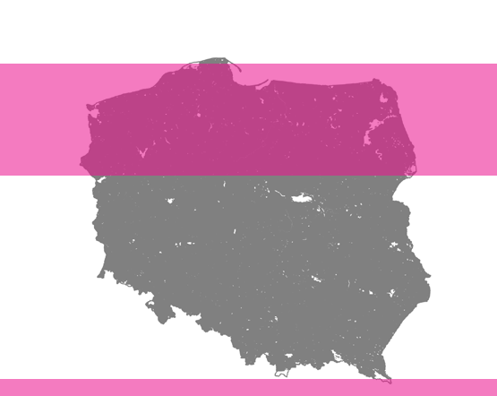

7233 —RZUT+

- Il. 1. Udział parków narodowych i rezerwatów w powierzchni obszaru lądowego Polski. Mapy do artykułu przygotował Andrzej Olejniczak na podstawie danych udostępnionych przez GDOŚ: https://www.gov.pl/web/gdos/dostep-do-danych-geoprzestrzennych

1.68% ochrona ścisła

8.42% parki krajobrazowe

- Il. 2. Udział parków krajobrazowych w powierzchni obszaru lądowego Polski

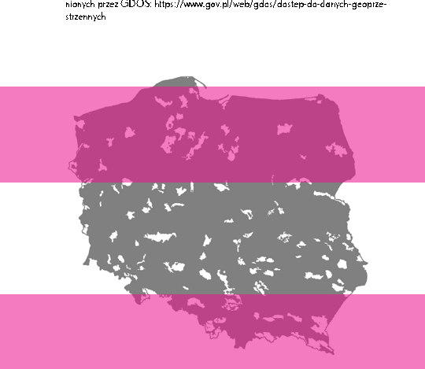

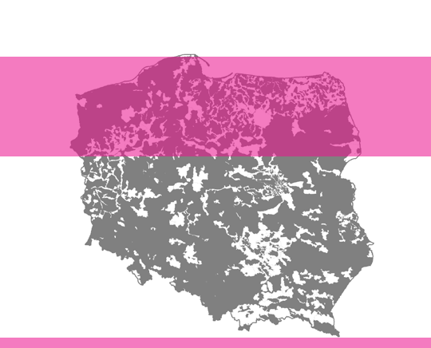

73 — — planowanieprzyroda

23.15% obszary chronionego krajobrazu

- Il. 3. Udział obszarów chronionego krajobrazu w powierzchni obszaru lądowego Polski

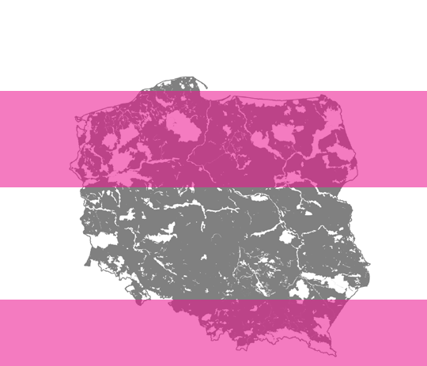

8.42% parki krajobrazowe

Il. 4. Udział obszarów Natura 2000 w powierzchni obszaru lądowego Polski

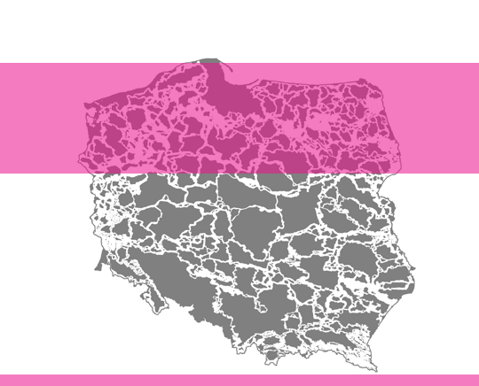

## 7433 —RZUT+

35.79% korytarze ekologiczne

Il. 5. Udział obszarów Natura 2000 w powierzchni obszaru lądowego Polski

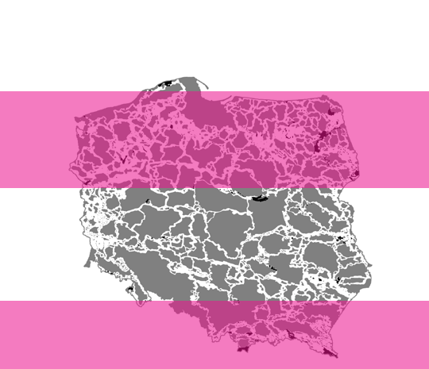

3.76% ścisa ochrona w ramach korytarzy ekologicznych

Il. 6. Udział parków narodowych i rezerwatów w powierzchni korytarzy ekologicznych

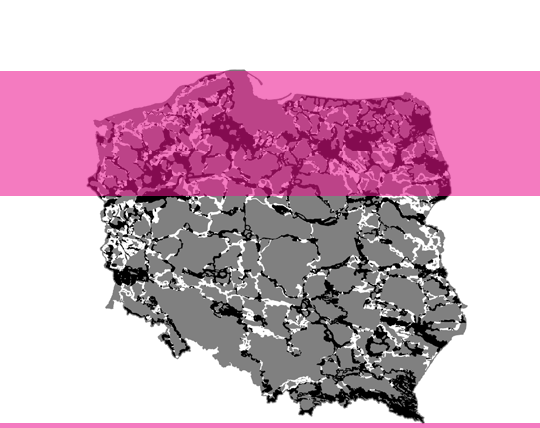

## 75 — — planowanieprzyroda

63.32% Natura 2000, parki krajobrazowe obszary chronionego krajobrazu w ramach korytarzy ekologicznych

Il. 5. Udział obszarów Natura 2000 w powierzchni obszaru lądowego Polski

Il. 7. Udział obszarów chronionych niebędących pod ścislą ochroną w powierzchni korytarzy ekologicznych nadmienić, że nomenklatura ta oznacza co innego w Polsce, gdzie w ścisłych rezerwatach przyrody praktycznie każda forma działalności ludzkiej jest zabroniona lub bardzo ograniczona, a obszary takie są zwykle odgrodzone od otaczającego środowiska i nie są dostępne dla ludzi. W rozumieniu unijnym natomiast, zgodnie z notą Komisji z września 2021 r., obszary pod ochroną ścisłą powinny umożliwiać niezaburzony przebieg naturalnych procesów, na których dozwolone powinny być tylko bardzo ograniczone i kontrolowane działania, takie jak np. badania naukowe, zapobieganie pożarom, kontrola gatunków obcych czy nieinwazyjna aktywność rekreacyjna – pod warunkiem zgodności z indywidualnymi celami ochrony7. W założeniu mają być prawnie wyszczególnionymi obszarami większych chronionych płatów, których ochrona wynika z określonych celów i planów zarządzania. Zaliczyć do nich będzie można również tereny objęte ochroną czynną, na których dopuszczalne jest m.in. prowadzenie działań renaturyzacyjnych np. przez rekultywację obszarów zdegradowanych po okresie ich użytkowania. Obecnie warunki ochrony ścisłej (w rozumieniu dokumentów przywołanego wyżej dokumentu) spełniają w Polsce rezerwaty przyrody i parki narodowe, czyli ok. 1,5% powierzchni kraju, co znacząco odbiega od celu wyznaczonego przez wspólnotę europejską. Warto dodać, że progi procentowe nie odnoszą się po równo do każdego państwa, ale w zależności od jego istniejących lub możliwych do odtworzenia wartości przyrodniczych. Z tego powodu, a także w wyniku dyskusji nad nieprecyzyjnymi sformułowaniami zawartymi w Strategii obecnie w politycznym

Il. 6. Udział parków narodowych i rezerwatów w powierzchni korytarzy ekologicznych

7 www.kp.org.pl/pl/inna-dzialalnosc/wiadomosci-

-kp/3181-ochrona-scisla-w-strategii-bioroznorodnosci-2030 (data dostępu: 1.03.2023).

dyskursie jesteśmy świadkami intensywnego lobbingu sceptycznych rządów niektórych państw unijnych, w tym Polski. Stanowisko rządu PiS, stojącego murem za, ich zdaniem wystarczającą, ochroną w postaci gospodarki leśnej sprawowanej przez Lasy Państwowe, sprowadza się do maksymalnego poszerzenia pojęcia ochrony ścisłej, tak aby przekroczenie wymaganych progów procentowych odbyło się przy jak najmniejszym wysiłku i bez konieczności wdrażania programów ochrony czy nowych wytycznych w zakresie prowadzenia polityki przestrzennej kraju. Warto czujnie obserwować, jak realizowana będzie Strategia i czy w miejsce konkretnych działań politycy nie zaoferują nam jedynie zmian w nazewnictwie obszarów już objętych ochroną i w dalszym ciągu będą wyznaczonych podczas Konferencji jest przyjęcie tzw. strategii 30×30, zobowiązującej strony do objęcia ochroną 30% światowych lądów, wód śródlądowych, mórz i oceanów przed wszelkimi degradującymi środowisko działaniami do 2030 r. Warto nadmienić, że polskiemu oraz innym sceptycznym przedstawicielstwom skutecznie udało się przeciwstawić uwzględnieniu we wspólnych zadaniach wymaganego progu procentowym obszarów o ochronie ścisłej, mimo iż określone w konwencji CBD cele nie są faktycznie prawnie wiążące. Siostrzaną strategią do tej przyjętej na szczycie jest wizja prezydenta Stanów Zjednoczonych Joe Bidena, którą ogłosił już na tydzień po zaprzysiężeniu na swoje stanowisko. Po uzyskaniu szerokiego poparcia wśród opinii publicznej jego administracja wypracowała raport włączający do wspólnej ochrony bytów ludzkich i nieludzkich wszelkie podmioty, w tym te, które nie były wcześniej obecne w procesach decyzyjnych9. Koncepcja zakłada wypracowanie inkluzywnego modelu ochrony nie-ludzkiej przyrody opartego na badaniach naukowych, ale sterowanego lokalnie i angażującego wszystkich interesariuszy, w tym rolników, właścicieli gruntów, społeczności rdzenne i szeroko rozumianych entuzjastów. Jednym z postulatów jest budowa dostępnego atlasu, czyli ewoluującego narzędzia mapującego i zbierającego dane o ziemiach i wodach już objętych ochroną oraz tych, które tego potrzebują, celem zabezpieczenia co najmniej 30% powierzchni kraju od środowiskowej degradacji10.

## 7633 —RZUT+

OBECNIE WARUNKI OCHRONY ŚCISŁEJ (W ROZUMIENIU DOKUMENTÓW PRZYWOŁANEGO WYŻEJ DOKUMENTU) SPEŁNIAJĄ W POLSCE REZERWATY PRZYRODY I PARKI NARODOWE, CZYLI OK. 1,5% POW. KRAJU, CO ZNACZĄCO ODBIEGA OD CELU WYZNACZONEGO PRZEZ WSPÓLNOTĘ EUROPEJSKĄ popierać eksploatację najbogatszych polskich obszarów siedliskowych, takich jak Białowieża czy Pogórze Przemyskie, przez prowadzenie rabunkowej gospodarki leśnej lub łowieckiej.

Globalne ramy planowania ochrony obszarowej w sprawie zachowania różnorodności biologicznej były głównym tematem Konferencji Stron Narodów Zjednoczonych, która odbyła się w grudniu 2022 r. w Montrealu. Uczestniczyli w niej przedstawiciele i przedstawicielki 196 państw będących członkami Konwencji ONZ o różnorodności biologicznej (CBD)8. Jednym z jej podstawowych zadań

Z porównania Europejskiej Strategii na rzecz Bioróżnorodności 2030, ustaleń Konferencji Stron ONZ i wizji ochrony gabinetu USA wynika, że nie ma jednego patentu na ochronę przyrody. Warto realizować

- 9 www.doi.gov/sites/doi.gov/files/report-conserving-

-and-restoring-america-the-beautiful-2021.pdf (data dostępu: 23.01.2023).

- 10 www.nature.org/content/dam/tnc/nature/en/ documents/TNC_Atlas_March_7_2022.pdf (data dostępu: 23.01.2023).

8 koalicja10.pl/aktualnosci/cop1 (data dostępu: 1.03.2023).

ją w każdej skali, umiejętnie łącząc planowanie globalne, określające ambitne i konkretne cele (mierzalne i trudne do podważenia), z wypracowaniem lokalnych strategii uwzględniających potrzeby ludzkich i nie-ludzkich interesariuszy, tak aby mogli je zaspokajać i rozwijać się wspólnie. W procesach decyzyjnych powinniśmy zatem dążyć do znacznego zwiększenia powierzchni obszarów chronionych ściśle, jednak aby osiągnąć zakładane cele, konieczne może okazać się rozszerzenie pojęcia ścisłości od zupełnego braku ingerencji do przyzwolenia na wstęp i podejmowanie działań, tak długo jak nie zaburzają one równowagi ekologicznej. Ich przykładami mogą być prowadzenie badań, obserwacja czy rekreacja, które przy odpowiedzialnym prawnym egzekwowaniu mogą okazać się korzystne także dla istot pozaludzkich, zgodnie z przekonaniem, że aby chcieć coś chronić, trzeba to zrozumieć.

zmienić na przestrzeni najbliższych dekad z uwagi na zmieniający się klimat. Możemy za to oddać pozaludzkim aktorom zagrabioną im możliwość decydowania o sobie, przemieszczania się i wyboru pożądanego

77 — — planowanieprzyroda

ABY OSIĄGNĄĆ ZAKŁADANE CELE, KONIECZNE MOŻE OKAZAĆ SIĘ ROZSZERZENIE POJĘCIA ŚCISŁOŚCI OD ZUPEŁNEGO BRAKU INGERENCJI DO PRZYZWOLENIA NA WSTĘP I PODEJMOWANIE DZIAŁAŃ, TAK DŁUGO JAK NIE ZABURZAJĄ ONE RÓWNOWAGI EKOLOGICZNEJ. ICH PRZYKŁADAMI MOGĄ BYĆ PROWADZENIE BADAŃ, OBSERWACJA CZY REKREACJA, miejsca do życia. Afirmacja migracji powinna być odwzorowana w fizycznej sieci ekosystemowych powiązań, które występują ponad sztucznie wykreślonymi ludzką ręką limitami, takimi jak płoty wzdłuż prywatnych lasów, mury na granicach państw czy nieokiełznane archipelagi zabudowy z dala od ludzkich osad, tworzące bariery fizyczne, świetlne, dźwiękowe i zapachowe. Istnieje przekonanie, że z momentem zakupu działki ziemia w jej granicach staje się nasza i mamy prawo wydzielić ją sobie z większej całości. Jednak gdyby zanurzyć w niej ręce, łatwo się przekonać, jak wielu innych ma właścicieli. Dlaczego nie zdecydować się na jej świadome współdzielenie i otwartość na nie-ludzkich sąsiadów? Celem planowania jest przewidywanie takich punktów styku i określenie niezbędnych kierunków działań dla zachowania ciągłości ekologicznej zarówno na poziomie kraju i województwa, jak i gminy, pola czy lasu.

4

Zastanówmy się, w jaki sposób moglibyśmy dążyć do obranych w koncepcjach celów tak, aby potraktować głosy i potrzeby nie-ludzkich bytów w sposób podmiotowy i przełożyć je na praktykę planistyczną. Wydaje się, że o ile ochrona siedlisk jest niezbędna, o tyle tworzenie odosobnionych parków-monumentów nie jest działaniem wystarczającym. Praktyka ta, zwana czasem fortress conservation, obecnie bywa krytykowana za kreowanie szczelnie zamkniętych i odciętych od ludzi krain fantazji, których korzeni można upatrywać w kolonializmie11. Kluczem do zapewnienia przetrwania i dobrostanu wszystkich gatunków może być jednak przywrócenie im sprawczości i prawa do samostanowienia. To, co możemy dla nich zrobić, to upewnić się, że mają miejsce i zasoby na klimatyczną adaptację. Nie chodzi więc o organizację ścisłej izolacji w habitatach, których ekosystemy mogą drastycznie się

Przykładem działania, które uznaje istotność zachowania środowiskowej sieci powiązań umożliwiającą bytom swobodę migracji (freedom to roam), jest koncepcja korytarzy ekologicznych, czyli liniowych obszarów umożliwiających przemieszczanie roślin, zwierząt i grzybów między

- 11 www.greenpeace.org/international/story/45497/ indigenous-people-biodiversity-fortress-conservation-power-shift/ (data dostępu: 24.01.2023).

## 7833 —RZUT+

płatami środowiskowymi, ograniczających lokalne wymierania i przywracających osobnikom możliwości rekolonizacji12. Ich celem jest ochrona istniejących połączeń między habitatami i umożliwienie ponownego bezpiecznego przepływu gatunków tam, gdzie został on utracony pod wpływem presji zabudowy czy barier komunikacyjnych, w szczególności podczas migracji sezonowych czy migracji do bardziej korzystnych płatów siedlisk w czasie suszy, powodzi czy pożarów. Umożliwiają one również swobodny przepływ genów – mieszanie się populacji tego samego gatunku, a tym samym zapobieganie chowowi wsobnemu. Niestety w polskim środowisku planistek i planistów nie ma powszechnie akceptowanej koncepcji koopracował Zakład Badania Ssaków PAN w Białowieży (obecnie Instytut Biologii Ssaków). Powstała mapa sieci korytarzy dla obszarów Natura 2000 uwzględniająca ochronę kluczowych gatunków dużych ssaków jako gatunków parasolowych (zgodnie z zasadą, że dogodne dla nich siedliska zapewniają przetrwanie wielu innym gatunkom)13. Na jej podstawie w 2011 r. we współpracy z Pracownią na rzecz Wszystkich Istot opracowano kompletną mapę korytarzy istotnych dla populacji dużych ssaków leśnych oraz spójności siedlisk leśnych i wodno-błotnych w skali krajowej i kontynentalnej14. Głównym założeniem merytorycznym opracowania było nadanie mu wielofunkcyjnego charakteru – przeznaczonego dla możliwie największej liczby gatunków i łączącego różnorodne siedliska przyrodnicze. Nadrzędnym celem było stworzenie praktycznego narzędzia ochrony siedlisk i gatunków zagrożonych fragmentacją środowiska, wykorzystywanego w planowaniu przestrzennym i projektowaniu inwestycji liniowych, takich jak trasy komunikacyjne. Mając dostęp do tak dokładnie zmapowanych sieci korytarzy, można zadać pytanie: czy nie mogłyby wyjść one z teoretycznego limbo i stanowić faktycznej podstawy do wyznaczania zamierzonych 30% obszarów chronionych, które nie ograniczałoby się do symbolicznych zmian w nomenklaturze istniejących już parków, a pretendowało do urzeczywistniania realnej ochrony, wynikającej ze zrozumienia pozaludzkich potrzeb?

MAJĄC DOSTĘP DO DOKŁADNIE ZMAPOWANYCH SIECI KORYTARZY, MOŻNA ZADAĆ PYTANIE: CZY NIE MOGŁYBY WYJŚĆ ONE Z TEORETYCZNEGO LIMBO I STANOWIĆ FAKTYCZNEJ PODSTAWY DO WYZNACZANIA ZAMIERZONYCH

30% OBSZARÓW CHRONIONYCH, KTÓRE NIE OGRANICZAŁOBY SIĘ DO SYMBOLICZNYCH ZMIAN W NOMENKLATURZE ISTNIEJĄCYCH JUŻ PARKÓW, A PRETENDOWAŁO DO URZECZYWISTNIANIA REALNEJ OCHRONY, WYNIKAJĄCEJ ZE ZROZUMIENIA POZALUDZKICH POTRZEB?

Przy okazji nawoływania do uwzględnienia głosów interesariuszy spoza gatunku ludzkiego warto również przytoczyć dostępne instytucjonalne rozwiązania, które uwzględniałyby ten postulat. Podmiotowe traktowanie istot pozaludzkich, rytarzy ekologicznych ani bezpośredniej konieczności wdrażania ich w planowaniu przestrzennym na szczeblu lokalnym mimo dostępności opracowań na temat najodpowiedniejszych powiązań ekologicznych w skali kraju. Jedno z nich na zlecenie Ministerstwa Środowiska w 2005 r.

- 13 J. Romanowski, Korytarze i łączność siedlisk w ekologii i ochronie przyrody, „Wiadomości Ekologiczne” 2008, t. 54/2, 69.
- 14 W. Jędrzejewski i in., Projekt korytarzy ekologicznych łączących Europejską Sieć Natura 2000 w Polsce, Białowieża 2011.

- 12 korytarze.pl/upload/filemanager/Korytarze/ Prezentacje%20pliki/2011-Gorny-Jedrzejewski-Korytarze-ekologiczne-w-Polsce.pdf (data dostępu: 24.01.2023).

czyli uznanie, że zwierzęta, rośliny i ekosystemy mają swoją wartość wewnętrzną i powinny być chronione nie tylko ze względu na korzyści użytkowe dla człowieka, ale również z uwagi na ich własne prawa i interesy, jest przedmiotem debaty w wielu krajach na świecie. Konstytucje niektórych z nich uznają prawa zwierząt i ochronę środowiska jako fundamentalne prawa, co może stanowić podstawę działań legislacyjnych na rzecz ochrony istot pozaludzkich. Przykładem takiego kraju są Indie, gdzie konstytucja uznaje dobrostan zwierząt jako jeden z podstawowych obowiązków rządu. W wielu państwach istnieją również specjalne agencje rządowe i niezależne organizacje, których celem jest ochrona środowiska i bioróżnorodności, w tym także ochrona istot pozaludzkich, a także przeznaczone sądy i trybunały zajmujące się ich sprawami, z możliwością nałożenia ekologicznych kar pieniężnych, z których przeznacza się środki na realizację celów ekologicznych.

powierzchni naszego kraju, przy unijnej średniej wynoszącej 3,4%15. Dlaczego powinniśmy rozważać ich powiększanie? Przede wszystkim dlatego, że ochrona ścisła stanowi zabezpieczenie przed skutkami nadmiernego zaufania do posiadanej przez nas wiedzy i oferowanych przez nią rozwiązań. Jej implementacja czerpie ze świadomości, że wielu rzeczy dotyczących procesów środowiskowych w dalszym ciągu nie wiemy, szczególnie w zderzeniu z antropogenicznymi zmianami klimatu16. Należy jednak pamiętać, że obszary objęte ścisłą ochroną nie znajdują się pod zamkniętą, szklaną kopułą i nie da się ich całkowicie odizolować od niekorzystnych wpływów zewnętrznych, takich jak eutrofizacja17, wzrost zawartości

## 79 — — planowanieprzyroda

POZA PLANOWANIEM I PRAWNĄ EGZEKUCJĄ

KONCEPCJI KORYTARZY EKOLOGICZNYCH NAJPILNIEJSZYM DZIAŁANIEM JEST TWORZENIE NOWYCH OBSZARÓW CHRONIONYCH, TAKICH JAK PARKI

W praktyce uwzględnienie potrzeb ekosystemów w planowaniu przestrzennym wymaga zintegrowanego podejścia do różnych dziedzin, takich jak ochrona przyrody, gospodarka leśna, rolnictwo czy infrastruktura. Na podstawie analiz i ocen wpływu poszczególnych planowanych funkcji czy inwestycji przewidzianych w dokumentach planistycznych możliwe jest wypracowanie rozwiązań, które minimalizują zagrożenie ze strony ludzkiej pozaludzkich siedlisk i ciągłości ekosystemowej. Poza planowaniem i prawną egzekucją koncepcji korytarzy ekologicznych najpilniejszym działaniem jest tworzenie nowych obszarów chronionych, takich jak parki narodowe czy rezerwaty przyrody, które mają prawną siłę zachować naturalne siedliska lasów, bagien czy łąk wraz z zamieszkującymi je różnorodnymi biologicznie grupami. Obecnie tylko około 1,5% powierzchni Polski chronione jest w sposób ścisły (w rozumieniu unijnym), a wszystkie dwadzieścia trzy parki narodowe zajmują jedynie około 1,1%

NARODOWE CZY REZERWATY PRZYRODY. OBECNIE TYLKO OKOŁO 1,5% POWIERZCHNI POLSKI CHRONIONE JEST W SPOSÓB ŚCISŁY

(W ROZUMIENIU UNIJNYM)

dwutlenku węgla w atmosferze czy globalne ocieplenie18. Ekosystemy funkcjonują poza tymi granicami i równie ważne dla

- 15 magazynkontakt.pl/realia-i-absurdy-ochrony-przyrody-w-polsce/ (data dostępu: 23.01.2023).
- 16 J. Szwagrzyk, Po co i komu potrzebna jest ochrona ścisła?[w:] Ochrona ścisła w parkach narodowych i rezerwatach. Bilans osiągnięć i porażek ostatniego półwiecza, red. J. Bodziarczyk, Kraków 2018.
- 17 Eutrofizacja to proces wzbogacania wód, gleby lub innych środowisk w substancje odżywcze, takie jak azot i fosfor, w wyniku czego dochodzi do przyspieszonego rozwoju roślinności wodnej lub roślinności na lądzie, co może prowadzić do zakwitu sinic i zmniejszenia ilości tlenu w wodzie oraz innych szkodliwych skutków dla lokalnego ekosystemu.
- 18 S. Lewis, M. Maslim, Defining the Anthropocene, „Nature” 2015, t. 519, s.

8033 —RZUT+

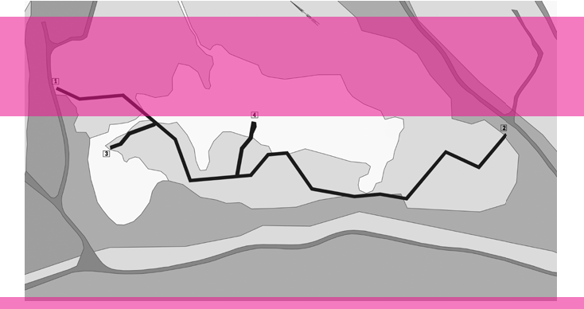

- Il. 8. Enklawa Bobrowisko, 55architekci, fot. W. Świątek, publikacja dzięki uprzejmości Autorów ich mieszkańców jest to, żeby miały ze sobą bezpieczne i fizycznie połączenie, na przykład za pomocą wspomnianych już korytarzy ekologicznych. Niemniej zakładanie rezerwatów ochrony ścisłej i nowych parków narodowych z takimi strefami wraz z ich prawnie chronionymi otulinami może być skutecznym działaniem przeciwko agresywnym przekształceniom terenów o dużej różnorodności biologicznej w działki służące do zarabiania pieniędzy. Mogą być też działaniem prewencyjnym przeciwko polityce państwowego koncernu drzewnego, który tereny leśne, zajmujące 30% powierzchni Polski, widzi częściej jako obszary dostępnej bazy surowcowej niż jako wielogatunkowe habitaty. Aktywiści w Polsce od wielu lat domagają się zakładania nowych parków narodowych. W kolejce czekają m.in. Jurajski, Mazurski, Środkowej Wisły, Doliny Dolnej Odry czy Turnicki. Ten ostatni doczekał się nawet nieoficjalnej strony internetowej19, zrealizowanej przez osoby skupione wokół Kwitnącej Otuliny, czyli sieci osób zaangażowanych w ochronę dziedzictwa kulturowego i naturalnego Pogórza Przemyskiego. Natomiast utworzenia parku narodowego w Dolinie Dolnej Odry domaga się organizacja Greenpeace, która w raporcie opublikowanym po zeszłorocznej katastrofie ekologicznej na Odrze wskazuje spółki górnicze będące jej sprawcami. Aktywiści domagają się przekazania ogłoszonej przez premiera nagrody na rzecz utworzenia nowego parku i zapobiegania kolejnym kataklizmom. Szerzej w kontekście parków narodowych pisze Agata Woźniczka w tekście Prawa Natury, który jest do przeczytania we wcześniejszym numerze kwartalnika „Rzut” +31 Prawo20.

Poza zakładaniem nowych rezerwatów istotnymi działaniami mogą być też zmiany w tych istniejących. Z punktu widzenia ich nieludzkich bywalców korzystne może być zwiększenie chronionych ściśle rdzeni, a także poszerzanie otaczających je buforowych otulin wraz z mniej rygorystycznymi obszarami objętymi ochroną aktywną. Procedury, na podstawie których obecnie przeprowadza się takie działania, budzą jednak wiele wątpliwości, w tym również na płaszczyźnie zgodności z Konstytucją, jak wskazuje Rada Wydziału Prawa i Administracji Uniwersytetu Warszawskiego w opinii z 2020 r.:

19 niewidzialnypark.pl (data dostępu: 23.01.2023).

20 A. Woźniczka, Prawa Natury, „Rzut” 2022, nr 31, s.

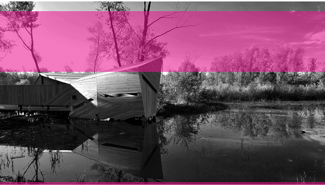

81 — — planowanieprzyroda

- Il. 9. Enklawa Bobrowisko, 55architekci, fot. W. Świątek, publikacja dzięki uprzejmości Autorów połaci ziemi oraz spełnianiem innych ludzkich potrzeb. W momencie pisania tego tekstu wydaje się, że postrzeganie rozwoju głównie jako wzrostu gospodarczego jest w polskich gminach silnie ugruntowane. W środowiskach akademickich pojawiają się jednak próby wypracowania strategii zgodnych z koncepcjami post-wzrostu, czyli np. Ekonomii Obwarzanka22. Ta uwzględnia w swoich założeniach nieprzekraczalny pułap ekologiczny, w którego granicach powinniśmy się zmieścić ze swoimi ludzkimi potrzebami, aby nie doprowadzić do krytycznej degradacji planety, czyli przeprowadzania zagłady jej pozaludzkich mieszkańców. Czy możemy zatem poprawić sektor ochrony w panującym systemie prawno-ekonomicznym?

Uzależnienie utworzenia parku narodowego od zgody jednostek samorządu terytorialnego, na których obszarze park narodowy miałby powstać – mimo że sprawa ta nie ma charakteru lokalnego, lecz ogólnopaństwowy – budzi istotne i uzasadnione wątpliwości co do zgodności z Konstytucją, w szczególności z jej art. 5, art. 31 ust. 3, art. 74 oraz art. 86. Godzi ono w ciążący na władzy publicznej obowiązek ochrony środowiska i wspierania jego poprawy przy uwzględnieniu zasady zrównoważonego rozwoju, jak też w obowiązek zapewnienia bezpieczeństwa ekologicznego współczesnym i przyszłym pokoleniom. Obecny stan prawny uniemożliwia prowadzenie polityki państwa, gdyż nie jest ono w stanie osiągać celów, które zakłada w aktach planistycznych21.

Brak skuteczności w kwestii rozwoju ochrony ścisłej w Polsce wydaje się więc w dużej mierze problemem wynikającym z nieodpowiedniej hierarchii wartości, w której prym wciąż wiodą kwestie ekonomiczne. Lokalnym samorządom taka ochrona się zwyczajnie nie opłaca. Może generować problemy z pozyskiwaniem surowców, rozwojem transportu indywidualnego, rozbudową i zabudową kolejnych

Jednym z głównych problemów jest brak rynkowej konkurencyjności obszarów objętych ochroną, takich jak rezerwaty ścisłe, wobec terenów zielonych zarządzanych przez Lasy Państwowe. Dla zarządu wspomnianej spółki sprzedaż drewna i pelletu często wydaje się bardziej opłacalna niż faktyczna ochrona drzew wraz z istotami

22 K. Raworth, Ekonomia obwarzanka. Siedem sposobów myślenia o ekonomii XXI wieku, Warszawa 2021.

21 , (data dostępu: 23.01.2023).

8233 —RZUT+

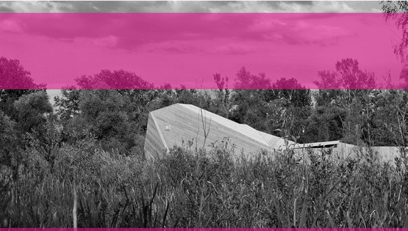

- Il. 10. Enklawa Bobrowisko, 55architekci, fot. S. Adamczyk, publikacja dzięki uprzejmości Autorów im towarzyszącymi. Być może z odpowiednio wysokim finansowaniem z budżetu Ministerstwa Klimatu i Środowiska obszary zamieszkiwane przez pozaludzkie społeczności mogłyby pozostać zwolnione z uczestniczenia w systemie, w którym żeby przetrwać, muszą na siebie zarabiać. Co więcej, wynagrodzenia wśród pracowników Lasów Państwowych znacznie przewyższają pensje, które otrzymywaliby po przejściu w struktury nowo utworzonych parków narodowych, ponieważ te należą do jednostek budżetowych, a tam widełki płacowe są zdecydowanie na niższym poziomie niż w spółce państwowej23.

jednocześnie produkując wystarczającą ilość żywności, aby utrzymać rolników, nie wyjaławiać gleby i stopniowo przyczyniać się do jej regeneracji. Warto tu wspomnieć, że ochrona bioróżnorodności służy rolnictwu, gdyż umożliwia przetrwanie m.in. zapylaczy, od których rozwój plonów w dużej mierze zależy24. Stan świadomości społecznej sprzyjający takiemu modelowi zbudować można w wyniku racjonalnego planowania przestrzennego, jasno określonych ram prawnych i wystarczających dofinansowań. Nie wykiełkuje on sam przy pozostawieniu właścicieli i pracowników ziemi agresywnym zasadom rynkowym. Programy rządowe i lokalne strategie gospodarowania przestrzenią mogą wzmacniać rolników, czerpać z ich doświadczeń i ustanawiać ich miejscowymi liderami środowiskowymi, którzy zasługują na dobrze płatną pracę w zamian za ochronę bezcennej bioróżnorodności.

Warto sprawić, żeby ochrona przyrody opłacała się bardziej niż jej destrukcja, także na ziemiach częściowo współdzielonych z ludźmi, takich jak pola uprawne. Tu pomocne mogą być systemy nagród za proekologiczne postawy wspierane przez rządowe i unijne programy. Możliwe jest zaplanowanie takiego modelu rolnictwa, który nie ogranicza się do wspierania monokultur, a sprzyja bioróżnorodności,

Miasta to kolejne szczególnie istotne środowiska z perspektywy planistycznej. W wyniku odpowiedniego planowania powinny stanowić gęste formy osadnicze umożliwiające ludzkim społecznościom

23 https://www.gazetaprawna.pl/magazyn-na-weekend/artykuly/8202193,turnicki-park-narodowy-projektowany-wycinki-mariusz-daniel-bockowski.html (data dostępu: 23.01.2023).

24 http://otop.org.pl/rolnictwo_dla_przyrody/ (data dostępu: 1.03.2023).

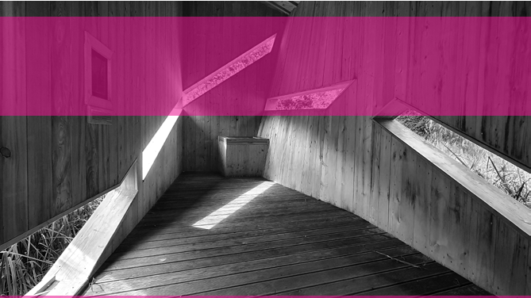

## 83 — — planowanieprzyroda

- Il. 11. Enklawa Bobrowisko, 55architekci, fot. W. Świątek, publikacja dzięki uprzejmości Autorów zaspokojenie wszystkich potrzeb dzięki sieciom usług, transportu publicznego czy możliwości wspólnego zamieszkiwania w budynkach wielorodzinnych, które łatwiej ogrzać i ochłodzić niż pojedyncze domy. O ile zgodzimy się, że miasta są środowiskami przystosowanymi głównie do potrzeb ludzkich, a poza ich granicami prymat powinny wieść inne gatunki, o tyle musimy pamiętać, że z ich gęstością i skabyć miejskimi korytarzami ekologicznymi, a także stanowić wymarzone ekosystemy dla niektórych gatunków, takich jak np. gołąb nomen omen miejski. Oprócz oczywistych korzyści dla istot pozaludzkich ich obecność przyczynia się także do poprawy naszego zdrowia, a za pomocą obserwowalnych zmian pór roku osadzają nas również w cykliczności i przyzwyczajają do przemijania. Oprócz tego, ponownie odnosząc się do kwestii ekonomicznej, ich zabezpieczenie często przynosi wyższe zyski niż koszty, które generuje25.

CZY JEDNAK ZIEMIA ZAWSZE MUSI PRZYNOSIĆ DOCHÓD? ODEJŚCIEM OD TEJ REGUŁY JEST KONCEPT WSPIERANIA NIEUŻYTKÓW. MIMO IŻ ICH NAZWA SUGERUJE BRAK PRZYDATNOŚCI, KORZYSTAMY Z NICH ZARÓWNO MY, JAK I NASI NIE-LUDZCY SĄSIEDZI

Czy jednak ziemia zawsze musi przynosić dochód? Odejściem od tej reguły jest koncept wspierania nieużytków. Mimo iż ich nazwa sugeruje brak przydatności, korzystamy z nich zarówno my, jak i nasi nie-ludzcy sąsiedzi. Te obszary, o odmiennej od ogólnie przyjętej estetyce, również są wartościowymi przestrzeniami. Ich obecność możemy wzmacniać np. przez wycofanie ludzkiej ingerencji i całkowite oddanie pola do działania nie-ludzkim aktorom, procesom zdziczania i zarastania, czyli działaniu tzw. czwartej przyrody. Jej siłę możemy obserwować na przykładzie lą również nie można przesadzać. Przestrzenie zielone, ogrody, rzeki, lasy, łąki, a nawet punktowe parki kieszonkowe między zabudowaniami zmieniają je w wielogatunkowe habitaty, które umożliwiają codzienne ludzko-nieludzkie współbycie. Zielone pierścienie, kliny czy sieci mogą

25 A. Balmford i in., Economic Reasons for Conserving Wild Nature, „Science” 2002, t. 297, s. .

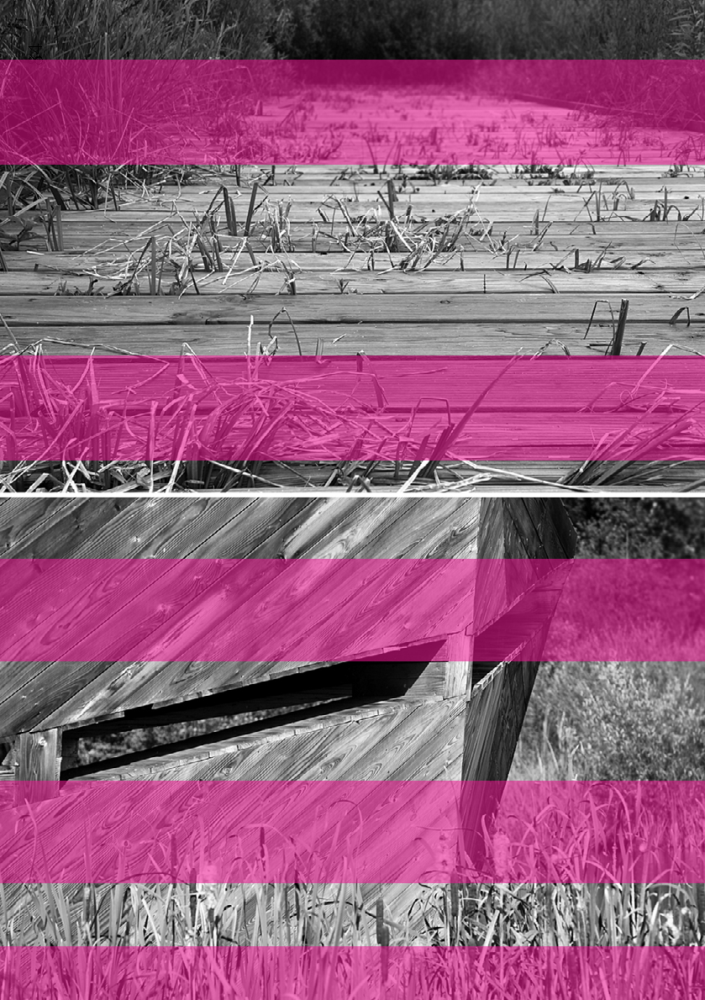

## 8433 —RZUT+

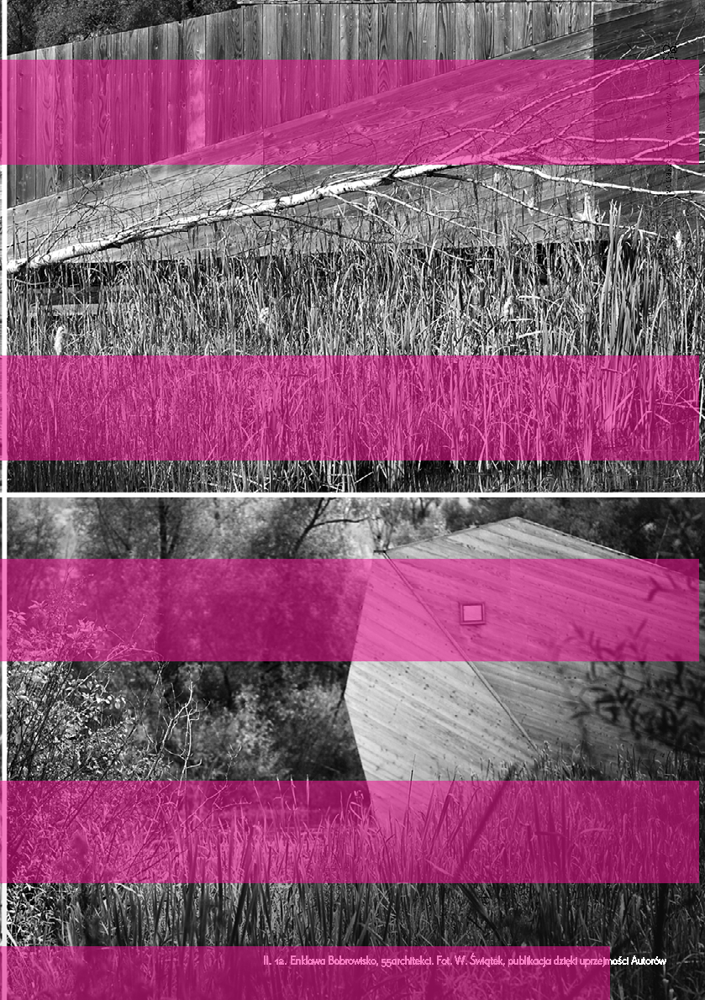

85 — — planowanieprzyroda

Il. 12. Enklawa Bobrowisko, 55architekci. Fot. W. Świątek, publikacja dzięki uprzejmości Autorów

Lasu Ochronnego „Szast” w Puszczy Piskiej, która przed dwudziestoma latami była miejscem katastrofy naturalnej. Po tym czasie, zgodnie z przeprowadzonymi badaniami, zaobserwowano, że we fragmencie lasu, który odnawiał się samoczynnie, bioróżnorodność osiągnęła wyższy poziom niż w lesie wspomaganym rękami leśników26. Ludzką rolę w procesach ochrony można by więc zasadniczo sprowadzić do racjonalnego planowania, egzekwowania prawa i prowadzenia obserwacji. „Ustępowanie” naturze może odbywać się zarówno na terenach cennych przyrodniczo, jak i tych wyeksploatowanych i wyłączonych z procesów gospodarczych, po to by mogły zachodzić w nich naturalne procesy zdolne regenerować wyrządzone przez człowieka szkody. Aby zagwarantować przetrwanie nieużytków, należy zabezpieczyć ich status w dokumentach planistycznych zarówno na szczeblu krajowym, jak i lokalnym, żeby uchronić je od niekontrolowanych planów inwestycyjnych. Interesujące w tym kontekście wydają się formy ochrony realizowane przy współpracy publiczno-prywatnej, dokładniej opisywane we wspomnianym już artykule Agaty Woźniczki27. Można mieć tu wątpliwości, czy da się w stu procentach pogodzić ochronę przyrody z kapitalizmem, i uzasadnione są podejrzenia, że podążanie za zyskiem może prowadzić do nadużyć. Niemniej jeśli chcemy uprawiać ochronę przyrody wszędzie, musimy znaleźć sposób na włączenie do niej nie tylko ostoi bioróżnorodności, ale też nieużytków, terenów postindustrialnych oraz tych, na których inni chcą zarabiać pieniądze.

wykonanie nie ma jednego patentu. W spektaklu, w którym grają polityka, aktywizm, prawodawstwo, biologia i teoria krytyczna, planowanie przestrzenne stanowi jeden z głównych instrumentów, który może określać jej realizację. Można

## 8633 —RZUT+

KULTURA PRAWNA OPARTA NA TZW. SPECUSTAWACH, DZIĘKI KTÓRYM WŁADZA

CENTRALNA OMIJA OGRANICZENIA

WYNIKAJĄCE Z DOKUMENTÓW PLANISTYCZNYCH, CO PROWADZI

DO SZEREGU NEGATYWNYCH SKUTKÓW DLA ŚRODOWISKA I PRZESTRZENI, NIE UWZGLĘDNIAJĄC INTERESÓW

LOKALNYCH SPOŁECZNOŚCI I PRZEDSTAWICIELI INNYCH GATUNKÓW

próbować opracować wytyczne odnośnie do prowadzenia polityki przestrzennej w taki sposób, aby prawa innych gatunków były w nich uwzględnione, jednak pozostaną one jedynie optymistycznymi mrzonkami w momencie, w którym państwo nie traktuje poważnie wyzwań środowiskowych, ani zdania odpowiedzialnego gospodarowania przestrzenią. Efektem takiego stanu rzeczy jest kultura prawna oparta na tzw. specustawach,

BYĆ MOŻE PREROGATYWY PRZYSŁUGUJĄCE

LOKALNYM ORGANOM ADMINISTRACJI PUBLICZNEJ POWINNY BYĆ ZAWĘŻONE LUB

KONTROLOWANE PRZEZ ODPOWIEDNIO UTWORZONE INSTYTUCJE

5

Warto podkreślić, że ochrona bioróżnorodności jest zadaniem wymagającym zniuansowanego podejścia i wiedzy z zakresu wielu dyscyplin, a na jego dzięki którym władza centralna omija ograniczenia wynikające z dokumentów planistycznych, co prowadzi do szeregu negatywnych skutków dla środowiska i przestrzeni, nie uwzględniając interesów lokalnych społeczności i przedstawicieli

- 26 https://naukawpolsce.pl/aktualnosci/news%2C72927%2Cczy-las-moze-odrodzic-sie-sam. html (data dostępu: 25.01.2023).
- 27 A. Woźniczka, dz. cyt.

innych gatunków. Warto jednak zauważyć, że zmiana w dyskursie europejskim jest już widoczna, a przepisy prawa unijnego mają bezpośrednie zastosowanie na polskim terytorium, więc ich egzekucja powinna być jedynie kwestią czasu. Sformułowane cele dotyczące ochrony bioróżnorodności trzeba teraz odpowiednio ustrukturyzować i stworzyć konkretne programy i projekty na podstawie bardziej szczegółowych analiz. Następnym krokiem powinny być zmiany w polskich dokumentach prawnych i planistycznych, w szczególności tych wyższej rangi. Po pierwsze, podmiotowa ochrona ekosystemów i prowadzenie inkluzywnej polityki międzygatunkowej powinny być ujęte w Konstytucji RP. Po drugie, Koncepcja Przestrzennego Zagospodarowania Kraju i plany zagospodarowania przestrzennego województw powinny uzyskać wystarczającą moc prawną, aby koncepcje spójności i ciągłości ochrony obszarowej były obligatoryjnie wdrażane na szczeblu samorządowym. Być może prerogatywy przysługujące lokalnym organom administracji publicznej powinny być zawężone lub kontrolowane przez odpowiednio utworzone instytucje, wdrażające procedury weryfikacji lokalnych działań, tak by pozostawały one w zgodzie z celami i wartościami uchwalonymi na poziomie województwa, kraju i wspólnoty europejskiej. Wszystkie te działania wymagają nieustannej pracy, do której wykonywania potrzebujemy świadomości jej znaczenia na każdym szczeblu. Najłatwiej wykonuje się ją w ramach spójnego i przemyślanego systemu wartości, który uwzględnia lokalne interesariuszki i interesariuszy i traktuje ich po partnersku, bez względu na status etniczny, ekonomiczny czy gatunkowy. Dzięki takiemu podejściu do planowania, możliwe jest jednoczesne zaspokojenie potrzeb ludzkich i pozaludzkich społeczności, zarówno w miastach, rezerwatach, jak i na polach i nieużytkach, tak aby tworzyły tętniący życiem kolektywny ekosystem •

87 — — planowanieprzyroda

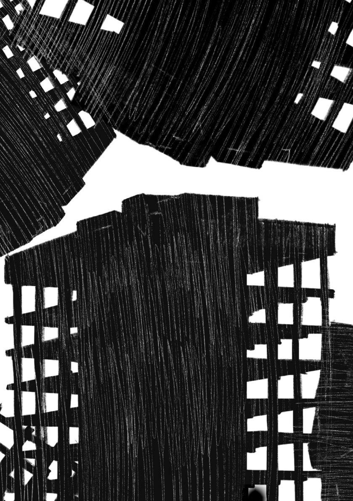

