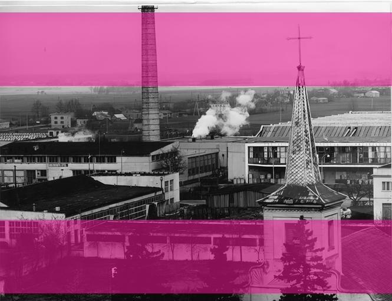
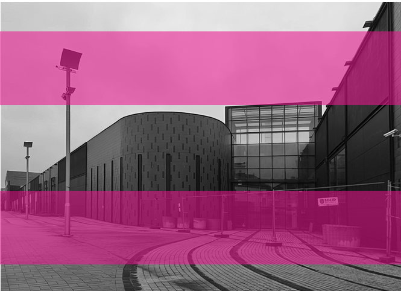
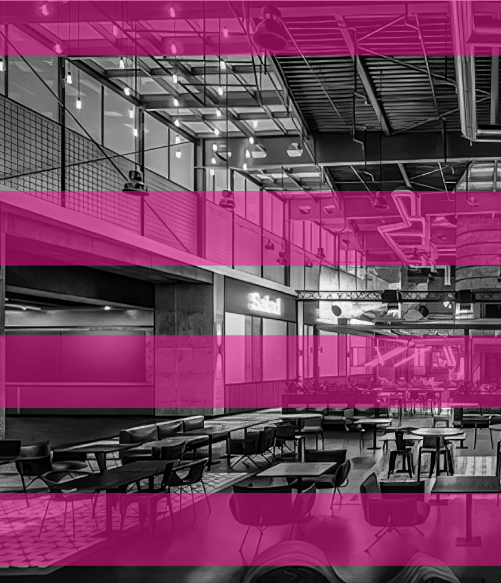
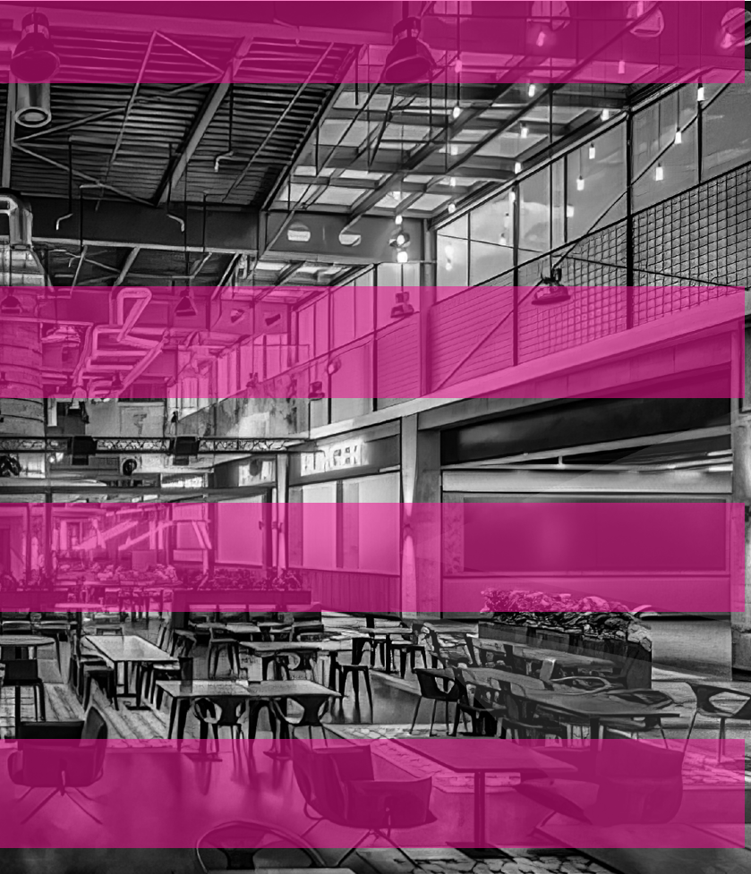

## SKŁĘBIONE PROBLEMY PUSTOSTANÓW

HISTORIA JEDYNEJ NIEURUCHOMIONEJ GALERII HANDLOWEJ W POLSCE

K A C P E R B O R E K

# ~

do pofabrycznego komina wystającego z bryły budynku. Pomiędzy nimi nudne plastikowe profile ścian kurtynowych, przeplatane gdzieniegdzie metalowymi kratkami, które zapewne przygotowane zostały dla nigdy niewyrosłych tu roślin. Szybki rzut oka w lewo i w prawo nie pozwala mi dostrzec żadnych okien. Na końcu elewacji majaczy szara, wyższa, prawie sześcienna bryła odcinająca się nieco od reszty budynku. Długa na prawie 250 m fasada wydaje się bardzo nieprzyjazna i przytłaczająca, nawet obserwowana z pewnej odległości. Gdyby w naszych czasach powstawały jeszcze zamki, prawdopodobnie przybierałyby właśnie taką formę. Budowla wydaje się niemożliwa do zdobycia, a przecież znajduje się w samym centrum miasta.

grudzień 2022

Wędrując pod koniec 2022 r. po centrum Bełchatowa, napotykam wielkokubaturowy budynek, o którego istnieniu ostatnio zapomniałem. Niespodziewane widoki często spotykają mnie podczas spacerów. Być może dlatego, że niespecjalnie planuję trasy moich wędrówek. Czerwone światło na przejściu dla pieszych, remont chodnika, zaparkowany w poprzek przejścia samochód, zamknięta pączkarnia, która miała być celem jednego z nich – to wszystko sprawia, że za każdym razem, gdy na drodze staje nieprzewidziana przeszkoda, zmieniam kierunek. Tym razem zaskakującym elementem przechadzki jest obiekt, który swoim rozmiarem przygniata nieco to nieduże miasto w centralnej Polsce. Tych 35 tys. m2 (na jednego mieszkańca przypada ponad pół m2) otoczono elewacją obłożoną pionowymi pasami klinkierowych cegieł, mających prawdopodobnie nawiązać charakterem

Tajemniczość tego zjawiska nie pozwala mi przejść obojętnie, więc daję się ponieść impulsom obecnym w otoczeniu. Wybierając jedną z uliczek wychodzących z głównego placu miasta, zbliżam się do gargantuicznego obiektu. Niespodziewanie zauważam, że im jestem bliżej niego, tym większa nastaje cisza. Obok przemykają jedynie pojedyncze samochody, a w nich ludzie, jakby zupełnie przyzwyczajeni do kompletnej martwoty tej martwej materii. Nie była to niedziela niehandlowa. Postanawiam, że podejdę bliżej. Sprawdzę, czy na pewno pod dość sztucznie wyglądającą skorupą nie czuć jakiegoś drgania, choćby najmniejszego śladu życia. Ku mojemu zdziwieniu okazuje się to fizycznie niemożliwe. Na drodze niespodziewanie stają mi metalowe barierki tworzące szczelną zaporę na całej długości elewacji. Nagle z warowni obiekt przeistacza się w miejsce zbrodni zabezpieczone przez służby porządkowe. Wygląda zupełnie tak, jakby budowla była niebezpieczna i trzeba było ją trzymać w klatce. Zastanawia mnie, jak to możliwe, że ktoś zadał sobie tyle trudu, by wybudować coś tak ogromnego, a potem być świadkiem tak bezsensownej deterioracji. Ten spacer kończy się ślepą uliczką.

jak na tamte czasy 155 mln zł1. Inwestycja ta przyciągnęła do miasta rzesze nowych mieszkańców, nie tylko z pobliskich wiosek, lecz także z odległych o kilkadziesiąt kilometrów Opoczna czy Radomska. Niewątpliwie była to kolejna odsłona ziemi obiecanej. W latach 60. i 70. trudno było znaleźć w Bełchatowie rodzinę, której chociaż jeden z członków nie pracowałby w Bawełniance.

91 — — planowaniehistoria marzec 2007

Gdy w 2007 r. pierwszy z buldożerów wjechał na działkę przy ul. Bawełnianej, wiadomo już było, że fabryczne bryły późnego modernizmu obrócą się bezpowrotnie w pył. Na początku z powierzchni ziemi zniknął budynek przędzalni. Rok później zburzono tkalnię. Fizyczna dezintegracja była jedynie odzwierciedleniem trwającego od lat 90. upadku fabryki. Tak jak większość zakładów tekstylnych pod koniec XX w. Bawełnianka stawała się nierentowna. Nieumiejętna prywatyzacja sprawiła, że trudno było utrzymać dotychczasową pozycję zakładu. W końcu zdecydowano o całkowitym zatrzymaniu produkcji. 20 maja 2013 r. oficjalnie rozpoczęto proces likwidacji manufaktury. Miasto Bełchatów ostatecznie pozbyło się swoich 9,61% udziałów, a zakłady zakończyły swoją działalność, która i tak od kilku lat istniała jedynie na papierze2.

st yczeń 1975

Plac pomiędzy ulicami: Ogrodową, Pabianicką, Krótką i Fabryczną 48 lat temu tętnił życiem. Z uchylonych kwater okiennych dochodził rytmiczny stukot setek skręcarek, nawijarek i szpularek. O renomie i pozycji Bawełnianki w swoim czasie świadczyć mogło chociażby zdobycie sztandaru ministra i pierwszego miejsca w konkursie na najlepszą fabrykę w branży włókienniczej (1975). Jej powojenna historia zaczęła się w 1947 r., kiedy to w wyniku połączenia kilkunastu zakładów przędzalniczych powołano do życia Państwowe Zakłady Przemysłu Bawełnianego w Bełchatowie, aby niedługo potem dawne przędzalnie Żuchowskiego, Blumsztajna, Henzlera, Seeligera, Breitkreuza, Kussa i Petricha człon Państwowe zamieniły na Bełchatowskie. W połowie lat 50. zdecydowano o budowie nowych budynków fabrycznych, które pochłonęły zawrotne grudzień 2009

Wbrew niektórym doniesieniom spektakularne wyburzenie 70-metrowego komina z czerwonej cegły, jedynej pozostałości po Bełchatowskich Zakładach Przemysłu

- 1 Bawełnianka Bełchatów, czyli Bełchatowskie Zakłady Przemysłu Bawełnianego na archiwalnych zdjęciach, portal: piotrkowtrybunalski.naszemiasto.pl, https://piotrkowtrybunalski.naszemiasto.pl/bawelnianka-belchatow-czyli-belchatowskie-zaklady-przemyslu/ar/c1-8780341 (data dostępu: 26.01.2023).
- 2 E. Drzazga, Koniec związku z BZPB. Bełchatowski magistrat chce się pozbyć udziałów dawnej Bawełnianki, portal: belchatow.naszemiasto.pl, https://belchatow.naszemiasto.pl/koniec-zwiazku-z-bzpb-belchatowski-magistrat-chce-sie/ar/ c3-1195633 (data dostępu: 26.01.2013).

9233 —RZUT+

- Il. 1. Widok na budynki BZPB, rok 1973, fot. Archiwum cyfrowe Muzeum Regionalnego w Bełchatowie
- Il. 2. Ulica Bawełniana, początek roku 2023, fot. Anna Frączkowska

Bawełnianego, nie doszło do skutku. Od tego momentu miał on być znakiem rozpoznawczym galerii handlowej, budowanej na miejscu dawnych BZPB, przez powołaną specjalnie w tym celu w 2008 r. firmę Bawełnianka sp. z o.o. Pomysł zaproponowany przez architektów z biura Pallado i Skupin Architekci przypadł do gustu mieszkańcom Bełchatowa, dla których była to sentymentalna i charakterystyczna dominanta, traktowana przez wielu z sympatią3. Badania wykonane przez Uniwersytet Łódzki wykazały, że ponad 75% ankietowanych pozytywnie oceniło plan uruchomienia galerii w tym miejscu4, tym bardziej że obiekt miał być integralną częścią rewitalizowanego w tym samym czasie centrum miasta. Rosnący popyt i widoczne zapotrzebowanie sprawiły, że intensywne prace nad projektem inwestycji trwały, mimo że ówczesne dokumenty planistyczne nie zezwalały na lokalizację wielkopowierzchniowego budynku handlowego. O ich zmianę, poprzez kuluarowe rozmowy, lobbowali zapewne przedstawiciele spółki inwestora. Jej prezes na łamach lokalnych mediów przekonywał, że galeria handlowa nie tylko ożywi miasto, lecz także stanie się atrakcyjnym miejscem pracy. Przyznał również, że liczy na uchwalenie nowego Studium uwarunkowań i kierunków zagospodarowania przestrzennego oraz miejscowego planu zagospodarowania przestrzennego dla omawianego obszaru do końca 2009 r.5 Zgodnie z tymi oczekiwaniami obiekt planowano oddać do użytku w drugiej połowie 2012 r.

Wokół komina zawiśnie antresola oraz okalający go szklany strop. Zwieńczeniem całości będzie przestrzenne logo. Natomiast industrialny charakter centrum podkreśli fasada wykonana z nietynkowanej czerwonej cegły6

93 — — planowaniehistoria

- – zapewniał.

st yczeń 2012

Zima tego roku okazała się wyjątkowo łagodna. Sprzyjało to zintensyfikowanym pracom budowlanym zarówno przy ulicy Bawełnianej, jak i Kolejowej. Pomimo braku mrozu w mieście istniała swojego rodzaju zimna wojna, polegająca na wyścigu zbrojeń. Harmonogramy budów obu galerii handlowych przewidywały skończenie prac późną wiosną i otworzenie sklepów w trzecim kwartale tamtego roku. Kto będzie pierwszy, wciąż nie było wiadomo.

Ekipa budowlana wykorzystuje warunki. […] wykonywane są prace murarskie. Trwają również zewnętrzne prace instalacyjne7

- – usłyszeliśmy od Magdaleny Majcherskiej, rzeczniczki prasowej spółki Bawełnianka.

Łagodna zima sprzyja inwestorowi i pozwala na duże oszczędności związane z brakiem konieczności odśnieżania, mniejszym zużycia paliwa. Obecnie na budowie prowadzone są prace związane z realizacją parkingów i stanu surowego obiektu8

- – mówił Paweł Słupski z Echo Investment, właściciela drugiej, równolegle powstającej w Bełchatowie galerii handlowej.

Pierwsze doniesienia o powstaniu kolejnego wielkopowierzchniowego obiektu handlowego w tym mieście ukazały się w lokalnych mediach w okolicach początku 2010 r. Warta ponad 80 mln zł inwestycja pojawiła się niejako znienacka. Zajęła ona miejsce rosnącego od niepamiętnych czasów brzozowego lasku, naprzeciwko

- 3 E. Drzazga, Komin zostaje dla Galerii Bawełnianka, portal: belchatow.naszemiasto.pl, https://belchatow.naszemiasto.pl/komin-zostaje-dla-galerii-bawelnianka/ar/c3-694354 (data dostępu: 26.01.2023).
- 4 K. Włuka, Bawełnianka: Przyszłość to galerie z historią, portal: galeriehandlowe.pl, http://www. galeriehandlowe.pl/publikacje/wywiady/artykul/ krzysztof-wluka-bawelnianka-przyszlosc-to-galerie-z-

-historia (data dostępu: 26.01.2023).

- 5 E. Drzazga, Galeria Bawełnianka wciąż czeka na plan, portal: torun.naszemiasto.pl, https://torun. naszemiasto.pl/galeria-bawelnianka-wciaz-czeka-

- 6 K. Włuka, Bawełnianka…
- 7 G. Maliszewski, Nie ma zimy, a Bawełniaka i Olimpia rosną w oczach…, portal: belchatow. naszemiasto.pl, https://belchatow.naszemiasto.pl/ nie-ma-zimy-a-bawelnianka-i-olimpia-rosna-w-oczach/ar/c3-1230403 (data dostępu: 26.01.2023).
- 8 Tamże.

-na-plan/ar/c3-73371 (data dostępu: 23.02.2023).

dużego supermarketu na przedmieściach. Decyzję o pozwoleniu na budowę podjęto błyskawicznie, przynajmniej z perspektywy obserwatora – mieszkańca.

9433 —RZUT+

Niestety, plany miejscowe w pewnej części mają poważne wady. W wielu samorządach przeznaczono zbyt duże ilości terenów pod zabudowę, w tym mieszkaniową. Już w studiach gminnych pod tego typu tereny wskazuje się aż około 13 proc. powierzchni kraju. Przy tym aktualne tereny zabudowane i zurbanizowane (według definicji i danych Głównego Urzędu Geodezji i Kartografii) to około 6 proc., z czego tereny mieszkaniowe to zaledwie 1,2 proc.. A więc już w studiach gminnych jest przeznaczanych 10 razy więcej gruntów pod zabudowę, niż jest obecnie10

kłębek 1 – przeszłość

Końcówka roku 2010 była niewątpliwie pracowitym czasem dla Wydziału Architektury i Budownictwa Starostwa w Bełchatowie, który w niedługim okresie wydał dwa podobne zezwolenia na rozpoczęcie prac budowlanych. Formalnie, pomimo widocznego dublowania się funkcji planowanych inwestycji, nic nie stało na przeszkodzie takich postanowień władz samorządowych. Przyjęte ostatecznie w styczniu 2010 r. Studium uwarunkowań i kierunków zagospodarowania przestrzennego dla Miasta Bełchatowazawierało aż sześć możliwych lokalizacji obiektów handlowych o powierzchni użytkowej większej niż 2 tys. m2. Oprócz zwrócenia w dokumencie uwagi na konieczność rewitalizacji obszaru dawnej Bawełnianki i rekomendacji przeznaczenia go na tereny usługowe umożliwiono równoległe istnienie podobnych przedsięwzięć w innych częściach miasta. Aktualizacja Studium z 2017 r., podtrzymująca w dużej mierze te ustalenia, wskazuje, że chłonność obszarów zabudowy usługowej, rozumianą jako możliwość lokalizowania nowej zabudowy, oszacowano na 566 200 m2 (to aż 16 kolejnych Bawełnianek) powierzchni użytkowej budynków. To wszystko przy jednoczesnym założeniu spadku liczby mieszkańców Bełchatowa z 57 do 51 tys. osób w 2030 r.9 Pomimo to w tekście dokumentu nie wspominano o żadnych przeprowadzonych wcześniej analizach lokalnego rynku handlowego ani jego prognozach. Trudno oprzeć się wrażeniu, że zapisy te bardzo przeszacowały faktyczne możliwości rozwoju. Sytuacja ta jest odzwierciedleniem pewnego trendu w polityce przestrzennej w Polsce.

– twierdzi prof. Przemysław Śleszyński z Instytutu Geografii i Przestrzennego Zagospodarowania PAN.

Podobnego zdania jest dr Dorota Celińska-Janowicz z Centrum Europejskich Studiów Regionalnych i Lokalnych. Na łamach swojego artykułu pt.Uwarunkowania prawne rozwoju wielkopowierzchniowych obiektów handlowychzaznacza, że obecne zdecentralizowane kształtowanie polityki na szczeblu lokalnym względem handlu wielkopowierzchniowego jest trudne chociażby ze względu na dużą rolę arbitralnych decyzji administracyjnych w procedurach wydawania zgód na realizację nowych obiektów. Przepisy je regulujące są stosunkowo liberalne na tle europejskim, a ich zapisy bardzo ogólne. Ponadto samorządy nie mają do dyspozycji narzędzi prawnych umożliwiających im negocjacje z inwestorami w zakresie warunków i sposobu funkcjonowania tych obiektów. Możliwość takich ustaleń zależy głównie od dobrej woli obu stron, ponieważ odbywają się one zazwyczaj w drodze negocjacji11. Lokalne władze często stronią od wprowadzania zbyt szczegółowych przepisów do miejscowych planów zagospodarowania przestrzennego z obawy przed utratą

- 10 PAN obliczyła wskaźnik pokrycia planistycznego dla każdej z 2477 gmin (tabela), https://samorzad.pap. pl/kategoria/aktualnosci/pan-obliczyla-wskaznik-

- -pokrycia-planistycznego-dla-kazdej-z-2477-gmin-
- -tabela (data dostępu: 26.01.2023).

- 11 D. Celińska-Janowicz, Uwarunkowania prawne rozwoju wielkopowierzchniowych obiektów handlowych,

9 Uchwała nr XXXVI/329/17 Rady Miejskiej w Bełchatowie z dnia 29 czerwca 2017r. w sprawie uchwalenia Studium uwarunkowań i kierunków zagospodarowania przestrzennego Miasta Bełchatowa.

„Samorząd Terytorialny” 2015, nr 7–8, s. 25.

zainteresowania potencjalnych inwestorów. Brak jest także w polskim prawie rozróżnienia obiektów handlowych, czy to ze względu na ich lokalizację (duże miasta, mała gmina wiejska), czy też rodzaj sprzedawanego przez nie asortymentu (hipermarket, ekskluzywna galeria handlowa).

obie inwestycje do ekonomicznego starcia w prawdziwym życiu.

95 — — planowaniehistoria kwiecień 2015

Na początku roku 2013 pierwsi najemcy Bawełnianki rozpoczęli nabór pracowników przez lokalny urząd pracy. Władze miejskie zaplanowały cykl szkoleń dla młodych przedsiębiorców chcących rozpocząć swoją działalność w bełchatowskich galeriach handlowych13. Data otwarcia obiektu przy ulicy Bawełnianej była jednak wciąż niewiadomą.

Polskie miasta w zdecydowanej większości nie mają strategii rozwoju handlu, w strategiach rozwoju zaś sektor ten jest obecny w bardzo niewielkim zakresie12

– dodaje. O analitycznym podejściu do rynku z pewnością nie zapomnieli sami inwestorzy, których badania zostały wykonane w nieznanym opinii publicznej zakresie. Choć zaistniała sytuacja może dziwić obserwatorów z zewnątrz, decyzja

Nie jest znany dokładny termin otwarcia inwestycji, wszelkie nowe informacje będziemy przekazywać na bieżąco14 – mówiła Magdalena Majcherska z zespołu prasowego Bawełnianki. Na niczym spełzły też optymistyczne plany uruchomienia jej zarówno w sierpniu, jak i w październiku 2014 roku15. Z czasem oferty zatrudnienia zniknęły z kart urzędu pracy. Pomimo ukończenia prac budowlanych w miejscu dawnych zakładów bawełnianych wciąż wybrzmiewała głęboka cisza.

- o rozpoczęciu inwestycji wynikała zapewne z pozytywnych prognoz. Nisza na rynku musiała zostać uznana za wysoce niezagospodarowaną, najprawdopodobniej pomimo uwzględnienia współistnienia dwóch
- obiektów o niemal identycznym profilu. W przypadku galerii Olimpia z pewnością dodatkowym argumentem dla włodarzy był fakt, że grupa Echo Investment zobowiązała się do wybudowania w jej pobliżu ogólnodostępnej drogi oraz ronda. Gest ten miał sprawić, że ruch w pobliżu obiektu się upłynni i zaważy pozytywnie na jakości transportu w tej części miasta.

Brutalnym przerywnikiem okazał się rok 2015, kiedy to Sąd Rejonowy w Piotrkowie Trybunalskim uznał, że właściciel Galerii Bawełnianka – spółka Bawełnianka sp. z o.o. – pomimo dwóch złożonych wniosków w tej sprawie nie może rozpocząć procesu upadłościowego, ponieważ brakuje mu na to pieniędzy16. Brak

Powstaje jednak pytanie, czy zasadności tych decyzji władze samorządowe nie powinny rozpatrywać na gruncie hipotetycznej priorytetyzacji inwestycji w centrum miasta. Jej powodzenie było szczególnie korzystne z punktu widzenia planów rewaloryzacji centrum Bełchatowa i mogłoby stanowić ważny element strategii rozwoju, ograniczając tym samym słabo kontrolowane rozlewanie się zabudowy i widoczne, stopniowe pustoszenie śródmieścia. Brak narzędzi, a może także i woli, wynikający prawdopodobnie z realiów kapitalistycznego rynku oraz nieudokumentowanych rozmów między aktorami tych procesów, doprowadził

- 13 G. Maliszewski,Bełchatów i urząd pracy chcą szkolić przedsiębiorców, portal: belchatow.naszemiasto.pl, https://belchatow.naszemiasto.pl/belchatow-i-urzad-

-pracy-chca-szkolic-przedsiebiorcow/ar/c10-708042 (data dostępu: 26.01.2023).

- 14 G. Maliszewski, Rusza nabór do galerii Bawełnianka, portal: belchatow.naszemiasto.pl, https://belchatow.naszemiasto.pl/rusza-nabor-do-galerii-bawelnianka/ar/c3-1726305 (data dostępu: 26.01.2023).
- 15 G. Maliszewski, Galeria Bawełnianka otwarta zostanie dopiero jesienią?, portal: belchatow. naszemiasto.pl, https://belchatow.naszemiasto.pl/ galeria-bawelnianka-otwarta-zostanie-dopiero-jesienia/ar/c3-2165745 (data dostępu: 26.01.2023).
- 16 E. Drzazga,Bawełnianka na razie nie ogłosi upadłości, portal: belchatow.naszemiasto.pl, https://belchatow. naszemiasto.pl/bawelnianka-na-razie-nie-oglosi-upadlosci/ar/c3-3339423 (data dostępu: 26.01.2023).

12 Tamże.

jakichkolwiek zysków doprowadził do sytuacji, w której nie była w stanie spłacić kumulującego się zadłużenia. Mimo że obiekt był gotowy od ponad dwóch lat, żaden najemca ostatecznie nie zdecydował się do niego wprowadzić. Prawdopodobnie niesprzyjająca nadpodaż usług doprowadziła do niewypłacalności zarządcy. Do jakiejkolwiek zmiany potrzebny był więc inwestor z zewnątrz, będący w stanie spłacić wciąż rosnące długi.

W moim przekonaniu to przedsięwzięcie, jego realizacja i sukces, to oferta, która powoduje, że Bełchatów wpisuje się na listę miast nowoczesnych, mających dla swych mieszkańców ofertę kulturalną, handlową i rozrywkową, której nie muszą się wstydzić18

9633 —RZUT+

– z dumą powiedział prezydent miasta Bełchatowa na oficjalnym otwarciu obiektu jeszcze w listopadzie 2012 r. Niemal 250 tys. m3 kubatury wypełnionej stoma lokalami usługowymi, hipermarketem, czterosalowym kinem, panoramiczną windą i przestronnymi pasażami w błyskawicznym tempie zaspokoiło apetyty bełchatowian.

W tym samym czasie na przeciwległym, południowym, krańcu miasta odnotowywano ożywiony ruch. Na 32 tys. m2 (znów po pół m2 przypadającego na mieszkańca) kubatury opakowanej w panele z tworzywa sztucznego, w nieco jaśniejszym odcieniu szarości, widać było spore poruszenie. Wokół równie monumentalnej bryły co minutę przemykały dziesiątki samochodów i osób. Szklane drzwi wejściowe pracowały na pełnych obrotach, praktycznie nigdy się nie zamykając. Nad nimi unosiła się, widoczna ze wszystkich przyległych osiedli, łuna światła, zatrzymująca się na nisko wiszących chmurach. Budynek zdawał się wręcz rytmicznie połykać i wypluwać konsumentów. W drugiej istniejącej w tym mieście, i w przeciwieństwie do Bawełnianki, tętniącej życiem galerii handlowej Olimpia odbywało się kolejne wydarzenie o charakterze kulturalno-rozrywkowym. Tym razem już trzeci rok z rzędu była to cykliczna akcja charytatywna, podczas której bełchatowskie władze wraz z siatkarzem Mariuszem Wlazłym oraz jego fundacją zbierały fundusze na spełnianie sportowych marzeń dzieci i młodzieży17. Okraszona świetlikiem przestrzeń rozciągająca się pomiędzy sklepami Reserved a RTV Euro AGD okazała się idealnym placem do wszelkich aktywności, przyciągającym rozwibrowaną atmosferą, mnogością kolorów i dynamicznym dźwiękiem.

lut y 2019

Z bliska widać było dokładnie, że prawdopodobnie od dłuższego czasu nikt tutaj nie zaglądał. Spomiędzy skrupulatnie ułożonej kostki Bauma wydostawały się źdźbła suchej trawy. Na elewacji widoczne były namalowane przez deszcz zacieki, a przeszklone wejścia, mające w założeniu zachęcać ludzi do odwiedzin, pokrywały kurz i brud. Nade mną nie było żadnych szyldów sklepowych. Mimo lekkiego mroku nie było też żadnego sztucznego oświetlenia. Na zagrodzonym kawałku chodnika pojedyncze ławki czekały na lepsze czasy. Jedyne, co zdradzało planowane przeznaczenie budynku, to ogromny, kontrastowo niebieski napis BAWEŁNIANKA oraz logo przypominające zapewne kłębek nici. Ani dogodna lokalizacja, ani wielopoziomowy zadaszony parking nie pomogły. Galeria nigdy nie przywitała klientów, a jej szklane drzwi przesuwne uchylały się tylko z okazji naprawdę ważnych wydarzeń.

Pod koniec lutego 2019 r. musiały zatem zostać otwarte bardzo szeroko. W tym czasie w surowych wnętrzach zamkniętego stanu surowego zorganizowano konferencję prasową, w której udział wzięli redaktorzy

17 Malowany Piątek po raz trzeci!, portal: galeriaolimpia.pl, https://www.galeriaolimpia.pl/pl/ nowosci_i_wydarzenia/pokaz/1276,malowany_piatek_po_raz_trzeci (data dostępu: 26.01.2023).

18 K. Plackowski, Wielkie otwarcie galerii Olimpia w Bełchatowie, portal: ePiotrkow.pl, https://epiotrkow.pl/news/Wielkie-otwarcie-galerii-Olimpia-w-

-Belchatowie,13109 (data dostępu: 26.01.2023).

97 — — planowaniehistoria

Il. 3. Wnętrze Bawełnianki, listopad 2022 roku, fot. Anna Frysz, dzięki uprzejmości Polska Press lokalnych mediów oraz przedstawiciel nowego inwestora. Jak poinformowano, spółka GBB Invest zapłaciła syndykowi 57 mln zł masy upadłościowej firmy Bawełnianka sp. z o.o. Nabywca budynku miał w ciągu kilku tygodni zaprezentować nowe kierownictwo i szczegółowe plany na przyszłość. Proces rehabilitacji zająć miał jednak trochę czasu, ponieważ galeria przez kilka lat była zupełnie nieużytkowana. W konsekwencji odcięte zostały wszystkie media. Jak wiadomo, opuszczona i niekonserwowana materia niszczeje i z pewnością wymaga gruntownej renowacji. Podczas konferencji dowiedzieliśmy się ponadto, że budynek musi nieco zmienić swoją funkcję. Pozostając obiektem handlowym, skieruje się bardziej w stronę zapewnienia usług dla rodziny, mieszkańców oraz organizowania wydarzeń kulturalnych, które w dobie zakazu handlu w niedziele mają zapewnić galerii witalność. Jak usłyszeliśmy,

Zmiany mogły czekać również przestrzenne logo. Istniały pewne obawy, że ówczesna nazwa była już zbyt obciążająca dla obiektu, ponieważ

[…] historia nieuruchomionej, chyba jedynej galerii w Polsce, odbiła się szerokim echem20.

Na koniec dodano, że według planów nowego inwestora galeria miała zostać otwarta na święta Wielkanocy, jednak ze względu na przedłużające się procedury bardziej realny termin otwarcia to druga połowa 2020 r.

sierpień 2021

Pustostany działają jak pudła rezonansowe. Ich martwota, wibrująca pomiędzy surowymi ścianami niczym melodia, wzmacnia się z każdym odbiciem i bywa, że wydostaje się na zewnątrz. Kiedy utwór ten wybrzmiewa dostatecznie długo, jego odbiorcy – w tym przypadku mieszkańcy

[…] przez jeden dzień w tygodniu obiekt mógłby nie żyć, a na to sobie takiego typu inwestycje pozwolić nie mogą19.

- 19 Dzień Dobry Bełchatów, Marcin Rzepecki – przedstawiciel inwestora, opowiada o planach na Bawełniankę, www.youtube.com/watch?v=UZfjc-

-vMb_g (data dostępu: 25.01.2023).

- 20 Tamże.

### Il. 4. Wizualizacja wnętrz food courtu Bawełnianki, dzięki uprzejmości biura HSA Architektura

Bełchatowa – dzielą się na dwa typy. Pierwszy z nich to ci, którzy przyzwyczajają się do hałasu i zdają się już go nie zauważać. Drugi to ci wszyscy, w których z każdą odebraną falą dźwiękową narastają coraz żywsze emocje.

niebem”23, bo jak twierdzi – jego miasto na to zasługuje. Jeszcze inni widzą tutaj kompleks sportowy, zadaszony skatepark bądź po prostu atrakcję dla eksploratorów miejskich nieużytków.

10033 —RZUT+

Nie dziwi więc, że na portalach społecznościowych, w reakcji na te dźwięki, zawsze wybucha burzliwa dyskusja. Wśród setek wypowiedzi dużą część zajmują komentarze będące oceną przydatności zapowiadanych marek. Giełda nazw ogranicza się w tym przypadku do tych najpopularniejszych. Chociaż lubimy te piosenki, które już słyszeliśmy, nie brakuje tutaj głosów oburzenia. W końcu ile Biedronek potrzeba ludziom do szczęścia? Zastanawiającym wątkiem są jednak te wpisy, które kwestionują zasadność samego istnienia funkcji galerii handlowej.

kłębek 2 – ter a źniejszość

Z oczywistych względów pustostany postrzegane są jako dokuczliwy problem. Wpływają negatywnie na przestrzeń nie tylko w sferze wizualnej, ale są także ogromnym marnotrawstwem surowców. Degradują okolicę oraz zdecydowanie nie przyczyniają się do bezpieczeństwa mieszkańców. Co więcej, brak aktywnych użytkowników nieruchomości to także brak wpływów finansowych dla lokalnych władz. W przypadku obiektów będących własnością samorządów pewną metodą przerwania impasu jest postulowane przez m.in. Centrum Doradztwa Rewitalizacyjnego Instytutu Rozwoju Miast i Regionów przekształcenie ich w mieszkania dostępne cenowo dla osób niezamożnych. W swoim raporcie na ten temat badają zasoby nieużytków i możliwości przekształcenia ich w lokale mieszkalne

Należało to przerobić na penthousy i apartamenty. Lokalizacja mega dobra, ale co z tego kiedy ludzie z Bełchatowa uciekają, to już jest miasto emerytów21

– komentuje pani Maja. Z tą opinią zgadza się całkiem duże grono rozmówców. Pani Elżbieta zauważa, że w niedalekiej perspektywie w związku z wygaśnięciem działalności Kopalni i Elektrowni Bełchatów (największego pracodawcy w regionie) z miasta odpłynie wielu ludzi, a tym samym pieniędzy. „[…] jak na razie to tu nie widać żadnego pomysłu na rozkręcenie tego miasta…”22 – dodaje. Kreatywność mieszkańców sięga jednak znacznie dalej. Pani Anna podsuwa pomysł na przerobienie galerii na miejsce konsolidujące wszystkie miejskie urzędy, co miałoby usprawnić ich funkcjonowanie i dostępność dla petentów. Pan Sławek natomiast postuluje utworzenie w tym miejscu uczelni wyższej z domem studenckim. Odpowiadając na to, pan Henryk domaga się „pięknego amfiteatru ze sceną pod gołym

- o godnym, lecz wciąż dostępnym finansowo standardzie24. Chociaż działania takie pokazują ogromny potencjał, to ich realizacja wymaga zaangażowania ze strony urzędników i szeroko zakrojonego dialogu społecznego, którego niestety często brak. Wyższym stopniem skomplikowania problemu charakteryzują się jednak obiekty pozostające w całości własnością prywatną, czego sztandarowym przykładem może być opisywana galeria Bawełnianka. W takim przypadku dobro publiczne, bez żadnych możliwości legislacyjnych, musi
- odsunąć się w cień. Być może pewnym rozwiązaniem byłyby tutaj działania wzorowane na wprowadzonym w 2010 r. w Holandii prawie

- 23 Tamże.
- 24 A. Jadach-Sepioło, E. Tomczyk, K. Wysocki, H. Milewska-Wilk, Pustostany w gminach i możliwości ich przekształcenia w mieszkania dostępne cenowo dla osób niezamożnych, Warszawa 2021.

- 21 https://www.facebook.com/groups/ 181184658561034 (data dostępu: 23.01.2023).
- 22 Tamże.

o pustostanach. Wedle tej ustawy niderlandzkie gminy dostały do dyspozycji szereg instrumentów mogących czynnie zapobiegać powstawaniu i kumulowaniu się nieużytków. Mogą one wprowadzać tzw. regulaminy pustostanów, na mocy których właściciel nieruchomości pozostającej nieużytkowaną przez okres dłuższy niż (zazwyczaj) 6 miesięcy jest zobowiązany zgłosić ten fakt organom wykonawczym gminy. Przepis ten dotyczy zarówno obiektów mieszkalnych, jak i handlowych czy biur. W takim przypadku włodarze przeprowadzają z właścicielem takiego lokalu konsultacje na temat przyszłego wykorzystania obiektu. Jeżeli nieruchomość pozostaje wolna więcej niż 12 miesięcy, zarząd gminy ma prawo wyznaczyć właścicielowi użytkownika, którym może być osoba fizyczna lub prawna. Wtedy, w ciągu trzech kolejnych miesięcy, właściciel pustostanu zobowiązany jest zaproponować wyznaczonemu użytkownikowi umowę o użytkowanie budynku bądź lokalu25. Jednakże ustawa spotkała się ze zróżnicowanym odbiorem. Przedstawiciele władz samorządowych zauważają, że rozwiązywanie problemu pustych nieruchomości w ten sposób sporo kosztuje i wymaga dodatkowego potencjału kadrowego. Wprowadzenie podobnego rozwiązania w warunkach polskich wiązałoby się ponadto z dużymi zmianami legislacyjnymi na wielu poziomach. Wydaje się jednak, że jest to obiecująca próba walki z problemem oraz niezwykle potrzebny głos o cyrkularności życia architektury.

płachty zakrywające rytmicznie aluminiowe panele. Z jednej z nich szeroko uśmiechała się jedna ze stockowych pań Kaś. Inne zaś uderzały całą feerią barw. Widniały na nich dziecięce rysunki w billboardowym formacie. Miejska galeria to efekt konkursu plastycznego

101 — — planowaniehistoria

Pokaż nam, jak kwitnie Bawełnianka" zorganizowanego przez właściciela obiektu w celu aktywizacji lokalnej społeczności26. Wystawa zbiegła się w czasie z początkiem okresu kwitnienia samosiejek na przyległym chodniku.

"

Wnętrza obiektu żyły jedynie w przestrzeni internetowej. Zapowiadane co jakiś czas otwarcie wymagało przygotowania nowej oprawy. W branży usług tych kilka lat przestoju to już w zasadzie inna epoka. Zapewne dlatego w niektórych materiałach prasowych zaczynały pojawiać się nieprezentowane dotąd wizualizacje wnętrz, zdecydowanie stylistycznie odmienne od tych dotychczasowych. Autorem tej wolty było krakowskie biuro architektoniczne HSA (Human Scale Architecture) przedstawiające koncepcję wnętrz galerii utrzymaną w stylu industrialnym z akcentami nawiązującymi do historii produkcji bawełny.

Parametryczne oświetlenie nadwieszane w świetlikach [...] z jednej strony nawiązuje doborem miedzi do przestrzeni foodcourtu, z drugiej zaś do przędzy i nici27

– dodali. Przyjemny nastrój wizualizacji napawał optymizmem. Dawał nadzieję, że tony betonu i stali znajdą w końcu swoją funkcję. Ze stanu optymizmu sprawnego obserwatora wytrącała jedynie myśl o zamknięciu w przestrzeni udającej jedynie dawną fabrykę. Bełchatowski Zakład kwiecień 2022

Przechadzając się ulicą Bawełnianą wczesną wiosną 2022 roku, zauważyłem, że w okolicy zmieniło się niewiele. Jedynym elementem wybudzającym z transu przyzwyczajonych do monotonii i stagnacji przechodniów były wielkoformatowe

- 26 Pokaż nam, jak kwitnie Bawełnianka. Finał konkursu plastycznego, portal: b24tv, https://b24tv. pl/2021/05/12/pokaz-nam-jak-kwitnie-bawelnianka-final-konkursu-plastycznego/ (data dostępu: 19.01.2023).
- 27 Wnętrza Galerii handlowej Bawełnianka w Bełchatowie, https://hs-a.pl/wnetrza-galerii-handlowej-bawelnianka-w-belchatowie/ (data dostępu: 24.01.2023).

25 J. Mees-Bolle, Netherlands: Squatting and Vacant Property Act, https://www.mondaq.com/real-estate-and-construction/127146/squatting-and-vacant-property-act (data dostępu: 26.02.2023).

Przemysłu Bawełnianego nigdy przecież nie wyglądał w ten sposób. Jego charakterystyczny, modernistyczny wyraz zniknął bezpowrotnie pod tonami świeżego betonu.

do gry znacząco wchodzą projekty oparte na rozbudowach, przebudowach i różnego rodzaju modernizacjach – powiedziała Małgorzata Fibakiewicz z BNP Paribas Real Estate Poland29. Nie bez znaczenia w tym kontekście jest także wciąż niezwykle dynamiczna gałąź e-commerce, w związku z jej ciągłym rozwojem niekwestionowanym liderem nieruchomości handlowych będą w bliskiej przyszłości przestrzenie magazynowe30. Kolejnym graczem kształtującym nadchodzący czas jest wchodzące właśnie na rynek pracy pokolenie Z, którego nawyki konsumpcyjne i sposób funkcjonowania będą wymuszać na nowo projektowanych przestrzeniach elastyczność dostosowaną do przenikających się sfer życia online i in real life. Galeria handlowa piątej generacji to przede wszystkim miejsce dostarczające wrażeń. To obiekt zaprojektowany jako architektura mixed-use lub wręcz hybrid building. Formy te, chociaż już od długiego czasu obecne w realizacjach, wciąż są areną wzmożonych poszukiwań właściwej sobie struktury oraz wyrazu i zapewne dopiero niedaleka przyszłość pokaże nam, z jakimi wymaganiami wiązać się będzie ich skuteczne projektowanie.

10233 —RZUT+

kłębek 3 – prz yszłość

Zamiast woni brzozowego lasu w powietrzu czuć zapach wysp ubrań fast fashion, kubełków z KFC i plastikowych karnetów na siłownię. Przed rokiem 2019 centra handlowe jednoznacznie rozwijały się w stronę miasteczek rozrywkowych. Chociaż w pierwszym kwartale 2022 r. zauważono znaczące ożywienie rynku, to analitycy wskazywali, że postpandemiczny świat nie jest już tym, który znamy.

Odnosząc się do marca 2019 średni spadek liczby wizyt w galeriach w całej Polsce wyniósł -49% […]

– czytamy na portalu Propertynews28. Zmienia się zatem cały znany nam schemat konsumpcyjny. Ludzi coraz bardziej przyciągają zakupy online oraz stosunkowo bezpieczne i wygodne parki handlowe (zgrupowanie lokali usług podstawowych pozbawione zamkniętych, współdzielonych pasaży). Zwłaszcza tych w małych i średnich miastach. Same galerie dynamicznie tracą udziały w rynku. Niewątpliwie czekają je formalne przekształcenia.

listopad 2022

Na początku listopada 2022 r. zapach stagnacji we wnętrzach zaczął słabnąć. Grupa lokalnych przedsiębiorców, jako jedni z nielicznych osób w historii, przekroczyła próg galerii i mogła zobaczyć jej wnętrze na własne oczy31. W pustej,

Międzynarodowe trendy w branży wskazują na kilka nurtów nieuniknionej transformacji. Są to wprowadzanie i łączenie nowych funkcji, stawianie na konkretną specjalizację i silne poszukiwanie elementów wyróżniających się na tle konkurencji. Co ciekawe, sprzyja to właśnie przebudowom i unowocześnianiu obiektów już istniejących.

- 29 Handel: dyskonty i parki handlowe rosną w siłę, portal: eGospodarka.pl, https://www.egospodarka.pl/175829,Handel-dyskonty-i-parki-handlowe-rosna-w-sile,1,78,1.html (data dostępu: 19.01.2023).
- 30 Przyszłość nieruchomości w Polsce – prognozy 20232030, portal: rent-romanowicz.pl, https://rent-romanowicz.pl/material,przyszlosc-nieruchomosci-w-

-polsce-%EF%BF%BD-prognozy-2023-2030,446. html (data dostępu: 26.02.2023).

- 31 A. Frysz, Przedstawiciele „Bawełnianki” rozmawiają z potencjalnymi lokalnymi najemcami, portal: belchatow.naszemiasto.pl, https://belchatow.naszemiasto. pl/przedstawiciele-bawelnianki-rozmawiaja-z-potenRosnące w zawrotnym tempie ceny materiałów budowlanych i koszty działalności, a przy tym odpływ pracowników z branż budowlanych powodują, że

28 Klienci nie wracają do centrów handlowych po pandemii, portal: PropertyNews.pl, https://www.

propertynews.pl/centra-handlowe/klienci-nie-wracaja-do-centrow-handlowych-po-pandemii,101104. html (data dostępu: 19.01.2023).

cjalnymi/ar/c1-9079183 (data dostepu: 18.01.2023).

