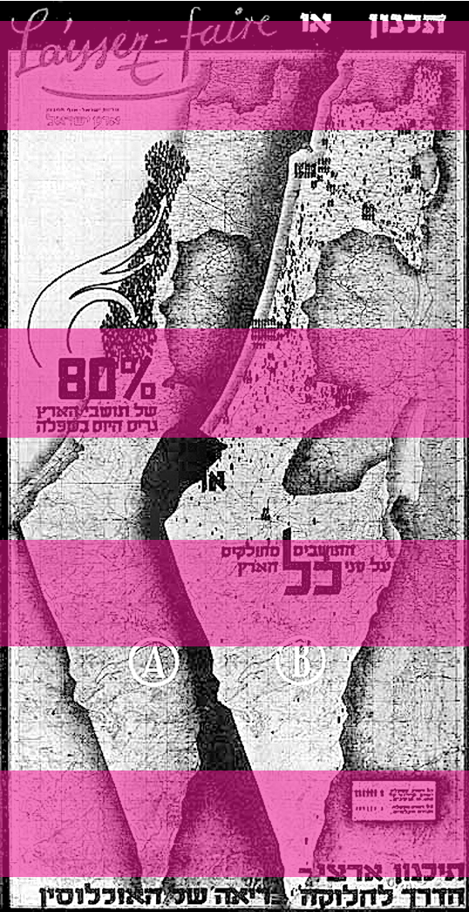
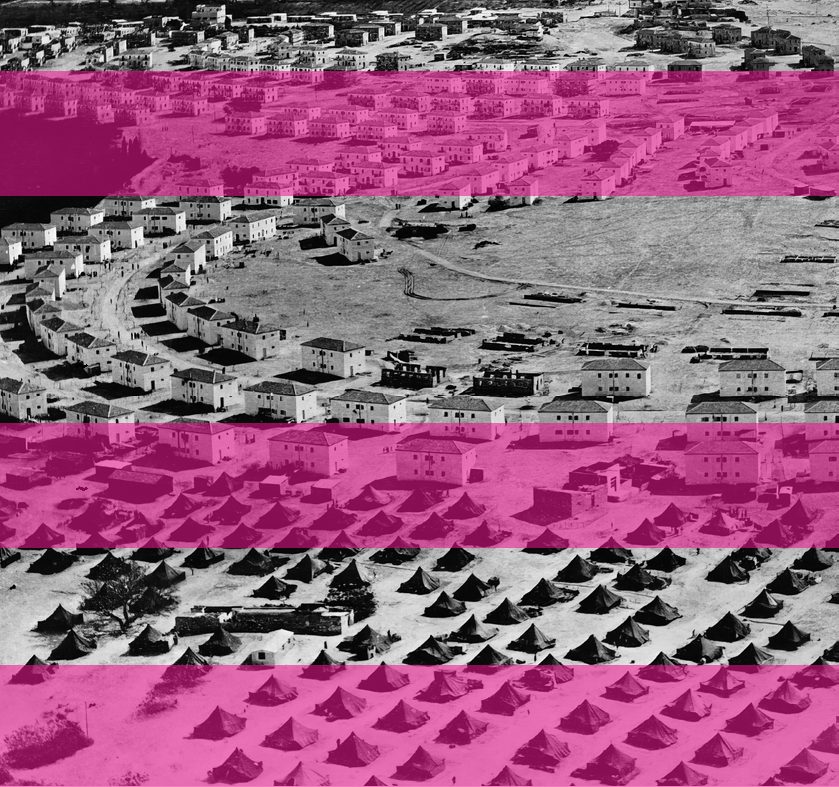

surowej przestrzeni, opisanej na planie jako food court, zasiedli obok majestatycznego komina, aby wysłuchać prezentacji aktualnego właściciela obiektu. Kilkadziesiąt osób, potencjalnych najemców lokali, miało okazję zapoznać się z proponowanymi możliwościami biznesowymi dla lokalnych usługodawców. Jak zaznaczyli organizatorzy – oferowanych na preferencyjnych warunkach. Niewiele wcześniej ogłoszeni zostali więksi najemcy, wśród których znalazło się wiele popularnych marek odzieżowych i spożywczych. Mocno standardowy zestaw unikalnych marek, choć zawierający dużo bardziej dyskontowe sieci niż ten sprzed kilku lat, miał pomóc Bawełniance stać się kolejnym sercem Bełchatowa. Na konferencji pełnomocnik zarządcy po raz kolejny oficjalnie przyznał, że planowano uruchomienie galerii dużo wcześniej, jednak wiele aspektów przyczyniło się do zaistniałego opóźnienia32.

Bawełnianki, być może nawet bardziej intrygującym niż jego potencjalna nowa oferta. Czy będzie to ostatni, czy tylko następny zakręt na niespodziewanie długiej trasie jednego z największych pustostanów w Polsce? – nie wiadomo. Na razie na ulicy Bawełnianej wciąż wybrzmiewa kolejny refren tej absurdalnej i przydługiej już piosenki •

103 — — planowaniehistoria lut y 2023, cz yli epilog, który ma szansę stać się prologiem

Podczas jednej z ostatnich nieplanowanych przechadzek niespodziewanie nic nie zagrodziło mi drogi. Z zaskoczeniem odkryłem, że metalowych barierek odgradzających galerię od reszty świata jest coraz mniej, a we wnętrzach pojawia się coraz więcej szklanych paneli i ścianek z karton-gipsu. Zastane mury i powietrze zaczęły ponownie drgać. Na razie w częstotliwościach właściwych mieszalnikom i mechanicznym zacieraczkom. Uruchomiona po długiej przerwie strona internetowa zarządcy zwiastuje kolejne wielkie otwarcie – już w marcu 2023 r. Wszystkie te sensacje zdają się już jednak nie powodować większego poruszenia wśród mieszkańców. Fiasko planowania stało się poniekąd znakiem rozpoznawczym

32 M. Buchalska-Frysz, Galeria Bawełnianka w Bełchatowie deklaruje otwarcie na wiosnę 2023. Są nowi najemcy, portal: belchatow.naszemiasto.pl, https://belchatow.naszemiasto.pl/galeria-bawelnianka-w-belchatowie-deklaruje-otwarcie-na/ar/ c3-8873595 (data dostępu: 19.01.2023).

### PLAN SHARONA

PLANOWANIE IZRAELA W LATACH 1948–1953

U R S Z U L A P R O KO P

# ~

trudną historią europejskiej diaspory. Kraj ten miał być zamieszkany przez nowych ludzi – silnych, energicznych, podporządkowujących sobie ziemię, „sprawiających, że pustynia kwitnie”2.

ziemia, naród, czas1

Początki zorganizowanego osadnictwa żydowskiego na terenie Palestyny sięgają końca XIX w., kiedy kraina ta była jeszcze częścią Imperium Osmańskiego. Po I wojnie światowej kolonizacja rozwijała się pod protektoratem brytyjskim. Pozwoliło to na szybki rozwój kapitalistycznego Tel Awiwu oraz zakładanie syjonistycznych, kolektywnych osiedli rolniczych, takich jak kibuce i moszawy. Celem syjonistów było stworzenie na terenie Palestyny miejsca do życia dla nowoczesnego narodu, nieobciążonego

Państwo Izrael powstało 14 maja 1948 r. na mocy Rezolucji Zgromadzenia Ogólnego ONZ. W pierwszych wyborach zwyciężyła socjalistyczno-syjonistyczna partia Mapai z premierem Dawidem Ben Gurionem na czele. Reakcją na uniezależnienie się państwa był wybuch I wojny izraelsko-arabskiej. W efekcie konfliktu doszło do znaczących migracji ludności. Z terenów nowo powstałego kraju uciekło 759 tys. Palestyńczyków. Szukali schronienia w ościennych państwach arabskich. W trakcie kolejnych dwóch

1 Według Arieha Sharona trzy główne czynniki wpływające na charakter planowania zabudowy Izraela to: ziemia (land), w rozumieniu uwarunkowań klimatycznych i topograficznych, naród (people), w kontekście dynamicznych zmian populacji oraz zróżnicowania kulturowego i etnicznego mieszkańców, a także czas (time), w kontekście konieczności podejmowania szybkich decyzji i działań, zob: A. Sharon, Planning in Israel, „The Town Planning Review” 1952, nr 23, s. 6.

2 Making the desert bloom– popularny wśród syjonistów slogan propagandowy. Wbrew temu stwierdzeniu tereny określane jako pustynne były w dużej mierze zamieszkiwane i uprawiane przez arabskich rolników – fellachów.

lat około 700 tys. Żydów z Azji i północnej Afryki postanowiło przedostać się na teren Izraela3. Była to ogromna liczba, biorąc pod uwagę, że w dniu proklamacji państwa liczba ludności żydowskiej na tamtych terenach wynosiła około 655 tys.4 Przewidywano, że w ciągu kilkunastu

W czasie trwania prac grupa składająca się z architektów, urbanistów, inżynierów, ekonomistów i socjologów liczyła od 80 do 170 osób7.

105 — — planowaniehistoria organizacja, koordynacja, synteza8

Arieh Sharon i jego zespół oparli proces kolonizacji kraju na pięciu filarach: rolnictwie, przemyśle, drogach, ochronie krajobrazu oraz Nowych Miastach. Każdy z elementów odgrywał ważną rolę nie tylko z gospodarczego, lecz także z ideologicznego punktu widzenia – realizował rządową politykę umocnienia granic poprzez decentralizację i militaryzację kraju.

CELEM SYJONISTÓW BYŁO STWORZENIE NA TERENIE PALESTYNY MIEJSCA DO ŻYCIA DLA NOWOCZESNEGO NARODU, NIEOBCIĄŻONEGO TRUDNĄ HISTORIĄ EUROPEJSKIEJ DIASPORY

W planie szczegółowo wytyczono tereny przeznaczone pod rolnictwo. Zakładano, że przy ich uprawie zatrudnienie znajdzie lat populacja wzrośnie do ponad 2,5 mln mieszkańców. Kraj borykał się z ogromnym problemem mieszkaniowym. Nowe fale imigrantów przybywały drogą morską i osiedlały się na przeludnionym wybrzeżu5. Rząd musiał podjąć natychmiastowe kroki w celu zapewnienia miejsca do życia nowym obywatelom.

ARIEH SHARON I JEGO ZESPÓŁ OPARLI

PROCES KOLONIZACJI KRAJU NA PIĘCIU FILARACH: ROLNICTWIE, PRZEMYŚLE, DROGACH, OCHRONIE KRAJOBRAZU

W 1949 r., jeszcze w czasie wojny o niepodległość, powołany został Departament Planowania, którego dyrektorem został Arieh Sharon6. Przyjął zadanie utworzenia interdyscyplinarnego zespołu specjalistów odpowiedzialnych za wskazanie kierunku rozwoju przestrzennego kraju oraz rozwiązanie problemów infrastrukturalnych, szczególnie w obszarze mieszkalnictwa.

ORAZ NOWYCH MIASTACH

nawet 600 tys. osób, czyli około 22% przewidywanej ludności kraju. Grupa ta miała wytwarzać 75% zapotrzebowania państwa na żywność9. W obliczu konfliktu Izraela ze wszystkimi sąsiadami oraz niestabilnej sytuacji gospodarczej efektywna produkcja rolna pozwoliłaby na uniezależnienie się od kosztownego sprowadzania żywności drogą morską.

- 3 Z. Efrat, The Object of Zionism: Architecture of Statehood in Israel 1948–1973, Princeton 2014, s. 107.
- 4 W ciągu trzech lat od powstania kraju jego populacja się podwoiła, a w 1966 r. osiągnęła liczbę zakładaną w planie Sharona, czyli 2 650 000 osób, za: A. Sharon, dz. cyt., s. 3–5.
- 5 W 1948 r. około 82% ludności kraju mieszkało w nadmorskim pasie pomiędzy Tel Awiwem i Hajfą, za: A. Sharon, Kibbutz+Bauhaus. Architect’s Way in a New Land, Stuttgart–Masada 1975, s. 78.
- 6 Arieh Sharon (1900–1984) urodził się w Jarosławiu jako Ludwik Kurzmann, w 1920 r. wyemigrował do Palestyny, gdzie zaangażował się w rozwój ruchu kibucowego, w 1926 r. wrócił do Europy i podjął studia w Dessau pod kierunkiem Hannesa Mayera, w 1931 r. wyemigrował na stałe do Palestyny i stał się kluczową postacią izraelskiej architektury i urbanistyki.

Jako rozwiązanie problemu ogromnego deficytu mieszkań planiści zaproponowali budowę Nowych Miast, które na wzór europejskich miasteczek miały stać się centrami administracyjno-usługowymi dla okolicznych terenów rolniczych. Zespół Sharona opracował masterplany 20

- 7 A. Sharon, Kibbutz…, s. 78.
- 8 Według Sharona „organizacja, koordynacja i synteza” czynników takich jak ekonomia, socjologia i obronność to podstawa dobrego planowania państwa, zob. A. Sharon, Planning…, s. 3.
- 9 Tamże, s. 5.

10633 —RZUT+

Il. 1.

Planowanie kontra liberalizm gospodarczy", tablica promująca politykę przestrzenną Planu Sharona podczas wystawy w Muzeum Sztuki w Tel Awiwie, 1950, zdjęcie z kolekcji rodziny A. Sharona

"

zespołów zabudowy, każdy dla około 50 tys. mieszkańców10. Z punktu widzenia struktury przestrzennej miasteczka stanowiły połączenie idei miast ogrodów oraz zakorzenionych już w krajobrazie kraju kibuców. Cechowały się organicznymi planami i wyraźną segregacją funkcji. W środku układu mieściło się centrum usługowe i administracyjne, wokół którego lokowano kolonie mieszkaniowe (po 6–10 tys. osób). Każda miała własną szkołę i rozległe tereny zielone, a ich wnętrza wyłączone były z ruchu samochodowego. Na obrzeżu całego układu lokalizowano dzielnicę lub zakład przemysłowy. Skala miasta miała pozwolić na zaspokojenie wszystkich najważniejszych potrzeb w promieniu maksymalnie 750 metrów od domu.

oraz rezerwatów przyrody. Miejsca zostały dobrane w taki sposób, aby przez edukację kształtować tożsamość rodzącego się narodu i umacniać jego więź z ziemią przodków. Obiekty o szczególnym zna-

107 — — planowaniehistoria

MIEJSCA ZOSTAŁY DOBRANE W TAKI SPOSÓB, ABY PRZEZ EDUKACJĘ KSZTAŁTOWAĆ TOŻSAMOŚĆ RODZĄCEGO SIĘ NARODU I UMACNIAĆ JEGO WIĘŹ Z ZIEMIĄ PRZODKÓW

czeniu historycznym i symbolicznym (np. Masada) poddawane były restauracji, a czasem nawet rekonstrukcjom. W tym samym czasie murowane świadectwa kultury i osadnictwa arabskiego były adaptowane do funkcji technicznych, wyburzane lub zasłaniane gęstą zielenią12. Ponadto na wszystkich terenach, które z różnych przyczyn nie nadawały się do upraw, wprowadzono program intensywnego zalesiania.

Budowa nowych ośrodków miejskich pozwalała na rozproszenie przemysłu, który w momencie proklamacji państwa skoncentrowany był na wybrzeżu, a około 50% zakładów zlokalizowanych było w Tel Awiwie lub na jego obrzeżach. Planiści widzieli w tym duże zagrożenie rozwoju miasta oraz powrót do XIX-wiecznego modelu urbanistycznego. Zaproponowano przeniesienie przemysłu i jego dalszy rozwój na peryferiach kraju, w okolicach nowo projektowanych miast, dzięki czemu ich przyszli mieszkańcy mieli zyskać łatwy dostęp do miejsc pracy11.

decentr alizacja, militaryzacja, hebr aizacja

Hasłem przewodnim łączącym wszystkie zagadnienia planu była decentralizacja państwa. Władze oraz planiści byli przeświadczeni, że koncentrację ludności na wybrzeżu należy traktować jako anomalię oraz „kolonialny wzorzec osiedleńczy”13 będący spuścizną brytyjskiego mandatu Palestyny. Próbą odejścia od tego modelu był podział kraju na 24 regiony o zbliżonej liczbie ludności. Każdy wyodrębniono na podstawie zasobów gospodarczych, uwarunkowań geograficznych i źródeł historycznych14, a jego struktura została oparta na lokalizacji pięciu podstawowych typów urbanistycznych: wsi, centrów wiejskich, centrów wiejsko-miejskich, małych miast i trzech dużych miast (Tel Awiwu, Hajfy

Rozproszenie ludności i przemysłu musiało wiązać się z intensywnym rozwojem sieci drogowej i kolejowej, a także programem dystrybucji wody, która miała być transportowana z północy kraju na tereny pustynne w jego południowej części.

Ostatnim kluczowym założeniem projektu była ochrona naturalnego krajobrazu oraz miejsc o wysokich walorach historycznych i kulturowych. Zgodnie z planem ustanowiono kilkadziesiąt obszarów chronionych: parków narodowych

- 10 Według różnych źródeł populacja Nowych Miast miała wahać się od 20 do nawet 80 tys. osób. Za najbardziej odpowiednie planiści uznali jednak te liczące od 20 do 50 tys. mieszkańców.
- 11 A. Sharon, Planning…, s. 6.

- 12 Z. Efrat, dz. cyt., s. 138, 184.
- 13 A. Jasiński, Architektura i urbanistyka Izraela, Kraków 2016, s. 103.
- 14 A. Sharon, Kibbutz…, s. 78.

## 10833 —RZUT+

Il. 2. Arieh Sharon na forum Uniwersytetu Technicznego w Hajfie, 1960, zdjęcie z kolekcji rodziny A. Sharona i Jerozolimy)15. Plan Sharona realizował nie tylko utopijne wizje planistów, lecz także strategiczne cele rządzących. Decentralizacja miała stać się kluczowym elementem militarnego bezpieczeństwa kraju. W przypadku nie palestyńskich uchodźców do powrotu do swoich domów17. Nowe jednostki osadnicze lokalizowane były często w miejscu opustoszałych wsi palestyńskich lub w pobliżu ośrodków zamieszkanych przez ludność arabską, równoważyły przez to strukturę etniczną regionów.

Kolonizacja zajętej ziemi przez Izrael odbywała się również w warstwie językowej. Wypierano zwyczajowe nazwy geograficzne i zastępowano je nowymi – hebrajskimi, które rzekomo odwoływały się do pierwotnych terminów odnajdowanych w starożytnych pismach18.

ROZPROSZENIE ZABUDOWY MIAŁO ZA ZADANIE TAKŻE LEGITYMIZACJĘ GRANIC USTALONYCH PO WOJNIE O NIEPODLEGŁOŚĆ ORAZ ZNIECHĘCENIE PALESTYŃSKICH UCHODŹCÓW DO POWROTU DO SWOICH DOMÓW

k apitał, pr awo, wł asność

Po zaledwie dwóch latach pracy zespołu Sharona plan został w całości przyjęty przez rząd. Mimo że stanowił w tamtym czasie jedynie czytelnie przedstawiony zarys koncepcji rozwoju kraju, został natychmiast wprowadzony w życie. Teren zagrożenia cywilne osady można było wykorzystać jako przyczółki obronne. Rozproszenie zabudowy miało za zadanie także legitymizację granic ustalonych po wojnie o niepodległość16 oraz zniechęce-

- 15 Tenże, Planning…, s. 6.
- 16 A. Jasiński, dz. cyt., s. 103.

- 17 Z. Efrat, dz. cyt., s. 127.
- 18 Tamże, s. 138.

całego Izraela zamienił się w wielki plac budowy. W ciągu kolejnych kilkunastu lat stworzono ponad 20 miast, drogi, parki i fabryki. W środowisku architektonicznym plan był krytykowany za zbytni optymizm. Projektanci starali się nawet opóźnić jego realizację w obawie o niską jakość realizowanych przestrzeni, jednak nie byli w stanie powstrzymać władz nastawionych na szybki wymierny efekt19.

rozwój, podział, w ykluczenie

109 — — planowaniehistoria

Mimo sprzyjających warunków politycznych gwałtowna realizacja założeń planu napotkała liczne problemy. Rozwój przemysłu w wyznaczonych do tego ośrodkach był opóźniony lub zablokowany przez brak infrastruktury drogowej, dostępu do energii, wody i surowców22. Tanie grunty na peryferiach kraju nie zachęcały inwestorów. Rządowi zależało na zapewnieniu miejsc pracy ludności kolonizującej nowo powstałe regiony, dlatego wprowadzał znaczne obniżki podatków i dofinansowania do lokalizowania przemysłu w okolicach nowych miast23.

Jak to możliwe, że tak kompleksowy plan został skutecznie wprowadzony w życie? Wydaje się, że przyczyną tego stanu był chaos spowodowany czasem wojny i stopniowego budowania się struktur politycznych kraju. Większość decyzji zapadała na mocy specjalnych, kryzysowych regulacji prawnych, z pominięciem rozbudowanych procedur konsultacji i akceptacji rozwiązań. Poza tym rząd ustanowił na ten cel dwa źródła finansowania: podstawowy budżet państwa oraz specjalny fundusz rozwojowy zasilany przez datki, kredyty oraz reparacje wojenne. Fundusz ten mógł być wykorzystywany na bieżąco, gdyż wydatki z niego nie wymagały zgody parlamentu20.

Niemal cały kraj zaczął pokrywać się ekstensywną, jedno- lub dwupiętrową zabudową. Budynki stawiane były szybko, często przez niewykwalifikowane ekipy składające się z imigrantów zamieszkujących prowizoryczne obozy. W pierwszej kolejności wznoszono obiekty mieszkaniowe, co uniemożliwiało nowym mieszkańcom łatwy dostęp do usług i miejsc pracy. Migrantom pochodzącym z Azji i Afryki trudno było przyzwyczaić się do życia w funkcjonalistycznych budynkach, których nie byli nawet właścicielami24. Nowoczesne i higieniczne osiedla miały w zamyśle doprowadzić do integracji rodzącego się społeczeństwa. W rzeczywistości wpłynęły na pogłębienie się podziałów pomiędzy mizrachijczykami25 a dawnymi osadnikami i przybyłymi z Europy żydami aszkenazyjskimi, którzy najczęściej osiedlali się u rodzin w dużych miastach lub zostawali przyjęci do społeczności kibuców.

Kluczowym czynnikiem pozwalającym na realizację tak kompleksowego projektu było też niemal całkowite upaństwowienie gruntów, które objęło około 90% powierzchni kraju. Ziemia została w większości skonfiskowana zbiegłym Palestyńczykom na mocy ustawy o mieniu opuszczonym, uchwalonej w roku 195021. Wbrew popularnym hasłom „podboju pustyni” wiele z przejętych terenów od dziesięcioleci było zamieszkiwanych i uprawianych przez arabskich rolników. Przed proklamacją państwa handel gruntami był dokładnie kontrolowany przez Brytyjczyków, a żydowska kolonizacja przebiegała głównie na terenach wykupywanych przez prywatnych inwestorów lub wspólnoty kibucowe wspierane darowiznami.

Narastająca frustracja mieszkańców Nowych Miast stała się jedną z przyczyn upadku rządów partii socjalistycznych w 1977 r. Migranci umocnili pozycję prawicowego Likudu, który po dojściu do władzy zmienił kierunek polityki

- 22 A. Sharon, Kibbutz…, s. 78.
- 23 Tamże, s. 79–80.
- 24 Z. Efrat, dz. cyt., s. 172.
- 25 Żydzi wywodzący się z terenów Bliskiego Wschodu, Afryki Północnej i Azji Środkowej; w języku hebrajskim mizrahioznacza ‘wschodni’.

- 19 A. Sharon, Kibbutz…, s. 78.
- 20 Z. Efrat, dz. cyt., s. 126.
- 21 S. Rotbard, Białe miasto, czarne miasto. Architektura i wojna w Tel Awiwie i Jafie, Warszawa 2022, s. 46.

Il. 3. Bat Yam, budowa osiedla dla rodzin żyjących w prowizorycznym obozie, The National Plan, 1950, upublicznione materiały rządowe dostępne na mavat.iplan.gov.il przestrzennej państwa. Wprowadził intensywne procesy renowacyjne oraz program „wybuduj własny dom”. Program renowacji ograniczał się często do zdobienia elewacji i malowania ich na radosne kolory, możliwość rzeczywistego wzniesienia własnego budynku mieszkalnego była natomiast przełomem26. Nowe Miasta zostały otoczone przez konstelacje domów jednorodzinnych powstających na gęsto parcelowanych działkach, których formy manifestowały sprzeciw wobec ascetycznej architektury budownictwa socjalistycznego.

Zmiana polityki była jedynie pozorna. Pomysł decentralizacji zabudowy jako metody zawłaszczania kolejnych terenów nie tylko nie został wycofany, lecz także się zradykalizował. Po oczyszczeniu z ideologii socjalistycznej posłużył jako sposób zaspokojenia ambicji terytorialnych kolonizatorów Zachodniego Brzegu27.

26 S. Rotbard, dz. cyt., s. 46.

27 Z. Efrat, dz. cyt. s., 172.

