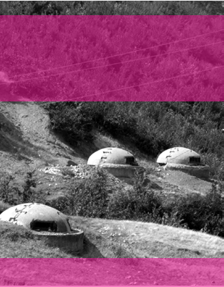
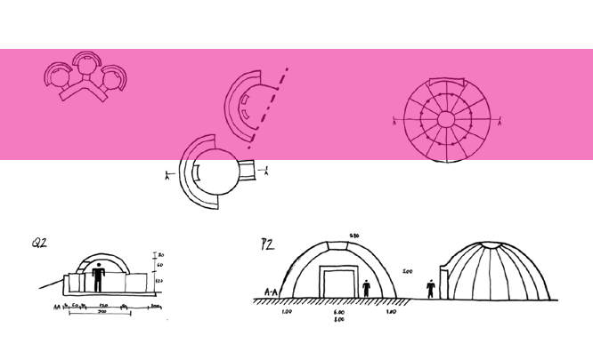
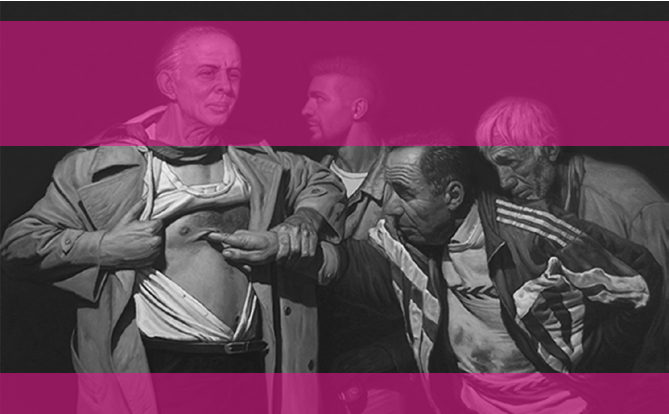
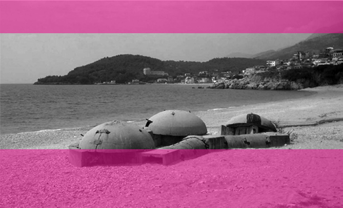
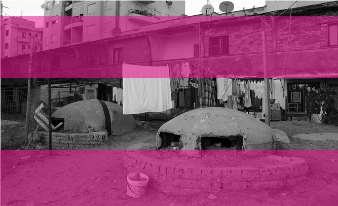

111 — — planowaniehistoria epilog

Pierwsze lata istnienia Izraela były przykładem inżynierii społecznej mającej budować siłę i jedność tworzącego się narodu w państwie o niepewnej sytuacji geopolitycznej. Jednym z elementów umocnienia pozycji w regionie stał się

PROJEKT TEN W EFEKCIE STAŁ SIĘ NARZĘDZIEM OPRESJI WOBEC MIEJSCOWEJ LUDNOŚCI ORAZ WAŻNYM ELEMENTEM SYTEMU OBRONNOŚCI KRAJU

kompleksowy eksperymentalny projekt zabudowy kraju, który czerpał z europejskich nurtów modernizacyjnych, nakładając na nie ideologię syjonistyczną. Projekt ten w efekcie stał się narzędziem opresji wobec miejscowej ludności oraz ważnym elementem sytemu obronności kraju.

Plan Sharona stanowił także bezprecedensowy przykład skali i tempa planowania opartego na zaufaniu do kompetencji interdyscyplinarnego zespołu specjalistów. Jego realizacja pozwoliła czasowo ograniczyć niekontrolowane rozlewanie się dużych miast, rozwinąć infrastrukturę kraju oraz zapewnić miejsca do mieszkania najbardziej potrzebującym.

Paradoksalnie tym, co pozwoliło na efektywną realizację zamierzeń planistów, był chaos towarzyszący pierwszym latom istnienia państwa. Na skutek ustabilizowania się sytuacji i stopniowej biurokratyzacji procesu w 1953 r. niemal wszyscy projektanci zdecydowali się na odejście z zespołu i powrót do swoich prywatnych praktyk28 •

28 A. Sharon, Kibbutz…, s. 81.

KRAJ ŻELBETOWYCH GRZYBÓW

A N N A H A L E K

# ~

przed militarnymi wrogami. Jednak żaden z potencjalnych agresorów ostatecznie nie zaatakował kraju, a bunkier pomnożony niezliczoną ilość razy stał się rdzeniem polityki opartej na traumie jednostki. Powszechny strach, mający swoje źródło w ciągłych najazdach i latach okupacji kraju, w odniesieniu do rzeczywistości lat 70. XX w. nie miał realnych podstaw. Jednak skutki jego podsycania są odczuwalne w Albanii do dzisiaj.

Bunkier – utwardzony schron, często zakopany częściowo lub całkowicie pod ziemią, przeznaczony do ochrony ludzi, sprzętu wojskowego i zasobów przed bombardowaniami lub innym rodzajem ataków1.

Według definicji konstrukcja bunkra i jego zasadnicze przeznaczenie służą celom obronnym. W przypadku albańskich schronów budowanych w okresie zimnej wojny to zamierzenie nie zostało w pełni zrealizowane. Gdy świat rozwijał system obrony antynuklearnej, Albania realizowała program bunkryzacji. Projekti Bunkerizimit był przestrzenno-politycznym planem samoobrony kraju, rozpoczętym przez Envera Hoxhę w latach 70. XX w. Projekt zakładał budowę 750 tys. bunkrów na obszarze całej Albanii, a jego główną ideą było zapewnienie schronienia zarówno wszystkim żołnierzom, jak i cywilom bunkier – obiekt architektoniczny w y wodzący się z t ypologii militarnej

W 1944 r., po latach okupacji przez wojska włoskie i niemieckie, rozpoczął się nowy okres w historii Albanii. Wtedy to Enver Hoxha, pierwszy sekretarz Komitetu Centralnego Komunistycznej Partii Pracy i komisarz polityczny Armii Wyzwolenia Narodowego, będący jedynym kandydatem, został wybrany na premiera, a kraj ogłoszono Republiką Ludową.

1 G. Mydyti, E. Stefa,Concrete Mushrooms. Reusing Albania’s 750,000 Abandoned Bunkers, Barcelona 2012, s. 30.

Przez lata swoich dyktatorskich rządów Hoxha zrywał sojusze dyplomatyczne, co stopniowo prowadziło do odseparowania Albanii od środowiska międzynarodowego. Ostatecznie jego rządy doprowadziły do całkowitej izolacji kraju. Możliwość samoobrony stała się więc priorytetem dyktatora, a plan pod hasłem bunkier

## 113 — — planowaniehistoria dla każdej rodzinywiodącym programem rządowym. Tak skonstruowana narracja polityczna przypisała Hoxhy rolę protektora swojego narodu. Państwo zaoferowało Albańczykom panaceum w postaci obiektu architektonicznego, zmaterializowanej idei bezpieczeństwa – bunkra.

Surowe formy żelbetowych grzybów zostały zaprojektowane w trzech rozmiarach. Najmniejszy i najprostszy typ stanowiły bunkry QZ (Qender Zjarri). Przeznaczone były dla pojedynczego żołnierza z bronią. Wzdłuż linii brzegowej bunkry QZ lokowane były często w grupach po trzy, połączone betonowymi korytarzami. Te najmniejsze konstrukcje nie spełniały w pełni zasad obrony militarnej, zgodnie z którymi żołnierze walczący na froncie nigdy nie powinni być usytuowani pojedynczo. Bunkry średniej wielkości, PZ (Pike Zjarri), przeznaczone były dla grup ludzi (niektóre nawet dla ponad 10 osób) lub małej artylerii. Elementy konstrukcji schronów PZ były prefaIl. 1. Albańskie schrony rozsiane na obszarach górskich i samolotów. Spośród wszystkich trzech typów bunkrów tylko te były wyposażone w tunele przeciwatomowe, niezbędne podczas ewentualnego ataku nuklearnego. Tym samym realne bezpieczeństwo zapewniono jedynie jednostkom, a reszcie narodu oferowano tylko jego iluzję.

Pokoleniowa trauma narodu, związana z trwającymi przez stulecia najazdami i okupacją przez m.in. starożytnych Greków, Rzymian czy Turków, dostarczyła nowemu państwu komunistycznemu argumentów, które posłużyły do wzmocnienia statusu Hoxhy i zbudowania jego obrazu jako ojca i obrońcy narodu. Plan stworzenia linii obrony przed okupantem napędzał poczucie strachu i kreował zarazem pozorną wizję bezpieczeństwa. Będąc odpowiedzią na iluzoryczną rzeczywistość, albańskie bunkry mogą być postrzegane jako heterotopie – miejsca, których

MOŻLIWOŚĆ SAMOOBRONY STAŁA SIĘ WIĘC PRIORYTETEM DYKTATORA, A PLAN POD HASŁEM BUNKIER DLA KAŻDEJ RODZINY WIODĄCYM PROGRAMEM RZĄDOWYM. TAK SKONSTRUOWANA NARRACJA POLITYCZNA PRZYPISAŁA HOXHY ROLĘ PROTEKTORA SWOJEGO NARODU

brykowane i łączone na miejscu. Ostatnimi i najsolidniejszymi z albańskich bunkrów były Struktury Specjalne (Struktura Speciale). Budowane dla ważnych postaci sceny politycznej i ich rodzin lub jako bazy dla łodzi podwodnych, ciężkiej artylerii

[…] rolą jest tworzenie przestrzeni iluzji, która obnaża każdą przestrzeń rzeczywistą, […] albo przeciwnie, ich rolą jest stworzenie innej przestrzeni realnej […]2.

2 M. Foucault, J. Miskowiec, Of Other Spaces,

„Diacritics” 1986, t. 16, nr 1, s. 27.

## 11433 —RZUT+

Il. 2. Schemat konstrukcji trzech rodzajów wielkości bunkrów

Projekti Bunkerizimit jest przykładem formy pełniącej funkcję nie jako konkretna przestrzeń materialna, ale na płaszczyźnie psychologicznej. Półsferyczna struktura bunkra była przestrzenną odpowiedzią na wątpliwości nie tylko co do zasadności skali założenia, lecz także jakości realizowanych bunkrów. Sposób ich wykonania i użyte do ich realizacji materiały nie spełniały podstawowych wymogów militarnych. Jeśli betonowe obiekty miały być przede wszystkim schronieniem, to ich jakość powinna stanowić priorytet. „Dla nas, jako części wojska, wstydem było widzieć, że te struktury nie miały zdolności obronnych”3, mówili w jednym z wywiadów Rrahman Parllaku i Edip Ohri, albańscy żołnierze walczący podczas II wojny światowej i wojny w Kosowie.

CAŁY BUDŻET KRAJU I WSZYSTKIE DOSTĘPNE MATERIAŁY BUDOWLANE PRZEZNACZANO NA SZERZENIE ILUZORYCZNEGO BEZPIECZEŃSTWA, BĘDĄCEGO TAK NAPRAWDĘ REŻIMEM MILITARNYM W PRZESTRZENI PUBLICZNEJ

Szacuje się, że w rezultacie masowej produkcji bunkrów krajobraz Albanii zyskał od 100 do 750 tys. żelbetowych grzybów. Ich liczba nie jest dziś możliwa do określenia, gdyż wszelkie mapy i dokumenty zaginęły po upadku komunizmu. Betonowa megainwestycja Hoxhy pogrążyła niestabilną już wcześniej gospodarkę kraju. Budowa bunkrów pochłaniała rocznie prawie 2% PKB, a koszty powstania jednej struktury porównywano do kosztów realizacji małego mieszkania. Cały budżet kraju i wszystkie dostępne materiały budowlane przeznaczano na szerzenie iluzorycznego bezpieczeństwa, paranoiczne obawy Hoxhy. Niezależnie od możliwości realnego zastosowania obiekty te miały dawać złudzenie ochrony i autonomii od utraconych sojuszników.

Bez względu na wątpliwą praktyczność i brak oparcia w aktualnej sytuacji politycznej paranoiczny plan Hoxhy musiał zostać w pełni zrealizowany. Dążenie do spełnienia założeń ilościowych (zaplanowane 750 tys. struktur), zamiast kierowania się taktyką wojskową i racjonalnym myśleniem, było uzasadnieniem do wprowadzenia technologii prefabrykacji. Masowa produkcja fortyfikacji wzbudzała

3 G. Mydyti, E. Stefa, dz. cyt., s. 26.

115 — — planowaniehistoria

Il.3.

In Your Vein", Enkelejd Zonja Hoxha przedstawiony jako zmartwychwstały Jezus, który pozwala niedowierzającemu Tomaszowi włożyć palec w swoją ranę

"

będącego tak naprawdę reżimem militarnym w przestrzeni publicznej. Jednak trud codziennego życia w dramatycznych warunkach ekonomicznych nie był dla Albańczyków jedyną konsekwencją planu bunkryzacji.

nawet byłynaszymi katedrami5, co ukazuje, jak ważne dla społeczeństwa jest posiadanie własnych obiektów kultu.

Kiedy w 1999 r. Albania znalazła się w obszarze konfliktu Serbii z Kosowem, jej przygraniczne bunkry po raz pierwszy zostały wykorzystane zgodnie z ich przeznaczeniem. Wtedy też zasłona mitu o nuklearnej obronie czy wręcz o jakiejkolwiek trwałości tych obiektów opadła, bunkry się rozpadły.

bunkier – symbol przeszłości, szczególny t yp albańskiego pomnik a

Życie w zmilitaryzowanym krajobrazie i styczność z wojskowymi strukturami generowało ciągły stan napięcia i obawy co do przyszłości kraju. Program nasilał poczucie społecznego lęku, zamiast je niwelować.

bunkier – trwały element kra jobrazu albanii

Z symbolu opresji schrony zmieniły się w część codzienności. Będąc nieodłącznym elementem znajomego otoczenia, przestały być oceniane przez pryzmat celowości czy przydatności. Bunkryzacji podporządkowany został cały krajobraz, stworzono nową warstwę topografii Albanii. Projekti Bunkerizimit zakorzenił się

[…] niezwykle trudno jest odbunkrowaćnasze umysły, nasze uczucia: oto efekty posttotalitarnej traumy w naszym społeczeństwie4.

Schrony stanowią obecnie namacalny aspekt trudnej przeszłości, o której nie sposób zapomnieć. W kraju o stosunkowo krótkim okresie autonomii bunkry zostały wyniesione do rangi architektonicznego symbolu. Przez niektórych nazywane

5 O. Rupeta, Temples of an Atheist State, „Broad” 2018, https://www.broad.community/ blog/2018/6/8/temples-of-an-atheist-state-oleksandr-rupeta (data dostępu: 24.02.2023).

4 G. Mydyti, E. Stefa, dz. cyt., s. 34.

11633 —RZUT+

- Il. 4. Potrójna seria połączonych bunkrów QZ na albańskiej plaży
- Il. 5. Bunkry w mieście Durres

