nie tylko na strategicznych liniach frontu wojskowego. Kraj o bardzo zróżnicowanym i jednym z najbardziej dziewiczych terenów w Europie w latach 70. wzbogacony został o dodatkowy element pejzażu – betonowe grzyby. Rozsiane są na obszarach miejskich, wiejskich, nadmorskich i górskich.

oznaczałoby dla narodu zagładę. W zaistniałej rzeczywistości spekulacje dyktatora upozycjonowały bunkry na peryferiach codzienności. Świadomość odrealnienia i niefunkcjonalności programu sprawia, że życiowy plan Hoxhy można traktować jako akt przestrzennego performance’u o skali krajowej. Jego główny bohater – bunkier – z pierwszoplanowej postaci wyewoluował do roli obywatela, sąsiada •

117 — — planowaniehistoria

Hoxha i jego partia zdołali przekształcić na własne potrzeby wszystkie formy kultury materialnej, w tym […] cały krajobraz6.

Latami nieużywane, zarośnięte i wtopione w otoczenie są wciąż łatwo rozpoznawalne po sztucznie symetrycznym kształcie. Mimo że bunkry mają formę zamkniętą, pozwalają różnym organizmom przenikać do swego wnętrza, zarastać je i funkcjonować wraz z nim. Upodobnione do otaczającego je środowiska bunkry przybrały rolę formacji skalnych, nadmorskiego wybrzeża, leśnego runa. Zdarza się, że pełnią funkcje przydomowych spiżarni czy nawet restauracji. Zaadoptowane przez albański krajobraz i społeczeństwo stanowią dziś nieodłączny i znaczący element środowiska. Są obiektami pomiędzy strukturą stworzoną przez człowieka a strukturą stworzoną przez naturę. Należą do obu, a jednocześnie nie dają się w pełni przejąć w posiadanie żadnej z nich.

Przez swoją powszechność bunkry stopniowo stały się niezauważalne dla mieszkańców Albanii. Ta niewidoczność może być postrzegana jako pewien stan zawieszenia. Fakt, że nigdy nie musiały spełniać swoich założeń funkcjonalnych, pozycjonuje je na marginesie użyteczności. Znajdują się w stanie liminalnym. „Jednostki liminalne nie są ani tu, ani tam; znajdują się pomiędzy pozycjami przypisanymi przez prawo, zwyczaj, konwencję i ceremoniał”7. Spełnienie przez bunkry swojej funkcji

- 6 M.L. Galaty, S.R. Stocker, Ch. Watkinson, The Snake That Bites. The Albanian Experience of Collective Trauma as Reflected in an Evolving Landscape, „The Trauma Controversy: Philosophical and Interdisciplinary Dialogues” 2009, nr 9, s. 172.
- 7 V. Turner, Liminality and Communitas, „The Ritual Process: Structure and Anti-Structure” 1969, s. 359.

PLANOWANIE DLA REWOLUCJI: PROGRAM SAAL

W I K T O R M A R T I N

# ~

We wczesnych latach 70. XX w. gwałtowna industrializacja Portugalii w połączeniu z kolonialną polityką prowadzoną przez reżim Estado Novo spowodowała poważny kryzys mieszkaniowy w całym kraju. Rozpoczęła się migracja biedniejszej ludności do dużych ośrodków miejskich, które jawiły się jako jedyna nadzieja poprawy poziomu życia. Lata nieefektywnie prowadzonej polityki mieszkaniowej spowodowały bezradność rządu wobec rosnącego popytu mieszkaniowego, co spychało coraz większą część społeczeństwa w sferę ubóstwa1. Brak wystarczającej podaży budownictwa socjalnego rozpoczął rozrost osiedli biedy. Na peryferiach aglomeracji Lizbony powstawały rozległe bairros de lata, natomiast w Porto uwidoczniły się dziesiątki miniaturowych ilhasw centrum miasta.

Badania statystycznie przeprowadzane w latach 1970–1973 ujawniły, że spośród 2,35 mln portugalskich rodzin 35 tys. mieszkało w obozowiskach, a 620 tys. w przepełnionych kwaterach2. Doprowadzono do stanu, w którym 40% istniejącej zabudowy mieszkaniowej miało ponad 50 lat, 53% budynków nie miało bezpośredniego dostępu do wody, 48% instalacji elektrycznej, a w 57% brakowało podstawowego wyposażenia sanitarnego3.

W tym samym roku złe nastroje społeczne dodatkowo nasiliły się za sprawą kryzysu naftowego i zauważalnego zmęczenia armii niekończącą się wojną kolonialną. Wśród wojskowych pojawiło się zwątpienie w słuszność prowadzonych walk, powodując sukcesywne podważanie pozycji, jaką do tej pory miał autorytarny Estado Novo. Pogłębiająca

- 2 Instituto Nacional de Estatística, Anuário Estatístico. Continente e Ilhas Adjacentes: 1973, Lizbona 1974.
- 3 Tamże.

1 N. Mota, An Archaeology of the Ordinary,

Delft 2014, s. 199.

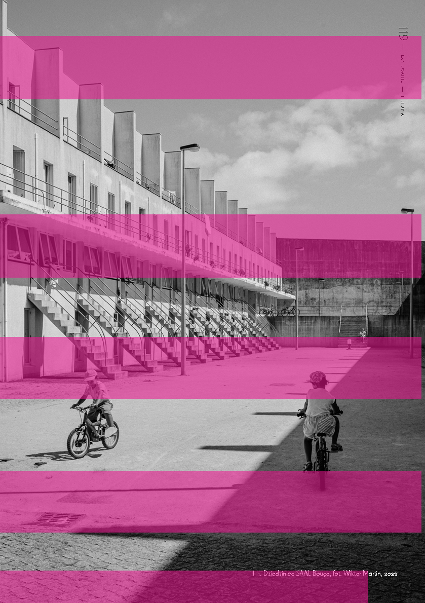

119 — — planowaniehistoria

Il. 1. Dziedziniec SAAL Bouça, fot. Wiktor Martin, 2022

się polityczna dychotomia pomiędzy słabnącym rządem a generałami doprowadziła 25 kwietnia 1974 r. do gwałtownego i niemal bezkrwawego zamachu stanu nazwanego Rewolucją Goździków4.

wielkoskalowe osiedla wokół głównych aglomeracji Peru budowane przez migrujące do miast ubogie społeczeństwo. Formułując swoją nowatorską strategię dla budownictwa socjalnego, Nuno Portas za główny cel projektu wyznaczył jej zapewnienie przystępnej cenowo, ale wciąż jakościowej zabudowy. Szansę na powodzenie tak ambitnego przedsięwzięcia dostrzeżono w oparciu całego procesu na oddolnej inicjatywie społecznej.

12033 —RZUT+

prawo do miasta

Przeprowadzony pucz okazał się czynnikiem katalizującym proces demokratyzacji państwa. Rewolucyjne przemiany zaoferowały obywatelom udział w polityce kraju, co sprawnie wykorzystywała klasa robotnicza, ukazując swoją kolektywną siłę. W licznych demonstracjach domagano się poprawy warunków mieszkalnych w uboższych dzielnicach miast. Zdeterminowani mieszkańcy dążyli do uzyskania fundamentalnego w XX w. prawa do posiadania godnego miejsca zamieszkania, a ich nieustępliwość wywierała ciągłą presję na tymczasowym rządzie.

rozłożenie sił

SAAL – Serviço de Apoio Ambulatório Local (Mobilna Usługa Lokalnego Wsparcia/ Lokalna Usługa Wsparcia Ambulatoryjnego7) powołano do istnienia 6 sierpnia 1974 r. Program powstał z zamiarem zneutralizowania wszechobecnego deficytu mieszkaniowego poprzez poprawę warunków życia w portugalskich miastach. Sprostanie oczekiwaniom wybudowania jak największej liczby jednostek mieszkalnych w jak najkrótszym czasie wymagało wprowadzenia wielu innowacyjnych rozwiązań oraz odejścia od odgórnego prowadzenia polityki przestrzennej. SAAL został ukierunkowany na przyznawanie technicznej i finansowej pomocy dla „oddolnych inicjatyw społecznych powstałych wśród obywateli żyjących w złych warunkach mieszkalnych”8, oferując im wsparcie na rzecz kolektywnej współpracy w przekształcaniu własnych osiedli.

Nowa władza, nie chcąc utracić poparcia i ponownego rozchwiania państwa, szukała pragmatycznego i taniego sposobu na zażegnanie niewygodnego problemu. Według relacji Nuno Portasa, ówczesnego sekretarza do spraw mieszkalnictwa i urbanistyki, porewolucyjny rząd planował wybudowanie prefabrykowanych koszarowych osiedli na obrzeżach dużych miast5. Portas, nie chcąc pozwolić na wprowadzenie tak bezwzględnego rozwiązania, rozpoczął poszukiwanie bardziej humanitarnej alternatywy. Położenie, w jakim znajdowała się gospodarka Portugalii, pozwalało jedynie na zastosowanie eksperymentalnego rozwiązania, w którym nie wykluczano udziału obywateli na etapie budowy. Portas niesiony filozofią wspólnoty, którą odnalazł w Otterlo CirclesAldo Van Eycka6, zaczął badać samoistnie powstające pueblos jóvenes – nowe miasta. Były to

- 6 KolażOtterlo Circleszostał pierwotnie zaprezentowany przez Aldo van Eycka w 1959 r. podczas ostatniego zjazdu CIAM. Eyck przedstawił autorską filozofię nazwaną Twinphenomena, obejmującą związek pomiędzy wartościami niesionymi przez architekturę (by Us) a wartościami potrzebnymi dla społeczeństwa (for Us). W 1960 r. powstała druga wersja manifestu precyzująca, że aby współczesna architektura mogła dalej nieść prawdziwe wartości, ruch modernistyczny powinien dopuścić do procesu jej powstawania społeczeństwo bez segregacji, klasyfikacji i wykluczania możliwych odbiorców (for Us). Zob. G. Teyssot,Aldo van Eyck’s threshold: The Story of an Idea, „Log” 2008, nr 11.
- 7 Tłum. własne.
- 8 SAALConselho Nacional, Livro Branco do SAAL

- 4 K. Kubiak, Portugalska „rewolucja goździków” w 1974 roku. Przyczyny – przebieg – następstwa, „Klio – Czasopismo Poświęcone Dziejom Polski i Powszechnym” 2021, t. 59, nr 3, s. 193–222.
- 5 Deklaracja Nuno Portasa, zob. J. Dias, As Operações SAAL, film dokumentalny, reż. Maria de Lurdes Oliveira, Midas Filmes, 2007.

1974–1976,cz. 1, Porto 1976.

Postanowienia programu wyszczególniały sześć kluczowych zasad, które miały zapewnić efektywność jego działania. Były to: samoorganizacja społeczności zdegradowanych osiedli, zachowanie istniejącej społeczno-przestrzennej relacji mieszkańców ze swoją wspólnotą, wsparcie lokalnej autonomii dzięki zmniejszeniu biurokratyzacji, włączenie zasobów własnych mieszkańców jako jednego ze źródeł finansowania domów, decentralizacja osiedli w celu łatwiejszej integracji społecznej, dostosowanie każdego projektu pod ewentualną rozbudowę i modernizację dzięki wprowadzeniu strategii Incremental Housing – budownictwa opartego na stopniowym wzroście9.

Po spełnieniu kilku formalnych warunków zawiązane spółdzielnie otrzymywały od rządu bezzwrotną dotację, uzależnioną od liczby planowanych jednostek mieszkalnych wchodzących w skład inwestycji. Pomoc finansową dla jednego gospodarstwa oszacowano na 15–20-krotność minimalnego miesięcznego wynagrodzenia. Kwota pokrywała 1/4 kosztów budowy przystępnego domu z dwiema sypialniami, w dowolnym regionie Portugalii12. Obok podstawowego dofinansowania związki sąsiedzkie otrzymywały od rządu pożyczkę na preferencyjnych warunkach, której spłatę rozłożono na 25 lat. Oferowane kooperatywom warunki zależały od dystryktu kraju czy specyfiki konkretnej lokalizacji dla przestrzeni miasta. Najczęściej pod SAAL przekazywano grunty komunalne, oferując spółdzielniom ich dzierżawę na czas nieokreślony.

121 — — planowaniehistoria

W promocji wizerunku SAAL kładziono nacisk na potrzebę obywatelskiego zaangażowania podczas projektowania i realizacji nowych osiedli. Kolektywna praca miała na celu wspieranie podmiotowości mieszkańców i formowania się solidarnych i wielopokoleniowych lokalnych społeczności. Fizyczne zaangażowanie przyszłych lokatorów w budowę swoich domów znacząco odciążało finanse państwa i pozwalało wykorzystać środki na szlachetniejsze materiały budowlane czy wprowadzenie wyższego standardu zabudowy. Ten kompromis był dla klasy robotniczej niespotykaną szansą na posiadanie własnego domu pomimo braku wystarczających środków na jego zakup. Uczestnicząc w budowie, przyczyniali się do poprawy własnego bytu.

rozmyta struktura

Wyzwania, przed którymi stanął SAAL, wymagały określenia kompleksowej strategii funkcjonowania programu w całym kraju. Chcąc zminimalizować spowalniającą proces biurokrację, zdecydowano się na zdecentralizowanie obsługi administracyjnej programu. SAAL został rozdzielony na trzy delegatury: SAAL Norte – obejmującą północną część kraju oraz aglomerację Porto, SAAL Lisboa e Centro-Sul – skupiającą się na okręgu przemysłowym Lizbony i centralnej części kraju, oraz SAAL Algarve – opracowującą dystrykt Faro na południu Portugalii.

Planowanie osiedla musiało zostać zainicjowane przez jego przyszłych mieszkańców. Aby zostać dopuszczonym do udziału w SAAL, trzeba było spełniać wymóg stworzenia związków sąsiedzkich lub kooperatyw10 i pisemnej deklaracji pomocy przy realizacji projektu11.

Pod każdą delegaturą stworzono Brigadas de Construção13, małe terenowe zespoły projektowe, pracujące nad danym projektem bezpośrednio ze spółdzielniami. Brygady były podstawowym instrumentem wprowadzania programu

- 9 J.A. Bandeirinha, O Processo SAAL e a Arquitectura no 25 de Abril de 1974, Coimbra 2007.
- 10 Kooperatywa, spółdzielnia – źródła naprzemiennie wykorzystują obie formy.
- 11 M. Brochado Coelho, Um Processo Organizativo de Moradores (SAAL/Norte – 1974/76), „Revista Crítica de Ciências Socias” 1986, nr 18, 19, 20, s. 645–671.

- 12 N. Mota,SAAL, SWEAT AND TEARS, archis. org/volume/saal-sweat-and-tears/ (data dostępu: 2.02.2023).
- 13 Brygady konstrukcyjne – w terminologii SAAL były to działające w terenie zespoły architektów. Brygadą zarządzał architekt prowadzący, określany mianem mobilnego technika.

SAAL, pełniąc funkcję mediatora pomiędzy sąsiedzkimi kooperatywami a gminami i rządem. Do ich poprowadzenia zaproszono najlepszych portugalskich architektów, m.in. Gonçalo Byrne’a, Artura Rosę, Álvaro Sizę, Fernando Távorę czy Manuela Vicente. Każdy z powołanych zespołów otrzymał pełną autonomię w pracach projektowych, co pozwalało architektom przybrać postawę raczej interpretatora społecznego głosu aniżeli wykonawcy odgórnych poleceń. Polityka SAAL podkreślała, że brygady mają oferować pomoc mieszkańcom i nie powinny autorytarnie podejmować wszystkich decyzji. Praca architektów powinna skupić się wokół rozwiązywania problemów technicznych14.

w jego dolnych szczeblach (brygadach) nie do końca pokrywała się z prawdziwymi intencjami rządzących. Koordynatorka programu Margarida Coelho wyjawiła, że osiągnięty model funkcjonowania umotywowany był przede wszystkim chęcią przeciwdziałania problemom stolicy. Na Aglomerację Lizbony składały się miasta o przemysłowym charakterze i to one były dla rządzących kluczem do rozpędzenia gospodarki kraju. W tym rejonie gwałtowny przyrost migrującej ludności wywołał zjawisko zbliżone do tego, jakie występowało w miastach napływowych Ameryki Południowej. Na lizbońskich peryferiach powstawały analogiczne do tamtejszych slumsów bairros de lata16 – obszary biedy tworzone przez niegdyś agrarną społeczność17.

12233 —RZUT+

Biała księga SAAL15 przeważnie podkreśla technokratyczne znaczenie architekta dla przeprowadzanego procesu. W jej zapiskach ujawnia się obraz porewolucyjnej Portugalii jako niestabilnego politycznie kraju, w którym przetrwanie programu zależało od utrzymania społecznego zaufania w bezinteresowność jego działań. Nie można było pozwolić, aby mieszkańcy postrzegali architekta jako rządowego agenta, który autokratycznie wprowadza wcześniej przygotowany plan. Doszukanie się przez obywateli jakichkolwiek politycznych konotacji w SAAL doprowadziłoby do jego rychłego upadku. Mając to na uwadze, Nuno Portas zdecydował się na ograniczenie kreatywnej roli projektanta, przedstawiając go w roli technicznego nadzorcy projektu, populistycznie nazwanego ręką ludu.

Lokalne władze gminy Lizbona postrzegały SAAL jako przedsięwzięcie, które może być bezpośrednią konkurencją dla ich autorskiego programu pomocy socjalnej. Gmina, przyjmując pasywną postawę wobec wprowadzenia tej polityki, wymusiła podłączenie lizbońskiego oddziału pod komunalną agencję mieszkalnictwa socjalnego18. Ta czysto administracyjna decyzja niosła ze sobą niepotrzebny wzrost biurokracji, co przełożyło się na płynność procesu i osiągane rezultaty.

W Lizbonie chciano jak najszybciej rozwiązać problem deficytu mieszkań przez wprowadzanie kwartałów zabudowy wielorodzinnej na peryferiach miasta. Projekty często wykorzystywały stare plany zabudowy socjalnej z lat 60. XX w. Lokalizowano je na wywłaszczonej taniej ziemi w sąsiedztwie slumsów, z których następnie przesiedlano mieszkańców. Tutejszy sposób przeprowadzania programu narzucał brygadom odgórne decyzje i nie odmienne interpretacje

W rzeczywistości SAAL był silnie powiązany z polityką. Już samo jego powołanie przez tymczasowy rząd było odpowiedzią na porewolucyjną sytuację polityczną w zdestabilizowanej Portugalii. Prezentowana przez SAAL bezinteresowność

- 16 Portugalskie nazewnictwo slumsów.
- 17 M. Coelho, Uma Experiência de Transformação no Sector Habitacional do Estado. SAAL 1974–1976, „Revista Crítica de Ciências Sociais” 1986, nr 18, 19, 20, s. 619–634.
- 18 N. Mota, SAAL, SWEAT AND TEARS, archis.org/volu-

- 14 Tamże.
- 15 SAAL Conselho Nacional, Livro Branco do SAAL 1974–1976, cz. 1, Porto 1976.

me/saal-sweat-and-tears (data dostępu: 2.02.2023).

123 — — planowaniehistoria

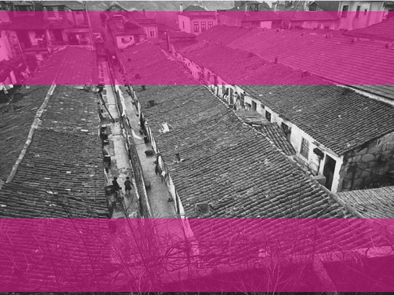

- Il. 2. Ilha de São Victor, slumsy znajdujące się w centrum Porto, fot. Joaquim Madureira, 1938

respektował uprzednio ogłoszonych postulatów. Obywatelom ograniczono obiecane prawo do miejsca, co w połączeniu z naciskiem na pracę self-helpwkrótce doprowadziło do protestów. Połączone związki sąsiedzkie lizbońskich slumsów wystosowały 15 lutego 1975 r. kartę roszczeń, w której przedstawiały swoje stanowisko: „Metoda self-helpto działanie podwójnego wyzysku. Po całym dniu pracy, który napełnia kapitalistyczne kieszenie, mieszkańcom każe się jeszcze fizycznie pracować do późnych godzin przy budowie domów”19. Temat wkrótce podłapały komunistyczne partie, m.in. Liga Comunista Internacionalista, która już 15 maja wydała deklarację „Nie dla zabudowy self-help. Koniec z wyzyskiem proletariatu na rzecz kapitalizmu”. W odpowiedzi 26 maja 1975 r. podczas posiedzenia plenarnego delegatury SAAL Lisboa e Centro-Sul ogłoszono, że operacje SAAL

nie będą dalej angażować mieszkańców w self-help20.

W wyniku interferencji nietrafionych municypalnych decyzji w Lizbonie powstawała niespójna zabudowa SAAL o heterogenicznej formie. Architektom nie udało się odnaleźć i wypracować charakterystycznej dla tego regionu typologii. Mimo pojedynczych projektów o jakościowej architekturzeoeuvreSAAL Lisboa e Centro-Sul nie przełamało panującego status quow takim stopni,u jak to udało się w Porto czy Algarve.

wyspy porto

Model organizacji ukierunkowany na podnoszenie standardu peryferyjnych dzielnic nie pasował do specyfiki problemów, jakie występowały w drugim największym mieście Portugalii. Uboższa część społeczeństwa Porto była historycznie związana z jego tkanką.

19 Tamże.

20 Tamże.

12433 —RZUT+

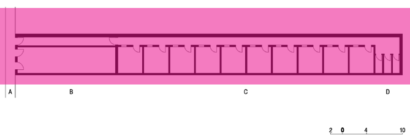

- Il. 3. Przykład zabudowy ilha. A - główna ulica, B – miejska kamienica właściciela parceli, C – wernakularne domy biedoty, D – latryny, rys. Wiktor Martin

Proletariat nie osadzał się poza miastem jak w przypadku Lizbony, lecz mieszkał w jego ścisłym centrum. W przypadku Porto ludzie nie walczyli o lepsze domy, dla nich liczyło się przede wszystkim pozostanie w miejscu, w którym zawsze żyli.

Ilhasto linearne osiedla powstające pośrodku kwartałów miejskich kamienic klasy średniej. Schowane za głównym budynkiem, tworzyły jeden lub kilka rzędów wąskiej zabudowy o wernakularnym charakterze. Każdy z nich formowały szeregowo ułożone małe jednostki mieszkalne o rozmiarze około 4 × 4 m. Brak bezpośredniego dostępu ilhasdo przestrzeni publicznej miasta sprzyjał zawiązywaniu się społecznych relacji o wysoce wspólnotowych wartościach.

Za władzy Estado Novo nastąpiło częściowe uwolnienie rynku nieruchomości, lawinowo rozpoczynając działania spekulacyjne powodujące gwałtowny wzrost cen działek w centrum miasta. Przetrwanie ilhas21 było poważnie zagrożone, ponieważ osiedla powoli zaczęły tracić rolę sypialni dla taniej siły roboczej pobliskich zakładów pracy. Uruchomiony kapitalistyczny mechanizm wywierał nacisk na władze Porto, aż te pod koniec lat 60. XX w. powołały miejski program oczyszczania dzielnic slumsów poprzez relokację ich mieszkańców do nowych kompleksów zabudowy socjalnej na obrzeżach miasta. Przed 25 kwietnia 1974 r. przenoszeni rezydenci nie mieli prawa do sprzeciwu, natomiast po rewolucji nie można było ich zmusić do zrezygnowania ze zwróconego „prawa do miejsca”. Szacuje się, że w połowie lat 70. XX w. w ilhasmieszkało około 25% populacji Porto, tj. około 60 tys. osób22.

W północnej delegaturze zdecydowano, że z powodu charakterystycznej morfologii i socjologicznego znaczenia dla miasta ilhasotrzymają główną rolę w działaniu SAAL Porto23. Brygady techniczne SAAL podążały wskazaną przez społeczeństwo drogą przez uznanie ilhasza formę modelowej społeczności. Architekci zaczęli studiować morfologię tamtejszej zabudowy i poszukiwali pożądanej przez mieszkańców relacji przestrzennej. Wspólnie przygotowywali zestaw architektonicznych narzędzi potrzebny do opracowania jednolitej i satysfakcjonującej typologii dla zabudowy SAAL. Projekty opierały się na dialogu wokół domu jednorodzinnego, głównego typu architektury wernakularnej w tym regionie24.

- 21 Ilhas– wyspy.
- 22 V. Borges Pereira, Uma Imensa Espera de Concretizações: Ilhas, Bairros e Classes Laboriosas Brevemente Perspectivados a Partir da Cidade do Porto, „Revista da Faculdade de Letras: Sociologia” 2003, nr 13, s. 139–148.

- 23 N. Mota, An Archaeology of the Ordinary, Delft 2014, s. 211.
- 24 Á. Siza, Imagining the Evident, Lizbona 2021, s. 100.

Skupiono się na najbardziej problematycznych osiedlach Porto, o najniższym standardzie życia. Brygady, wybierając drogę środka, respektowały zastany stan rzeczy celem utrzymania równowagi społecznej w historycznej części Porto. Fundamentalnym założeniem działań SAAL Norte było rozwiązanie problemu przeludnienia się degradujących osiedli i zapobieganie tworzeniu homogenicznych gett na peryferiach aglomeracji.

na europejskim poziomie mimo braku zaawansowanej technologii budowlanej w ówczesnej Portugalii27. Siza w swoich projektach sprawnie odczytuje, modyfikuje i transformuje kontekst, stosując wysublimowane formy, czerpiące z historii i odnoszące się jednocześnie do materialnej rzeczywistości. Architektura jest zbiorem jego doświadczeń, w którym pod postacią skrupulatnie umieszczanych rzemieślniczych rozwiązań przejawia się empatia dla użytkownika.

125 — — planowaniehistoria

Rehabilitacja lokalnych społeczno-przestrzennych praktyk opierała się na partycypacji społecznej odrzucającej metodę pracy self-help. Brygadziści uważali, że zagraża ona ostatecznej jakości i spójnemu obrazowi procesu SAAL. Architekci w zamian zaoferowali przygotowanie budynków do przyszłej rozbudowy.

Álvaro Siza, rozpoczynając prace dla SAAL, obrał własną drogę w prowadzeniu procesu. W rozmowie z Go Hasegawą z 2013 r. wspomina, że na samym końcu nie ma czegoś takiego jak rewolucyjna architektura. Jest tylko ta dobra i ta zła, a my jako projektanci powinniśmy robić co w naszej mocy, by pomóc ludziom żyjącym w trudnych warunkach28. Sprzeciwiał się postawie „architekta jako ręki ludu”, który ślepo podąża za przedstawionymi mu żądaniami. Nie chciał, aby pasywne stanowisko projektanta odbijało się późniejszym brakiem spójności w projekcie.

Alexandre Alves Costa uważa, że operacje SAAL w Porto mimo fragmentarycznego przeprowadzenia jako jedyne skierowane były w stronę radykalnego modelu planowania urbanistycznego. Tylko tutaj architekci dążyli do stworzenia miasta, w którym gorsi” mają prawo do jego historycznego centrum25.

”

Brygada Álvaro Sizy starała się nie projektować pod oczywiste oczekiwania społeczne. Proces prowadzili przez oferowanie swojej wiedzy i umiejętności w postaci wartościowych propozycji do przyszłej konsultacji z mieszkańcami. Cytując Sizę:

droga álvaro sizy

W 1974 r. Álvaro Siza skończył 41 lat i już od ponad dekady samodzielnie zdobywał zawodowe doświadczenie. Pod wpływem Fernando Távory i Alvara Aalto wciąż młody Siza wypracował własny język architektury, oparty na bliskiej relacji z przeszłością.

Projekty były zawsze dyskutowane z ludźmi, jednak nie pytaliśmy ich o błahostki dotyczące przyszłego domu czy pokoju. Rozmawialiśmy o dzielnicach i całych miastach. W trakcie wspólnej rozmowy ludzie sami zrozumieli, jak bardzo potrzebują grupowej zabudowy wzbogaconej budynkami publicznymi, aby mogli rozwijać wewnętrzne więzi i budować przynależność29.

Fascynacja przenikaniem przeszłości w teraźniejszość sięga początków jego kariery i prawdopodobnie wywodzi się od zainteresowania wernakularną tradycją rzemieślniczą regionu, z którego pochodzi26. W niej Álvaro Siza dostrzegł szansę na tworzenie jakościowej architektury

- 27 Prezentują to projekty: Casa de Chá da Boa Nova (1959–63), Edifício da Cooperativa de Lordelo do Ouro (1960–1970) i Casa Carlos Beires (1972–1976).
- 28 G. Hasegawa, Conversations with European Architects, Tokio 2015, s. 22.
- 29 Tamże.

- 25 A. Alves Costa, 1974–1975, o SAAL e os Anos da Revolução[w:] Portugal: Arquitectura do Século XX, pod red. S. Dabinnus i in., Portugal–Frankfurt 1997, s. 69.
- 26 T. Emerson, Á. Siza, C. Muro, Aberaturas / Openings, Porto 2019.

12633 —RZUT+

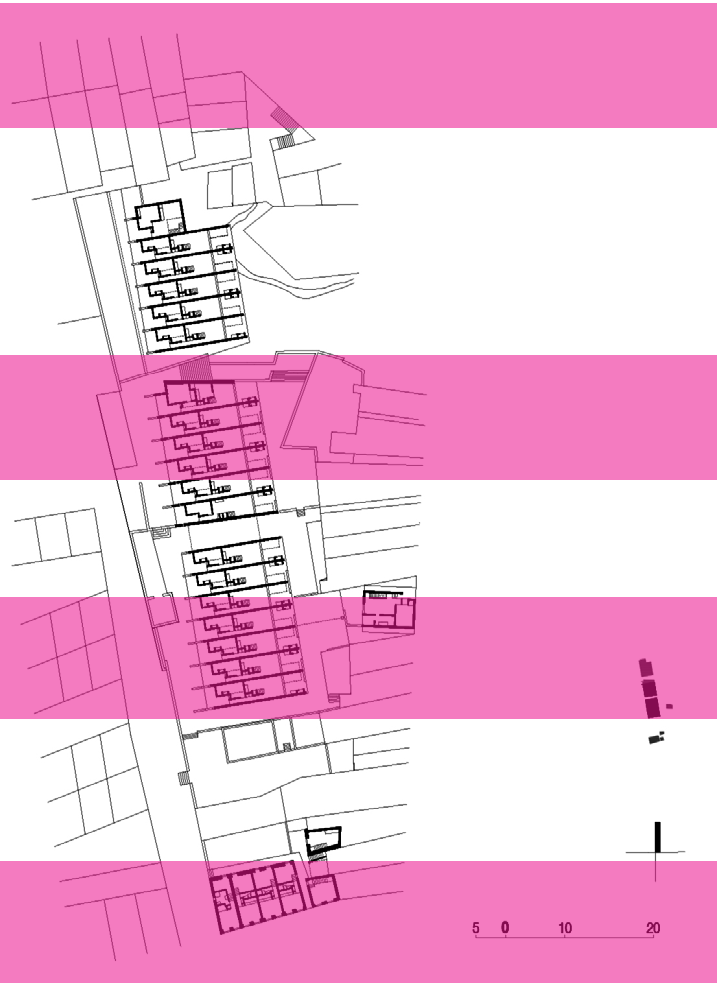

Il. 4. Rzut operacji SAAL São Victor przy Senhora das Dores. Schemat przedstawia wybudowaną część budynku A1, rys. Wiktor Martin

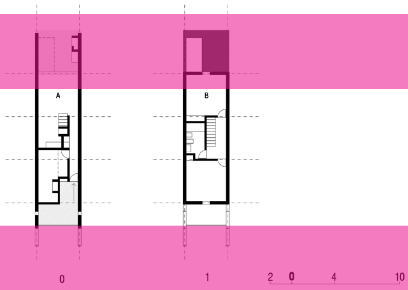

127 — — planowaniehistoria

- Il. 5. Rzut jednostki mieszkalnej w budynku A1. A – strefa dzienna, B – przestrzeń sypialniana, rys. Wiktor Martin dokładnym zbadaniu stanu technicznego istniejącej zabudowy mieli zadecydować, które z obiektów nadają się do zachowania, a które należy wyburzyć pod nową architekturę. Wkrótce okazało się, że rozdrobniona sytuacja własnościowa wielu opracowywanych parceli tworzy prawne trudności uniemożliwiające przeprowadzenie pierwotnego planu generalnego. Brygada pomimo nacisków ze strony władz nie przerwała rozpoczętego procesu, ale przeniosła swoje działanie na należące do miasta parcele wzdłuż ulicy Senhora das Dores30.

saal são victor

Działania rewitalizacyjne na obszarze ilha São Victor podjęto dzięki grupie studentów architektury (w tym m.in. 22-letniemu Eduardo Souto de Mourze), którzy przed rewolucją przygotowali pracę semestralną na jej temat. Zaraz po powołaniu SAAL namówili tutejszą społeczność do założenia związku sąsiedzkiego oraz zaoferowali jej swoją pomoc w prowadzeniu całego procesu. Zaangażowanie studentów zaowocowało w listopadzie 1974 r. ogłoszeniem rozpoczęcia operacji SAAL São Victor, do której przystąpili w roli członków brygady prowadzonej przez Domingosa Tavaresa i Álvaro Sizę.

W 1975 r. przystąpiono do budowy szeregowca A1 autorstwa Álvaro Sizy, przy Senhora das Dores. Budynek współcześnie znany jako SAAL São Victor został zlokalizowany na miejscu rozpadającej się wernakularnej zabudowy ilha. Siza w ostatkach historycznej tkanki postrzegał ostatnią warstwę palimpsestu, która

Brygadziści ustalili plan przeprowadzenia SAAL w stopniu maksymalnie zachowującym wernakularny charakter przestrzeni ilha. Zdecydowano się posługiwać wyłącznie zabudową wynikającą z jej typologii. W projekcie opracowano 102 jednostki mieszkalne pod postacią zabudowy szeregowej. Architekci po

30 N. Mota, An Archaeology of the Ordinary,

Delft 2014, s. 220–235.

12833 —RZUT+

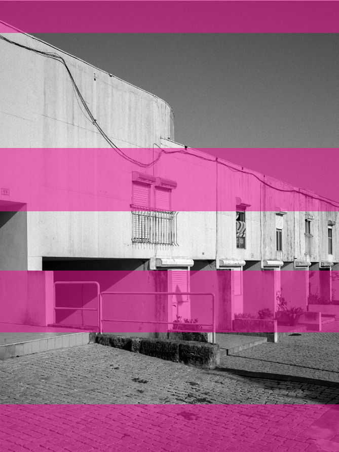

- Il. 6. Budynek A1, stan obecny, fot. Wiktor Martin, 2022

129 — — planowaniehistoria

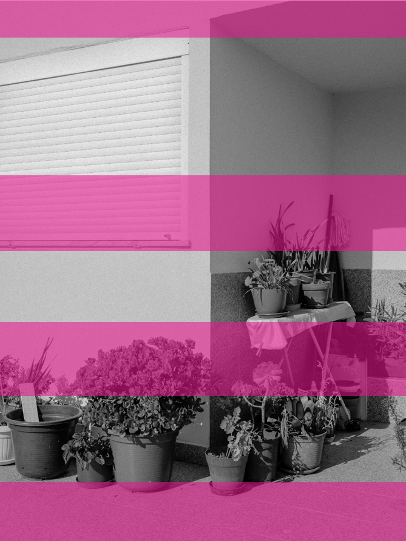

- Il. 7. Wychodzenie sfery prywatnej mieszkania w przestrzeń przed budynkiem, fot. Wiktor Martin, 2022

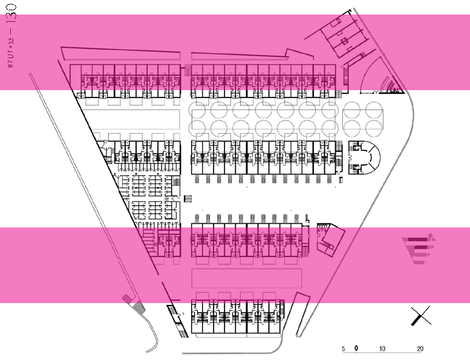

13033 —RZUT+

- Il. 8. Rzut operacji SAAL Bouça przy Rua da Boavista. Schemat przedstawia zakres pierwszej fazy projektu, ukończonej w 1978 roku, rys. Wiktor Martin
- Il. 9. Rzut jednostki mieszkalnej w budynku A1. A – strefa dzienna, B – przestrzeń sypialniana, rys. Wiktor Martin

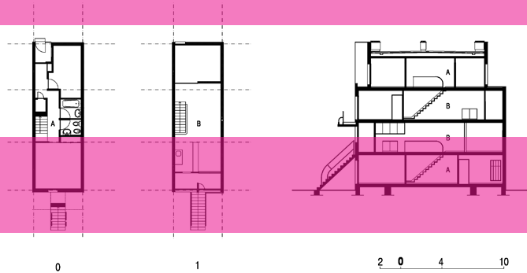

niebawem zostanie naturalnie nadpisana przez nową treść31. Projekt w otoczeniu budynku A1 uwzględnia zabezpieczenie i wyeksponowanie reliktów murów celem fizycznego utrzymania śladów przeszłości w przestrzeni miejsca. Obecność ruin tworzy wyraźny kontrapunkt dla nowej architektury, pozwalając jej na wybrzmiewanie z jeszcze większą siłą. W geście Sizy można odnaleźć polityczny manifest obrazujący dominację nowej rzeczywistości nad resztkami przeszłości.

będzie zlokalizowany na tej samej parceli przy Rua da Boavista oraz wykorzysta opracowany wcześniej układ zabudowy. Do roli brygadiera zaproszono autora pierwotnej koncepcji, czyli Álvaro Sizę.

131 — — planowaniehistoria

Pracę nad swoim drugim projektem w SAAL rozpoczął on od zaadaptowania uprzednich założeń do realiów nowego państwa. W lutym 1976 r. Siza przedstawił zaktualizowaną wersję konceptu Bouça, z wieloma kompromisami wynikającymi z potrzeby sprostania ograniczeniom finansowym programu. Projekt SAAL Bouça zachował pierwotny układ zagospodarowania trapezoidalnej działki o czterech równoległych rzędach zabudowy szeregowej. Wysokość projektowanych budynków zredukowano jednak z sześciu do czterech kondygnacji naziemnych, mieszcząc 131 dwupoziomowe jednostki mieszkalne. W projekcie dodano także małe pawilony przeznaczone pod bibliotekę, pralnię, lokale komercyjne i biura spółdzielni. Wprowadzone budynki usługowe separują strefę mieszkalną od jednej z głównych alei Porto.

Z powodu zamknięcia programu SAAL był to ostatni obiekt, jaki powstał w ramach operacji SAAL São Victor. W trakcie funkcjonowania programu przeprowadzono jedynie część większej interwencji planistycznej São Victor, która w pionierski sposób podjęła się rehabilitacji dzielnicy zamiast jej oczyszczenia i całkowitej przebudowy. Projekt SAAL São Victor jest jednym z najbardziej zaangażowanych politycznie dzieł Álvaro Sizy. Przedstawia alternatywną metodę w prowadzeniu rewitalizacjiilhas, starając się w jak największym stopniu utrzymać tożsamość i tradycje miejsca. Miejsca, o które tak walczyli jego mieszkańcy.

Struktura przestrzenna SAAL Bouça podobnie jak w SAAL São Victor opiera się na wernakularnej zabudowie ilha, jednak w tym projekcie Álvaro Siza zdecydował się na odważniejsze połączenie lokalnego stylu z europejskim nurtem modernistycznej zabudowy mieszkaniowej. SAAL Bouça podważa dotychczasowy wizerunek portugalskiego budownictwa socjalnego jako taniej i przymusowej zabudowy. Przez swoją rozrzeźbioną architekturę prezentuje specyficzną dla budynków Sizy formalną dostojność i dość widocznie zdradza wpływ projektów Alvaro Aalto34 i Bruno Tauta35. Tektonika budynków Bouça jest skrupulatnie wyartykułowana za pomocą rytmicznie wysuniętych schodów, wertykalnych przegród, cofniętych tarasów oraz horyzontalnych galerii. W subtelny saal bouça

W czasie gdy realizowano projekt Sao Victor, mieszkańcy kilku sąsiadujących ilhas w innej części Porto podjęli wspólne starania o przystąpienie do programu SAAL. 23 marca 1975 r. na obszarze Bouça zawiązano kooperatywę sąsiedzką32, która jednogłośnie reprezentowała potrzeby swoich mikrospołeczności. Niebawem koordynatorzy SAAL powołali operację Bouça, a do jej przeprowadzenia zdecydowano się wykorzystać plany osiedla socjalnego dla FFH33 z 1973 r. Postanowiono, że nowy projekt

- 31 E. Fernandes, The different fate of the Siza’s SAAL housing in Porto[w:] Teaching Through Design, pod red. M. Melenhorst, P. Providência, G. Canto Moniz, Coimbra 2018, s. 65–67.
- 32 C. Pimenta do Vale, The social rise of a housing intervention: Álvaro Siza project for Bouça neighbourhood, Porto 2018.
- 33 Fundo de Fomento da Habitação – Fundusz Promocji Mieszkalnictwa.

- 34 A. Aalto, budynki Karhu i Päivölä w zabudowie mieszkaniowej Sunila, Kotka, Finlandia, 1939.
- 35 B. Taut, budynek Rote Front w wielkim zespole mieszkaniowym Britz, Berlin, 1925–1930.

13233 —RZUT+

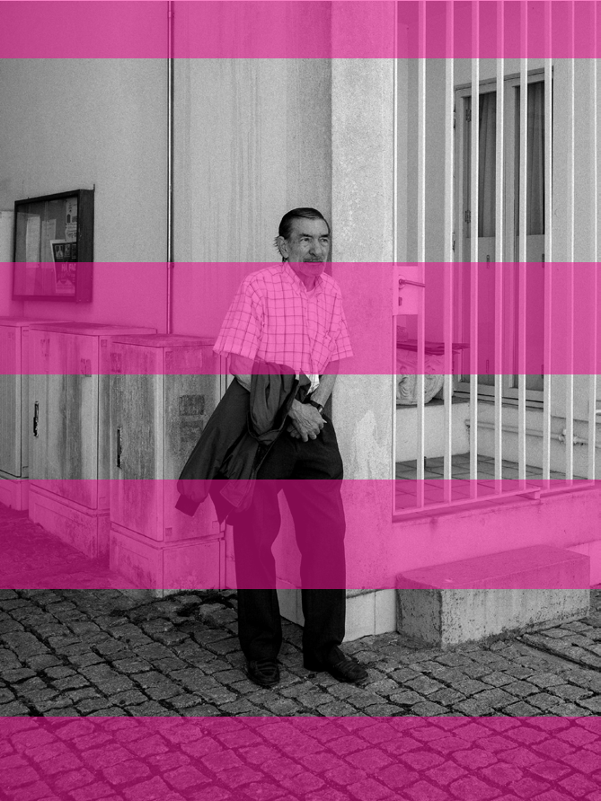

- Il. 10. João, mieszkaniec osiedla od 1978 roku, fot. Wiktor Martin, 2022

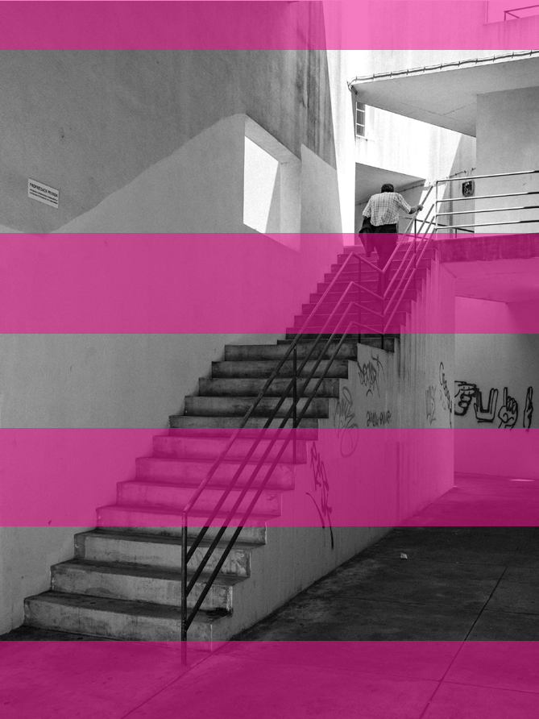

### Il. 11. Fot. Wiktor Martin, 2022

13433 —RZUT+

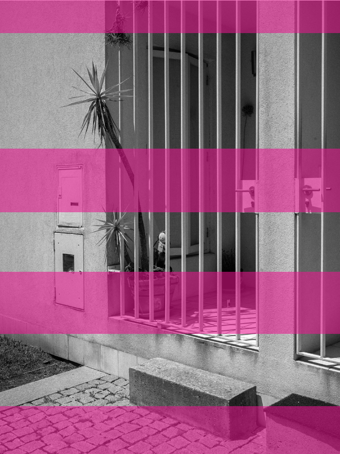

- Il. 12. Główne wejście do mieszkania, fot. Wiktor Martin, 2022

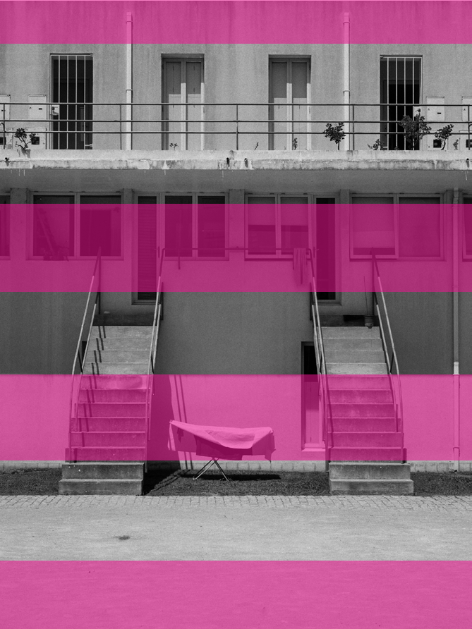

### Il. 13. Zachodzenie sfery prywatnej na publiczną, fot. Wiktor Martin, 2022

sposób redefiniuje granicę między sferą publiczną a prywatną.

każdej jednostce, niezależnie od jej zamożności. Siza krytycznie podchodził do dziedzictwa modernizmu w postaci purystycznej i elitarnej architektury, która równocześnie spycha zwyczajnego człowieka w niskiej jakości anonimowe budownictwo socjalne37.

13633 —RZUT+

Układ funkcjonalny mieszkania SAAL Bouça odwzorowuje ówczesny stylu życia portugalskich rodzin. W trakcie dnia kuchnia skupiała wszelką aktywność domowników, stając się centralnym miejscem domu, do którego również przyjmowano gości. W projekcie strefę dzienną tworzy wspólna przestrzeń kuchni, pralni i salonu, które zawsze okupują ten sam poziom mieszkania. Strefa sypialniana znajduje się na kolejnym poziomie, co zapewnia lokatorom niezbędną intymność.

Nieukończona przez dekady zabudowa Bouça mogła symbolizować nieskuteczność egzekwowania założeń programu SAAL. Współcześnie po blisko 50 latach od pierwszego projektu już w pełni sfinalizowany projekt zamieszkuje zróżnicowana klasowo społeczność o wyczuwalnej podmiotowości. Szczęśliwe zakończenie, którego nie doczekał SAAL São Victor.

Po upadku SAAL w październiku 1976 r. projekt Bouça został ponownie przekazany do FFH. Budowę osiedla podzielono na trzy fazy, po czym pierwszą rozpoczęto na początku następnego roku. Przedsięwzięcie z powodu trudności finansowych zostało przerwane w 1978 r., po ukończeniu rozpoczętego etapu prac. Oddano 58 ze 131 planowanych mieszkań, nie realizując murowanych klatek schodowych prowadzących na poziom galerii. Zabrakło również zabudowań usługowych oraz ściany akustycznej oddzielającej osiedle od torów kolejowych.

Projekty SAAL pióra Álvaro Sizy pokazują, że dobra architektura jest w stanie dostosowywać swoją ideologiczną pozycję do trafnie zidentyfikowanych potrzeb jej użytkowników.

rozmontowanie saal

W postrewolucyjnej Portugalii istniało sześć rządów tymczasowych przed ustanowieniem pierwszych demokratycznych wyborów w lipcu 1976 r. Nowy gabinet zdecydował się na reorganizację programu SAAL, odcinając wsparcie rządu w systemie finansowania operacji, i następnie przekazał zarządzanie programem w ręce poszczególnych gmin.

Bouça stała niedokończona przez ponad 20 lat. Na początku nowego tysiąclecia INH36 – następca FFH – podjął się renowacji powstałej zabudowy i wybudowania reszty osiedla z całą brakującą infrastrukturą. Álvaro Siza poproszony o dostosowanie projektu do obecnych wymogów rynku wprowadził parking podziemny pod brakującą część osiedla i przeprojektował układ mieszkań tak, aby odpowiadał nowej grupie docelowej, czyli klasie średniej.

Problemy finansowe i kolejne nieporozumienia na szczeblu administracyjnym szybko doprowadziły do pogorszenia się jakości wykonywanych projektów. W wielu osiedlach zaczynało brakować infrastruktury technicznej, co wywołało społecznie niezadowolenie i utratę zaufania do programu. Brak społecznego zainteresowania został szybko wykorzystany przez lokalne władze, które postrzegały SAAL jako zagrożenie tradycyjnych relacji z mieszkańcami. Pod koniec 1976 r. we wszystkich delegaturach SAAL podjęto decyzję, że zostaną zrealizowane jedynie te

Wizja Álvaro Sizy została w pełni skończona dopiero w 2006 r., jednak mimo jedynie częściowego ukończenia projektu w latach 70. XX w. architektura Bouça pokazała nową drogę projektowania zabudowy socjalnej. Dla Álvaro Sizy podstawą zamieszkania jest dom, przysługujący

37 Á. Siza, O 25 de Abril e a Transformação da Cidade, „Revista Crítica de Ciências Sociais” 1986, nr 18–20, s. 38.

36 Instituto Nacional da Habitação – Krajowy Instytut Mieszkalnictwa.

projekty, których budowę już rozpoczęto. SAAL przetrwał tylko 26 miesięcy. W tym krótkim okresie zaprojektowano blisko 170 projektów osiedli socjalnych obejmujących mieszkania dla ponad 40 tys. rodzin. Dla samego Porto przygotowano 33 projekty SAAL, dotykające blisko 11,5 tys. rodzin zamieszkujących ilhas. Finalnie rozpoczęto 11 z nich, zapewniając 375 nowych domów38.

Dokonania portugalskiego programu osiągnięte przy użyciu innowacyjnych metod prowadzenia polityki mieszkaniowej odbiły się głośnym echem w Europie. SAAL zyskał uznanie międzynarodowej krytyki, a wyjątkowy sposób prowadzenia procesu partycypacji społecznej dostrzeżony u Álvaro Sizy niebawem postanowiono zaimplementować w Berlinie, co rozpoczęło jego międzynarodową karierę•

137 — — planowaniehistoria

38 A. Alves Costa, Notes for seven images[w:] A. Alves Costa, A.C. Costa, S. Fernandez, Cidade Participada: Arquitectura e Democracia. S. Victor, Operações SAAL, cz. 2, Lizbona 2019, s. 139.

