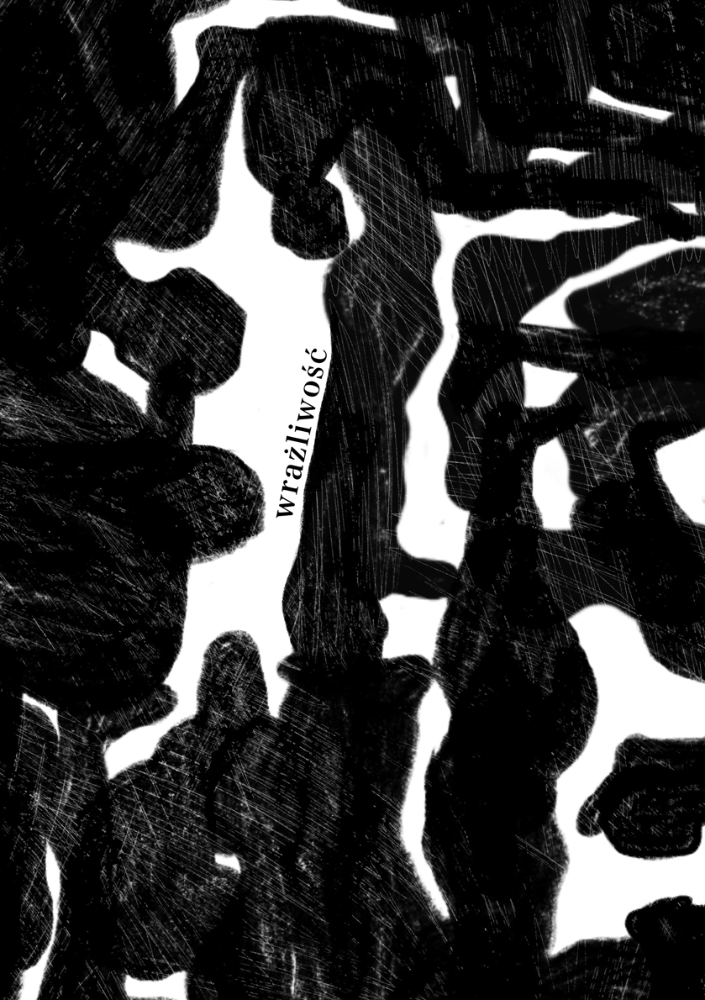
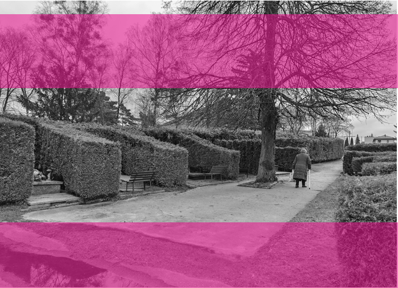
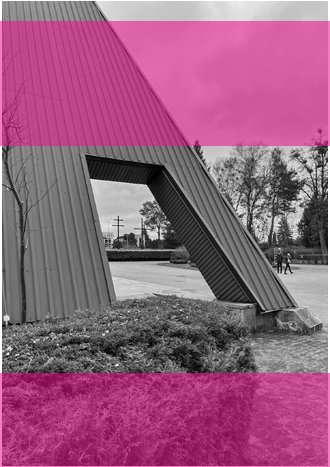
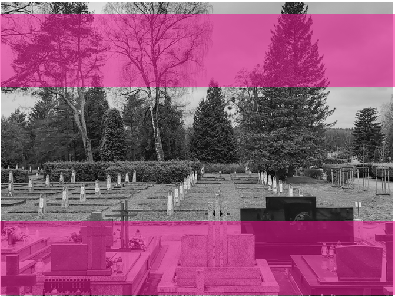
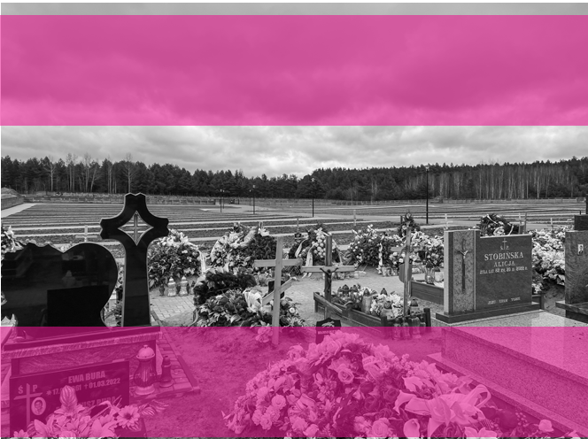

### FUNERALNE PLANOWANIE

PROBLEMATYKA DOSTĘPNOŚCI CMENTARZY KOMUNALNYCH NA PRZYKŁADZIE WOJEWÓDZTWA PODLASKIEGO

A R T U R B R ZOZO W S K I

# ~

Pani Halina ma 78 lat. Jej mąż zmarł jedenaście lat temu. Od tego czasu przynajmniej raz na tydzień odwiedza jego grób. Wymaga to od niej przejechania przez niemal całą Warszawę – z Targówka na Włochy. Dojazd na cmentarz zajmuje jej około godziny w jedną stronę – kilka lat temu otworzyli metro i jedzie się już lepiej niż kiedyś. Gdyby nie to, być może zrezygnowałaby z tych wypraw. Ale nadal chce odwiedzać cmentarz. Jakoś tak jej raźniej przy mężu. Takiego szczęścia nie miała jej siostra Teresa, która całe życie spędziła w małej miejscowości pod Warką, gdzie nie jeździła żadna komunikacja zbiorowa, a najbliższy cmentarz znajdował się kilkanaście kilometrów od jej domu. Nie mogła regularnie odwiedzać grobu swojego zmarłego przed laty męża, którego z powodu sytuacji finansowej musiała sama pochować nie w okolicy a na Cmentarzu Komunalnym Południowym w Warszawie, do którego jeżdżą tylko dwa autobusy dziennie z centrum stolicy. Pani Teresa od jakiegoś czasu nie ma już tego problemu. Ten problem będzie miała teraz pani Halina, jeżdżąca również na grób swojej siostry, pochowanej obok męża1,

Takie sytuacje w Polsce są normą, ale normą ukrytą w małych miejscowościach i przytłaczających statystykach. Według prognozy demograficznej Głównego Urzędu Statystycznego (GUS) liczba ludności w Polsce zmniejszy się z 38 mln w 2020 r. do 34,8 mln w 2050 r.2 Społeczeństwo polskie się starzeje, cała Europa się starzeje – wszyscy słyszeliśmy to wiele razy. Jednak w Polsce od pewnego czasu zmniejsza się również średnia długość życia. Jeszcze w 2016 r. dla kobiet wynosiła ona 81,9 lat, a dla mężczyzn 73,9 lat, w 2021 r. jest to odpowiednio 79,7 lat i 71,8 lat3. Trend spadkowy po raz pierwszy od 30 lat odnotowano w 2016 r., więc spadek

- 2 Główny Urząd Statystyczny, Sytuacja osób starszych w Polsce w 2020 roku, https://stat.gov.pl/ obszary-tematyczne/osoby-starsze/osoby-starsze/ sytuacja-osob-starszych-w-polsce-w-2020-roku,2,3. html (data dostępu: 5.02.2023).
- 3 Główny Urząd Statystyczny, Trwanie życia w zdrowiu w 2021 r., https://stat.gov.pl/obszary-tematyczne/ ludnosc/trwanie-zycia/trwanie-zycia-w-zdrowiu-w-

1 Historia prawdziwa ze zmienionymi danymi.

-2021-r-,5,2.html (data dostępu: 5.02.2023).

## 141 — — planowaniewrażliwość

Il. 1. Aleja grobów otoczonych żywopłotem na Cmentarzu Miejskim w Białymstoku. fot. A. Brzozowski trudno jest przypisać wyłącznie pandemii koronawirusa. W innych krajach Europy nie był on tak wyraźny, podobnie jak różnice w średniej długości życia kobiet i mężczyzn, które w skali UE wynoszą przeciętnie około 5,5 lat. W Polsce jest to niemal 8 lat, a warto wziąć pod uwagę, że zwyczajowo w związkach małżeńskich mężczyzna jest kilka lat starszy (statystycznie ok. 2,1 roku). Sprawia to, że w 2021 r. spośród prawie ćwierć miliona (248,7 tys.) zmarłych Polaków aż 139,3 tys. (56%) umierało w towarzystwie żony, za to wśród 226,8 tys. umierających Polek męża miało przy sobie tylko 51,4 tys. (22,7%)4. Zatem według statystyk w Polsce

(dla mężczyzn 65, a dla kobiet 60 lat) mężczyzna bez pracy spędza przeciętnie 6,8 lat, a kobieta 21,9 lat, przy czym średnie emerytury wynoszą odpowiednio 3148

ZATEM WEDŁUG STATYSTYK W POLSCE MĘŻCZYZN WYPRAWIA NA TAMTEN ŚWIAT

ŻONA, KTÓRA ŻYJE JESZCZE PÓŹNIEJ ŚREDNIO 10 LAT

i 2128 zł brutto. Polki dostają więc ponad 1000 zł miesięcznie mniej, a po śmierci męża mogą liczyć jedynie na rentę rodzinną (która wynosi 85% emerytury męża, ale w przypadku zbyt dużych zarobków wdowy może zostać zmniejszona lub zawieszona)5. Nic dziwnego, że coraz więcej osób decyduje się opłacić miejsce na cmentarzu jeszcze za życia, a firmy ubezpieczeniowe

- mężczyzn wyprawia na tamten świat żona, która żyje jeszcze później średnio 10 lat.

Ponadto z powodu wieku emerytalnego

4 P. Pacewicz, Żona musi być młodsza, czyli dwa nieszczęścia. Młodzi kawalerowie i umierające w samotności wdowy, https://oko.press/zona-musi-

5 Zakład Ubezpieczeń Społecznych, Renta rodzinna, https://www.zus.pl/swiadczenia/renty/renta-rodzinna (data dostępu: 5.02.2023).

-byc-mlodsza-czyli-dwa-nieszczescia (data dostępu: 5.02.2023).

prześcigają się w oferowaniu polis na pokrycie kosztów pochówku. Cmentarze są infrastrukturą konieczną, a godny pogrzeb powinien być prawem każdego człowieka, jednak branży funeralnej również nie omi-

14233 —RZUT+

- nęła inflacja, a koszty od początku pandemii wyraźnie wzrosły. W dużych miastach cena miejsca na cmentarzu to już kilka tysięcy złotych, a wszystkie koszty pogrzebu wahają się od 8 tys. zł w mniejszych miejscowościach, do 14 680 zł w Warszawie6. Jest jeszcze zasiłek pogrzebowy od państwa, który obecnie wynosi raptem 4 tys. zł. Może i wszyscy jesteśmy równi wobec śmierci, ale na pewno nie jesteśmy równi w kwestii ceny pochówku.

cmentarze w polsce a l aicyzacja społeczeństwa

Cmentarze w polskiej kulturze to obiekty traktowane z wyjątkową czcią i szacunkiem, a zarazem zamknięte i odseparowane od miast. Pochówek na polskich cmentarzach zazwyczaj charakteryzuje się wykorzystaniem trwałych, często marmurowych nagrobków, jak gdyby każdy zmarły musiał postawić sobie upamiętniający go na wieki pomnik. Mało kto decyduje się na kremację. Takie podejście do pochówku sprawia, że na cmentarzach w Polsce szybko kończy się miejsce. O ile groby ziemne można likwidować już po 20 latach od pogrzebu (chyba że wniesie się opłatę przedłużającą), zgodnie z wytycznymi ustawy o cmentarzach i chowaniu zmarłych pochodzącej z 1959 r. grobów murowanych nie można likwidować w ogóle, bez względu na ich stan (ma to również duży wpływ na estetykę cmentarzy w Polsce). Stare cmentarze są więc przepełnione, a nowe zgodnie z tą samą ustawą zakładane są jedynie na obrzeżach miast. Wymóg ten był podyktowany zapewne ówczesnymi względami sanitarnymi, jednak przy obecnych standardach

Il. 2. Budynek domu pogrzebowego na Cmentarzu Miejskim w Białymstoku, w tle widoczne dwa krzyże przy głównym wejściu: prawosławny i katolicki, fot. M. Lewicka wydaje się nieuzasadniony. Kluczowe jest jednak to, że tereny pod nowe cmentarze wyznacza się wyłącznie przez miejscowe plany zagospodarowania przestrzennego, a więc to urbaniści odpowiadają za ich lokalizację oraz dostępność. Na przykładzie innych krajów, zwłaszcza skandynawskich, widać, że nie ma w zasadzie uzasadnionych przeszkód, by cmentarze znowu zaczęły stanowić integralne tereny miast. Szczególnym przypadkiem mogą być cmentarze w Danii, które traktowane są niemal tak samo jak miejskie parki. Dozwolone jest tam jeżdżenie na rowerze czy wyprowadzanie zwierząt, a mieszkańcy uprawiają różne sporty, spotykają się ze znajomymi i organizują pikniki. To, jak postrzegane są cmentarze w mieście, wynika głównie z kwestii kulturowych, które także w Polsce powoli się zmieniają.

6 10 tys. zł za pogrzeb w stolicy. Ceny powalają, https://www.money.pl/gospodarka/10-tys-zl-za-pogrzeb-w-stolicy-ceny-powalaja-6817272507902784a. html (data dostępu: 5.02.2023).

Choć cmentarze najczęściej kojarzą się z miejscem uświęconym i religijnym, to nie wszystkie są wyznaniowe i zarządzane przez wspólnotę wiernych. Cmentarze komunalne, formalnie umożliwiające pochówek w każdym obrządku, są otwarte dla każdego, zarówno dla katolików, niewierzących, jak i wyznawców innych religii. Zakładają je i zarządzają nimi świeckie władze gmin. Co istotne, to samorząd gminy ustanawia wtedy cennik usług cmentarnych, który ponadto musi być dostępny do publicznego wglądu, w przeciwieństwie do cen na cmentarzach wyznaniowych, ustalanych indywidualnie przez zarządcę, czyli najczęściej proboszcza parafii, do której cmentarz należy.

do 356 osób w 2021 r.9 Brakuje statystyk pokazujących, jakie rodzaje cmentarzy wybierają Polacy, ale można prognozować, że wraz z postępującą sekularyzacją społeczeństwa rola cmentarzy komunalnych będzie w kolejnych latach wyraźnie rosła. Problem jednak leży w ich dostępności.

## 143 — — planowaniewrażliwość cz y w polsce br akuje cmentarz y?

Według najnowszych danych na terenie kraju znajduje się 12 269 cmentarzy, z czego większość to cmentarze wyznaniowe – 8387 (ponad 68%). Jedynie pięć gmin w Polsce nie ma żadnego cmentarza10. Według obowiązującej ustawy na terenie każdej gminy w kraju powinien znaleźć się cmentarz komunalny. Statystyki pokazują jednak, że w Polsce jest ich jedynie 187911 przy 2477 gminach. Te dane nie oddają jednak skali problemu, ponieważ cmentarze rozmieszczone są w wyjątkowo nierównomierny sposób.

Abstrahując od względów finansowych, można założyć, że coraz więcej osób będzie rezygnować z pochówku na dominujących w Polsce cmentarzach katolickich. Mimo że zdecydowana większość Polaków, bo aż 32,3 mln, jest ochrzczona (85% społeczeństwa)7, to obecnie kwalifikowani jesteśmy jako jedno z najszybciej laicyzujących się społeczeństw na świecie. Sekularyzację Polaków widać szczególnie mocno w nagłych spadkach liczby katolików uczęszczających na niedzielne msze z 41% w 2010 r. do 28,3% w 2021 r.8, odsetku dzieci uczęszczających na lekcje religii – z 93% w 2010 r. do 54% w 2021 r. (CBOS, KBPN 2010–2021) czy liczbie zawieranych małżeństw wyznaniowych – z 64,9% w 2011 r. do 53,7% w 2021 r. Trudno będzie zahamować tę tendencję, ponieważ jest coraz mniej młodych katolików i nowych księży. Liczba udzielonych sakramentów chrztu spadła z 374,3 tys. w 2016 r. do 312,1 tys. w 2020 r., a liczba osób kształcących się na I roku w seminariach duchownych zmniejszyła się niemal o połowę z 725 osób w 2015 r.

Tylko 798 gmin ma cmentarz komunalny. Ponadto liczba takich cmentarzy w województwach zachodniej Polski jest znacznie większa niż w środkowej i wschodniej części kraju. Na zachodzie

TYLKO 798 GMIN MA CMENTARZ KOMUNALNY. PONADTO LICZBA TAKICH

CMENTARZY W WOJEWÓDZTWACH ZACHODNIEJ POLSKI JEST ZNACZNIE

WIĘKSZA NIŻ W ŚRODKOWEJ

wiele gmin dysponuje kilkunastoma lub nawet kilkudziesięcioma cmentarzami komunalnymi, podczas gdy w takich województwach jak mazowieckie, łódzkie czy

- 7 Główny Urząd Statystyczny, Mały Rocznik Statystyczny Polski 2022, https://stat.gov.pl/obszary-tematyczne/roczniki-statystyczne/roczniki-statystyczne/maly-rocznik-statystyczny-polski-2022,1,24.html (data dostępu: 5.02.2023).
- 8 Instytut Statystyki Kościoła Katolickiego, Annuarium Statisticum Ecclesiae in Polonia 2021, https://www. iskk.pl/badania/roczniki-statystyczne/374-annuarium-statisticum-ecclesiae-in-polonia-dane-za-

- 9 Tamże.
- 10 Sytuacja polskich cmentarzy – wyniki ankiety, https://www.gov.pl/web/cyfryzacjamiejscpamieci/ sytuacja-polskich-cmentarzy--wyniki-ankiety (data dostępu: 5.02.2023).
- 11 Najwyższa Izba Kontroli, Zarządzanie cmentarzami komunalnymi. Informacja o wynikach kontroli, https://www.nik.gov.pl/plik/id,12230,vp,14613.pdf (data dostępu: 5.02.2023).

-rok-2021 (data dostępu: 5.02.2023).

14433 —RZUT+

pomorskie

96 warmińsko-mazurskie 148

zachodniopomorskie

#### 476

podlaskie

#### 17

kujawsko-pomorskie

41

mazowieckie wielkopolskie

26

lubuskie

59

#### 328

łódzkie

#### 12

lubelskie

#### 29

dolnośląskie

277

opolskie świętokrzyskie

śląskie

41

#### 18

132

podkarpackie małopolskie

#### 92

128

- Il. 3. Rozmieszczenie cmentarzy komunalnych według województw (opracowanie własne na podstawie danych GUS i NIK z 2016 roku)

podlaskie znaczna część gmin (głównie wiejskich) nie ma na swoim terenie żadnego. Raport NIK, z którego pochodzą te dane, sugeruje również powód tak dużych dysproporcji w liczbie cmentarzy:

brakuje historii o dewastacji niemieckich nagrobków na ziemiach zachodnich i północnych, które służyły potem za materiał do budowy polskich cmentarzy, a czasem nawet jako schodki wejściowe do domów czy elementy piaskownic dla dzieci13. Przy tak dużych dysproporcjach w rozmieszczeniu cmentarzy komunalnych rodzi się pytanie, jaka jest dostępność do nich w województwach Polski centralnej i wschodniej. Szczególnym przypadkiem wydaje się województwo podlaskie, które z uwagi na swoją wyjątkową na tle kraju strukturę etniczną i wyznaniową w teorii powinno mieć zapewniony szeroki dostęp do tego typu przestrzeni.

dominującą grupę [wśród cmentarzy komunalnych] stanowią cmentarze, które w przeszłości były cmentarzami wyznaniowymi, a w latach 70–90 ubiegłego stulecia zostały przekazane samorządom na podstawie decyzji komunalizacyjnych12.

Województwa zachodnie dzisiejszej Polski zostały utworzone na terenach poniemieckich, a po przesiedleniach ludności liczne niemieckie cmentarze ewangelickie zostały przekształcone w cmentarze komunalne, stąd jest ich tak wiele na zachodzie kraju.

Warto dodać, że polityka ówczesnej władzy dążyła do wymazania śladów niemieckiego osadnictwa z polskich ziem i zachęcała nawet do cmentarnych grabieży. Nie cmentarze na jmniej k atolickiego województwa

Województwo podlaskie ze względów historycznych wyróżnia się niezwykle nietypową jak na polskie realia strukturą wyznaniową. Według danych z Narodowego

12 Najwyższa Izba Kontroli, Zarządzanie cmentarzami komunalnymi. Informacja o wynikach kontroli, https://www.nik.gov.pl/plik/id,12230,vp,14613.pdf (data dostępu: 5.02.2023).

13 K. Kuszyk, Poniemieckie, Wołowiec 2019.

145 — — planowaniewrażliwość pomorskie 12,9% warmińsko-mazurskie

8,9%

zachodniopomorskie

#### 43,4%

podlaskie

#### 2,4%

kujawsko-pomorskie

3,8%

mazowieckie wielkopolskie

2,6%

lubuskie

4,6%

#### 58,1%

łódzkie

#### 1,9%

lubelskie dolnośląskie

#### 2,8%

23,9%

opolskie świętokrzyskie

śląskie

5,6%

#### 4,2%

14,3%

podkarpackie małopolskie

#### 6,9%

10,7%

- Il. 4. Odsetek cmentarzy komunalnych wśród wszystkich cmentarzy w danym województwie (opracowanie własne na podstawie danych GUS i NIK z 2016 roku)

Spisu Powszechnego 201114 w województwie podlaskim mieszka 1,169 mln ludzi, z czego 120 tys. to wyznawcy prawosławia. Stanowi to ponad 10% mieszkańców Podlasia, przy czym 18,7% mieszkańców nie należy w ogóle do kościoła rzymskokatolickiego. Jest to więc obszar o najmniejszym odsetku katolików w kraju, który wynosi 81,3%. Te 120 tys. osób to największa w kraju społeczność osób prawosławnych (76,6% wszystkich wyznawców w Polsce), do której należy również liczna mniejszość białoruska (83,6% całej ich populacji w Polsce), co wskazuje, że w województwie potrzeba nie tylko cmentarzy różnych wyznań, ale i cmentarzy komunalnych.

województwa notuje spadki liczby ludności powyżej 10% względem 2011 r., co jest ewenementem nawet w skali szybko starzejącego się kraju, choć jest częściowo wywołane ujemnym saldem migracji15 (GUS 2021). Oprócz tego w województwie podlaskim odsetek osób powyżej 60 roku życia należy do największych w całym kraju i wynosi 25,4%. W niektórych gminach, jak Dubicze Cerkiewne czy Orla, około 15% ludności ma ponad 80 lat. Te dane dobitnie pokazują, jak ważnym tematem na tym obszarze jest dostępność cmentarzy.

Według danych GUS (2016) liczba cmentarzy w województwie podlaskim wynosiła 710 (139 w miastach, 571 na wsi), z czego jedynie 17 to cmentarze komunalne (NIK 2016). Stanowi to ok. 2,4% wszystkich

Ponadto najnowsze dane z Narodowego Spisu Powszechnego 2021 pokazują, jak szybko starzeje się społeczeństwo całego Podlasia. Niemal połowa (48%) gmin

15 Główny Urząd Statystyczny, Informacja o wynikach Narodowego Spisu Powszechnego Ludności i Mieszkań 2021 na poziomie województw, powiatów i gmin, https://stat.gov.pl/spisy-powszechne/ nsp-2021/nsp-2021-wyniki-ostateczne/informacja-o-

14 Główny Urząd Statystyczny, Struktura narodowo-

- -etniczna, językowa i wyznaniowa ludności Polski
- - NSP 2011, https://stat.gov.pl/spisy-powszechne/ nsp-2011/nsp-2011-wyniki/struktura-narodowo-etniczna-jezykowa-i-wyznaniowa-ludnosci-polski-
- -nsp-2011,22,1.html (data dostępu: 5.02.2023).

-wynikach-narodowego-spisu-powszechnego-ludnosci-i-mieszkan-2021-na-poziomie-wojewodztw-powiatow-i-gmin,1,1.html (data dostępu: 5.02.2023).

## 14633 —RZUT+

pomorskie

24121

warmińsko-mazurskie

9705

zachodniopomorskie

3589

podlaskie

69801

kujawsko-pomorskie

50827

mazowieckie wielkopolskie

206381

lubuskie

59011

3102

łódzkie

207110

lubelskie dolnośląskie

73563

10483

opolskie świętokrzyskie

śląskie

24220

69606

34539

podkarpackie małopolskie

23127

26424

- Il. 5. Liczba mieszkańców przypadająca na jeden cmentarz komunalny (opracowanie własne na podstawie danych GUS i NIK z 2016 roku).

cmentarzy województwa i jest to drugi najniższy wskaźnik w Polsce, mniejszy procentowy udział cmentarzy komunalnych jest tylko w województwie łódzkim (ok. 1,9%). Wiele województw ma ten współczynnik na poziomie wynoszącym ponad 10%, a w województwie lubuskim aż 58% ogółu cmentarzy to cmentarze komunalne (opracowanie własne na podstawie danych GUS i NIK z 2016 r.).

Wyjątkiem okazał się cmentarz w gminie miejsko-wiejskiej Supraśl, który w rzeczywistości jest nowym Białostockim Cmentarzem Miejskim w Karakulach. Przykład ten obrazuje dość częstą w skali całego kraju praktykę lokowania cmentarzy komunalnych dużych miast poza granicami administracyjnymi ich gminy. SpowoW przeliczeniu na liczbę ludności w województwie podlaskim (1,169 mln) na jeden cmentarz komunalny przypada średnio 68 901 osób (na dowolny cmentarz 1671 osób). Gorzej jest tylko w województwach łódzkim, mazowieckim (w obu przypadkach ponad 200 tys. osób) oraz lubelskim (ponad 73,5 tys.). Z kolei w województwie warmińsko-mazurskim na jeden cmentarz komunalny przypada niespełna 856 osób.

URZĄD GMINY DUŻEGO MIASTA FINANSUJE WTEDY TAKI CMENTARZ I NIM ZARZĄDZA, A GMINA, NA KTÓREJ TERENIE ON SIĘ ZNAJDUJE, JEDYNIE DZIERŻAWI TEREN. JEST TO PRAKTYKA SPRZECZNA Z PRZEPISAMI USTAWY O CMENTARZACH, A WIĘC NIEZGODNA Z PRAWEM

Spośród 17 cmentarzy komunalnych województwa podlaskiego przeanalizowałem dokładniej 12 z nich. Wszystkie poza jednym znajdowały się na terenach miast na prawach powiatu lub gmin miejskich.

dowane jest to albo brakiem miejsca na cmentarz w dużej gminie miejskiej, albo wysokimi cenami gruntów. Urząd gminy dużego miasta finansuje wtedy taki cmentarz i nim zarządza, a gmina, na której

147 — — planowaniewrażliwość

- Il. 6. Groby murowane na tle ziemnych kwater żołnierzy radzieckich na Cmentarzu Miejskim w Białymstoku, fot. A. Brzozowski terenie on się znajduje, jedynie dzierżawi teren. Jest to praktyka sprzeczna z przepisami ustawy o cmentarzach, a więc niezgodna z prawem (na co wskazuje raport NIK z 2016 r.). Podobny przypadek występuje również w Warszawie – miasto zarządza Cmentarzem Komunalnym Południowym znajdującym się na terenie gminy Piaseczno. Ponadto praktyka ta sprawia, że cmentarze komunalne jeszcze bardziej oddalają się od miast, przez co stają się coraz trudniej dostępne, zwłaszcza dla ludzi wykluczonych komunikacyjnie.

prostej (drogami publicznymi niemal 8,5 km). Dojazd do pozostałych cmentarzy jest możliwy samochodem w 5–10 minut, czasem nawet mniej. Komunikacji miejskiej zajmuje to zwykle dwukrotnie dłużej, ale prawdziwym problemem jest to, że do większości cmentarzy po prostu nic nie dojeżdża. W całym województwie dostęp do przystanków komunikacji publicznej przy cmentarzach komunalnych był zapewniony jedynie w największych miastach: Białymstoku i Łomży. A odległość 3–4 km to dystans, jakiego nie będzie w stanie pokonać znaczna część seniorów, którzy najczęściej nie przemieszczają się własnymi samochodami.

Warto zatem dokładniej przeanalizować odległości cmentarzy od miast. Spośród analizowanych cmentarzy większość znajduje się od 800 m do 3 km od centrum najbliższego miasta, przynajmniej w linii prostej. Odległości drogami publicznymi mieszczą się w przedziale 1–4 km. Wyjątkiem jest właśnie Białostocki Cmentarz Miejski w Karakulach, zlokalizowany ponad 7 km od centrum Białegostoku w linii

Mieszkańcy Podlasia dużego wyboru nie mają, bo kolejny najbliższy cmentarz komunalny dla nich to albo nowy cmentarz na obrzeżach tej samej gminy, albo cmentarze w sąsiednim województwie, najczęściej w warmińsko-mazurskim. Z kolei komunikacja publiczna na większe dystanse

## 14833 —RZUT+

- Il. 7. Sąsiadujące ze sobą groby ziemne i murowane, katolickie i prawosławne na terenie nowego Białostockiego Cmentarza Miejskiego w lesie w Karakulach, fot. A. Brzozowski jest tak samo niedostępna jak na terenach podlaskich gmin. W przypadku Suwałk najbliższy cmentarz komunalny znajduje się w odległym o ponad 85 km Grajewie, do którego na tej trasie można dostać się tylko własnym autem. Mieszkańcy Grajewa natomiast najbliżej (ok. 25 km) mają do Ełku, znajdującego się w warmińsko-mazurskim. Co zaskakujące, na tym odcinku mogą skorzystać z pociągów Intercity, jednak dojście z dworca na cmentarz to kolejne kilometry pieszo.

w Siemiatyczach16. Być może najtańsze byłyby gminy wiejskie, ale nie udało mi się znaleźć żadnego cmentarza komunalnego

PODSUMOWUJĄC, NALEŻY PODKREŚLIĆ WYRAŹNY PROBLEM Z DOSTĘPNOŚCIĄ

WIELU CMENTARZY KOMUNALNYCH DLA OSÓB WYKLUCZONYCH KOMUNIKACYJNIE,

A SĄ TO NAJCZĘŚCIEJ LUDZIE STARSI, KTÓRZY CHCĄ ODWIEDZAĆ REGULARNIE

Komunikacja publiczna jest zatem ograniczona jedynie do większych miast, w których koszty życia i ceny usług są wyższe. Również na cmentarzach. Cenniki cmentarzy komunalnych nie pozostawiają złudzeń – im większe miasto, tym drożej. Najwyższe ceny są zatem w Białymstoku, Łomży i Suwałkach. Taniej jest w mniejszych miastach, a najniższe ceny są dziś

GROBY SWOICH BLISKICH

na terenie takiej gminy w całym Podlasiu. Podsumowując, należy podkreślić wyraźny problem z dostępnością wielu

16 Dziennik Ustaw Województwa Podlaskiego, Uchwały rad gmin dot. kosztów pochówku na cmentarzach komunalnych.

