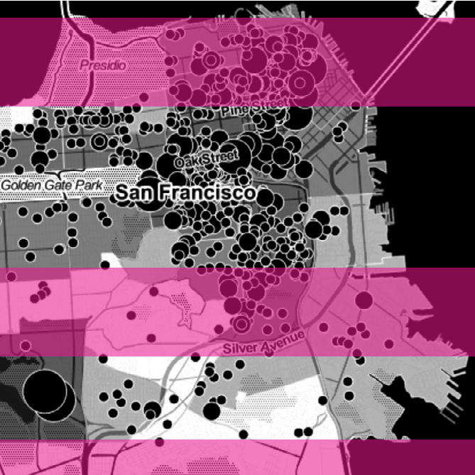
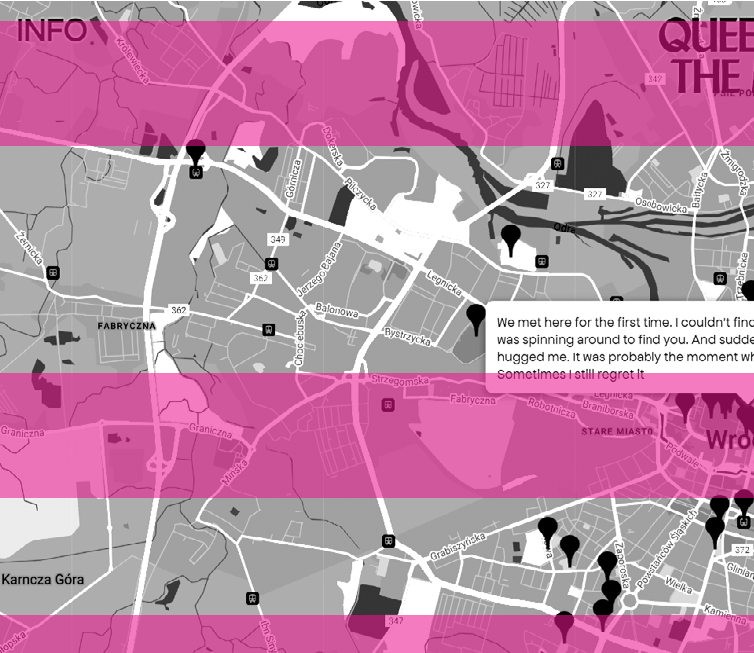
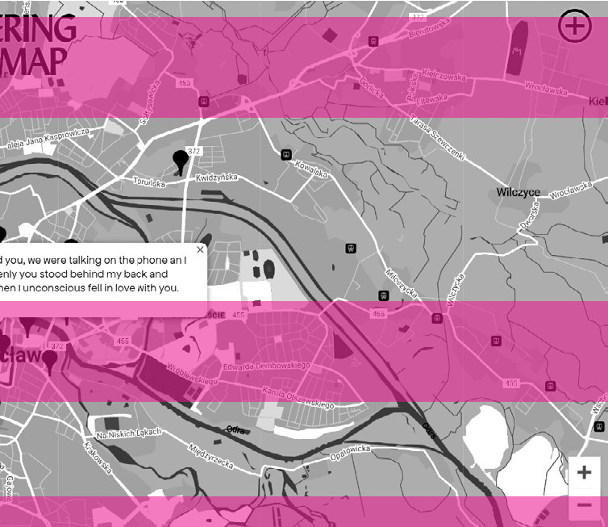

cmentarzy komunalnych dla osób wykluczonych komunikacyjnie, a są to najczęściej ludzie starsi, którzy chcą odwiedzać regularnie groby swoich bliskich. Łatwy dostęp do cmentarzy komunalnych zapewniony jest tylko dla tych, którzy mogą jeździć własnym samochodem. Jedynie w największych miastach województwa, Białymstoku i Łomży, można dojechać do cmentarzy komunalnych komunikacją miejską, ale te charakteryzują się najdroższymi kosztami pochówku w całym województwie. Największą przeszkodą dla mieszkańców Podlasia jest jednak zupełny brak cmentarzy komunalnych w gminach wiejskich, przez co na jeden taki cmentarz w województwie przypada wyjątkowo duża liczba mieszkańców, a dostęp do nich jest dla wielu osób niemożliwy. Przypadek województwa podlaskiego nie jest odosobniony i podobne problemy można zauważyć w wielu innych miejscach w Polsce.

1 czerwca 2023 r.17 Tymczasem w dniu pisania tego tekstu Rządowe Centrum Legislacji nadal podaje, że projekt tej ustawy nie zakończył procesu opiniowania i wciąż daleko jest do skierowania go do Sejmu18. Biorąc jednak pod uwagę, że projekt nie był konsultowany z żadnymi organizacjami branżowymi, jak np. Polską Izbą Branży Pogrzebowej, oraz nie zakładał zmiany wytycznych sanitarnych, które obowiązują planistów, można założyć, że mimo uporządkowania kilku kwestii dalej nie poprawi on trudniej sytuacji setek tysięcy osób, których dotyka cmentarne wykluczenie. A problem będzie dla nas coraz bardziej dotkliwy, bo los każdego skończy się właśnie na cmentarzu •

149 — — planowaniewrażliwość co możemy z t ym zrobić?

Architekci i urbaniści mogliby poprawić sytuację osób, które będą korzystać z cmentarzy w przyszłości, ponieważ to między innymi w ich gestii pozostają ostateczne zapisy miejscowych planów zagospodarowania przestrzennego, będące obecnie jedyną drogą prawną do wyznaczania miejsc na nowe cmentarze. Przestarzała ustawa o cmentarzach wiąże jednak ręce planistom, zmuszając ich do wyznaczania terenów cmentarnych z dala od centrów miast i jakiejkolwiek komunikacji zbiorowej. Ostatni projekt nowej ustawy o cmentarzach powstał w 2021 r. i zakładał przede wszystkim umożliwienie likwidacji grobów murowanych, którymi nikt się nie opiekuje, a także uporządkowanie kwestii statystycznych, cyfryzację kart zgonów i stworzenie ogólnokrajowego rejestru cmentarzy. Jeszcze przed dniem Wszystkich Świętych w 2022 r. pełnomocnik premiera ds. miejsc pamięci zapewniał, że nowa ustawa zostanie przyjęta przez Sejm do końca ubiegłego roku i uchwalona

- 17 Idą duże zmiany na cmentarzach. Padł termin, https://www.money.pl/gospodarka/ ida-duze-zmiany-na-cmentarzach-padl-termin-

-6828930455362080a.html (data dostępu: 5.02.2023).

- 18 Rządowe Centrum Legislacji, Projekt ustawy o cmentarzach i chowaniu zmarłych, https://legislacja.rcl.gov.pl/projekt/12351755 (data dostępu: 5.02.2023).

Zgodnie z tradycyjną definicją mapa to reprezentacja fragmentu powierzchni Ziemi. Jest obietnicą ujrzenia wiernej kopii rzeczywistości, prawdy na temat świata. Mapy są jednak silnie nacechowanymi politycznie obrazami, subiektywnymi i wybrakowanymi odwzorowaniami. Ich istnienie jest dla nas tak naturalne, a nasza wiara w ich „rację” tak bezwarunkowa, że nie zauważamy ich stronniczości. Kartografia stała się popularna w momencie, kiedy państwa szukały sposobów na ugruntowanie swojej pozycji w świecie i okazały się idealnym narzędziem do realizacji tego celu. Poręczały za istnienie i niejako tworzyły państwa, jednocześnie afirmując swoją rolę – obiektywnej prawdy o świecie. Skoro terytorium jest na papierze, to musi być prawdziwe. Jako że są nie tylko tworzywem, ale również twórcą rzeczywistości, mapy mają niezwykłą moc i siłę perswazji. Ich władzę dostrzegał np. George Orwell, który w Roku 1984 ukazywał techniki manipulacji populacją Oceanii między innymi przez zmienianie map świata:

O MAPACH I ICH KŁAMSTWACH

W E R O N I K A KOZ A K

# ~

[Winston] wiedział, że wtedy wszystko było inne. Nawet nazwy państw i ich kontury na mapach. Na przykład Pas Startowy Jeden nazywał się przed laty Anglią lub Brytanią, choć Londyn – co do tego raczej nie miał wątpliwości – zawsze nazywał się Londynem1.

Mapy z założenia kłamią. Każde dwuwymiarowe odwzorowanie trójwymiarowej rzeczywistości wymaga pewnych uproszczeń i kłamstw, takich jak manipulacja skalą, kształtami czy wielkością. Ponieważ jednak jesteśmy przyzwyczajeni – przez szkoły, atlasy i aplikacje – do wierzenia mapom, a te rzadko ujawniają swoje „sztuczki” i utrzymują swoją wiarygodność, nie kwestionujemy obrazu świata, jaki przekazują.

W rzeczywistości z jednego zestawu danych może powstać nieskończenie wiele map – ta jedna, którą otrzymujemy, nie mówi całej prawdy i często powoduje,

1 G. Orwell, Rok 1984, Harlow 1949.

że wpadamy w pułapkę „jednej historii”, powtarzając za Chimamandą Ngozi Adichie2. Mark Monmonier w książce How to lie with mapspyta:

w tradycyjnych metodach mapowania jest zazwyczaj pomijane. Nie jest to pogląd dzielony tylko przez Wooda – Antoine Saint -Exupéry w eseju Ziemia, planeta ludzi

151 — — planowaniewrażliwość

Jeśli z jednego zestawu danych mogą powstać różne mapy, która jest właściwa? A może to złe pytanie? Czy powinna istnieć tylko jedna mapa? Czy nie powinniśmy otrzymywać wielu map (…)?3

SKORO KAŻDE MIEJSCE JEST NIESKOŃCZONE I NIEMOŻLIWE DO

OPISANIA, A KAŻDY Z NAS POSTRZEGA

Nad podobnymi kwestiami pochyla się Denis Wood, który twierdzi, że mapy upraszczają świat i nie oddają całej złożoności „światła, gwiazd, cieni, śpiewu ptaków, ryku motocykli, zwierząt”4 pomimo wielokrotnego zapewniania nas o swojej prawdziwości i rzetelności. Z tych rozmyślań powstała koncepcja kartografii rzeczywistości – rzeczywistości, w której żyje każdy z nas, a nie tej, która umieszczana jest na tradycyjnych mapach. Wood uważa, że skoro każde miejsce jest nieskończone i niemożliwe do opisania, a każdy z nas postrzega świat

ŚWIAT W INDYWIDUALNY SPOSÓB, KARTOGRAFIA NIE MOŻE SPROWADZAĆ SIĘ

DO JEDNEJ WYABSTRAHOWANEJ WERSJI ŚWIATA, WŁAŚCIWEJ WSZYSTKIM

wspomina o rzeczach, których nie uznał za stosowne zmapować żaden geograf5, a Philippe Vasset w książce Un livre blanc pyta, jakie fenomeny zostały uznane za zbyt skomplikowane lub niejasne, aby pojawić się na mapach6. W kartografii rzeczywistości skrajnych nierówności i zagrożenia klimatycznego nic nie powinno być uznane za nieważne lub niejasne. Imperialne praktyki mapowania powinny zostać zastąpione nowymi środkami wizualizacji świata, które odsłonią ukryte mechanizmy polityczne i hierarchie, dadzą głos wykluczanym bytom, zmienią sposób postrzegania rzeczywistości i dzięki temu staną się kluczem do projektowania i budowania bardziej demokratycznych i troskliwych przestrzeni. Aby do tego doprowadzić, powtarzając za Bruno Latourem, „wszystko będzie musiało zostać zmapowane jeszcze raz”7.

MAPY Z ZAŁOŻENIA KŁAMIĄ. KAŻDE DWUWYMIAROWE ODWZOROWANIE TRÓJWYMIAROWEJ RZECZYWISTOŚCI WYMAGA PEWNYCH UPROSZCZEŃ I KŁAMSTW, TAKICH JAK MANIPULACJA SKALĄ, KSZTAŁTAMI CZY WIELKOŚCIĄ w indywidualny sposób, kartografia nie może sprowadzać się do jednej wyabstrahowanej wersji świata, właściwej wszystkim. Według niego kartografia rzeczywistości powinna być bardziej ludzka i różnorodna, oparta na doświadczeniu

- 5 W eseju pojawia się rozmowa pomiędzy marynarzami – doświadczonym i początkującym. Ten pierwszy przygotowuje nowicjusza do wyprawy morskiej i analizuje razem z nim mapę, nanosząc na nią szczegóły, które umknęły kartografom, a są w rzeczywistości dużo ważniejsze niż te, które na niej się znajdują – między innymi drzewa pomarańczowe.
- 6 To pytanie staje się początkiem eksploracji pustych miejsc na mapie Paryża, które doprowadzają Vasseta do odkrycia różnych pustkowi, porzuconych budynków, baraków i niewielkich siedlisk.
- 7 B. Latour, Down to Earth: Politics in the New Climatic Regime, Cambridge 2018, tłum. własne.

- i emocjach, uwzględniająca wszystko, co

- 2 Ch.N. Adichie, The Danger of a Single Story, TED, https://www.youtube.com/watch?v=D9Ihs241zeg&ab_channel=TED (data dostępu: 6.03.2023).
- 3 M.S. Monmonier, How to Lie with Maps, Chicago 2018, tłum. własne.
- 4 D. Wood, Introducing the Cartography of Reality [w:] Humanistic Geography: Prospects and Problems, eds. M. Samuels, D. Ley, Chicago 1978, s. 207–219.

relacji”9. Według Bureau d’Etudes, jednej z grup zajmujących się radykalną kartografią, opracowując nowe mapy, tworzymy kolektywną pamięć, a co za tym idzie zbiorowość. Mapy, w przeciwieństwie do suchego zbioru danych, pomagają się zorganizować, unaocznić pewne procesy

## 15233 —RZUT+

kontrmapowanie

Refleksje tego typu przyczyniły się do powstania counter-cartography, counter-mapping, radical cartographyi wielu innych ruchów poszukujących metod alternatywnego mapowania. Nazwacounter

-mappingzostała wymyślona przez Nancy Lee Peluso, która używała map, aby odzyskać ziemie utracone przez Dajaków8. W języku polskim nie istnieje określenie na taką praktykę, ale dosłownie mogłaby być przetłumaczona jako mapowanie w kontrze lub kontrmapowanie. Jest to odwrócenie narracji, obranie innego punktu widzenia, który dekonstruuje rzeczywistość i ujawnia problemy społeczne. Wykorzystuje siłę map i zmienia ich logikę – zamiast tworzenia nierówności zakłada ich obnażenie. Zwolennicy i praktycy kontrmapowania wierzą, że praktyki tego typu mogłyby dać początek bardziej wielowarstwowemu, różnorodnemu rozumieniu terytorium.

MAPY, W PRZECIWIEŃSTWIE DO SUCHEGO

ZBIORU DANYCH, POMAGAJĄ SIĘ ZORGANIZOWAĆ, UNAOCZNIĆ PEWNE

PROCESY I DAĆ NARZĘDZIE DO WALKI O SWOJE PRAWA MARGINALIZOWANYM SPOŁECZNOŚCIOM

i dać narzędzie do walki o swoje prawa marginalizowanym społecznościom. Częstymi tematami podejmowanymi przez kontrmapowanie są procesy polityczne, których skutkiem jest przesiedlenie czy pominięcie – oba bardzo silnie związane z przestrzenią. Poza tym w wiecznie rozproszonym świecie kształtowanym przez obrazy i informacje wizualne mało co przemawia skuteczniej niż udana wizualizacja danych.

Dlaczego mapy? Skoro są one jedynie reprezentacją danych, w dodatku autorską, może wystarczyłoby całkowicie zaprzestać mapowania i skupić się na wypełnianiu luk informacyjnych? Do takich działań nawoływali anarchistyczni geografowie (między innymi Élisée Reclus), ale bardziej skuteczne może okazać się wykorzystanie wiarygodności, szacunku i zdolności narracyjnej map, aby tworzyć je na nowo – jako elementy kwestionujące rzeczywistość i dodające jej znaczeń i historii. Ostatecznie, cytując Denisa Wooda, „ludzie kochają mapy, więc z chęcią angażuMapowanie w kontrze jest więc częścią szerszej strategii, mającej na celu nie transformację, lecz wspomaganie społeczności, budowanie przestrzeni dialogu, w której doświadczenia z różnych środowisk przekładają się na wspólną pracę na rzecz zwalczania barier, przesuwania granic, stawiania oporu i wytworzenia retoryki troski w przestrzeni. Jeśli zacznie się od osobistej relacji z otoczeniem, a nie szerokiej, „uniwersalnej” perspektywy na przestrzeń, nowe głosy w kwestii zamieszkiwania i korzystania z przestrzeni mogą zostać usłyszane i wpłynąć na sposób jej planowania.

- ją się w nie, jest to sposób na nawiązanie

8 Nancy Lee Peluso użyła tego terminu, aby opisać sytuację indonezyjskiej części wyspy Borneo – Kalimantan. Lasy tego terenu zostały najpierw zmapowane przez organizację, którą można by określić naszym odpowiednikiem Lasów Państwowych, we współpracy z Bankiem Światowym i rządem, a następnie, niejako „w kontrze”, przez indonezyjskie organizacje pozarządowe, które próbowały tym sposobem przyznać prawo korzystania z lasów Dajakom autochtonicznym mieszkańcom Borneo. Kontrmapowanie pozwoliło w tym wypadku zablokować plany rządowe na przekształcenie terenów pod produkcję oleju palmowego.

9 ThisIsNotanAtlas, Panel Discussion with Denis Wood, Nermin ElSehrif, Bureau d’Etudes and Anti-Eviction Mapping Project, www.youtube.com/ watch?v=3idtAjhRWVg&ab_channel=ThisIsNotanAtlas (data dostępu: 4.02.2023).

153 — — planowaniewrażliwość

Il. 1. Anti Eviction Mapping Project, https://antievictionmap.com/; domena publiczna spółki, ani właścicieli mieszkania. Podczas badań kolektyw zauważył, że najczęściej zjawisko wysiedlenia dotyczy kobiet, osób starszych, klasy pracującej oraz osób z mniejszości etnicznych na rzecz białych młodych mężczyzn. Oprócz map AEMP prowadzi również projekt Narratives of Displacement and Resistance, który ma pomóc wybrzmieć historiom mieszkańców. W tym celu wykonano kilka murali w przestrzeni miasta ilustrujących walkę z gentryfikacją, opublikowano zin z poezją, fotografiami i rysunkami oraz poradnik, który zawiera listę praw mieszkańców, niezbędną w walce o ich utrzymanie i respektowanie.

od san fr ancisco przez port said do wirtualnego montrealu

Jednym z przykładów wcielania takich praktyk w życie jest działalność Anti-Eviction Mapping Project (AEMP) z San Francisco, które przez dokumentowanie opowieści i wizualizację danych dotyczących gentryfikacji próbuje przeciwstawić się przesiedlaniu. Badania zaczęły się od zidentyfikowania firm stojących za relokacjami – często były to fasadowe spółki lub pojedyncze osoby mające powiązania z zakładami związanymi z technologią oraz Airbnb. Miało to wspomóc wysiedlonych lokatorów w walce o swoje prawa, jako że często nie znali tożsamości ani

15433 —RZUT+

Kolejną inicjatywą jest projekt mapowania historii mieszkańców Port Said w Egipcie zainicjowany przez Nermin Elsherif. Jego celem było zakwestionowanie „oficjalnego” wizerunku miasta, wytwarzanego przez pojedynczych historyków i władze, na rzecz obrazu pochodzącego z pierwszej ręki – od wspólnoty. Zamiast granic na mapie pojawiły się wspomnienia z Egiptu i innych części świata mających związek z Port Saiemd, a zamiast legendy oznaczeń – archiwa rodzinne, osoby i narracje. Żadna z historii nie była ważniejsza od innej – stąd decyzja o wyglądzie mapy, pełnej pinezek i sznurków, których sieć trzeba prześledzić, wodząc za nitką, od opowieści do opowieści. Dzięki temu stała się ona partycypacyjna nie tylko w sensie wytworzenia, ale też odczytywania10.

Przykładem ciekawym ze względu na pracę ze społecznością pochodzącą z wielu środowisk i mówiącą w różnych językach jest cuerpo-territoriolub body mapping, praktyka pochodząca z Ameryki Łacińskiej. Zakłada ona, że w zrozumieniu otoczenia najistotniejsze są przeżycia i emocjonalny stosunek do przestrzeni, rejestrowany przez ciało. Uczestnicy warsztatów z body mappingpo zlokalizowaniu we własnym ciele wspomnień i relacji z przestrzenią nanoszą swoje

10 Tamże.

155 — — planowaniewrażliwość

Il. 2. Queering The Map, https://www.queeringthemap.com/; domena publiczna doświadczenia na rysunek ciała – następuje więc odwrócenie logiki mapy, a także odwrócenie logiki projektowania, które zazwyczaj przedkładają przestrzeń nad ciało. Taki sposób kolektywnego mapowania daje możliwość komunikacji całkowicie pozawerbalnej, w której bariery językowe nie stanowią żadnego problemu11. Eksperyment organizacji Unanyan miał z kolei na celu odkrycie dzięki mapom czegoś, co zazwyczaj zostaje przez nie ukryte – społeczności marginalizowanych. Na obrzeżach Kalkuty żyły nielegalnie bardzo duże i liczne grupy ludności, ale pozostawały one nieudokumentowane, a wręcz wymazywane z map przez władze. Organizacja Unanyan powstała w 1977 r. w celu wspierania i organizowania biednej klasy robotniczej i walki z odgórnym, nieczułym planowaniem. Powodem założenia tej inicjatywy było odkrycie przez założycielkę, Jai Sen, planu miasta na wybudowanie drogi ekspresowej i nowej zabudowy na terenie zamieszkanym przez społeczność Panchannagram, składającą się z około dwóch milionów niezarejestrowanych osób o niskich zarobkach.

- 11 S. Zaragocin, M.A. Caretta, Cuerpo-Territorio: A Decolonial Feminist Geographical Method for the Study of Embodiment, „Annals of the American Association of Geographers” 2020, vol. 111, no. 5, s. 1503–1518.

Jai Sen udało się wynegocjować lepsze warunki dla mieszkańców i przede wszystkim poinformować ich o planie, o którym nie wiedzieli – najwyraźniej w interesie miasta nie było przeprowadzenie jakichkolwiek konsultacji czy chociażby spotkań informacyjnych. Te wydarzenia stały się katalizatorem najważniejszego projektu Unanyan – Unintended City – którego podstawą było umieszczenie na mapie marginalizowanych wspólnot, żyjących często w równie marginalizowanych przestrzeniach. Ostatecznym celem jego działalności miało być doprowadzenie do powstania organizacji działającej na rzecz praw przesiedlonych ludzi pracujących. Poza mapowaniem organizacji zdarzało się pomagać bardziej bezpośrednio w walce pomiędzy przesiedlonymi społecznościami a władzami miasta – poprzez proponowanie planów na legalne osiedlenie, organizację kampanii i protestów oraz nawiązanie dialogu z departamentem planowania12.

opowieści o miłości, relacje z randek, wspomnienia coming-outów, banalne historie, traumy i tragedie. Wspomnienia nie mają dat, a wpisy są anonimowe, co wytwarza skomplikowaną i dezorientującą przestrzeń cyfrową, stojącą w opozycji do tradycyjnej roli mapy – orientowania w świecie. Stąd też nazwa, której nie należy łączyć jedynie ze społecznością LGBTQ2IA+. Jednym ze znaczeń słowa queering jest ‘psuć, niszczyć’, w tym kontekście tradycyjną rolę kartografii. Mapa w interesujący sposób zwraca uwagę na związek przestrzeni i czasu, który zwykle jest w niej pomijanym aspektem– cała platforma jest jak wielki palimpsest, który tworzy pożądaną przez kontrmapowanie wielogłosowość i wielowarstwowość. Z początku obejmowała jedynie przestrzeń Montrealu, z którego pochodzi Lucas LaRochelle, ale z czasem rozrosła się na cały świat. Platforma jest próbą zasygnalizowania potrzeby uwzględniania w przestrzeni ciał i potrzeb osób queer i udało jej się doprowadzić do powstania społeczności łączącej różne kraje, języki, środowiska i narracje.

## 15633 —RZUT+

Praktyki kontrmapowania mogą ujawnić nie tylko marginalizowane społeczności ludzi – mogą również unaocznić procesy zachodzące w ekosystemach, krzywdzące zwierzęta czy rośliny. Takie mapy stanowią część książki Unfathomable Cityautorstwa Rebeki Solnit i Rebeki Snedeker, dotyczącej Nowego Orleanu. Jedna ukazuje związki korupcji w polityce z poziomem ołowiu w ziemi, który na terenie miasta jest alarmująco wysoki, a druga to jak wodny ekosystem Zatoki Meksykańskiej jest niszczony przez wydobycie ropy, a Nowy Orlean przez wycieki i toksyny. Woda na tej ostatniej mapie nie jest w końcu pustą błękitną plamą, lecz poprzecinaną przez rurociągi powierzchnią, w której giną zwierzęta.

dylemat y i nadzieje

Z kontrmapowaniem wiążą się pewne paradoksy i niebezpieczeństwa – żeby marginalizowane byty zostały zauważone, działacze uciekają się do mapowania – ale mapy, jak wiadomo, nawet te wymierzone przeciwko tradycyjnej kartografii, zniekształcają rzeczywistość i mogą stać się narzędziami władzy. Kontrmapowanie to w rzeczywistości kłamstwo wymierzone w inne kłamstwo – pytanie brzmi: czy da się w ogóle być całkowicie obiektywnym i precyzyjnym w działaniach związanych z obrazami i ich interpretacją, a także planowaniem? Czy nie jest to zawsze wypadkowa interesów, która ostatecznie zawsze musi kogoś krzywdzić i pomijać? Dlatego więc nie należy traktować kontrmapowania jako nieomylnego ratunku dla demokratyzacji przestrzeni – a raczej jak bardzo pomocnego narzędzia, któremu

Jak mapa może zakwestionować relację między twórcą i użytkownikiem, a także samą mapą i terytorium, pokazuje Lukas LaRochellle za pomocą platformy Queering The Map. Na tej różowej stronie można odkrywać historie społeczności LGBTQ2IA+:

- 12 L. Mogel, A. Bhagat, An Atlas of Radical Cartography, Los Angeles 2007.

