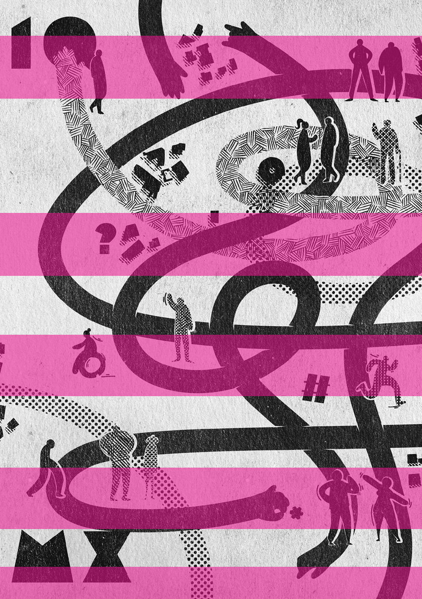
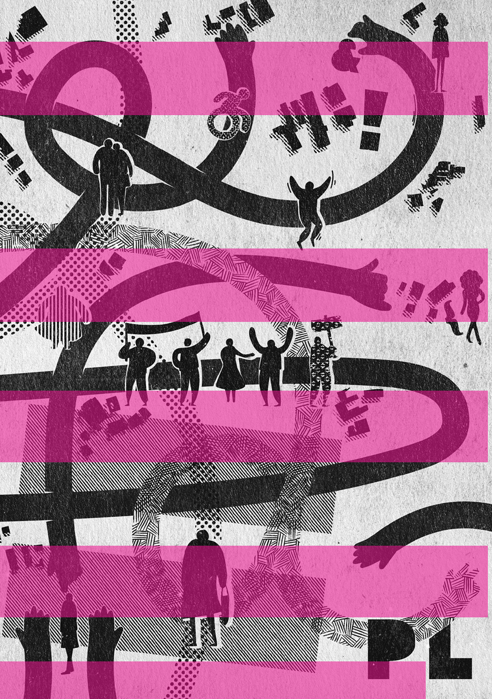

należy przyglądać się krytycznie? W przypadku Unintended City Jai Sen pisze o braku zaangażowania mieszkańców w proces mapowania – dokonywała go wyłącznie organizacja Unanyan. Sen zastanawia się, jaki charakter przybrałyby mapy, gdyby tworzyła je społeczność Panchannagram, i czy z ich udziałem przetrwałyby do dziś (duża część, przechowywana w archiwum, została zniszczona w powodzi). Innym niebezpieczeństwem, jakie bez trudu można sobie wyobrazić, byłaby sytuacja, w której proces ujawniania naraża mieszkańców (bądź co bądź niezarejestrowanych) na problemy prawne.

Krytyczne mapowanie daje jednak pewną nadzieję – że możliwe jest obalenie utrwalonych wizerunków, zmiana hierarchii i wpływ na rzeczywistość. Najbardziej inspirującym przykładem wydaje się Queering The Map, które nie dość, że daje głos społeczności LGBTQ2IA+, to tworzy również poczucie wspólnoty, walczy z wyobcowaniem, na które często cierpią jej członkowie, oraz pomijaniem w przestrzeni. Na stronie znajduje się wiele wpisów

157 — — planowaniewrażliwość

KONTRMAPOWANIE TO W RZECZYWISTOŚCI KŁAMSTWO WYMIERZONE W INNE KŁAMSTWO

Z podobnymi dylematami mierzy się Anti-Eviction Mapping Project mimo chęci dzielenia się dobrymi praktykami jest zmuszone utrzymywać niektóre w tajemnicy dla dobra społeczności, których dotyczą. Jego działaczka Erin McElroy zwraca uwagę na problem nadawania geolokalizacji przesiedleńcom i udostępniania danych – a co jeśli zostaną użyte w złym celu? Popierają ją również André Mesquita oraz Lis Mason-Deese, zwolennicy utrzymywania anonimowości działaczy społecznych czy migrantów. Nawołują oni do stosowania praktyk, które kultywuje między innymi kolektyw Iconoclasistas, a mianowicie do dyskusji między twórcami nad każdym z elementów umieszczanych na mapie i mapowania ich wyłącznie za udzieloną zgodą13. Ostatecznie anonimowość nie jest zawsze równoznaczna z niewidzialnością – dowodzi tego Lucas LaRochelle, które stworzyło widoczną wspólnotę, nie naruszając prywatności żadnego jej uczestnika.

zwracających uwagę na wykluczanie czy niedostosowanie miast do potrzeb osób wykluczonych. Wydaje się, że dobrze praktykowane kontrmapowanie może przyczynić się do śledzenia i naprawiania niesprawiedliwości istniejących w przestrzeni, a w konsekwencji mieć wpływ na planowanie. Idealnym rozwiązaniem byłoby branie pod uwagę licznych metod, jakie oferuje w konsultacjach społecznych i projektowaniu przestrzeni. Jakże inaczej mogłyby wyglądać miasta, gdyby odgórne praktyki planowania zostały zastąpione informacjami wydobytymi podczas warsztatów z kontrmapowania •

Kontrmapowanie często staje się obiektem ataków – Queering The Map w 2019 r. zostało zhakowane przez zwolenników Trumpa, a witryna pokazywała komunikat „Make America great again”. Mapa Port Saidu została zniszczona, a centrum kultury, w której została sporządzona – zamknięte. Możliwości map niestety kończą się tam, gdzie możliwości ludzi.

13 ThisIsNotanAtlas...

WIZJA PIERWSZEGO QUEER MIASTX1 W PL (1QMXPL)

M I C H A Ł KO W A L S K I I L U S T R A C J A : J A R E K M A N K I E W I C Z

# ~

Jakie masz przywileje? – zadałbym to pytanie-wytrych każdej osobie, ale przede wszystkim tym, które zajmują się projektowaniem i planowaniem. Czy twoja sytuacja jest udziałem innych? Co wynika z posiadanych przez ciebie praw i udogodnień lub ich braku w indywidualnym doświadczeniu? A co w kolektywnym? I jak do tego ma się urbanistyka?

stulecia sugerują coś innego [...] „ład” pożądany przez wielu planistów pozostawał ściśle heteroseksistowski, faworyzujący białe, cis męskie i heteronormatywne koncepcje2.

Wyobrażasz sobie planowanie miejsc, które rozpoznaje emocjonalne potrzeby osób? Przestrzeń, która stymuluje i wspiera wolność do bycia tym, kim się chce być? Nie reguluje cielesności i pragnień? Nie afirmuje pogoni za sukcesem, pozwala odnosić porażki? Pielęgnuje współpracę zamiast rywalizacji?

Brak inkluzywnego planowania nie zaskakuje, ponieważ praktyka planistyczna jest misternie związana ze sprawowaniem władzy, przede wszystkim poprzez wykorzystanie informacji (Forester, 1982), ale także przez odmowę rozpoznania i uznania informacji istotnych dla tych, którzy nie mają władzy. Chociaż jest niewielu planistów akademickich twierdzących, że planowanie jest dziedziną całkowicie techniczną, a zatem bezstronną, praktyki osób zajmujących się planistyką w ciągu ostatniego

Wyobrażasz sobie miejsce poza binarną logiką przeciwieństw: miejskie/wiejskie i indywidualne/kolektywne? Miejsce radykalnie różnorodne i zmienne?

Nasuwa się wątpliwość, czy to w ogóle są przymioty fizycznej przestrzeni. Czy można zaplanować i wybudować

2 P.L. Dian, Why Question Planning Assumptions and Practices about Queer Spaces[w:] Queerying Planning. Challenging Heteronormative Assumptions and Reframing Planning Practice, red. P.L. Dian, Nowy Jork 2011, s. 3, tłum. własne.

1 Zaproponowana neutralna rodzajowo forma „miastx” zgodna jest z postulatami inkluzywnego, queerowego języka. Więcej informacji na ten temat na stronie internetowej: www.zaimki.pl.

antystrukturę? Urealnić coś, co wydaje się utopijne, antysystemowe, antykonsumpcyjne? A tym bardziej zrobić to w hiperkapitalisycznych realiach i w świecie wymuszającym spolaryzowany performans płci. Skoro współczesna nauka głosi, że oprócz płci metrykalnej istnieje sześć innych jej rodzajów: hormonalny, chromosomalny, gonadalny, psychiczny, genitalny i somatyczny, możemy wreszcie uznać, że przypisane nam role społeczne to kulturowe przedstawienie? Płeć ma charakter spektrum, świat nie jest zero-jedynkowy, binarny. Dlatego uporczywie szukam przestrzeni, w której możemy się różnić

Określenie queer ma także konotacje polityczne i wiąże się z zagadnieniami sprawiedliwości społecznej.

159 — — planowaniewrażliwość

Wynikające z tego zjawiska queer planning oraz inkluzywna urbanistyka są od lat częścią dyskursu planistycznego w krajach wysokorozwiniętych. Temat nie jest niszowy, trafił już oficjalnie do mainstreamu – badania nad nim podejmują komercyjni giganci konsultingowi, np. ARUP3. W Polsce urbanistki i urbaniści zaczynają pisać o miastach feministycznych czy praw człowieka, empatycznym projektowaniu i urbanistyce dla osób nieneurotropowych. Nadal brak głosów mówiących o planowaniu uwzględniającym punkt widzenia osób queerowych. Dlaczego milczymy na ten temat?

- i eksplorować, modyfikować swoją tożsamość, a czasem pozwolić na jej całkowity brak.

Odpowiedzią niech będzie pierwsze queerowe miastx w PL (1QMXPL). 1QMXPL ma stać się, używając żargonu informatycznego, aktualizacją systemu (a może raczej, używając logiki queerowej, zmianą na antysystem) wprowadzaną do polskich miast. To też idea przyświecająca przyszłym inwestycjom oraz projektom odnowy, rewitalizacji i rozwoju struktur miejskich. 1QMXPL jest reakcją na potężną lukę w ich planowaniu, projektowaniu oraz zarządzaniu nimi, która powstała przez stulecia systemowego wykluczenia.

queer i queer pl anning, wtf?

Zacznijmy od podstaw. Co to znaczy queer (kłir)? Osoby tak się nazywające nie określają jednoznacznie swojej tożsamości płciowej, psychoseksualnej, romantycznej oraz innych charakterystyk nadanych przez dominujące narracje. Często dowolnie przybierają i zmieniają role wyznaczane sztywno przez społeczeństwo. Są pomiędzy, obok, zawiera-

- ją się w kilku pojęciach na raz albo nie identyfikują się z żadnym z nich. Często po prostu nie chcą w ogóle klasyfikować ludzi i kontestują wszelkie kulturowe gorsety, metrykalne uproszczenia, systemowe klasyfikacje i normatywność (a)społeczną.

Teoria queer może odmienić polski krajobraz, o czym przekonuje Ewa Majewska w tekścieEkonomia w badaniach inspirowanych teorią queer w Polscew książceStrategie queer. Od teorii do praktyki:

[...] badaczki i badacze queer mają do odegrania bardzo ważną rolę i nasze badania nad seksualnością, kulturą i subkulturami queer mogą przynieść niezwykle cenne rezultaty, […] dostarczają nam wiedzy o tym, jak trafnie intersekcjonalnie materialistycznie badać strukturę społeczną i generowane w niej wykluczenia, ale także umacniają naszą pozycję w ogólnych badaniach nad kulturą, w które możemy wnieść skuteczne strategie analizy społecznego, historycznego kształtowania się obecnych w niej norm, form dominacji oraz ucieleśnienia tych norm w konkretnym, prywatnym otoczeniu jednostek4.

Co także bardzo istotne, queerowa planistyka, podobnie jak teorie queer, kładzie bardzo duży nacisk na sam proces, a nie na finalny produkt. W polskich warunkach takie podejście wydaje się

- 3 ARUP, Queering Public Space: Raport, www.youtube. com/watch?v=gbRUVSSARO4 (data dostępu: 13.03.2023).
- 4 E. Majewska, Ekonomia w badaniach inspirowanych teorią queer w Polsce[w:] Strategie queer. Od teorii do praktyki, red. M. Kłosowska, M. Drozdowski, A. Stasińska, Warszawa 2012, s. 140.

wyjątkowo rozwojowe. W jej centrum są mieszkanki i mieszkańcy z całą ich różnorodnością, a nie normy i standaryzacje. Sue Hendler i Michael Backs w tekście

## 16033 —RZUT+

[Queer] To podmiot nieterytorialny: taki, który nieustanie dzieje się, ale nie ma miejsca, to znaczy nie okupuje suwerennego terytorium na prawach własności (choćby tą własnością była tożsamość seksualna czy tożsamość w ogóle). Relacja jest sposobem na współdziałanie z poszanowaniem drugiej osoby, która nie jest używana do osiągnięcia celów, ale staje się podmiotem celów, współtwórcą. [...] problemów związanych z queer jako jednostkową podmiotowością można uniknąć, „dopełniając Foucaultowskiego przejścia od bycia istotą ludzką do istoty ludzkiego działania6” (cyt. za: Sullivan 2003: 50). Podsumowując argumentację Jakobsena, Sullivan pisze, że: bardziej produktywne może być myślenie o queer jako o czasowniku (zbiorze działań) [...]6.

Queerying Planning (Theory): Alphabet Soup or Paradox City? (Queerowa Planistyka [Teoria]: Alfabetyczna Zupa czy Miasto Paradoksu, tłum. własne) słusznie zauważają:

Wreszcie, biorąc pod uwagę nacisk teorii queer na znaczenie procesu, możemy skupić naszą uwagę nie na produktach planowania, ale na procesach planowania. Queerowe planowanie w tym sensie ma związek z badaniem, jak działa planowanie, jak przebiega jego praktyka i jak te procesy wzmacniają lub obalają hegemoniczne zasady5.

W 1QMXPL „robienie” – współpraca, wymiana, współdzielenie, (re)negocjowanie – są kluczowe. Działania te mają często charakter spontanicznego, ale trwale usieciowionego wsparcia, opierają się na relacjach i oddolnym zauważaniu potrzeb. Miasto jednak powinno zapewnić przestrzenie i ramy, gdzie mogą one mieć miejsce. To odmienne podejście od rywalizacji, dominacji, kumulacji dóbr i separacji grup społecznych na podstawie ich zasobów.

rel acje zamiast ry walizacji

W założeniu fundamentem miasta queerowego jest współpraca i wzajemna pomoc mieszkanek i mieszkańców. Świadomość

W ZAŁOŻENIU FUNDAMENTEM MIASTA QUEEROWEGO JEST WSPÓŁPRACA I WZAJEMNA POMOC MIESZKANEK I MIESZKAŃCÓW. ŚWIADOMOŚĆ WŁASNYCH PRZYWILEJÓW POZWALA WSPIERAĆ NIEUPRZYWILEJOWANYCH

upublicznione uczucia

W mieście spełniającym kryteria 1QMXPL wszystkie uczucia są dozwolone i traktowane z szacunkiem. Znajdują swoje miejsca ekspresji i są poddane publicznemu przeżyciu. Język nienawiści zastępuje język szacunku, np. napis „pedały do gazu” na murze bloku jest pomnikiem, sadzi się pod nim kwiaty i edukuje o jego przemocowej treści. Nie zamiata się pod dywan politycznej poprawności niewygodnych emocji. W przestrzeni publicznej jest zgoda na przeżywanie smutku, złości i lęku.

własnych przywilejów pozwala wspierać nieuprzywilejowanych. Tym samym wrażliwe jednostki otrzymują opiekę i zyskują głos. Prawa człowieka regulują także porządek przestrzenny, stymulują sprawiedliwość przestrzenną, podważają relacje dominacji i podporządkowania.

Takie podejście wynika z głębszego, wręcz egzystencjalnego podłoża zjawiska queer. Ponownie dobrze opisują je Sue Hendler i Michael Backs:

Upublicznienie emocji, uczuć i seksualności jest naturalne tak samo jak ekspresja poglądów politycznych.

5 S. Hendler, M. Backs, Queerying Planning (Theory): Alphabet Soup or Paradox City?[w:] Queerying Planning. Challenging Heteronormative Assumptions and Reframing Planning Practice, red. P.L. Dian, Nowy Jork 2011, s. 86, tłum. własne.

- 6 W oryginale: from human being to human doing.
- 7 S. Hendler, M. Backs, dz. cyt., s. 74.

ProjektPublic feelingsAnn Cvetkovich jest świetnym przykładem tego, jak uczucia ze sfery prywatnej mogą być publicznie wyrażone i przez to wzbogacone o polityczny wymiar. Stało się tak choćby w czasie Dnia Politycznie Zdołowanych. W 2007 r. w Chicago ludzie wyszli na ulice w piżamach, koszulkach i szlafrokach z napisem „Zdołowany? To może być polityczne”. W ten sposób demonstrowali swój smumiast. Wraz z uczuciami przedmiotem emancypacji staje się ciałorelacyjność. Wszystkie przejawy miłości i bliskości są dozwolone. Wszystkie są naturalne, bo wszystko, co występuje w naturze, takie jest, analogicznie wszystko, co pojawia się w mieście, jest miejskie.

## 161 — — planowaniewrażliwość

Co za tym idzie w mieście queerowym istnieją przestrzenie, w których mogą swobodnie funkcjonować wszystkie rodzaje

UPUBLICZNIENIE EMOCJI, UCZUĆ I SEKSUALNOŚCI JEST NATURALNE TAK SAMO JAK EKSPRESJA POGLĄDÓW POLITYCZNYCH.

W MIEŚCIE QUEEROWYM ISTNIEJĄ

PRZESTRZENIE, W KTÓRYCH MOGĄ SWOBODNIE FUNKCJONOWAĆ WSZYSTKIE RODZAJE CIELESNOŚCI, CIAŁA: STARE,

GRUBE I WYCHUDZONE, KOLOROWE I BLADE, NIEPEŁNOSPRAWNE, SMUTNE I ZLĘKNIONE, TE POZA BINARNĄ NOMENKLATURĄ PŁCI, HIV POZYTYWNE, NIEMODNIE UBRANE CZY NIEWYGIMNASTYKOWANE

tek wynikający z nieskuteczności tradycyjnych protestów. Publiczne wyrażanie uczuć nie tylko wskazało na ich polityczne przyczyny, lecz także zbudowało nowe formy wspólnoty. W tekście:Queer i polityka cierpienia. Strategie narracyjne i polityczne osób trans w PolsceMaria Dębińska zauważa trafnie w kontekście sytuacji osób trans:

cielesności, ciała: stare, grube i wychudzone, kolorowe i blade, niepełnosprawne, smutne i zlęknione, te poza binarną nomenklaturą płci, HIV pozytywne, niemodnie ubrane czy niewygimnastykowane. Queerowość walczy z regulowaniem życia, opresją powodującą poczucie wstydu.

Nadanie „chorym” uczuciom kolektywnego wymiaru prowadzi do ich radykalnej reinterpretacji. Patologia staje się cechą systemu, a nie jednostki. Natomiast publiczne wyrażanie uczuć pozwala stworzyć model alternatywnej sfery publicznej. Dopóki uczucia podlegają patologizującemu dyskursowi medycznemu, historie cierpienia są walutą, kapitałem kulturowym, który pozwala osobom trans na uzyskanie diagnozy i przejście transformacji. Upolitycznienie tego cierpienia może stać się początkiem polityki queer, która oprze się dominującym dyskursom sprowadzającym seksualność do sfery prywatnej i tym faworyzującym już uprzywilejowanych. Może to publiczne uczucia powinny być podstawą nowych, bardziej otwartych i płynnych wspólnot i tożsamości?8

ant ystruktur a przestrzenna

Miasto queerowe jest policentryczne. Ma silną siatkę współpracy lokalnego i ponadlokalnego wsparcia oraz wymiany. Charakteryzuje je porowatość, nieobsesyjne dogęszczanie i duszna zwartość. W usieciowionym organizmie przestrzenie wolne, niezabudowane, oddychające mają transformujące funkcje. Akumulują nieprzewidywalne wydarzenia, czarne łabędzie i społeczne eksperymenty. Tym samym granice przestrzenne mogą być bardziej płynne i zmienne w czasie. Działają jak żywy organizm, niczym nadrzeczne mokradła i lasy łęgowe w czasie powodzi. Przestrzeń publiczna staje się aktywnym

Te refleksje doprowadzają mnie w końcu do bardzo ważnej cechy queerowych

- 8 M. Dębińska, Queer i polityka cierpienia. Strategie narracyjne i polityczne osób trans w Polsce [w:] Strategie queer…, s. 226.

miejscem manifestowania poglądów i wyrażania opinii, a nie tylko skomercjalizowanym miejscem hiperkonsumpcji. Zachęca do zgromadzeń i czynnego udziału w kontestowaniu lub/i wspieraniu rządzących miastem. Jest miejscem celebracji różnorodności oraz wyrażania pragnień zmiennością przeznaczeń terenów i hiperelastycznością tego, co wyliczone i wyrysowane.

## 16233 —RZUT+

co zamiast heteroseksistowskiego pl anowania

Jeśli chcesz wyjść poza matrix heteroi cisseksistowskiej planistyki, to zadaj sobie na początek pytanie: kto jest obiektem, a kto podmiotem postnowoczesnego planowania? Czy w ogóle obecne planowanie

- i emocji. Żyje. Wydarzenia queerowe nie ograniczają się do jednego obszaru – wioski queerowej czy getta queerowego. Nowe enklawy przenikają się i nakładają z już istniejącymi miejscami ważnymi dla tożsamości społeczności queer. Są miejsca pamięci związane z ważnymi wydarzeniami i osobami, bezpiecznie zaprojektowane parki, zieleńce, plaże, powszechnie dostępne toalety bez segregacji na płeć metrykalną, darmowe i niskobudżetowe usługi sportu, kultury i rekreacji. Charakteryzuje je wielofunkcyjność, elastyczność, adaptacyjność. Ich funkcja i forma są płynne. Na obszarze całego miasta można zajrzeć do tzw. kieszonek queerowych. Miejsc bezpiecznych i przyjaznych osobom queerowym, gdzie można przebywać na zasadach niekomercyjnych lub z małym budżetem. Tam dozwolone jest eksperymentowanie, zamiana ról i tożsamości.

Sue Hendler i Michael Backs wspomina-

- ją Judith Butler – jedną z głównych twórczyń queerowej teorii – i jej trafny opis przekory i eksperymentalnej natury queerowości, która burzy tradycyjne modele pojmowania własności i granic:

1QMXPL ZAPRASZA PLANISTKI I PLANISTÓW, MIESZKANKI I MIESZKAŃCÓW MIAST DO REFLEKSJI NAD PŁYNNOŚCIĄ STRUKTURY

WŁASNOŚCI, ZMIENNOŚCIĄ PRZEZNACZEŃ TERENÓW I HIPERELASTYCZNOŚCIĄ TEGO, CO WYLICZONE I WYRYSOWANE

stawia w centrum człowieka? A jeżeli już, to czy jest to każdy człowiek, bez względu na jego cechy, majątek, kapitał kulturowy?

Decentralizacja planowania i zarządzania pozwala dotrzeć do realnych potrzeb członków społeczności, negocjować z nimi rozwiązania, mediować potrzeby. Na tym budować podwaliny miasta. W takich warunkach szanse na bycie widzianym, usłyszanym mają osoby dotąd wykluczone. Miasto queerowe jest wielogłosowe, bliżej mu do demokracji bezpośredniej niż do oddania się w ręce garstki rządzących. Wizję społeczności różnorodnej, pluralistycznej, opartej na prawach człowieka nakreśla Jan Kochanowski:

Butler sugeruje, że queer jest skuteczny tylko wtedy, gdy istnieje w ciągłym stanie zmian: jeśli termin „queer” ma być miejscem zbiorowej kontestacji... będzie musiał pozostać tym, co w teraźniejszości nigdy nie jest w pełni własnością, ale zawsze i tylko ponownie rozmieszczone, przekręcone, odwrócone od wcześniejszego użycia w kierunku pilnych i rozszerzających się celów politycznych9.

Łączy nas cel: otwarte, sprawiedliwe społeczeństwo, gdzie odmienność jest przedmiotem szacunku i afirmacji. Społeczeństwo wyleczone z totalitarnych ciągot do czynienia wszystkich takimi samymi. Społeczeństwo otwartej różnicy, a nie zamkniętej tożsamości10.

1QMXPL zaprasza planistki i planistów, mieszkanki i mieszkańców miast do refleksji nad płynnością struktury własności,

W queerowej planistyce rasa, ubóstwo, tożsamość nie są ignorowane. Daje to szansę

10 J. Kochanowski, Wprowadzenie[w:] Strategie queer…, s. 26.

- 9 S. Hendler, M. Backs, dz. cyt., s. 74.

na odejście od powielanych cisnormatywnych i heteronormatywnych norm oraz neoliberalnej dystrybucji przywilejów. Co więcej, a może przede wszystkim, zmiana jest wymagana także w samych osobach zajmujących się planistyką. Czy wsłuchują się one w głosy zamieszkujacych miasta czy we własne poglądy i potrzeby? Petra L. Doan trafnie zauważa:

stygmatyzację osób pracujących seksualnie. Nie tylko ograniczenie wyrażania seksualności i marginalizacja tych, którzy wykorzystują ją w celach zarobkowych, lecz także sztywny gorset wolnorynkowego wytresowania, wszystko to wymaga przeformatowania. Jak zauważa słusznie Krystin Wong-Tam we wstępie do książki

163 — — planowaniewrażliwość

Any Other Way: How Toronto Got Queer

(W każdy inny sposób. Jak Toronto stało się queer, tłum. własne):

Czym jest „tożsamość” planowania i jak do tego doszło? Co mamy na myśli, gdy mówimy, że planowanie to „zawód”? Jak zbudowana została idea „zawodu”? [...] Kto ma lub powinien mieć prawo nazywać siebie planistą? I tak dalej. Chodzi

Żyjemy w nudnych, opresyjnych miastach nastawionych na produkcję i konsumpcje, gdzie inne modele życia są spychane na margines miejskości12.

- o to, że pełne zrozumienie teorii queer w ramach planowania nie może pozostawić samego planowania bez kontroli. [...] ważne jest, aby pamiętać
- o znaczeniu kwestionowania i problematyzowania przyjętych prawd w teorii queer. W planowaniu takie podejście może zakwestionować standardy stosowane przy opracowywaniu planów (np. X akrów parku na Y populacji) albo kwestionować modne użycie terminu „najlepsze praktyki” na rzecz pytania „najlepsze dla kogo, w jakich okolicznościach i dlaczego?”11.

Nie zarabiasz w „moralny” sposób, nie kupujesz więcej, niż potrzebujesz, nie odnosisz sukcesu i nie obnosisz się z nim, nie jesteś modny, to wynocha z ugrzecznionego miasta! Przeciwieństwem takiego opresyjnego modelu ma być miasto queerowe, którego mieszkanki i mieszkańcy wyrzekają się szacowności, nadęcia, pogoni za wzrostem, nowoczesnością i dyscypliny kapitalistycznej. Kontestują hegemonię prywatyzacji i komercjalizacji. Chcą tworzyć miasto minispołeczności, poliamorycznych związków, rodzin patchworkowych, kooperatyw, kolektywów, miasto miksu socjalnego – mozaikową układankę. Miasto nonkonformistów, występujących przeciw, jak pisze Tomasz Sikora:

Planistki i planiści dążący do stworzenia sprawiedliwszej, empatycznej społeczności miejskiej powinni strać się przyjąć krytyczne podejście do własnych uprzedzeń i założeń leżących u podstaw większości projektów.

ekonomia seksualności i nonkonformizm

[...] erozji tego co kolektywne przeciw zbiorowi osób „zasługujących na życie” w mieście według ogólnie ustalonych wskaźników, norm, przeciw ograniczeniom wolności w zamian za tylko pozorne poczucie bezpieczeństwa. Przeciw zarezerwowaniu wolności tylko dla wolnego rynku, ograniczona tylko do wolności konsumenckiej w zarządzaniu własnym kapitałem. Przeciwko eksploatacji tego co społeczne, wspólne na rzecz interesów przedsiębiorstw i inwestorów [...]13.

Od lat 80. XX w. badania wskazują na związek pomiędzy tożsamością, także psychoseksualną, a przestrzenią miejską. Przestrzenie są przez społeczne doświadczenia kształtowane, opisywane i transformowane.

Organizacja miasta 1QMXPL oparta jest na zrozumieniu zależności praktyk seksualnych od ekonomii. Bierze pod uwagę hamującą wielowymiarową opresję ekonomiczną, rasową, klasową, związaną z ograniczoną sprawnością oraz

- 12 T.K. Wong-Tam, Wstęp[w:] Any Other Way: How Toronto Got Queer, red. S. Chambers i in., Toronto 2017, s. 348, tłum. własne.
- 13 T. Sikora, Queer jako (antyliberalna) polityka pożądania i różnicy[w:] Strategie queer…, s. 40.

11 P.L. Doan, Conclusions and Reflections for the Future: Reframing Planning Practice [w:] Queerying Planning…, s. 230.

1QMXPL ma być wyleczone z „totalitaryzmu czynienia wszystkich takimi samymi”. To celebracja odmienności i wolności własnej, niewymienialnej na wolność wolnego rynku. Dlatego też 1QMXPL respektuje i wspiera (w obszarze choćby mieszkalnictwa, usług społecznych, zniżek etc.) inne niż tylko monogamiczne, rodzinne i romantyczne formy wspólnego życia osób.

w ten sposób granice między queerowym i niequeerowym, budując formy porowate, niezdelimitowane. Umiejscowienie poza centralnymi lokalizacjami pozwoli na większą dostępność cenową, może też

## 16633 —RZUT+

CHOĆ NADAL POZOSTAJĄ NISZOWE,

SZCZEGÓLNIE W POLSKIEJ PLANISTYCE I ARCHITEKTURZE, QUEEROWE HISTORIE, ASPIRACJE, POTRZEBY SĄ UNIWERSALNE, w pełnym spektrum

W przeciwieństwie do wielu miast wysokorozwiniętych w polskich nie powstanie już prawdopodobnie model miasteczka/ dzielnicy osób identyfikujacych się jako nieheteronormatywne, jak chociażby Old Compton Street/Soho w Londynie, Chueca w Madrycie czy Castro w San Francisco. Nie mamy do tego ani klimatu politycznego, ani kapitału społecznego. Może to nawet lepiej, enklawy te, choć odegrały istotną rolę w budowaniu społeczności nienormatywnych, okazały się mało odporne na komercjalizację i gentryfikację. Wysokie czynsze i opłaty zmusiły część społeczności do przeprowadzki. Z powodu uturystycznienia stały się mniej bezpieczne i straciły na swej autentyczności. Nigdy też nie były naprawdę queerowe, gdyż zazwyczaj tworzyli je i dominowali uprzywilejowani, zazwyczaj zamożni, biali cismężczyźni. Osoby w spektrum kobiecości lub niebinarne pozostawały w mniejszości i często dotykały je różne formy wykluczenia, w tym ekonomiczne.

TAKIE SAME JAK DĄŻENIA INNYCH OSÓB – WSZYSCY BOWIEM ODCZUWAMY TE SAME EMOCJE, MAMY PRAGNIENIA I CHCEMY BYĆ UWZGLĘDNIANI

chronić przed zalewem falami turystów przez klimat bardziej kameralny i bezpieczny. Sieć queerowa ma szansę być odporniejsza na komercjalizację dzięki swojej rozproszonej strukturze, „uziemionej” lokalności „teraz i tu” oraz przez kreowanie wszelkich modeli zbiorowej współpracy. Budowanie sieci wzajemnego wsparcia, spółdzielczości, wymiany zasobów urealni i wzmocni te struktury. Nie muszą one być wcale wielkomiejskie i skoncentrowane na rozrywce. Wręcz przeciwnie, powinny raczej pielęgnować niskobudżetowe formy zamieszkania, oddolne inicjatywy kulturalne i artystyczne, długoterminowe formy najmu lokali mieszkalnych i usługowych, międzypokoleniową wymianę doświadczenia i edukację niezależną od wieku i kapitału kulturowego oraz wszelkie inne pozainstytucjonalne, łatwo dostępne, niekomercyjne, wielowartościowe formy współżycia. W pełnym spkctrum płci, form, znaczeń, tożsamości i przeżyć.

W Polsce, ucząc się na doświadczeniu tych lokalizacji, mamy szansę wykształcić bardziej otwarte i inkluzywne struktury, uwzględniające wszelką różnorodność, także ekonomiczną, bardziej odporne na komercjalizację, gentryfikację i uturystycznienie. Powinny to być ponadlokalne, usieciowione, dobrze skomunikowane transportem publicznym i siecią zielonych ścieżek pieszych i rowerowych, rozproszone w skali miasta minienklawy. Mogłyby promieniować na najbliższe otoczenie jakością współżycia miejskiego, zacierając serio?

Czy umiesz sobie, czytelniku, wyobrazić wypchnięcie mieszkańców poza strefę codziennego komfortu życia w bańce normatywności? Spojrzenie poza koncept hegemonii? Oddanie własnego przywileju?

