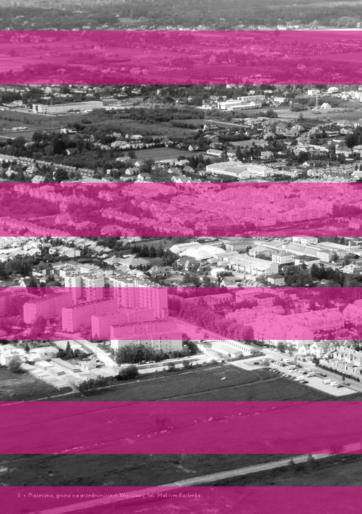
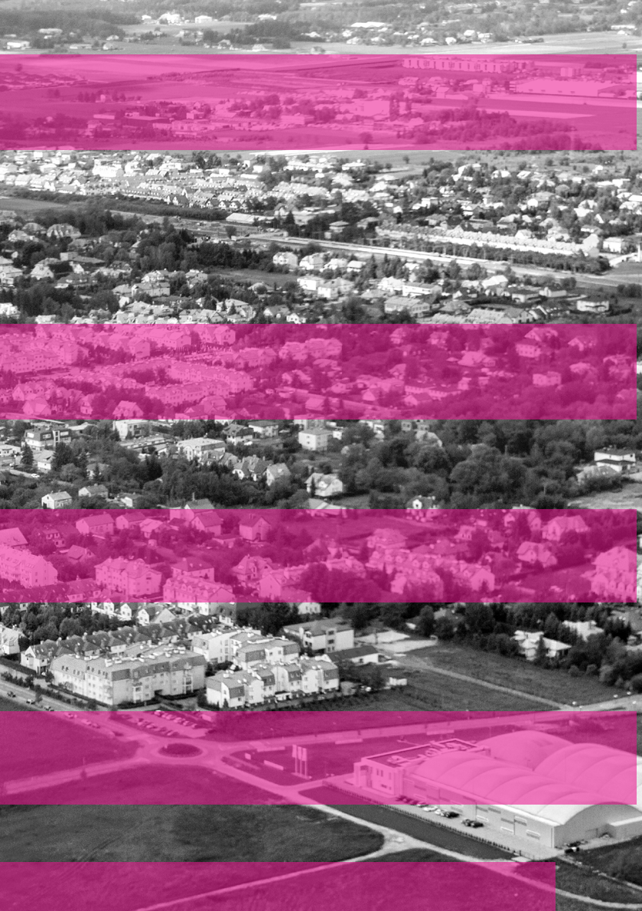
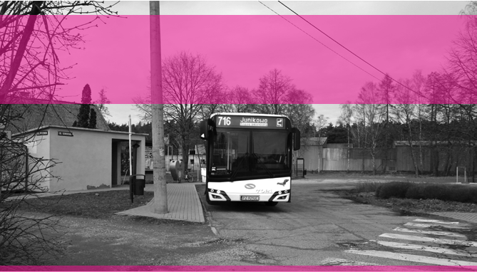
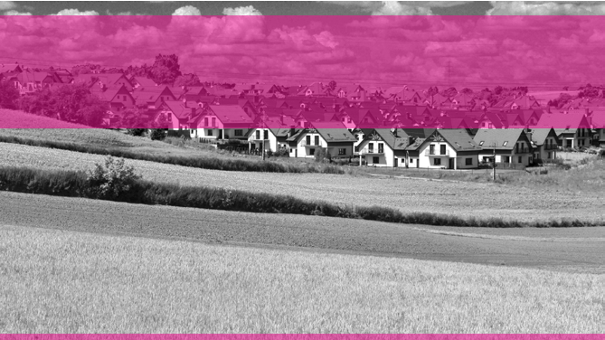

Choć nadal pozostają niszowe, szczególnie w polskiej planistyce i architekturze, queerowe historie, aspiracje, potrzeby są uniwersalne, takie same jak dążenia innych osób – wszyscy bowiem odczuwamy te same emocje, mamy pragnienia i chcemy być uwzględniani. Dopiero kiedy nakreślimy świat, w którym większość żyje zgodnie z normą i w sposób uprzywilejowany, a mniejszość poza nią, ze wszystkimi konsekwencjami bycia wykluczonym, zrozumiemy trud osób queer walczących o swoje miejsce. Nie mam dla ciebie gotowej odpowiedzi na to, jak zmienić polskie miasto w enklawę szczęśliwej różnorodności i niebinarności. Otwieram dyskusję. Proponuję wizję, być może utopijną, do dalszego oglądu. Inspiruję i wprowadzam do polskiej urbanistyki i architektury teorie dotąd pomijane, lekceważone i mało znane.

## 167 — — planowaniewrażliwość

Moją intencją jest przede wszystkim oddanie głosu, zauważenie i uhonorowanie tych wszystkich, którzy do tej pory czuli, że nie mają w Polsce swojego miejsca, że są poza dystrybucją przywilejów.

Pierwsze Polskie Miastx Queerowe zgodnie z zasadą extreme characters design(projektowania dla ekstremalnych osobowości) z uwzględnieniem prawa i dbałością o dobrostan osób queerowych (w domyśle atypowych) przyczyni się do poprawy życia pozostałych mieszkanek i mieszkańców. Będzie propagować przestrzenną sprawiedliwość i respektować prawa człowieka. Serio! Prawa każdego człowieka •

# P O D M I E J S K I E B I O G R A F I E

# ~

rozmawiała: Zofia Piotrowska z Katarzyną Kajdanek, socjolożką miast i społeczności lokalnej, od wielu lat badającą procesy suburbanizacji

~Czy zamiast używać określenia

~Czy przedmieścia, w tym drugim znaczeniu, muszą koniecznie znajdować się „przed” miastem, czyli poza jego administracyjnymi granicami?

suburbanizacja, możemy po prostu powiedzieć, że tematem naszej rozmowy będą przedmieścia?

Suburbanizacja to proces, a przedmieścia, czyli polski odpowiednik słowa suburbia, to efekt tego procesu. Samo stosowanie słowa przedmieście jest dość problematyczne, zwłaszcza w towarzystwie historyków, historyków architektury, urbanistów czy geografów. Zwracają oni uwagę na to, że przedmieścia to te fragmenty miasta, które kiedyś znajdowały się za jego murami, a dziś często są w jego obrysie administracyjnym. Tak jest na przykład we Wrocławiu, gdzie mamy Przedmieście Oławskie, Przedmieście Świdnickie, Przedmieście Mikołajskie. Używając słowa przedmieście, można więc w pewnych kręgach wywołać fałszywe wrażenie, że mówimy o historycznych obszarach, podczas gdy mamy na myśli suburbia, czyli przestrzenie monofunkcyjne, głównie rezydencyjne, często pozbawione podstawowej infrastruktury.

Niekoniecznie. To zależy od tego, gdzie w przestrzeni administracyjnej znajdują się tereny o opisanym charakterze, czyli z dominującą zabudową mieszkaniową, często z utrudnioną komunikacją z innymi dzielnicami lub z centrum miasta. Jeśli znajdują się one w administracyjnych granicach miasta, wtedy mówi się o suburbanizacji wewnętrznej. To zjawisko zazwyczaj związane jest z powstawaniem dużych osiedli mieszkaniowych, niekoniecznie złożonych z budynków wielorodzinnych, ale raczej z bliźniaków czy niskiej zabudowy szeregowej, domów jednorodzinnych. Są zlokalizowane w oddaleniu od centrum, na tańszych działkach. Choć znajdują się w granicach miasta, to pod względem morfologicznym i funkcjonalnym nie różnią się od podmiejskich suburbiów. Jednak aby uchwycić suburbanizację w statystykach, częściej

Jeśli chodzi o polskie miasta, to musimy się zastanowić, jaki okres ich historii opisujemy. Powiedzmy, że można o pewnych cyklach rozwoju zacząć mówić od powojnia, kiedy Polska przybrała aktualne granice. Wiadomo, że w okresie socjalizmu odgórnie planowane procesy urbanizacji miały szczególną logikę. Istniał silny nacisk na zacieranie granic między miastem a wsią, stąd na przykład industrializacja terenów wiejskich i do dziś istniejące tam wielopiętrowe budynki wielorodzinne, które towarzyszyły PGR-om. Jednak wiele procesów wydarzało się obok planowanej odgórnie urbanizacji. Jednym z nich było powstawanie drugich domów, najpierw na wzór radziecki jako nagród dla zasłużonych działaczy partii, potem jako wyraz aspiracji zamożniejszych osób. Ta ścieżka doprowadziła do rozwoju gmin podmiejskich i małych miast satelickich. Innym procesem było osiedlanie się w pasie podmiejskim osób napływających z terenów wiejskich, które nie miały zezwolenia na zameldowanie w mieście.

mówi się o terenach znajdujących się poza granicami miasta. W polskiej statystyce publicznej w ogóle jest taki problem, że nie stosuje się podziału na coś,

169 — — planowaniewrażliwość

W POLSKIEJ STATYSTYCE PUBLICZNEJ NIE STOSUJE SIĘ PODZIAŁU NA COŚ, CO JUŻ NIE JEST MIASTEM, A JESZCZE NIE JEST WSIĄ co już nie jest miastem, a jeszcze nie jest wsią. Wszystkie tereny w Polsce administracyjnie dzielą się albo na miasto, albo na wieś. Nawet „klasyczne” suburbia położone tuż za granicą miasta administracyjnie określa się jako wieś.

~W innych krajach stosuje się odmienny podział?

Tak, w wielu krajach wyznacza się obszary statystyczne, które nazywane są „funkcjonalnymi obszarami miejskimi” i rozumiane jako rdzeń miejski, czyli miasto w jego administracyjnych granicach, oraz powiązane z nim funkcjonalnie gminy i obszary wokół.

Suburbanizacja w nowym stylu, na liberalny, pozbawiony planowania wzór amerykański, rozpoczęła się mniej więcej pod koniec lat 90. i na początku lat 2000. To wtedy pojawiają się pierwsze kredyty hipoteczne i rozwija się rynek deweloperski. To powoduje, że kogo nie stać na kupno mieszkania, decyduje się na samodzielne wybudowanie domu. Gminy podmiejskie zaczynają przeznaczać w planach miejscowych coraz większe tereny pod zabudowę i proces suburbanizacji się nakręca. Choć nie była to ścieżka nieunikniona, to w Polsce podążyły nią wszystkie duże miasta.

~Wydaje się, że historia miast przebiega w cyklach, rozwój ich rdzeni, potem ucieczka bogatszych mieszkańców na przedmieścia i znów powrót ludzi do centrum. Czy w przypadku polskiej suburbanizacji było podobnie?

Podany przez ciebie opis zjawiska ma ogromną moc kształtującą wyobraźnię. To charakterystyka miast anglosaskich, głównie amerykańskich, która bardzo silnie oddziałuje na nasze wyobrażenie, jaka jest typowa cykliczna ścieżka rozwoju przestrzeni zurbanizowanych. Nie jest to jednak scenariusz nieunikniony. Są przykłady miast europejskich, nawet niedaleko położonych miast niemieckich, których władze zdały sobie sprawę, że powstawanie suburbiów nie jest dobre, i starały się jak najszybciej ten proces zahamować.

~Pod koniec zeszłego roku przeprowadzałam wywiad z ministrem Piotrem Uścińskim, rozmawialiśmy o reformie systemu planowania. W wielu sprawach się zgadzaliśmy, ale nie w temacie kosztów chaosu przestrzennego. Zdaniem ministra dom jednorodzinny jest dobrym rozwią-

## 17033 —RZUT+

którzy mówią, że suburbanizacja to największy problem polskich miast. Czy rzeczywiście tak jest?

zaniem mieszkaniowym.Okazało się nawet, że wszystkie osoby pracujące w gabinecie ministerialnym i obecne przy tej rozmowie mieszkają w gminach pod Warszawą. Z czego wynika aż tak silne zakorzenienie wyobrażenia ludzi, że domek z ogródkiem to idealny sposób zamieszkiwania? Czy w tej sytuacji można o budownictwie jednorodzinnym merytorycznie rozmawiać?

Różne miasta mają różne problemy. Można powiedzieć, że w niektórych największym będzie zanieczyszczenie powietrza. Ono z kolei pochodzi ze spalania silników aut codziennie dojeżdżających z gmin podmiejskich. Suburbanizacja jest procesem złożonym, zawiera w sobie tyle kwestii społecznych, przestrzenTrzeba próbować zrozumieć, skąd bierze się taki wysoki status domu jednorodzinnego. Najlepszą do tego okazją są momenty pęknięć, zawirowań. W badaniach, które opublikowałam w książce Powrotnicy, dotyczącej osób przeprowadzających się z przedmieść do miast, te momenty występowały, gdy moi rozmówcy zdawali sobie sprawę, że to, co miało ostatecznie potwierdzić ich dojrzałość, osiągnięcie sukcesu życiowego i finansowego, nie jest spełnieniem tych marzeń, że nie jest najlepszym możliwym rozwiązaniem. W momentach kryzysu wyraźnie widać, czym ten dom jest, a czym nie, w jakich okolicznościach swoich funkcji nie pełni.

ROZLEWANIE SIĘ MIAST W FORMIE ZABUDOWY JEDNORODZINNEJ STAŁO

SIĘ W ISTNIEJĄCYCH WARUNKACH POLITYCZNYCH WŁAŚCIWIE JEDYNĄ

ODPOWIEDZIĄ NA FAKT ABDYKACJI PAŃSTWA Z KSZTAŁTOWANIA POLITYKI

MIESZKANIOWEJ

nych, środowiskowych, ekonomicznych

- i politycznych, że rzeczywiście można
- ją uznać za jeden z największych problemów miast.

Początkowo, kiedy badane osoby zamieszkały na przedmieściach, bardzo silnie odczuwały, że spełniły ważną życiową misję. Nie tylko taką, którą sobie same wyznaczyły, ale scedowaną na nich przez społeczeństwo czy rodziców lub teściów. Posiadanie domu było uważane za coś właściwego. Niektóre analizy zakorzenione w studiach kultury polskiej pokazują, że dom jednorodzinny ma być wszystkim, czym nie było zamieszkiwanie w blokach wielorodzinnych – odcięciem od niechcianego sąsiedztwa, mieszkaniem w miejscu przez siebie wybranym, a nie odgórnie przydzielonym, w przestrzeni przesegregowanej, wśród ludzi podobnych do nas.

Natomiast nie do końca o to chodzi, żeby wskazywać mieszkanie w domu jednorodzinnym jako coś złego. Nie potępiajmy tego sposobu zamieszkiwania, ale raczej zwróćmy uwagę na to, że rozlewanie się miast w formie zabudowy jednorodzinnej stało się w istniejących warunkach politycznych właściwie jedyną odpowiedzią, i to odpowiedzią wygenerowaną oddolnie, na bardzo przykry fakt abdykacji państwa z kształtowania polityki mieszkaniowej. To, że tak wiele osób decyduje się albo na zakup, albo samodzielną budowę domu jednorodzinnego, bardzo często nie jest efektem napędzanego kulturowo wyboru, ale przymusu ekonomicznego. Jest to bardzo kosztowne pod względem infrastrukturalnym. Dlatego często tej infrastruktury nie ma. Gmin nie stać na pociągnięcie niepoliczalnych kilometrów rur, dróg, kabli, światłowodów. Domy podmiejskie

~Z jednej strony mamy silnie ukorzenione wyobrażenie społeczne o mieszkaniu w domu jednorodzinnym, z drugiej strony badaczy i ekspertów, to często nadal domy z własną studnią, szambem, z rwącym się internetem. Są niekorzystne społecznie ze względu na czas tracony na dojazdach i środowiskowo, nie tylko w ramach danej miejscowości, gdzie ludzie nie mają ogrzewania i palą w piecach, ale też dla miast przez dodatkowy transport samochodowy.

różdżki zostały zamienione na działki budowlane. W ramach urbanistyki łanowej pojawiają się nowi mieszkańcy. Zderzenie czy niemalże międzycywilizacyjny kontakt tych osób jest osobnym ciekawym tematem, który ujawnia się w procesie suburbanizacji.

## 171 — — planowaniewrażliwość

~Wracając doPowrotników, czyli książki, w której opisujesz zjawisko reurbanizacji w kontekście biografii konkretnych osób. Czy mogłabyś zarysować typową ścieżkę życiową nowej mieszkanki/ńca, który przeprowadza się na przedmieścia? Co nią/nim kieruje?

~Powiedziałaś, że nasze suburbia powstały na wzór anglosaski, ale czy polskie przedmieścia mają swoją własną specyfikę?

W odróżnieniu od suburbiów anglosaskich, szczególnie amerykańskich, które zwłaszcza po wojnie były budowane przez wyspecjalizowane firmy jako wielkie osiedla, wręcz miasteczka, takie jak Levittown, specyfiką polskich osiedli podmiejskich jest rozwój oparty na rdzeniu starych wsi. Wynika to z tego, że budowane są przez indywidualne osoby, które mają ograniczone budżety i chcą być blisko źródeł infrastruktury. Łatwiej przytulić się do istniejącego wodociągu, niż budować na surowym korzeniu. Chociaż i to się zdarza, zwłaszcza w przypadku realizacji deweloperskich. Duży inwestor rozplanowuje fragment terenu, infrastrukturę i sprzedaje domy jako półgotowe produkty – pod klucz albo do indywidualnego wykończenia.

Zmuszasz mnie do tego, żeby upraszczać, co jest bardzo trudne. Gdyby nie było, to nie napisałabym 350 stron książki, która przedstawia możliwe warianty takich ścieżek życiowych, ale spróbuję. Decyzję o przeprowadzce podejmują rodziny mające dzieci w wieku szkolnym. Robią to głównie z przyczyn ekonomicznych. Pojawia się pierwsze, drugie, czasami trzecie albo kolejne dziecko i rodzina doświadcza stresu mieszkaniowego – to znaczy, że wielkość gospodarstwa domowego nie pasuje do przestrzeni, jaką dysponuje. Któregoś dnia sprawdzają w internetowym generatorze, jaką mają zdolność kredytową (nie mówimy

Powstawanie osiedli podmiejskich opartych na rdzeniu starych wsi generuje wiele bardzo ciekawych i specyficznych dla tej

- o dzisiejszych warunkach, ale sytuacji sprzed kilku lat). Te dane zderzają z informacjami z lokalnego rynku mieszkaniowego, szybko dochodzą do wniosku, że to, co są w stanie kupić w mieście, albo nie jest wystarczająco duże, albo jest za drogie. Szukają więc coraz dalej i dalej
- od miasta, aż znajdą coś, co jest dla nich akceptowalne. Dzieci są na razie małe, więc nie ma jeszcze problemu dowożenia ich do szkoły.

POWSTAWANIE OSIEDLI PODMIEJSKICH OPARTUCH NA RDZENIU STARYCH WSI GENERUJE WIELE BARDZO CIEKAWYCH I SPECYFICZNYCH DLA TEJ CZĘŚCI EUROPY ZJAWISK

Fascynujące jest to, że początek zamieszkiwania w niektórych opisywanych przeze mnie przypadkach jest wręcz euforyczny – zachwyt tym, że się dało radę w zderzeniu z bankiem, ekipą budowlaną, z całym tym trudnym procesem.

części Europy zjawisk. Mieszkające tam społeczności jeszcze do niedawna parały się aktywnością rolniczą na terenach, które jak za dotknięciem czarodziejskiej

### Il. 1. Piaseczno, gmina na przedmieściach Warszawy, fot. Maksym Kozlenko

Rodziny wprowadzają się w jakichś fajnych momentach, na przykład tuż przed świętami albo późną wiosną. Doświadczają lata w swoim ogrodzie, trafiają na bardzo miłych sąsiadów, tworzą mikrowspólnoty doświadczeń, dzieci się ze sobą zapoznają.

zamieszkali na suburbiach w wieku średnim, mając nadzieję, że będą tam z nimi mieszkać ich dzieci i wnuki.

## 17433 —RZUT+

~Ofiarami braku wyobraźni, jak życie rozwinie się w dłuższej perspektywie czasu, stają się dzieci, które są jednym z głównych bohaterów twojej książki. Wydają się biernymi uczestniczkami/kami decyzji rodziców. Jakie problemy charakteryzują ich codzienność?

Wspólnym doświadczeniem opisywanym przez badane przeze mnie osoby jest też to, że z czasem narasta dysonans między marzeniami i oczekiwaniami wobec domu a tym, czym się on faktycznie okazuje – problemem organizacji życia, dojazdami, znudzeniem dzieci własnym pokojem, psem, zabawą piłką w ogródku. Kontekst tej zmiany jest o tyle szerszy, że w miastach, które te rodziny opuszczały 15–20 lat temu, nie działo się nic szczególnie ciekawego. Było to na początku lat 2000., jeszcze przed Euro, przed zwrotem ku rowerom, transportowi publicznemu, przed myśleniem o tym, że miasta mogą być motorami zmian proklimatycznych, przed wdrożeniem programów wymiany pieców. Nagle w zaskakujący sposób powietrze w Krakowie stało się lepsze niż to pod Krakowem. To, co miało być super,

Użyłaś słowa „ofiara”, które brzmi bardzo mocno, ale rzeczywiście kilka osób, z którymi rozmawiałam, za swoje doświadczenia obarcza winą rodziców. Rozumiem żal dorosłych podmiejskich dzieci, wiem, z czego wynika, ale jest on skierowany w złą stronę. Nie jest winą rodziców, że w danym momencie chcieli podjąć najlepszą decyzję, jaką mogli. Ten żal powinien zostać przekuty na bunt polityczny, na żądania sensownej polityki mieszkaniowej.

Zresztą bycie ofiarą i bierność nie były strategiami, jakie młode wówczas, a dorosłe dzisiaj, dzieci przyjmowały. Fascynowało mnie śledzenie historii o funkcjonalnym i efektywnym przystosowaniu się do zaistniałej sytuacji. Nazwałam je podmiejskimi nomadami. To były osoby, które miały 14–16 lat, mówiły sobie – żeby dojechać do szkoły, muszę wstać o 6 rano, wsiąść w kolejkę podmiejską (to i tak bardzo korzystny przykład), nie mam prawa jazdy, a moja matka robi tyle zamieszania, gdy ma mnie odwieźć lub przywieźć, że nie chce mi się nawet z nią gadać. Dziecko planuje sobie dzień tak, żeby jak najpóźniej wrócić do domu, bo nie chce rezygnować z atrakcji, które są dla niego ważne. Nomadyczny podmiejski nastolatek pakuje się do plecaka z całym swoim życiem, koszulką, kosmetyczką, jedzeniem, termosem, odtwarzaczem muzyki, książką. Uczy się albo śpi w kolejce, jest w stanie wykształcić w sobie odpowiedni odruch i wie dokładnie, kiedy się obudzić. Oprócz tego materialnego, niemalże preWSPÓLNYM DOŚWIADCZENIEM OPISYWANYM PRZEZ BADANE PRZEZE MNIE OSOBY JEST TEŻ TO, ŻE Z CZASEM NARASTA DYSONANS MIĘDZY MARZENIAMI I OCZEKIWANIAMI WOBEC DOMU A TYM, CZYM SIĘ ON FAKTYCZNIE OKAZUJE – PROBLEMEM ORGANIZACJI ŻYCIA

co przywiodło na te przedmieścia, nagle traci swój urok, a jednocześnie wzrasta urok miasta, które wcześniej było na straconej pozycji.

Ten dysonans jest wspólny dla różnych kategorii powrotników – młodych, którzy się na przedmieściach wychowali, tych, którzy tam się przenieśli z małymi dziećmi i które zaskakująco dla nich samych urosły, czy dla seniorów, którzy

175 — — planowaniewrażliwość

### Il. 2. Pętla autobusowa w gminie Gołuski na przedmieściach Poznania, fot. Pyrlandczyk persowskiego przygotowania jest w stanie uruchomić różne sieci społeczne w mieście, ma świetne relacje z dziadkami lub ciocią albo ma grono koleżeńskie, które zawsze jest gotowe go do siebie przygarnąć po szkole. W pierwszym możliwym momencie zaczyna myśleć i rozmawiać z rodzicami o przeprowadzce. W zależności od sytuacji i finansów domowych, tego, czy ma ona się odbyć w zgodzie, czy w ramach nastoletniego buntu, czy istnieją inne osoby, typu babcia, które zgadzają się go przygarnąć do siebie, zaczyna się dyskusja o ucieczce z podmiejskiego domu. Przynajmniej w sensie przestrzennym.

z książki część na temat współczesnych galerianek, ale nie o młodych dziewczynach poszukujących zarobku i sprzedających usługi seksualne. Odniosłam wrażenie, że bardzo wiele osób spędza dziś czas w galeriach nie do końca z wyboru. Przestrzenie handlowe, zwłaszcza ostatnio, gdy zaaranżowano tam kąciki z sofami i ładowarkami, są względnie bezpiecznymi, dobrze oświetlonymi poczekalniami, wręcz formami świetlicy.

~Co ze zwykłymi szkolnymi świetlicami, które zwłaszcza w prywatnych szkołach oferują opiekę nad dziećmi do późnych godzin popołudniowych? Świetlicowa opieka nad dziećmi to ukryta funkcja szkół prywatnych i społecznych. Rodzice chętniej uzasadniali wybór takiej szkoły lepszym poziomem edukacji, dobrym środowiskiem, w którym dziecko będzie się znajdować. Jednak podczas wywiadów pojawiał się też wątek, że to jedyny typ placówek, który pozwalał synchronizować godziny edukacji z godzinami pracy. W sytuacji gdy ktoś nie miał wsparcia np. dziadków, to było jedyne możliwe rozwiązanie.

~Kiedy porównuję swoje doświadczenia z czasów szkolnych z osobami mieszkającymi pod miastem, okazuje się, że pamiętamy zupełnie inne sytuacje i miejsca. Im często ten okres kojarzy się z zapiekanką na pętli autobusowej albo pracowniczką stacji benzynowej, z którą się zaznajomili, regularnie czekając tam na rodziców.

Pominęłam w ostatecznej publikacji jeden fragment tekstu, bo bałam się, że zostanę źle zrozumiana. Wycofałam

17633 —RZUT+

### Il. 3. Osiedle domów jednorodzinnych w Węgrzcach na przedmieściach Krakowa, fot. Luxetowiec

~Jakie były momenty kryzysowe, kiedy osoby, którym ciężko żyło się na przedmieściach, zdecydowały się z nich wyprowadzić?

nia, naruszanie prywatności, zasad odwiedzin czy granic tego, co półpubliczne, a co zupełnie prywatne. Kwestie wartości pojawiały się także w środowiskach edukacyjnych. Mówiłyśmy, że wiele osób posyłało swoje dzieci do szkół prywatnych, ale niektórzy zdecydowali się wysłać je do tych w miejscu zamieszkania. Zwłaszcza, gdy jeden z rodziców pracował z domu albo często był na miejscu. Okazało się, że w niektórych środowiskach trudno było zachować swoje laickie wartości, jawnie odciąć od Kościoła.

To nie były konkretne momenty, a raczej nasilający się proces. Nawet jeśli osiągał w końcu fazę krytyczną, to nie znaczy, że właśnie wtedy podejmowane były decyzje o zmianie całego swojego życia. Przeniesienie gospodarstwa domowego to poważna operacja logistyczna, często długotrwała. Motywacja do przeprowadzki dotyczyła różnych aspektów. Dla mnie przejmujące były uwarunkowania środowiskowe, związane z bardzo niską jakością powietrza. Rodzice albo dzieci zaczynały chorować, miały astmę, alergię albo reakcje skórne. To były jasne sygnały, że przedmieścia nie są dla nich dobrym miejscem do życia. Innym typem były kwestie społeczne, brak chęci dalszego funkcjonowania w otoczeniu danych osób. Przedmieścia są bardzo wyraźnie przestrzenią reprodukcji, rodzin, dzieci, które organizują swoje życie wokół świata domowego. W momencie, gdy ktoś tego nie podziela, pojawiają się napięcia. Zdarzały się też niedopasowane reguły sąsiadowaW przypadku osób starszych wyzwalaczem decyzji o wyprowadzce mogły być różne wydarzenia powiązane z zapaścią zdrowotną, choroba albo śmierć partnera lub partnerki. Wtedy w bardzo drastyczny sposób ujawniła się prawda o domu podmiejskim, że trzeba go utrzymać zarówno w sensie fizycznym, jak i czysto finansowym. Jeżeli tej zmianie towarzyszyła decyzja dorosłych dzieci, że nie będą w tym miejscu mieszkać, to starsze osoby decydowały się na przeprowadzkę, która była możliwa tylko wtedy, gdy rodzina wspierała decyzję o sprzedaży domu, co nie zawsze się zdarzało.

