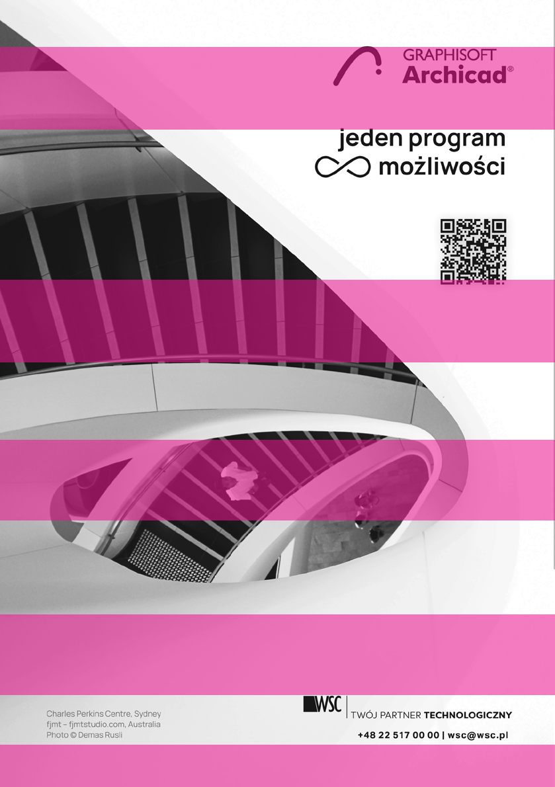
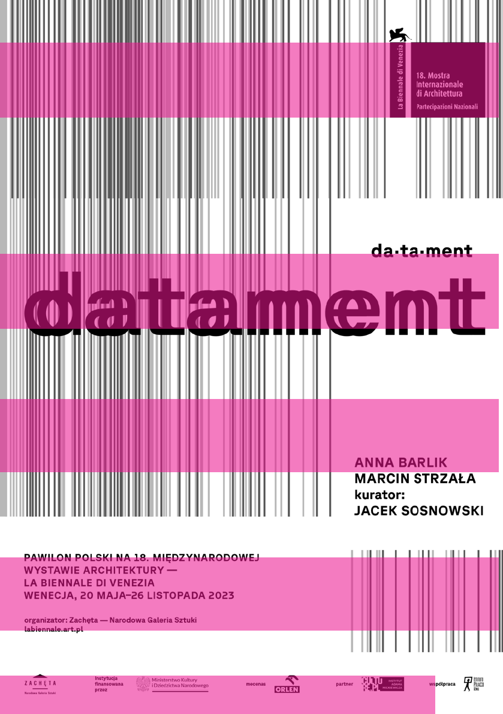
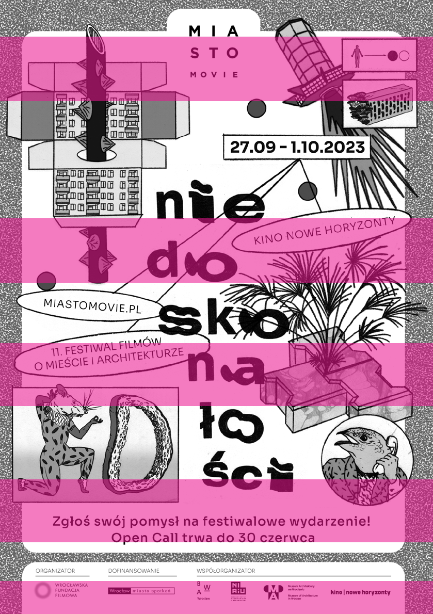
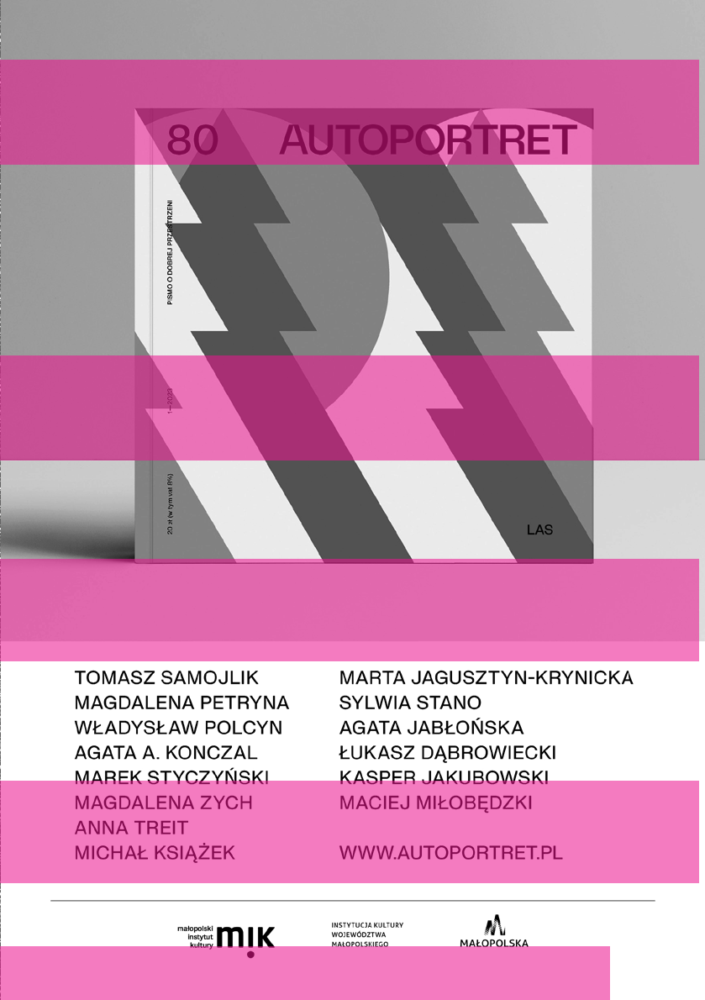

~Rozstanie się z naszymi marzeniami albo wsparcie społeczne to jedno, ale sama przeprowadzka jest ciężką, intensywną i pracochłonną czynnością. Czy jeśli chodzi o względy praktyczne, łatwo wrócić z przedmieść do miasta? Jak wygląda rynek wtórny nieruchomości na takich obszarach, czy da się sprzedać dom i czy jego cena równoważy kupno mieszkania w centrum?

Nie sądzę. Wszystkie dane pokazują, że suburbanizacja cały czas jest dominującym trendem osadniczym w Polsce. Miasta nadal tracą ludność, choć nie wiemy, jaki będzie efekt przyjazdu osób z ogarniętej wojną Ukrainy. Czy zostaną u nas? Czy będą w stanie się zakorzenić i odmienić trajektorie demograficzne miast?

177 — — planowaniewrażliwość

Niestety nie mamy danych, które pozwoliłyby nam oszacować wolę powrotu wśród mieszkańców obszarów podmiejskich. Osoby, które do tej pory ujmowane były w statystykach publicznych dla Polski, głównie wyprowadzają się z miast i osiedlają w gminach podmiejskich. Oczywiście odpowiedź na twoje pytanie zależy także od perspektywy czasowej, którą przyjmiemy. Im bardziej rozwiną się obszary podmiejskie, im więcej osób będzie tam mieszkać, tym większy będzie potencjał ruchu powrotniczego. Suburbia zmieniają się i różnicują. Znajdą się osoby, które nie będą chciały już tam mieszkać, bo nie będzie to miejsce do życia, na które decydowali się ileś lat temu. Czy wybiorą drogę powrotu do miasta, czy może przeciwnie, będą mieli odchowane dzieci, zdalną pracę lub emeryturę i w ramach ruchu kontrurbanizacyjnego wyjadą jeszcze dalej?

To bardzo ważne pytanie, nie jestem w stanie powiedzieć, jak wygląda skala sprzedaży domów podmiejskich, moje badanie jest jakościowe i bardzo punktowe. Nie dysponuję danymi, które mogłyby pozwolić mi mówić o reprezentatywnym ujęciu. Mogę jedynie przekazać, co zdaniem powrotników umożliwiło im wydostanie się z przedmieść. Udawało im się dom sprzedać, ale często nie za tyle, ile w niego włożyli, albo nie za tyle, ile dla nich znaczył. Jedna z osób powiedziała mi, że miała to być dla niej zmiana życiowa, a nie „dobra okazja”. Jeśli dom się nie sprzedawał, opuszczała cenę o 50 tys. i o kolejne 50 tys., dopóki ktoś go nie kupił. Inni szli w stronę najmu, nie pozbywając się domu całkowicie, ale finansując ratę kredytu za mieszkanie albo własny czynsz.

Zdaję sobie sprawę z tego, że są osoby, które chciałyby sprzedać swoje podmiejskie domy, ale nie mogą, bo są zlokalizowane w nieatrakcyjnej okolicy albo mają niekorzystną architekturę. Nadal statystycznie wiele osób przeprowadza się na przedmieścia, ale nie wiem, czy wybiera jedynie świeżo wybudowane inwestycje deweloperskie. Powrotników jest naprawdę niewielu, więc te domy, które wracają na sprzedaż, to pewnie jakiś ułamek rynku. Pozostaje też kwestia tego, czy za cenę takiego domu jest się w stanie kupić coś odpowiedniego w mieście.

~Czy skoro zajęłaś się tematem powrotników, to znaczy, że dostrzegasz taki trend? Czy będzie zwiększać się liczba osób wracających z przedmieść do miast?

A U T O R Z Y

17830 —RZUT+

Weronika Kozak• Absolwentka Politechniki Wrocławskiej, obecnie studiuje na kierunku Architecture and Urban Design na Politecnico di Milano. Odbyła staże w firmach Maćków Pracownia Projektowa oraz Paradigma Ariadné, pracowała m.in. z Miastopracownią i OVO Grąbczewscy Architekci. Współpracuje również z Fundacją Dom Pokoju przy projekcie Inne Centrum. Interesuje ją interdyscyplinarne spojrzenie na architekturę – związane z etnografią, socjologią, sztuką i geografią.

Michał Kowalski • W centrum moich zainteresowań jest człowiek i przestrzeń, którą buduje. Badam krajobraz, jego wykonstruowaną część oraz naturalną oraz ich wzajemne przenikanie się. Jednocześnie interesuje mnie wewnętrzna przestrzeń przeżyć i myśli w każdym z nas. Przyglądam się rodzącym się tam ideom, emocjom, uczuciom, wartościom oraz ich wpływowi na kolektywne doświadczenie. Zadaję pytania, jak funkcjonuje ciałorelacyjność, budowanie więzi i sojuszy oraz ich (re)negocjacje w przestrzeniach zaplanowanych i/lub zbudowanych przez ludzi dla ludzi. W szczególności interesuje mnie podejście inkluzywne, afirmujące różnorodność, złożoność i mozaikowość osób oraz środowiska, z uwzględnieniem wszelkich innych organizmów i zjawisk przyrody. W moich badaniach łączę architekturę i urbanistykę z psychologią, różnorodność, złożoność i mozaikowość osób oraz środowiska, z uwzględnieniem wszelkich innych organizmów i zjawisk przyrody. W moich badaniach łączę architekturę i urbanistykę z psychologią.

Jakub Węgrzynowicz • Absolwent I stopnia studiów architektonicznych na Politechnice Warszawskiej, autor pracy dyplomowej na temat wielogatunkowego współzamieszkiwania, członek inicjatywy Miastozdziczenie działającej przy Fundacji Puszka, autor tekstów w Atlasie Wszystkich Mieszkańców, Magazynie KULT czy Niezbędniku Szkoły Architektury Społeczności, której jest absolwentem, zainteresowany relacjami międzygatunkowymi i związkami przestrzeni fizycznej z ideami posthumanistycznymi.

Artur Brzozowski •Student Wydziału Architektury Politechniki Warszawskiej, choć bardziej fotograf niż architekt. Od lat robi zdjęcia Warszawy i opowiada o jej architekturze w social mediach, a ostatnio także pisze felietony. W wolnych chwilach lubi zwiedzać cmentarze.

Kacper Borek • Architekt, student Wydziału Architektury Politechniki Warszawskiej i Uniwersytetu w Tampere, absolwent Szkoły Architektury Społeczności, redaktor studenckiego czasopisma KONTENER.

179 — — planowanieautorzy

Ania Halek • Absolwentka Architektury Wnętrz na Wydziale Architektury Politechniki Śląskiej w Gliwicach oraz programu Master of Interior Architecture: Research+Design (MIARD), Piet Zwart Institute w Rotterdamie. Doświadczenie zawodowe zdobywała w Polsce i Holandii. Aktywnie działa na pograniczu architektury i kreacji artystycznej. Wystawiała prace w galeriach Huidenclub oraz Roodkapje w Rotterdamie. Jej projekty skupiają się na wnętrzach jako formie percepcji, a głównym tematem jej researchu jest aspekt intymności w przestrzeni.

Ula Prokop •Architektka, urbanistka, absolwentka Wydziału Architektury Politechniki Warszawskiej. Jest współautorką publikacjiAdrichalim(Bęc Zmiana, 2016). Obecnie pracuje nad doktoratem poświęconym historii zabudowy Izraela w kontekście działalności architektów wykształconych na europejskich uczelniach technicznych. Miłośniczka Warszawy, autorka spacerów i wykładów związanych z historią rozwoju miasta, w szczególności skupia się na dziedzictwie Muranowa, którego jest mieszkanką.

Wiktor Martin •Studiuje na Wydziale Architektury PW. Pracował w biurach w Katowicach, Warszawie oraz na Teneryfie. W architekturze i fotografii poszukuje prostoty. Lubi reportaż, codziennie traci dużo czasu przez rytualizację procesu parzenia kawy i herbaty.

Magdalena Krzosek-Hołody •Badaczka i projektantka związana z Uniwersytetem Warszawskim. Specjalizuje się w działaniach edukacyjnych oraz współpracy z instytucjami kultury. Bada historie środowiskowe oraz relacje między sztuką, ekologią i projektowaniem krajobrazu. Na Wydziale 'Artes Liberales’ UW prowadziła m.in. kursy: „Od sztuki ziemi do designu spekulatywnego” oraz „Między naturą a zielono-błękitną infrastrukturą”. Autorka publikacji naukowych, wykładów i warsztatów. Prowadzi interdyscyplinarną pracownię Mikroklimaty.

Jarek Mankiewicz • Absolwent grafiki na Wydziale Artystycznym UMCS w Lublinie. Dyplom z grafiki warsztatowej. Po przeprowadzce do Warszawy pracował m.in. w CANAL+ Cyfrowy/później nc+ w dziale kreacji jako projektant graficzny i animator, następnie freelancer, a od 2018 r. współzałożyciel Studia Animacji Czwarta Rano. Od 2020 roku mieszka i pracuje w Lizbonie. Zajmuje się szeroko pojętym projektowaniem graficznym, animacją, ilustracją i malarstwem, https://www.instagram.com/jarekmankiewicz/.

Dokonaliśmy wszelkich starań, aby skontaktować się z właścicielami praw autorskich publikowanych materiałów. W przypadku zastrzeżeń ze strony któregokolwiek z właścicieli praw prosimy o kontakt z redakcją.

© 2023, Fundacja Elewacja, Warszawa Ilustracje na początku rozdziałów przygotowała Anna Majewska-Karolak – Studiowała architekturę na Wydziale Architektury Politechniki Warszawskiej oraz University of Detroit Mercy. Od 2014 roku związana z warszawską pracownią WXCA. Laureatka wielu konkursów architektonicznych, miłośniczka fotografii. Obecnie studiuje malarstwo na Akademii Sztuk Pięknych w Warszawie. Pismo powstało we współpracy z Wydziałem Architektury Politechniki Warszawskiej Nakład: 1300 egzemplarzy Niniejszy numer powstał we współpracy z Biurem Architektury i Planowania Przestrzennego Urzędu m.st. Warszawy.

Wydawca:

Sponsor:

Dofinansowano ze środków Ministra Kultury i Dziedzictwa Narodowego

Druk: Drukarnia EFEKT Piotrowski sp.j., ul. Podkowy 99c, 04-937 Warszawa

# :PLANOWANIE(1)2023RZUT +33

