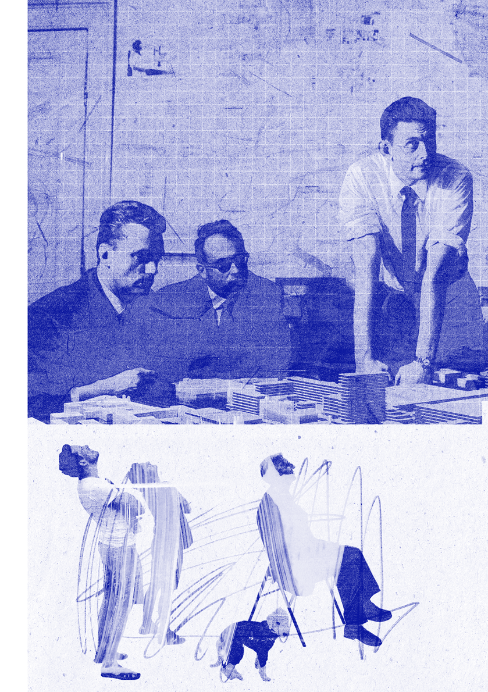

# RZUT x BAL +34

P Ł E Ć

P Ł E Ć

~

Czy w 2023 r. trzeba jeszcze pisać o nierównościach? Zdecydowanie tak, jeżeli wciąż zdarzają się przypadki jak ten, kiedy Izba Architektów Rzeczypospolitej Polskiej za pośrednictwem oficjalnego profilu na mediach społecznościowych tak pisze do architektki Barbary Ziemby:

Nie jest dobrze, ale być może za kilka lat z niedowierzaniem wspominać będziemy tę mijającą już epokę archidziadocenu. Założeniem tego numeru, który powstał we współpracy z BALem architektek, czyli Dominiką Janicką, Barbarą Nawrocką i Dominiką Wilczyńską, nie jest kreowanie programu politycznego czy prowokowanie kontrowersji, ale poszerzenie wrażliwości na otaczającą nas niesprawiedliwość i obojętność. Pytacie w listach, czy to jeszcze jest architektura. Odpowiadamy w treści wywiadów i artykułów •

~ Milena Trzcińska, Łukasz Stępnik

To nie jest numer kobiecy. Ani numer tylko dla kobiet. Hasło PŁEĆ wskazuje raczej na przywileje i wykluczenie w architekturze zarówno w zawodzie, jak i w przestrzeni zbudowanej. Przenika się ono intersekcjonalnie z innymi hasłami, takimi jak klasa społeczna, wiek, orientacja czy tożsamość seksualna.

W każdą przestrzeń zbudowaną wdrukowane są relacje siły i władzy, wpływy współczesnych systemów gospodarczych i politycznych. W naszych nowoczesnych społeczeństwach planowanie miast i stref funkcjonalnych wciąż utrwala kulturowe podziały ról płciowych. Faworyzując nuklearny model rodziny, spycha prace opiekuńcze i związane z nią sposoby korzystania z przestrzeni do strefy prywatnej lub mniej eksponowanej na dalekie przedmieścia czy mniej wygodne połączenia komunikacyjne.

architektoniczna) wydała szereg rekomendacji, które mogłyby niwelować nierówności płci w zawodzie. Było wśród nich zapewnienie większej widoczności architektek i ich obecności w konkursowych składach jurorskich.

Po dwudziestu latach sytuacja nie wydaje się rozwiązana.

Możemy oczywiście odmieniać feminatywy przez wszystkie przypadki, ćwiczyć dykcję przy wymawianiu ktka-ktką-ktce (prosimy czytać to na głos) i zmienić nazwy ulic tak, aby upamiętniać wyłącznie heroiny, ale strefa symboliczna, zarówno w języku, jak i w przestrzeni, jeśli występuje sama, stanie się jedynie purplewashingiem,czyli strategią marketingową podszywającą się pod zaangażowanie na rzecz równości płci.

Ten sam system sprawia, że przestrzeniami społeczności LGBTQ+ są w miastach pojedyncze wyspy i rzadko rozsiane enklawy, a kiedy tęczowa rzeźba przypadkiem znajduje swoje miejsce w bardzo eksponowanym miejscu, generuje zaostrzone konflikty, falę agresji i serię działań mających na celu symboliczne przejmowanie przestrzeni to przez jedną, to przez drugą grupę.

Profesja architektoniczna wciąż obarczona jest wieloma stereotypami. Do dzisiaj funkcjonuje w niej kult jednego (zwykle męskiego) nazwiska, na które pracują wieloosobowe zespoły. Kwestia płci nie jest tu bez znaczenia, bo choć ostatnio architekturę w Polsce studiują głównie kobiety, to wciąż obijają się one o szklany sufit.

„Ach! To pan jest TYM architektem! O! Pani też jest architektem?” słyszała wielokrotnie Denise Scott Brown na przyjęciach, na które chodziła z mężem. W swoim eseju The Room at the Top? Sexism and Star System in Architecturewspominała te i wiele innych przykładów całkowitego pomijania zasług żony w sukcesach architektonicznego małżeństwa.

Inkluzywne projektowanie, mające swe oparcie w intersekcjonalnym feminizmie, obejmuje zwrócenie uwagi na potrzeby ciała w przestrzeni zbudowanej, potrzeby związane z wykonywaniem pracy reprodukcyjnej, tworzenie systemów wspierania rodziców powracających na rynek pracy czy troskę o różnorodność wszystkich grup wykluczonych, z naturą włącznie. Nie ma na to jednej recepty projektowej, wspólnej dla każdej szerokości geograficznej i systemu politycznego, bo inkluzywność zaprzecza normatywom i neufertowskiemu rozumieniu świata.

No, ale dosyć tego poważnego tonu. Przecież to BAL!

Ten numer Rzutu potraktujcie jako wejściówkę na naszą imprezę! I po przeczytaniu przekażcie ją dalej, najlepiej najbardziej archidziaderskiej osobie w otoczeniu.

Miłej lektury pod ciepłym kocykiem w jesienny wieczór!

~ Wasz BAL

W obliczu niewątpliwego istnienia efektu szklanego sufitu w 2003 r. RIBA (brytyjska izba

5 — — płećwstępniak

