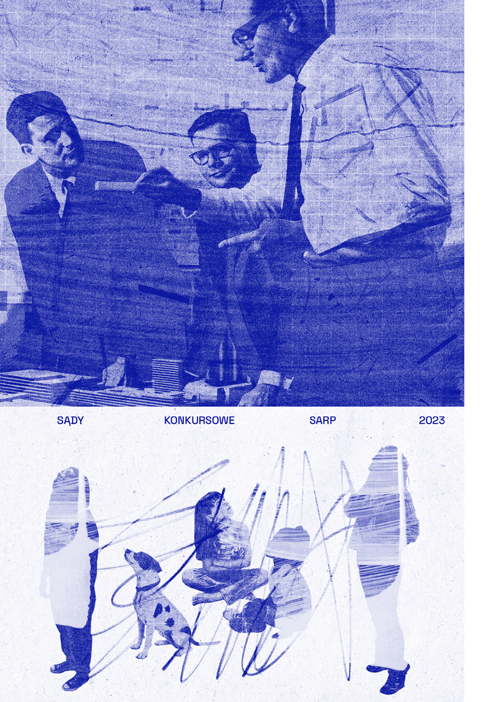
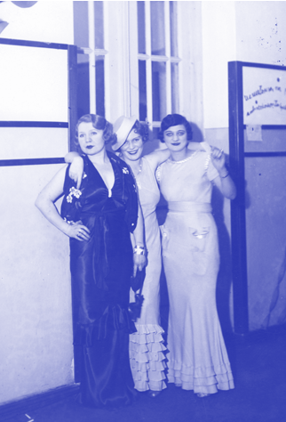
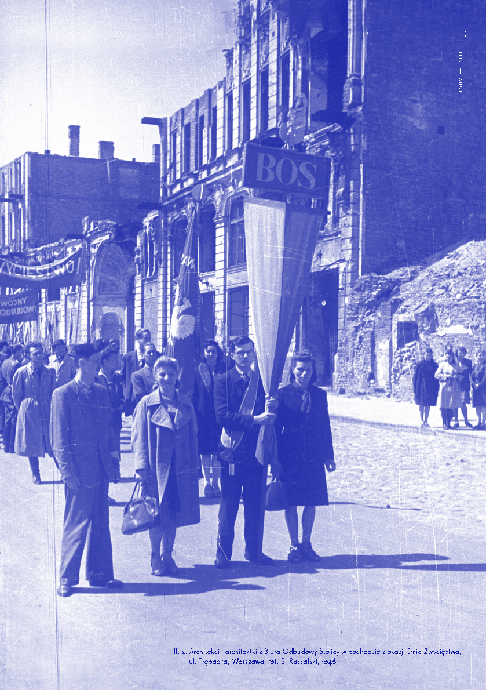
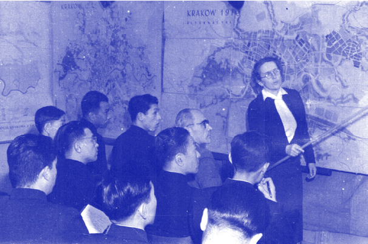
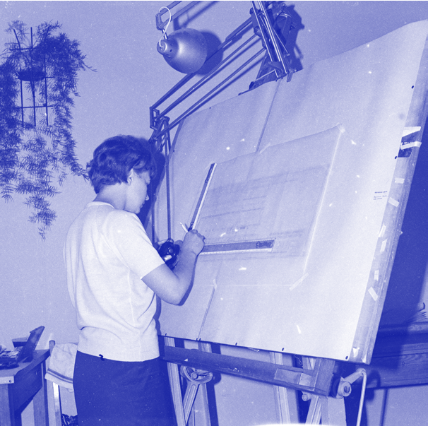

### 100 LAT ARCHITEKTEK

ARCHITEKTURA I „KWESTIA KOBIECA”1

J OA N N A M A J C Z Y K , AG N I E S Z K A TO M A S Z E W I C Z

# ~

Te, które się nie ugięły i nie zniechęciły w czasie studiów, ale politechnikę skończyły i pracują w swoim zawodzie, stanowią element ideowy i stoją na wysokim poziomie etycznym. Zahartowane w pracy wkładają w nią maksimum wysiłku i wytrwałości. Jeżeli chodzi o zdolności, to nie ustępują bynajmniej mężczyznom2.

~ Barbara Brukalska

Jedno z najbardziej mizoginistycznych pytań, jakie wciąż jeszcze można usłyszeć w (głównie konserwatywnych) mediach, brzmi: „dlaczego nigdy w historii nie było wielkich architektek?”. Dyskusje na ten temat, zwykle prowadzone przez mężczyzn, kończą się najczęściej stwierdzeniem, że „kobiety nie chciały być inżynierami”,

- 1 Fraza stosowana w przedwojennej publicystyce emancypacyjnej, por. Chcemy całego życia. Antologia polskich tekstów feministycznych z lat 1870–1939, zebrała A. Górnicka-Boratyńska, Warszawa 2018.
- 2 W. Sawicka, Praca kobiet w architekturze, „Bluszcz. Społeczno-literacki ilustrowany tygodnik kobiecy” 1938, nr 27, s. 52.

a w wersji bardziej oświeconej – „kobiety wolały wybierać inne zawody”. Wszyscy, którzy choć trochę znają historię, wiedzą, że to nieprawda. Nawet w tak pozornie równościowej instytucji, jaką był Bauhaus, studentkom oferowano głównie kursy tkackie i ceramiczne, by wkrótce ograniczyć ich przyjęcia do kobiet, które wykazywały – jak to ujął Walter Gropius – „niezwykłe talenty”3. Od mężczyzn „niezwykłych talentów” nie wymagano.

Historia polskich architektoniczekrozpoczęła się 101 lat temu, kiedy Wydział Architektury Politechniki Warszawskiej ukończyły dwie pierwsze kobiety – Jadwiga Dobrzyńska (1898–1940) i Wanda Wierzbicka-Nettowa (1892–1975). Pierwsza z nich jako laureatka wielu konkursów i czynna projektantka zyskała status ikony, pionierki na rodzimym rynku zawodowym, tymczasem druga jest dziś postacią zapomnianą. Sukcesy zawodowe Jadwigi

3 U. Müller, Bauhaus-Frauen. Meisterinnen in Kunst, Handwerk und Design, München 2009, s. 12.

Il. 1. Uczestniczki Balu Młodej Architektury, Warszawa, 1939

Dobrzyńskiej, „chodzącej encyklopedii swojego zawodu” i „człowieka żelaznej pracy”4, potraktować można raczej jako wyjątek niż reprezentację przeciętnej kariery XX-wiecznej architektki. Zdecydowana większość nie mogła i nie osiągnęła profesjonalnej samodzielności lub równoprawnej pozycji w duetach/zespołach projektowych. Pokolenie pionierek utorowało jednak drogę swoim następczyniom, pokonując stereotypy, nieufność inwestorów wobec kobiet-inżynierów i wyzysk finansowy. Aby w pełni zrozumieć dzisiejszą sytuację zawodową kobiet w branży architektonicznej, warto zarysować realia tamtych czasów, zadać pytanie o nierozwiązane problemy i przyjrzeć się procesowi feminizacji zawodu. Obecnie absolwentki kierunków architektonicznych przewyższają liczbę absolwentów, co jednak nadal nie znajduje odzwierciedlenia na rynku zawodowym.

4 N.J., O jednej architektce, „Bluszcz. Społeczno-literacki ilustrowany tygodnik kobiecy” 1931, nr 28, s. 11.

#### * * *

„Od roku naukowego 1919/20 począwszy, kobiety ubiegające się o przyjęcie na słuchaczki zwyczajne mogą być zapisywane w tym charakterze” – tym jednym zdaniem, opublikowanym w rozporządzeniu z 8 października 1919 r., minister Wyznań Religijnych i Oświecenia Publicznego otworzył możliwość studiowania na Politechnice Lwowskiej młodym adeptkom architektury. Politechnika Warszawska prowadziła wówczas już czwarty rok studiów architektonicznych, do udziału w których „zaproszono” również żeńską część społeczeństwa. W 1922 r. dwie pierwsze kobiety odebrały w Polsce dyplomy architektek, na świecie zaś zapoczątkowano dyskusję

- o miejscu i roli kobiet w zawodzie. Pokazał to program X Międzynarodowego Kongresu Architektów, który odbył się we wrześniu tego właśnie roku w Brukseli. Wśród tematów obrad dotyczących takich spraw, jak: planowanie miast, tanie mieszkania,
- ochrona zabytków czy obowiązki i prawa architektów, znalazł się też punkt zatytułowany „kobieta-architekt”. W polskiej prasie branżowej nie sposób znaleźć nawet

W 1922 R. DWIE PIERWSZE KOBIETY

ODEBRAŁY W POLSCE DYPLOMY ARCHITEKTEK, NA ŚWIECIE ZAŚ ZAPOCZĄTKOWANO DYSKUSJĘ

O MIEJSCU I ROLI KOBIET W ZAWODZIE

## 9 — — płećwidzieć wzmianki na temat prowadzonych wówczas dysput, jednak współczesne badaczki odnalazły sprawozdanie hiszpańskiego delegata na zjazd, który napisał, że nie uzgodniono żadnych realnych rozwiązań, uznając przy tym, że „nie jest konieczne oficjalne uznanie kobiety-architekta”5. Co ciekawe, takie „uznanie” wprowadzono

5 J. Hervás J., S. Blanco-Agüeira, Women Architects outside the Spanish Borders: Patriarchal Models at International Congresses (1939–1975), „Arts” 2020, vol. 9, no. 26, s. 2.

1034 —RZUT+

w projekcie statutu polskiej Izby Architektów, przygotowanym w 1922 r. przez członków Komitetu Wykonawczego I Zjazdu Architektów Polskich w Warszawie, w którym zapisano, że „architektem może zostać obywatel Państwa Polskiego bez różnicy płci”. Mimo że Izba Architektów nie została powołana do życia przed wybuchem II wojny światowej, to jednak trzeba odnotować jej „równościowy” charakter, szczególnie w sytuacji obecności na rynku pracy dwóch architektek.

Do wybuchu II wojny światowej studia na Wydziale Architektonicznym Politechniki Lwowskiej ukończyły 23, a Wydział Architektury Politechniki Warszawskiej 94 kobiety (odpowiednio 6,5% oraz 14% wszystkich absolwentów/tek)6. Obecność kobiet na wyższych uczelniach technicznych – choć budząca kontrowersje – została z czasem doceniona. W 1939 r. prof. Kazimierz Bartel, wieloletni akademik prowadzący kursy geometrii wykreślnej na WA PL, oceniał, że

[...] przygotowanie u kobiet jest procentowo lepsze, aniżeli u mężczyzn. Są one też w czasie studiów, w którym podpadają pod moją obserwację – pilniejsze, bardziej pracowite i na ogół inteligentniejsze7.

Ten pozytywny obraz nie znajdował jednak odzwierciedlenia w dalszych losach zawodowych absolwentek architektury. W 1939 r. wśród 59 członkiń warszawskiego oddziału Stowarzyszenia Architektów Rzeczpospolitej Polskiej (SARP) zaledwie cztery deklarowały „pracę samodzielną” jako wyłączną podstawę aktywności zawodowej (były to dobrze dziś znane: Barbara Brukalska, Helena Syrkus, Anna Ptaszycka

- 6 W opracowaniu statystyk posługiwano się: dostępnymi publikacjami Politechnik Warszawskiej i Lwowskiej z lat 1918–1939 oraz Politechniki Wrocławskiej z okresu po 1945 r., rocznikami statystycznymi z lat 1958–1982, danymi za rok 1939 udostępnionymi przez Stowarzyszenie Architektów Polskich oraz wydanymi drukiem opracowaniami poświęconymi pracowni Miastoprojekt Wrocław.
- 7 Sen. Prof. dr Kazimierz Bartel o studiach akademickich i szkołach technicznych, „Technik Polski” 1939, nr 3/4, s. 32.

i Jadwiga Tittenbrun-Ostrowska). Zdecydowana większość miała doświadczenie w pracowniach prywatnych architektów dyplomowanych (71,7%) i w pracy administracyjnej (56,6%), które próbowała łączyć z elementami praktyki samodzielnej (49%). Jedna dziesiąta architektek nie miała innego doświadczenia niż urzędnicze, które w oczach współczesnych postrzegane było jako degradacja zawodowa8. Niemal 19% architektek terminowało także w przedsiębiorstwach budowlanych, a jedynie 5,6% miało praktykę w dydaktyce. Warto wspomnieć, że uczelnie nie otworzyły przed nimi realnej możliwości zatrudnienia, próżno zatem szukać architektek wśród wykładowczyń obu politechnik. Podobnie sytuacja rysowała się w założonym w 1934 r. SARP-ie, wówczas jedynym znaczącym stowarzyszeniu branżowym w Polsce. W zarządzie głównym organizacji oraz we władzach oddziałów lokalnych (Warszawa, Kraków, Łódź, Lwów, Wilno, Częstochowa, Gdynia, Kielce, Katowice, Lublin, Poznań, Toruń, Łuck) „szklanym sufitem” okazały się stanowiska sekretarki lub skarbniczki, pełnione zresztą przez garstkę kobiet, podczas gdy funkcje prezesów i wiceprezesów zarezerwowane były wyłącznie dla kolegów-architektów.

Z czym mierzyły się pionierki zawodu w Polsce? Brukalska wspominała o braku właściwych warunków do rozwoju, ostracyzmie na uczelniach („bywało, że korporacyjna młodzież narodowa wystawiała kobietom rajsbrety z pracowni”9), wyzysku finansowym („są tacy, którzy sądzą, że kobietom można, czy należy nawet mniej płacić”10), braku zaufania inwestorów i współpracowników oraz stawianiu nieproporcjonalnie wyższych wymagań. W skrajnych przypadkach dochodziło do

- 8 R. Piotrowski, 1926 [w:] Stulecie stowarzyszeniowej działalności architektów polskich: 1877–1977, red. T. Barucki, S. Pietraszek, Warszawa 1977, s. 369.
- 9 M.P., Ciernista droga zawodowej pracy kobiet. Głos lekarki i architektki, „Kurjer Poranny” 1933, nr 138, s. 4.
- 10 Tamże.

11 — — płećwidzieć

Il. 2. Architekci i architektki z Biura Odbudowy Stolicy w pochodzie z okazji Dnia Zwycięstwa, ul. Trębacka, Warszawa, fot. S. Rassalski, 1946

1234 —RZUT+

- Il. 3. Anna Ptaszycka podczas prezentacji perspektywicznego planu zagospodarowania Krakowa, lata 50. XX w.
- Il. 4. Architektka ze Stołecznego Biura Dokumentacji Technicznej Przemysłu Terenowego w czasie pracy,

fot. G. Rutkowska, 1969

przemocy, a jej udokumentowaną ofiarą była arch. Stanisława Manikowska (1907– 1939), pracowniczka Oddziału Regulacji Miasta łódzkiego magistratu. W dramatycznym liście ukazującym przyczyny jej rezygnacji z pracy pisała:

[...] usiłowano z całą bezwzględnością i złą wolą doprowadzić mnie prześladowaniem do choroby umysłowej – w rezultacie czego wpadłam istotnie w ciężki i przewlekły rozstrój nerwowy, którego pozostałości psychiczne mogą w ogóle nie być uleczalne. [...] nie mając sił ani zdrowia do dalszej pracy i walki o sprawiedliwość – tylko ten mój list pozostanie smutnym dokumentem w aktach Zarządu Miasta Łodzi, świadczącym, że nie została naprawiona krzywda, ani nie została ukarana zbrodnia dokonywana świadomie na terenie pracy i w oczach innych pracowników, i że nawet nie znalazł się ani jeden człowiek, któryby przeciwko niej ośmielił się wystąpić i zaprotestować11.

Architektki zmagały się również ze stereotypizacją, związaną głównie z domniemanymi „wrodzonymi” cechami kobiecymi (brak zdolności/możliwości pracy inżynierskiej/budowlanej, szczególna predylekcja do dekoracji wnętrz i projektowania przestrzeni mieszkalnych, podejmowanie pracy zawodowej jako „kaprys szukającej wrażeń kobiety”12) oraz powszechnym wówczas obrazem podrzędnej roli kobiety w małżeństwie „architektonicznym”

(Laik, zwłaszcza trochę uprzedzony, mógłby łatwo pomyśleć: cóż wielkiego, to pewno mąż wszystko robi13)

Szansą dla osiągnięcia sukcesu zawodowego były otwarte konkursy architektoniczne, które pozwalały na równą i anonimową rywalizację. Mimo niesprzyjających

- 11 Pismo arch. Stanisławy Manikowskiej do Wydziału Technicznego Zarządu Miejskiego w Łodzi na ręce Pana Naczelnika Wydziału, Warszawa, dn. 6 listopada 1938 r., ze zbiorów Archiwum Państwowego w Łodzi.
- 12 Sławny architekt-kobieta-Polka. Wywiad z p. Gorską w Paryżu, „ABC” 1933, nr 171, s. 3.
- 13 N.J., O jednej architektce…, dz. cyt.

okoliczności architektki były współtwórczyniami awangardowego środowiska branżowego, skupiającego artystów/tki i inżynierów/rki o zapatrywaniach progresywnych i lewicujących. Do dziś ikonami tego ruchu pozostają wspomniane Barbara Brukalska i Helena Syrkus, Anatolia Piotrowska i Adrianna Górska, która największe sukcesy osiągnęła w latach 20. i 30. XX w. w Paryżu.

* * *

Po zakończeniu II wojny światowej sytuacja polskich architektek uległa pewnej poprawie. Zrujnowane wojną miasta wymagały zaangażowania wszystkich projektantów, niezależnie od ich płci, a deklaratywne równouprawnienie kobiet było jednym z postulatów socjalizmu, który narzucono krajom zależnym politycznie i gospodarczo od Związku Radzieckiego. Tuż po wojnie wprowadzono w Polsce gospodarkę planową i we wszystkich gałęziach gospodarczych, w tym również w budownictwie, państwo stało się inicjatorem, wykonawcą i odbiorcą przedsięwzięć inwestycyjnych. W związku z tym w 1949 r. utworzono państwowe biura projektowe, które zastąpiły pracownie własne architektów/ tek. Wtłoczenie wszystkich projektantów w ramy systemu państwowego znacząco ograniczyło ich niezależność, zwolniło ich jednak z konieczności zabiegania o zlecenia, co z kolei ułatwiło architektkom uprawianie zawodu.

Kobiety wykorzystały również możliwość kontynuacji edukacji na uczelniach wyższych. Dla przykładu Wydział Architektury Politechniki Wrocławskiej od pierwszego roku funkcjonowania (1948 r.) przyjmował na równi studentki i studentów, a liczba absolwentek stale rosła. Do wybuchu stanu wojennego w Polsce (1981 r.) WA PWr ukończyło ponad 700 architektek, co stanowiło około 40% liczby wszystkich absolwentów. W 1971 r. (52 lata temu!) nastąpił przełom – liczba kobiet kończących Wydział Architektury PWr

## 13 — — płećwidzieć

## 1434 —RZUT+

przekroczyła liczbę mężczyzn i trend ten utrzymuje się do dziś14.

Stała, narastająca feminizacja zawodu nie otworzyła jednak architektkom drogi do kariery akademickiej. W okresie 1948–1989 ani jedna kobieta nie pełniła funkcji dziekanki lub prodziekanki WA PWr, żadna nie piastowała też stanowiska kierowniczki katedry lub instytutu.

DO WYBUCHU STANU WOJENNEGO W POLSCE (1981 R.) WA PWR UKOŃCZYŁO PONAD 700 ARCHITEKTEK, CO STANOWIŁO OKOŁO 40% LICZBY WSZYSTKICH ABSOLWENTÓW. W 1971 R. (52 LATA TEMU!) NASTĄPIŁ PRZEŁOM – LICZBA KOBIET KOŃCZĄCYCH WYDZIAŁ ARCHITEKTURY PWR PRZEKROCZYŁA LICZBĘ MĘŻCZYZN I TREND TEN UTRZYMUJE SIĘ DO DZIŚ

Pierwszą architektką, która zasiadła we władzach wrocławskiego wydziału, była prof. Elżbieta Trocka-Leszczyńska (od 1993 r. prodziekanka, a następnie wieloletnia dziekanka WA PWr), a na pierwszą profesorkę czekano aż do 1996 r., kiedy stopień ten otrzymała Barbara Stępniewska-Janowska (1931–2019)15. Dominacja liczebna kobiet znalazła jednak odbicie w strukturze zatrudnienia w państwowych pracowniach projektowych. We wrocławskim Miastoprojekcie w 1989 r. pracowały 294 kobiety (59% ogółu), z czego 43% miało wyższe wykształcenie i zajmowało stanowiska specjalistyczne. Mimo to w okresie 1948–1981 ani jedna nie pełniła roli dyrektorki (funkcję tę sprawowało 12 mężczyzn), żadna też nie została naczelną inżynierką

- 14 Więcej: A. Tomaszewicz, J. Majczyk, Pioneers. Polish modernist female architects. The centre and peripheries, Modern Design: Social Commitment & Quality of Life, Docomomo International, València 2022, s. 633–643.
- 15 Zupełnie inaczej kształtował się obraz Wydziału Architektury Politechniki Warszawskiej, na którym już w 1948 r. Barbara Brukalska otrzymała nominację profesorską.

(8 mężczyzn). Nieliczne, w tym Jadwiga Grabowska-Hawrylak (1920–2018), sprawowały funkcje kierowniczek małych zespołów projektowych. Nieco lepiej wyglądała sytuacja kobiet w strukturach Stowarzyszenia Architektów Polskich16. W ciągu pierwszych trzydziestu lat funkcjonowania wrocławskiego oddziału SARP we władzach zarządu zasiadło 11 kobiet (wobec około setki mężczyzn): dwie jako wiceprezeski (przez osiem lat), jedna jako sekretarz (przez rok), dwie jako skarbniczki (przez trzy lata), sześć jako członkinie zarządu (13 lat). Przez 11 lat (siedem kadencji) w zarządzie oddziału nie było jednak żadnej reprezentantki kobiet-architektek.

#### * * *

Jesteśmy obecnie świadkami/kiniami wzmożenia działań ruchów społecznych, zabiegających o równość kobiet i mężczyzn w sferze prywatnej i zawodowej. Na rynku architektonicznym szklany sufit zaczyna się uchylać. Pracami nad rozwojem Warszawy kieruje Architektka Miasta, SARP-em zarządza Prezeska, a Dziekanki na czele lokalnych szkół architektury nikogo już nie dziwią. Czy spełnił się zatem stuletni sen architektoniczek o równouprawnieniu zawodowym?

Sielankowy obraz zaciemniają twarde dane. Liczebna dominacja architektek na rynku zawodowym nie znajduje odzwierciedlenia w uśrednionej pozycji kobiet w branży. Wśród członków i członkiń Izby Architektów RP, a zatem osób mających uprawnienia budowlane, pozwalające na samodzielne uprawianie zawodu, architektki stanowią wciąż mniejszość (około 45%)17. Parytety nie obowiązują przy obsadzaniu sądów konkursowych, czego najlepszym przykładem jest głośny konkurs SARP na projekt odbudowy Pałacu Saskiego w Warszawie (proporcja

- 16 Skróconą nazwę przyjęto w 1952 r. i obowiązuje do dziś.
- 17 https://uprawnieniabudowlane.pl/statystyki-i-liczebnosc-iarp/ (data dostępu: 26.05.2023).

