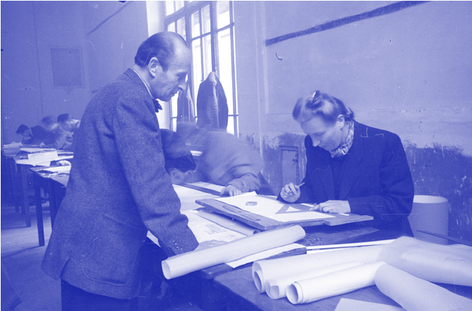
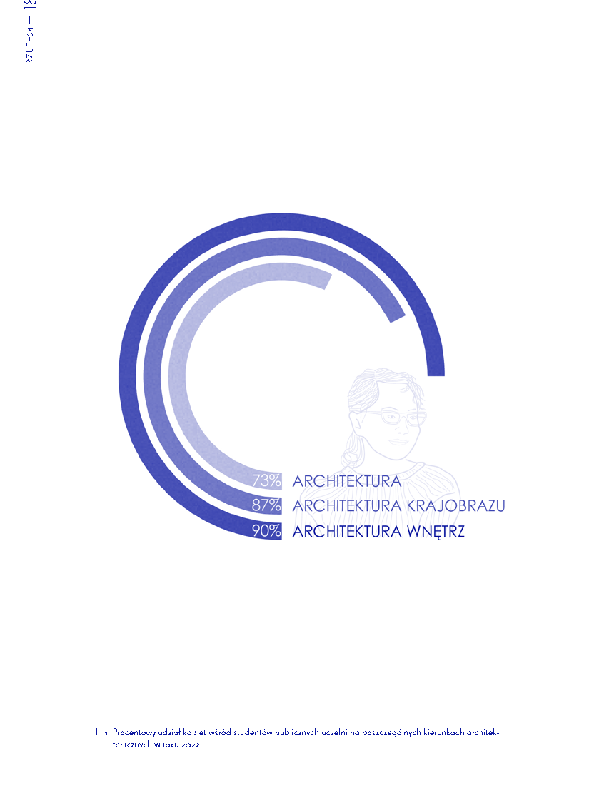
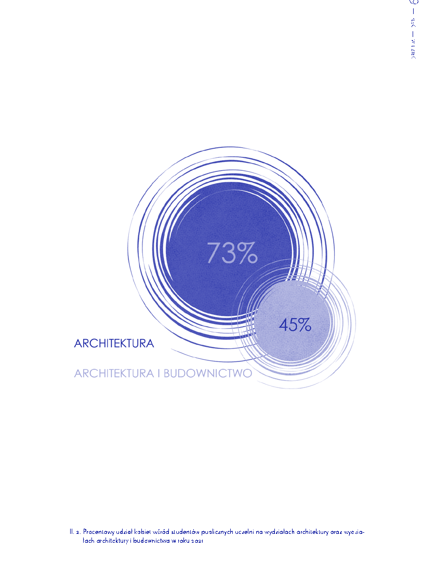
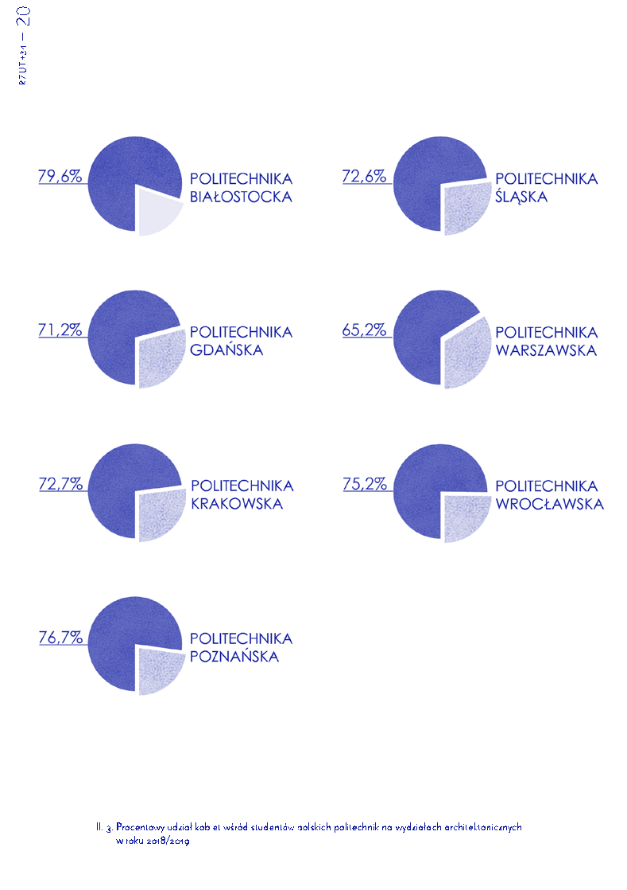
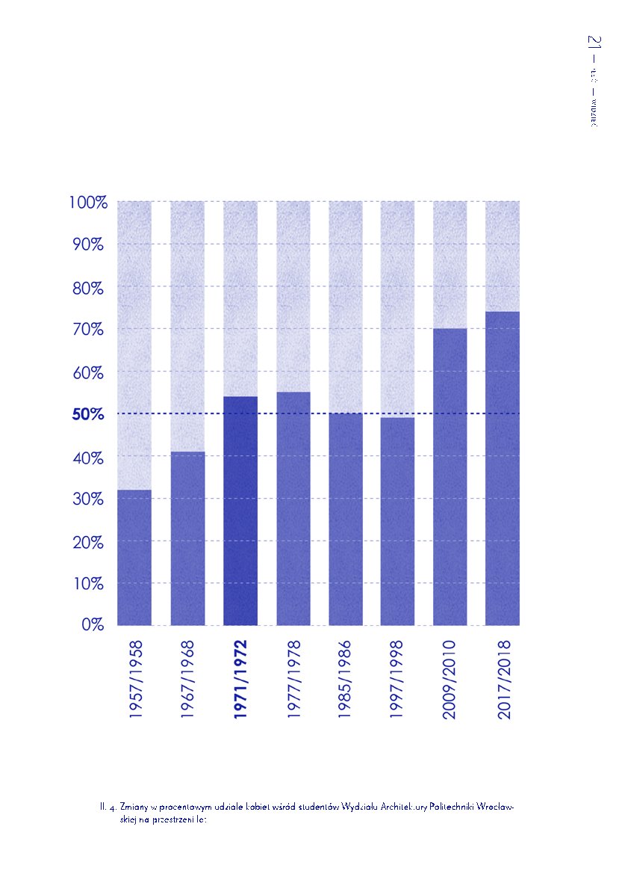
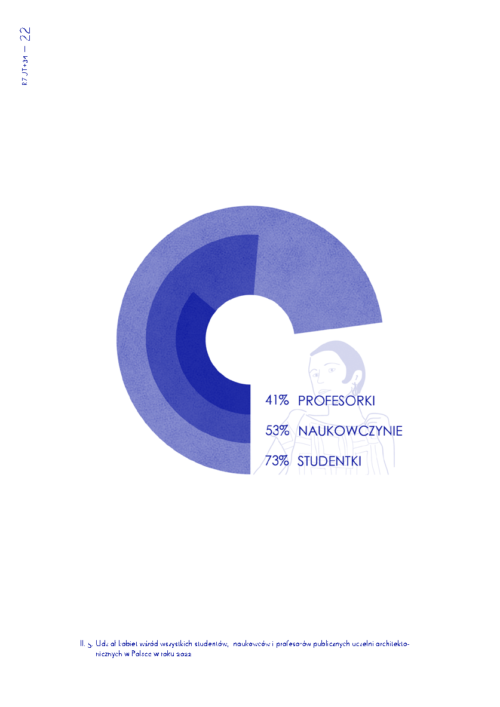
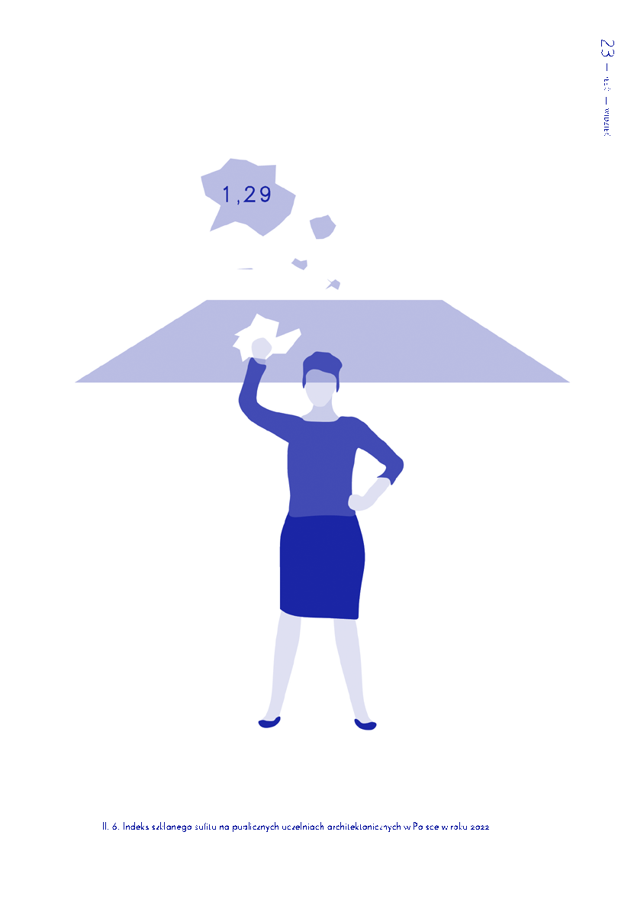
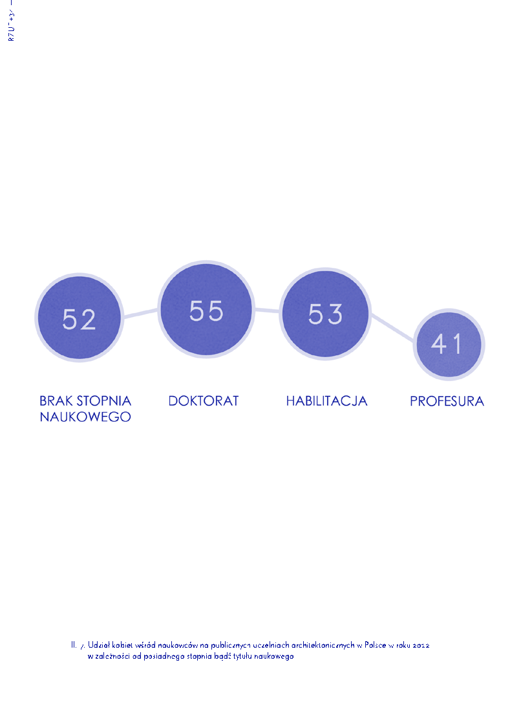

Il. 5. Studentka w czasie egzaminu półdyplomowego na Wydziale Architektury Politechnice Warszawskiej, fot. S. Rassalski, 1947

kobiet do mężczyzn wynosi 2:10)18. Wreszcie odbiciem ogólnej marginalizacji architektek w życiu zawodowym jest nikła reprezentacja twórczyń wśród laureatek najważniejszych nagród branżowych. W ciągu ostatnich niemal sześciu dekad (1966–2023) Honorową Nagrodę SARP przyznano zaledwie sześciu kobietom (wobec 68 mężczyzn), w tym trzem samodzielnie (1974 – Jadwiga Grabowska-Hawrylak, 1978 – Halina Skibniewska, 2021 – Ewa Kuryłowicz) oraz trzem wraz z mężami, w uznaniu ich wspólnej pracy zawodowej (1982 – Hanna Adamczewska Wejchert z Kazimierzem Wejchertem, 1987 – Małgorzata Handzelewicz-Wacławek ze Zbigniewem Wacławkiem, 2014 – Małgorzata Pizio-Domicz z Antonim Domiczem). Ewa Kuryłowicz wyróżnienie własnej działalności twórczej potraktowała „jako wyraz uznania dla kobiet architektek”. Odbierając nagrodę, przypomniała, że „nie ma możliwości cofnięcia procesu

18 https://architektura.muratorplus.pl/wydarzenia/ stowarzyszenie-architektow-polskich-przeprowadzi-

-konkurs-na-palac-saski-aa-i4TF-Ezmv-7KoQ.html (data dostępu: 26.05.2023).

pełnoprawnego udziału kobiet w życiu publicznym jako samodzielnych i wolnych w każdym aspekcie członkiń nowoczesnego społeczeństwa”19. Proces wyrównywania szans i praw kobiet wciąż jednak trwa, a żeby osiągnąć równouprawnienie płci, ze słownika codzienności musi zniknąć co najmniej kilka pojęć, w tym: luka płacowa, seksizm i wykluczenie. Jest wiele do zrobienia, w końcu Polska nieprzypadkowo została sklasyfikowana w 2022 r. na 21. miejscu w Unii Europejskiej pod względem wartości wskaźnika równości płci20 •

- 19 https://www.designalive.pl/ewa-kurylowicz-laureatka-honorowej-nagrody-sarp-2021/ (data dostępu: 26.05.2023).
- 20 https://eige.europa.eu/sites/default/files/the_index_press_release_final_pl.pdf (data dostępu: 29.05.2023).

15 — — płećwidzieć

ARCHITEKTKI NA UCZELNIACH

A L EK S A N D R A G R YC

# ~

Mamy rok 2023. Rok temu minęło sto lat, od kiedy pierwsza kobieta zdobyła dyplom w dziedzinie architektury na polskiej uczelni. Dopiero teraz, po wielu latach starań kobiecie wykonującej zawód architekta udaje się połączyć w profesjonalnym świecie ze swoją płcią i może wreszcie nazywać się architektką. Ta kobieta wie, że na studiach było więcej dziewczyn niż chłopaków, prawdopodobnie w pracy ma więcej koleżanek niż kolegów, ale ciągle jeszcze zdarza jej się słyszeć, że studia techniczne nie są dla kobiet, a architektka jest mniej profesjonalna od architekta. Może nawet wdaje się w dyskusje o rzeczonym profesjonalizmie i próbuje przekonywać, że w swoim technicznym zawodzie otoczona jest głównie kobietami, ale wszystko to przecież dowody anegdotyczne, sumy własnych doświadczeń. Dyskutować można bez końca, ale czasem przyjemnie odwołać się do argumentów, z którymi dyskutować trudno – faktów, badań i danych statystycznych. A te z kolei, używając procentów i indeksów zamiast farb, malują dość wyraźny obraz.

Na kolejnych stronach zebrałam i zilustrowałam dane liczbowe dotyczące obecności kobiet na polskich publicznych uczelniach technicznych. Analiza oparta jest na wydawanych co roku raportach „Kobiety na Politechnikach” oraz danych pochodzących z Ośrodka Przetwarzania Informacji – Państwowego Instytutu Badawczego wspomaganych danymi z systemu RAD-on.

W badaniach uwzględniono podział na dwie płcie – kobiety i mężczyzn. Chciałam zaznaczyć, że nie było moją intencją pominięcie osób nieczujących przynależności do żadnej z tych dwóch grup, a raczej, że podział ten jest efektem ograniczenia, przed jakim przyszło mi stanąć w obliczu dostępnych danych.

Procentowy udział studentek wśród wszystkich osób studiujących na uczelniach technicznych w Polsce wynosi 35%. O równowadze płci mówimy, kiedy proporcje między kobietami a mężczyznami znajdują się w przedziale 40–60%. Na wydziałach architektonicznych od ponad 10 lat kobiety stanowią 70% wszystkich studentów, podczas gdy na wydziałach architektury wnętrz w 2022 r. mówimy już aż o 90%. Te dane pokazują, jak daleko większym zainteresowaniem cieszy się architektura wśród dziewczyn niż chłopaków szukających swojej ścieżki kariery. Natychmiast nasuwa się więc pytanie: „co dalej?”. Czy architektki po studiach zostają na uczelniach i znajdują tam dla siebie miejsce?

na to py tanie spieszą nam z odpowiedzią dwa indeksy.

Pierwszy z nich to indeks szklanego sufitu (ang.glass ceiling index, GCI), opracowany przez Eurostat – Europejski Urząd Statystyczny. Indeks ten obliczany jest poprzez stosunek udziału kobiet wśród wszystkich nauczycieli akademickich do udziału kobiet wśród nauczycieli akademickich z tytułem profesora. Wynik pokazuje, jaką szansę mają kobiety naukowczyni na otrzymanie tytułu profesorskiego. 1 oznacza równe szansy dla obydwu płci. W roku akademickim 2021/2022 indeks dla publicznych uczelni technicznych wyniósł 1,88, w tym samym roku dla wydziałów architektonicznych mówimy o wyniku 1,29. Jest to najlepszy wynik wśród wszystkich wydziałów. Pokazuje nam to, że z puli technicznych wydziałów w Polsce to właśnie na architekturze kobiety mają najwyższą szansę na osiągnięcie profesury, ciągle jednak nie są one równe z szansami mężczyzn.

Drugim z indeksów jest indeks przepływów. Im dalej w las, tym więcej drzew, a im dalej patrzymy na stopnie naukowej kariery, tym więcej mężczyzn. Charakterystyczne zjawisko „odpływu” kobiet na coraz wyższych szczeblach kariery zyskało miano dziurawego rurociągu (ang. leaky pipeline). Indeks przepływów operuje skalą 0 do 10, w której 0 oznacza brak przepływu kobiet, a 10 zachowanie proporcji między kobietami a mężczyznami.

Wyliczany jest on na podstawie przepływów między kolejnymi stopniami kariery – brakiem stopnia naukowego, doktoratu, habilitacji i wreszcie profesury tytularnej. W 2021 r. dla architektury indeks ten wynosił 8,45, w 2022 mówimy już o 8,84, co daje nadzieję, że idziemy w dobrą stronę.

Podsumowanie zaprezentowanych danych jest bardziej optymistyczne, niż zakładałam, rozpoczynając ich analizę. Sytuacja architektek na uczelni jest jedną z najlepszych w branży technicznej, choć ciągle brakuje jej sporo do idealnej i rzeczywiście równościowej. Pokazuje również, że rozmawianie o roli kobiet przynosi skutki i mamy szansę na przetarcie szlaków dla innych wydziałów na drodze do równości. Dlatego też Panie, Panowie – do roboty •

17 — — płećwidzieć

1834 —RZUT+

Il. 1. Procentowy udział kobiet wśród studentów publicznych uczelni na poszczególnych kierunkach architektonicznych w roku 2022

19 — — płećwidzieć

- Il. 2. Procentowy udział kobiet wśród studentów publicznych uczelni na wydziałach architektury oraz wydziałach architektury i budownictwa w roku 2021

2034 —RZUT+

- Il. 3. Procentowy udział kobiet wśród studentów polskich politechnik na wydziałach architektonicznych w roku 2018/2019

21 — — płećwidzieć

- Il. 4. Zmiany w procentowym udziale kobiet wśród studentów Wydziału Architektury Politechniki Wrocławskiej na przestrzeni lat

2234 —RZUT+

- Il. 5. Udział kobiet wśród wszystkich studentów, naukowców i profesorów publicznych uczelni architektonicznych w Polsce w roku 2022

23 — — płećwidzieć

- Il. 6. Indeks szklanego sufitu na publicznych uczelniach architektonicznych w Polsce w roku 2022

2434 —RZUT+

- Il. 7. Udział kobiet wśród naukowców na publicznych uczelniach architektonicznych w Polsce w roku 2022 w zależności od posiadnego stopnia bądź tytułu naukowego

