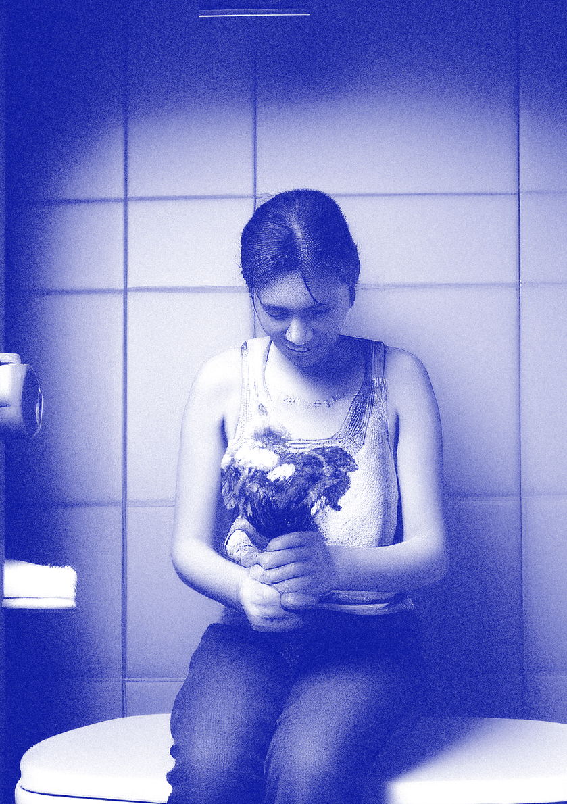
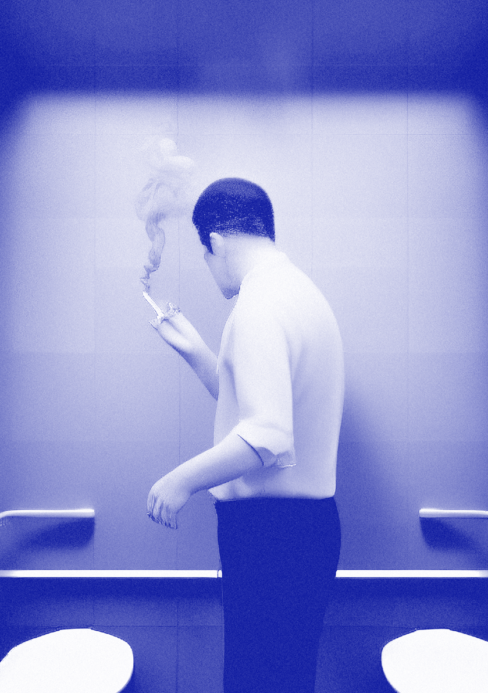
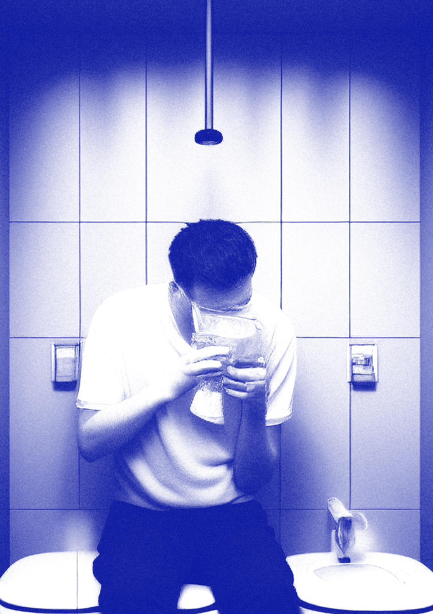
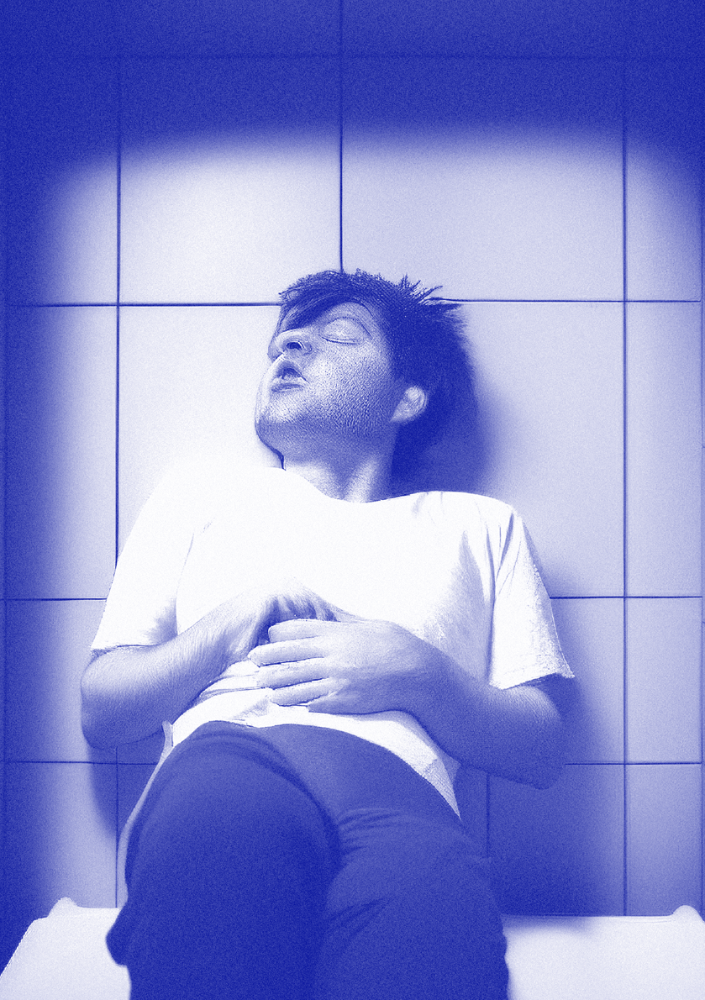

Można byłoby generalizować, że dziewczyny za nim nie przepadają, a tu proszę! My zawsze stawiamy wszystko na jedną kartę. Mamy duszę ryzykantek i lubimy wyzwania. To nas pewnie też połączyło.

B.N.: W naszej historii wątek macierzyństwa też jest bardzo ważny. Ja nie mam dzieci. Wilczyńska jest matką i moment, kiedy nią została, był dla nas przełomowy. Musiałyśmy stworzyć nowy model współpracy. Ona musiała się nauczyć, jak to jest być pracującą matką. Ja musiałam się nauczyć, że koleżanka nie poświęca mi już 100% uwagi.

E.J.: Czyli u was jest to kwestia zrozumienia siebie nawzajem. Nauczyłyście się tego?

B.N.: Wciąż się uczymy (śmiech). To wyzwanie, z którym cały czas się mierzymy, ale też mamy tego świadomość.

- D.W.: To tak, jakby myśleć, że można nauczyć się być matką. Codziennie coś nowego cię zaskakuje. (śmiech)
- E.J.: Pamiętam siebie sprzed posiadania dzieci. Mogłam całą dobę siedzieć i pracować, bo to uwielbiam. A teraz już nie mogę. Macierzyństwo przewraca wszystko do góry nogami.

B.N.: A mnie fascynuje model pracy Janickiej. Nie wiem, czy wiecie, ale mieszkając w dwóch różnych miastach, od dwóch lat współpracujemy ze sobą tylko online. Widziałyśmy się zaledwie kilka razy i dopiero nasz ostatni wyjazd był pierwszą okazją, żeby się lepiej poznać. Okazało się, że Janicka jest bossówą, która wszystko ogarnia. Równolegle jest dyrektorką Instytutu Dizajnu, zarządza zespołem, prowadzi zajęcia na uczelni i robi kilka innych projektów na raz.

D.J.: Ja się po prostu szybko nudzę i muszę mieć wiele bodźców. Cały czas potrzebuję nowych zadań i wyzwań. Od pewnego czasu, żebym wzięła nowe zlecenie, musi mi albo sprawiaćfun, albo dawać hajs. Nie wiem, czy można to nazwać modelem biznesowym, ale działam na trzech filarach. Comiesięczne wynagrodzenie z uczelni i Instytutu Dizajnu daje mi poczucie ekonomicznego bezpieczeństwa, więc w dodatkowych projektach mogę pracować, nad czym chcę, i projektować, co mi się podoba. Daje mi to też energię, więc dzieje się dużo i szybko.

H.G.: Takie są właśnie baby w biznesie! Według najnowszych badań firmy prowadzone przez kobiety nie tylko przetrwały swój pierwszy rok na rynku, ale mają się jeszcze lepiej! Zacytuję badanie McKinsey7, które pokazuje, że firmy z górnego kwartyla pod względem różnorodności płci w zespołach kierowniczych miały o 25% większe szanse na uzyskanie ponadprzeciętnej rentowności niż firmy z najniższej półki. Z kolei z badań przeprowadzonych przez naukowców z uniwersytetów w Glasgow i Leicester8 wynika, że firmy z ponad 30% kobiet na stanowiskach zarządzających osiągały lepsze wyniki niż te z męskim zarządem9. Nie ma wielu badań dotyczących firm prowadzonych przez same kobiety, bo jest ich za mało. Trudno nam porównać kobiece i męskie modele zarządzania, gdyż w każdej firmie, w której pracowałyśmy, szefem był facet. Widziałyśmy i mogłyśmy obserwować, jak to robili mężczyźni, ale nie widziałyśmy, jak kobiety. Może na takie pytanie będzie można znaleźć odpowiedź dopiero za 50 lat?

Wiwat siostrzeństwo!

- 7 https://www.mckinsey.com/featured-insights/diversity-and-inclusion/diversity-wins-how-inclusion-matters (data dostępu: 1.07.2023).
- 8 https://onlinelibrary.wiley.com/doi/full/10.1002/ ijfe.2089 (data dostępu: 6.06.2023).
- 9 https://www.theguardian.com/business/2022/ mar/06/companies-with-female-leaders-outperform-those-dominated-by-men-data-shows (data dostępu: 6.06.2023).

33 — — płećwidzieć

models).Procesy technologiczne, które wygenerowały tę serię obrazów, przebiegają równolegle do procesów związanych z prezentacją czynności odbywających się w toaletach publicznych. Noviki (Katarzyna Nestorowicz, Marcin Nowicki, Konstanty Konopiński)

4% jedzenie4% spanie12% odpoczywanie12% uprawianie seksu17% picie wodyCo ludzie robią w toaletach publicznych? 18% zmiana pieluch23% makijaż28% rozmowa przez telefon28% rozmowa z przyjacielem32% przebieranie się

Przedstawione obrazy zostały stworzone przy pomocy algorytmów „wytrenowanych” na podstawie realnych zdjęć toalet publikowanych w Internecie. Powstały w domenie prywatnej – ale zostały użyte do stworzenia styli wizualnych dostępnych publicznie (stable diffusion architektonicznej na męską i damską jest działaniem opresyjnym. Zakwestionujmy typową percepcję tej przestrzeni poprzez podkreślenie wielowarstwowości i różnorodności odbywających się tam aktywności! Wyjdźmy poza płciową przynależność toalet!

Seria obrazów stworzona jest przy użyciu technologii text2image (AI –stable diffusion models) ilustrujących wydarzenia, które mogły, ale nie musiały rozegrać się w przestrzeni toalety publicznej. Toalety stały się przestrzenią walki płci. Sam fakt podziału tej przestrzeni

# STABILNADYFUZJA TOALETPUBLICZNYCH

## JEDZENIE

## SPANIE

## ODPOCZYWANIE

## UPRAWIANIE SEKSU

## PICIE WODY

## ZMIANA PIELUCH

## MAKIJAŻ

## ROZMOWA PRZEZ TELEFON

## ROZMOWA Z PRZYJACIELEM

Co ludzie robią w toaletach publicznych? Którą z poniższych czynności wykonywałeś/aś w toalecie publicznej?

PRZEBIERANIE SIĘ

4%

4%

12%

12%

17%

18%

23%

28%

28%

32%

Wyniki badania toalet publicznych przeprowadzonych w siedmiu europejskich krajach w grudniu 2017 na zlecenie marki Katrin.

= 2%

