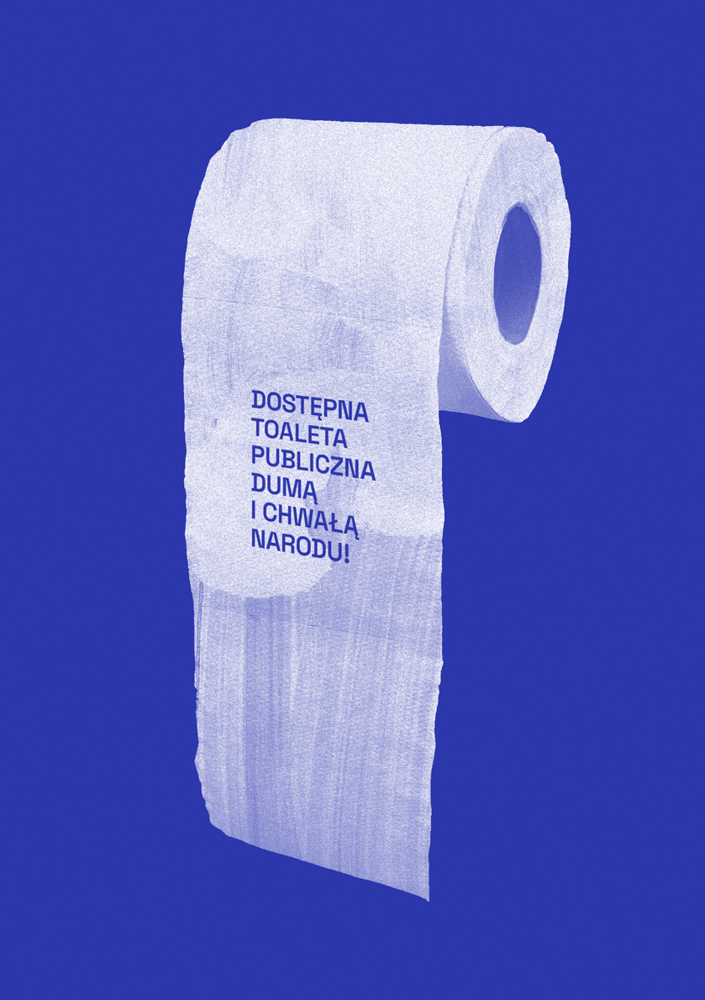
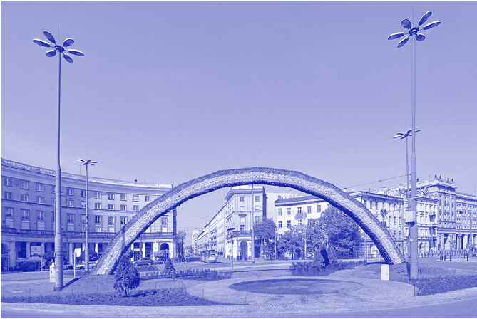
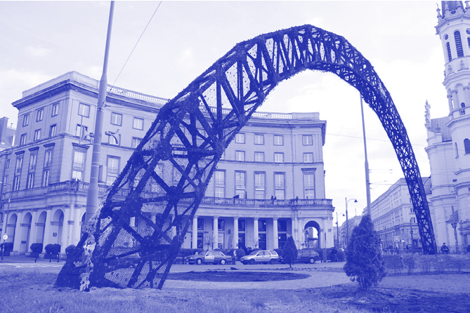

### SPALCIE TĘ TĘCZĘ!

PRZESTRZEŃ MIEJSKA WARSZAWY JAKO TEREN SPORNY POMIĘDZY RUCHAMI PRO- I ANTY-LGBTQ+

M AG DA L EN A G AU D EN

# ~

Według sondażu ILGA-Europe Polska w 2023 r. pozostaje najbardziej homofobicznym krajem w Unii Europejskiej1. Społeczność LGBTQ+ nie jest chroniona przez prawo2, a będące u władzy od 2015 r. Prawo i Sprawiedliwość otwarcie ją potępia, krzywdząco i dehumanizująco określając „ideologią LGBT”3. Wywołana przez partię rządzącą panika moralna podsyca w polskim społeczeństwie nastroje anty-równościowe, a w konsekwencji normalizuje

- 1 Sondaż ILGA-Europe, Rainbow Europe, kategoria orientacja i płeć, https://www.ilga-europe.org/ report/rainbow-europe-2023/ (data dostępu: 1.06.2023).
- 2 U. Chowaniec, E. Mazierska, R. Mole, Queer(in)g Poland in the 21st Century: How was it at the Beginning of the Millennium? Introduction to this special Issue on Queer Culture and the LGBTQ+

Movement in Poland,

”

Central Europe” 2021, vol. 19, iss. 1, s. 2.

- 3 S. Krawczyk, „Ideologia LGBT” jak „syjoniści” w 68 roku. Tak PiS odczłowiecza mniejszość, https:// oko.press/ideologia-lgbt-jak-syjonisci-w-68-roku-

-tak-pis-odczlowiecza-mniejszosc (data dostępu: 15.12.2022).

mowę nienawiści i przestępstwa wobec mniejszości seksualnych4. Równocześnie krytyka homofobii na stałe weszła do debaty publicznej w mediach opozycyjnych5. Budowany latami rozłam między społecznością LGBTQ+ i solidarnymi z nią Polakami a homofobiczną częścią polskiego społeczeństwa kładzie się cieniem na obecnej sytuacji politycznej i odznacza w dyskursie publicznym6. Co więcej, rozłam ten wpływa na wiele aspektów życia publicznego, włączając w to przestrzeń miejską.

W poddanej globalizacji Warszawie, którą zamieszkuje największa grupa osób LGBTQ+, część mieszkańców stara

- 4 Annual Review of the Human Rights Situation of Lesbian, Gay, Bisexual, Trans and Intersex People in Europe and Central Asia, https://rainbow-europe. org/annual-review (data dostępu: 10.01.2023).
- 5 E. Gołębiowska, Religiosity, Tolerance of Homosexuality, and Support for Gay and Lesbian Rights in Poland: The Present and the Likely Future(s), 2019, s. 153–174.
- 6 Tamże.

się stworzyć środowisko przyjazne dla mniejszości seksualnych7. Tarcia pomiędzy społecznościami pro- i anty-LGBTQ+

TARCIA POMIĘDZY SPOŁECZNOŚCIAMI PRO- I ANTY-LGBTQ+ UWIDACZNIAJĄ SIĘ W STOLICY W WIELU MIEJSCACH, KTÓRE STAJĄ SIĘ PRZEZ TO SYMBOLICZNYM NARZĘDZIEM WALKI O PRZYNALEŻNOŚĆ PRZESTRZENI I WIDOCZNOŚĆ W MIEŚCIE I SPOŁECZEŃSTWIE

uwidaczniają się w stolicy w wielu miejscach, które stają się przez to symbolicznym narzędziem walki o przynależność przestrzeni i widoczność w mieście i społeczeństwie.

rola przestrzeni miejskiej w kształtowaniu pojęcia obywatelstwa

Według Jona Binniego i Davida Bella, którzy opisali zależności pomiędzy polityką przestrzenną i turystyczną miasta a rozwojem queerowych dzielnic i przestrzeni, to właśnie miasta są kluczowymi miejscami kształtowania pojęcia obywatelstwa, zarówno miejskiego, jak i seksualnego8. Rozwój zglobalizowanych metropolii, takich jak Nowy Jork czy Londyn, przyniósł narodziny subkultur nienormatywnych seksualnie i płciowo, których wizerunek z czasem został skomercjalizowany i zaczął być wykorzystywany przez rządzących do przyciągania zainteresowanych innością turystów9. Niezwykle popularne gejowskie enklawy i pojawiające się w nich queerowe ikony wpłynęły na rozwój przestrzenny

- 7 D. Bulska i in., Raport za lata 2019–2020. Sytuacja społeczna osób LGBT w Polsce, Warszawa 2021, s. 32–33.
- 8 D. Bell, J. Binnie, Authenticating Queer Space: Citizenship, Urbanism and Governance. Urban Studies, 2004, „Urban Studies” 2004, vol. 41, no. 9, s. 1807–1820.
- 9 N. Oswin, World, City, Queer,„Antipode” 2015, vol. 47, iss. 3.

tych miast, a ich rosnąca popularność zapoczątkowała globalny proces redefiniowania obywatelstwa seksualnego10. Nie bez powodu Binnie i Bell podkreślają, że lokalny kontekst jest kluczowy do przeanalizowania i zrozumienia pojęcia obywatelstwa. W Polsce sytuacja mniejszości seksualnych jest nieustannie kwestionowana, co jest pochodną sytuacji politycznej i religijnej. Nieco inaczej sytuacja kształtuje się w Warszawie, któ-

- rą zgodnie z danymi przedstawionymi w raporcie przygotowanym przez zespół prowadzony przez Dominikę Bulską zamieszkuje aż 20% polskiej społeczności LGBTQ+11. Część mieszkańców stolicy stara się, aby stała się ona dla niej bardziej przyjazna i inkluzywna. Queerowe instalacje, plakaty i billboardy, flagi rozwieszane na balkonach, w oknach i na pomnikach uporczywie przypominają, że mniejszości seksualne i płciowe
- są nieodłączną częścią miasta. Tym samym włączają obywateli stolicy do dyskusji na temat równouprawnienia oraz

51 — — płećrozumieć

PRZESTRZEŃ MIEJSKA WARSZAWY STAJE SIĘ TERENEM WALKI MANIFESTOWANEJ

ZARÓWNO FIZYCZNIE – W POSTACI RADYKALNYCH I BRUTALNYCH DZIAŁAŃ W JEJ OBRĘBIE – JAK I METAFORYCZNIE

– W FORMIE STARCIA DWÓCH RÓŻNYCH DEFINICJI OBYWATELSTWA

kwestionują narodowe pojęcie obywatelstwa. W połączeniu z dostępnością i widocznością przestrzeni miejskich, które zostają zajęte i przywłaszczone przez społeczność LGBTQ+, obiekty te stają się polityczne, przez co w dużej mierze narażone są na agresję i wandalizm grup

- 10 K. Goh, Safe Cities and Queer Spaces: The Urban Politics of Radical LGBT Activism, Los Angeles 2017.
- 11 D. Bulska i in., dz. cyt., s. 32–33.

5234 —RZUT+

konserwatywnych12. Przestrzeń miejska Warszawy staje się więc terenem walki manifestowanej zarówno fizycznie – w postaci radykalnych i brutalnych działań w jej obrębie – jak i metaforycznie – w formie starcia dwóch różnych definicji obywatelstwa: warszawskiej i narodowej. Omówione poniżej interwencje przestrzenne są przykładami opisanego konfliktu.

tęcza

Tęcza – instalacja autorstwa Julity Wójcik, która w latach 2012–2015 stała na placu Zbawiciela w Warszawie, stała się jednym z punktów eskalacji zaciętej walki światopoglądowej manifestowanej w przestrzeni miejskiej pomiędzy queerową społecznością a ruchami anty-LGBTQ+. W 2012 r. Tęcza została przetransportowana do Warszawy i postawiona w centrum okrągłego placu Zbawiciela, naprzeciwko katolickiego kościoła Najświętszego Zbawiciela. Została zbudowana z prefabrykowanej stalowej kratownicy, ogrodowej siatki i sztucznych kwiatów, przygotowanych przez wolontariuszki z założonej przez Wójcik Spółdzielni Rękodzieła Artystycznego „Tęcza” i wplecionych w metalową konstrukcję tak, aby stworzyć efekt trójwymiarowej, sześciokolorowej tęczy. Według autorki instalacja miała reprezentować przymierze, miłość, pokój i dawać nadzieję, a także być po prostu piękna13. Jednocześnie jasno odnosiła się do symbolu emancypacji mniejszości seksualnych, tęczowej flagi, stając się punktem zapalnym w mieście.

Rosnąca niechęć do instalacji znalazła ujście w formie mowy nienawiści – obiekt zaczął być pogardliwie nazywany symbolem

"

- 12 S. Andron,The Right to the City is the Right to the Surface: A Case for a Surface Commons (in 8 arguments, 34 images and some legal provisions)[w:]Urban Walls: Political and Cultural Meanings of Vertical Structures and Surfaces Routledge, red. A. Mubi Brighenti, M. Kärrholm, London 2019, s. 191–214.
- 13 Julita Wójcik. Tęcza, https://culture.pl/en/work/ the-rainbow-julita-wojcik (data dostępu: 21.11.2022).

lewactwa”, „łukiem Sodomy” i „pomnikiem środowiska LGBT”14. Z czasem słowne pogróżki przekształciły się w przemoc fizyczną, która doprowadziła do aktów wandalizmu. Na przestrzeni trzech lat, od 2012 do 2015 r., Tęcza została podpalona aż siedem razy15. W trakcie Marszu Niepodległości, 11 listopada 2013 r., Tęczę podpaliła karmiona homofobiczną propagandą grupa radykalnych konserwatystów. Towarzyszył temu agresywny protest przeciwko społeczności LGBTQ+, w którym skandowane groźby i obelgi odzwierciedlały rosnącą nienawiść do mniejszości seksualnych16. Kolejnego dnia zatrważające zdjęcia ze zniszczenia instalacji i protestu zalały internet, skłaniając mieszkańców Warszawy do okazania wsparcia dla nieheteronormatywnej społeczności17. W mediach społecznościowych zaczęły pojawiać się pierwsze inicjatywy dotyczące odbudowy Tęczy, a popularność zdobywały posty ze sloganami: „Odbudujmy Tęczę”, „Wetknij kwiatek w Tęczę”18. Niedługo po tym stalowy, poczerniały szkielet zaczął pokrywać się żywymi kwiatami, flagami i dołączonymi do nich laurkami i listami wsparcia od obywateli miasta, dając nadzieję członkom queerowej społeczności. Równocześnie w odpowiedzi na inicjatywy wspierające osoby LGBTQ+ w mediach zaczęły się pojawiać

- 14 Wspominamy tęczę na Placu Zbawiciela. Sztuka nieobojętna, https://www.bryla.pl/bryla/7,85301,21932872,wspominamy-tecze-na-placu-

-zbawiciela-sztuka-nieobojetna.html (data dostępu: 8.06.2017).

- 15 J. Tomczuk, Historia tęczy na Placu Zbawiciela. „Jej legendę zbudowało siedmiokrotne podpalenie”, https://www.newsweek.pl/polska/spoleczenstwo/ tecza-wrocila-na-plac-zbawiciela-jako-element-scenografii-historia-teczy-na-placu/ydw22f4 (data dostępu: 10.02.2023).
- 16 Tęcza płonęła już pięć razy, https://tvn24.pl/ tvnwarszawa/najnowsze/tecza-plonela-juz-piec-

-razy-102570 (data dostępu: 12.02.2023).

- 17 A. Sowa, Polityczna historia tęczy z Placu Zbawiciela, https://www.polityka.pl/tygodnikpolityka/ kraj/1561859,1,polityczna-historia-teczy-z-placu-

-zbawiciela.read (data dostępu: 11.02.2023).

- 18 Tamże.

- Il. 1. Tęcza autorstwa Julity Wójcik na Placu Zbawiciela w Warszawie
- Il. 2. Spalona Tęcza

53 — — płećrozumieć

5434 —RZUT+

homofobiczne komentarze, takie jak „Spalcie tę Tęczę!”19. W kolejnych dniach celebryci i influencerzy, w tym Edyta Górniak, Michał Piróg i Monika Olejnik, w geście wsparcia przyjechali na plac Zbawiciela, aby przyłączyć się do ozdabiania Tęczy. Odbył się też happening zatytułowany „Niewzruszeni całujemy się pod tęczą”, w którym udział wzięło 300 osób i który w ciągu dnia przekształcił się w marsz pod hasłem „Wolności nie spalicie”20. Reakcje

- i kontrreakcje wymieniane w ten sposób pomiędzy Polakami popierającymi społeczność LGBTQ+ a jej przeciwnikami nadały Tęczy nowy wymiar. Instalacja nieodwracalnie utraciła swoje pierwotne znaczenie i cel, stając się symbolem walki o wolność i ustanowienie nowej definicji obywatela miasta i obywatela seksualnego.

Od czasu wydarzeń z Dnia Niepodległości w 2013 r. Tęcza została podpalona jeszcze dwa razy, zanim ostatecznie rozebrano

- ją 26 sierpnia 2015 r. w związku z wysokimi kosztami utrzymania i ochrony. Pusty plac Zbawiciela mógłby przywodzić na myśl zwycięstwo homofobii, ale od 2015 r. wspomnienie Tęczy nieustannie mobilizuje mieszkańców, aktywistów i firmy oficjalnie wspierające społeczność LGBTQ+ do podjęcia prób odbudowy Tęczy. W 2018 r. Fundacja Wolontariat Równości, firma Ben&Jerry’s i Stowarzyszenie Miłość nie Wyklucza odtworzyły instalację na placu Zbawiciela, proponując jej ognioodporny hologram21. Projekt odbudowy pojawił się także we wnioskach do Budżetu Obywatelskiego Warszawy w 2023 r.22

- 19 Tamże.
- 20 Tamże.
- 21 W piątek Tęcza wróci na Plac Zbawiciela, https://warszawa.naszemiasto.pl/w-piatek-tecza-

-wroci-na-plac-zbawiciela-wiemy-jak-bedzie/ar/ c8-4678663 (data dostępu: 15.02.2023).

- 22 M. Skorupka, Tęcza powróci na plac Zbawiciela, a przed urzędami pojawią się flagi LGBT? Projekt trafił do Budżetu Obywatelskiego, https://warszawa.naszemiasto.pl/tecza-powroci-na-plac-zbawiciela-a-przed-urzedami-pojawia/ar/c1-8673457 (data dostępu: 15.02.2023).

pl ak at

W wielu krajach na świecie czerwiec jest Miesiącem Dumy, w którym świętuje się widoczność społeczności LGBTQ+ i promuje solidarność i równouprawnienie. Warszawa co roku przyłącza się do jego obchodów, organizując liczne wydarzenia kulturalne poświęcone queerowej społeczności23. Pod koniec maja 2022 r. Vogue Polska, z okazji zbliżającego się Miesiąca Dumy, opublikowało numer z dwoma okładkami przedstawiającymi całujące się pary jednopłciowe. Wybrane zdjęcia portretowe miały intymny, romantyczny nastrój nadany poprzez pastelowe barwy oraz ciepłe światło zachodzącego słońca oświetlające twarze modeli. Ich celem było pokazanie, że miłość jest piękna bez względu na to, czy dostosowuje się do heteronormatywnej wizji świata, czy nie, zaś pary homoseksualne mają prawo do bycia widocznymi w społeczeństwie. Plakaty z okładkami zostały rozwieszone w przestrzeni Warszawy i ponownie wywołały konflikt wśród obywateli stolicy. Przyklejone między innymi na ścianach budynków na ulicy Mokotowskiej, skłoniły jednego ze starszych mieszkańców do aktu wandalizmu. Czarnym sprayem zamalował on twarze całujących się par24. Zdjęcia i wideo z zaistniałej sytuacji szybko obiegły media społecznościowe, wywołując reakcję osób solidarnych z LGBTQ+, które pytały: „Ile czasu musi jeszcze minąć, żeby coś się wreszcie zmieniło?”25. W odpowiedzi na zamalowanie plakatów Marta Warchoł, reporterka TVN-u, opublikowała na swoim Instagramie zdjęcie z miejsca zdarzenia, na którym całuje kobietę w sposób odtwarzający scenę z okładki. Dołączyła do niego opis:

- 23 Warszawski Miesiąc Równości – czerwiec Miesiącem Dumy, https://um.warszawa.pl/-/warszawski-miesiac-rownosci-czerwiec-miesiacem-dumy (data dostępu: 15.02.2023).
- 24 Zniszczone plakaty „Vogue Polska”: Nikt nie wymaże miłości, https://www.vogue.pl/a/zniszczone-plakaty-vogue-polska-nikt-nie-wymaze-milosci (data dostępu: 21.11.2022).
- 25 Tamże.

„To się nie uda. Nie zasprejujecie nas – osób nieheteronormatywnych”26. Jej post stał się inspiracją dla innych osób do zorganizowania happeningu pod hasłem „A ty całuj mnie – kiss in protest”. Przed wydarzeniem mieszkańcy Warszawy narysowali twarze zamalowane na plakatach i udekorowali je kolorowymi napisami.

Mimo że w porównaniu z konfliktem przestrzennym rozgrywającym się wokół

OBECNOŚĆ LGBTQ+ W PEJZAŻU MIEJSKIM SPRAWIA, ŻE SPOŁECZNOŚĆ TA STAJE SIĘ CZĘŚCIĄ ŻYCIA CODZIENNEGO JEGO MIESZKAŃCÓW I TYM SAMYM WPŁYWA NA ICH PERCEPCJĘ OBYWATELSTWA

Tęczy akcja ta była jednorazowa, zyskała dużą uwagę w mediach i wywołała niezwłoczną reakcję obywateli Warszawy. Osoby solidarne ze społecznością LGBTQ+ zjednoczyły się w proteście przeciwko homofobicznemu wandalizmowi w przestrzeni publicznej.

fl aga

Tęczowa flaga – symbol społeczności LGBTQ+ – jest uniwersalnym narzędziem do komunikowania przynależności w mieście. Obecna w oknach bloków, wieszana na balkonach mieszkań, stająca się tłem na billboardach, noszona w przestrzeni publicznej na ubraniach i torbach wytrwale przypomina, że mniejszości seksualne są częścią społeczeństwa. Pokrywając fragmenty powierzchni miasta, wplata się w jego tkankę urbanistyczną27. Jednocześnie staje się obiektem powodującym eskalację nienawiści do mniejszości seksualnych. W 2020 r., w trakcie Marszu Niepodległości, jeden z uczestników rzucił petardę w kierunku mieszkań znajdujących

- 26 M. Warhol, https://www.instagram.com/p/CeJnGyqIOny/?utm_source=ig_embed&utm_campaign=loading (data dostępu: 19.02.2023).
- 27 S. Andron, dz. cyt., s. 191–214.

się w pobliżu Mostu Poniatowskiego. W jednym z nich wybuchł wtedy pożar, a na opublikowanych w sieci nagraniach da się słyszeć jednego z uczestników, który mówi: „Zostaw, nie gaś tego. Niech płonie”28. Dwa piętra wyżej, na jednym z balkonów wywieszona była wówczas flaga LGBTQ+ i plakat Strajku Kobiet, w które to najprawdopodobniej celował wandal. Sprawa zyskała rozgłos medialny i ponownie wywołała dyskusję na temat homofobii w społeczeństwie.

Jednocześnie w lipcu tego samego roku flaga LGBTQ+ została wykorzystana przez aktywistki grupy Gang SamZamęt i powieszona na najważniejszych pomnikach w Warszawie (m.in. na pomniku Mikołaja Kopernika, Józefa Piłsudskiego, warszawskiej Syrenki, a także figurze Chrystusa przy Krakowskim Przedmieściu)29. Pojawiły się na nich hasła „To szturm! To atak! To tęcza! Pamięci poległych w walce z nienawiścią”. Zgodnie z anonimowymi wypowiedziami opublikowanymi na łamach portalu Wyborcza.pl aktywistki wierzą, że jedynie poprzez radykalne działania zostaną dostrzeżone problemy społeczności LGBTQ+, które starają się nagłośnić30. Flaga, która stała się częścią znanych warszawskich pomników, nie tylko została uwidoczniona w przestrzeni publicznej, ale także zyskała rozgłos bez udziału agresywnych kontrreakcji w przestrzeni.

- 28 Uczestnicy marszu wrzucili racę na balkon jego pracowni. “Witkacy o mało nie oberwał”, https:// tvn24.pl/polska/marsz-niepodleglosci-2020-podpalenie-mieszkania-stefana-okolowicza-wideo-4748431 (data dostępu: 22.04.2023).
- 29 O. Kromer, Tęczowe flagi znieważyły pomniki? Prokuratura umorzyła postępowanie, ale powód zaskakuje, https://warszawa.wyborcza.pl/ warszawa/7,54420,26675944,teczowe-flagi-zniewazaly-pomniki-sad-umorzyl-sprawe-ale-powod. html (data dostępu: 22.04.2023).
- 30 Z. Bukłaha, Piłsudski, Jezus i syrenka z tęczowymi flagami. Poseł PiS składa zawiadomienie do prokuratury, wspiera go Ordo Iuris, https://warszawa. wyborcza.pl/warszawa/7,54420,26167099,pilsudski-witos-kopernik-i-warszawska-syrenka-z-teczowymi.html#S.embed_link-K.C-B.1-L.2.zw (data dostępu: 22.04.2023).

## 55 — — płećrozumieć

## 5634 —RZUT+

konsekwencje

Analiza opisanych powyżej przykładów skłania mnie do przekonania, że odegrały one kluczową rolę w kształtowaniu współczesnej wizji obywatela Warszawy. D. Bell i J. Binnie uważają, że „sposób, w jaki współtworzymy miastam ma

NAWET SPALONA I POCZERNIAŁA TĘCZA MOGŁA NA NOWO POKRYĆ SIĘ KOLOROWYMI KWIATAMI

ogromne konsekwencje dla tego, jak wyobrażamy sobie obywatelstwo”. Kontynuując tę myśl, można stwierdzić, że obecność LGBTQ+ w pejzażu miejskim sprawia, że społeczność ta nie staje się częścią życia codziennego jego mieszkańców i tym samym wpływa na ich percepcję obywatelstwa, którego nieodłączną częścią są mniejszości seksualne. W mieście, które zamieszkują zarówno obrońcy, jak i przeciwnicy społeczności LGBTQ+, konflikt pomiędzy obiema grupami jest nieunikniony. Obiekty będące symboliczną reprezentacją mniejszości seksualnych są narzędziem do ustanowienia przez nie prawa do przestrzeni miejskiej. Usunięcie ich w akcie dominacji przez grupy reprezentujące drugą stronę konfliktu jest próbą pokazania, że mniejszości seksualne nie są jej częścią. Odpowiedzią na wandalizm nie jest w tym przypadku przemoc, ale akty twórcze, takie jak dekorowanie spalonej tęczy i zamazanych plakatów, ich odnawianie czy happeningi. Są one próbami odzyskania praw do powierzchni i przestrzeni, a tym samym prawa do widoczności w mieście i społeczeństwie. Samozwańcze zaangażowanie społeczne w akty odbudowy udowadnia, że w Warszawie jest miejsce dla mieszkańców, którzy nie przystają do narodowej wizji heteronormatywnego obywatela. Co więcej, próby zrekonstruowania Tęczy po latach od jej rozbiórki udowadniają, że nieheteronormatywność już stała się częścią zbiorowej świadomości warszawiaków. Obecne w niej przestrzenie związane ze społecznością LGBTQ+ są dowodem na to, że pojęcie obywatela miasta uległo zmianie, a zmiana ta jest możliwa dzięki oporowi społecznemu.

Zgodnie z teorią Ilana Meyera wsparcie społeczne jest jednym z czynników, które mają pozytywny wpływ na zmniejszenie stresu mniejszościowego31. W odbudowę Tęczy, protesty i happeningi przeciwko homofobii czy odtworzenie zamalowanych okładek Vogue’a zaangażowani byli nie tylko członkowie społeczności LGBTQ+, ale także wspierający ją warszawiacy, którzy chcą, by stolica była enklawą różnorodności i równouprawnienia. Wsparcie społeczne jest więc nieodłącz-

- ną częścią opisanych walk w przestrzeni, przyciągającą uwagę mediów, gazet
- o zasięgu krajowym i popularnych magazynów, a także celebrytów, influencerów i reporterów, którzy dzięki mediom społecznościowym mają realny wpływ na budowanie opinii publicznej w kraju. To szczególnie oni poszerzają zasięgi opisywanych przez siebie historii i docierają do różnych obywateli, zwiększając szansę na rosnące zrozumienie i akceptację dla środowiska LGBTQ+.

Ponadto jak zauważają Bell i Binnie:

Jeśli zaakceptujemy tezę miast globalnych, wtedy miasta te przyćmiewają inne terytoria i przestrzenie gospodarcze, a także stawiają wyzwanie państwu i narodowi, które są zbiornikiem związków społecznych i sercem obywatelstwa32.

Dlatego też Warszawa, będąca polską enklawą społeczności LGBTQ+, może mieć moc sprawczą przekształcenia narodowej wizji obywatela. Obecna w krajowej polityce homofobiczna retoryka bardzo często pozostaje podstawowym źródłem wiedzy dla wielu Polaków, sprawiając, że wizja światopoglądowej zmiany nie może być rozpatrywana bez zrozumienia szerszego kontekstu społecznego. Niemniej jednak

- 31 D. Bulska i in., dz. cyt., s. 32–33.
- 32 D. Bell, J. Binnie, dz. cyt., s. 1807–1820.

nawet z bieżącym konfliktem w zasięgu wzroku nadzieja leży w ekspozycji mniej progresywnych poglądowo obywateli na społeczną i kulturową różnorodność, co ma szansę zliberalizować ich poglądy względem mniejszości seksualnych33 Nawet spalona i poczerniała tęcza mogła na nowo pokryć się kolorowymi kwiatami.

zmiana myślenia a zmiana w projektowaniu przestrzeni

Omówione napięcia społeczne wokół Tęczy, okładek Vogue’a i tęczowej flagi pokazują, że istnieje silna potrzeba integracji mniejszości seksualnych w przestrzeni miejskiej Warszawy, a także skłaniają do myślenia nad tym, jaką rolę w tym procesie odgrywają architekci i urbaniści. Zwiększenie świadomości o zaistniałym problemie mogłoby sprzyjać wdrażaniu konsultacji społecznych uwzględniających różnorodność mieszkańców miasta w kontekście m.in. płci, wieku, orientacji seksualnej, rasy, a także ich kondycji fizycznej i psychicznej34. Wysłuchanie głosów wykluczonych społeczności i integrowanie pojawiających się w wyniku rozmowy refleksji i wniosków pozwoliłoby uwzględnić w procesie twórczym ich perspektywę, kwestionując tym samym heteronormatywną rzeczywistość i czyniąc miasto bardziej inkluzywnym. W efekcie powstawałyby miejsca publiczne, w których wszyscy mieszkańcy chcą na równych prawach spędzać czas i które dają ludziom poczucie przynależności i bezpieczeństwa. Proces ten nazywany jest „queerowaniem” przestrzeni35.

- 33 J. Binnie, Neoliberalism, Class, Gender and Lesbian, Gay, Bisexual, Transgender and Queer Politics in Poland, New York 2013.
- 34 S. Gamrani, M. Reidel, C. Tribouillard, Cities with Pride: Inclusive Urban Planning with LGBTQ + People, https://blogs.iadb.org/ciudades-sostenibles/en/cities-with-pride-inclusive-urban-planning-

-with-lgbtq-people/ (data dostępu: 2.06.2023).

- 35 J. Joson, Queer Spaces: Why Are They Important in Architecture and the Public Realm?, https:// www.archdaily.com/989218/queer-spaces-why-are-they-important-in-architecture-and-the-public-

-realm (data dostępu: 2.06.2023).

Istnieje również mnóstwo przykładów integracji przestrzeni z symbolami społeczności LGBTQ+, takich jak zastosowanie tęczowych świateł w miejscach publicznych czy przejść dla pieszych stworzonych z kolorów flag mniejszości seksualnych

SPRAWIAJĄC, ŻE HISTORIA ZMARGINALIZOWANYCH GRUP BĘDZIE WIDOCZNA W PRZESTRZENI MIEJSKIEJ, WŁADZE MIASTA MAJĄ SZANSĘ POMÓC

PUBLICZNĄ WROGOŚĆ WOBEC INNOŚCI

bądź płciowych. Przemiany te, choć z pozoru drobne, realnie wpływają na poczucie bezpieczeństwa w przestrzeni i przynależności do miasta i społeczeństwa wśród nieheteronormatywnych obywateli.

Innym sposobem na „queerowanie” przestrzeni jest wplecenie historii społeczności LGBTQ+ w przestrzeń miejską poprzez jej symboliczne upamiętnianie, ale też reprezentację queerowego dziedzictwa: stawianie pomników bądź nazywanie ulic i budynków na cześć ważnych dla społeczności postaci. Sprawiając, że historia zmarginalizowanych grup będzie widoczna w przestrzeni miejskiej, władze miasta mają szansę pomóc podważać publiczną wrogość wobec inności36.

Implementując powyższe metody w swój proces projektowy, architekci, urbaniści, a także ludzie mający wpływ na politykę przestrzenną miasta mogą włączyć się w proces transformacji Warszawy w miasto dla wszystkich •

## 57 — — płećrozumieć

36 Tamże.

