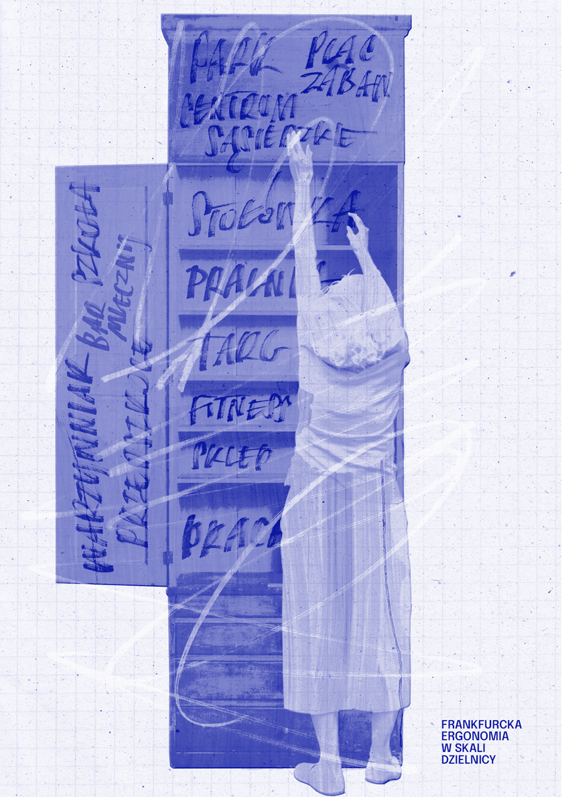

KUCHENNE REWOLUCJE

ZO F I A P I OT R O W S K A

# ~

spojrzenie na kuchnię

Czym jest kuchnia? O kuchniach można by pewnie mówić od momentu, kiedy ludzie nauczyli się panować nad ogniem i dzięki niemu przetwarzać pożywienie. Współczesna definicja mówiłaby raczej o pomieszczeniu służącym do przygotowywania posiłków, które zgodnie z prawem budowlanym musi znajdować się w każdy mieszkaniu (choć od kilku lat dopuszcza się również zastąpienie jej aneksem kuchennym). Taką formę kuchnie przybrały jednak dopiero pod koniec XIX w. Wcześniej ich kształt różnił się diametralnie w zależności od statusu społecznego użytkowników – od bardzo rozbudowanych sekwencji pomieszczeń, przestrzeni i pokoi, przez przestrzeń wokół paleniska w jednoizbowych domach wiejskich, aż po ustawiony w kącie mieszkania piecyk. Kuchnie nie kojarzyły się również z przestrzenią kobiecą, gdyż zawód dworskiego kucharza czy cukiernika, wykonywany przez mężczyzn, był dobrze opłacany i poważany. Wraz z epoką industrializacji miejsce pracy i zamieszkania wyraźnie się od siebie rozdziela. Dom staje się przestrzenią nieprodukcyjną. Kuchnia po cichu znika ze strefy publicznej, a pamiętają o niej tylko kucharki, służące, gospodynie i panie domu…

Triumfalny powrót kuchni do debaty publicznej najlepiej obrazują wydarzenia z 25 czerwca 1959 r. Tego dnia jedna z nich stała się scenerią dla istotnego spotkania mającego miejsce w okresie zimnej wojny – „kuchennej debaty” między Nixonem a Chruszczowem. W ramach ocieplania stosunków amerykańsko-sowieckich zorganizowano w tamtym roku dwie wystawy prezentujące dokonania technologiczne obu państw – rosyjską w Nowym Jorku i amerykańską w Moskwie. Było to raczej wydarzenie propagandowe niż umożliwiające produktywną wymianę wiedzy. Prezydent i pierwszy sekretarz pokłócili się o zmywarkę (reprezentującą możliwości produkcyjne dóbr konsumpcyjnych),

## 6034 —RZUT+

stojąc przy modułowych szafkach. Zwykła, powszechna kuchnia trafiła na pierwsze strony gazet, a jej obraz transmitowała kolorowa, jak podkreślał Nixon, telewizja.

pod w ymiar damskich r ąk

Przełom wieków był momentem wielkich zmian społecznych i technologicznych. Architekci modernistyczni inspirowali się

MARGARETE SCHÜTTE-LIHOTZKY, CHOĆ SAMA PODOBNO ZA GOTOWANIEM NIE PRZEPADAŁA, ZAPROJEKTOWAŁA PRAWDZIWEGO MERCEDESA WŚRÓD KUCHNI

przemianami, jakie zaszły w fabrykach – niespotykanym wcześniej wzrostem tempa produkcji, uzyskanym dzięki maksymalnie wydajnemu wykorzystaniu czasu i przestrzeni. Życie społeczne miało stać się efektywne i sfunkcjonalizowane. Dom także miał zostać maszyną – do mieszkania.

Zainspirowana opracowaniami dotyczącymi usprawnienia pracy w fabryce stali, Amerykanka Christine Frederick wydała w 1913 r. książkęNowoczesne prowadzenie domu1, jasno określając w swojej publikacji typ czytelniczki. Był to poradnik dla kobiety z klasy średniej o niewielkiej sile fizycznej, niewystarczająco bogatej, by korzystać ze służby, ale nie na tyle biednej, żeby pomagały jej instytucje dobroczynne.

Wzorem badań prowadzonych przez Fredericka Taylora w fabrykach Christine Frederick obserwowała pracujące w kuchni kobiety. Używała metody niteczkowej – ślad rozwijanej w trakcie wykonywania różnych czynności przywiązanej do nogi włóczki odwzorowywał tor ruchu użytkowniczki i pomagał rozplanować lepsze i bardziej wydajne rozmieszczenie poszczególnych urządzeń. W Stanach Zjednoczonych korzystano już wtedy z porad inżynierek przy projektowaniu

1 Ch. Fredrick, The New Housekeeping: Efficiency Studies in Home Management, New York 1913.

gospodarstw domowych. Opracowanie Frederick nie było pod tym względem przełomowe. Charakterystyczna dla epoki była także jego struktura – autorka stawia się w roli uważnej słuchaczki rozmowy prowadzonej przez jej męża i postać Pana Watsona, który cierpliwie tłumaczy jej zasady optymalizacji pracy. Poradnik cieszył się wielkim powodzeniem. Został wręcz odebrany jako feministyczny manifest – w końcu ktoś dostrzegł potrzeby kobiet i poświęcił swoją uwagę, aby ułatwić im pracę.

Było to jednak tylko powierzchowne wrażenie. Tayloryzm badał pracę robotników fabrycznych wyłącznie po to, by podnieść wydajność, a nie podwyższyć ich komfort. Tak samo ruch organizacji przestrzeni gotowania ograniczał kobietę do roli gospodyni domowej. Kuchnia projektowana była pod wymiar dłoni kobiecych, a salon niezmiennie dla męskiej wygody.

kuchnia fr ankfurck a i kuchnia polsk a

Niemieckie tłumaczenie Nowoczesnego prowadzenia domuwywołało ogromną reakcję w środowisku architektów racjonalistów. Bruno Taut wychwalał żeńską moc twórczą. W publikacji Nowe mieszkanie. Kobieta jako kreatorka2 stwierdził, że prawdziwe piękno funkcjonalnego domu mogą zorganizować jedynie kobiety, bo to one najlepiej rozumieją przestrzeń mieszkalną.

Na początku XX w. uczelnie opuściły pierwsze architektki. To właśnie one zajęły się tematem gospodarstw domowych. Jedna z nich, Erna Meyer, postanowiła przejąć rolę zarezerwowaną dotąd dla męskich ekspertów. Uważała, że kobiety muszą same się uczyć i organizować. Jej feministyczny program polegał na intelektualizacji zadań domowych – prowadzenie gospodarstwa miało być wyzwaniem równie ważnym, co kierowanie biznesem. Na wystawę w Stuttgarcie w 1926 r. zaprojektowała kilka typów kuchni dla rodzin

2 B. Taut, Die neue Wohnung: Die Frau als Schöpferin,

Leipzig 1924.

- o różnej liczebności. Jedna z nich była przestrzenią treningową, w której dwa razy w tygodniu odbywały się warsztaty uczące korzystania z nowych urządzeń. Filmy i instrukcje obsługi były nieodłącznym elementem progresywnych projektów kuchennych. To była prawdziwa rewolucja przestrzenna, w której biedne gospodynie nie potrafiły się tak łatwo zorientować. W tym samym czasie powstał projekt, który do dzisiaj zachwyca designem – kuchnia frankfurcka. Margarete Schütte-

-Lihotzky, choć sama podobno za gotowaniem nie przepadała, zaprojektowała prawdziwego mercedesa wśród kuchni. Pomieszczenie o wielkości 6,5 m² wypakowane było całym bogactwem niemieckiego przemysłu, czyli aluminiowymi szufladami i elektrycznym piekarnikiem, i wykończone dębowymi blatami. Brakowało jedynie lodówki, która w tamtych czasach była jeszcze bardzo droga. Po raz pierwszy wszystkie urządzenia były wpasowane w ujednolicony system zabudowy. Podobnie jak amerykański model w Moskwie, ta kuchnia miała służyć propagandzie i ilustrować dobrobyt przeciętnego

- obywatela. Swoją nazwę i popularność projekt zawdzięcza wprowadzeniu go w standard 10 tys. frankfurckich mieszkań. Jego cena, rozłożona na raty, została wliczona do czynszu za lokale.

W kontekście niemieckich projektów trzeba docenić także innowacyjność i pogłębiony wymiar feministyczny zaprojektowanej rok później kuchni Barbary Brukalskiej. Stworzyła ona modelowe rozwiązanie dla Warszawskiej Spółdzielni Mieszkaniowej, realizowane w mieszkaniach na Żoliborzu. Było ono oszczędne – jedynym luksusem była wentylowana szafka do przechowywania żywności, budżetowa prekursorka lodówki. Rewolucyjność kuchni Brukalskiej nie polegała na wykorzystaniu nowoczesnych urządzeń, tkwiła gdzie indziej. Pomieszczenie zaprojektowane było jako aneks otwarty na pokój dzienny. Dzięki temu gotowanie miało przestać być odizolowaną czynnością, wykonywaną jak w laboratorium przez osamotnioną panią domu. Miało stać się częścią życia rodzinnego. Wiązało się to z nowymi wartościami wprowadzanymi przez architektów na żoliborskich osiedlach. Propagowali równościowe społeczeństwo, w którym gospodarstwo miało być prowadzone bez wykorzystywania pomocy domowej. Trochę się jednak przeliczyli i pomysł trzeba było zrewidować

## 61 — — płećrozumieć

DOPIERO POWRÓT IDEI

BRUKALSKIEJ – ANEKSU, KTÓRY Z CZASEM PRZEKSZTAŁCIŁ SIĘ W WYSPĘ KUCHENNĄ –

OSTATECZNIE WŁĄCZYŁ PRZESTRZEŃ GOTOWANIA DO SALONU

– jedną trzecią mieszkańców WSM nadal stanowiła służba. Dlatego w kolejnych etapach budowy pomiędzy kuchniami a salonem pojawiły się drzwi, a nawet, w mieszkaniach inteligenckich zatrudniających kucharki, odgrodziła je pełna ściana. Realizacja wizji Brukalskiej musiała poczekać, aż dogonią ją zmiany społeczne.

kobieta bez kuchni

Projekty totalne, które stawiają sobie za cel reorganizację całego społeczeństwa i kompletne odwrócenie istniejącego porządku, bywają fascynujące. Niestety, często kończą się, także totalnymi, porażkami. Radziecki komunizm pełen był radykalnych idei, a kilka z nich rzeczywiście przyniosło pozytywne zmiany społeczne. Na przykład szeroko dostępne żłobki i przedszkola pozwoliły matkom łączyć pracę zawodową z wychowywaniem dzieci. Lenin powiedział nawet, że budowa socjalizmu nie będzie możliwa, jeśli kobiety nie zostaną oswobodzone z niewolnictwa prac domowych3. Kształtowanie nowego, komunistycznego modelu

3 „Proletariat nie może osiągnąć całkowitej wolności, jeżeli nie wywalczy wolności dla kobiet”, W. Lenin, Dzieła, t. 30, Warszawa 1950, s. 380, za: A. Glińska, Lenin o kwestii kobiecej, „Etyka” 1971, nr 8, s. 7.

