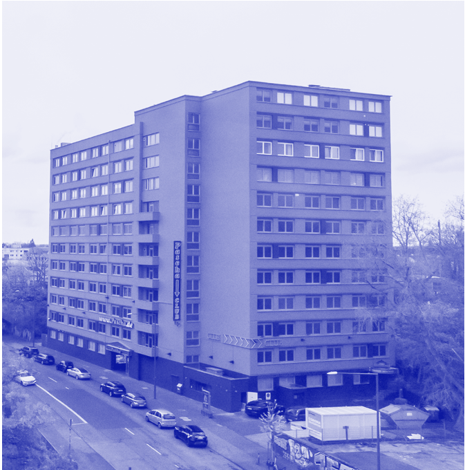
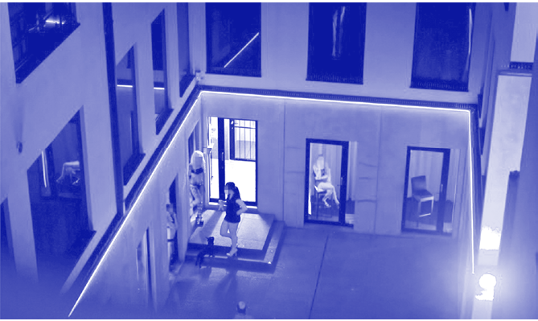
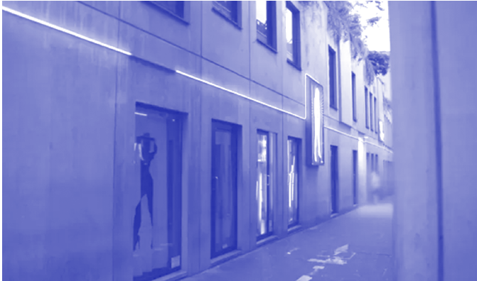

## 6234 —RZUT+

wyemancypowanej rodziny miało odbyć się przy pomocy architektury.

Narkomfin, wzorcowy budynek mieszkalny, wybudowany został w 1930 r. w Moskwie. Zaprojektowali go Moisei Ginzburg i Ignaty Milinis. Zyskał miano społecznego kondensatora, bo ograniczał przestrzenie prywatne, a w zamian rozbudowywał miejsca wspólne. W sposób radykalny realizował idee kolektywnego życia. Kuchni trzeba było się pozbyć, ponieważ to one niewoliły kobiety. Mieszkania zostały więc zaprojektowane bez jakiegokolwiek miejsca do gotowania. Zamiast tego zorganizowano stołówkę, gdzie wspólnie spożywano posiłki. Oprócz tego architekci zastosowali w budynku wiele innowacyjnych rozwiązań przestrzennych – mieszkania dwupiętrowe, przeszklone galerie korytarzowe, kładki pomiędzy blokami. Dziś podobne pomysły kojarzą się raczej z architekturą robotniczą. Narkomfin był jednak prestiżową i nowoczesną realizacją przeznaczoną dla urzędników ministerstwa finansów.

Nieszczęśliwie dla projektu po dojściu do władzy Stalina główne cele polityczne Związku Radzieckiego uległy mocnemu przewartościowaniu. Problem mieszkalnictwa nie był już najważniejszy, ponieważ zastąpiły go przemysł i gospodarka. Komitet Centralny zdecydował się też obrać bardziej umiarkowaną ścieżkę zmian, która nie wymagała od obywateli kompletnego przewartościowania stylu życia. Architektoniczne projekty powróciły do utartych standardów, a ideologia znalazła swój wyraz jedynie w socrealistycznych dekoracjach. Już kilka miesięcy po otwarciu budynku władza zaczęła się do niego odnosić krytycznie. Zarządzono poprawki – miniaturowe kuchnie na siłę trzeba było wcisnąć do nieprzystosowanych mieszkań. Takie decyzje oznaczały powrót do dawnych burżuazyjnych tradycji, wedle których życie rodzinne toczyło się za zamkniętymi drzwiami domu, a nie we wspólnej komunie. Mimo wszystko Narkomfin zapisał się historii jako architektoniczny prototyp, którym niedawno ponownie zaczęto się interesować. Kolektywne przestrzenie powracają dziś w co-livingowych mieszkaniach, w których domownicy z wyboru, nie przymusu, decydują się dzielić kuchnie i salony. Oznacza to jednoczesne ograniczenie „swojej własnej” przestrzeni prywatnej do pokoju z łazienką. Jednak w ostatecznym rozrachunku mieszkańcy mają do użytku dużo więcej miejsca, niż mogliby mieć ściśnięci w osobnych kawalerkach.

powolna ewolucja

Wszystkie przytoczone innowacje pochodzą z II połowy lat 20. Wydawało się wtedy, że całą istniejącą strukturę społeczną można ukształtować na nowo za pomocą odpowiedniej organizacji przestrzeni. Okazało się jednak, że zmiany dotyczące stylu życia dzieją się w swoim niewymuszonym tempie. Ewolucja kuchni spowolniła, a wręcz zastygła w miejscu. Postęp dotyczył głównie sprzętów AGD, w tym upowszechnienia się lodówek. Te miały ogromny wpływ na gotowanie, jadłospis, a przede wszystkim częstotliwość robienia zakupów, lecz nie zmieniły specjalnie układów przestrzennych kuchni.

Dopiero powrót idei Brukalskiej – aneksu, który z czasem przekształcił się w wyspę kuchenną – ostatecznie włączył przestrzeń gotowania do salonu. Nowy sposób mieszkania, reprezentujący pewien miejski styl życia, wymusił dostosowanie nawet starych, kamienicznych układów mieszkań do nowego podziału – na strefę dzienną (kuchnio-jadalnio-salon) i nocną (sypialnie). Przygotowanie jedzenia zmieniło status z pracy domowej w przyjemność towarzyską •

### BEZPIECZEŃSTWO I HIGIENA PRACY

O PRZESTRZENIACH SEKSWORKINGOWYCH

I G A M A Z U R M A R TA W R Ó B L E W S K A

# ~

W Zurychu pomiędzy dworcami Hardbrücke a Altstetten znajduje się nietypowy obiekt. Drewniane pawilony oświetlane kolorowym światłem LED i wyposażone w przyciski bezpieczeństwa zakrywają miejsca postojowe zaaranżowane w taki sposób, by kierowca nie mógł otworzyć drzwi. Z kolei po stronie pasażera drzwi mogą otworzyć się szeroko na podwyższony krawężnik. Na drodze do tego miejsca znajdują się znaki z czerwonym symbolem parasolek1. Te wiaty tosex drive-in, realizacja pomysłu na zlikwidowanie standardowej prostytucji ulicznej, przegłosowanego w miejskim referendum. Koncept wystartował w 2013 r.

- 1 Unterm Strich funktionierts, https://www.tagesanzeiger.ch/unterm-strich-funktionierts-854643169362 (data dostępu: 23.04.2023).

prolog

Jesteśmy architektkami i w tym artykule skupiamy się na pracy seksualnej w skali urbanistycznej i architektonicznej. Interesuje nas przestrzeń pracy i bezpieczeństwo pracowników i pracowniczek. Żadna z nas nigdy nie pracowała seksualnie oraz nikt z naszych bliskich nie ma doświadczeń z pracy w branży. Najbliżej z pracownicami i pracownikami seksualnymi miałyśmy do czynienia poprzez fundację Aliena z Bazylei. Nie jesteśmy aktywistkami. Posługujemy się literaturą stworzoną przez autorów i autorki pracujące w seksbiznesie i walczące o prawa pracownicze. Piszemy ten artykuł jako architektki oraz feministki i chciałyśmy, aby również i w gronie architektek wybrzmiał temat feminizmu proseksualnego w opozycji do szeroko upowszechnionego feminizmu abolicyjnego i karceralnego. To sprawa ważna dla nas wszystkich, a niestety

Il. 1. Sex drive-inprzy Depotweg w Zurychu, rozświetlone kolorowymi światłami LED. Źródło: https://www.stadt-zuerich.ch/ content/dam/stzh/sd/Deutsch/neu/Ich%20brauche%20Unterst%C3%BCtzung/Grafik%20und%20Foto/Sexboxen/ Sexboxen_Beleuchtung.jpg (data dostępu: 23.04.2023)

zdecydowana większość głosów obecnych w debacie publicznej, wliczając w to polskie lewicowe ugrupowania polityczne2, opowiada się właśnie za taką formą feminizmu, która w naszej opinii jedynie powiela patriarchalne formy opresji.

- 2 „W Polsce takie poglądy reprezentuje Fundacja Rzecz Kobiet, założona przez trzy działaczki: Urszulę Kuczyńską, Izę Palińską i Magdalenę Grzyb. Hasło fundacji brzmi: »Kobiety przeciw prostytucji, surogacji oraz pornografii«. »Pomimo pozornej wielkości organizacji prokobiecych i pozornego przebicia się silnego głosu kobiet do debaty publicznej po czarnych protestach, widzimy jednocześnie, jak środowiska lewicowe reprezentują idee wrogie kobietom, otwarcie popierając utowarowienie ciał kobiet w wielu aspektach«– napisały założycielki fundacji w oświadczeniu, które przesłały do TVP Info, gdy zakładały swoją organizację. Powstanie fundacji było też reakcją na usunięcie Kuczyńskiej ze stanowiska asystentki posła Macieja Koniecznego z lewicowej partii Razem. Zarzucono jej transfobiczne, dyskryminujące wypowiedzi”, K. Rogaska, Bez wstydu. Sekspraca w Polsce, Poznań 2022, s. 89.

droga do normalizacji

Bieżąca dyskusja w Polsce dotycząca używania feminatywów zwraca uwagę na kwestie związane z powszechnym stosowaniem języka. W szerszym kontekście geopolitycznym toczy się także debata o wprowadzeniu do języka zaimków niebinarnych. Proces ten pokazuje, że to, w jaki sposób kogoś tytułujemy bądź się do niego zwracamy, ma ogromne znaczenie, ponieważ każdy, bez względu na preferencje lub tożsamość, powinien czuć się dobrze i bezpiecznie. Zwracanie uwagi na feminatywy oraz formy neutralne płciowo powinno być jednak początkiem ewolucji języka, którym się posługujemy.

Prostytucja3 to słowo kojarzone zdecydowanie pejoratywnie. Prostytutka

3 A. Kluczyk, O. Ostrowska, K. Rogaska, Bez stygmy. Jak pisać o pracy seksualnej, https://bezstygmy.pl/ (data dostępu: 1.05.2023), s. 13.

w społecznej świadomości kojarzy się z roznoszeniem chorób, nieczystością oraz zepsuciem fizycznym i moralnym. Sformułowanie to przeniknęło również do polityki w postaci „prostytutki politycznej”4. Jako feministki walczymy o to i życzymy sobie, żeby tytułowano nas wbrew zasadom patriarchatu jako architektki. Osoby świadczące usługi seksualne natomiast chcą, by odrzucono obrażające i narzucone słowo „prostytucja” czy „prostytutki” i nazywano je pracownikami/ pracownicami seksualnymi. Dzięki nazywaniu osób zgodnie z ich wolą i szacunkiem, np. nie niepełnosprawny, lecz osoba z niepełnosprawnością, zyskują one własną agendę oraz moc sprawczą.

W artykule będziemy określać pracownice i pracowników seksualnych w formie żeńskiej, a stronę kliencką w formie męskiej, popierając się logiką zaczerpniętą z książki Rewolta prostytutek, napisanej przez pracownice seksualne Juno Mac i Molly Smith.

Usługi seksualne świadczą osoby wszystkich płci: trans- i cispłciowi mężczyźni, osoby niebinarne, a także identyfikujące się z płciami występującymi w społeczeństwach rdzennych i poza globalnym Zachodem, takimi jak hidźra5, fa

, afafine6 czy two-spirit7. Ważne, żeby o tym pamiętać, gdyż płeć poszczególnych osób kształtuje ich drogę do pracy seksualnej, doświadczenia w tej branży

- 4 M. Staśko, Paweł Kukiz nie jest pracownicą seksualną. Jest koniunkturalnym hipokrytą, https:// krytykapolityczna.pl/kraj/pawel-kukiz-nie-jest-pracownica-seksualna-jest-koniunkturalnym-hipokryta/ (data dostępu: 1.05.2023).
- 5 „Hidźra (hijra) to trzecia płeć w kulturach Azji Południowej. W języku Urdu słowo »hijra« oznacza »impotent« lub »eunuch« i jest raczej określeniem obraźliwym. Hidźra wywodzą się z różnych środowisk, są to osoby urodzone biologicznie jako mężczyźni, ale nie utożsamiające się kulturowo lub psychicznie z płcią męską i męskimi rolami w społeczeństwie. Należą do nich osoby transseksualne, hermafrodyty, transwestyci (…)”, https:// www.crossdressing.pl/main.php?lv3_id=514&lv1_ id=2&lv2_id=54&lang=pl (data dostępu: 4.06.2023).

oraz późniejsze życie. Jednocześnie nie można zapomnieć, że branża usług seksualnych jest upłciowiona: większość osób sprzedających seks to kobiety, a większość osób za seks płacących to mężczyźni. W książce często piszemy o osobach pracujących seksualnie w rodzaju żeńskim, a o ich klientach – w męskim. Nie tkwimy w błędnym przeświadczeniu, że dotyczy to absolutnie każdej sytuacji, ale nie jest to też pomyłka czy nieprzemyślany zabieg. To świadomy wybór, ponieważ naszym zdaniem odzwierciedla on realia branży usług seksualnych, a także nasze osobiste feministyczne przekonania i priorytety8.

Historia feminizmu abolicyjnego pokazuje właśnie takie podejście do pracy seksualnej. Juno Mac i Molly Smith w swojej książce piszą, że „choć prostytutki można uznać za pionierki feminizmu, ich stosunki z szerszym ruchem feministycznym od zawsze były dość napięte”9. Podczas pierwszej fali feminizmu w połowie XIX w. kobiety wyszły na ulice, by domagać się praw do głosowania w wyborach10.

- 6 „Trzecia płeć specyficzna dla kultury samoańskiej.

Fa

, afafine to z biologicznego punktu widzenia mężczyźni, którzy czują się kobietami. Ich rodzice rozpoznają te skłonności już we wczesnym dzieciństwie i wychowują swoich synów jak dziewczynki, albo raczej jak przedstawicieli trzeciej płci”, https://en.wikipedia.org/wiki/Fa%CA%BBafafine (data dostępu: 4.06.2023).

- 7 „Nowożytny, panindiański, zbiorczy termin używany przez niektórych rdzennych mieszkańców Ameryki Północnej do opisania osób pochodzenia indiańskiego, które pełnią w ich społecznościach i kulturach ceremonialne role, tradycyjnie przypisane trzeciej płci (lub alternatywne płciowo), https://pl.wikipedia. org/wiki/Two-spirit (data dostępu: 4.06.2023).
- 8 J. Mac, M. Smith, Rewolta prostytutek. Walka o prawa osób pracujących seksualnie, tłum. A. Ostrowska, Warszawa 2023, s. 19.
- 9 Tamże, s. 25.
- 10 „Jako pierwszą falę feminizmu określa się okres 1840–1920, kiedy to amerykańskie i angielskie sufrażystki (od łac. suffragium– głos wyborczy) wyszły na ulicę, by domagać się swoich praw. Celem protestów były między innymi reforma prawa rodzinnego, prawo wyborcze dla kobiet i poprawa warunków ekonomicznych”, https://pl.wikipedia. org/wiki/Feminizm#Pierwsza_fala_feminizmu (data dostępu: 16.04.2023).

65 — — płećrozumieć

## 6634 —RZUT+

Masowo podejmowały pracę zawodową, równocześnie zmieniając strukturę zatrudnienia i wkraczając do sfery publicznej, dotychczas dostępnej tylko dla mężczyzn. Niemniej zmiany te dotyczyły jedynie kobiet z klasy średniej, które na pierwszej fali feminizmu uzyskały prawo głosu, prawo własności, prawo do udziału w życiu publicznym i stopniowo umacniały swoją pozycję społeczną, sytuując się ponad kobietami z klasy robotniczej. Protekcjonalne traktowanie kobiet z klasy robotniczej objawiało się natomiast w represyjnych formach sprawowania nad nimi kontroli, które zaowocowały między innymi powstaniem tak zwanego przemysłu ratunkowego, czyli „rozmaitych systemów społecznych nagród związanych z nawracaniem prostytutek”11. O „przemyśle ratunkowym” Mac i Smith w swojej książce piszą, że „umożliwiał kobietom z klasy średniej wywalczenie sobie przestrzeni jako obywatelkom i podmiotom politycznym w sferze publicznej – kosztem ich sióstr z klasy robotniczej, których życie coraz silniej nadzorowano”12.

Szczytowy poziom konfliktu w kwestiach prostytucji pomiędzy radykalnymi feministkami a feministkami proseksualnymi został osiągnięty podczas tak zwanych wojen seksualnych w latach 80. i 90. XX w.13 W Rewolcie prostytutekmożemy przeczytać, że „z perspektywy feministek abolicyjnych praca seksualna utrwala patriarchalną przemoc wobec kobiet, będąc równocześnie jej rezultatem”14. Niemniej jednak żadna z powyższych formacji nie uwzględniała i nie włączała do debaty opinii osób świadczących usługi seksualne. Nie skupiały się one na pracy seksualnej w wymiarze materialnym bądź praktycznym, a jedynie na seksie w wymiarze symbolicznym czy metaforycznym. Konfrontacja opozycyjnych ugrupowań

- 11 J. Mac, M. Smith, dz. cyt., s. 26.
- 12 Tamże, s. 26.
- 13 Tamże, s. 27.
- 14 Tamże.

feministycznych miała zadecydować, czy seks jest dobry, czy zły, i w ich opinii istniała tylko jedna poprawna odpowiedź na to pytanie. Z kolei wypowiedzi ze strony

PRACOWNICE SEKSUALNE NAJLEPIEJ WIEDZĄ, JAK WYGLĄDAJĄ WARUNKI

PRACY W BRANŻY I CO MOŻE POPRAWIĆ JAKOŚĆ ICH ŻYCIA. KRYMINALIZACJA

TEGO TYPU DZIAŁALNOŚCI NIE SPRAWIA, ŻE ONA ZNIKA.

USŁUGI SEKSUALNE SĄ NADAL

osób pracujących seksualnie są bardzo często określane jako lobbowanie sutenerstwa czy bycie sponsorowaną przez seksbiznes15.

A przecież to właśnie pracownice seksualne najlepiej wiedzą, jak wyglądają warunki pracy w branży i co może poprawić jakość ich życia. Kryminalizacja tego typu działalności nie sprawia, że ona znika. Usługi seksualne są nadal świadczone, a bezpieczeństwo pracownic jest mniejsze.

W krajach Europy Zachodniej, takich jak Holandia, Niemcy czy Szwajcaria, praca seksualna jest legalna. Oznacza to zdecydowanie większe bezpieczeństwo osób pracujących seksualnie, którym przysługują prawa takie jak innym osobom pracującym. Nie oznacza to jednak kompletnej równości dla seksworkerek. Przykładowo w Szwajcarii, gdzie rynek usług seksualnych tworzą przede wszystkim imigrantki

15 „Uprzywilejowana grupa »pracowników i pracownic seksualnych« domaga się prawa do sprzedaży usług seksualnych za cenę odebrania prawa do nie bycia sprzedaną milionom innych kobiet. Za lobby na rzecz legalizacji prostytucji nie stoją same prostytutki, ale również ludzie czerpiący zyski z seks biznesu i eksploatacji milionów kobiet”, M. Grzyb, Usługi seksualne czy eksploatacja i niewolnictwo? [Polemika], https:// krytykapolityczna.pl/swiat/uslugi-seksualne-czy-eksploatacja-i-niewolnictwo-polemika/ (data dostępu: 1.05.2023).

z Bałkanów i Ameryki Południowej, osoby podejmujące pracę seksualną dostają specjalne pozwolenie na pobyt. Ponadto objęte są nadzorem medycznym, zobowiązującym je do okresowej kontroli. Te wyjątkowe warunki są w pewien sposób stygmatyzujące16. Modelem, który pod względem równego traktowania różni się

MODEL FUNKCJONUJĄCY W POLSCE, PODOBNIE JAK W CZECHACH, WŁOSZECH CZY HISZPANII, TO ABOLICJONIZM. POLSKIE PRAWO NIE KARZE ZA ŚWIADCZENIE USŁUG SEKSUALNYCH, JEDNAK CZĘŚCIOWO PENALIZOWANE SĄ AKTYWNOŚCI Z NIMI ZWIĄZANE

od legalizacji, jest dekryminalizacja, funkcjonująca między innymi w Belgii, gdzie od niedawna praca seksualna jest integralną częścią rynku usług17.

Model funkcjonujący w Polsce, podobnie jak w Czechach, Włoszech czy Hiszpanii, to abolicjonizm. Polskie prawo nie karze za świadczenie usług seksualnych, jednak częściowo penalizowane są aktywności z nimi związane. Karane są strony trzecie, między innymi sutenerzy, czyli osoby organizujące i czerpiące zysk z pracy seksualnej innych. Praca nie wpisuje się w rynek usług, przez co osoby ją wykonujące nie mają żadnych praw i ochrony, co naraża je na wiele niebezpieczeństw.

przestrzenie pr acy seksualnej

Pisząc o pracy seksualnej, nie sposób nie wspomnieć o hierarchii. Istnieje wiele rodzajów wykonywanej pracy, które często

- 16 Informacje zdobyte dzięki życzliwości Tiny Lieberherr, wolontariuszki w fundacji Aliena, zajmującej się seksworkerkami w Bazylei.
- 17 Belgijski parlament przegłosował ustawę dekryminalizującą pracę seksualną 18 marca 2022 r., https://www.nswp.org/news/sex-workers-belgium-

-celebrate-historic-vote-decriminalisation-parliament (data dostępu: 1.05.2023).

trudno ze sobą zestawić ze względu na zarobki, warunki czy ciężar psychiczny. Istotna jest także przestrzeń, w jakiej praca się odbywa. To właśnie ona odgrywa kluczową rolę w dyskusji o bezpieczeństwie i widoczności.

dominatrix

Dominatrix czy też femdom to forma kobiecej dominacji nad klientem. Jej rolą jest zadawanie bólu fizycznego, poniżanie psychiczne, rozkazywanie etc., w zależności od preferencji osoby uległej. Jest to profesjonalna forma BDSM. Podczas sesji zwykle nie dochodzi do współżycia seksualnego, akt skupia się bardziej na cielesnych fetyszach i mentalnej współpracy z klientem18.

Miejscami spotkań (oprócz oczywiście internetu) mogą być pokoje hotelowe czy mieszkania, a często także profesjonalne studia BDSM. W jednym z epizodów podcastu „Dwie dupy o dupie”19 Aleksandra Kluczyk i Julia Tramp prowadzą wywiad z Evil Woman, profesjonalną dominatrix z Warszawy, która jest również współzałożycielką Fetish Chateau20, największego w Polsce studia BDSM, składającego się z siedmiu pokoi o różnej tematyce, wyposażonych w gadżety przynależące do danego fetyszu, takich jak pokój biurowy, gabinet lekarski, showroom z lateksem. W podcaście Evil Woman opowiada o Fetish Chateau jak o swoim osobistym projekcie, który stworzyła i zbudowała praktycznie sama. W żadnej minucie nie pada słowo ‘architektki’, a przecież ktoś musiał brać udział w tym dość skomplikowanym, pełnym detali projekcie wnętrzarskim. Ktoś, kto albo chciał pozostać anonimowy, albo (jak się nierzadko zdarza) umknął uwadze klientki.

- 18 https://en.wikipedia.org/wiki/Dominatrix (data dostępu: 24.04.2023).
- 19 https://newonce.net/epizod/femdom-czyli-kobieca-dominacja-evil-woman (data dostępu: 24.04.2023).
- 20 https://fetishchateau.com/en/home-page/ (data dostępu: 24.04.2023).

## 67 — — płećrozumieć

6834 —RZUT+

Il. 2. Filis i Arystoteles – graficzna interpretacja popularnego w średniowieczu motywu kobiecej dominacji nad męskim rozumem, Master M.Z., ok. 1500 r., Niemcy. Źródło: https://www.artic.edu/artworks/20121/aristotle-and-phyllis (data dostępu: 24.04.2023).

Stripper I don’t dance now, I make money moves Say I don’t gotta dance, I make money move (…) Cardi B, you know where I’m at, you know where I be You in the club just to party, I’m there, I get paid a fee

~ Cardi B, Bodak Yellow

O pracy w klubach ze striptizem najwięcej dowiadujemy się z książki Karoliny Rogaski Bez wstydu. Sekspraca w Polsce. Dziennikarka Onetu postanowiła napisać wcieleniowy reportaż o pracy w klubie go-go, który przerodził się w szerszą publikację na temat usług seksualnych. Spędziła w klubie kilka wieczorów, tańcząc i rozbierając się, by głęboko wniknąć w kulturę takich miejsc.

Brunetka, do której kieruję pytanie, kiwa głową na znak zgody. Dowiaduję się od nich, że zarabiam na drinkach stawianych przez facetów i tańcach prywatnych, przez moje ręce nie mogą przechodzić żadne pieniądze – i nie uprawiamy seksu z klientami. Mam dwadzieścia procent od ceny drinka i czterdzieści procent z tańca. Nie ma podstawy godzinowej. Poza tym mam tańczyć na rurze i pilnować listy, na której rozpisana jest kolejność dziewczyn. (…) Dziewczyny pokazują mi pokoje przeznaczone na tańce prywatne. Są na drugim końcu skąpanego w różowym mroku klubu. Jest w nich jeszcze mniej światła niż na głównej sali. Lepsze są te z większym metrażem – gdy klient chce macać, to jest przestrzeń, żeby się odsunąć. Na koniec tańca wciskamy przycisk na pilocie, który leży na oparciu kanapy. Przychodzi kelnerka i wszystko rozlicza. (…) Aśka, ta w lateksie, dodaje na koniec: – Jak gość jest bardzo agresywny, to też możesz wcisnąć przycisk, żeby przyszła kelnerka. Tylko jak jest obłożenie, to najpewniej zajmie jej kilka minut. Więc moja rada jest taka: gdy klient się rzuca i zaczyna cię dusić, to po prostu stamtąd spie*dalaj21.

Przestrzeń klubów jest sfeminizowana, a w tym, do którego trafiła dziennikarka, jedyni pracujący mężczyźni to ochroniarze, jednak ich wnętrza skonstruowane są pod kątem perspektywy male-gaze22. Ich estetyka wykreowana została w dużej mierze przez pomysły Hugh Hefnera, który od początku tworzenia swojego króliczkowego imperium miał spójną wizję „produkcji męskości (ang. production of masculinity)”23. Postać playboya to „miejski, pewny siebie, wyrafinowany kawaler (ang. city-bred, guy-breezy, sophisticated)”24. Stworzone przez niego typologie takie jak playboy’s penthouse, bachelor padczyplayboy’s mansionnawoływały do kolonizacji przestrzeni domowej, która do tej pory stereotypowo należała do kobiet. W wizji Hefnera te nowe miejsca były stworzone dla mężczyzn jako „bezpieczne i ukryte

- 21 K. Rogaska, dz. cyt, s. 7–8.
- 22 „Z perspektywy feminizmu, to spostrzeżenie, że kobiety są często przedstawiane w literaturze i produkcjach filmowych w męskim, heteroseksualnym ujęciu, dedykowanym męskiej heteroseksualnej widowni”, https://pl.wiktionary.org/wiki/ male_gaze (data dostępu: 27.04.2023).
- 23 P. Preciado, Pornotopia. An Essay on Playboy’s Architecture & Biopolitics, New York 2014, s. 41.
- 24 Tamże, s. 40

obserwatoria”25, pokryte skórą protezy, fizyczne przedłużenie Playboya, służące przede wszystkim przyjemnościom seksualnym i konsumpcji26. Zawłaszczone wnętrza stają się teatralną konstrukcją domowej fikcji27. Nagie przestrzenie wykończone metalem i skórą kryją w sobie rozbudowany system sterowania oświetleniem i dźwiękiem. Upowszechnienie przez media Playboya architektury Hefnera wpłynęło na wyobraźnię mężczyzn na całym świecie. W taki sposób urządzona jest większość klubów, w których striptizerka w szklankach28 porusza się niczym eksponat. Bezpieczeństwo pracownic zależy w dużym stopniu od wypracowanych między nimi relacji. Według Julii Tramp, wspomnianej współautorki podcastu, która od prawie siedmiu lat zajmuje się striptizem29, klub to miejsce rywalizacji o klienta, ale tancerki muszą trzymać się razem. Kobiecy empowermentjest istotny w chwilach, gdy klienci stają się zbyt roszczeniowi. Seks nie jest częścią pracy striptizerek. Niedozwolone jest też dotykanie tancerek. W połączeniu z dużą ilością pitego przez klientów alkoholu dochodzić może jednak do nieporozumień oraz nadużyć i niebezpiecznych dla tancerek sytuacji.

escorting/sponsoring/girlfriend experience

Wypieram obraz i nie poznaję jej Mój świat mi każe myśleć o niej jak o złej Czy przez to, jak patrzą, mam ją kochać mniej?

~ PRO8L3M, Zadzwoń do mnie

Escorting jest formą pracy seksualnej, której stosunek seksualny jest integralną częścią. Osoby pracujące w tym sektorze mogą pracować w pełni niezależnie, we

- 25 Tamże, s. 35.
- 26 Tamże.
- 27 Tamże, s. 80.
- 28 Szklanki to buty na przeźroczystej, około dziesięciocentymetrowej platformie z jeszcze wyższym obcasem.
- 29 https://poptown.eu/julia-tramp-dzieki-pracy-seksualnej-moge-godnie-zyc/ (data dostępu: 27.04.2023).

69 — — płećrozumieć

7034 —RZUT+

własnych przestrzeniach, współdzielonych z innymi escortkami mieszkaniach czy spotykać się w pokojach hotelowych. Świadczenie usług seksualnych nie jest ich jedynym zadaniem, często jest to również rozmowa, towarzyszenie klientowi przez dłuższy czas (w przypadkugirlfriend experience) czy kontakt fizyczny.

Trochę inaczej wygląda to w przypadku osób pracujących dla agencji30. Są one nastawione na wyszukiwanie atrakcyjnych osób do towarzystwa na wydarzenia i przyjęcia oraz na wyjazdy służbowe. Spotkania odbywają się przeważnie w hotelach i domach bogatych klientów. Głównym niebezpieczeństwem w tym wypadku niekoniecznie jest przemoc fizyczna. Klienci nie są anonimowi, a agencje chronią swoje dochodowe pracownice. Kłopotem jest jednak stalking ze strony osób, które chcą czegoś więcej.

Nazywanie osób pracujących w ten sposób escortami jest stosunkowo nowe i wyparło inne, przeważnie pejoratywne określenia. Ciekawie opisuje to Karolina Rogaska, która w swoim życiorysie ma doświadczenie bycia hostessą31:

Po rozmowie z Aleksandrą myślę o tych wszystkich chwilach, w których uważałam się za lepszą od escortek. Szczególnie silnie wraca do mnie jedna sytuacja, kiedy podczas jednego z hostessowych zleceń zostałyśmy wysłane do ogromnej willi na Mazurach. Należała do biznesmena, który raz w miesiącu urządzał imprezy dla swoich kolegów. Miałyśmy witać gości przy wejściu do willi, ubrane w ciuchy, które zapewni nam klient. Kilka godzin, za które wpadnie 600 złotych. (…) Panów było trzech, towarzyszyły im escortki. Od asystentki organizatora dowiedziałyśmy się, że taki weekend to dla nich cztery tysiące złotych zarobku. Pamiętam, jak stałam w ogromnym domu i patrzyłam, jak siedzą z tymi facetami, wybuchając co chwilę śmiechem. Myślałam: jak

- 30 Nieformalna Grupa Pracownic Seksualnych,Doświadczalnik. Jak pracować seksualnie w sposób bezpieczny, świadomy i satysfakcjonujący, Poznań 2019, s. 31.
- 31 Hostessa – kobieta opiekująca się gośćmi lub klientami na wystawach, targach itp., https://sjp.pwn. pl/szukaj/hostessa.html (data dostępu: 19.08.2023).

tak można? Nie tylko ja zresztą. Inne hostessy też wzdychały nad marną kondycją moralną polskich kobiet. (…) Escortki jadły z klientami kolacje. Przy stole, traktowane jak równe. My czekałyśmy w drugim końcu sali, mogąc jedynie popatrzeć i liczyć, że dadzą nam to, co zostanie. Podeszła do nas kucharka. – Nie mają co robić? To ziemniaki obiorą – zarządziła. Przyjęłyśmy to z entuzjazmem – przynajmniej jakaś rozrywka. W poczuciu wyższości rozsiadłyśmy się nad wiadrem z obierkami32.

W styczniu w gazetach na całym świecie33 ukazały się artykuły o wielkim boomie w biznesie seksworkerskim w czasie Światowego Forum Ekonomicznego w Davos34. Wszystko to za sprawą ekskluzywnej escortki o pseudonimie Salomé Balthus35, która na swoim Twitterze napisała

Randkowanie w Szwajcarii podczas WEF oznacza przede wszystkim spotykanie uzbrojonych po zęby ochroniarzy na korytarzu hotelowym o drugiej nad ranem – a następnie dzielenie się z nimi rozdawanymi czekoladkami z restauracji i naśmiewanie się z bogatych36.

Wpis wywołał prawdziwą burzę i Salomé, a w zasadzie Hanna, zdementowała

- 32 K. Rogaska, dz. cyt, s. 57–58.
- 33 Artykuł ukazał się między innymi w „Daily Mail”, „Bild”, „The New York Post” czy rosyjskiej telewizji.
- 34 Konferencja odbywa się co roku, była to jej

53. edycja. Tym razem przedstawiciele krajów i najważniejszych organizacji (między innymi Banku Światowego, Światowej Agencji Energetycznej, ONZ, Interpolu) spotkali się w obliczu trwającej wtedy już prawie rok wojny na Ukrainie, pogłębiającej się przez nią recesji, a także odczuwalnego w wielu krajach kryzysu energetycznego, https://www.weforum.org/agenda/2023/01/the-

-story-of-day-five-at-davos-2023/ (data dostępu: 31.05.2023).

- 35 Prawdziwe imię to Klara Johanna „Hanna” Lakomy, z pochodzenia Niemka.
- 36 Date in der Schweiz während des #WWF bedeutet, nachts um 2 auf dem Hotelflur erst Pistolenmündungen von Sicherheitsleuten zu schauen – und dann mit ihnen die Giveaway-Pralinen aus dem Restaurant zu teilen und über Reiche zu lästern… #Davos #WEF, https://twitter.com/Salome_herself/status/1614870428954275840?s=20

(data dostępu: 31.05.2023).

Il. 3. Sypialnia w miejskiej rezydencji playboya projektu R. Donalda Jaye’a, rysunek Humen Tan, opublikowany w „Playboyu” w 1962 r. Metal, beton, szkło i ikoniczne okrągłe łóżko. Źródło: https://www.mens-folio.com/20960/mans-world-bachelor-pads-year/ (data dostępu: 27.04.2023)

narastające wokół jednego tweeta plotki w „Berliner Zeitung” w kolumnie, której jest redaktorką37. To jednak nie powstrzymało fali dyskusji na ten temat. Jako architektki widzimy tu pewną korzyść, bo zauważalny stał się problem dyskomfortu pracy w hotelach. Problem, który pojawił

- 37 https://www.berliner-zeitung.de/kultur-vergnuegen/ jenseits-von-davos-hanna-lakomy-li.312503?utm_ medium=Social&utm_source=Twitter#Echobox=1675582053-1 (data dostępu: 31.05.2023).

się nawet w tak legendarnym filmie jak Pretty Womanczy też w głośnym ostatnio serialu The White Lotus.

Imogen Edwards-Jones, autorka książek Hotel Babylon, twierdzi, że fabuła drugiej seriiThe White Lotus, w której prostytutka nagabuje klientów luksusowego hotelu na Sycylii, jest bliska temu, czego była świadkiem podczas swojego researchu przy pisaniu.

71 — — płećrozumieć

## 7234 —RZUT+

W niektórych hotelach goście byli w stanie zarezerwować prostytutki, dzwoniąc do recepcji i prosząc ododatkowe poduszki. (…) Podczas gdy pracownicy seksualni często stanowili powszechny, ale irytujący problem dla kierownictwa i konsjerży hoteli, to czasami większym kłopotem było to, w jaki sposób personel hotelowy zarabiał na nich pieniądze.

Edward-Jones odniosła wrażenie, że

Nic nie denerwuje hotelu bardziej niż transakcja zawierana na ich terenie bez ich udziału38.

To, że sekspraca związana jest z biznesem hotelarskim, jest tajemnicą poliszynela. Osoby pracujące seksualnie, które pojawiają się w budynku, muszą ukrywać swoje często oczywiste zamiary, a przejście przez hotelowe lobby może być prawdziwym walk of shame. Pozostawiając sprawy społecznego ostracyzmu, zarówno ze strony konsjerży, jak i cieTO, ŻE SEKSPRACA ZWIĄZANA JEST Z BIZNESEM HOTELARSKIM, JEST TAJEMNICĄ POLISZYNELA. OSOBY PRACUJĄCE SEKSUALNIE, KTÓRE POJAWIAJĄ SIĘ W BUDYNKU, MUSZĄ UKRYWAĆ SWOJE CZĘSTO OCZYWISTE ZAMIARY, A PRZEJŚCIE PRZEZ HOTELOWE LOBBY MOŻE BYĆ PRAWDZIWYM WALK OF SHAME

kawskich gości hotelowych, ten problem można interpretować jako zagadnienie projektowe.

Nie wszystkie escortki są modelkami pracującymi w agencjach. To często osoby pracujące we własnych domach lub mieszkaniach współdzielonych z innymi osobami pracującymi seksualnie. Taka praca wymaga zapobiegliwości, jeśli chodzi o bezpieczeństwo. Publikacje takie

- 38 https://www.dailymail.co.uk/femail/article-11373621/ Hotel-Babylon-author-reveals-sex-work-allowedflourish-5-star-resorts.html (data dostępu: 31.05.2023).

jak Save us from Saviours, będące serią wywiadów z osobami pracującymi seksualnie, ukazują, że ważne są wypracowane metody. W kwestii przestrzennej jest to zwyczajnie druga osoba za ścianą i proste, monitorowane wejście do budynku. Dla osób pracujących samotnie ważne są na przykład lustra umieszczone na ścianach i suficie. Są one nie tylko w pewien sposób stymulujące, ale pozwalają również na pełną obserwację sytuacji przez osobę pracującą.

Zdecydowanie trudniejsze jest udanie się do klienta, którego się nie zna, dlatego zazwyczaj osoby doświadczone odradzają zgadzanie się na pracę w obcej przestrzeni. Kultowa, przejaskrawiona scena seksu z filmu Mary Harron American Psychowbiła się mocno w społeczną świadomość. Oczywiście bezpieczeństwo to też sieć powiązań i zaufanych osób, które czekają na telefon lub monitorują lokalizację.

pr aca w barze, agencji i nie t ylko

W krajach, w których prostytucja jest legalna lub dekryminalizowana, wachlarz typologii seksbiznesu jest bardzo bogaty. Często są to bary wzbogacone o usługę seksualną. Przykładowo FKK club sauna jest naturystycznym barem dopełnionym funkcją sauny. Podobnie jak w klubach, w przestrzeni znajdują się loże i osobne

W KRAJACH, W KTÓRYCH PROSTYTUCJA JEST LEGALNA LUB DEKRYMINALIZOWANA, WACHLARZ TYPOLOGII SEKSBIZNESU JEST BARDZO BOGATY

pokoje do pokazów, będące basenami lub saunami. Często FKK są przeznaczone tylko dla klientów i klientek homoseksualnych.

Popularny model to również agencje i bary z escortami. W agencji klient

- Il. 4. Kadr z Pretty Woman. Na początku filmu Vivian (Julia Roberts) jest traktowana bez szacunku przez wszystkie spotkane osoby, za wyjątkiem Edwarda (Richard Gere). Na szczęście jej klient zakochuje się w niej, wyzwala ją z jarzma prostytucji i wtedy wszyscy ją uwielbiają. Źródło: https://www.tohology.com/en/hospitality/films-and-literature/pretty-woman-film-beverly-wilshire-beverly-hills-a-four-seasons-hotel/ (data dostępu: 27.04.2023)

73 — — płećrozumieć umawia się z konkretną escortą, w barze może najpierw porozmawiać i wybrać osobę, z którą spędzi czas. Pracodawca zapewnia miejsce i teoretyczne bezpieczeństwo. Teoretyczne, bo jeśli przyjrzymy się modelom prawnym, to nie zawsze osoba pracująca seksualnie może liczyć na jakiekolwiek wsparcie.

pr aca w burdelu39/pr aca na ulicy

Aby dowiedzieć się więcej o pracy seksualnej w tak zwanych domach publicznych, skontaktowałyśmy się z osobą pracującą w fundacji Aliena w szwajcarskiej Bazylei. Tina Lieberherr jest nauczycielką niemieckiego, poznałyśmy się w szkole językowej. W Alienie jest wolontariuszką,

39 Wielki słownik ortograficzny PWNobjaśnia wyraz burdel jako dom publiczny albo „wielki bałagan lub miejsce, w którym jest wielki bałagan”. Jest to niewątpliwie słowo o zabarwieniu pejoratywnym, które swoją genezę czerpie z francuskiego bordelages, oznaczającego pierwotnie otwarte miejsce do mycia się znajdujące się pod małym dachem, https://sjp.pwn.pl/slowniki/burdel.html oraz https://pl.wikipedia.org/wiki/Dom_publiczny (data dostępu: 2.05.2023).

prowadzi zajęcia z niemieckiego na poziomie A1 dla kobiet pracujących seksualnie.

W fundacji panuje zasada: „nie pytamy, słuchamy”. Kobiety, które przychodzą do Alieny, to wyłącznie imigrantki. Ich ojczyste języki to najczęściej hiszpański, węgierski i rumuński, choć trafiają się kobiety z całego świata. Najczęściej są to matki, które zarabiają na pozostawioną w kraju rodzinę. Czy przyjechały do Szwajcarii z własnej woli, czy też nie – jest tematem polemiki. W kraju dostają specjalny permit40, zarezerwowany dla branży seksualnej. Szwajcaria nie jest skora do przyjmowania imigrantów spoza Unii Europejskiej i USA, tak więc specjalna wiza jest utrudnieniem w znalezieniu innej pracy.

Najczęściej spotykaną typologią burdeli w Szwajcarii jestLaufhaus. W niemieckojęzycznej Wikipedii możemy doszukać się takiej definicji

Laufhaus to dom publiczny, w którym prostytutki wynajmują pokój. Kiedy są gotowe na spotkanie

"

40 Permitto pozwolenie na pobyt, rodzaj wizy pracowniczej.

7434 —RZUT+

z klientem, ich drzwi są otwarte. Czasami siedzą też w drzwiach pokoju lub przed nimi. Klient może chodzić po korytarzach domu (stąd nazwa Laufhaus41), aby negocjować z paniami w ich pokojach i w razie potrzeby zawrzeć umowę o prostytucji. W większości Laufhauswstęp do korytarzy jest bezpłatny"42.

- Il. 5. Christian Bale w roli Patricka Batemana w filmie American Psycho. Źródło: https://whatculture.com/ film/10-things-you-didnt-know-about-american-psycho-

-2?page=9 (data dostępu: 27.04.2023)

Prostytucja w Bazylei rozsiana jest po mieście w postaci różnego typu barów i agencji, jednak jest jedno miejsce, w którym skupia się większość biznesu. To przestrzeń nazywana przez władzeToleranzzone43, czyli strefą tolerancji, gdzie odbywa się prostytucja uliczna i znajdują się wspomniane Laufhausy. To właśnie na tych ulicach, by ograniczyć obszar, w którym stoją pracownice, pojawiły się znaki podobne do parkingowych. Zielone symbole z kobietą trzymającą latarnię, które mają wyznaczać dokładne „miejsca postoju”, wprowadziła jako rozwiązanie przestrzenne lokalna policja44. W praktyce na tych miejscach mało kto stoi, choć

- 41 Laufen(niem.) – biegać.
- 42 https://de.wikipedia.org/wiki/Laufhaus (data dostępu: 27.04.2023).
- 43 https://www.jsd.bs.ch/themen/prostitution/strassenprostitution.html (data dostępu: 31.05.2023).
- 44 https://www.swissinfo.ch/eng/special-zones_basel-improvises-to-deal-with-street-prostitution/42264298 (data dostępu: 28.04.2023).

należy zauważyć, że pracownice seksualne nie pojawiają się na ulicach bez oznaczeń.

Kobiety przychodzące do Alieny, będące w kryzysie, mogą liczyć na wsparcie, posiłek i nocleg. Na filmiku z okazji dwudziestolecia fundacji możemy zobaczyć wiele osób zaangażowanych w pomoc45. Przez to miejsce przewija się wiele kobiet, które darzą je zaufaniem. Wolontariusze i wolontariuszki Alieny odwiedzają także bary, agencje towarzyskie i ulice strefy tolerancji. Uważamy to za niezwykle cenne w kontekście urbanistycznego podejścia do planowania tak zwanych dzielnic czerwonych latarni.

Dzięki Tinie zaglądamy do statystyk Alieny na rok 2022. W tym czasie organizacja wsparła 1053 osoby pracujące seksualnie, 41% z nich pochodzi z Ameryki Południowej, 8% z Azji, 35 stale korzysta z zajęć językowych, 12 z pomocy psychologicznej. Po pandemii koronawirusa fundacja odbudowuje zaufanie kobiet, które nie uważają Alieny za organ kontrolny, mogący ściągnąć na nie konsekwencje prawne. To chyba jej największe osiągnięcie.

Zupełnie odmienną strategię przyjął Zurych. Wspomniany sex drive-injest substytutem prostytucji ulicznej, obecnej wcześniej przy Sihlquai, a więc w centrum miasta. Zmiany zaszły w celu poprawy bezpieczeństwa osób pracujących seksualnie, a także jakości życia mieszkańców, którzy skarżyli się na hałas i przemoc. Według statystyk policji odkąd powstały miejsca postojowe przy Depotweg, w Zurychu nie doszło do żadnej poważniejszej interwencji z udziałem osób pracujących seksualnie. Tyle w teorii, ponieważ nikt z pracujących nie został zapytany o zdanie. Nikt też nie podpisał się pod projektem wiat, co jest dość zaskakujące, ponieważ realizacje w Szwajcarii, szczególnie publiczne i wynikające z głosowania, są efektem konkursu, którego wyniki muszą zostać podane do wiadomości publicznej.

45 https://aliena.ch/informationen/ (data dostępu: 28.04.2023).

Jak widać, nawet w kraju słynącym z zasad znajdują się od nich wyjątki.

Nie można także pominąć tego, co dzieje się w Amsterdamie. Na starym mieście znajduje się około 350 okien parterowych, wykorzystywanych przez pracownice seksualne. Te okna to tak naprawdę drzwi, przez które klienci mogą wejść do środka. Za oknem znajduje się średniego rozmiaru pokój wyposażony w łóżko, prysznic, toaletę i dozowniki z płynami do dezynfekcji. Pokój oświetlony jest żarówkami w czerwonym kolorze. Przy łóżku znajduje się przycisk alarmowy, który w razie niebezpieczeństwa pracownica seksualna może nacisnąć, aby automatycznie wezwać policję46. Równocześnie zaalarmowane zostają również osoby w sąsiadujących oknach. Przestrzenie pracownicze połączone są drzwiami, aby w razie potrzeby osoba pracująca obok mogła spróbować pomóc. Ten system zapewnia bezpieczeństwo pracowników w miejscu pracy w dzielnicy czerwonych latarni.

Wkrótce decyzją burmistrzyni Amsterdamu Femke Halsemy dzielnica czerwonych latarni może zniknąć z centrum miasta. Historia pracy seksualnej w tym miejscu sięga XIX w., ale dzielnicą czerwonych latarni są tak naprawdę trzy różne obszary, w których znajdują się wyżej wspomniane okna. Najbardziej prominentna lokalizacja sąsiaduje bezpośrednio z Oude Kerk – najstarszym kościołem parafialnym w Amsterdamie. Dla pracownic seksualnych w oknach uciążliwe są tłumy gapiów, którzy nie planują korzystać z ich usług i dodatkowo płoszą potencjalnych klientów. W 2020 r. władze miasta zabroniły wstępu do dzielnicy wycieczkom zorganizowanym w celu polepszania środowiska pracy seksworkerek. Zabronione jest umawianie spotkań z klientami online, więc widoczność i dostępność tej

46 Dział Zagraniczny, Czemu Amsterdam wyrzuca dzielnicę czerwonych latarni[podcast], https:// dzialzagraniczny.pl/2021/02/czemu-amsterdam-wyrzuca-dzielnice-czerwonych-latarni-

-dzial-zagraniczny-podcast067/ (data dostępu: 5.04.2023).

niewątpliwie atrakcyjnej urbanistycznie strefy pracy zapewnia ruch w interesie.

Burmistrzyni Amsterdamu zaproponowała cztery różne rozwiązania dla dzielnicy czerwonych latarni. Trzy z nich zakładają pozostawienie miejsc pracy w ich dotychczasowym i oryginalnym położeniu w centrum Amsterdamu. Pierwsze z nich to propozycja wykorzystania zasłon. Kłóci się to jednak z widocznością, która zapewnia popyt na usługi pracownic seksualnych. Druga opcja zakłada zmniejszenie liczby okien oraz powstanie nowego zakładu pracy w innej lokalizacji.

Il. 6. Oznaczenia pojawiły się na ulicach w 2016 r. Źródło: https://www.swissinfo.ch/eng/special-zones_basel-improvises-to-deal-with-street-prostitution/42264298 (data dostępu: 27.04.2023)

Ten wariant jest również problematyczny, ponieważ właściciele lokali wynajmujący przestrzenie do pracy seksualnej w dzielnicy czerwonych latarni musieliby wybrać, kto zostaje i pracuje na miejscu, a kto musi przenieść się na nowe stanowisko pracy. Trzeci scenariusz to zwiększenie liczby okien, aby rozładować natłok turystów47. Czwarta opcja zakłada z kolei całkowitą likwidację miejsc pracy w dzielnicy czerwonych świateł i relokalizację pracownic seksualnych na przedmieścia miasta z daleka od historycznego centrum miasta oraz zbudowanie tam nowego centrum erotycznego.

47 Tamże.

75 — — płećrozumieć

7634 —RZUT+

- Il. 7. Pascha po renowacji w 2022. Źródło: https://en.wikipedia.org/wiki/Pascha_(brothel) (data dostępu: 5.04.2023).

Dla ostatniego wariantu władze miasta brały pod uwagę dwie typologie – wieżowiec oraz grupę budynków o różnych funkcjach. Alternatywnie zlecono również studia nad pływającym pawilonem. Każda z koncepcji zakłada około stu indywidualnych pokoi dla pracowniczek seksualnych oraz lokale rozrywkowe.

Wizja Femke Hanselmy przypomina burdel Pascha w Kolonii. Pascha to dwunastopiętrowy budynek o powierzchni 9 tys. m2 znajdujący się na obrzeżach miasta. Powstał on w wyniku relokacji pracowniczek seksualnych z Kleine Brinkgasse (odpowiednik dzielnicy czerwonych latarni w centrum Kolonii). Pozwały one miasto za zamknięcie ich miejsc pracy, ale przegrały sprawę w sądzie. Budynek wynajmuje 126 pokoi na siedmiu piętrach za 180 euro dziennie. Cena zawiera posiłki, opiekę medyczną oraz 20 euro podatku, w tym tak zwany podatek od przyjemności wynoszący 6 euro48. Pracownice seksualne oczekują na klientów na korytarzu. Niektóre z nich mieszkają w tych pokojach, a niektóre wynajmują drugie miejsce zamieszkania w innej lokalizacji. Budynek jest otwarty 24 godziny na dobę,

48 https://en.wikipedia.org/wiki/Pascha_(brothel) (data dostępu: 5.04.2023).

77 — — płećrozumieć

- Il. 8. Dziedziniec Villi Tinto. Źródło: https://www.nieuwsblad.be/cnt/dmf20191015_04664757 (data dostępu: 5.04.2023)

- Il. 9. Elewacja z oknami parterowymi Villi Tinto. Źródło:https://www.7sur7.be/belgique/derriere-les-vitrines-du-plus-grand-bordel-de-belgique-chaque-ville-devrait-avoir-une-villa-tinto~ac315839/(data dostępu: 5.04.2023)

## 7834 —RZUT+

- Il. 10. Model nowego centrum erotycznego w Amsterdamie projektu Moke Architecten. Źródło: https://www. mokearchitecten.nl/portfolio/erotisch-centrum/ (data dostępu: 5.04.2023)

a klienci muszą uiścić opłatę 5 euro na wejściu49. Cena za pracę seksualną jest negocjowana bezpośrednio z pracowniczką seksualną. Jedno z pięter jest przeznaczone dla pracowników transseksualnych.

ZNALEZIENIE PROJEKTÓW PRZESTRZENI SEKSUALNYCH NIE JEST PROSTYM ZADANIEM. TEMAT, KTÓRY WYDAJE SIĘ CIEKAWY ZARÓWNO W SKALI URBANISTYCZNEJ, JAK I WNĘTRZARSKIEJ, UWIERA ARCHITEKTKI I ARCHITEKTÓW NA TYLE, ŻE NIE CHCĄ SIĘ NIM CHWALIĆ PUBLICZNIE

Budynek mieści również normalny hotel, klub ze striptizem z osobnym wejściem, kilka barów oraz osobny dom publiczny w stylu klubowym na ostatnim piętrze.

Kolejną z referencji dla nowego centrum erotycznego Amsterdamu jest Villa Tinto. Znajduje się ona w Antwerpii w miejscu lokalnie znanym jako Schipperskwartier w centrum miasta. To poprzemysłowy budynek, który został przekształcony przez architekta Arne Quinze'a w kompleks 51 okien parterowych i punktu opieki medycznej

49 Tamże.

oraz pokoi typu bed & breakfastna wyższych piętrach50. Femke Hanselma proponuje utworzenie budynku w klasie Villi Tinto i z wydajnością Paschy. Poprzez zapewnienie różnorodnego programu funkcjonalnego i pomieszanie pokoi hotelowych z salami do kursów malowania i halami ekspozycji sztuki Hanselma ma nadzieję, że nowe centrum erotyczne Amsterdamu nie stanie się odizolowanym sekspałacem.

Design budynku został powierzony holenderskiej pracowni Moke Architecten. Zlecony przez władze miasta projekt to wieżowiec o powierzchni 5 tys. m2, w którego skład wchodzą pokoje hotelowe, biura, bary, sklepy, lokale rozrywkowe i restauracja51. Architekci Gianni Cito i Jurgen ten Hoeve zaproponowali rozwiązanie architektoniczne przekształcające doświadczenie linearnego chodzenia po ulicy dzielnicy czerwonych latarni w formę zapętlonego korytarza.

Mieszkańcy Amsterdamu chcieliby, aby proponowany budynek centrum erotycznego był jak najmniej widoczny w skali urbanistycznej. Jednak im bardziej przestrzeń jest izolowana, tym bardziej niebezpieczna staje się dla pracownic seksualnych. Plany Femke Hanselmy dotyczące nowego centrum erotycznego stanęły w impasie konsultacji społecznych. Burmistrzyni Amsterdamu ma jednak większość głosów w rządzie, który wspólnie zdecydował, że relokacja dzielnicy czerwonych latarni jest konieczna i nieunikniona.

niew ygodny temat

Znalezienie projektów przestrzeni seksualnych nie jest prostym zadaniem. Temat, który wydaje się ciekawy zarówno w skali urbanistycznej, jak i wnętrzarskiej, uwiera architektki i architektów na tyle, że nie chcą się nim chwalić publicznie. A jeżeli

- 50 https://en.wikipedia.org/wiki/Red-light_districts_ in_Belgium (data dostępu: 5.04.2023).
- 51 https://www.youtube.com/watch?v=sA0Fh91Wlm8&ab_channel=Hoog (data dostępu: 5.04.2023).

