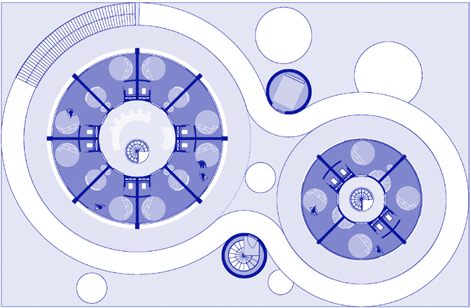
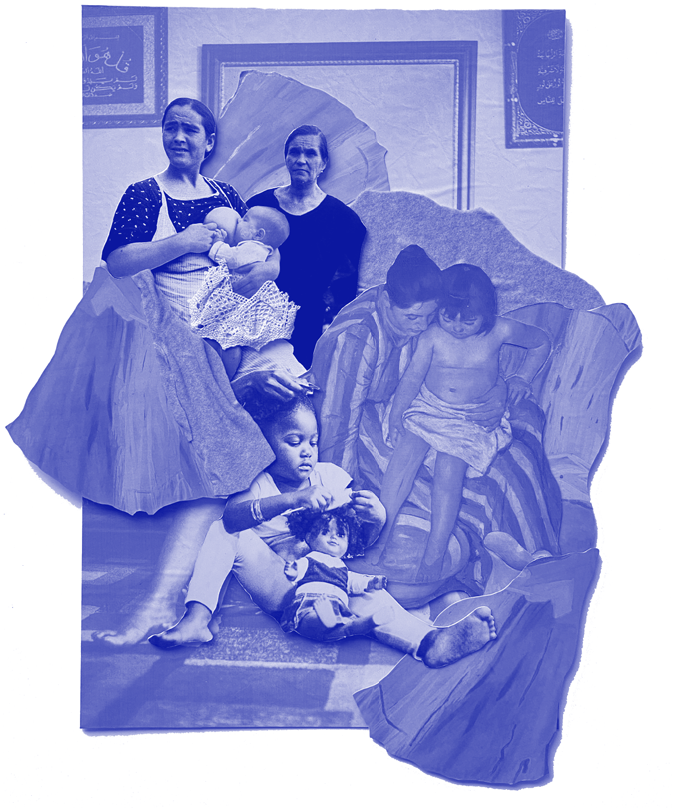
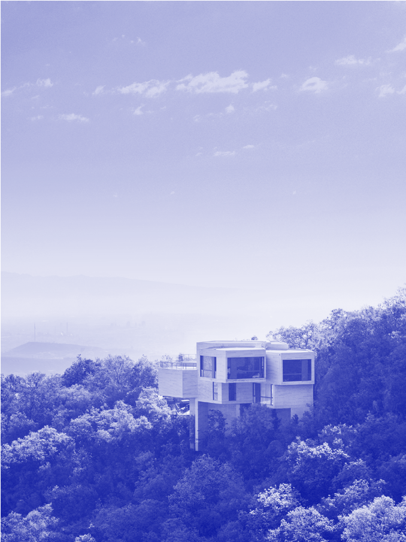
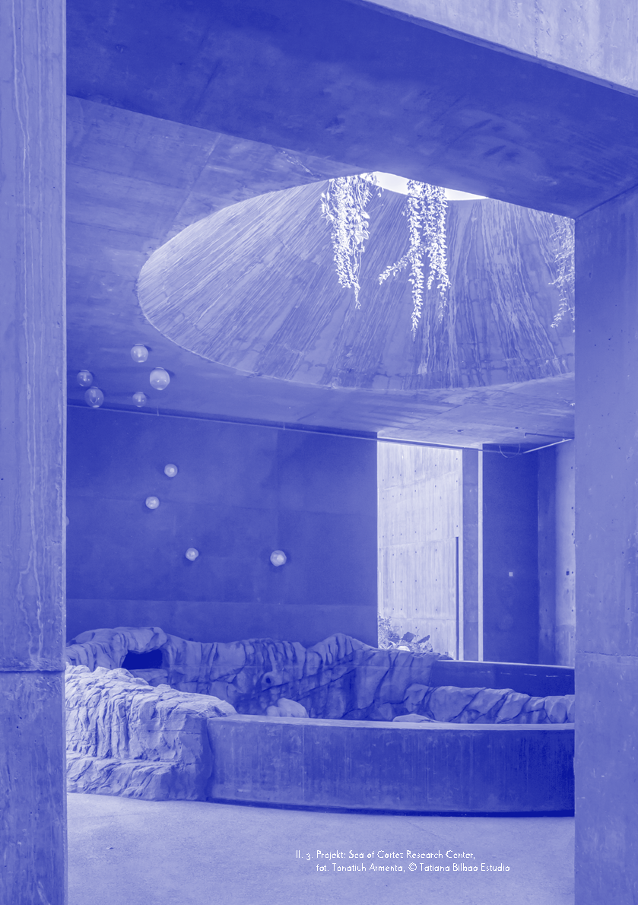
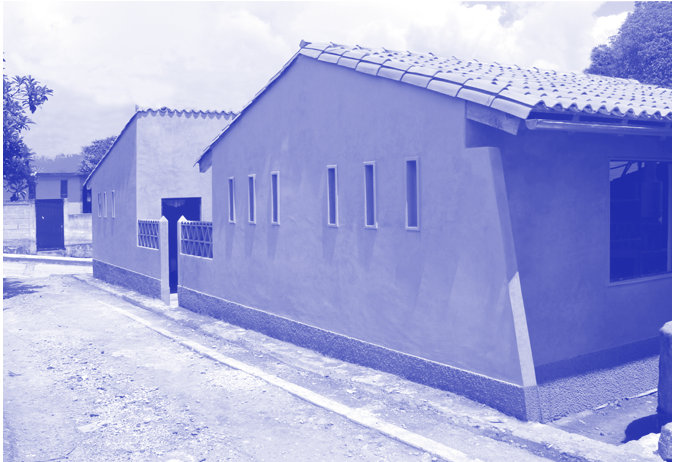
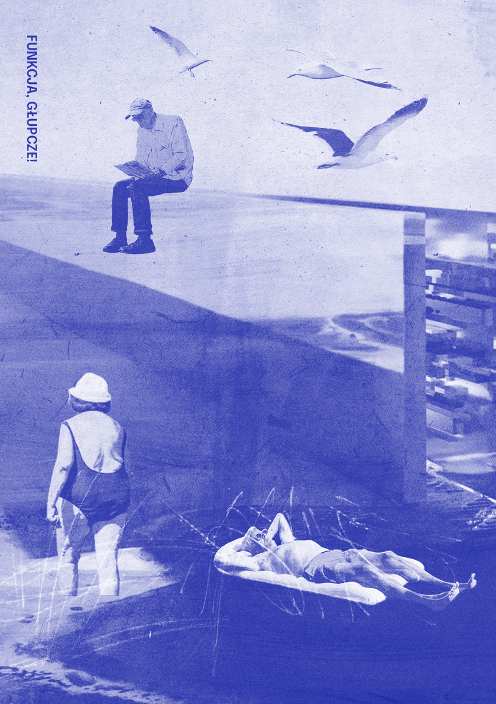

Il. 11. Rzut nowego centrum erotycznego w Amsterdamie projektu Moke Architecten. Klienci poruszają się po zewnętrznych korytarzach budynku niczym po ulicach. Mogą zostać wpuszczeni do pokoju seksworkerki, który ma zaledwie pośrednie doświetlenie, przez ogromne przeszklenie. W środku okręgów znajdują się klatki schodowe, korytarze oraz loungedla seksworkerek – również bez dziennego światła. Połączenie między pokojami odbywa się nie bezpośrednio przez ścianę jak w koncepcie okien parterowych. Droga wiedzie przez wspomniany rdzeń, jest znacznie dłuższa, a więc pokoje są mniej bezpieczne. Źródło: https://www.mokearchitecten.nl/portfolio/erotisch-centrum/ (data dostępu: 5.04.2023)

79 — — płećrozumieć już to robią, można odnieść wrażenie, że strona pracownicza nie została zaproszona do konsultacji przyjętych rozwiązań. Trudno jest mówić o normalizacji grupy zawodowej, jeżeli nie istnieją ustandaryzowane i godne przeznaczone dla niej przestrzenie. Potocznie i prześmiewczo mówi się, że seksworkerki zajmują się najstarszym zawodem świata. I jak najbardziej, w historii znane są przypadki zrzeszania się pracowników i pracownic seksualnych. Piszą o tym J. Mac i M. Smith:

W średniowiecznej Europie pracownice »domów publicznych« zrzeszały się w gildiach i od czasu do czasu organizowały strajki lub protesty uliczne w odpowiedzi na brutalne akcje organów ścigania, zamykanie miejsc pracy lub nieakceptowalne warunki pracy. W XV wieku w Bawarii postawione w stan oskarżenia prostytutki oznajmiły rajcom miejskim, że ich działalność stanowi pracę, a nie grzech52.

52 J. Mac, M. Smith, dz. cyt., s. 21.

Pracownicy i pracownice wszystkich branży powinni mieć zapewnione bezpieczeństwo na stanowisku pracy. Praca seksualna to praca •

# WOLNA PRZESTRZEŃ

# ~

rozmowa z Tatianą Bilbao, architektką prowadzącą autorską pracownię Tatiana Bilbao ESTUDIO w Meksyku rozmawiali: Milena Trzcińska Łukasz Stępnik

~Jak wygląda sytuacja kobiet prowadzących pracownie architektoniczne w Meksyku? Jak było w Twoim przypadku? Czy od początku wiedziałaś, że chcesz mieć własne biuro?

Tatiana Bilbao: Miałam szczęście wychowywać się w domu, w którym nie było podziału na męskie i kobiece zawody. Wydawało mi się normalne, że niezależnie od płci mamy mniej więcej te same możliwości. Moja matka jest fizyczką, walczyła o prawa kobiet i naprawdę żyła na równi z moim ojcem. Jedna z moich babć była biolożką, druga projektantką mody. W tej znanej mi rzeczywistości każdy mógł być tym, kim chciał. Dopiero gdy dorosłam, zaczęłam być świadoma tego, jak duże są nierówności. Po założeniu własnej praktyki zaczęłam być zapraszana na wykłady, konkursy i wystawy, ponieważ byłam rzadkim przypadkiem – kobietą w męskim świecie. Z tego powodu zawsze zadawano mi właśnie to pytanie: jak to jest być kobietą w tym męskim świecie? Na początku trochę mnie to irytowało. Zastanawiałam się, o co chodzi, bo wcześniej nigdy nie patrzyłam na architekturę pod tym kątem. Czułam, że jeśli jakkolwiek odpowiem, to potwierdzę, że są różnice między architektkami i architektami. A przecież nikt nie pyta mężczyzn o to, jak to jest być mężczyzną w architekturze. Jesteśmy po prostu ludźmi, a płeć nie ma znaczenia. Denerwowało mnie to do czasu, kiedy mój bardzo dobry przyjaciel powiedział mi: „Tatiana, doskonale rozumiem, skąd pochodzisz i dlaczego cię to wszystko wkurza… Ale przypomnij sobie, kogo słuchałaś na sali wykładowej, kiedy byłaś studentką. Czy to była kobieta? Raczej nie, bo na uczelni nie ma kobiet. Musisz się do tego odnieść”. Zrozumiałam wtedy, że rzeczywiście robię coś innego i że powinnam być tego bardziej świadoma, by przetrzeć szlaki pozostałym projektantkom. Żadna z nich nie powinna się zmagać z nierównością płci w naszym zawodzie.

Il. 1. Projekt: MECCA X NGV Women in Design Commision 2022 Tatiana Bilbao, “La ropa sucia se lava en casa” Collage, fot. Tatiana Bilbao Estudio ©

Później wszystko zaczęło się zmieniać. Rozpoczęłam projekt z Rozaną Montiel, potem kolejny z Fernandą Canales, a następnie pojawiły się jeszcze Frida Escobedo, Gabriela Carrillo i wiele innych kobiet w Meksyku, które otworzyły własne pracownie. Po pewnym czasie stało się to nawet cechą charakterystyczną naszej sceny architektonicznej – kobiety zdobywają uznanie i wygrywają konkursy. Chociaż dzieje się to głównie w stolicy.

Kiedy zostałam mamą, uświadomiłam sobie, że problem polega na tym, że w ogóle nie rozmawiamy o dzieciach. Nie możemy mówić o nierówności płci, jeśli nie poruszamy tego tematu. Udajemy w ramach pewnej umowy społecznej, że pracujemy na równych zasadach. Ale to nie jest

81 — — płećrozumieć

8234 —RZUT+

Il. 2. Projekt: Casa Ventura, fot. Rory Gardiner prawda. Przede wszystkim kobiety rodzą. Nikt inny nie może tego zrobić za nas, bo dziecko jest w naszym łonie. Dlatego mamy ciało, które jest wyposażone w odpowiedni system hormonalny. Działa on w oparciu o biologiczny cykl życia, a nie paradygmat efektywnej pracy. Te dwie rzeczywistości muszą się ze sobą zderzyć. Jeżeli jesteś mamą i rodzisz, to musisz nakarmić dziecko, a przynajmniej musisz mieć wybór, że chcesz robić to samodzielnie. W naszym społeczeństwie nie ma miejsca na zintegrowane systemy opieki – udajemy, że pewne rzeczy dzieją się same w jakiś magiczny sposób. A tak po prostu nie jest. Jeśli nie będziemy rozmawiać o opiece jako o pracy, nigdy nie stworzymy równego świata. Jest to praca niezbędna dla naszej egzystencji, a mimo to nie jest płatna. Ostatnio czytałam, że karmienie dziecka piersią przez rok to tyle samo godzin, co praca na pełen etat.

Praca w architekturze jest bardzo wymagająca. Jeżeli musisz poświęcić tak wiele czasu na życie zawodowe, to jak wtedy zadbasz o swoją rodzinę? Trzeba wybrać. Opieka jest elementem wspólnoty i chociaż więzi rodzinne są coraz słabsze, to nie zanikają całkowicie – rodzina ciągle odgrywa w naszym społeczeństwie bardzo ważną rolę i tworzy wyraziste konstelacje. Sposób, w jaki żyjemy, pracujemy i układamy sobie czas, rozrywa te połączenia, ale przynajmniej w Meksyku nadal są one znacznie silniejsze niż w wielu miejscach, które widziałam. Jesteśmy krajem latynoskim, więc pomaga nam w tym nasza kultura, a także gospodarka, której słabość sprawia, że musimy polegać na innych ludziach. Budujemy sieci społeczne, dzięki czemu zawsze jestem w stanie znaleźć kogoś oprócz mamy, męża czy siostry, kto pomoże mi z opieką nad moimi dziewczynkami w różnych momentach. Dzięki takiemu zapleczu nie muszę wybierać i rezygnować z własnych ambicji twórczych. Jestem bardzo uprzywilejowana, bo nie jest to powszechnie działający system.

~Sposób dzielenia się opieką jest też ucieleśniony w architekturze. Dom jest miejscem, w którym odbywa się większość nieodpłatnej pracy. W jaki sposób projektanci mogą wpływać na przestrzeń mieszkalną, aby walczyć z dyskryminacją i nierównościami?

Obecny model uniemożliwia współdzielenie pracy wewnątrz domu. Załóżmy, że wszyscy, bez względu na płeć, jesteśmy równi. Ludzie będący w związkach i mieszkający razem zazwyczaj mają różne prace, przy czym kobiety są statystycznie gorzej opłacane. Jeśli ktoś musi poświęcić swój czas na nieodpłatną pracę związaną z utrzymaniem domu czy rodziny, to kto będzie tą osobą? To jest zazwyczaj pragmatyczny wybór czysto związany z finansami.

Rozmawialiśmy kiedyś ze studentami i ktoś z kadry prowadzących zapytał: „Czy jest tu ktoś, kim nie opiekowała się w domu matka?”. Jedna z dziewczynek podniosła rękę i powiedziała: „Moja mama miała bardzo wymagającą pracę – była prezeską firmy, więc opiekował się mną mój tata”. I w tym wypadku ktoś musiał poświęcić swoje życie zawodowe, co jest formą dyskryminacji. Jednak nawet jeżeli ojciec wykonywał tę pracę, to matka musiała być w ciąży, urodzić i karmić. Aby tworzyć naprawdę równościowe społeczności, musimy przede wszystkim zaakceptować tę różnicę. W obecnie funkcjonującym modelu w krajach rozwiniętych i rozwijających się nie zajmujemy się tak naprawdę dziećmi i osobami starszymi. Przerzuciliśmy to zadanie na instytucje. Ignorujemy też różnice fizyczne pomiędzy płciami, a przecież one istnieją. Pomijanie tego faktu w świecie zawodowym jest wadą obecnego systemu. Jeżeli uznajemy, że ludzie mogą konkurować ze sobą na tych samych warunkach, podczas gdy matki muszą zmienić całe swoje ciało, umysł i życie, aby urodzić dziecko, to już na starcie są one w bardzo

## 83 — — płećrozumieć

## 8434 —RZUT+

niekorzystnej sytuacji, ponieważ w tym samym czasie wykonują drugą pracę w pełnym wymiarze godzin, a wymaga się od nich tej samej sprawności intelektualnej, wiedzy, liczby przeczytanych książek. Nie rozmawiamy o prawdziwych różnicach, a jesteśmy bardzo odmienni. Musimy zacząć od prostego stwierdzenia: nie jesteśmy tacy sami.

Domy projektowane dla rodzin nuklearnych sprzyjają dyskryminacji. Najlepszym wyjściem z tej sytuacji jest tworzenie przestrzeni społecznych wspierających budowanie sieci zależności, która pozwala wykonywać nieodpłatną pracę w sposób bardziej wspólnotowy i równy. Ja sama miałam ogromne szczęście: moi rodzice bardzo często opiekowali się moimi dwiema córkami. Kiedy musiałam podróżować, wszędzie zabierałam dzieci i mamę. Kiedy byłam w domu, tata przychodził i zabierał je na balet lub zajęcia muzyczne albo spędzał z nimi czas popołudniami. Z siostrą jesteśmy z kolei partnerkami w biurze. Nasze córki wszędzie chodzą razem. Mieszkamy blisko siebie. To doskonale działa.

Dopiero pandemia zmusiła nas do pewnych zmian. Wszyscy zostaliśmy w swoich domach, a moja sieć wsparcia została zniszczona. Po miesiącu izolacji chciałam działać. W naszym budynku jest sześć mieszkań, więc zaproponowałam sąsiadom, żebyśmy podzielili się obowiązkami, ponieważ ta wymuszona samodzielność stała się nie do zniesienia. Pomysł był taki, że każde gospodarstwo domowe będzie opiekowało się dziećmi i domem przez jeden dzień. Wszyscy się zgodzili. W praktyce jednak okazało się to trudne. W poniedziałki miałam gotować dla pozostałych. Tylko gdzie? W mojej kuchni nie da się gotować dla 20 osób. Chciałam podzielić jakoś to gotowanie, ale wtedy nie zaoszczędzilibyśmy dużo czasu. A co ze szkołą? Trzeba umieścić wszystkie dzieci w jednym pokoju do nauki, żeby jeden dorosły mógł się nimi zająć. Tylko gdzie? W moim za małym salonie? Ja też muszę tu przecież pracować. A pranie? Przecież to poważny i czasochłonny obowiązek i moglibyśmy się nim dzielić. Tylko gdzie? W mojej ośmiokilogramowej pralce, w małej łazience? Niewiele udało nam się zdziałać. Czasami robiliśmy dla wszystkich zakupy w supermarkecie. W naszych budynkach nie ma miejsca umożliwiającego dzielenie się obowiązkami. Gdybyśmy mieli dużą, wspólną kuchnię lub przynajmniej jedno duże pomieszczenie, moglibyśmy znacząco podnieść jakość naszego życia.

~Większość mieszkań projektowana jest z myślą o rodzinach nuklearnych, które w rzeczywistości stanowią tylko 18% społeczeństwa. W Polsce jest dokładnie tak samo. Zakładamy, że w budynkach wielorodzinnych będą mieszkać rodziny 2+1 albo 2+2, i cały czas rysujemy te same układy funkcjonalne.

A jeżeli nie żyjesz w rodzinie, tylko w grupie przyjaciół, nie masz żadnej możliwości wyboru i dopasowanej do siebie oferty. Nie ma mieszkań, które odpowiadałyby na potrzeby takiego modelu funkcjonowania. Podobnie jest zresztą z rodzinami wielopokoleniowymi, w których dzielisz się opieką nad dziećmi z rodzicami. Gdzie będziecie spać? Jak urządzić taki dom czy mieszkanie? Na komercyjnym rynku nie ma takiej możliwości. Projektujemy mieszkania dla 18% społeczeństwa i zapominamy o fakcie, że taki układ trwa tylko około 20 lat. Najpierw nie masz dzieci, potem jedno, może drugie, a po 20 latach wracasz do punktu wyjścia.

~W swojej praktyce poszukujesz rozwiązań uniwersalnych i elastycznych planów, które można dostosować do różnych sposobów życia. Jak połączyć taką pustą przestrzeń z rygorystycznymi wymogami funkcji, często zapisanymi w przepisach?

### Il. 3. Projekt: Sea of Cortez Research Center, fot. Tonatiuh Armenta, © Tatiana Bilbao Estudio

## 8634 —RZUT+

Interesują mnie struktury, które nie są zaprogramowane w bardzo sztywny sposób. Pozwalają one różnie interpretować przestrzeń. Powinniśmy przestać przypisywać pomieszczeniom konkretne funkcje. Obecnie architekci projektują łazienkę, w której mieści się kabina prysznicowa, umywalka i ubikacja i istnieje tylko jeden możliwy sposób jej użytkowania. Tymczasem 60% populacji nie ma dostępu do kanalizacji. Ktoś mógłby powiedzieć, że to problem, który trzeba po prostu naprawić, ale to nieprawda. Meksyk to wiejski i bardzo górzysty kraj. Po co mamy transportować ścieki w takich miejscach? Suche toalety są świetnym i zdrowym rozwiązaniem. Nie nadają się do stosowania w miastach, bo tam stają się problemem sanitarnym, ale dla ludzi w górach to raczej kanalizacja jest kłopotem środowiskowym. Staram się zawsze szukać rozwiązań, które pasują do różnych, często bardzo specyficznych potrzeb. Nie wierzę w standaryzację, tylko próbuję zrozumieć kontekst i pracować z konkretem.

Moim ulubionym miejscem do spania jest na przykład bardzo mały, ciemny i całkowicie zamknięty pokój. Nie rozumiem, kto i kiedy zdecydował, że muszę dzielić łóżko z mężem. Nienawidzę tego. On lubi spać z naszymi dziećmi, a dla mnie to jest koszmar. A jednak większość domów projektowanych jest tak, aby tworzyć wyraźny podział na sypialnie dla dorosłych i dla dzieci. Trudno to zmienić. Myślę, że to część większego zagadnienia i kwestia norm, które często ślepo akceptujemy, nie rozumiejąc, że utrudnia nam to życie.

~Chcesz wymyślać nowe modele życia czy po prostu obserwować, jak ludzie żyją naprawdę? Jaka jest rola architektury w tym procesie?

Staram się stworzyć platformę, w ramach której każdy może zdecydować, jak chce żyć – czy dany pokój stanie się kuchnią, salonem, łazienką, sypialnią czy czymkolwiek innym. Obecnie dzięki technologii możemy zapewnić światło lub dostęp do wody w dowolnym miejscu budynku. Można mieć mobilną kuchnię lub przekształcić jedną dużą kuchnię w kilka mniejszych pomieszczeń.

~Tradycyjna architektura mieszkaniowa nie była projektowana pod kątem konkretnych funkcji pomieszczeń, ale ich cech fizycznych, wewnętrznych temperatur czy wilgotności. W Polsce w wiejskich chatach były miejsca zimne i ciepłe. Często spano w różnych pomieszczeniach w zależności od pory roku. Tego typu pomysły zyskują na aktualności w czasach kryzysu klimatycznego. Jak tradycyjna meksykańska architektura wpływa na to, co robisz?

Kiedy zajmowaliśmy się programem odbudowy obszarów zamieszkiwanych przez rdzenną ludność Meksyku po jednym z potężnych trzęsień ziemi, bardzo świadomie zdecydowaliśmy, że nie będziemy nic projektować. Udzielaliśmy tylko porad technicznych i zastanawialiśmy się, co możemy zaproponować, aby usprawnić ich sposób postrzegania i zamieszkiwania przestrzeni. Nowe materiały i technologie były już w użyciu na tych obszarach. Nikt jednak wraz z transferem materiałów nie dokonał transferu wiedzy – nie przekazano żadnych instrukcji, jak z tych materiałów budować. Ludzie robili to więc tak, jak im się wydawało, często niezgodnie z zasadami technologii budowlanej. Nie wiedzieli na przykład, jak efektywnie łączyć stal z betonem.

Wiedzieli jednak, jak żyć w swoich domach, dlatego zdecydowaliśmy się jedynie na doradztwo techniczne dotyczące materiałów, z których postanowili budować swoje domy. Pamiętam jeden trudny pod względem projektowym przypadek. W bardzo małym miasteczku, w którym prawie nie było ruchu samochodowego, jedna z rodzin miała dom przy drodze. Nie chcieli mieć żadnych okien w pomieszczeniach od strony ulicy. Z naszego punktu widzenia oczywiste było, że dom musi być wentylowany, ale oni powiedzieli, że się na to nie zgadzają. Mój współpracownik uznał, że nie możemy pozwolić na takie rozwiązanie. Powiedziałam: „To jest ich dom, nie jesteśmy projektantami. Przekazaliśmy im, że naszym zdaniem okna są niezbędne, ale to oni zdecydują”. Dla nich to było jasne, a my, mając inną wizję tego, czym powinien być dom, nie mamy prawa decydować za nich. Zbudowali swój dom, w którym dwa pokoje nie mają okien, tylko drzwi na stronę podwórza. Ja tego nie rozumiem, ale oni nie rozumieją, jak ja żyję, więc kto ma rację, a kto się myli? Uważamy, że istnieje kanoniczny sposób życia i myślenia, zawsze dobra lub zawsze zła architektura. To błąd.

~Prezentując swoje projekty na Dolnośląskim Festiwalu Architektury, stwierdziłaś, że część z nich była nieudana lub że ci się nie podobały. Rzadko słyszy się takie rzeczy na wykładach. Czy ten autokrytycyzm jest elementem twojej metody projektowania?

Nigdy nie była to przemyślana strategia, raczej coś zupełnie nieświadomego. Dawno temu mój mąż powiedział: „Tatiana, jesteś dla siebie taka surowa. Daj spokój, robisz cokolwiek i myślisz sobie: »Och, powinnam była zrobić to inaczej«”. Rzeczywiście tak jest, ale pozwala mi to wiele się nauczyć i być świadomą pewnych procesów. Pracuję z tą niepewnością i uczyniłam z niej element własnej praktyki. To pozwala się rozwijać i nie zatracać w przekonaniu, że wszystko robię dobrze.

~Pomimo tego aparatu krytycznego udaje ci się jednak przekonywać prywatnych klientów do bardzo radykalnych pomysłów. W czym tkwi sekret?

To kluczowe, by móc iść naprzód. Według mnie zmiany można wprowadzać tylko przez to, co zostanie zbudowane. Istnieje wiele teorii, które funkcjonują na poziomie idei w środowisku akademickim. Być może ludzie inspirują się nimi po latach. Powiedziałabym jednak, że radykalna zmiana zachodzi przede wszystkim w przestrzeni fizycznej lub politycznej, a nie w sferze dociekań intelektualnych – choć to tu wszystko się zaczyna, należy zrobić krok dalej. Aby doprowadzić do zmiany, trzeba negocjować z rzeczywistością. To wymaga rezygnacji z niektórych rzeczy. Jeżeli jesteś w stanie wprowadzić zmiany w większej liczbie projektów, możesz mieć większy wpływ na otoczenie. Trzeba oczywiście iść na pewne kompromisy, aby budynek mógł powstać, ale jeżeli są one niezgodne z naszymi przekonaniami, to zawsze rezygnujemy. Tak było w przypadku budynku mieszkalnego, który na poziomie koncepcji wykonaliśmy w bardzo radykalny sposób. Potem pojawił się klient, który stwierdził, że musimy w nim umieścić pokoje dla pokojówek, bo inaczej nie uda mu się tego sprzedać. Nie mogliśmy go przekonać do rezygnacji z tego pomysłu, więc powiedzieliśmy: dziękujemy bardzo, nie będziemy częścią waszej działalności. Zmienili projekt i nigdy nie podpisali go nazwą naszej pracowni. Było nam oczywiście przykro, że tym razem nie uda nam się stworzyć czegoś nowego, ale nie możemy łamać naszych zasad etycznych. Natomiast w projekcie w Monterrey, w którym naprawdę zależało nam na wykreowaniu społeczności, zaczęliśmy od otwartego, modularnego planu z pokojami tej samej wielkości, w którym mieszkania przeplatały się ze sobą w bardzo nietypowy sposób. Skończyło się na układach, które są znacznie bardziej konwencjonalne niż te na początkowych etapach myślenia o budynku, ale byliśmy w stanie skonstruować różne przestrzenie sprzyjające tworzeniu się relacji – dodatkowe pokoje,

87 — — płećrozumieć

8834 —RZUT+

Il. 4. Projekt: Reconstruir MX, fot. Percibald García, © Tatiana Bilbao Estudio które nie są odgórnie zaprogramowane. W tym przypadku stworzyliśmy świetne nowe przestrzenie, mimo że nie w pełni mogliśmy zrealizować nasz zamysł.

~Z jednej strony tworzysz bardzo luksusowe projekty dla uprzywilejowanych, a z drugiej mocno angażujesz się społecznie. Na ile projekty tworzone dla mniej zamożnych klientów mogą czerpać rozwiązania z budynków wysokobudżetowych? Jak wygląda transfer wiedzy pomiędzy tak różnymi rodzajami zleceń?

Myślę, że architektura zaspokaja podstawowe potrzeby ludzi i jest potrzebna wszystkim mieszkańcom i mieszkankom tej planety. Niektóre budynki są robione dla osób z zasobnym portfelem, inne za bardzo małe budżety. Uważam, że architektura jest dla ludzi, niezależnie od tego, kim są. Próbuję tworzyć jak najwięcej możliwości przy użyciu jak najmniejszych zasobów. Nawet jeżeli budujemy domy dla bardzo bogatych ludzi, to nie jest to typ architektury oparty na drogich materiałach i luksusowych produktach. Prawdopodobnie są one bardziej hojne pod względem wielkości przestrzeni, ale są wykonane z użyciem tych samych strategii, co proste domy dla ludzi z mniejszymi zasobami. Na tym polega odpowiedzialność za mądre wykorzystanie wszystkiego, co jest w budynku. Cała zainwestowana w niego energia musi mieć cel, nie możemy marnować zasobów. Przeznaczamy ją na spójność przestrzeni, a nie na dodatki. Używamy tej samej strategii w każdym naszym projekcie. Jeżeli zbudujemy domy z ubijanej ziemi czy błota dla bardzo bogatych i staną się one naprawdę sławne, to być może łatwiej będzie nam przywrócić te techniki do powszechnego użytku. Tak właśnie mówi Alejandro Aravena – zatrudnij ludzi z Bollywood, Nollywood i Hollywood, którzy sprawią, że te rozwiązania staną się seksowne i atrakcyjne dla rynku. Wybuduj lepiankę dla Kardashianek.

~Valerio Olgiati projektuje dom dla Kanyego Westa, może trzeba podpowiedzieć mu takie rozwiązanie?

Dokładnie, powinien zrobić dom z błota.

~Raczej w to nie pójdzie… Twoja pracownia ma własną specyfikę, jest zaangażowana i nastawiona na eksperyment. Czy tak było od samego początku?

Zawsze postrzegałam architekturę w oderwaniu od tego, czego uczono nas w szkołach. Kiedy skończyłam wydział architektury, myślałam, że niczego się nie nauczyłam. Widziałam, jak wszyscy moi koledzy z przekonaniem mówili, że są w stanie zaprojektować wszystko. A ja nie miałam pojęcia, jak zacząć.

Na początku myślałam, że to niepewność, i próbowałam się z niej wyleczyć, zapraszając ludzi do współpracy. Później zorientowałam się, że ten dyskomfort wynika z wpojenia mi, że architektura jest pięknym obiektem, który został umieszczony w krajobrazie, a ja nigdy nie postrzegałam jej w ten sposób. Dla mnie myśl, że mam zaprojektować dla kogoś dom, była bardzo niekomfortowa. Jak mam dla ciebie coś zrobić, skoro cię nie znam i nie wiem, jak żyjesz. Musisz mi powiedzieć, jak to zrobić, a ja mogę spróbować ci pomóc. Zrozumiałam, że nie mam prawa projektować czyjegoś życia. Mogę jedynie stworzyć platformę, dzięki której inni będą mogli realizować się tak, jak chcą. Architektura to wielka odpowiedzialność, która nie powinna być oparta na mojej wizji istnienia i moim sposobie widzenia rzeczy.

~Czy doświadczenie pracy w administracji publicznej wpłynęło na twoją praktykę?

Zdecydowanie tak. Byłam bardzo młoda, kiedy tam pracowałam. Naprawdę myślałam, że mam możliwość wpływania na kształt miasta lub sposób, w jaki ludzie żyją. Szybko zrozumiałam, że każdy rząd czy jednostka publiczna, przynajmniej w Meksyku, musi działać w zgodzie z agendą garstki ludzi, którzy znajdują się przy władzy. Pieniądze muszą iść w parze z wolą polityczną, czyli z konkretną partią z konkretnym programem. A on nie zawsze odpowiada na to, czego potrzebują i oczekują ludzie. Służy raczej do tworzenia powiązań i utrwalania władzy. Pracując w sektorze publicznym, tak naprawdę nauczyłam się, że od środka nie ma możliwości, aby pracować niezależnie, tworzyć przestrzeń lub politykę, która służyłaby ludziom. Zauważyłam, że osoby, które mogą coś zmienić – przestrzeń, prawo, sposób użytkowania gruntów i przepisy – pochodzą z sektora prywatnego. To właśnie wtedy zdecydowałam się zrezygnować i otworzyć pracownię. W pewnym sensie to doświadczenie pozwoliło mi zrozumieć siły, które kształtują procesy urbanizacyjne. Zmieniło też moją wizję tego, jak wygląda produkcja przestrzeni. Przede wszystkim nie jest ona niewinna. Prawo nie jest niewinne. Konstytucja nie jest niewinna. Przestrzeń nie jest niewinna •

89 — — płećrozumieć

