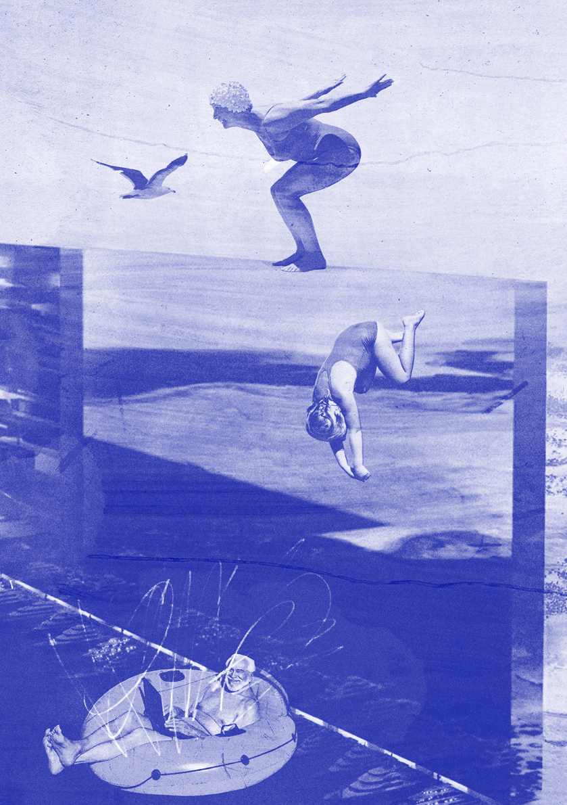
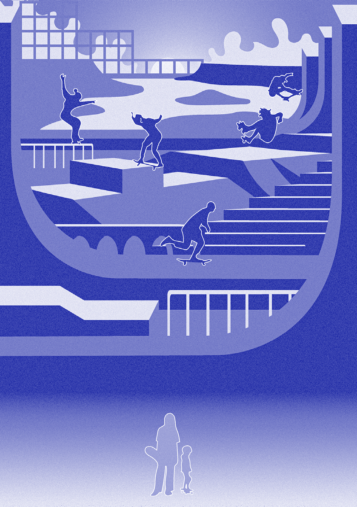
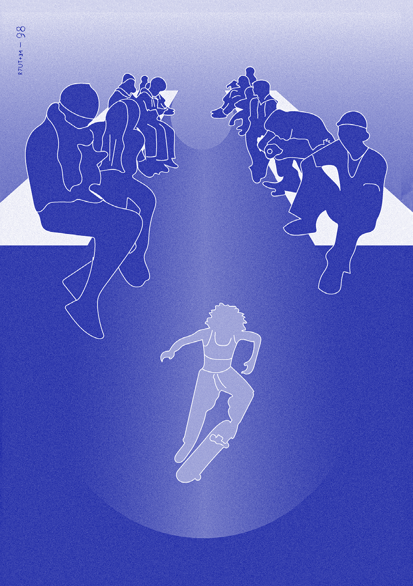
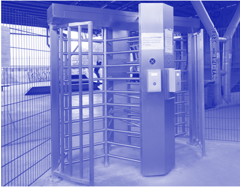
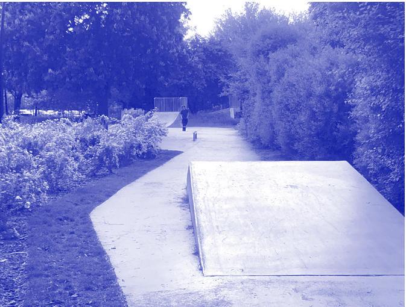

SPORTPATRIARCHAT

M A R T Y N A K ĘD R Z Y Ń S K A A N N A KOTO W S K A

# ~

Kobiety korzystają z przestrzeni publicznych rzadziej niż mężczyźni. Badania prowadzone przez Her City1 pokazują, że dziewczynki po ukończeniu ośmiu lat prawie znikają z przestrzeni publicznej, zdominowanej w 80% przez chłopców. Ich reprezentacja jest bardziej widoczna w przestrzeni prywatnej niż publicznej. Tę sytuację dobrze obrazują publiczne miejsca aktywności sportowej, tj. skateparki, skwery, parki, boiska i inne przestrzenie, które w założeniu projektowane są dla wszystkich, jednak użytkowane już przez zawężoną grupę. W czym więc leży problem? Czy dziewczyny nie lubią uprawiać sportu?

Od małego dziewczynki socjalizowane są tak, by się nie wychylały, nie przeszkadzały, nie brudziły się, nie krzyczały, dobrze wyglądały i były nastawione na spełnianie potrzeb innych osób. Powinny

- 1 Her City, Cities for Girls, Cities for All. Report from the Vinnova Innovation for Gender Equality Project, Kenia 2022.

ćwiczyć, ale najlepiej w przestrzeni domowej, w klubie fitness lub na grodzonym osiedlu. Z kolei chłopcy – przeciwnie, od dziecka mają większe przyzwolenie na uczenie się na własnych błędach, co jest dodatkowo gratyfikowane. Liczne

PODNOSZENIE KWESTII PŁCI W PROJEKTOWANIU W WIELU KRAJACH STAJE SIĘ NORMĄ. TWORZONE SĄ JEDNOSTKI ADMINISTRACYJNE, KTÓRYCH CELEM JEST ZMNIEJSZENIE

LUB WYELIMINOWANIE DYSKRYMINACJI NA POZIOMIE INSTYTUCJONALNYM, PRZESTRZENNYM I EKONOMICZNYM

siniaki, brudne ubranie, uprawnianie ryzykownych sportów, jak np. wykonywanie akrobacji na BMX-ie, są wyznacznikiem stereotypowo postrzeganej męskości.

9434 —RZUT+

Wychowanie w społeczeństwie patriarchalnym sprawia, że dziewczyny w obawie przed ciągłą oceną i nieprzychylnymi komentarzami rzadziej korzystają z przestrzeni publicznej i częściej czują się w niej niekomfortowo. Dowodzą tego badania prowadzone w 2022 r. przez Yorkshire Sport Foundation2. I choć często nieświadomy, towarzyszy im strach przed tym, co ktoś może o nich pomyśleć. W wyniku niepowodzenia, upadku, nieudanego triku na desce przykleja się im „łatkę” słabszej płci, co dodatkowo podnosi i tak wysoki próg wejścia przy stawianiu pierwszych kroków w sportach kojarzonych z płcią męską, np. w jeździe na deskorolce. Dziewczyna słabo jeździ na desce nie dlatego, że dopiero się uczy lub po prostu słabo jeździ, ale dlatego że jest dziewczyną. Jak wynika z powyższych badań, kolejnym powodem jest obawa przed nękaniem, zaczepkami i agresywnym zachowaniem mężczyzn.

Dostęp do publicznych przestrzeni sportowych, ograniczany kobietom od dziecka, ma nie tylko konsekwencje w braku poczucia przynależności do miasta, ale także wpływa znacząco na komfort życia i sprawność fizyczną oraz psychiczną. Jak podaje WHO, coraz więcej dzieci i nastolatków mierzy się z nadwagą3, co wynika z nawyków żywnościowych, ale także zmniejszonej aktywności ruchowej. Ponadto uprawianie sportu

- 2 Yorkshire Sport Foundation, Make Space for Us, raport z 2022 r. „Badania przeprowadzone zostały w trzech parkach w Yorkshire. W ciągu 10 miesięcy przeprowadzono obserwacje, warsztaty oraz ankietę online w szkołach i wśród młodzieży z okolicy (próba 456 osób), badania fokusowe i sesje. Na ich podstawie powstało sześć wytycznych do tworzenia przyjaznej przestrzeni dla nastoletnich dziewczynek, która powinna być: 1 – czysta i atrakcyjna, 2 – bezpieczna fizycznie i psychicznie,

- 3 – nieopresyjna i przeciwdziałająca nękaniu,
- 4 – zapewniająca przestrzeń do ćwiczeń dla dziewczynek, 5 – organizująca wydarzenia i kampanie skierowane do dziewczyn, 6 – kreująca bardziej atrakcyjne i pobudzające do działań przestrzenie włączające we współtworzenie”.

- 3 WHO, Obesity and overweight, raport z 2021 r.

ma charakter społeczny – zawiązywane wokół jednej zajawki relacje często pozostają na lata. Ograniczenia polegające na stereotypowym postrzeganiu ról prowadzą w przypadku kobiet i dziewczyn do wykluczenia uczestnictwa w wielu formach spędzania czasu w przestrzeni publicznej.

projektowanie inkluzywne: przykłady praktyk

Podnoszenie kwestii płci w projektowaniu w wielu krajach staje się normą. Tworzone są jednostki administracyjne, których celem jest zmniejszenie lub wyeliminowanie dyskryminacji na poziomie instytucjonalnym, przestrzennym i ekonomicznym. Urząd miasta Wiednia od 2000 r. korzysta z podręcznika Gender mainstreaming made easyjako integralnego elementu polityki miejskiej4. Sam gender mainstreamingjest definiowany przez Europejski Instytut Równość Płci jako strategia włączania perspektywy płci do opracowywanych projektów, tak by wyrównywać szanse obu grup. Efektem wprowadzania tej strategii była przebudowa kilku parków, m.in Einsiedler Park, który mimo że znajdował się na drodze do i ze szkoły, nie był miejscem spotkań dla dziewczynek. Brak przestrzeni zaprojektowanych z myślą o nich połączony z poczuciem strachu sprawiał, że przestrzeń przeznaczona do aktywności traktowana była jako tranzytowa.

Żeby dokładnie zbadać problematykę dostępności przestrzeni publicznych, Yorkshire Sport Foundation w 2022 r. przeprowadziłaMake Space for Us5 (Stwórz dla nas przestrzeń), badania użytkowników trzech parków: Ellesmere Park – Sheffield, Greasbrough Park – Rotherham i Holroyd Park – Kirklees. Pokazały one, że w przeciwieństwie do 63% chłopców tylko 34% dziewczyn z chęcią korzysta z parku.

- 4 Stadt Wien, Gender Mainstreaming – made easy. A manual, Wiedeń 2021.
- 5 Yorkshire Sport Fondation, Make Space for Us, raport z 2022 r.

Istnieje też duża dysproporcja w rodzaju wybieranej aktywności w zależności od płci: chłopcy częściej wybierają sporty grupowe, w których mogą rywalizować, dziewczyny natomiast preferują spacer, integrację ze sobą lub zabawę polegającą na współpracy. Dziewczynki także częściej niż chłopcy korzystały z przestrzeni w grupie lub w towarzystwie rodziny, co podkreśla znaczenie dobrze zorganizowanej przestrzeni z miejscami do siedzenia. Ważnym dla obu płci problemem był brak dostępności toalet oraz sztywność projektowanej przestrzeni, polegająca na braku różnorodności wyposażenia przystosowanego do zmieniającego się wieku użytkowników. Miejsca atrakcyjne dla małych dzieci tracą swój urok, kiedy te stają się nastolatkami.

Miasto Umeå od prawie 30 lat pracuje nad zmniejszeniem nierówności płciowych. W latach 90. przeprowadzono badania odnośnie do płci osób korzystających z przestrzeni sportowych w mieście. Pokazało to znaczącą dysproporcję – 70% użytkowników stanowili mężczyźni. Umeå, jako pierwsze w Szwecji, postanowiła wprowadzić kontrowersyjne wówczas rozwiązanie zwane „godzinami treningowymi”, polegające na podziale czasu treningowego dla dziewczyn oraz chłopców. Wystarczyło kilka lat, żeby na boiskach było tyle samo męskich i żeńskich drużyn6.

Kolejnym z miast przodujących w implementowaniu gender politics(polityki równościowej) jest Barcelona. W 2016 r. urząd miasta wprowadził Plan for Gender Justice (2016–2020)(Plan Równości Płci) oraz zorganizował osobną jednostkę administracyjną, której celem jest eliminacja nierówności płciowych na poziomie instytucjonalnym, ekonomicznym oraz przestrzennym. Działania obejmują szereg badań, audytów weryfikujących i konsultujących projekty pod kątem ich dostępności.

6 Umeå kommun, Gender, power & politics! 1989–2019, Umeå 2019.

konsultacje jako narzędzie włączające

Największym ograniczeniem dla kobiet jest brak poczucia bezpieczeństwa. Strach przed przemocą uniemożliwia poczucie swobody i tym samym zniechęca do korzystania z przestrzeni. W raporcie What makes a park feel safe or unsafe7

NAJWIĘKSZYM OGRANICZENIEM DLA KOBIET JEST BRAK POCZUCIA BEZPIECZEŃSTWA. STRACH PRZED

PRZEMOCĄ UNIEMOŻLIWIA POCZUCIE SWOBODY I TYM SAMYM ZNIECHĘCA DO KORZYSTANIA Z PRZESTRZENI

(Co sprawia, że parki są bezpieczne lub niebezpieczne?) zorganizowanym przez Uniwersytet w Leeds podkreślono kilka obszarów potęgujących tę sytuację, m.in.: słabe oświetlenie, wąskie ścieżki, gęsta roślinność tworząca zakamarki, brak widoczności, a tym samym kontroli społecznej, miejsca odizolowane, tj. ograniczone ogrodzeniem boiska, z tylko jedną drogą ucieczki. Obrzeża parków wymieniane były także jako strefy częściej i chętniej użytkowane niż ich wnętrza, ponieważ zapewniają one łatwość ucieczki w sytuacji zagrożenia. Według wcześniej przywołanego badania obecność chłopców w przestrzeni parku również powodowała wzmożone poczucie niepewności wśród ankietowanych dziewczyn8.

Żeby poprawić odbiór danej przestrzeni, konieczne jest szersze poznanie i pogodzenie ze sobą potrzeb poszczególnych osób, zarówno dziewczynek, jak i chłopców. Z perspektywy projektowej najlepszym narzędziem do ich poznania jest organizacja konsultacji społecznych. Pozwala na włączenie dziewczyn w proces projektowy, tak by samodzielnie mogły

- 7 A. Holmes i in., What makes a park feel safe or unsafe? The views of women, girls and professionals in West Yorkshire, Leeds 2022.
- 8 Yorkshire Sport Fundation, dz. cyt.

## 95 — — płećdziałać

9634 —RZUT+

decydować o formie aktywności – bez wypowiadania się w ich imieniu.

Oto jesteśmy i postanawiamy: same decydować o tym, czym jest dziewczyńskość. Wszyscy mają gotowe dla nas scenariusze. Mamy tego dość, chcemy być sobą

– piszą dziewczyny na łamach kwartalnika Czas Kultury9.

Powyższą problematykę potwierdzają przeprowadzone przez naszą pracownię JAZ+Miasto konsultacje społeczne. W ramach projektu skweru rekreacyjnego w Julianowie, w gminie Piaseczno, przeprowadziłyśmy szereg spotkań z mieszkankami i mieszkańcami, w których wzięło udział kolejno 112 osób (pierwszy etap), 173 osób (drugi etap) i 475 osób (drugi etap – ankieta online). Zbierałyśmy też odpowiedzi dziewczyn i kobiet uprawiających sporty wrotkarskie (deskorolka, longboard, hulajnoga, wrotki, rolki), udzieliły ich 53 osoby. Największym odkryciem okazało się całkowicie różne wyobrażenie przyszłej przestrzeni skweru w ramach grupy nastolatków. Podczas gdy wśród wyborów chłopców dominowały sporty, tj. gra w piłkę nożną, jazda na deskorolce, hulajnodze, u dziewczynek na pierwszym miejscu znalazły się miejsca spotkań. Chłopcy również je wskazywali, ale na miejscu ostatnim. Kolejnym zaskoczeniem okazał się odbiór finalnego projektu przez osobę z urzędu, która nie uczestniczyła w samym procesie konsultacji. Ponieważ starałyśmy się odpowiedzieć w nim na potrzeby wszystkich grup społecznych, mocno wybrzmiał głos tych dotychczas pomijanych. Usłyszałyśmy w pracowni, że „zrobiłyśmy za dużo ławek”, a przecież właśnie tyle było potrzebnych do stworzenia miejsc spotkań: dla seniorek z klubu seniora, grupy nastolatek, młodych mam, rodziców czy sąsiadów z nowo powstających w okolicy mieszkań.

W sierpniu 2022 r. przeprowadziłyśmy także (wspomnianą wcześniej) ankietę

9 Manifest dziewczyńskości, „Czas Kultury. Dziewczyństwo i dziewczyńskość” 2022, nr 2, s. 8.

online, opublikowaną na ogólnopolskich grupach deskorolkowych na Facebooku i Instagramie, skierowaną do dziewczyn i kobiet uprawiających sporty wrotkarskie. Pytałyśmy w niej o to, co zachęca, a co zniechęca do korzystania z przestrzeni skateparku, i co powinnyśmy uwzględnić w projekcie. Na pytanie „Co sprawiłoby, że częściej przychodziłabyś na skatepark?” najczęściej padały odpowiedzi:

- - toaleta publiczna – 65,4% głosów,
- - przyjazne otoczenie, zadbana zieleń – 51,9%,
- - lepsze zachowanie chłopaków na skateparku – 42,3%,
- - możliwość włączenia się w tworzenie miejsca – 42,3%,
- - lepsze oświetlenie – 40,4%,
- - lepszy dojazd komunikacją miejską – 38,5%.

W odpowiedzi na pytanie o pomysły na udoskonalenie skateparku w taki sposób, żeby częściej korzystały z niego dziewczynki i kobiety, padały prośby o:

- - większą liczbę ławek,
- - zróżnicowanie stopnia trudności przeszkód,
- - lepsze oświetlenie,
- - zapewnienie toalety publicznej,
- - wyznaczenie osoby odpowiedzialnej za porządek na skateparku,
- - wyznaczenie dni „tylko dla dziewczyn”.

Skatepark to jednak nietypowa przestrzeń. O ile większość dziedzin sportu polega na rywalizacji, na skateparku chodzi bardziej o działanie w ramach społeczności, co było widoczne podczas olimpiady w Tokio, kiedy wszystkie zwyciężczynie stanęły razem na jednym podium i nawzajem cieszyły się ze swoich sukcesów. W naszej ankiecie zapytałyśmy dziewczyny także o to, co sprawia, że lubią spędzać czas na skateparku. Wśród odpowiedzi dominowała chęć integracji i wspólna zabawa.

Lubię możliwość siedzenia wśród natury ze znajomymi, którzy nie patrzą cały czas w telefon”10.

”

10 Odpowiedź jednej z dziewczyn na pytanie z ankiety.

patriarchat w pl anowaniu kontr a urbanist yk a feminist yczna

Patriarchat, głęboko zakorzeniony w sposobie planowania, stworzył fundamenty, na których powstały miasta. Budynki i przestrzenie publiczne na nich budowane tworzą formę zamkniętą11, wykluczającą, do której przynależy tylko część

PROJEKTOWANIE JAKO FORMA TROSKI, OPARTE NA WRAŻLIWOŚCI, JEST W STANIE TWORZYĆ ZRÓWNOWAŻONE I ZINTEGROWANE ŚRODOWISKA, CO POWINNO STANOWIĆ JEDNĄ Z NADRZĘDNYCH ZASAD W DZISIEJSZEJ ARCHITEKTURZE

społeczeństwa. Potrzebna jest redefinicja reguł projektowych, uwzględniająca różne potrzeby występujące w społeczeństwie. Warto tutaj zaznaczyć, że grupy społeczne wynikające z podziału na płeć nie są monolitami: dzielą się na podgrupy ze względu na wiek, status społeczny i ekonomiczny, pochodzenie, poziom sprawności fizycznej. Wymaga to podejścia intersekcjonalnego, biorącego pod uwagę wszystkie zagadnienia wynikające z nawarstwionych różnic. Tak szerokie podejście wpisuje się w ramy projektowania feministycznego.

Przez ostatnie lata wzrosło w Polsce zainteresowanie przestrzeniami publicznymi, pojawiają się liczne inwestycje w postaci skwerów sportów miejskich, rewitalizacji rynków czy innych publicznych miejsc spotkań. Wierzymy, że mówiąc coraz głośniej o nierówności płci w mieście, wykonujemy krok ku kolejnej zmianie w dobrym kierunku. Projektowanie jako forma troski12, oparte na

- 11 O. Hansen, Zobaczyć świat, Warszawa 2005, s. 30.
- 12 J. Gamolina, Forms of Care: Tatiana Bilbao on Responsibility, Opportunity, and Staying True to Your Values, „Madame Architect”, www.madamearchitect.org/interviews/2021/11/29/tatiana-bilbao wrażliwości, jest w stanie tworzyć zrównoważone i zintegrowane środowiska, co powinno stanowić jedną z nadrzędnych zasad w dzisiejszej architekturze.

nowe zasady projektowe

Jak wyglądałyby zatem miasta, w których żyjemy, gdyby projektowały je osoby kierujące się zasadami feministycznymi? Czy byłyby to radykalnie inaczej wyglądające przestrzenie? Na pewno byłyby radykalnie inaczej działające. Bell Hooks wTeorii feministycznej: od marginesu do centrum podkreśla nierozłączność seksizmu, rasizmu oraz kapitalizmu jako instrumentów wyzysku, których nadrzędnym celem jest ustanowienie pozycji władzy13. Feministyczne miasto zatem nie powinno skupiać się tylko na spełnianiu postulatów poprawy jakości życia kobiet, lecz stawiać wyraźny opór systemowi, który wyklucza całe spektrum użytkowników ze względu na sytuację życiową, ekonomiczną, wyznanie, seksualność, stopień niepełnosprawności oraz płeć.

W ramach dywagacji na temat tego, czym może być miasto feministyczne, przygotowałyśmy zestaw podstawowych zasad dotyczących projektowania inkluzywnych przestrzeni publicznych.

• Miejsca spotkań

Pierwszą i najczęściej wymienianą przez kobiety potrzebą odnośnie do przestrzeni aktywności są miejsca niezobowiązujących spotkań. Uprawianie sportu ma dla nich często charakter społeczny, dlatego ważna jest obecność ławek, huśtawek, hamaków, murków, czy to na skateparku, w parku, skwerze, czy na placu.

Projektowane siedziska powinny być zwrócone naprzeciwko siebie lub pod kątem, tak by umożliwić dialog, Powinny być odpowiednio wysokie i wyposażone w podłokietniki i oparcia, co ułatwi korzystanie z nich osobom z ograniczoną mobilnością, w tym osobom starszym.

13 B. Hooks, Teoria feministyczna: od marginesu do centrum, tłum. E. Majewska, Warszawa 2022.

## 97 — — płećdziałać

## 9834 —RZUT+

Ustawienie ich w otoczeniu zatoczki umożliwiłaby opiekunom bezpieczne odstawienie wózka dziecięcego obok ławki, nie w alejce. Popularne lokalizowanie siedzisk w rzędach wzdłuż alejek jest niewskazane, gdyż tworzy efekt tzw. wybiegu dla modelek, co przyczynić się może do sytuacji catcallingu, czyli zaczepek o charakterze seksualnym. Według badań zjawisko to dotyczy 84% kobiet w Polsce14.

Otwarte w Umeå w 2016 r. miejsce spotkań Frizon jest dobrym przykładem inkluzywnego pawilonu spotkań15. Otwarta struktura wypełniona została różnego typu huśtawkami i siedziskami zaprojektowanymi z myślą o ergonomii nastolatek. Zadaszenie wraz z odpowiednim oświetleniem pozwalają na znalezienie schronienia zarówno podczas upalnego letniego dnia, jak i deszczowego listopadowego wieczoru.

• Różnorodność

Duża, otwarta, monofunkcyjna przestrzeń w łatwy sposób może zostać zdominowana przez jedną grupę użytkowników. Podział terenu na mniejsze strefy, różnicujący ich funkcję i stopień zaawansowania, pozwala na włączenie szerszego grona odbiorców. W Einsiedler Park w Wiedniu strefa zabaw podzielona została na dwie części siedziskiem, co pozwoliło na aktywność dwóm niezależnym grupom w tym samym czasie.

Zapewnienie multifunkcjonalnej przestrzeni, w której każda grupa wiekowa, od małych dzieci po seniorów, znajdzie aktywność dla siebie, ułatwia integrację międzypokoleniową. Elementy małej architektury w postaci sceny, wspólnego stołu czy zadaszonego pawilonu mogą stać się ciekawym poszerzeniem oferty skweru.

- 14 Badanie na temat molestowania seksualnego w miejscach publicznych przeprowadzone przez firmę Ipsos dla L’Oréal Polska na grupie 2000 osób w marcu 2021 r., www.lorealparis.pl/stand-up (data dostępu: 23.04 2023).
- 15 Make space for girls, https://www.makespaceforgirls.co.uk/case-studies/umea

99 — — płećdziałać

Il. 1. Przykład przestrzeni wykluczającej większość użytkowniczek i użytkowników – płatny skatepark OSiR Żoliborz

• Poczucie bezpieczeństwa

Dobra widoczność i odpowiednie oświetlenie po zmroku to podstawa. Glasgow, pretendujące do miana „pierwszego feministycznego miasta w Wielkiej Brytanii”16, zaczęło zmiany właśnie od doświetlania komunikacji pieszej. Dobrze oświetlone, szerokie ścieżki należy łączyć z bliskim dostępem do komunikacji publicznej oraz miejscem do parkowania rowerów, tak by ułatwić dostępność przestrzeni aktywności.

Kolejnym aspektem jest zapewnienie poczucia „otwartości” miejsc poprzez poszerzone wejścia oraz brak ogrodzeń. Dotyczy to przede wszystkim boisk piłkarskich czy wydzielonych przestrzeni do uprawiania sportu, gdzie wysokie siatki stwarzają wrażenie „zamknięcia w klatce” i zniechęcają do przebywania17.

• Toalety publiczne

Poprawa infrastruktury w postaci toalet publicznych stanowi podstawę myślenia o inkluzywnym mieście. Ze względu na budowę biologiczną oraz dalej istniejące tradycyjne role społeczne kobiety korzystają z toalet statystycznie częściej. Sieć dostępnych toalet w przestrzeniach

- 16 Glasgow becomes ‚UK’s first feminist city’ as town planning motion from councillor Holly Bruce passes, scotsman.com (data dostępu: 23.04.2022).
- 17 M. Sidorova i in., How to Design a Fair Shared City, Prague 2016.

10034 —RZUT+

Il. 2. BluePark na Warszawskich Bielanach, przenikanie się skateparku z zielenią publicznych, przystosowanych dla osób starszych, z niepełnosprawnościami, wyposażonych w przewijaki oraz różowe skrzyneczki, powinna być standardem projektowym.

• Kontakt z zielenią

Interakcja z terenami zieleni wpływa regenerująco na organizm człowieka. W kontraście do środowiska miejskiego krajobraz naturalny nie dostarcza tylu bodźców stymulujących, dzięki czemu przebywanie w nim pozwala zregenerować zdolność do koncentracji i poprawia wydajność wykonywanych później zajęć18.

Przestrzenie sportów powinny być projektowane tak, by pozwolić na integrację przestrzeni utwardzonych z terenami naturalnymi. Dotyczy to zwłaszcza skateparków, gdzie duża powierzchnia

18 M.G. Berman, J. Jonides, S. Kaplan, The Cognitive Benefits of Interacting With Nature, „Psychological Science” 2008, s. 1207–1212.

betonu może szybko wywołać efekt tzw. wyspy ciepła. Sadzenie w jego centrum i na obrzeżach rozłożystych drzew będzie zarówno chłodzić, jak i zacieniać, umożliwiając wygodę korzystania. Dobrym przykładem jest warszawski BluePark na Bielanach, nawierzchnia w kolorze niebieskim wkomponowana jest w przestrzeń parku Herberta. Tory do jazdy wiją się między zielenią wysoką, co pozwala na stworzenie zacienionych i bardziej kameralnych przestrzeni dla różnych grup użytkowników.

• Dostępność fizyczna

W projektowaniu feministycznym ważne jest likwidowanie barier, np. w postaci schodów czy wysokich krawężników. W kontekście sportów wrotkarskich możemy przywołać niedawną petycję19

19 Chodniki przyjazne rolkarzom i wózkom. Petycja za całkowity ogólnopolski zakaz stosowania kostki fazowanej w przestrzeni publicznej, petycjeonline. com/chodniki (data dostępu: 20.04.2023).

