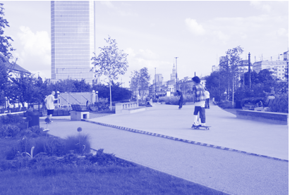

- Il. 3. Dobry przykład lokalizacji spotu przy stacji metra z gładką nawierzchnią betonową, mineralną i drewnianą. Skwer Sportów Miejskich Warszawa – Ratusz Arsenał

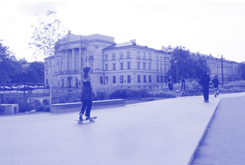

- Il. 4. Olimpiada w Tokio pokazała całemu światu, jak wspaniałą dyscypliną jest skateboarding. Od tego momentu bardzo wzrosła liczebność dziewczyn na skateparkach skierowaną do rządu, której celem było ujednolicenie nawierzchni pieszej (bez fazowego łączenia płyt chodnikowych lub stosowanie nawierzchni gładkich pod jazdę na deskorolce i wrotkach). Takie rozwiązanie zostało wdrożone w Krakowie jako tzw. uchwała rolkarska. Od 2018 r. wszystkie nowe i remontowane tylko dla kobiet, które sprawiły, że liczebność żeńskiej reprezentacji znacznie wzrosła. Tę samą zasadę można zaaplikować do pozostałych typów przestrzeni aktywności. Dobrym sposobem na wyrównywanie szans jest także włączenie dziewczynek i kobiet we współprojektowanie dedykowanej im przestrzeni. Pozwoli to na lepsze zrozumienie potrzeb oraz większe przywiązanie do przestrzeni.

• Projektowanie partycypacyjne

Żeby móc lepiej odpowiedzieć na potrzeby różnorodnych grup, potrzebna jest umiejętność prowadzenia dialogu i zdolność obserwacji. Same konsultacje społeczne prowadzone przez projektantki/projektantów nie wystarczą. Pomaga w tym współpraca z socjolożkami/socjologami, psycholożkami/psychologami środowiskowymi, i badaczkami/badaczami.

Lepszą identyfikację z przestrzenią przyszłych użytkowniczek i użytkowników ułatwia także „oddanie pola” do oddolnych działań, jak np. ścianka graffiti, dodatkowe miejsca spotkań sąsiedzkich, elementy mobilne. Ważne jest tu zachowanie balansu, by żadna z grup nie zdominowała innej •

chodniki w mieście Kraka są wykonane z niefazowanej kostki lub z asfaltu – co chwali w swojej petycji inicjatywa Europa na Rolkach.

• Dedykowane przestrzenie

Dodatkową zachętą spotykaną na skateparkach w Kanadzie czy Norwegii są tzw. dni

101 — — płećdziałać

PŁEĆ W PRZESTRZENI SYSTEMU OCHRONY ZDROWIA

M A R TA C Z AC H O R O W S K A

# ~

W dzisiejszych czasach wiadomo już, że bezpłciowe traktowanie pacjentów jest zupełnie nieadekwatne. Mimo że medycyna nie podchodzi już do kobiet w taki sposób, wiele praktyk powinno być rozszerzonych na inne płcie. Warto bowiem zrewidować, na ile podejście do przestrzeni medycznych oparte jest na stereotypowym postrzeganiu ról kobiecych i męskich, które nie są dziś już tak oczywiste. Nie należy zapominać także o tym, że współcześnie wyróżniamy nie tylko dwa rodzaje płci.

Na potrzeby tego tekstu używam określeń: „kobiety”, „damskie”, „żeńskie”, „mężczyźni”, „męskie”, zgodnie z systemem „medycyny płci”, który jest dosyć nowym pojęciem w ochronie zdrowia.

Historyczne „bezpłciowe” traktowanie pacjentów prowadziło do zagrażających życiu kobiet błędnych diagnoz, a w ich następstwie nieodpowiednich terapii. Zjawisko to określane jest syndromem Yentl, a jego nazwa została zaczerpnięta z filmu Yentlz 1983 r. Barbara Streisand gra w nim

Żydówkę z Polski udającą mężczyznę po to, aby móc zdobyć edukację. Pomijanie płci żeńskiej w badaniach klinicznych

WARTO ZREWIDOWAĆ, NA ILE PODEJŚCIE DO PRZESTRZENI MEDYCZNYCH OPARTE JEST NA STEREOTYPOWYM POSTRZEGANIU RÓL KOBIECYCH I MĘSKICH, KTÓRE NIE SĄ DZIŚ JUŻ TAK OCZYWISTE

oraz wynikające z tego błędne procedury medyczne, np. przy zawałach, opisane są szerzej m.in. w książce Caroline Criado PerezNiewidzialne kobiety. Jak dane tworzą świat skrojony pod mężczyzn.

Obecnie (…) niepodlegająca dyskusji wydaje się konieczność »niebezpłciowego« traktowania pacjentów i uwzględnianie odrębności etiologii zagrożeń i chorób, wynikających z fizjologii kobiety i współczesnych uwarunkowań jej życia

- Il. 1. Akcja terapeutyczna szpital onkologiczny, im. M. Kopernika w Łodzi, 2020-2022, fot. M. Szwałek

– pisze dr hab. n. med. Anna Posadzy-Małaczyńska, kierowniczka Katedry i Zakładu Medycyny Rodzinnej Uniwersytetu Medycznego im. Karola Marcinkowskiego w Poznaniu1.

Osoby poza płciami męską i żeńską napotykają bariery w dostępie do opieki zdrowotnej, takie jak: unikanie czy odmowa jej udzielenia, problemy z uzyskaniem skierowań, brak informacji od lekarzy oraz niewygodne lub problematyczne interakcje interpersonalne2. Tymczasem osoby transpłciowe korzystają z usług we wszystkich obszarach opieki zdrowotnej i często nie są natychmiast rozpoznawane jako osoby trans przez personel medyczny. Wdrożenie praktyk i procedur przyjaznych dla nich ułatwia pacjentom szukanie opieki, samoidentyfikację oraz pomaga zaspokajać ich potrzeby zdrowotne3.

- 1 A. Posadzy-Małczyńska, Medycyna płci: Kobieta współczesna – zdrowie i zagrożenia, red. Bartłomiej Leśniewski.
- 2 G.R. Bauer, R. Hammond i in., I don’t think this is theoretical; this is our lives: How erasure impacts health care for transgender people,“Journal of the Association of Nurses in AIDS Care” 2009, 20 (5), s 348–361.
- 3 Tamże.

Zagadnienie niuansowania spektrum płci biologicznej, społecznej i psychologicznej poruszam w tym tekście w niewielkim stopniu, choć temat funkcjonowania w przestrzeni medycznej osób nieidentyfikujących się z binarnym podziałem płciowym jest ważny i warty analizy.

Kilkunastoletnia obserwacja oddziałów szpitalnych podczas ich funkcjonowania, prowadzona w latach 2011–2022 w wojewódzkich szpitalach mazowieckich (Warszawa) oraz łódzkich (Łódź, Bełchatów, Sieradz, Opoczno, Zgierz) na potrzeby pracy związanej z projektowaniem tego typu obiektów, pozwoliła mi na sformułowanie pytań dotyczących wpływu płci na samopoczucie podczas przebywania w przestrzeni medycznej. Na początku podzieliłam specjalizacje i oddziały na te, w których płeć była ważnym parametrem (lub nie) w procesie leczenia, z wyłączeniem oddziałów dziecięcych, gdzie schorzenia są klasyfikowane neutralnie płciowo. Z tego powodu zagadnienie przestrzeni medycznych dla dziewczynek (nie-kobiet) stanowi jeden z najbardziej pomijanych aspektów przy projektowaniu.

Do przestrzeni medycznych neutralnych płciowo można zakwalifikować wysokospecjalistyczne, wyposażone w kosztowną aparaturę oddziały, gdzie opieka jest „doraźna”, takie jak: PET (pozytonowa tomografia emisyjna), przestrzenie diagnostyki obrazowej (MR, CT, RTG, USG)4, sale operacyjne, SOR, z uszczegółowieniem angiografii jako głównie „męskiej” i mammografii jako „damskiej”5.

Oddziały koedukacyjne to takie, które głównie świadczą podstawową opiekę

- 4 W 2009 r. kobiety najczęściej korzystały z usług medycznych (pozaszpitalnych oraz poza podstawową opieką zdrowotną) typu laboratorium analityczne, pracownia radiologiczna (54,9%), a następnie usług pielęgniarki i położnej (9,5%). GUS, Urząd Statystyczny w Krakowie, Zdrowie kobiet w Polsce 2004–2009, Kraków 2012, s. 64.
- 5 W 2009 r. 39,8% kobiet zdecydowało się na wykonanie mammografii. Dz. cyt., tamże, s. 50.

103 — — płećdziałać

10434 —RZUT+

medyczną. Są to oddziały ogólne, jak np.: chorób wewnętrznych, ambulatoria, przestrzenie stomatologiczne czy rehabilitacyjne.

Przestrzenie, gdzie płeć może być istotnym parametrem, to oddziały specjalistyczne i kliniczne, na których odbywa się szkolenie studentów danej specjalizacji, a pacjent/ka otrzymuje terapię celowaną, uwzględniającą parametry specyficzne (w tym płeć)6. Są to m.in.:

- • onkologie narządów rodnych – oddziały damskie (rak szyjki macicy, rak piersi, rak jajników);
- • onkologie narządów płciowych – oddziały męskie (np. rak jąder, prostata);
- • kardiologie i udary – w przewadze męskie;
- • oddziały endokrynologiczne danego schorzenia (hormony damskie, hormony męskie);
- • oddziały porodowe, ginekologiczne – damskie;
- • oddziały urazowe – przewaga mężczyzn.

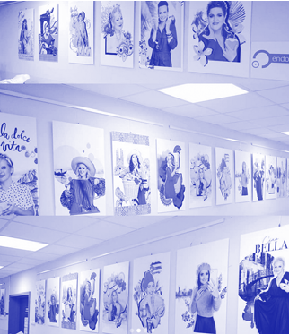

- Il. 2. Piotr Sobczak, akcje terapeutyczne, szpital im. M. Kopernika w Łodzi, 2020-2022

6 Pierwsze szpitale przeznaczone dla kobiet powstały w II połowie XIX w. (np. The New England Hospital for Women and Children w 1862 r. czy Woman’s Hospital w Nowym Jorku w 1855 r.).

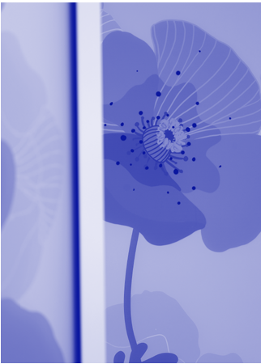

Il. 3. ICZMP, kwiaty na salach porodowych, proj. m+design, fot. HAWA

Warunki leczenia zależne od płci pojawiają się przede wszystkim w dużych miastach, gdzie występuje wiele specjalizacji klinicznych oraz wymiana wiedzy na temat szczegółowych cech pacjenta na linii student/ka medycyny – personel medyczny, czyli np. w wojewódzkich ośrodkach onkologicznych.

przestrzenie kobiece

Podczas design safari, czyli analizy in situ przestrzeni „damskiego” oddziału porodowego w szpitalu ICZMP w Łodzi oraz oddziału onkologicznego w WWCOiT im. M. Kopernika w Łodzi, przeprowadzonej przez architekta Janusza Wyżnikiewicza, zauważyłam feministyczne podejście do aranżacji przestrzeni widoczne m.in. w jej indywidualizacji poprzez wieszanie obrazów, fotografii dzieci tu urodzonych czy umieszczanie w punktach pielęgniarskich kwiatów w wazonach. Potrzeba współtworzenia własnego otoczenia występuje zwłaszcza na oddziałach onkologicznych, gdzie duży wpływ na proces terapeutyczny

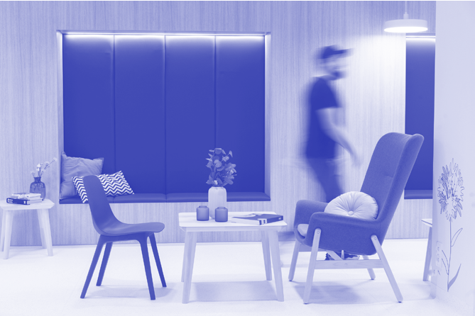

Il. 4. ICZMP, poczekalnia porodowa, miejsce spotkań m+design, fot. HAWA

105 — — płećdziałać

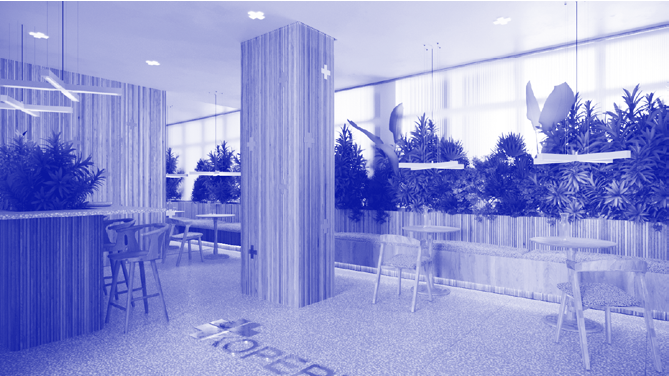

Il. 5. WWCOiT im. M. Kopernika, kawiarenka szpitalna, proj. m+design

10634 —RZUT+

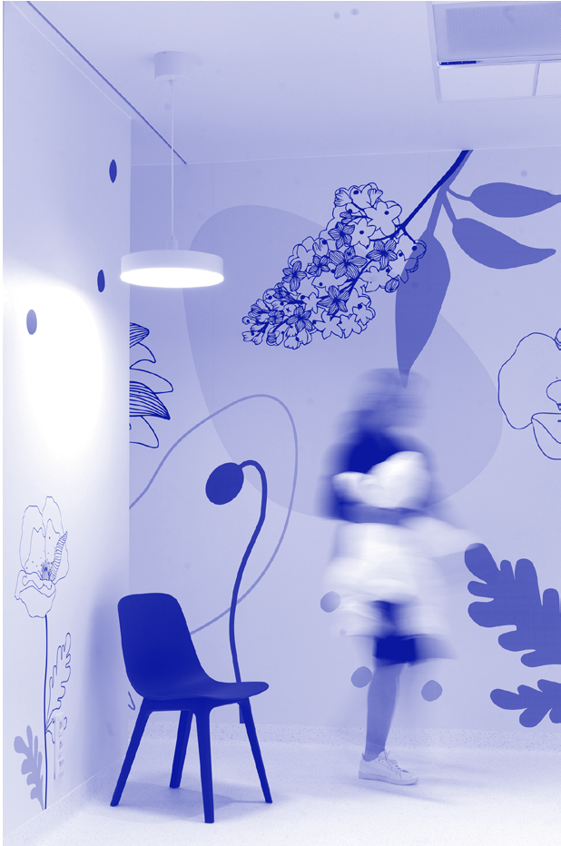

Il. 6. ICZMP, poczekalnia porodowa, miejsce spotkań, kwietna łąka, proj. m+design, fot. HAWA

Il. 6. ICZMP, poczekalnia porodowa, miejsce spotkań, kwietna łąka, proj. m+design, fot. HAWA

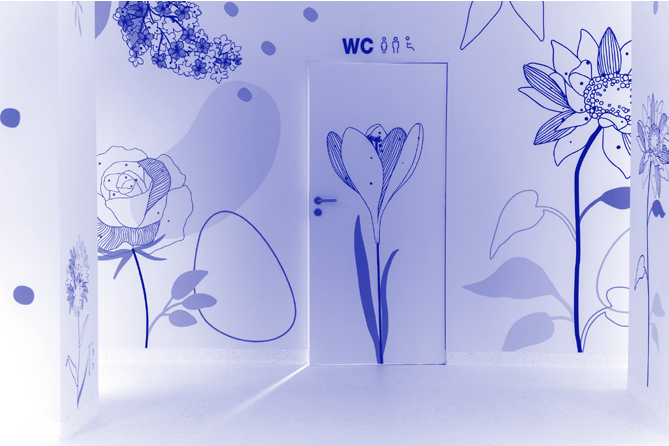

- Il. 7. ICZMP, poczekalnia porodowa, kwietna łąka, proj. m+design, fot. HAWA

## 107 — — płećdziałać mają czynnik psychologiczny oraz „oswojenie” przestrzeni, do której wraca się cyklicznie – jak ma to miejsce podczas procesu tego typu leczenia.

Kolejne zjawisko, które mogłam zaobserwować na oddziałach kobiecych, to większa gotowość pacjentek do uczestniczenia w aktywnościach niemedycznych, takich jak zajęcia teatralne, taneczne czy sesje zdjęciowe amazonek. Wymaga to jednak od szpitali tworzenia odpowiednich ogólnodostępnych i uniwersalnych miejsc, które będą mogły pełnić funkcje sportowe, rozrywkowe czy relaksacyjne. Często są nimi magazyny w piwnicy, dawne kaplice szpitalne, wydzielone fragmenty korytarzy. Są to pomieszczenia, w których nie przeprowadza się zabiegów medycznych, wymagające tymczasowej, łatwej do zmiany i własnej aranżacji przez uczestniczki arteterapii architektury scenograficznej wprowadzającej w atmosferę danych zajęć.

Kobieca wspólnotowość wiąże się zarówno z grupowymi zajęciami jogi w szpitalu, jak i wspólnym przeżywaniem choroby, czego przykładem są kluby amazonek. Pokoje do ich spotkań w ciekawy sposób wzbogacają układ funkcjonalny szpitala.

Wśród pacjentek zauważyłam również interakcje z „mieszkańcami” szpitala, większą eksplorację obiektu oraz korzystanie z usług pozamedycznych, takich

MOGĘ ZARYSOWAĆ PEWNĄ ANALOGIĘ POMIĘDZY FUNKCJONOWANIEM KOBIET W „MIASTECZKU MEDYCZNYM” A ICH CODZIENNYM NAWIGOWANIEM W REALNEJ SPOŁECZNOŚCI MIEJSKIEJ

jak: poczekalnie, hole, fryzjerzy, sklepy z perukami, kawiarenki szpitalne. Mogę więc zarysować pewną analogię pomiędzy funkcjonowaniem kobiet w „miasteczku medycznym” a ich codziennym nawigowaniem w realnej społeczności miejskiej. Eksplorowanie przez nie miasta obejmuje miejsca takie jak: fryzjer, urząd, sklep,

## 10834 —RZUT+

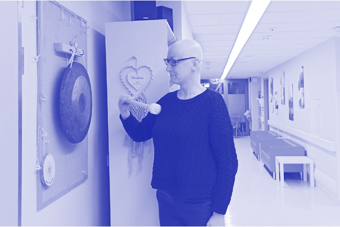

- Il. 8. Oddział onkologiczny, gong zakonczenia terapii, fot. M. Arczynska przychodnia, przedszkole, zajęcia pozaszkolne dla dzieci.

Pacjentki wykazują również większą gotowość do uczestnictwa w rytuałach wzmacniających konstrukcję psychiczną, jak np. celebracja zakończenia chemioterapii poprzez uderzenie w „dzwon zwycięzcy”, co jest symbolicznym rozpoczęciem nowego życia.

przestrzenie męskie?

Łatwo zauważyć, że przestrzenie męskie od kobiecych odróżnia obecność pewnych rozwiązań, jednak trudno wskazać cechy typowo maskulinistyczne. Oddziały zdominowane przez tę płeć po prostu nie mają niektórych obszarów charakterystycznych dla tych zapewniających opiekę głównie kobietom.

Nasuwa się kolejne pytanie badawcze: – czy łączy się to pośrednio z rolą społeczną kobiety jako wykonawczyni domowych rytuałów związanych ze świętami i tradycyjnymi obrzędami, czy też z tradycyjnym podziałem obowiązków domowych? Jako że role te przestały być jednoznacznie przypisywane do konkretnej płci, warto by było, żeby zmiany zachodzące w społeczeństwie miały swoje odzwierciedlenie

STEREOTYPOWA ROLA SPOŁECZNA JEST POWIERZCHOWNYM KLUCZEM

DO PROJEKTOWANIA FUNKCJI Z PODZIAŁEM NA MĘSKĄ I DAMSKĄ

ORAZ WYKLUCZA MĘŻCZYZN Z DOBRZE ZAPROJEKTOWANYCH PRZESTRZENI TROSKI

w funkcjonowaniu instytucji. Stereotypowa rola społeczna jest powierzchownym kluczem do projektowania funkcji z podziałem na męską i damską oraz wyklucza mężczyzn z dobrze zaprojektowanych przestrzeni troski. Dobrym przykładem są szpitalne kawiarenki, które były stereotypowo uważane za kobiece miejsce do długich rozmów przy kawie.

109 — — płećdziałać

Il. 9–12. Kwiaty informacji wizualnej, oddział porodowy, Łódź, proj. m+design

## 11034 —RZUT+

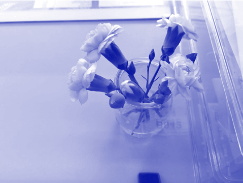

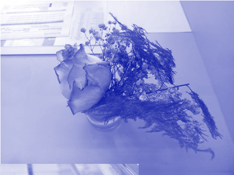

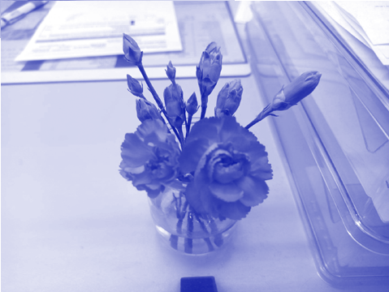

Il. 13–17. Kwiaty na ladzie rejestracji, fot. M. Arczyńska

## 111 — — płećdziałać

Udało się jednak zmienić ich postrzeganie, a następnie rozszerzyć ich funkcję. Obecnie te neutralne płciowo strefy odgrywają rolę szpitalnych świetlic zarówno

WIELE ROZWIĄZAŃ OBECNYCH NA ODDZIAŁACH KOBIECYCH ZAIMPLEMENTOWAĆ MOŻNA NA ODDZIAŁACH MĘSKICH

dla kobiet, jak i mężczyzn. Stanowią one obszary spotkań w kontekście niemedycznym, niwelujących hierarchię relacji pacjent – lekarz oraz rodzina – lekarz. Są to również miejsca, gdzie medycy o różnych specjalizacjach mogą wymieniać się doświadczeniami. Ważne jest więc, aby przy projektowaniu kawiarni szpitalnej uwzględnić różnorodne miejsca do siedzenia: stoły wielostanowiskowe, indywidualne siedziska o różnych wysokościach, kanapy, a nawet miejsca stojące. W tym kontekście warto zwrócić uwagę na rozwiązania występujące w dużych wojewódzkich szpitalach (pełnych zaułków, patiów, antresol, murków i ławek, ze specjalizacjami kobiecymi, męskimi) oraz ich wpływ na zdrowie psychiczne pacjentów.

11234 —RZUT+

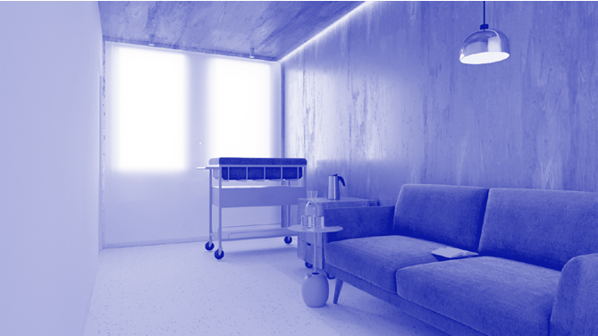

Il. 18. ICZMP, sala pożegnań noworodka, m+design, Łódź 2020

Nasuwa się ciekawy dla architektek i architektów projektujących oddziały szpitalne wniosek. Wiele rozwiązań obecnych na oddziałach kobiecych zaimplementować można na oddziałach męskich. Dotyczy to zarówno pomieszczeń do wspólnych zajęć, pomagających grupowo przeżywać chorobę, jak i projektowania przestrzeni w sposób umożliwiający pacjentom ich indywidualizację. Ponadto na oddziałach onkologicznych, również męskich, powinno się wprowadzić miejsca do odbywania ceremonii przejścia ze stanu leczenia do wyzdrowienia. W programie funkcjonalnym można zawrzeć choćby 1 m2 przestrzeni służącej do symbolicznego pożegnania z oddziałem.

Wzorem adaptacji rozwiązań przeznaczonych dla jednej z płci do innych są oddziały Maggie’s Centre, w których wykorzystywana jest scenografia do „miękkiego” leczenia. Są to ośrodki nieszpitalne wspomagające leczenie onkologiczne poprzez spotkania, rozmowy z psychologiem, budowanie więzi pacjenckich. To obiekty zatopione w zieleni, wyposażone w sale spotkań, jadalnie, kuchnie do wspólnego gotowania, zaprojektowane przez wybitne architektki i architektów. Są to miejsca oswajające proces leczenia7. Początkowo przeznaczone były one dla kobiet, a potem sukcesywnie dla kolejnych płci.

Maggie’s Centres powstały w wyniku osobistych doświadczeń choroby onkologicznej Maggie Keswick Jencks, która zachorowała na raka piersi w wieku 47 lat i zmarła w 1995 r. Pierwszy taki ośrodek powstał w Edynburgu w 1996 r. Centra te stworzono w odpowiedzi na poszukiwanie miejsc przyjaznych kobietom i ich rodzinom w całym procesie leczenia onkologicznego – od chemioterapii, chirurgii, radiologii, aż po naukę walki ze stresem i proces rekonwalescencji, który może trwać całe życie8. Zgodnie z filozofią Keswick Jencks nikt nie powinien „tracić radości życia, żyjąc w strachu przed śmiercią”. Architektura odgrywa kluczową rolę w realizacji tego celu, bo może stanowić przestrzeń wspierającą zdrowienie. Współpomysłodawcą architektury

- 7 Lęk przed operacją/leczeniem stanowił 21,1% przyczyn rezygnacji z leczenia szpitalnego przez kobiety w mieście i 25,6% na wsi. GUS, Urząd Statystyczny w Krakowie, dz. cyt., s. 61.
- 8 Spośród wszystkich hospitalizowanych kobiet w polskich placówkach medycznych blisko 77% stanowiły pacjentki z długotrwałymi problemami zdrowotnymi (około 63% w 2004 r.), natomiast kobiety chorujące przewlekle – prawie 81%. GUS, Urząd Statystyczny w Krakowie, Tamże, s. 62.

