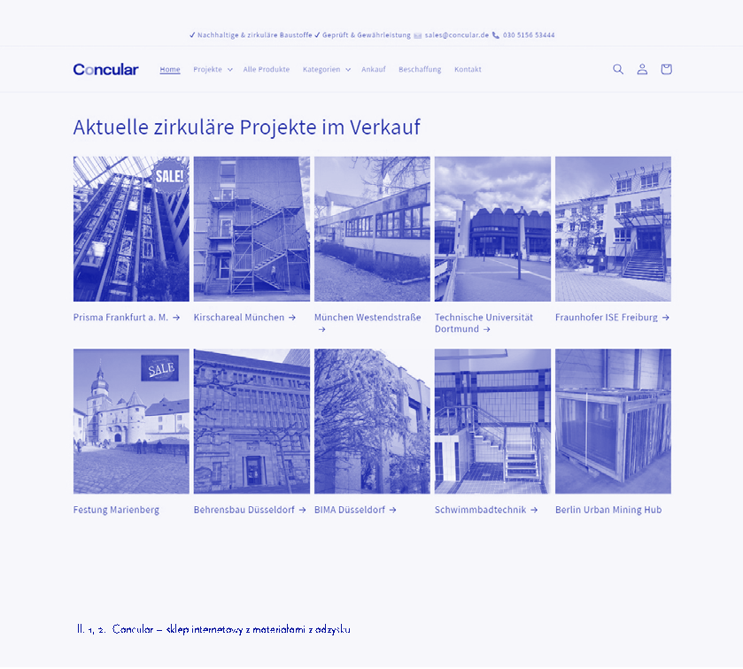
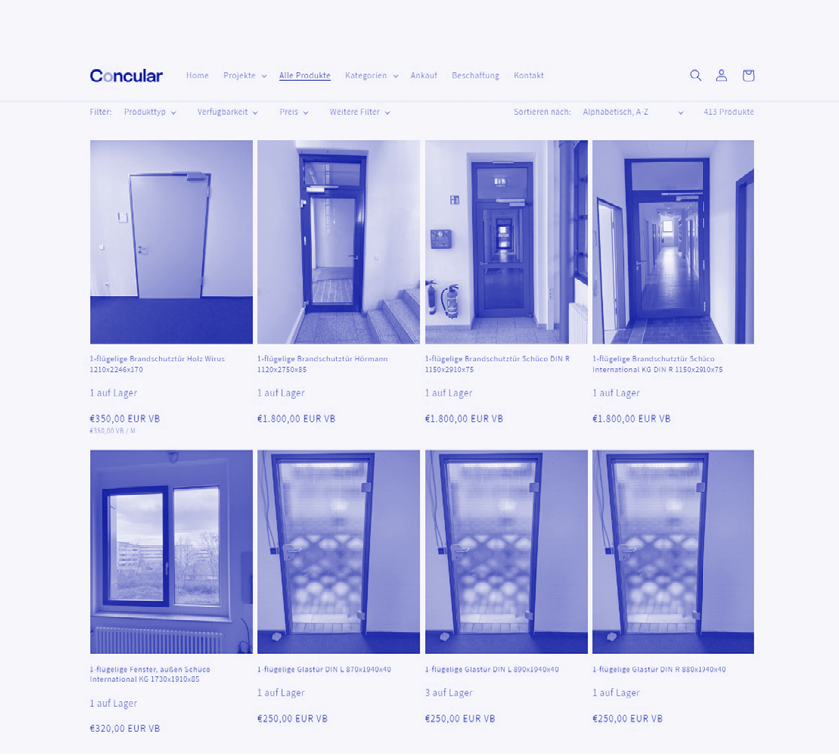
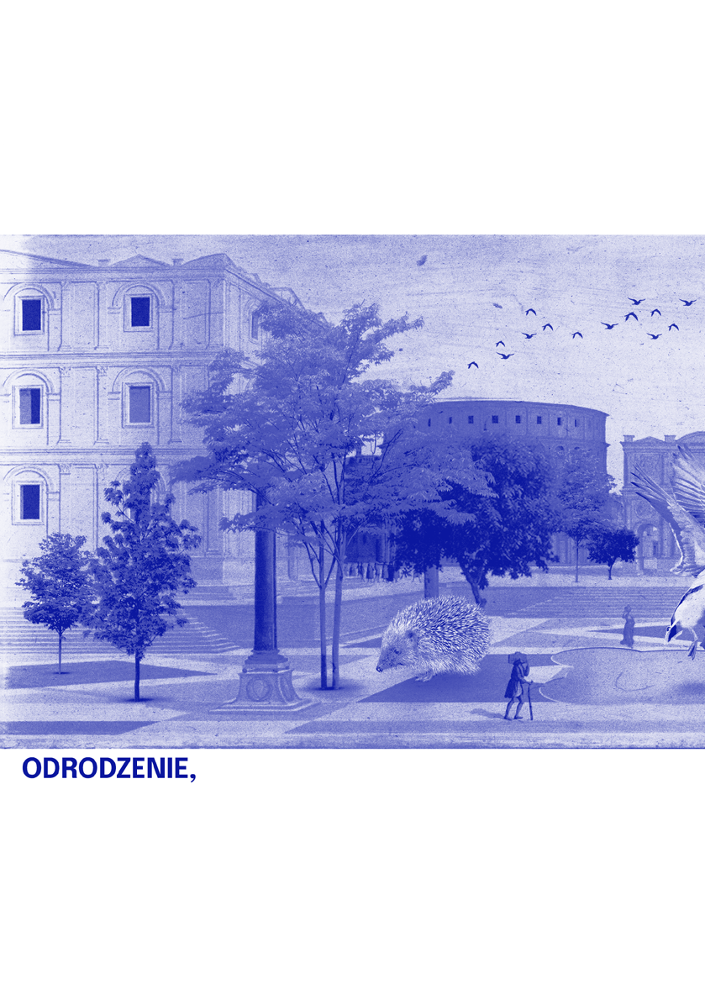

przyjaznej pacjentkom onkologicznym był mąż Maggie – Charles Jencks, teoretyk kultury, projektant krajobrazu oraz historyk architektury, autor książki The Architecture of Hope, gdzie zostały opisane budynki oferujące wsparcie emocjonalne, arteterapię, dramaterapię, terapię ruchem, a przede wszystkim hortiterapię.

prz yszłość

Elementy architektoniczne, które mogą wspierać miękkie kompetencje w procesie leczenia, to przykładowo:

- • punkt pielęgniarski jako centrum integracji i życia społecznego oddziału oraz odwiedzających;
- • kuchenka oddziałowa jako miejsce niezobowiązujących interakcji przy parzeniu herbaty, bycia ze sobą bez konieczności rozmowy;
- • łazienki i strefy pielęgnacji pacjentek lub pacjentów wyposażone w siedziska, bidety, pochwyty, deszczownice, jezdne wanny łóżkowe, jako miejsca dbania o ciało w kontekście kosmetycznym, a nie medycznym;
- • wewnątrzoddziałowe sale rehabilitacji (udarowe, onkologiczne, kardiologiczne), jako miejsca przywoływania ulubionych czynności, ćwiczeń rehabilitacyjnych podczas pracy na neuronach lustrzanych;
- • pokoje pożegnań noworodków na oddziałach porodowych projektowanych z empatią, pozbawione symboli religijnych, jako miejsce rozmów z psychologiem, proces leczenia traumy jeszcze w przestrzeni medycznej.

Powyższe rozwiązania można implementować w projektach oddziałów neutralnych płciowo lub przeznaczonych dla mężczyzn, jak np. pomieszczenia pro mortewzorowane na przestrzeniach pożegnań noworodków, wyłożone okładziną drewnianą czy wyposażone w siedziska dla rodziny.

Architektura feministyczna (uwzględniająca m.in. to, że pacjent ma dzieci, rodzinę) nie leczy, natomiast może wspomóc personel medyczny w tym procesie. Odpowiednio zaprojektowane, przyjazne, „miękkie”, „kobiece” przestrzenie mogą zachęcić pacjentki i pacjentów do diagnostyki i rehabilitacji czy po prostu do pobytu w placówce leczniczej. Mam nadzieję, że te feministyczne, pełne troski o użytkowniczki rozwiązania architektoniczne stopniowo przenikną z oddziałów damskich do męskich.

Takie podejście do projektowania można aplikować na oddziałach chorób obu płci jako dobrą, empatyczną oraz inkluzywną praktykę wspomagającą procesy zdrowienia, leczenia oraz diagnostyki. Warto mieć na uwadze, że wsparcie społeczne i psychiczne to również kolejne istotne elementy terapeutyczne obok leczenia fizjologicznego.

Na wstępie założyłam, że na kształtowanie przestrzeni medycznych największy wpływ będzie miała płeć biologiczna (sex), jednak najbardziej wyraziste pod kątem aranżacji przestrzeni okazały się dla mnie płeć społeczna i kulturowa (gender). Zauważenie roli płci społecznej w kształtowaniu przestrzeni medycznej, wniknięcie w przepisy techniczne czy wytyczne epidemiologiczne stały się ciekawym sposobem eksploracji jej obszarów, co doprowadziło do sformułowania wniosku, że feministyczna architektura troski przeniesiona na grunt oddziałów męskich może przynieść wymierne efekty lecznicze •

## 113 — — płećdziałać

# BUDOWNICTWO W TKANCE ISTNIEJĄCEJ

# ~

rozmowa z Annabelle von Reutern, dyrektorką ds. rozwoju w Concular oraz Dianą Anastasiją Radke, partnerką zarządzającą w KVL Bauconsult GmbH

rozmawiała: Katarzyna Dolecińska

Sektor budowlany jest jednym z najbardziej zasobochłonnych sektorów gospodarki. Według niemieckiego Federalnego Urzędu Statystycznego w 2013 r. zużyto 534 mln ton mineralnych surowców budowlanych. Zasoby budynków i infrastruktury budowlanej z szacowanymi 28 miliardami ton (stan na 2010 r.) są obecnie znaczącym magazynem surowców stworzonych przez człowieka, które po zużyciu można poddać recyklingowi. Jednocześnie jedynie 1% wszystkich wbudowanych materiałów jest ponownie wykorzystywany. Najczęściej po rozbiórce są one poddawane utylizacji. Ogromne ilości drewna, plastiku, okien i płytek trafiają do śmieci. Jest to tym bardziej zaskakujące, jeśli weźmiemy pod uwagę to, że kolejne projekty budowlane są pilnie uzależnione od tych właśnie budulców.

Próbę rozwikłania tej problematycznej sytuacji podjął start-up Concular. Opracował on portal, który łączy podaż i popyt. Istniejący wbudowany materiał jest wprowadzany do internetowej bazy danych. Zarejestrowani użytkownicy znajdą go w magazynie lub zostaną powiadomieni, gdy towar, którego szukają, dotrze. Wszystko, co jest rozbierane z budynku istniejącego, może zostać dostarczone bezpośrednio na nowy plac budowy. Oszczędza to koszty magazynowania i transportu. Aplikacja jest korzystna zarówno dla deweloperów, jak i dla firm produkcyjnych szukających tańszych surowców, przykładowo do wyrobu ścian z płyt gipsowo-kartonowych. Gips jako produkt uboczny z przetwarzania węgla na energię elektryczną jest obecnie towarem pożądanym, gdyż wydobywa się coraz mniej węgla, a co za tym idzie, jest coraz mniej gipsu. Odpowiedzią jest rynek wtórny, który ułatwia aplikacja mobilna Concular. Kierująca ekspansją start-upu Annabelle von Reutern, będąca z wykształcenia architektką, koordynuje projekt pilotażowy na terenie dawnego browaru w Berlinie-Neukölln, którego celem jest zaprezentowanie zasadycircular house. Zbudowany głównie z materiałów wtórnych gmach oferuje niedrogie mieszkania, przestrzenie na imprezy i biura, z których jedno będzie przyszłą siedzibą firmy.

Deweloperom, którzy w idei zrównoważonego rozwoju oraz obiegu surowców są nadal lekko zagubieni, służy pomocą specjalizująca się w ekologicznych projektach KVL Group, na której czele stoi Diana Anastasija Radke.

To dynamiczne duo w lutym tego roku wraz z innymi pasjonatami architektury z recyclingu założyło w Berlinie Stowarzyszenie na rzecz budownictwa w tkance istniejącej1. W jego zarządzie zasiadły wyłącznie kobiety, a sama organizacja ma zdecydowanie więcej członkiń niż członków. To celowe działanie czy kobiety chętniej podejmują się właśnie takich zadań projektowych?

~ Katarzyna Dolecińska

1 Verband für Bauen im Bestand (niem.).

Annabelle von Reutern (kierowniczka Business Development, Concular GmbH): Studiowałam architekturę w Akwizgranie i Berlinie, a potem pracowałam w biurach projektowych w Kolonii. Nie podobało mi się to i nie chcę już więcej pracować w klasycznym biurze projektowym. Uważam, że architektura ma dużo więcej do zaoferowania niż fazy 1–92. Byłam też współzałożycielką stowarzyszenia Architects for Future i stworzyłam grupę regionalną w Kolonii. Spędziłam rok, zastanawiając się, co tak naprawdę chcę robić w życiu, skoro nie pracuję w biurze projektowym, i zdecydowałam się pójść do Conculora. Wprowadzamy tu używane materiały budowlane do ponownego obiegu, inwentaryzując komponenty, które mogą być ponownie wykorzystane. A moim osobistym celem w życiu jest zniszczenie patriarchatu i doprowadzenie do rewolucji budowlanej.

Diana Anastasija Radke (partnerka zarządzająca KVL Bauconsult GmbH): Jestem trochę starsza od was i niestety nie mam tej samej pewności siebie, którą bardzo cenię w osobach siedem, osiem lat młodszych ode mnie, a które zostały wychowane z zupełnie innym spojrzeniem na świat. Ja wciąż muszę pracować nad moim postrzeganiem samej siebie i innych kobiet. Nadszedł czas, w którym zniszczenie patriarchatu jest nie tylko dobre dla kobiet, ale jest także najlepszą rzeczą, jaka może spotkać mężczyzn. Nie mam wyższego wykształcenia, a pracę w KVL rozpoczęłam siedemnaście lat temu po odbyciu stażu. Byłam wówczas trzecią pracownicą kontraktową. Wspólnie rozwinęłyśmy firmę i obecnie zatrudniamy 270 osób. Zawsze byłyśmy bardzo zainteresowane działaniem zgodnym z zasadami zrównoważonego rozwoju. Obliczyłyśmy, że jako firma produkujemy 66 ton CO2

2 Leistungsphasen1–9 określają poszczególne etapy pracy architektki lub inżynierki w zakresie planowania i realizacji projektów budowlanych.

rocznie. Odpowiada to 2600 m2 stropu żelbetowego. Zrozumiałyśmy, że zamiast koncentrować się na mikroobszarze samego funkcjonowania biura, powinnyśmy zwiększać wydajność w projektach dla naszych klientów. Wówczas naprawdę możemy coś zmienić. Oczywistą konsekwencją tej obserwacji stało się budowanie w istniejącej tkance. Ponieważ żelbetowe stropy zostały już wylane, ich zachowanie sprawi, że zużycie energii zostanie ograniczone, a emisja CO2 zminimalizowana. To nasz główny cel i powód, dla którego założyłyśmy stowarzyszenie.

~Katarzyna Dolecińska: Jak to się stało, że się poznałyście?

A.vR.: Inicjatorem powstania organizacji była firma Greyfield pochodząca z Essen, z Zagłębia Ruhry. To deweloper, który zajmuje się wyłącznie rozbudową istniejących nieruchomości. Bardzo się starają pokazać zużycie szarej energii i sprawić, by nasycanie tkanki istniejącej stało się bardziej popularną strategią inwestycyjną. Szukali kogoś, kto by do nich pasował, kto walczy na tym samym froncie. Napisali do różnych osób, m.in. do nas.

D.A.R: My znałyśmy się już wcześniej, bo wszystkie osoby zajmujące się tym tematem żyją w małej bańce.

A.vR.: Skąd w tej inicjatywie wzięło się tak dużo kobiet? Zostałyśmy zaproszone! Z pewnością dlatego, że już to robiłyśmy i byłyśmy aktywne na tym froncie, prawda?

D.A.R.: Dla mnie to nieco rozczarowujące, że tylko kobiety są w zarządzie, ale tak wyszło. Powstanie stowarzyszenia zostało dobrze przyjęte, ale niemal tyle samo komentarzy uzyskałyśmy ze względu na posiadanie czterech członkiń zarządu, co mnie irytowało.

## 115 — — płećdziałać

Il. 1, 2. Concular – sklep internetowy z materiałami z odzysku

A.vR.: To nie było zamierzone. Po prostu osoby, które coś w tym temacie robią, zebrały się razem i akurat były to kobiety.

D.A.R.: Dlaczego kobiety są tak powściągliwe i nie czują potrzeby budowania nowych obiektów, tylko działania w istniejącej tkance? Może takie pytanie powinnyśmy zadać? Myślę, że odpowiedź może być banalnie prosta: bo kobiety mogą mieć dzieci. Mogą zostawić coś na zawsze. Mężczyźni muszą tworzyć sobie pomniki, czy to poprzez nowe budowle, literaturę, filmy, piosenki, dzieła sztuki. A my tego nie potrzebujemy.

A.vR.: Mamy w sobie reprodukcję.

D.A.R.: I możemy się zająć innymi rzeczami. A może brakuje nam ego? Może to kwestia wychowania?

A.vR.: Kobiety są zniechęcane do wysuwania się na pierwszy plan i przechwalania się. A to właśnie się dzieje, kiedy się prezentujesz na sympozjum albo poprzez budynek. Jeśli pewnym tonem mówię, że coś wiem oraz że to, co proponuję, jest o wiele lepsze od pozostałych pomysłów, wszyscy myślą: „bitch”. A gdy robi to mężczyzna, mówią: „Geniusz! Rzeczywiście ma lepszy pomysł”.

D.A.R.: Nie zostałam wychowana w takiej pewności siebie. Moi rodzice są emigrantami i mają już 93 lata. Wzrastałam raczej w cieniu poleceń typu: „proszę ustawić się z tyłu i być bardzo cicho”. Należy nie istnieć i nie przyciągać uwagi.

A.vR.: Jako kobieta powinnaś wykonywać prace pielęgnacyjne we wszystkich dziedzinach życia, a pielęgnacja nie jest pracą twórczą. Więc ta praca nie powinna być na pierwszym planie, ale raczej pozostać niezauważalna, gdzieś daleko w tle.

D.A.R.: Budowanie w tkance istniejącej to również praca pielęgnacyjna.

A.vR.: W maju rozpocznie się Biennale Architektury i ten temat zostanie podjęty w pawilonie niemieckim. Projekt nazywa się „Otwarte do konserwacji”, co oznacza konserwację, która nie chowa się za zamkniętymi drzwiami. Będzie można zobaczyć, jak wyglądają prace pielęgnacyjne budynków, łącznie z czyszczeniem, przygotowaniem, naprawą. Jest taki termin Instandbesetztung 3, oznaczający zajmowanie domów w celu ich ochrony przed popadnięciem w ruinę. Jak widać, jest co robić. Jednocześnie

3 Instandbesetztung– połączenie słów Instandsetzung– renowacja oraz Besetzung– okupowanie/squatting.

11834 —RZUT+

nie ma to chyba nic wspólnego z płcią, ale raczej z tym, jacy ludzie są oraz jak zostali wychowani. Grupa z Biennale Architektury to nie tylko kobiety. Nie chcę być cytowana za pośrednictwem takich zdań jak „kobiety są lepszymi ludźmi”.

D.A.R.: Dla mnie miasto to ciało, a budynki to tkanki miękkie, mimo że architektura kojarzy się raczej z czymś twardym i skalistym. Tkanki miękkie pozwalają miastu funkcjonować Są też otoczone nią narządy, które są wyjątkowe, ponieważ pełnią specjalną funkcję. Kościół, budynek administracyjny, budynek oświaty, biblioteka, sala koncertowa. Te wszystkie narządy mogą też bębnić w klatce piersiowej, mogą błyszczeć i migotać. Stowarzyszenie na rzecz budynków istniejących nie jest przeciwne nowemu budownictwu. Chce umożliwić bezinteresowne, inteligentne podejście do rzeczywistości, która już została zrealizowana.

A.vR.: Gdy widzę wyburzane budynki, silnie odczuwam to, że ludzie nie uczą się doceniania tego, co mają. Mówią: „To jest brzydkie, przestarzałe i już nie działa”. Brakuje uznania dla twórczości i pracy innych. Wiemy, jak wyczerpujący jest proces projektowy i ile osób jest w niego zaangażowanych. To bardzo aroganckie tak po prostu machnąć ręką i powiedzieć: „mam lepszy pomysł” .

D.A.R.: Nad tymi obiektami pracowali tacy sami ludzie jak my, tylko 10–20 lat wcześniej. Burzenie to rodzaj arogancji w stosunku do przeszłości. Za każdym razem, gdy niszczymy budynek z lat 50., 60., 70., 80., 90., wyrywamy stronę z podręcznika historii. Tak jest w Berlinie, który przed wojną miał nienaruszoną strukturę urbanistyczną. Był wzorowym miastem swoich czasów, jak Paryż lub podobne miasta. Po zniszczeniu nie można było tak po prostu podnieść miasta z ziemi i pozwolić mu znowu błyszczeć w ten sam sposób. Berlin to właśnie różnorodność architektury. Różne czasy, różne możliwości i środki wznoszenia budynków. Z pewnością nie każdy budynek na Kudamm4 jest piękny w dzisiejszym tego słowa znaczeniu, ale odpowiada duchowi czasów, w których powstał. Warto docenić tę tożsamość. Czy musi znowu powstać Zamek Miejski5 i wszystko musi zostać odbudowane po staremu? Może warto czasem odpuścić?

A.vR.: Zamek w Berlinie jest dla mnie najlepszym przykładem. Byłam członkinią think tanku zajmującego się schinklowską Bauakademie6, gdzie byli ludzie forsujący ideę odbudowy Zamku Miejskiego. Używali argumentu: „historii miasta nie da się zmyślić”. Tak, zgadzam się z nimi! Dlatego nie rozumiem, dlaczego odbudowano ten obiekt, a Pałac Republiki zburzono. Przecież pałac nadal był, a zamek już nie. To była historia.

~W latach 80. została założona, między innymi przez Zahę Hadid, feministyczna organizacja planistek i architektek. Stworzyły one „kobiece projekty” budynków, które były zorientowane na zrównoważony rozwój, energooszczędność i stawiały nacisk na aspekty związane z osobami starszymi i niepełnosprawnymi. Minęło 40 lat i jest to dla mnie zdumiewające, że kobiety po prostu nie doszły do głosu. Bo te problemy w projektowaniu nadal są obecne.

D.A.R.: Wcale nie uważam tego za zdumiewające.

A.vR.: Walka jest bardzo wyczerpująca. Nie wierzę, że istnieje coś takiego jak

- 4 Potocznie o ulicy Kurfürstendamm w berlińskiej dzielnicy Charlottenburg-Wilmersdorf.
- 5 Berliner Schloss, Berliner Stadtschloss, odbudowany w latach 2013–2020 w swojej oryginalnej lokalizacji. Jego ruiny z czasów II wojny światowej zostały w latach 50. zrównane z ziemią na polecenie władz NRD, a na jego miejscu powstał tzw. Pałac Republiki pełniący funkcję siedziby Izby Ludowej, parlamentu Niemieckiej Republiki Demokratycznej.

kobieca architektura. Istnieje może architektura, którą tworzą kobiety. Wszyscy mamy w sobie część żeńską i męską. Różnica polega na tym, że jako kobiety jesteśmy bardziej zaznajomione z tym rozległym obszarem tematycznym. To znaczy, że wiemy, jak to jest jeździć z wózkiem dziecięcym, z wózkiem inwalidzkim, opiekować się starszymi. Kiedy to wiesz, twoja perspektywa się zmienia. Gdyby mężczyźni częściej wykonywali prace pielęgnacyjne, architektura by się zmieniła. W książceNiewidzialne kobiety, napisanej przez Caroline Criado Perez, pokazane jest, jak świat został stworzony przez mężczyzn dla mężczyzn.

D.A.R.: Ale czy można ich winić? Nie. To ważne, że jako kobieta mówisz, czego chcesz. Nie nauczono nas, aby jasno wypowiadać życzenia, stawiać wymagania, formułować je dokładnie oraz we właściwym czasie.

A.vR.: Wiele kobiet, tak jak Zaha Hadid, przystosowało się do przetrwania w tym zbiorniku z rekinami. Żeby zrobić karierę, zmieniła podejście i zaczęła robić projekty z „efektem wow”. To się lepiej sprzedaje i jest bardziej widoczne. A dobra architektura, która jest funkcjonalna dla ludzi, ale powściągliwa w formie, jest mniej spektakularna. Tego nikt nie widzi. Dlaczego Angela Merkel zawsze nosiła to samo spodnium? Żeby nie pisano o jej ciuchach. Całkowicie zrozumiałe.

D.A.R.: Gdy pani Merkel pokazała odrobinę dekoltu, rezonowało to w prasie kilka tygodni. „Jeśli nie możesz ich pokonać – dołącz do nich”.

A.vR.: Naprawdę ekscytujące jest otwieranie się i pokazywanie swojej bezbronności. Wtedy daję przestrzeń innym, którzy również mogą mieć słabości.

6 Mowa o budynku Berlińskiej Akademii Budowlanej zbudowanej w latach 1832–1836 na podstawie projektu architekta Karla Friedricha Schinkla.

D.A.R.: Tylko wtedy możemy poznać nasze potrzeby i wiedzieć, jak sobie nawzajem pomagać. A w naszej branży nie ma problemów. Zawsze są wyzwania.

~ Czy jesteście zdania, że kobiety w architekturze są szansą na bardziej zrównoważone budownictwo?

A.vR.: Tak. Zrównoważony rozwój to stwierdzenie faktu, że znów czujemy się całością jako kolektyw. Celem jest chronienie naszej planety. A połowa światowej populacji nie została jeszcze zapytana o to, jak chce o nią walczyć. Świat wygląda tak, jak wygląda, ponieważ jest oparty na systemie wyzysku. Jeśli pozwoli się teraz drugiej połowie światowej populacji odgrywać swoją rolę na kluczowych stanowiskach, świat się zmieni. To jedyna szansa, aby odwrócić tę sytuację •

119 — — płećdziałać

