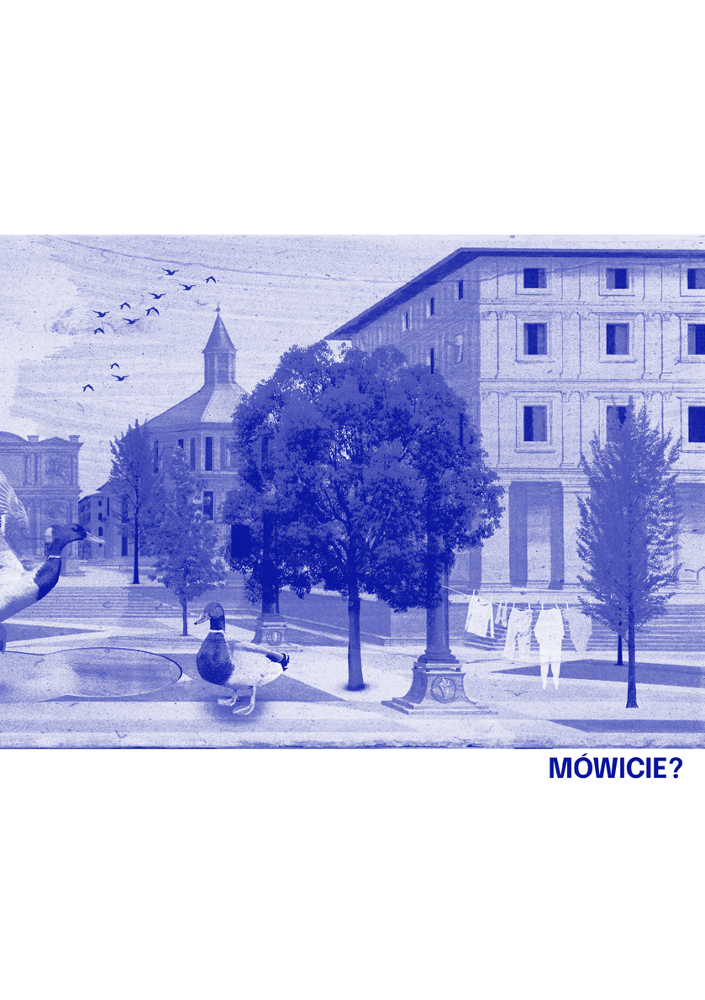
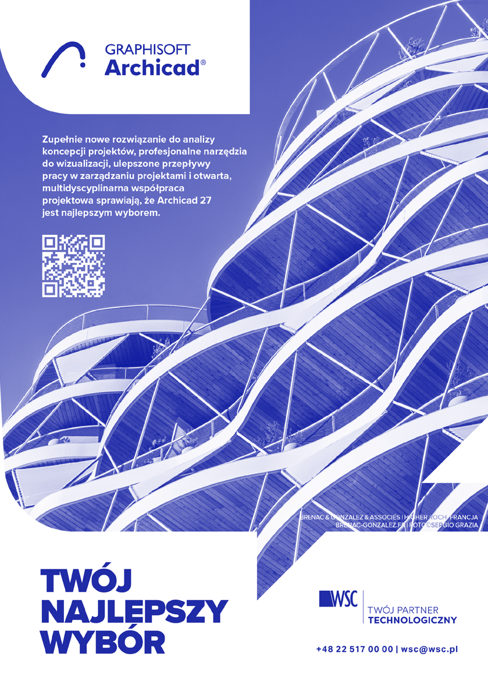
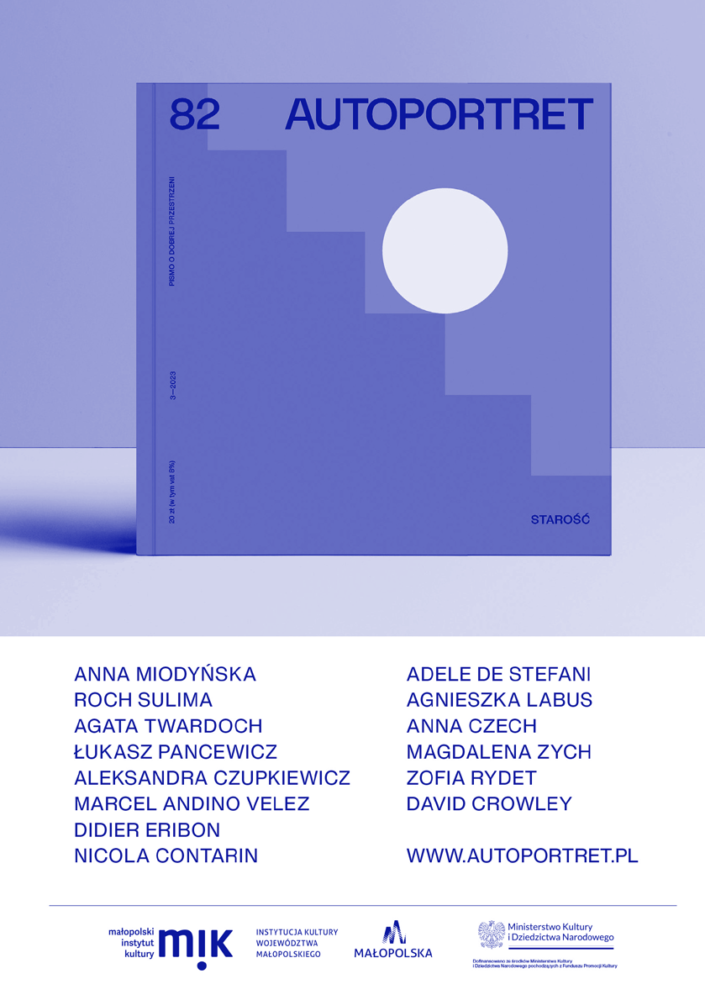
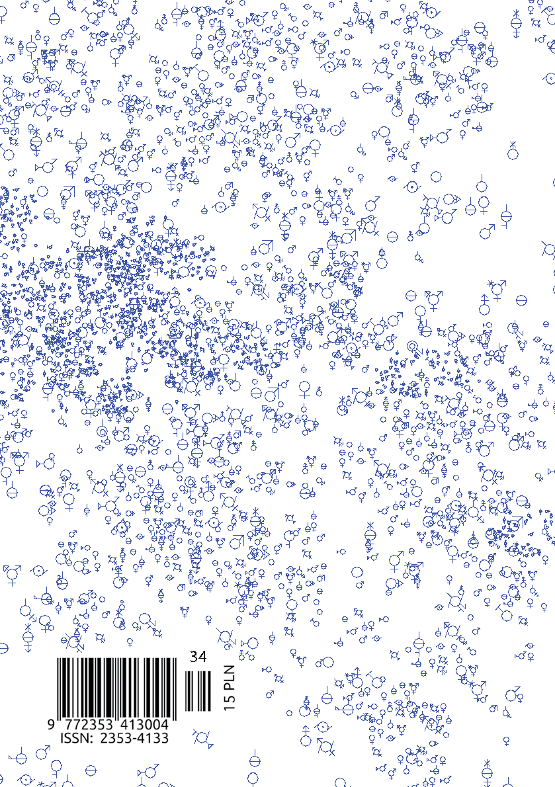

A U T O R K I I A U T O R Z Y

Marta Czachorowska• Architektka, zawodowo i naukowo zajmuje się przestrzeniami troski, medycznymi, terapeutycznymi, spa i wellness. Wierzy, że dobrze zaprojektowane miasto oraz budynki mogą mieć pozytywny wpływ na zdrowie fizyczne oraz psychiczne mieszkańców. Laureatka nagrody architektonicznej „Zaprojektowane po ludzku”, konkursu organizowanego przez Gazetę Wyborczą oraz Otodom oraz Red Dot Design Award w kategorii Brands & Communication Design, za oddział położniczo-ginekologiczny w ICZMP w Łodzi. Architektka prowadząca w biurze m+design (mplusdesign.eu).

Katarzyna Dolecińska • Architektka, absolwentka Wydziału Architektury Politechniki Krakowskiej. Studiuje podyplomowo konserwację zabytków na Bauhausakademie w Weimarze. Mieszka w Berlinie, gdzie pracuje dla Studia Qwertz oraz prowadzi swoje biuro zajmujące się m.in. inwentaryzacją obiektów historycznych. Interesuje się zrównoważonym rozwojem miast i ochroną środowiska, a jej pasją jest wspinaczka sportowa.

Magdalena Gauden• Studentka 3. roku architektury w Bartlett School of Architecture na University College London w Londynie. Odbyła staż w Hamburgu w biurze Jan Braker Architect. Absolwentka Krajowego Funduszu na Rzecz Dzieci. W swoich projektach skupia się na rewitalizacji opuszczonych obszarów miejskich, włączaniu gospodarki o obiegu zamkniętym i projektowaniu angażującym lokalne społeczności.

Aleksandra Gryc•Architektka, absolwentka Politechniki Krakowskiej. Studiowała w Wiedniu i Berlinie, ukończyła studia podyplomowe z projektowania usług na warszawskim SWPS. Pracowała w tokijskim biurze Sou Fujimoto, berlińskich i polskich pracowniach architektonicznych. Od 8 lat pełni funkcję opiekunki warsztatów OSSA. Obecnie mieszka w Warszawie i projektuje wystawy. Głęboko wierzy w kolektywność i kobiety.

Post Studio Noviki• Kontynuacja projektowego studia Noviki, zainteresowani są tworzeniem alternatywnych ram dla projektów eksplorujących projektowanie, praktykę kuratorską i wystawienniczą w post-artystycznym świecie. Pracują w obszarze zderzenia postkonceptualizmu i narzędzi opartych na technologii. Charakterystyczną cechą Post Noviki jest otwartość na wymianę z innymi dyscyplinami, funkcjonującymi poza oficjalnym rynkiem sztuki. Używają różnych narzędzi i mediów, tworząc druki, wideo i wirtualne obrazy, uczestniczą w dyskusjach panelowych, wygłaszają wykłady, kuratorują wystawy.

Martyna Kędrzyńska•Architektka, feministka. Jeździ na rowerze, rysuje, opiekuje się kotem Stefanem. Studiowała w Warszawie i Belgii. Prowadzi zajęcia z projektowania na I roku warszawskiego Wydziału Architektury i obecnie jest z pracownią JAZ + Miasto. Interesuje ją wrażliwe projektowanie.

Anna Kotowska •Architektka, kierowniczka działu Miasto w Jaz+Architekci zajmującego się projektowaniem przestrzeni publicznych, aktywistka stowarzyszenia Miasto Jest Nasze. Absolwentka Wydziału Architektury Politechniki Warszawskiej, Ecole d'Architecture de Bretagne w Rennes, La Cambre w Brukseli i Wydziału Wzornictwa ASP w Warszawie.

123 —autorki i autorzy

Joanna Majczyk • Architektka, adiunktka na Wydziale Architektury Politechniki Wrocławskiej. Bada architekturę XX wieku, jej twórców i twórczynie oraz relacje między architekturą a polityką. Obecnie (z Agnieszką Tomaszewicz) pracuje nad książką poświęconą zagadnieniu „paragrafu aryjskiego” w polskim środowisku branżowym lat 30. XX w.

Iga Mazur •Architektka pracująca w Polsce i Finlandii. Dyplom inżynierski uzyskała na Politechnice Wrocławskiej. Ukończyła studia magisterskie na Uniwersytecie Sztuk Stosowanych we Wiedniu. Zdobywała doświadczenie zawodowe u Dorte Mandrup w Kopenhadze, Lahdelma & Mahlamäki w Helsinkach i w biurze David Chipperfield w Londynie. Architektura, którą tworzy, skupia się na feminizmie i jego przestrzennych formach.

Zofia Piotrowska • Redaktorka Kwartalnika Architektonicznego Rzut, urbanistka z doświadczeniem pracy w Polsce i zagranicą, doktorantka na Wydziale Architektury Politechniki Warszawskiej badająca temat polityki gruntowej i działaczka promująca rozwój różnorodnych modeli dostępnego mieszkalnictwa.

Agnieszka Tomaszewicz • Architektka, profesorka na Wydziale Architektury Politechniki Wrocławskiej. Zajmuje się badaniem XIX j i XX-wiecznej architektury i urbanistyki, interesuje się relacjami między nimi, sztuką i polityką. Wiceredaktorka czasopisma naukowego „Architectus”. Obecnie (z Joanną Majczyk) pracuje nad książką poświęconą zagadnieniu „paragrafu aryjskiego” w polskim środowisku branżowym lat 30. XX w.

Marta Wróblewska •Architektka, absolwentka Politechniki Wrocławskiej na wydziale Architektury, studiowała również na uczelni Universidad CEU San Pablo w Madrycie. W Polsce związana z biurem Heinle, Wischer und Partner Architekten z Wrocławia, jest współautorką między innymi zwycięskiej koncepcji Muzeum Stanisława Wyspiańskiego w Krakowie. Obecnie mieszka w Bazylei, gdzie pracuje w pracowni Silvia Gmür Reto Gmür Architekten. Interesuje się animacją, botaniką i socjologią.

Dokonaliśmy wszelkich starań, aby skontaktować się z właścicielami praw autorskich publikowanych materiałów. W przypadku zastrzeżeń ze strony któregokolwiek z właścicieli praw prosimy o kontakt z redakcją.

© 2023, Fundacja Elewacja, Warszawa

Numer powstał we współpracy z grupą BAL architektek BAL to przestrzeń i sytuacja, w której spotykają się tuzy i szychy celebrować wzajemną obecność i debatować o kluczowych sprawach. Przejmujemy bal architekta" przeciwko patriarchatowi

"

w zawodzie i planowaniu. Ilustracje na początku rozdziałów przygotowała Patrycja Mróz – ilustratorka, graficzka projektowa oraz artystka wizualna. Absolwentka Akademii Sztuki w Szczecinie. Współpracuje z takimi instytucjami, jak Instytut Dizajnu w Kielcach czy Muzeum Miasta Gdyni. Jej ilustracje pojawiły się w magazynach NN6T i Kwartalniku Architektonicznym RZUT. Autorka identyfikacji wizualnej BALu architektek. Pismo powstało we współpracy z Wydziałem Architektury Politechniki Warszawskiej Nakład: 1000 egzemplarzy

Wydawca:

Sponsor:

Dofinansowano ze środków Ministra Kultury i Dziedzictwa Narodowego

Druk: Drukarnia EFEKT Piotrowski sp.j., ul. Podkowy 99c, 04-937 Warszawa

| | |
|---|---|
| | |

| | |
|---|---|
| | |

| | |
|---|---|
| | |

| | |
|---|---|
| | |

