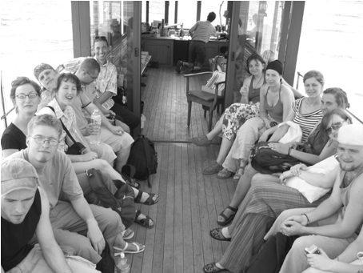
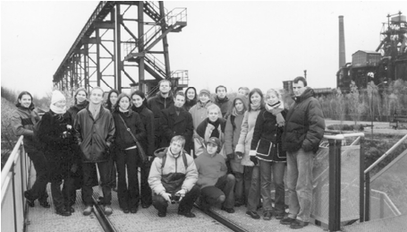
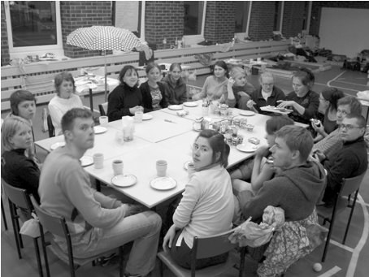
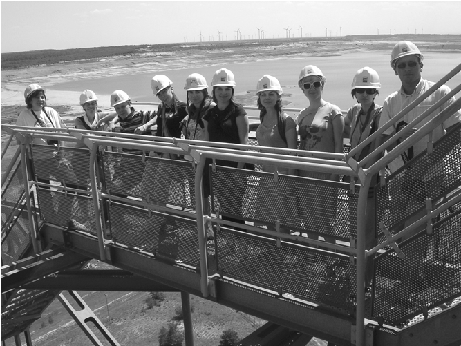
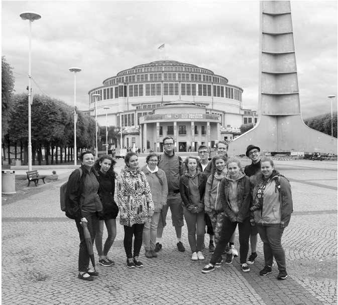

# JEDZIEMY NA WYCIECZKĘ

# ~

z Gabrielą Rembarz, urbanistką i adiunktką w Katedrze Urbanistyki i Planowania Regionalnego Politechniki Gdańskiej rozmawiała: Monika Arczyńska

~Rozmawiamy dziś o wyjazdach jako części procesu edukacyjnego. To ciekawy zbieg okoliczności – prawie dwie dekady temu zaprosiłaś mnie, doktorantkę świeżo po dyplomie magisterskim, do współprowadzenia wycieczki studialnej do Niemiec i Szwajcarii, a przed chwilą skończyłyśmy ustalać szczegóły wyjazdu do Łodzi i Warszawy ze studentami kierunku gospodarki przestrzennej.

Czas tak szybko mija! Pamiętam desperację, gdy zapraszałam cię po raz pierwszy. Byłaś moją ostatnią deską ratunku. Przy organizacji wycieczek zawsze bałam się, że coś się komuś stanie albo że zabraknie mi energii. Stanowiłyśmy dobry zespół, a Ty byłaś świetną łączniczką między pokoleniami.

~Co się zmieniło przez te 20 lat w podróżowaniu ze studentkami i studentami?

Wtedy było oczywiste, że trzeba wyjeżdżać i zwiedzać. Nie istniała współczesna złuda, że zawsze jeszcze będzie okazja, żeby odwiedzić dane miejsce albo że obejrzenie czegoś w internecie jest tożsame z doświadczeniem przestrzeni. Czytałam ostatnio o tym, jak działa hipokamp – część mózgu odpowiedzialna za zapisywanie wspomnień. Okazuje się, że człowiek zapamiętuje inaczej, gdy się przemieszcza fizycznie. Oglądanie miasta na obrazkach to nie to samo co spacer. Kiedy człowiek ma dwadzieścia kilka lat i studiuje architekturę lub urbanistykę, powinien wybrać się w podróż. Kiedyś pomagał w tym Grand Tour. W pewnym momencie życia wyjeżdżano...

~...pod warunkiem, że było się bogatym arystokratą!

Niekoniecznie. Ja wyrwałam się w połowie studiów na „dziekankę”, którą spędziłam na praktyce w Hamburgu. W Niemczech wśród niektórych młodych rzemieślników budowlanych wciąż trwa tradycja odbywania praktyki-podróży. Tak zwani Wandergesellenwłóczą się od budowy do budowy, pracując w różnych miastach i w różnych zespołach. W ten sposób zdobywają doświadczenie. W czasie studiów przychodzi moment, kiedy ma się już dość teorii i chce się pewne sprawy zweryfikować. Sama, jako studentka, na początku lat 90. XX wieku przejechałam autostopem pół Europy, bez pieniędzy. Gdy dotarłam do Wenecji,

SAMA, JAKO STUDENTKA, NA POCZĄTKU LAT 90. XX WIEKU PRZEJECHAŁAM AUTOSTOPEM PÓŁ EUROPY, BEZ PIENIĘDZY. GDY DOTARŁAM DO WENECJI, Z ZACHWYTU CAŁOWAŁAM POSADZKĘ PLACU ŚW. MARKA

z zachwytu całowałam posadzkę placu św. Marka. Wtedy taka wyprawa wymagała odwagi i kosztowała wiele wysiłku. Dziś wydaje się to znacznie prostsze, ale przez to może mniej pociągające, przynajmniej na pierwszy rzut oka. Myślę jednak, że każdy powinien mieć we wspomnieniach moment, gdy znalazł się w miejscu, w którym chciał „całować ziemię” w zachwycie i we wzruszeniu wywołanym pozytywnym skonfrontowaniem wyuczonej teorii z rzeczywistością.

Kiedyś korzystaliśmy z tego, co było dostępne – ktoś proponował ci wyjazd lub sama go organizowałaś. Było więcej energii i zaciekawienia tego typu wyzwaniami. Teraz trzeba by zaoferować osobom studiującym wycieczkę do Japonii czy Afryki, żeby wywołać te same emocje, które 20 lat temu budziły się podczas naszych wyjazdów do Hamburga czy Zurychu. Odbywały się one, zanim tanie loty stały się powszechnie dostępne, a do podróży niezbędne było posiadanie własnego auta albo wynajęcie autobusu. Dziś, w czasach gdy do Kopenhagi z Gdańska można się dostać w 40 minut za 200 złotych Wizz Airem czy Ryanairem, wyjazdy wydają się banalne. Doświadczenie naszego Grand Tour miało inny charakter: wyjeżdżałyśmy na dwa tygodnie, a przez ten czas mogło się zdarzyć wiele rzeczy (śmiech). Sama wiesz o tym nawet więcej – mogłaś się bardziej zintegrować ze studentami, kiedy ja sztywniałam z odpowiedzialności (śmiech).

~Tak, pamiętam nasze nocne spacery całą grupą po Berlinie z – jak to nazywaliśmy – biletem na Fussbahn (czyli butelką piwa) w dłoni.

Jakie to było rozczulające, kiedy na koniec obie dostałyśmy od grupy upominek. Wtedy wydawało mi się, że należę do starszej generacji i miałam do was stosunek macierzyńsko-opiekuńczy. Próbowałam być profesjonalnie zdystansowana, żeby zachować władztwo nad sytuacją, a ciągłe skupienie utrzymywało mnie w roli „surowej pani prowadzącej”. To wynikało z poczucia trenerskiej odpowiedzialności i mojego ówczesnego rozumienia perfekcjonizmu.

~Na ile to pokazywanie świata studentom – jak rodzic dzieciom – zmieniło się w twoim przypadku w perspektywie ostatnich dwóch dekad? Nasi wykładowcy, kiedy jeszcze studiowałam, widzieli więcej świata niż studenci, bo mieli więcej możliwości podróżowania. Kiedy zaczął się Erasmus i pojawiły się tanie linie oraz emigracja, proporcje się odwróciły.

Kiedyś było więcej pracy sezonowej, zwłaszcza na Wyspach. W wakacje wszyscy jeździli za granicę, często stali na zmywaku, ale przy okazji odkrywali tamtejsze miasta, poznawali tamtejszy styl życia. Podobnie za moich czasów wyjeżdżało się na winobranie do Francji lub na budowę do Niemiec. Wy z kolei jesteście „pokoleniem Erasmusa” – was kojarzę z rozwojem tego programu jeszcze przed pojawieniem się tanich linii, zanim rodzice zaczęli wyjeżdżać z dziećmi na wakacje do Tunezji. Obecnie na naszą uczelnię trafiają osoby wychowane na wakacyjnym standardzie

## 7 — kształcenie

835 —RZUT+

- Il. 1. Wyjazd do Niemiec i Szwajcarii z powołaną przez Gabrielę Rembarz Brygadą Urbanistyczno-Architektoniczną, 2005 r., fot. archiwum Gabrieli Rembarz
- Il. 2. Duisburg, Zagłębie Ruhry, 2002 r., fot. archiwum Gabrieli Rembarz
- Il. 3. Warsztaty w Łebie, 2003 r., fot. archiwum Gabrieli Rembarz

all inclusive, którym wydaje się, że są obyte w świecie, choć doświadczały podróży w sposób zupełnie inny, niż robimy to podczas naszych Urban Safari. Chyba większość młodych osób była przed rozpoczęciem studiów np. w Paryżu. Ze szkołą czy z rodzicami zwiedzali miasto jak typowi turyści, odhaczając kolejne atrakcje. Miałam ostatnio takie doświadczenie podczas wyjazdu do Warszawy. Niby wszyscy już tam wcześniej byli, ale kiedy zaczęliśmy spacerować i oglądać stolicę okiem profesjonalistów, szeroko otwierali oczy ze zdziwienia, że można zwiedzać inaczej niż „cywile”.

Na przełomie wieków to czynnik ekonomiczny pchał studentów za granicę. Początkowo głównie do prac fizycznych, a potem celem stały się biura projektowe. Kiedy dowiadywałam się, że moi studenci planują wyjazd zarobkowy na Zachód, zawsze pytałam, czy zbieranie piłeczek golfowych lub składanie kanapek to środki do realizacji jakiegoś celu, czy cele same w sobie. Zachęcałam młodych, by zabierali ze sobą CV i aplikowali do biur. Udawało się to i wiele osób zdobywało bezcenne wówczas doświadczenie. Te dawniejsze ekonomiczne przyczyny

KIEDY DOWIADYWAŁAM SIĘ, ŻE MOI STUDENCI PLANUJĄ WYJAZD ZAROBKOWY NA ZACHÓD, ZAWSZE PYTAŁAM, CZY ZBIERANIE PIŁECZEK GOLFOWYCH LUB SKŁADANIE KANAPEK TO ŚRODKI DO REALIZACJI JAKIEGOŚ CELU, CZY CELE SAME W SOBIE. ZACHĘCAŁAM MŁODYCH, BY ZABIERALI ZE SOBĄ CV I APLIKOWALI DO BIUR

wyjazdów za granicę są dziś sytuacją wyjątkową. Osoby, które potrzebują zarabiać, mogą pracować w Polsce. Decyzja o wyjeździe zawsze jest trudniejsza i bardziej ryzykowna niż pozostanie w kraju.

~To potwierdza moją obserwację z czasów imigracji, kiedy wśród ogromnej grupy polskich architektów pracujących w Dublinie nie spotkałam prawie nikogo z Warszawy. W stolicy mieściło się wiele dobrych pracowni i zarabiało się przyzwoite pieniądze – nie trzeba było szukać nowych możliwości za granicą.

Ani przykładów. Kiedy próbowałam zainspirować grupę rozwiązaniami z wiedeńskiego Aspern, jeden z moich studentów zapytał, po co w ogóle patrzeć na przykłady z Zachodu, jeśli nie mają one przełożenia na polskie warunki. Przecież to, co wam – studentkom i studentom – pokazywaliśmy 20 lat temu, to były bajki, które zupełnie nie przystawały do lokalnego kontekstu. Okazało się jednak, że ci, którzy w te bajki uwierzyli, dziś zmieniają miasta jako projektanci, urzędnicy czy eksperci. Uczyliśmy was nie tego, co było praktyczne i możliwe do natychmiastowego zastosowania, ale tego, co wydawało nam się ważne na przyszłość. Byliśmy pewni, że wytrwacie w zawodzie dłużej i potrzebujecie czegoś więcej niż aktualne chwyty projektowe.

~Czy zmiana, która nastąpiła w Polsce w ciągu ostatnich 20 lat, była tak znacząca, że zamiast w Kopenhadze albo Hamburgu możesz dziś podobne przykłady pokazać studentom w Warszawie?

Mamy różnych studentów. Przykładowo gospodarkę przestrzenną studiuje wiele osób z małych miast. To szczególnie ważny zasób – część tej grupy wraca po studiach do rodzinnych stron, pracuje w administracji lub prowadzi biznes i wdraża zmiany. Do tych osób skuteczniej przemawiają polskie przykłady – jako te, które już udało się w kraju zrealizować. Dlatego wyjazd do Wrocławia czy Warszawy może być ważniejszy od wyjazdu do Kopenhagi. Zresztą, różnica jest coraz mniejsza, a standardy się wyrównują.

9 — kształcenie

## 1035 —RZUT+

Il. 4. Wyjazd na wystawę IBA w Lausitz, przy wsparciu DAAD, 2008 r., fot. archiwum Gabrieli Rembarz

~Jedna z osób, która wskazała cię w ankiecie RZUT-u [przeprowadzonej na potrzeby przygotowania numeru – przyp. red.], napisała: „Na zajęcia do dr Rembarz przeniosłam się świadomie [...] zmęczona projektowaniem «ładnych» układów bloków w polu [...], intuicyjnie czując, że projektowanie miasta to coś więcej niż dobrze zrobiona makieta”. Dlaczego tak ważne jest pokazywanie miasta w skali 1 : 1?

Kiedy w połowie lat 90. XX wieku zaczęłam pracować w Zakładzie Rozwoju Miasta na Wydziale Architektury Politechniki Gdańskiej, założeniem nas wszystkich – a zwłaszcza profesorów Danuty i Mieczysława Kochanowskich – było to, aby nie projektować w szczerym polu i zerwać z komunistycznym planowaniem idealnych miast oraz narracją w duchu nieskończonego rozwoju. Umiejętność projektowania korynckich kapiteli miała sens podczas powojennej odbudowy, lecz prawdopodobieństwo jej wykorzystania w dobie antropocenu – jest bliskie zeru. Podczas moich studiów podyplomowych w Stuttgarcie uczyłam się tzw. Stadtgestaltung, czyli kształtowania miejskiej

GOSPODARKĘ PRZESTRZENNĄ STUDIUJE

WIELE OSÓB Z MAŁYCH MIAST. TO SZCZEGÓLNIE WAŻNY ZASÓB – CZĘŚĆ

TEJ GRUPY WRACA PO STUDIACH DO RODZINNYCH STRON, PRACUJE W ADMINISTRACJI LUB PROWADZI BIZNES

tkanki i przestrzeni publicznych w Städtebauliches Institut, w którym kilka lat wcześniej gościnnie wykładał Kevin Lynch. W Gdańsku po zmianach systemowych Kochanowscy chcieli skończyć z paradygmatem modernistyczno-socjalistycznego uczenia urbanistyki. Na-

Il. 5. Wizyta we Wrocławiu – Gospodarka Przestrzenna i koło TUP Młodzi, 2016 r., fot. archiwum Gabrieli Rembarz

11 — kształcenie zwali nas „Zakładem Rozwoju Miasta”, bo chcieli pracować w istniejącym kontekście i „łatać” miasto. A żeby to zrobić, trzeba wyjść i zbadać teren. W Stuttgarcie od tego zaczynały się wszystkie zajęcia. Wcześniej nie wiedziałam, że w ramach studiów można zorganizować spotkanie z urzędnikami czy zobaczyć miejsce poddawane przekształceniom. Zakochałam się w tej metodyce kształcenia. Chciałam zmieniać świat i dość naiwnie myślałam, że wszyscy będą mnie słuchali. Kiedy już w Polsce prosiłam władze wydziału o pozwolenie na zorganizowanie wyjazdu do Berlina, wiele osób patrzyło na mnie jak na rewizjonistkę, bo brakowało im wiedzy, że to był wówczas największy plac budowy Europy. Mój niemiecko-urbanistyczny entuzjazm stał się znany i niektórych bardzo uwierał.

~Wszyscy nam powtarzali, że tylko jedna piąta z nas będzie pracować w zawodzie, więc robiliśmy, co w naszej mocy, aby znaleźć się w garstce osób, która zauczestniczy w wyjeździe studialnym. Dzisiaj wybór jest oszałamiający – jeśli chodzi zarówno o karierę, jak i o wyjazdy. Kiedyś na każdą wydziałową wycieczkę chciało jechać 50 osób, spośród których można było zabrać 15. Wybrańcom towarzyszyła ekscytacja i poczucie wyróżnienia. Myślę, że najmłodsze pokolenie wcale tak dużo nie widziało. Czasem wydaje mi się, że życie w wirtualnej i materialnej rzeczywistości, czyli ta wszechogarniająca

## 1235 —RZUT+

hybrydyzacja, powoduje, że nie widzimy, a na pewno nie zapamiętujemy wielu zjawisk przestrzennych, w których codziennie bierzemy udział. Nawet podczas ekscytujących zagranicznych wyjazdów.

~A co wyjazdy dają tobie? Czy wolisz pokazywać miejsca, które już znasz, czy razem ze studentami odkrywać nowe?

Mam za sobą 30 lat praktyki zawodowej, która dzieliła się na różne fazy. Na początku to ja dyktowałam program, bo studenci jeszcze nie wiedzieli, co warto byłoby obejrzeć. Działałam według zasad, które poznałam w Niemczech – rozdzielałam tematy i każdy musiał coś opracować. Grupa wsiadała więc do autokaru już przygotowana. Później, kiedy dysponowałam grantem na badania osiedli, chciałam zobaczyć konkretne miejsca. Miałam też dużo kontaktów wśród niemieckich profesorów, co dawało mi szansę na zorganizowanie spotkań, podczas których dowiadywaliśmy się z pierwszej ręki, jak przeprowadzano różne procesy. Wyciągałam z tego więcej niż studenci, ale potem mogłam pomóc im zrozumieć, co właśnie usłyszeliśmy. Teraz mogę wyjechać do Warszawy, nie do Hamburga. Ostatnio Szymon Wojciechowski opowiedział nam np. o Porcie Praskim i sama dużo się nauczyłam.

~Czy po powrocie, kiedy spotykaliście się w ramach kolejnego semestru, czułaś, że studenci stali się dojrzalsi zawodowo, że dojrzały też wasze relacje? Dla części uczestników nasze wyjazdy stanowiły silny impuls do dalszego rozwoju. Coś się w nich budziło. Wyjeżdżali potem na Erasmusa, a po powrocie zupełnie inaczej się z nimi rozmawiało. Dojrzewali, to prawda. Skracał się też dystans wywoływany wcześniej przez szkolny respekt czy obawy przed autorytetem. Osoby studiujące pojawiają się i znikają, a prowadzący zostaje na miejscu ze wszystkimi związanymi z tym emocjami. Nie uważam za uczciwe tworzenie pozorów, że się przyjaźnimy – moja sympatia dla zaangażowanych studentów jest szczera, ale upływa zwykle sporo czasu, zanim przerodzi się ona w trwałą przyjaźń. Może właśnie dlatego dziś ze mną rozmawiasz – dzięki nierzadko trudnej szczerości moich relacji ze studentami.

~Gdybyś mogła dziś zaplanować wyjazd marzeń, bez ograniczeń czasowych, finansowych i organizacyjnych, dokąd zabrałabyś studentów?

Nie zastanawiałabym się, dokąd wyjechać, tylko z kim. Teraz wolałabym odbyć podróż z młodymi profesjonalistami, a nie ze studentami. Chodzi mi

- o taką reedukację w podróży, bardziej
- odświeżającą niż to, co próbujemy robić z naszymi studentami, czyli obejrzenie miejsc, które już znamy, ale z lepszym zrozumieniem całego procesu ich powstawania. Celowałabym pewnie we wspomniany Hamburg, może z przejazdem przez małe miasteczka niemieckiego wybrzeża. Może Aachen z wypadem do Holandii, np. do Maastricht. Pewnie tamtejszych rozwiązań nie dałoby się zastosować w Polsce w stu procentach, ale byłoby to bardzo wartościowe doświadczenie. Jeśli miałabym wybierać spośród miast duńskich, to może nie Kopenhaga, ale raczej Aarhus. Nie rozumiem tylko, dlaczego studenci mają takie parcie na Erasmusaw krajach południowoeuropejskich.

~Lifestyle?

Pewnie tak, ale moim zdaniem nie można się tam tak dużo nauczyć. Z kolei np. Liverpool, Manchester, Leeds, Birmingham – to szalone miasta, które się „łata”, podczas gdy w Niemczech niemal szyje się tkankę na nowo. Berlin w swoich centralnych sławnych fragmentach, takich jak Potsdammer Platz, nie robi już dzisiaj takiego wrażenia jak kiedyś, ale spacer po Kreuzbergu zawsze jest ciekawy – nie przez architekturę, ale przez społeczną unikalność miejsca. Te rozwiązania, które nas intrygowały i inspirowały na przełomie wieków, znajdziesz dziś bardzo blisko, chociażby spacerując po gdańskim Garnizonie.

~Chodzenie z wykorzystaniem Street Viewto nie to samo, co prawdziwe chodzenie?

Traktując poważnie wiedzę o działaniu hipokampu – że ruch ciała jest dla niego sygnałem do zbierania i zapisywania danych, a przez to do dalszego analizowania doznań – trzeba powiedzieć, że Street Viewbez tej całej aparatury rozszerzonej rzeczywistości na pewno nie jest tym samym, co studia w terenie. Urbanistyka to wielosensoryczne doznanie, dlatego wycieczki są takie ważne. Dobrze zorganizowane i przeżyte w zaangażowanym towarzystwie, dostarczają też innych wartości – rozmów, wymiany opinii i dzielenia głębokich przeżyć. Lockdownowe roczniki nie doświadczyły zielonych szkół ani wycieczek autokarowych. A my po latach wspominamy noclegi na sali gimnastycznej (kiedy ja spałam w tzw. Gabi-necie). Wycieczki studialne to rodzaj seminarium w drodze. Mniej chodzi o to, dokąd jedziemy, a bardziej – po co i z kim. To kiedy zabierasz mnie na kolejne Urban Safari?

13 — kształcenie

