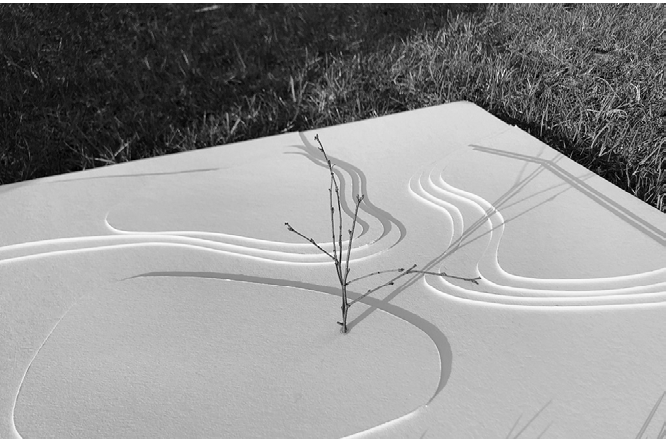
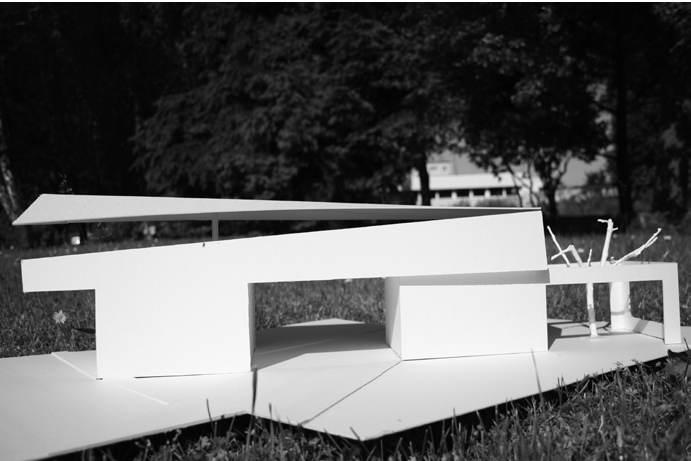
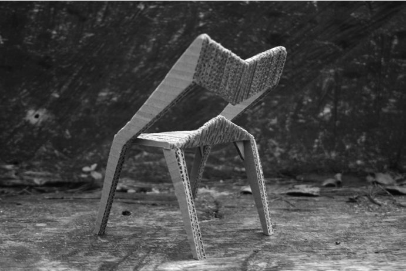
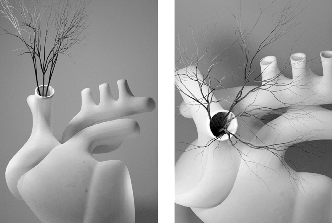

# POMIĘDZY DZIECKIEM A DOROSŁYM

# ~

z Karoliną Dobrzyńską-Szefer, architektką wnętrz, nauczycielką pracującą w Zespole Szkół Zawodowych nr 6 i Zespole Szkół Budownictwa nr 1 w Poznaniu rozmawiali: Wojciech Mazan Zofia Piotrowska

~Zofia Piotrowska: Jak rozpoczęła się pani kariera zawodowa? Karolina Dobrzyńska - Szefer: Jestem absolwentką Akademii Pedagogicznej w Krakowie, gdzie obroniłam dyplom z malarstwa. Następnie ukończyłam Wyższą Szkołę Techniczną w Katowicach na kierunku architektury wnętrz. Karierę zawodową, jeśli mogę ją tak nazwać, zaczęłam zaraz po studiach od stanowiska dyrektorki w Ośrodku Kultury w Czempiniu, małej miejscowości w Wielkopolsce. Po pięciu latach przeniosłam się do Poznania, gdzie najpierw prowadziłam własną galerię sztuki, a potem pracowałam jako nauczycielka plastyki i techniki w gimnazjum. W tym okresie nawiązałam współpracę z panią architekt Katarzyną Wrońską z Wielkopolskiej Izby Architektów, która zainicjowała program Kształtowanie przestrzeni. Początki uczestnictwa w tym programie nie były łatwe, dziś wygląda to zupełnie inaczej. Ale miałam wtedy dużo energii i pomysłów – co nie zmieniło się do dziś

– i zabrałam się do realizacji zajęć z młodzieżą z dużym rozmachem. Efektem tej pracy były wspaniałe makiety, których zdjęcia trafiły na plakaty wielkoformatowe i citylightyreklamujące naszą szkołę na przystankach tramwajowych. W gimnazjum uczyłam do momentu mojego wyjazdu do Danii w 2015 roku.

~Wojciech Mazan: Co wyjazd do Danii zmienił w pani podejściu do edukacji? K.D-S.: Wyjechałam do Danii ze względu na moje dzieci. Córka zaczęła studiować na uniwersytecie, a syn podjął naukę w liceum międzynarodowym. Potrzebowali mojego wsparcia na miejscu, więc decyzja o wyjeździe była prosta. Rozpoczęłam tam współpracę z duńskim architektem, któremu na zlecenie przygotowywałam rysunki techniczne w ArchiCAD-zie. Nigdy większej kariery w tym kraju nie zrobiłam.

Moja córka skończyła w Danii studia inżynierskie, podjęła pracę zawodową i jest na bieżąco w tej dziedzinie. Przez to role

- Il. 1. Autorka pracy i zdjęcia: Barbara Krysztofiak

15 — kształcenie się odwróciły – kiedyś to ja byłam dla niej inspiracją, teraz ona stanowi inspirację dla mnie. Jest ekspertem w zakresie budownictwa ekologicznego i nadawania certyfikatów DGNB. Kategorie systemu opierają się na zasadach zrównoważonego rozwoju: aspektach środowiskowych, ekonomicznych, technicznych i społecznych. Ten ostatni zawsze wyjątkowo mnie interesuje. Greta opowiada mi, jakie warunki są potrzebne do spełnienia takich standardów, że ważny jest nie tylko budynek, ale również przestrzeń i przede wszystkim człowiek.

~W.M.: Prowadzi pani zajęcia z projektowania w szkołach średnich, w technikum budowlanym i poligraficznym. Zaskakujące jest to, że obecnie ponad 60% uczniów w Polsce wybiera szkoły inne niż licea ogólnokształcące. Jak jest zorganizowana nauka w takich szkołach? K.D.-S.: Uczę w poznańskim Zespole Szkół Budownictwa nr 1, w którym znajdują się liceum, technikum i szkoła branżowa. Prowadzę pracownię architektury i designu w liceum, a także zajęcia z aranżacji wnętrz. W technikum wprowadziliśmy w tym roku przygotowanie do zawodu projektanta wnętrz. Jesteśmy chyba drudzy w Polsce, którym po kilku latach starań udało się taki pomysł wdrożyć. Co więcej, spotkał się on z ogromnym zainteresowaniem młodzieży i rodziców. Po pięciu latach nauki w technikum i po zdaniu egzaminów państwowych, dających kwalifikacje zawodowe, nasi uczniowie będą mogli wykonywać zawód projektanta wnętrz.

Prowadzę też zajęcia w Zespole Szkół Zawodowych nr 6 im. Joachima Lelewela w Poznaniu. Uczę tam głównie rysunku technicznego i projektowania 3D, które są wsparciem przedmiotów zawodowych związanych z poligrafią, drukiem czy fotografią. Powszechne jest to, że w liceach tworzy się klasy profilowane i w ramach godzin dyrektorskich uczniowie mają dodatkowe lekcje geografii albo nawet ekonomii czy psychologii. My nastawiliśmy się na szeroko rozumiane projektowanie,

## 1635 —RZUT+

- Il. 2. Autorka pracy i zdjęcia: Milana Evald co realizujemy w ramach napisanych przez nas autorskich programów nauczania, które są akceptowane przez dyrektora i kuratora.

~W.M.: Tworzenie takich klas wymaga dodatkowej pracy nauczycieli, ale również sporej motywacji ze strony dyrektora. K.D.-S.: Tak, ale konkurencja w edukacji jest duża i do działania motywują nas mechanizmy rynkowe.

Od przyszłego roku czeka nas niż demograficzny. Nabór do szkół średnich będzie mniejszy w porównaniu z latami poprzednimi. Przyciąganie uczniów atrakcyjną ofertą staje się wyzwaniem dla dyrektorów i nauczycieli, więc muszą być oni otwarci na nowe inicjatywy i tworzenie ciekawych programów. Współcześnie dyrektorzy szkół są przede wszystkim menagerami.

W obu placówkach, w których pracuję, dyrektorzy co roku podejmują ogromny wysiłek, aby sprostać oczekiwaniom. Trafiłam zatem w dobre miejsca, gdzie współpraca jest możliwa, a dyrektorzy wierzą w nauczycieli i ich wspierają. Ale to nie wszystko – do programu wprowadzają też nowe kierunki, więc młodzież może kształcić się np. w zawodzie kowala, zdobnika ceramiki, złotnika jubilera. Zmieniła się nawet nazwa Szkoły Branżowej w ZSB – teraz jest to Branżowa Szkoła I stopnia Rzemiosła Artystycznego. Dyrektor robi wszystko, żeby placówce, która była kojarzona z zawodówką, nadać

TRAFIŁAM ZATEM W DOBRE MIEJSCA,

GDZIE WSPÓŁPRACA JEST MOŻLIWA, A DYREKTORZY WIERZĄ W NAUCZYCIELI

I ICH WSPIERAJĄ renomę. Stworzył nowe pracownie kowalstwa, ceramiki, do każdej z nich pozyskał ogromne kwoty dofinansowania, co przekłada się na zakup specjalistycznego sprzętu, materiałów i narzędzi. Natomiast w Lelewelu musimy zadbać o to,

- Il. 3. Autorka pracy: Amelia Mazur, fot. Karolina Dobrzyńska-Szefer żeby uczniowie już w czasie nauki doświadczali realnych sytuacji związanych z wykonywanym w przyszłości zawodem, stąd wiele zajęć opiera się na praktycznym działaniu: drukowaniu, pakowaniu, kalkulowaniu czy odwiedzaniu fabryk i zakładów pracy.

~Z.P.: Ja w wieku licealnym nie za bardzo wiedziałam, co chcę w życiu robić. Zastanawiam się, czy podobnie jest z młodzieżą, która trafia do takich wyspecjalizowanych szkół? K.D.-S.: W liceum bywa różnie, czasami młodzież zaczyna tu edukację, bo faktycznie ma już jakąś pasję, a czasami dopiero pod wpływem entuzjazmu nauczyciela zaraża się od niego zainteresowaniami.

Z kolei do technikum przychodzą uczniowie, którzy chcą się uczyć konkretnego zawodu. Jako osoba obdarzona intuicją, widzę, kto mógłby się w przyszłości zajmować architekturą, projektowaniem czy podjąć studia na kierunkach artystycznych. Kiedyś, pod wpływem impulsu, powiedziałam jednej z moich uczennic klasy maturalnej, że absolutnie musi iść na architekturę. A ona na forum klasy odparła: „Nie, pani profesor, ja będę prawniczką”. Minął rok szkolny, uczennica zdała maturę. Jakiś czas później otrzymałam od niej bardzo długiego maila z przeprosinami oraz informacją, że dostała się na dwa kierunki i że będzie studiować architekturę. Takie chwile są najprzyjemniejsze. Empatyczny nauczyciel może zmienić życie młodych ludzi, jestem tego pewna. Przytoczę jeszcze jeden przykład. W ramach zastępstwa w klasie dla logistyków w Lelewelu zorganizowałam lekcję na temat współczesnego projektowania biur. Pokazałam przykłady, gdzie oprócz miejsc pracy znajdują się też przestrzenie do wspólnych posiłków, relaksu, odpoczynku. Po lekcji stanął przede mną dwumetrowy dryblas i zaczął wypytywać o moje studia, edukację. Mimo że kończył szkołę o profilu logistycznym, czuł, że chciałby zostać projektantem. I nawet jeśli nie zrealizuje swoich planów, to 45 minut lekcji spowodowało, że rozważa dla siebie inne możliwości. Ważne jest też to, że chce kontynuować naukę na wyższej uczelni.

~Z.P.: Co obejmuje przygotowany przez panią program zajęć? K.D.-S.: W ramach moich zajęć rozwijam przestrzenne umiejętności uczniów, głównie poprzez proces doświadczania manualnego. Wycinamy, składamy, dopasowujemy, mierzymy i dbamy o estetykę wykonania. Przygotowujemy np. model krzesła z tektury falistej, lampy z materiałów z odzysku czy makiety wielkoformatowe. Zakres zadań obejmuje także przygotowanie do egzaminów na wyższe

17 — kształcenie

1835 —RZUT+

- Il. 4. Autorzy pracy: Eryk Rembacz i Łukasz Lach, fot. Karolina Dobrzyńska-Szefer

- Il. 5. Autorka pracy i zdjęcia: Barbara Krysztofiak uczelnie, zwłaszcza zebranie prac do portfolio. Projektujemy i wytłaczamy kształty, uczymy się ilustrowania w przestrzeni. Lekcje zawsze zaczynam od pokazania uczniom inspiracji – tu nieodzowne stająsię Pinterest i autorskie strony internetowe projektantów. Nie daję uczniom pełnej dowolności, tylko sugeruję i zachęcam do dyskusji. To gwarantuje efekt. Pokazuję im dobrze zaprojektowany obiekt, akcentuję jego zalety, omawiam zastosowane materiały, proporcje i skalę. Staram się używać do makiet podstawowego, monochromatycznego materiału, żeby uczniowie umieli zrezygnować z dekoracyjności i przyswoili sobie, że mniej znaczy więcej. Często poziom tych prac wykracza poza zakres treści nauczania w szkole średniej i jest już wstępem do studiowania. W ramach aranżacji podejmuję tematy, takie jak rysowanie przekrojów i widoków ścian. Tworzymy wzorniki materiałów i kolorów, projektujemy meble i karty katalogowe produktów. Na rocznych kursach dla dorosłych, które też prowadzę, zaczynam tak samo. Wydawałoby się, że dziś wszystko projektuje się od razu na komputerze. Ja jednak zawsze zaczynam od ćwiczeń manualnych. Wychodzę z założenia, że jak się coś zrobi ręcznie, to później dużo łatwiej zrozumieć, jak to zrobić na komputerze. Ponadto myślenia koncepcyjnego można nauczyć się przede wszystkim na podstawie odręcznego, szybkiego szkicu.

~W.M.: Uczy pani młodzież szkolną ArchiCAD-a. Czy nie jest to zbyt skomplikowany program jak na poziom tej grupy? Dlaczego akurat ten program? K.D.-S.: Miałam możliwość wyboru programu, w którym będę uczyć, więc wybrałam ten znany mi najlepiej. W ArchiCAD-zie pracuję od 2009 roku. W szkole budowlanej uczymy też AutoCAD-a, a w technikum poligraficznym – programów z pakietu Adobe. Często podczas zajęć łączymy wiele programów. Przykładowo w klasie fotograficznej prowadzę przedmiot o nazwie wizualizacja przestrzenna. Nietypowy kształt modelujemy w ArchiCAD-zie, a później uczniowie wklejają go do własnych zdjęć. Tworzą wizualizacje, które pokazują, jak zaadaptować przestrzeń publiczną, żeby zwrócić uwagę na jakiś problem czy kontekst społeczny. Robi się z tego zadanie interdyscyplinarne, wymagające użycia różnych narzędzi. Dzięki temu w przyszłości młodzi będą wiedzieć, które z nich najbardziej im odpowiada i którym zechcą się posługiwać w swojej pracy zawodowej.

~Z.P.: Przywołuje to na myśl niektóre nagradzane prace pani uczniów. Co takiego dają konkursy, że warto je wykorzystywać jako narzędzie edukacyjne? K.D.-S.: Konkurs zawsze ma jakieś warunki i wymaga spełnienia pewnych założeń, zastosowania formatu, użycia określonych materiałów czy technik, dyscypliny czasowej. Warto sprawdzać w ten sposób swoje umiejętności. Tematyka konkursów dla uczniów jest zawsze bardzo ciekawa, może dotyczyć np. ekologii albo organizacji przestrzeni publicznej. Jeden z konkursów, zorganizowany w ramach programu Kształtowanie przestrzeni, wymagał, by przestrzeń publiczną dostosować do potrzeb osób, które zazwyczaj pozostają niewidzialne. Najpierw dyskutowaliśmy, co to właściwie znaczy „osoby niewidzialne”, jacy to są ludzie – niesłyszący, niedowidzący, z niepełnosprawnościami, tacy, którzy zostali poszkodowani przez życie i mieszkają na ulicy, ale także osoby starsze.

~Z.P.: Czy powinniśmy dążyć do tego, żeby zajęć architektonicznych i projektowych było w szkołach średnich więcej? K.D.-S.: Myślę, że to byłaby bardzo dobra droga. Zwracanie uwagi na bliższe i dalsze otoczenie człowieka jest bardzo istotne, a uczenie o wspomnianych wartościach

## 19 — kształcenie

## 2035 —RZUT+

przyniesie za jakiś czas wymierny skutek. Spójrzmy dookoła, brakuje nam w Polsce poczucia estetyki. Czasem, gdy omawiamy jakiś temat z obszaru architektury i projektowania, moi uczniowie szeroMŁODZIEŻ JEST BARDZIEJ ŚWIADOMA OTOCZENIA NIŻ ICH RODZICE CZY DZIADKOWIE. I TO NAPAWA OPTYMIZMEM

ko otwierają oczy. We współczesnym świecie te oczy patrzą zazwyczaj gdzie indziej – w kierunku smartfonów. Choć muszę przyznać, że młodzież jest bardziej świadoma otoczenia niż ich rodzice czy dziadkowie. I to napawa optymizmem.

Jakiś czas temu zaprosiłam swoich uczniów do Muzeum Narodowego na wystawę Kenyi Hary, jednego z najlepszych designerów na świecie. Hara jest moim guru, bo szczególnie upodobałam sobie japoński minimalizm i tu zapewne ma źródło mój entuzjazm dla przeprowadzenia lekcji poza murami szkoły. Jedna wypowiedź Hary, z którą się absolutnie zgadzam, wyjątkowo utkwiła mi w pamięci: ,,Opowiadanie o designie samo w sobie jest designem

,,

. Lubię też jego filozofię pustki czy koncepcję wysokiej jakości produktów bez marki. Gdy nasza wizyta w muzeum dobiegła końca, podszedł do mnie chłopak i powiedział: „Dziękuję, że mnie pani tu przyprowadziła, bo sam bym nie przyszedł”.

~W.M.: Jak wzmacniać kreatywność młodych ludzi, jak zachęcać ich do projektowania? K.D.-S.: Dobrze wpływa na nich to, że jestem szczera, podaję przykłady z własnego życia. Część młodzieży uznaje to czasem za przechwałki, ale większość docenia i identyfikuje się ze mną. Poza tym zawsze podkreślam, że szanuję rolę rodziców, którzy mają własne przekonania, i nie chcę, żeby pod tym względem pojawił się jakiś konflikt. Mówię uczniom, że nawet jeśli podejmą jakąś decyzję, to mogą zrobić krok wstecz albo na chwilę się zatrzymać. Podkreślam, że kilka miesięcy, a nawet rok na zastanowienie się, to nic w kontekście ich całego życia. Przekonuję, że mogą jechać na studia za granicę, a jeśli nie mają na to środków, to mogą popracować, spróbować się do tego przygotować. Często używam mojego ulubionego powiedzenia, które brzmi: „Wszystko możesz!”. Pamiętam sytuację z ubiegłego roku w Lelewelu. Mieliśmy do wykonania ostatnie zadanie dotyczące pojęcia kształtu, z użyciem wszystkich poznanych narzędzi projektowych. Mojej uczennicy Natalii bardzo zależało na ocenie końcowej. Powiedziałam jej wtedy, żeby mnie zaskoczyła. Kiedy przyniosła swój projekt inspirowany kształtem ludzkiego serca, to aż zawołałam profesora z sali obok. Powiedziałam mu: „Proszę zobaczyć, co zrobiła ta dziewczyna, w jaki sposób przedstawiła efekty na planszy”. Nauczyciel był wręcz porażony, a chwilę później w podobny sposób zareagował inny profesor, który przyszedł obejrzeć pracę. Byłam po prostu wzruszona! Opinie wygłoszone na forum klasy spowodowały,

TRZEBA BYĆ BARDZO DELIKATNYM I UWAŻNYM, BO MŁODZI LUDZIE MAJĄ RÓŻNE, ZMIENNE NASTROJE. KTOŚ

MOŻE BYĆ W PIERWSZEJ KLASIE NIE DO ZNIESIENIA, A W DRUGIEJ MOŻEMY MIEĆ

Z NIM DOSKONAŁY KONTAKT. CZASEM TRZEBA UMIEĆ ODPUŚCIĆ, POCZEKAĆ NA ODPOWIEDNI MOMENT

że Natalia nabrała odwagi, wzięła udział w konkursie organizowanym przez School of Form i zakwalifikowała się na dwutygodniowy kurs w Warszawie oraz wygrała roczne stypendium w tej szkole. Tak

Il. 6., 7. Autorka pracy: Natalia Dobroń

21 — kształcenie zmieniło się jej życie, a studiowanie na jednej z najlepszych uczelni w dziedzinie designu stało się realne. Nauczanie młodzieży może być naprawdę ekscytujące, mówię to z ręką na sercu. Skoro się widzi tak niezwykłe efekty, to jak może takie nie być?

~Może za mało chwalimy studentów, uczniów? K.D.-S.: Jako nauczyciele często zapominamy, że jedno słowo czy zdanie mogą zmienić los młodych ludzi. Pozytywne wzmacnianie ma sens, zwłaszcza w edukacji. Choć nie raz spotkałam się z sytuacją, że uczeń nie życzył sobie komplementowania na forum klasy. Różnica pomiędzy studentami a młodzieżą jest taka, że do szkół średnich przychodzą dzieci, a wychodzą z nich dorośli. Uczestniczymy w ich intensywnym rozwoju intelektualnym, ale też fizycznym. To ma wpływ na relację nauczyciel–uczeń. Trzeba być bardzo delikatnym i uważnym, bo młodzi ludzie mają różne, zmienne nastroje. Ktoś może być w pierwszej klasie nie do zniesienia, a w drugiej możemy mieć z nim doskonały kontakt. Czasem trzeba umieć odpuścić, poczekać na odpowiedni moment. Ostatnio zastępowała mnie koleżanka, która pochwaliła grupę, że robią świetne makiety. Jedna uczennica zaprzeczyła, mówiąc, że niczego się na zajęciach nie nauczyła. Ja natomiast pomyślałam, że ona akurat nie chciała się niczego nauczyć, bo jej to kompletnie nie interesowało. Na jednej z kolejnych lekcji powiedziałam do tej samej grupy: „Mieliście wiele okazji, żeby się tu nauczyć świetnych rzeczy, a jeśli ktoś się niczego nie nauczył, to znaczy, że nie chciał”. Myślałam, że nie przyniesie to żadnego skutku. Jednak tydzień później wspomniana uczennica przyszła znakomicie przygotowana, maksymalnie wykorzystała dwie godziny i wykonała bardzo dobrą pracę z tektury. Czasami nie wiadomo, jak do uczniów dotrzeć, ale próbować trzeba •

