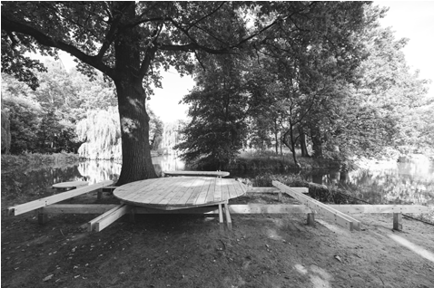
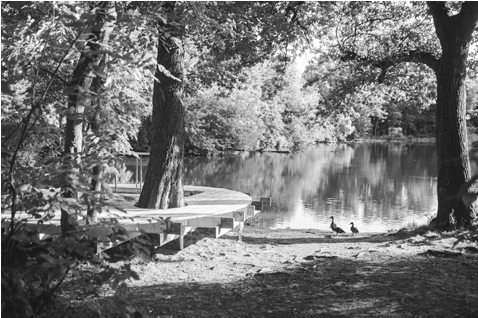
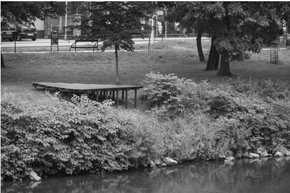
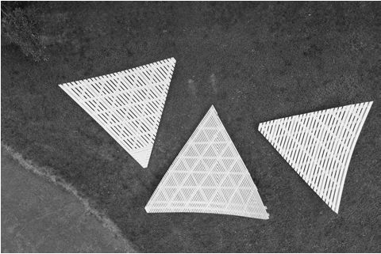
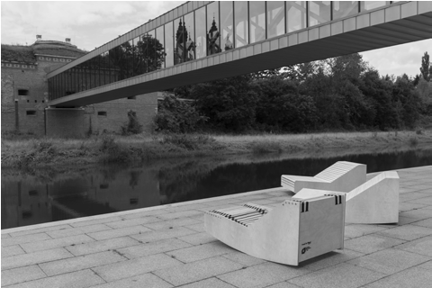
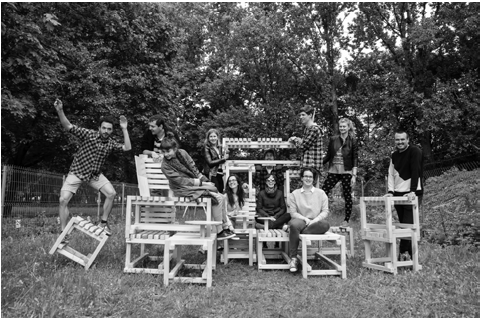

# DOŚWIADCZANIE RZECZYWISTOŚCI

# ~

z Magdą Wypusz, pomysłodawczynią i koordynatorką warsztatów Mood for Wood rozmawiał: Marcin Stępień

~Zacznijmy od tego, czym są warsztaty Mood for Wood. Możliwe, że część osób jeszcze o nich nie słyszała.

To program edukacyjny, oparty na zasadzie nauki poprzez doświadczenie. Z jednej strony są studenci architektury, którzy przez 12 dni przechodzą przez cały proces projektowy, z którym po studiach będą się mierzyć codziennie. Obejmuje on zagadnienia typu: budżetowanie, opracowanie programu, harmonogramów, „użeranie się” z klientem czy ze specjalistami, takimi jak nasz stolarz Szymon, organizowanie transportu i pozostałych spraw. W efekcie tych działań powstaje mebel miejski, stworzony na potrzeby danej przestrzeni i określonego odbiorcy.

Z drugiej strony – mam nadzieję – jest to promocja zawodu architekta. Poza wami, studentami, znajdują się tam osoby niezwiązane zawodowo z projektowaniem, które są przyszłymi odbiorcami mebli, biorącymi aktywny udział w ich tworzeniu. Zależy nam na tym, żeby różne podmioty, zwłaszcza te z trzeciego sektora, a także instytucje, mogły zobaczyć, że praca z architektem lub projektantem to nie jest nic strasznego. Istnieje sporo mitów na temat tego zawodu – nie wiem, czy zdajecie sobie z tego sprawę. Ludzie trochę się was boją, ponieważ stanowicie hermetyczną grupę. Dlatego zależy nam, żeby zewnętrzny świat zobaczył, że działanie razem z projektantem jest OK. Wasze

ZALEŻY NAM, ŻEBY ZEWNĘTRZNY ŚWIAT ZOBACZYŁ, ŻE DZIAŁANIE RAZEM Z PROJEKTANTEM JEST OK

główne zadanie polega na dotarciu do rozwiązania, które będzie satysfakcjonujące i dla was, i dla osób z zewnątrz. Na uzyskaniu czegoś, co pomoże im ulepszyć dom, mieszkanie, przestrzeń obok, ogródek, działkę, skwer.

~Jak narodził się pomysł na te warsztaty? Czy to była twoja inicjatywa?

Zaczęło się trochę nietypowo. Skończyłam studia w 2011 roku i napisałam pracę na temat promocji miast i regionów poprzez architekturę oraz design. Po studiach mogłam rozpocząć pracę w banku, co nie bardzo do mnie przemawiało, lub znaleźć coś innego. Ponieważ nie byłam projektantką z wykształcenia, nie miałam wiele możliwości, by działać w Poznaniu, a ze względu na swojego partnera chciałam zostać w tym mieście. Stwierdziłam, że zgłoszę się do SARP-u. Na spotkaniu opowiedziałam, co mogłabym dla nich zrobić i w ten sposób dostałam pracę w poznańskim oddziale. Jednym z moich pierwszych projektów były warsztatySukkot – budujemy szałas. W ramach tego projektu studenci architektury mieli za zadanie zaprojektować oraz własnoręcznie wykonać żydowskie szałasy na święto Sukkot – według współczesnej interpretacji. Wyszło całkiem nieźle, choć dosyć chaotycznie. Po zakończeniu warsztatów odezwali się do nas ludzie z festiwalu Malta. Spytali, czy planujemy organizację kolejnych takich wydarzeń. Wtedy podeszliśmy do sprawy poważniej i w 2014 roku dostaliśmy pierwszy grant z Międzynarodowego Funduszu Wyszehradzkiego na powołanie do życia warsztatówMood for Wood2015. Po sukcesie pierwszej edycji zaczęliśmy organizować je raz do roku, a zdarza się, że w ramach jednego sezonu odbywają się dwie edycje. Nasze zasady i model działania na przestrzeni lat specjalnie się nie zmieniły. Pierwsze warsztaty były jednak bardzo małe, bo budżet wynosił 4 tys. zł, a całe wydarzenie musiało zamknąć się w siedmiu dniach (dopiero z czasem wydłużyliśmy je do 12 dni). Było więc naprawdę bardzo intensywnie.

~Przejdźmy do tematu edukacji. Takie warsztaty wydają się dobrym sposobem na to, by studenci zdobywali doświadczenie i wiedzę, również od siebie nawzajem. Ja sam uczestniczyłem już w czterech edycjach, począwszy od 2020 roku.

Dla nas to był trudny moment. Dopadło nas wtedy ogromne zmęczenie, bo to był czas pandemii, a my po raz pierwszy organizowaliśmy dwie międzynarodowe edycje, w Cieszynie i w Poznaniu. Odbyłyśmy z Marią Dondajewską (drugą koordynatorką warsztatów od 2019 roku)

TEN PROJEKT, PRZEZ SWOJĄ INTENSYWNOŚĆ, DZIAŁA NA WIELU PŁASZCZYZNACH. POMAGA STUDENTOM NIE TYLKO ROZWIJAĆ SIĘ WARSZTATOWO CZY KSZTAŁTOWAĆ

UMIEJĘTNOŚCI KOMUNIKACYJNE, ALE TEŻ BUDOWAĆ PEWNOŚĆ SIEBIE,

NAWIĄZYWAĆ NOWE RELACJE

bardzo długą rozmowę i stwierdziłyśmy, że może po 2020 roku nie będziemy już robić kolejnych warsztatów, że po prostu jesteśmy na to za stare, że ta formuła się trochę wypala. Ale kiedy jedna z uczestniczek – Maria Pawłowa – powiedziała nam na finale poznańskiej edycji, że to był najlepszy czas w jej życiu, że bardzo dużo się nauczyła i bardzo nam dziękuje, zgodnie uznałyśmy, że jednak ma to sens. Ten projekt, przez swoją intensywność, działa na wielu płaszczyznach. Pomaga studentkom i studentom nie tylko rozwijać się warsztatowo czy kształtować umiejętności komunikacyjne, ale też budować pewność siebie, nawiązywać nowe relacje. Wiemy, że kilkoro uczestników warsztatów nadal utrzymuje ze sobą bardzo bliskie kontakty. To jest niezwykłe uczucie, kiedy tworzysz platformę, mogącą mieć realny wpływ na czyjeś życie, nie tylko zawodowe. Dlatego staramy się mieszać studentów z różnych uczelni i krajów. I rzeczywiście mam nadzieję, że transfer wiedzy i doświadczenia odbywa się nie tylko na poziomie tutor–studenci, ale również w relacji student–student.

## 23 — kształcenie

2435 —RZUT+

- Il. 1. Warsztaty 2021, Dębina, grupa Kowalski, Stępień, fot. Dawid Majewski
- Il. 2. Warsztaty 2021, Dębina, grupa JEJU, fot. Dawid Majewski
- Il. 3. Warsztaty 2020, Cieszyn, grupa Żurawski, fot. Dawid Majewski

~Ważne jest też to, że na warsztatach są oprócz nas osoby, które nie studiują architektury.

Staramy się, żeby tak było, ale nie ukrywam, że czasami średnio nam to wychodzi. Zawsze dostajemy wiele zgłoszeń z Politechniki Warszawskiej, jednak trochę nas martwi, że zmalała liczba aplikacji z Gdańska czy Wrocławia. Na szczęście mamy też ASP w Warszawie czy Katowicach. Zależy nam na tym, żeby w projekcie uczestniczyły osoby z innych kierunków. Żebyście nie kisili się we własnym sosie, i to od momentu rozpoczęcia studiów. To, jak bardzo odizolowane jest środowisko architektoniczne, jest po prostu niepojęte i bardzo dziwne. Nie wiem, kto wam na studiach robi taką krzywdę.

~To prawda, zwłaszcza w odniesieniu do WAPW, chociaż podobne odczucia miałem na studiach pierwszego stopnia w Poznaniu, na tej nieszczęsnej politechnice… Z drugiej strony uważam, że nie ma różnicy, gdzie się studiuje. Wszędzie można robić coś fajnego.

Na tym polega studiowanie. To wy jesteście odpowiedzialni za to, co wyniesiecie z uczelni. Jeśli będziecie tylko imprezować albo prześlizgiwać się z roku na rok, to nie pomogą nawet najlepsze uczelnie i najlepsi prowadzący.

~Wróćmy jeszcze do tematu warsztatów. Jak wygląda wasz model działania, jeśli chodzi o pracę na poziomie tutor–studenci?

Jesteśmy teraz częścią programu Builder Method. To projekt powstały w ramach Erasmusa+, rozwijany od 2020 roku, a wyznaczony na trzy lata. Tworzy go osiem organizacji z Europy, nastawionych na edukację projektową poprzez doświadczenie. Założeniem tego projektu jest stworzenie strony internetowej, inspirującej do tego, aby różne rzeczy budować samodzielnie oraz wydanie podręcznika na temat organizacji tego typu wydarzeń edukacyjnych. Jeżeli chodzi o twoje pytanie, to my staramy się nie ingerować w model pracy tutora ze studentami podczas dni projektowych. Nie wiem, czy taka decyzja jest w stu procentach dobra, ale wydaje nam się to najbezpieczniejszym rozwiązaniem. Dlatego tak dokładnie staramy się sprawdzać tutorów, zanim zdecydujemy się ich zaprosić.

~Bardzo podoba mi się w tych warsztatach możliwość stworzenia czegoś fizycznego. Możemy dać coś od siebie przestrzeni, użytkownikom. Działać w inny sposób niż na studiach. Oglądanie fizycznego efektu własnej pracy wywołuje niezwykłe uczucia. Daje nam to poczucie sensu studiowania.

Taki jest też cel prowadzenia tych warsztatów. I tak naprawdę to praca całoroczna. Kończymy jedną edycję i od razu zaczynamy przygotowywać kolejną. Gdyby nie osoby, takie jak Maria Pawłowa, które dają nam dobry feedback, trudno byłoby nam znaleźć w sobie tyle zapału. Te warsztaty mają w was budować pewność siebie, kształtować charakter, poczucie dumy. Wdzięczność ze strony odbiorców często jest bardzo budująca. Stworzenie czegoś, z czego będziecie dumni, może pomóc wam przetrwać te studia, które moim zdaniem są dosyć niewdzięczne i obciążające, tak jak późniejsza praca w zawodzie.

~Budowanie daje satysfakcję nieporównywalną z samym projektowaniem.

Zdecydowanie. Co więcej, ten model warsztatów niejako wymusza na was szybkie skrócenie dystansu między sobą. Otwieracie się na siebie. To, że zadanie jest bardzo wymagające, rodzi potrzebę wzajemnej szczerości i zaufania. Przyjaźnie i znajomości, które pojawiają się na Mood for Wood,często mają bardzo

## 25 — kształcenie

## 2635 —RZUT+

dużą wartość i są kontynuowane po zakończeniu wydarzenia. Wszystko jest na speedzie.

~Może kiedyś podobne podejście pojawi się też na naszych uczelniach. Czy Mood for Wood ma szansę się jeszcze rozwinąć? Czy inne oddziały SARP-u odzywały się do ciebie w sprawie zorganizowania własnej edycji?

Co roku do wszystkich oddziałów wysyłamy prośbę o udostępnienie wydarzenia i promocję. Największą siłą instytucji, takich jak SARP, jest wielkość. Organizacja pozarządowa, która ma 25 oddziałów regionalnych, względnie stabilnych budżetowo i mających tak dużą kadrę, powinna po prostu rządzić. Jednak z mojej perspektywy SARP-y rzadko ze sobą współpracują. Również średnia wieku ich członków bardzo szybko rośnie i to jest ogromny problem. Powiem coś, co powinieneś przekazać swoim koleżankom i kolegom. Za dziesięć lat będziecie mieli bardzo duże kłopoty. Jeżeli wszyscy ludzie, którzy teraz pracują w tej instytucji i robią bardzo dużo, odejdą na emeryturę, to nie wiem, kto przejmie ich obowiązki. Rekomendacje konkursów, sprawdzanie regulaminów, wydawanie opinii, rozwiązywanie sporów z urzędami, konfliktów między architektami, pomoc radom osiedli, udzielanie się w wielu konsultacjach społecznych i na forach dialogu na różnym poziomie instytucjonalnym – to tylko niektóre z zadań organizacji. Wprawdzie istnieje też Izba Architektów, ale nie jestem przekonana, czy radzi sobie tak dobrze ze swoimi zadaniami, mimo że jest bogatsza, ma nieporównywalnie większe możliwości i fundusze, by realizować swoje zadania statutowe. Powinniście masowo zapisywać się do SARP-ów i modlić się, żeby ich członkowie nauczyli was tego, jak sobie z całą tą biurokracją i bałaganem radzić. Jeżeli teraz uważacie, że ten zawód jest „zrąbany”, to za dziesięć lat może się okazać, że jego poziom nie jest niski, ale po prostu druzgocący.

~Wiem, że Maciek Kauffman z WAPW zrobił coś podobnego doMood for Wood na swoich zajęciach. Czyli coś jednak zaczyna się dziać na uczelniach?

Tak, w Polsce zrobił to na razie chyba tylko Maciek i wyszło mu świetnie. Ale choćby w Czechach istnieją eksperymentalne pracownie, gdzie w ramach projektów semestralnych studenci wspólnie opracowują koncepcje, na podstawie których realizują meble, instalacje, a nawet niewielkie obiekty. Przykładem może być politechnika w Pradze, gdzie nad swoim pomysłem pracują Ateliér Hlaváček–Čeněk–Minarovič oraz czeski Karkonoski Park Narodowy – Útulna. Działania te polegają na projektowaniu oraz budowaniu niewielkich domków dla turystów. Nawiązaliśmy z tymi twórcami kontakt i mam nadzieję, że w najbliższych latach uda nam się stworzyć coś wspólnie. Byłoby naprawdę wspaniale, gdyby każda uczelnia miała w programie coś takiego. To powinna być część obowiązkowego kursu w ramach edukacji architektonicznej.

~A jak wygląda Mood for Wood od strony finansowej? Jak pozyskujecie na to wszystko pieniądze?

Budżet warsztatów rósł z czasem. Teraz przy największej edycji wynosi około 250–300 tys. złotych, przy mniejszej 180–220 tys. zł. Fundusze pozyskujemy głównie z grantów i dotacji publicznych na działania międzynarodowe. Piszemy mnóstwo wniosków, by zdobyć jak najwięcej środków, ponieważ wszyscy, którzy pracują przy realizacji projektu, otrzymują wynagrodzenie, co mnie ogromnie cieszy. Mamy też sponsorów, takich jak Festool (producent narzędzi) i Leniar (producent artykułów kreślarskich i biurowych). Nie chcemy jednak odbierać studentom decyzyjności co do używanych przez nich materiałów. Poza tym program warsztatów jest tak napięty, że nie zmieścilibyśmy już spotkań czy prezentacji sponsorskich.

- Il. 4. Warsztaty 2020, Cieszyn, grupa Szparkowski, fot. Dawid Majewski
- Il. 5. Warsztaty 2017, Poznań, grupa Smoleński, fot. Dawid Majewski
- Il. 6. Warsztaty 2015, Poznań, grupa BudCud, fot. Dawid Majewski

27 — kształcenie

## 2835 —RZUT+

~Niektórzy porównują wasze warsztaty do płatnych praktyk, z czym ja całkowicie się nie zgadzam. Jaka jest twoja opinia?

Od samego początku bardzo zależało mi na tym, żeby pieniądze nie stanowiły przeszkody dla studentów. Założeniem warsztatów jest stworzenie możliwości udziału wszystkim, dlatego opłata wpisowa miała

OD SAMEGO POCZĄTKU BARDZO ZALEŻAŁO MI NA TYM, ŻEBY PIENIĄDZE NIE STANOWIŁY PRZESZKODY DLA STUDENTÓW

być jak najniższa. Rozpoczęliśmy od niewielkiej stawki – w 2015 roku wynosiła ona 70 EUR, potem wzrosła do 100 EUR. Przy tej kwocie zatrzymaliśmy się na dłużej, ale zawirowania cenowe i kursy walut w ostatnich latach (czyli od pandemii) niestety spowodowały, że musieliśmy tę opłatę podnieść do 600 zł (150 EUR) dla edycji czerwcowej i do 900 zł (200 EUR) dla sierpniowej. Mam nadzieję, że 150 EUR będzie granicą, której nigdy więcej nie przekroczymy. Uczestnikom musimy zapewnić: zakwaterowanie, wyżywienie (trzy posiłki), dowóz na warsztaty oraz transport publiczny na miejscu. Wiąże się to z kosztami w wysokości 2800–3500 zł na studenta. Wpisowe jest więc niewielkim wkładem, jeśli weźmiemy pod uwagę budżet całego wydarzenia. Nasz partner – Hello Wood, który prowadzi podobne warsztaty, ustalił opłatę wpisową na poziomie 450–650 EUR, bez kosztów transportu. Będziemy się starać, by w naszym przypadku kwota była jak najniższa, choć to naprawdę drogi projekt. Nasze inne warsztaty – KOTydż1 – są za to całkowicie darmowe.

~Czy masz swoje ulubione projekty powstałe na warsztatach? Jak wygląda życie waszych mebli w późniejszym czasie?

1 Więcej o warsztatach na www.kotydz.com.

Po zakończeniu warsztatów meble przechodzą na własność instytucji, dla której zostały wykonane. My niestety nie mamy możliwości finansowych ani personalnych, by później się nimi zajmować. Lubię większość projektów, które powstały, a najwyżej cenię nie te najbliższe mojej estetyce, tylko te, które rzeczywiście odpowiedziały na potrzeby odbiorców i pozwoliły zaproszonym organizacjom rozwinąć ich działalność. Takim projektem jest na pewno mebel wykonany podczas pierwszej edycji warsztatów dla Kolektywu Kąpielisko (ogród społeczny w parku im. Kasprowicza w Poznaniu). Tę grupę prowadziła krakowska pracownia BudCud. Powstał wtedy mobilny system mebli, który spełniał prawie wszystkie potrzeby kolektywu. Obiekty stały tam aż do 2020 roku, a sympatycy ogrodu wspólnie odnawiali je po każdym sezonie zimowym.

W roku 2017 Mikołaj Smoleński wraz ze studentami stworzył Bujaki przy Bramie Poznania. Dały one początek aktywności na pustym dotąd placu i pokazały zarządcom, jak mogą myśleć o otoczeniu muLUBIĘ WIĘKSZOŚĆ PROJEKTÓW, KTÓRE

POWSTAŁY, A NAJWYŻEJ CENIĘ NIE TE NAJBLIŻSZE MOJEJ ESTETYCE, TYLKO TE, KTÓRE RZECZYWIŚCIE ODPOWIEDZIAŁY

NA POTRZEBY ODBIORCÓW I POZWOLIŁY ZAPROSZONYM ORGANIZACJOM ROZWINĄĆ ICH DZIAŁALNOŚĆ zeum. Od tego czasu pojawiło się wiele dodatkowych elementów otwierających budynek na zewnątrz.

Warto też wspomnieć o projekcie powstałym w 2018 roku dla świetlicy terapeutycznej Amici, pomagającej młodzieży z rodzin zmagających się z chorobą alkoholową. Organizacja zajmuje jedną z piwnic w bloku na poznańskim osiedlu Lecha i brakowało jej przestrzeni na zewnątrz. Tę grupę prowadziła węgierska pracownia Studio Nomad, dzięki której powstała zewnętrzna galeria i miejsce warsztatowe. Pomysł spotkał się z pozytywnym odbiorem, a świetlica stworzyła nawet osobny profil na Facebooku, informujący o realizowanych tu wydarzeniach.

Bardzo cenię też projekt zespołu Karola Żurawskiego – Point of blue, czyli niebieską platformę nad Olzą w Cieszynie. To był nasz pierwszy obiekt z wykorzystaniem koloru. Starzeje się przepięknie, a właściwie wciąż wygląda jak nowy i jest bardzo lubiany przez cieszyńską młodzież.

Lubię praktycznie wszystkie projekty, które powstały w grupach kierowanych przez Karola Szparkowskiego. On jest moim ulubionym tutorem, nie wyobrażam sobie naszych warsztatów bez niego. Zawsze popycha nas do przodu. Prowadzi studentów w fantastyczny sposób, a efekt za każdym razem jest bardziej niż satysfakcjonujący. Stworzone przez jego zespół w 2019 roku obserwatorium ptaków nad jeziorem Rusałka to jedno z najbardziej popularnych miejsc nad tym zbiornikiem. Podczas edycji w czeskim Cieszynie, w 2020 roku, grupa Karola stworzyła projekt trzech, kształtem przypominających gigantyczne nachosy, wielofunkcyjnych platform dla Domu Kultury Strzelnica, które do dziś służą mieszkańcom. Meble powstałe w ramach tego projektu naprawdę mogą wnieść do przestrzeni wiele dobrego. Wierzę, że takie doświadczenia pozwolą studentkom i studentom być w przyszłości lepszymi projektantkami i projektantami •

29 — kształcenie

