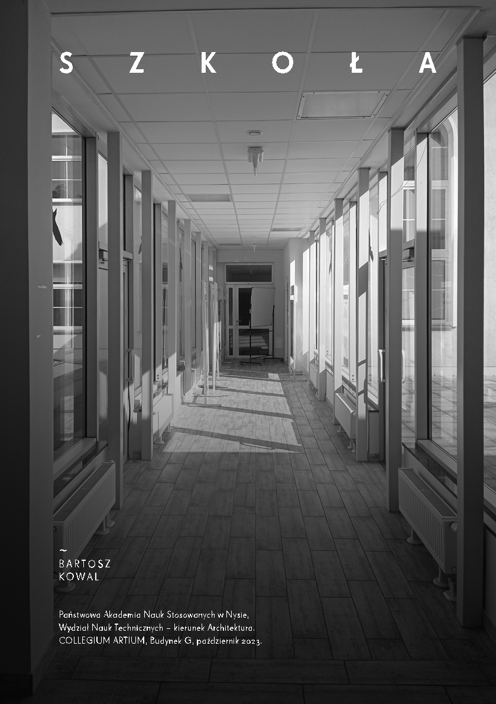

# S Z K O Ł A

~

BARTOSZ KOWAL

Państwowa Akademia Nauk Stosowanych w Nysie, Wydział Nauk Technicznych – kierunek Architektura. COLLEGIUM ARTIUM, Budynek G, październik 2023.

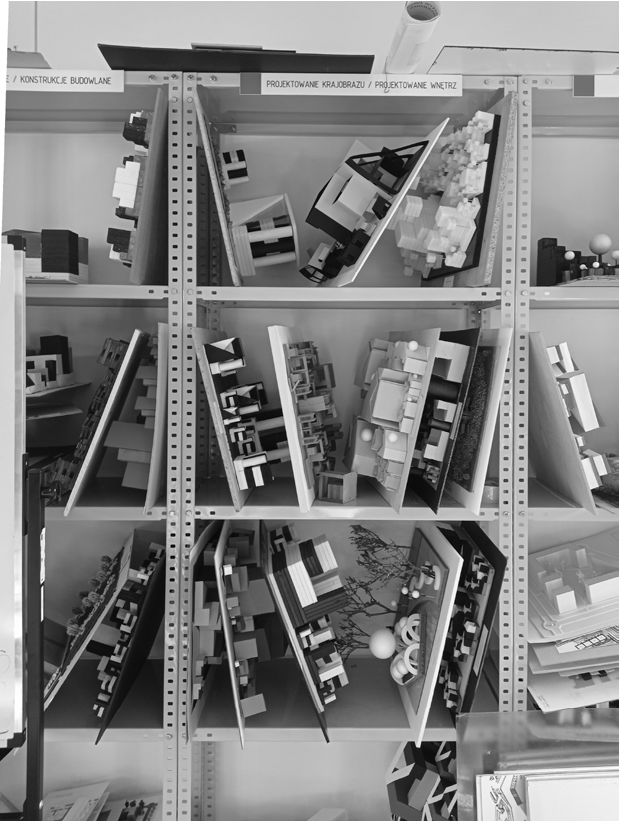

## 3235 —RZUT+

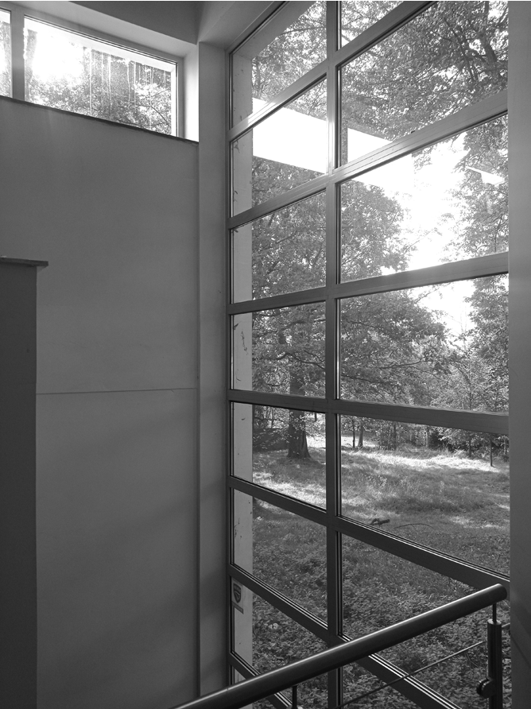

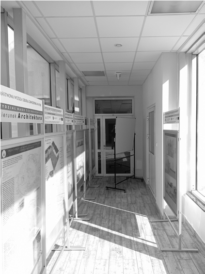

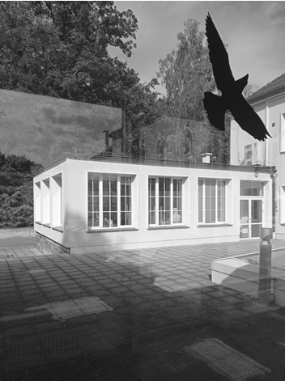

## 3435 —RZUT+

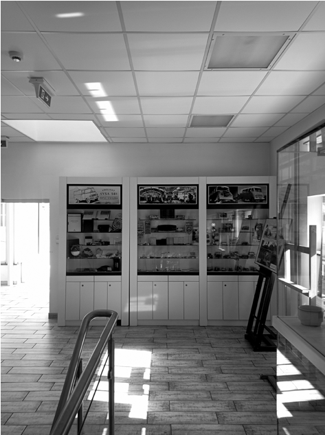

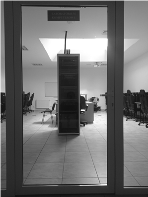

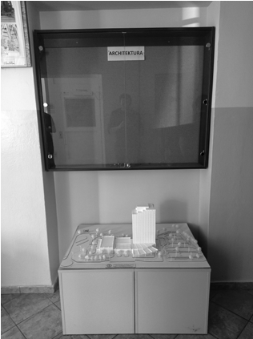

## 35 — kształcenie

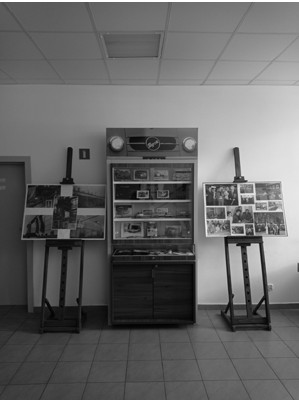

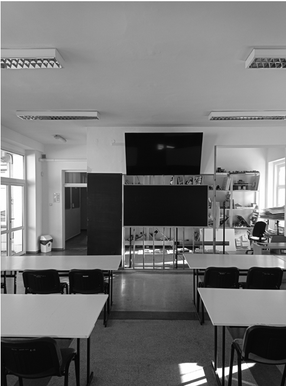

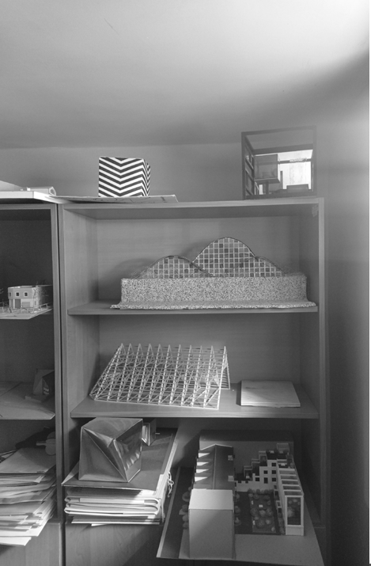

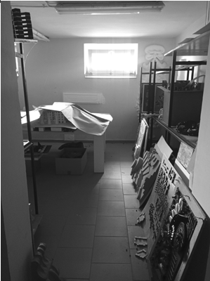

