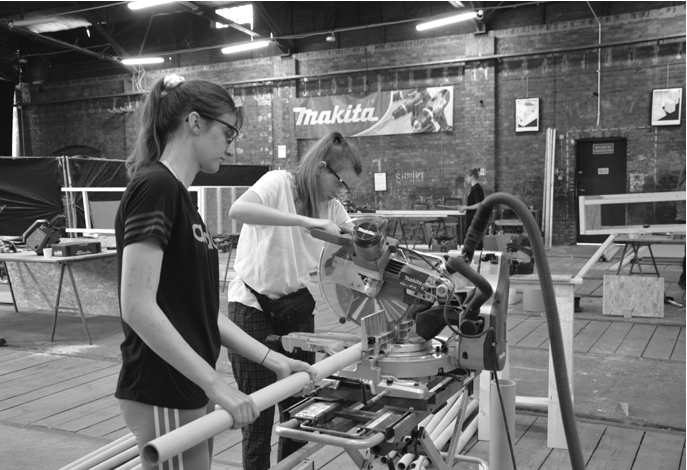
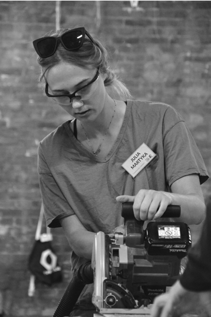
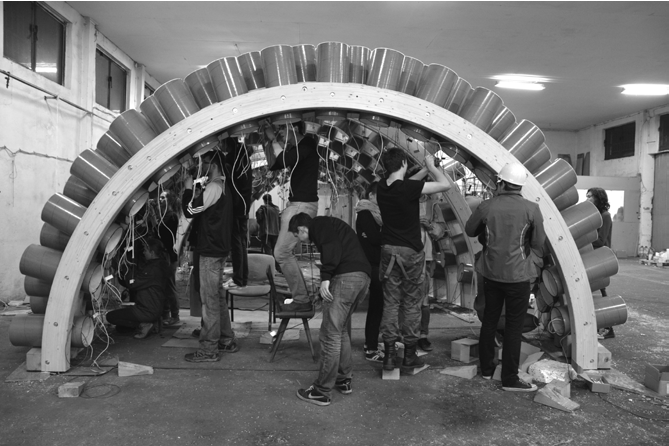
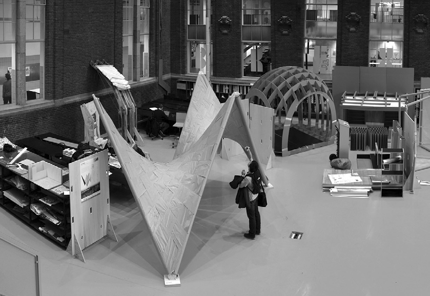
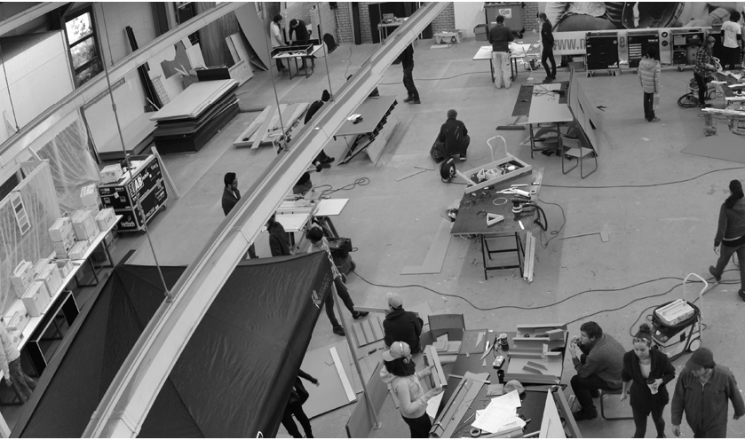
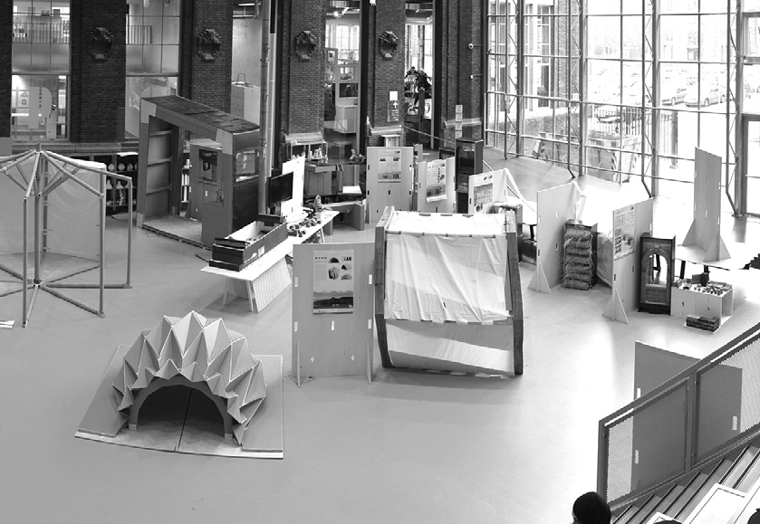
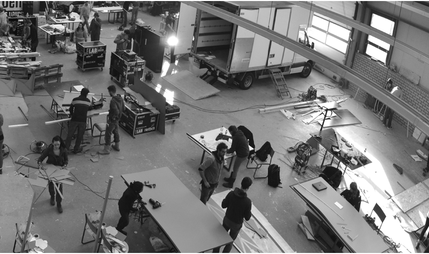

# PRACOWAĆ ZESPOŁOWO

# ~

z Jerzym Łątką, naukowcem, wykładowcą Wydziału Architektury Politechniki Wrocławskiej rozmawiali: Szymon Ciupiński Agata Jasiołek

Jerzy Łątka: W czasie studiów byliście bardzo zaangażowanymi studentami, jeśli chodzi zarówno o zajęcia projektowe, jak i o działalność naukową. Kiedy patrzycie na swoją edukację z tej niedalekiej perspektywy czasowej, to co byście zmienili? Czego wam brakowało?

~Agata Jasiołek: Mi brakowało dwóch skrajności – z jednej strony projektowania czysto koncepcyjnego, które jest oderwane od realiów, bo ma rozwijać kreatywność, a z drugiej strony rzemiosła, które jest osadzone w rzeczywistości pracy w zawodzie.

~Szymon Ciupiński: Z pewnością brakowało wiedzy na temat prowadzenia procesu inwestycyjnego, na temat jego uwarunkowań. Bardzo wartościowa byłaby realizacja projektu semestralnego w zespole złożonym ze studentów architektury, budownictwa i inżynierii środowiska. Na studiach de factouczymy się opracowywać koncepcje w kompletnej izolacji od realiów współpracy branżowej.

~A.J.: A jak było z twoimi doświadczeniami edukacyjnymi? Czego studia cię nauczyły, a czego nie? J.Ł.: Podczas studiów nie byłem zbyt pilny. Studiowałem siedem lat i wiele energii oraz czasu poświęciłem choćby

PODCZAS STUDIÓW NIE BYŁEM ZBYT PILNY. STUDIOWAŁEM SIEDEM LAT I WIELE ENERGII ORAZ CZASU POŚWIĘCIŁEM CHOĆBY DZIAŁALNOŚCI W SAMORZĄDZIE STUDENCKIM CZY ROZWOJOWI OSOBISTEMU

działalności w samorządzie studenckim czy rozwojowi osobistemu. Dużo podróżowałem za granicę, pracowałem, często podejmowałem się zajęć kompletnie niezwiązanych z architekturą. Myślę, że to wyjątkowy czas, kiedy dostajemy jeszcze wsparcie z domu rodzinnego, ale już stajemy się niezależni. Wyjątkowy, bo wiąże się z szansą na to, żeby poznać siebie dogłębniej i odpowiedzieć sobie na pytanie, co chcę robić w życiu. I – jak powtarzam dziś moim studentom – to wcale nie musi być architektura. Dla mnie momentem przełomowym było bliższe poznanie profesora Zbigniewa Bacia. Kiedy byłem na trzecim roku, założyliśmy koło naukowe, organizowaliśmy warsztaty projektowe, jeździliśmy na dwutygodniowe szkoły letnie. Później zostałem doktorantem profesora. Dopiero wtedy ze „średniaka” stałem się jednym z najlepszych doktorantów.

~S.C.: To w jaki sposób odkryłeś, co cię naprawdę interesuje w architekturze? J.Ł.: Chęć poszukiwania rozwiązań problemów społecznych za pomocą architektury zaszczepił mi profesor Bać, który był wielkim entuzjastą i promotorem pojęcia habitatu, czyli szerokiego, wielowymiarowego i interdyscyplinarnego projektowania środowiska mieszkaniowego. Moja praca magisterska dotyczyła bezdomności i już wtedy temat architektury społecznie zaangażowanej i pomocowej zaczął mnie interesować. Później, podczas praktyki projektowej w Izraelu u Zeeva Barana, pracowałem nad systemem składanych domów dla pielgrzymów, które mogły być także wykorzystywane jako schronienia w razie katastrof. Wiele się też nauczyłem podczas wyjazdu do Japonii i udziału w projekcie pomocowym Paper Nursery School autorstwa Shigeru Bana. Tam zrozumiałem, jak wartościowe jest angażowanie studentów w proces budowy. Z kolei Marcel Bilow, mój promotor pomocniczy z TU Delft, gdzie realizowałem swój doktorat, podzielił się ze mną wiedzą z obszaru dydaktyki i metod nauczania.

~A.J.: Czy to przełożyło się na twój sposób prowadzenia zajęć, podejście do studentów?

Od szesnastu lat jestem zaangażowany w funkcjonowanie Koła Naukowego Humanizacja Środowiska Miejskiego na Wydziale Architektury Politechniki Wrocławskiej. Podstawą jest tam praca zespołowa. Studenci działają w kole dobrowolnie, nie można im więc czegoś nakazać. Trzeba ich za to zachęcić, zaprezentować, jak ciekawe czy rozwojowe jest to, co robimy. Pasja staje się głównym narzędziem nauczania. Poprzez własne zaangażowanie pokazuję swoim studentom, że warto uczestniczyć w działaniach koła. Dzieje się to zwłaszcza w czasie warsztatów ProtoLAB, gdzie młodzi mają szansę zbudować zaprojektowane przez siebie obiekty.

~A.J.: Jakie umiejętności starasz się kształtować u swoich studentów? Jak myślisz, co realnie ma wpływ na to, że będą w stanie realizować się w zawodzie? J.Ł.: Podchodzę do projektowania jako do zbioru wielu zmiennych. Architekt to osoba, która powinna wiedzieć niewiele o wielu rzeczach – w przeciwieństwie do inżyniera, który wie wiele na temat niewielu zjawisk. Zapraszam na swoje zajęcia specjalistów z różnych dyscyplin, takich jak filozofia, zarządzanie, architektura krajobrazu, konstrukcje, fizyka budowli, instalacje czy akustyka. Dzięki temu studenci otrzymują rozszerzony pakiet wiedzy. Ponadto bardzo ważne są umiejętności miękkie, sposób prezentacji projektu. I oczywiście sam pomysł na projekt. Tu nie jestem zwolennikiem na siłę tworzonej awangardy, lecz raczej przemyślanej architektury, która dobrze wpisze się w kontekst, spełni swoje zadanie i będzie wygodna w użytkowaniu. Jeżeli studenci poczują, że to, co robią, jest interesujące i odnajdą w tym element zabawy, to jest duża szansa, że zarówno oni, jak i ja będziemy zadowoleni z rezultatów.

## 39 — kształcenie

## 4035 —RZUT+

~S.C.: Czy na wydziałach architektury uczy się pracy zespołowej? Czy wspólne robienie projektu jest już taką nauką, czy można ten proces jakoś wspierać? J.Ł.: U mnie praca zespołowa to podstawa. Na zajęciach z projektowania architektury mieszkaniowej studenci początkowo

PRACA ZESPOŁOWA TO PODSTAWA. (...) ZACHĘCAMY STUDENTÓW DO WCIELENIA SIĘ W PEWNE ROLE, NP. OSÓB ODPOWIEDZIALNYCH ZA KONSTRUKCJĘ, ZASTOSOWANE MATERIAŁY, PROMOCJĘ LUB BUDŻET I PROCES PRODUKCJI

pracują w dużych zespołach, nawet siedmioosobowych, nad zagadnieniami urbanistycznymi, żeby potem podzielić się na mniejsze grupy opracowujące poszczególne budynki. Dzięki temu każdy może poznać swoje mocniejsze i słabsze strony w pracy zespołowej. Na kursie ProtoLAB, gdy zajmujemy się obiektami małej architektury, zachęcamy studentów do wcielenia się w pewne role, np. osób odpowiedzialnych za konstrukcję, zastosowane materiały, promocję lub budżet i proces produkcji. Projektowanie i budowanie to zawsze proces grupowy. Żaden budynek nie został wzniesiony w pojedynkę.

Dobrym przykładem jest projekt Pawilonu Politechniki Wrocławskiej, nad którym pracowało łącznie 50 osób z czterech różnych kół naukowych. Architekci, konstruktorzy i elektronicy musieli zacząć słuchać innych i uczyć się od siebie nawzajem. Decyzje jednej grupy wpływały na pracę pozostałych. Podział zadań i odpowiedzialności, umiejętność podejmowania decyzji i przekonywania do niej innych to tylko jedne z wielu wyzwań, z którymi mierzyli się uczestnicy. Czasem się kłócili, czasem wzajemnie inspirowali, ale dzięki temu zdobyli nową wiedzę i doświadczenie.

~A.J.: Sukces nauczyciela najłatwiej zmierzyć liczbą wygranych konkursów studenckich czy wyróżnionych dyplomów, ale to tylko mały wycinek procesu nauczania. W jaki sposób pomagasz studentom w ich architektonicznym rozwoju? J.Ł.: Na zajęciach staram się tworzyć bezpieczne warunki pracy, tak aby studenci nie bali się odzywać, proponować pomysłów, nawet takich, które na pierwszy rzut oka wydają się naiwne. Staram się też słuchać i rozumieć ich poglądy oraz pomysły pojawiające się w procesie twórczym. Czasem komunikują coś nieświadomie, więc tę ich myśl trzeba złapać jak końcówkę włóczki i wyciągać. Powoli i cierpliwie. Tak, by na koniec udało się z tego utkać wartościowy projekt. Z jednej strony uważam, że atmosfera stresu nie wpływa dobrze na kreatywność. Z drugiej jednak zawsze pojawia się ryzyko, że studenci poczują się zbyt wyluzowani i nie będą wywiązywać się ze swoich obowiązków.

~A.J.: Studia to nie tylko nauka zawodu, ale również proces kształtowania postaw studentów, ich podejścia do pracy. Co z kwestią balansu między tworzeniem idealnego projektu a wypoczynkiem i umiejętnością oddzielenia pracy od życia prywatnego? Moim zdaniem stworzyliśmy na uczelni kulturę harówki, którą potem sami podtrzymujemy zarówno w życiu zawodowym, jak i w edukacji kolejnych pokoleń. Dlaczego nauczyciel nie może powiedzieć: „Teraz są święta, więc nie pracujcie, odpocznijcie, a do projektu wrócimy później”?

~S.C.: Wielu prowadzących na wydziale to czynni architekci, którzy na co dzień doświadczają różnych frustracji w kontaktach z inwestorami, urzędnikami, wykonawcami, stykają się też z nieprzemijalnością fazy koncepcji. Jeżeli nauczyciele mają takie sytuacje w swojej praktyce projektowej, to później mogą podświadomie uczyć studentów nieustannej pogoni za optymalną wersją. Przyjmując pozycję inwestora, rozdysponowują swoje rozżalenie projektanta. J.Ł.: Publikacje na temat osiągnięć architektów, historie o wkładanej w projekty ilości pracy trafiają do naszej wyobraźni, napędzają osobiste ambicje. Dotyczy to także nauczycieli i często próba dążenia do podobnych „sukcesów” kończy się wypaleniem zawodowym. W projekcie zawsze można coś zrobić lepiej, ale w pewnym momencie trzeba po prostu powiedzieć stop.

Architektura jest częściowo dyscypliną artystyczną, a częściowo techniczną. Ocena projektu może być odebrana osobiście. Dlatego staram się na tyle, na ile mogę, delikatnie krytykować prace studentów, by nie zgasić ich entuzjazmu, nie wpędzić w kompleksy. Dla mnie bardzo ważne jest to, żeby student lub studentka lubili swój projekt. Wtedy mam pewność, że będą go realizować z pasją i zaciekawieniem.

Od kiedy zmienił się program nauczania, na zajęcia projektowe w czasie studiów architektonicznych przeznacza się 13 godzin lekcyjnych w tygodniu. Na koniec zeszłorocznego kursu zapytałem studentów, jak rozkładali projektowanie w czasie – ile robili na uczelni, a ile w domu. Okazało się, że 60–70% pracy wykonali na zajęciach. Wstyd się przyznać, ale w pierwszej chwili pomyślałem, że dałem im zbyt mało ambitne zadanie.

~A.J.: Studenci architektury chętnie uczestniczą w aktywnościach pozazajęciowych. Jak to wykorzystać w prowadzeniu zajęć w ramach programu studiów?

J.Ł.: Aktywności pozazajęciowe są bardzo ważne. Zawsze zachęcam młodych do zaangażowania się w działalność organizacji studenckich czy samorządu. Dzięki temu kształtują się kompetencje miękkie, które są nieocenione w życiu zawodowym. Na zajęciach staram się wprowadzać dodatkową wartość. Rok temu moi studenci opracowali kilka koncepcji noclegowni dla osób w kryzysie bezdomności. Cały projekt był realizowany we współpracy z Departamentem Spraw Społecznych UM Wrocławia oraz fachowcami zajmującymi się tą problematyką. Widać było ogromne zaangażowanie studentów, bo wiedzieli, że robią coś istotnego i wartościowego, a ich praca może być w przyszłości wykorzystana do stworzenia programu funkcjonalno-użytkowego, określania powierzchni zabudowy czy systemu konstrukcyjnego. W tym roku udało nam się nawiązać współpracę z Urzędem Miasta Lwowa. Studenci opracowują osiedle mieszkaniowe, które w części ma być przeznaczone dla uchodźców wewnętrznych.

~S.C.: Jak łączyć misyjność naszego zawodu z długotrwałą motywacją, żeby się nie wypalić?

Poczucie misyjności zawodu architekta jest bardzo ważne. Powinniśmy uczyć tego, że architekt to zawód zaufania publicznego, a misja tworzenia lepszej rzeczywistości jest w nim nieodzowna. Nawet jeżeli w przyszłości dzisiejsi studenci spotykać się będą z frustracją związaną z nastawieniem klienta, to właśnie ta niezgoda na traktowanie architektury i urbanistyki jako towaru rynkowego daje nadzieję na poprawę naszego środowiska zbudowanego •

## 41 — kształcenie

Il. 1. Warsztaty 2022: ProtoLAB – re:cultivation, fot. Jerzy Łątka

Il. 2. Warsztaty 2023: ProtoLAB – LOADING, fot. Jerzy Łątka

### Il. 3. Budowa Pawilonu Politechniki Wrocławskiej, fot. Jerzy Łątka

Il. 5. Budowa prototypów, kurs Bucky Lab, TU Delft, fot. Jerzy Łątka

Il. 6. Wystawa prototypów konstrukcji z papieru, TU Delft, fot. Jerzy Łątka

