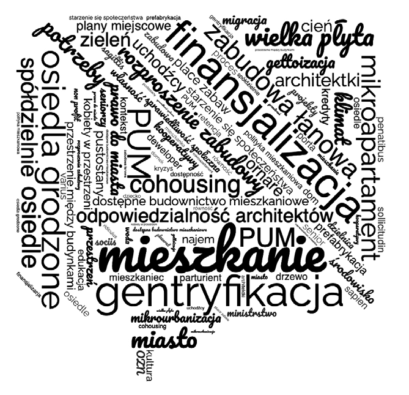

# EDUKACJA OBYWATELSKA

# ~

z Agatą Twardoch, urbanistką, profesorką w Katedrze Urbanistyki i Planowania Przestrzennego Wydziału Architektury Politechniki Śląskiej rozmawiał: Sebastian Dziedzic

~Podczas studiów wielokrotnie słyszałem, że architekt jest zawodem zaufania publicznego. Nie sposób nie odnieść wrażenia, że nie przekładało się to na rzeczywistość prowadzonych zajęć. Ilość czasu poświęconego na coś, co nazwałbym edukacją obywatelską czy społeczną, była niewielka, o ile w ogóle ten temat się pojawiał. Problem widzę w urynkowieniu edukacji. Oczekujemy, że studia przygotują absolwentów do wykonywania zawodu, a pomijamy to, co – wedle logiki rynku – nie przynosi korzyści finansowych. W takim quasi-pruskim systemie edukacji nie ma miejsca na mówienie o społecznym wymiarze architektury.

Masz rację, ale widzę też dodatkową przyczynę, związaną z odziedziczoną po modernizmie i już, mam wrażenie, przeterminowaną specyfiką naszego zawodu. Mam tu na myśli obraz architekta – demiurga i nieomylnego eksperta odpowiedzialnego w swoich oczach za wiekopomne dzieła i poprawę losu maluczkich. Mimo że niezwykle cenię myśl architektoniczną początku XX wieku – modernizm, funkcjonalizm, styl międzynarodowy i postulaty CIAM-u – to nie są to idee na dziś. O ile pewne działania i zjawiska socjotechniczne (np. wliczona w komorne, więc mobilizująca do korzystania opłata za łaźnię, pogadanki o prawach kobiet w pomieszczeniach towarzyszących pralni, otwieranie bibliotek czy niesprzedających alkoholu gospód) były uzasadnione w przypadku międzywojennych osiedli WSM, o tyle teraz potrzebujemy całkiem odmiennego podejścia do spraw społecznych. Nie z góry, z gotowym scenariuszem, ale z boku, z ciekawością tego, co zastajemy i czego się od nas oczekuje, a dopiero na końcu z nadzieją, że coś możemy poprawić. Przygotowanie do takiego sposobu myślenia wchodzi na nasze uczelnie bardzo powoli, ale wchodzi. Od twoich studiów trochę się już pozmieniało. Dziś, ucząc urbanistyki, dużo uwagi zwracamy na sprawy społeczne i powin-

Il. 1. Slajd zapowiadający tematy fakultetu Tereny mieszkaniowe...na Wydziale Architektury PŚ, il. Agata Twardoch

51 — kształcenie ności obywatelskie, choć żeby poznać całą prawdę, musiałbyś porozmawiać ze współczesnymi studentkami i studentami – ja nie jestem tu obiektywna. Niestety zmiana przychodzi za wolno – dla obecnego dziekana naszego wydziału nadal najlepszym wzorcem do naśladowania jest Dubaj…

~Pierwszy slajd prezentacji, którą rozpoczynasz swoje zajęcia pt. Tereny mieszkaniowe – historia, trendy, współczesne mieszkania na Wydziale Architektury Politechniki Śląskiej w Gliwicach, zawiera zbiór haseł. Znajdziemy tam słowa, takie jak gentryfikacja, sprawiedliwość społeczna czy własność. Skąd pomysł na to, by przedmiot w całości poświęcić właśnie zagadnieniom, które dałoby się określić innym słowem – polityka?

W 2004 roku obroniłam magisterkę na temat socjalnej zabudowy mieszkaniowej. Wrażliwość społeczna nie była wtedy cechą, na którą zwracano jakąś szczególną uwagę, więc pracę poprowadziłam zgodnie z modernistyczno-eksperckim paradygmatem. Zbadałam normatywy mieszkaniowe w różnych krajach i okresach, zrobiłam symulacje ergonomiczne determinujące minimalną powierzchnię konieczną dla realizacji potrzeb i na tej podstawie opracowałam „alfabet pomieszczeń”. Z pomieszczeń zbudowałam

## 5235 —RZUT+

mieszkania, z mieszkań ułożyłam rodzaje budynków. Wytypowałam możliwe układy urbanistyczne, w ramach których wskazałam wprawdzie hierarchię przestrzeni publicznych, ale nie uwzględniłam

POLITYKA – CZYLI UZGADNIANIE ZACHOWAŃ WSPÓŁZALEŻNYCH SPOŁECZEŃSTW O SPRZECZNYCH INTERESACH – NADAJE SPRAWOM MIESZKANIOWYM TRZECI WYMIAR, KTÓRY CZĘSTO JEST ODPOWIEDZIĄ NA DWUWYMIAROWE PYTANIA

kontekstu – miała to być w końcu zabudowa „modelowa”. Do tej pory mi wstyd, gdy sobie przypomnę, że jednym z pomysłów było to, aby do takiej zabudowy przenieść niezamożnych mieszkańców śródmiejskich kamienic, a te kamienice wyremontować i przeznaczyć dla „normalnych” obywateli. Usprawiedliwiam się tym, że był początek lat 2000. i absolutnie nikt mi nie pokazał, że można myśleć inaczej. Wszyscy byli jeszcze zachłyśnięci świeżo wywalczonym neoliberalizmem. Ja i tak należałam do pewnej awangardy ze swoim dyplomem, bo dotyczył on mieszkań socjalnych, a nie luksusowej willi na zboczu góry czy salonu samochodowego.

Po dyplomie byłam pewna, że już wiem, jak rozwiązać problem mieszkaniowy. Niestety rzeczywistość zdawała się tego nie potwierdzać, więc zdecydowałam się na doktorat. Pracując nad nim, odkryłam urbanistykę i socjologię oraz nabrałam społecznej wrażliwości, której zabrakło mi wcześniej. Przez chwilę znowu miałam wrażenie, że już wszystko wiem, ale – tak jak poprzednio – tej racjonalnej recepty nie dało się tak łatwo zrealizować. Od tamtej pory właściwie cały czas zajmuję się kwestią mieszkaniową – mam coraz większą wiedzę i coraz mniejszą wiarę w panaceum. I coraz więcej pytań. Bo choć teoretycznie wiemy, jak szybko i tanio wybudować dobre mieszkania oraz co sprawia, że przestrzeń jest piękna i przyjazna do życia – wychodzi, jak widać. Dlaczego? Czy aby dla wszystkich przyjazna i piękna przestrzeń oznacza to samo? Czy na pewno potrzebujemy budować więcej mieszkań? Polityka – czyli uzgadnianie zachowań współzależnych społeczeństw o sprzecznych interesach – nadaje sprawom mieszkaniowym trzeci wymiar, który często jest odpowiedzią na dwuwymiarowe pytania.

~W ramach pracy naukowej zajmujesz się wieloma aspektami polityki mieszkaniowej, co przekłada się na program prowadzonych zajęć. Jednym z istotniejszych tematów jest zapewne urynkowienie mieszkalnictwa. Mieszkanie przestało być wyłącznie dobrem użytkowym, a stało się aktywem finansowym.

W tym zakresie realizuję jeszcze jeden cel – staram się rozwijać świadomość wyborców, którzy mają wpływ na to, jak wygląda nasz kraj. To, czy mieszkania będą tylko towarem, czy może jednak część z nich będzie pojmowana w kategorii infrastruktury, jest tematem przede wszystkim politycznym. Mechanizmy finansjalizacji czy utowarowienia mieszkań są odmienne od powszechnie rozumianego prawa popytu, podaży i samoregulacji, wynikającego z funkcjonowania wolnego rynku. Potrzebujemy świadomego społeczeństwa, które rozumie, w jaki sposób decyzje polityczne wpływają na sytuację mieszkaniową w naszym kraju. Rozmowa o zabudowie mieszkaniowej nie może się ograniczać do zagadnień estetycznych.

~Parafrazując słowa założycieli pracowni Urban-Think Tank, można powiedzieć, że „architektura to zamrożona polityka”1.

1 „Urbanistyka to zamrożona polityka” – cytat z: J. McQuirk, Radykalne miasta, Warszawa 2016, s. 571/4093 (Kindle edition).

Właśnie, architektury nie da się oddzielić od polityki.

~Czyli te zajęcia powstały nie tylko z ciekawości, ale również z frustracji, że o roli polityki nikt na uczelni nie mówi. Moim zdaniem potrzebne jest uzupełnienie kwestii naszego spojrzenia na architekturę.

Koniecznie. W trakcie mojej edukacji temat polityki był zupełnie pomijany, a w czasie twoich studiów zaczął nieśmiało kiełkować. Cieszę się, że mogłam na żywo obserwować ten proces. Zmiana miała odbicie w pojawiających się publikacjach. Wydaje mi się, że pierwszą polską pozycją, która poruszyła problematykę mieszkalnictwa i trafiła do szerszego grona odbiorców, była – wydana w 2015 roku – książka 13 pięterFilipa Springera. Teraz takich publikacji jest bardzo dużo. Nadszedł chyba czas, żeby kwestia polityki stała się w większym stopniu obecna na uczelniach – szczególnie że w przewidywalnej przyszłości część tradycyjnych kompetencji absolwentek i absolwentów wydziałów architektury zastąpi sztuczna inteligencja.

~Książka Springera odbiła się szerokim echem również w środowisku architektów. Wiele osób po raz pierwszy spojrzało na przedmiot swojej codziennej pracy z zupełnie innej perspektywy. Filip przedstawił problem mieszkaniowy w sposób bardzo mocno działający na wyobraźnię.

Polskie warunki mieszkaniowe zostały pokazane poprzez historie konkretnych osób, z którymi czytelnik może się utożsamić. Ta publikacja bardzo ułatwia mi pracę. Daję tę książkę do przeczytania swoim studentkom i studentom, żeby łagodnie wprowadzić ich w tematykę zajęć. Prowadzony przeze mnie przedmiot jest fakultatywny, przychodzą do mnie osoby, które często mają już wyobrażenie, co chcą robić, i pomysł na to, jak rozwijać swoją karierę. Lektura 13 pięterto początkowa weryfikacja tego, czy dobrze trafili. Na pierwszych zajęciach zawsze uprzedzam, że jeśli ktoś szuka konkretnej wiedzy technicznej i nie jest szczególnie zainteresowany problemem polityki mieszkaniowej, to być może ten przedmiot nie jest dla niej lub dla niego najlepszym wyborem.

~Zwłaszcza że twoje zajęcia nie są prowadzone w typowy sposób. Mnie, gdy po raz pierwszy się na nich pojawiłem, zaskoczyło to, że zamiast standardowych wykładów, prowadzonych ex cathedra, byliśmy zachęcani do formułowania i wygłaszania własnych poglądów. Siedzenie w ławkach zastąpiły dyskusje w kole. W ciepłe dni wychodziliśmy na zewnątrz, gdzie nawet przypadkowe osoby mogły śledzić przebieg zajęć. Rewolucja.

Moim zdaniem dla architektki i architekta umiejętność argumentacji jest niezwykle ważna – czy to w rozmowie z inwestorem, czy to w relacjach ze współpracownikami. Jeśli nie będziemy potrafili wytłumaczyć swojej racji, to zawsze będziemy na straconej pozycji. Dlatego na zajęciach nie chciałam prowadzić wykładów. Zależało mi, żeby wszyscy ćwiczyli formułowanie wypowiedzi, szukali

ZALEŻAŁO MI, ŻEBY WSZYSCY ĆWICZYLI FORMUŁOWANIE WYPOWIEDZI, SZUKALI

ARGUMENTÓW (...) I UCZYLI SIĘ SŁUCHAĆ. A JAK INACZEJ MOŻNA TO ROBIĆ, JEŚLI NIE POPRZEZ PROWADZENIE DYSKUSJI?

argumentów (czasem nawet sprzecznych z własnymi przekonaniami) i uczyli się słuchać. A jak inaczej można to robić, jeśli nie poprzez prowadzenie dyskusji?

Słuchanie opinii studentów pozwala mi też na bieżąco modyfikować tematykę zajęć. Zmiany zachodzą bowiem

## 53 — kształcenie

## 5435 —RZUT+

cały czas – tematy wczoraj odkrywcze, dziś stają się banalne. Jeśli widzę, że jakieś zagadnienie jest grupie zbyt dobrze znane, to wiem, że powinnam pogłębić dyskusję albo zmienić jej temat. Wiąże się z tym również mój osobisty lęk, że przyjdzie kiedyś moment, w którym „odjedzie mi peron”, a to, o czym będę opowiadać, okaże się dla moich słuchaczy zupełnie nieistotne, anachroniczne lub niepotrzebne. Wszyscy mieliśmy takich profesorów, którzy nie rozpoznawali współczesnej rzeczywistości i powtarzali ten sam wykład przez 20 lat. Bardzo nie chciałabym zostać taką profesorką, dlatego to, o czym myślą i mówią studenci, autentycznie mnie interesuje.

Wsłuchiwanie się w głos uczestniczek i uczestników zajęć, choć to mikroskopijna i bardzo specyficzna grupa badawcza, pozwala mi też śledzić, jak zmienia się podejście młodych osób do różnych zagadnień – choćby dylematu „kupić czy wynająć?”.

~I co, studenci się zmieniają?

Oczywiście. W końcu każdy kolejny rocznik dorasta w nieco innym świecie. Zauważ, jak zmienił się system edukacji w ogóle. Popularną kiedyś opisową formę zaliczania przedmiotów zastąpił system testów zamkniętych, w których oprócz obiektywnej wiedzy liczy się znajomość konkretnego klucza. W szkołach zniknęło pole do negocjacji i wyrażania poglądów, a to jest jedna ze zmian, które są dla mnie bardzo widoczne, szczególnie w przypadku młodszych roczników. Okazuje się, że zadania, które nie mają jasnych reguł i jednoznacznych wymogów, nagle sprawiają ogromne trudności.

Nie rozumiem jednak tego, że na części zajęć na wydziałach architektury również kontynuuje się zwyczaj określania bardzo konkretnych wymogów formalnych – dotyczących nie tylko formatu końcowych plansz i dokładnego zakresu projektu, ale również layoutu wraz z kolorystyką, układu plansz, czcionek etc. W takiej sytuacji studentki i studenci poświęcają bardzo dużo uwagi na dostosowanie się do wytycznych, zamiast skupić się na rozwiązaniu problemu projektowego.

Staram się – jeśli to tylko możliwe – iść inną drogą. Ostatnio na zajęciach dla drugiego roku zmieniłam standardowy program na korzyść zadania otwartego. Moją grupę przywitałam komunikatem: „Jesteście dwiema pracowniami wynajętymi przez miasto do zdiagnozowania problemów śródmieścia oraz poproszonymi o przedstawienie rozwiązań”. Zapewniłam totalną wolność wyboru formy i sposobu prezentacji efektów pracy. W pierwszym momencie wszyscy się dosłownie wściekli. Koniecznie chcieli wiedzieć, co mają „konkretnie” zrobić. Dopiero w trakcie semestru zaczęli rozumieć moje intencje, bo ja im oczywiście towarzyszyłam w całym procesie, opiekowałam się nimi pod kątem merytorycznym i podpowiadałam kolejne kroki. Gdy przestali się obawiać, że ich rozwiązania formalnie nie spełnią warunków zaliczenia, pokazali, na co ich naprawdę stać. Tym sposobem powstały dwa świetne, wielowymiarowe projekty, które dodatkowo udało się zaprezentować przed publicznością. Wydaje mi się, że po takich zajęciach te młode osoby mogą wreszcie sobie wyobrazić, na czym naprawdę polega urbanistyka.

~To rezonuje z moimi doświadczeniami wykładowcy, kiedy prowadziłem zajęcia w ramach twojego przedmiotu, dotyczące projektowania urbanistycznego zespołów mieszkaniowych. Pytając studentkę czy studenta, dlaczego coś zaprojektowali w dany sposób, spotykałem się z reakcją obronną albo przynajmniej ze sporą dozą podejrzliwości. A przecież kierowała mną wyłącznie ciekawość. Dopiero po jakimś czasie zrozumiałem, o co chodzi. Po prostu część osób miała obawy, że próbuję im wytknąć jakiś błąd w rozumowaniu.

Ciekawość czyjejś perspektywy, która jest podstawą procesu współpracy, była dla nich obca. Ja jednak rozumiem rolę wykładowcy jako partnera, który wspiera studenta w jego interpretacji rzeczywistości, a nie jako kogoś, kto ma być jedynym źródłem informacji.

Jako nauczyciele i nauczycielki nie tylko nie wiemy wszystkiego, ale również (o zgrozo!) czasem możemy się mylić. Sama staram się głośno przyznawać, jeśli czegoś nie wiem, a nawet prosić studentkę czy studenta o wyjaśnienie kwestii, których akurat nie znam. Nie zależy mi na tym, żeby absolwentki i absolwenci byli przekonani o mojej nieomylności i wyjątkowości, tylko na tym, żeby wiedzieli, jak dobrze wykonywać swoją pracę. Nie chcę ich także przekonać do tego, że nic nie potrafią, a mam wrażenie, że części moich wykładowców właśnie na tym bardzo zależało.

Do tego nie znoszę stawiania stopni. Nie widzę potrzeby kwantyfikowania oceny wykonanej pracy twórczej. Znacznie ważniejsza jest krytyczna analiza i informacja zwrotna – co zostało wykonane poprawnie, co nie, gdzie można jeszcze szukać inspiracji, co trzeba przeczytać lub obejrzeć, żeby było lepiej.

~Tym ważniejsza staje się rola wykładowcy w procesie nauczania.

Bardzo bym chciała, żeby rolą wykładowcy, poza nauką krytycznej analizy, pokazywaniem różnorodności rozwiązań problemu czy otwartością, było również budowanie u studentek i studentów odwagi, bo ta jest w naszym zawodzie bardzo potrzebna. Przecież dużo łatwiej i bezpieczniej jest powiedzieć, że czegoś się nie da zrobić. A wyobraźnia i odwaga to jedyne cechy, które mogą nam pomóc zmienić świat na lepsze. Oczywiście uczenie zasad projektowania i aspektów technicznych to ważna rzecz, ale trzeba pamiętać, że one bardzo szybko się zmieniają.

~W cyklu zajęć wyróżnia się tematyka jednego spotkania, poświęconego wyłącznie kobietom – architektkom. Dlaczego ten temat jest dla ciebie ważny?

Te konkretne zajęcia są pewnego rodzaju manifestem, moim osobistym protestem. Jednocześnie wpasowują się w obszar mojej pracy. Mnie nie interesują szklane wieżowce, chcę przekazywać inne wzorce. Wiele świetnych przykładów kobiecej architektury wychodzi poza obowiązujące ramy. Przez większość mojej edukacji kobieca perspektywa i jej wpływ na archiBARDZO BYM CHCIAŁA, ŻEBY ROLĄ WYKŁADOWCY, POZA NAUKĄ KRYTYCZNEJ ANALIZY (...), BYŁO RÓWNIEŻ BUDOWANIE

U STUDENTEK I STUDENTÓW ODWAGI, BO TA JEST W NASZYM ZAWODZIE BARDZO POTRZEBNA

tekturę były pomijane. Kiedy kończyłam studia, dla kobiet w zawodzie przewidywana była rola asystentki, inne standardy nie istniały. Dziś jest znacznie lepiej, ale jeszcze nie idealnie. Uznałam, że dopóki w świecie architektury nie zagości równość, to będę pokazywać głównie kobiece projekty i realizacje •

Książka Agaty Twardoch, System do mieszkania. Perspektywy rozwoju dostępnego budownictwa mieszkaniowego wydawnictwaFundacja Bęc Zmiana, doczekała się właśnie drugiego wydania i jest ponownie dostępna w sprzedaży.

## 55 — kształcenie

