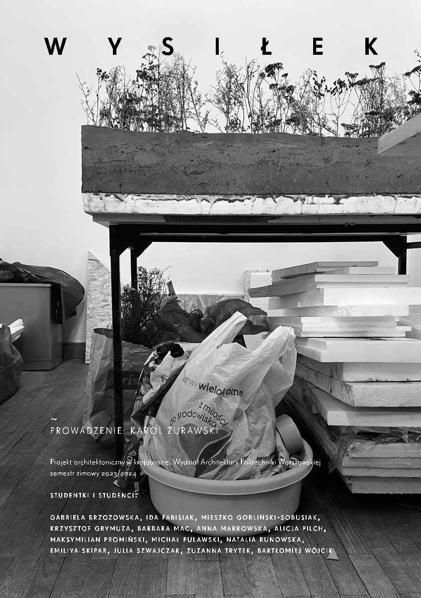

# W Y S I Ł E K

~

PROWADZENIE: K AROL ŻUR AWSKI

## Projekt architektoniczny w krajobrazie, Wydział Architektury Politechniki Warszawskiej semestr zimowy 2023/2024

studentki i studenci: gabriel a brzozowsk a, ida fabisiak, mieszko gorliński-sobusiak, krz ysztof grymuza, barbar a mac, anna markowsk a, alicja pilch, maksymilian promiński, michał pu ł awski, natalia runowsk a, emiliya skipar, julia szwa jczak, zuzanna try tek, bartłomiej wójcik

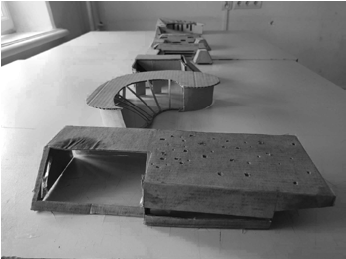

fot. Maksymilian Prominski

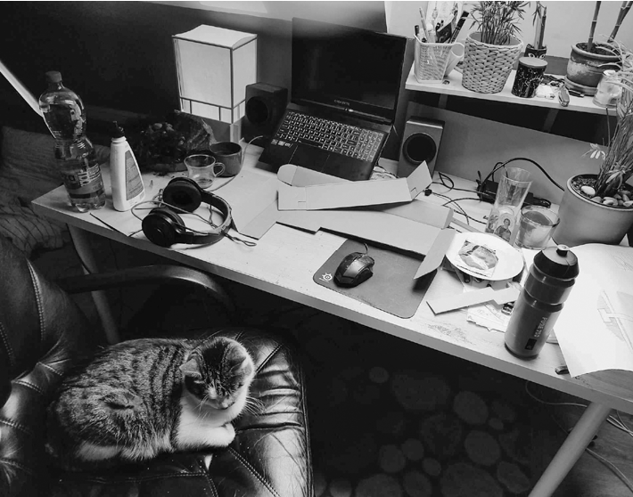

fot. Maksymilian Prominski fot. Zofia Piotrowska

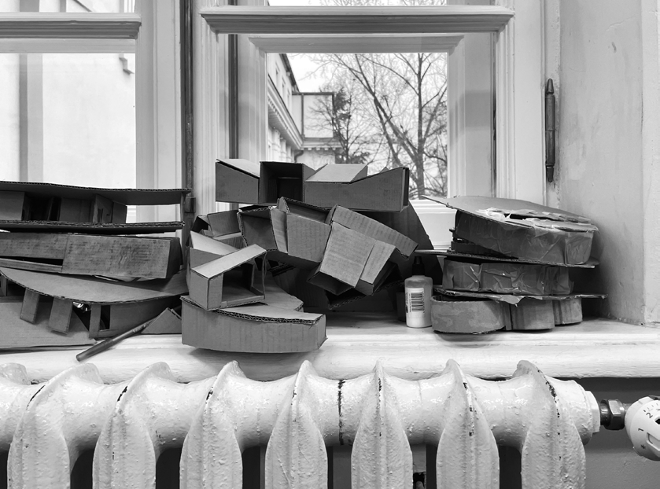

fot. Zofia Piotrowska

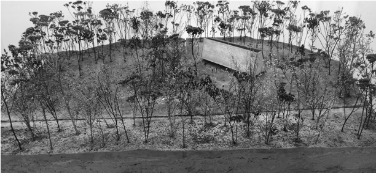

fot. Karol Żurawski

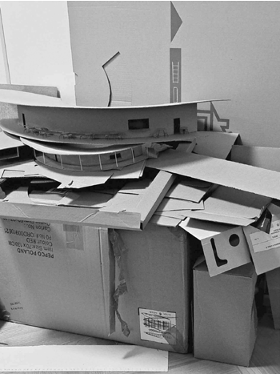

fot. Barbara Mac

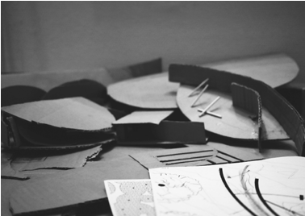

fot. Zuzanna Trytek

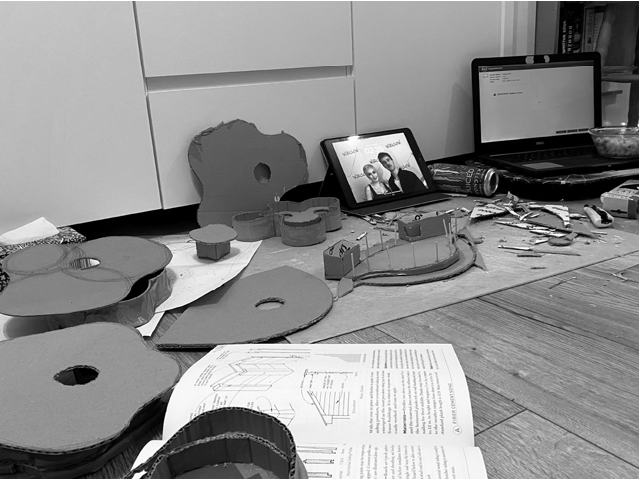

fot. Julia Szwajczak

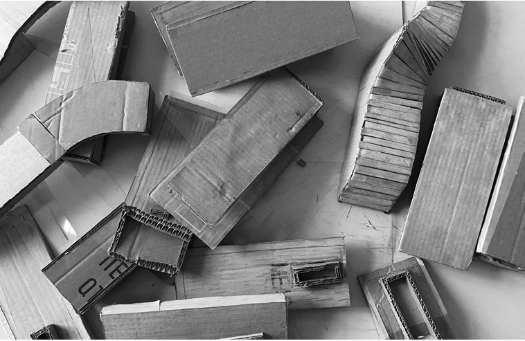

fot. Bartłomiej Wójcik

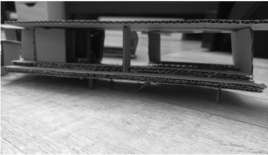

fot. Krzysztof Grymuza

### fot. Karol Żurawski —>

### fot. Karol Żurawski —>

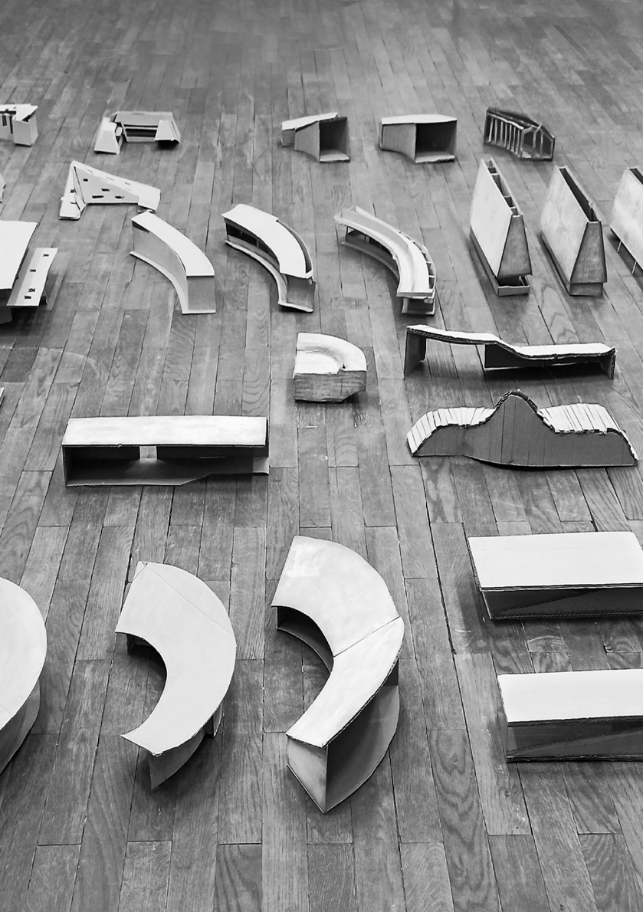

