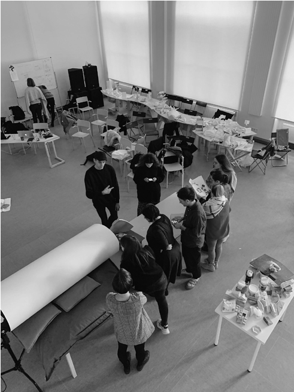
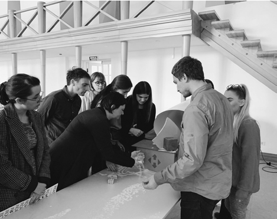
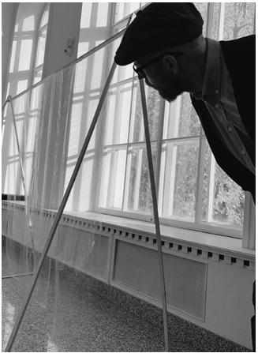
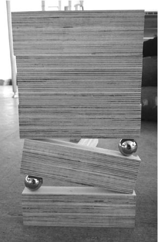
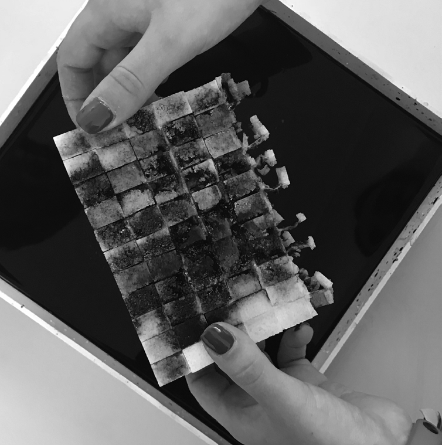
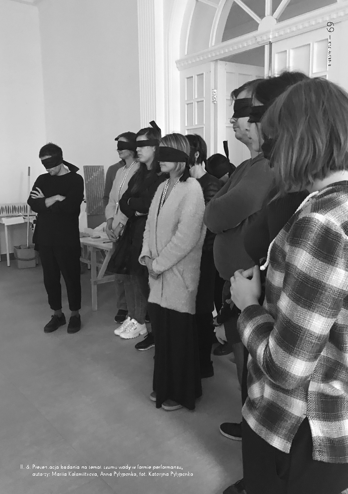

# NA PRZEKÓR UTARTYM ŚCIEŻKOM

# ~

z Małgorzatą Kuciewicz

- i Simone De Iacobisem, tworzącymi grupę Centrala rozmawiała: Mariia Kolomiitseva

~Pierwszy raz spotkałam was w 2018 roku w Charkowskiej Szkole Architektury, gdzie od kilku lat prowadzicie niekonwencjonalne warsztaty na temat wody, światła, wiatru i grawitacji. Skąd taki pomysł na zajęcia? Czy była to reakcja na istniejącą formalną edukację? Małgorzata Kuciewicz: W 2018 roku, w trakcie pracy nad naszą wystawąAmplifikacja naturyw Pawilonie Polskim na 16. Międzynarodowej Wystawie Architektury – La Biennale di Venezia, doszło do istotnej zmiany w naszej praktyce. Ania Ptak, kuratorka, pomogła nam sformułować nasz program twórczy, nowe spojrzenie na architekturę. To było jeszcze przed protestami Grety Thunberg, ale pole sztuki, z którego Ania się wywodzi, już pytało o antropocen i katastrofę klimatyczną.

Simone De Iacobis: Elementem postulatu koncepcji Amplifikacja naturyjest przekonanie, że architektura nie powinna nas izolować od natury, ponieważ stanowi jej integralną część. Nie jest statycznym, nieruchomym obiektem, ale podlega ciągłym procesom metabolizmu. Wszystkie siły przyrody nieustannie oddziałują na architekturę, kształtując ją i modyfikując. Warsztaty w Charkowskiej Szkole Architektury mają dla nas charakter eksperymentalny. Studenci stają przed wyzwaniem, polegającym na wymyśleniu nowego sposobu przedstawienia tego, co nie ma tradycji reprezentacji w architekturze.

M.K.: Warsztaty stanowią dla nas okazję do uczenia, że przepływy są równie istotne, co budynki. Pokazujemy, jak obARCHITEKTURA NIE POWINNA NAS IZOLOWAĆ OD NATURY, PONIEWAŻ

STANOWI JEJ INTEGRALNĄ CZĘŚĆ serwacje zjawisk przyrodniczych można przekształcać w narzędzia projektowe. Naszym celem jest zmiana spojrzenia na architekturę, by zamiast statycznych obiektów widzieć w niej fragmenty procesów zachodzących w skali planety. Do tej pory dominowało przekonanie, że architektura jest wieczna i trwała. My widzimy

- ją w dynamicznej perspektywie. S.I.: Dla mnie najważniejsze jest to, że studenci obalają mit o architekturze jako o stabilnym przedmiocie, produkcie. Architektura stanowi część większej

ARCHITEKTURA STANOWI CZĘŚĆ WIĘKSZEJ CAŁOŚCI, BOGACTWA PROCESÓW SŁUŻĄCYCH REPRODUKCJI PLANETY. WSZYSTKIE SIŁY NATURY, ZWIERZĘTA I INNE ISTOTY PRZEKSZTAŁCAJĄ SIĘ I WPŁYWAJĄ NA WYNIK PRACY ARCHITEKTÓW. TO PROCES WSPÓŁTWORZENIA

całości, bogactwa procesów służących reprodukcji planety. Wszystkie siły natury, zwierzęta i inne istoty przekształcają się i wpływają na wynik pracy architektów. To proces współtworzenia.

~Na waszych warsztatach nie stosowaliśmy klasycznych narzędzi projektowych, takich jak rysunki, modele 3D czy statyczne makiety, bo były one bezużyteczne w pracy z procesami. Aby studiować i reprezentować projekt, trzeba było wymyślić nowe metody – makiety performatywne, filmy, performansy. W szkołach jednak wszystkie projekty tworzone są tak, aby dało się je zaprezentować na planszy. Co o tym sądzicie? M.K.: Studenci Charkowskiej Szkoły Architektury są bardzo rozmakietowani i nie boją się przedstawiać różnorodnych propozycji, nawet wiedząc, że nie wszystkie z nich przetrwają w procesie. Jednak natknęliśmy się też na osoby mniej chętne do eksperymentowania. Postanowiliśmy więc zbudować małą piaskownicę i skłonić grupę do tworzenia różnych form terenu – jedną terenoplastykę na minutę. Na początku studenci byli zestresowani wyzwaniem, ale z czasem weszli w rytm i zaczęli działać niemal intuicyjnie. Do komunikacji przestali używać słów, a zamiast nich stosowali gesty i ruchy rękami w piasku. Dla nas, jako tutorów, to był magiczny moment, który pokazał, jak istotne jest pokonywanie własnych ograniczeń. Kiedy próbujemy wprowadzić ten sam format w Warszawie, to jest nam trudniej. Tutaj młode osoby często obawiają się włączać w proces, który zakłada eksplorację wielu wariantów makiet. Nie są obyci z modelunkiem, przerabianiem. Uczymy ich, że popełnianie błędów jest równie ważne, jak osiąganie sukcesów w procesie edukacji.

S.I.: Praca ręczna nad makietą nie jest zbyt powszechną praktyką w szkołach architektury w Polsce. Kiedy tworzysz makiety, czasami nie masz określonego kształtu w umyśle, chyba że wykonujesz model dopiero do prezentacji gotowej pracy. A to wiąże się z innym sposobem myślenia.

M.K.: Wydaje mi się, że w przypadku warszawskiej szkoły kładzie się nacisk na przygotowanie absolwentów do wkraczania na rynek pracy i efektywnego działania w branży, w której produkcja jest już określona, związana z inwestycjami budowlanymi. W trakcie studiów brakuje jednak czasu dla osób, które chciałyby w swojej praktyce zawodowej podążać alternatywną ścieżką.

S.I.: Istnieje cała tradycja pedagogiki radykalnej, związana z nauką projektowania architektury. Ludzie uczą się projektować, grając w gry, pracując w ogrodach, łącząc edukację architektoniczną z edukacją artystyczną i innymi kursami. Jest wiele sposobów, dzięki którym można się uczyć i stać się architektem.

M.K.: Uczymy więc, jak badać i reprezentować procesy. Postanowiliśmy, że w swojej pracy nie musimy budować czegoś zupełnie nowego, ale dużo rekonstruujemy i tworzymy performatywne modele, aby

## 63 — kształcenie

6435 —RZUT+

Il. 1., 2. Testowanie prototypów w tunelu aerodynamicznym, fot. Julia Mykhailenko zrozumieć, jak pewne procesy działały w przeszłości. Przykładowo, terenoplastyka Aliny Scholtz, zrealizowana w parku Moczydło, została przez nas zamodelowana i odczytana w celach badawczych. S.I.: Na jednym z naszych ostatnich warsztatów studenci zbudowali żeremie. Poprzez pracę z naturalnymi materiałami rozpoznali zachowania bobrów, np. liście potraktowali jako membrany. To było interesujące doświadczenie – obserwować, jak uczestnicy projektu wznosili tamy i jak w trakcie tego procesu, na poziomie gestów, stawali się bobrami.

~Czy takie metody przedstawiania koncepcji architektonicznych oraz nowe wartości mogą pomóc w przełamaniu bariery komunikacyjnej pomiędzy architektami i niearchitektami? Ludzie najczęściej oceniają projekty w kategoriach piękne lub brzydkie. Przydałoby się przenieść tę komunikację na jakościowo inny poziom. M.K.: Dla ludzi znacznie łatwiejsza do zrozumienia jest architektura, której integralną częścią są zjawiska przyrodnicze. Znacząco zmienia się jej percepcja, gdy wykorzystuje ona roślinność jako komponent, np. zielonego dachu.

S.I.: Zaangażowanie wszystkich zmysłów widza w projekt architektoniczny pomaga lepiej go zrozumieć i się z nim utożsamić. Zazwyczaj plany lub makiety architektoniczne są wizualne i można ich dotknąć. Jednak za pomocą makiety performatywnej, podczas prezentacji fabularnej, można także uwzględnić inne elementy sensoryczne, np. sprawić, że widzowie poczują zapach gleby wykorzystanej do stworzenia modelu, poczują wiatr lub lekki podmuch albo doświadczą wilgoci związanej z obecnością wody. Kiedy zaangażujesz wszystkie zmysły, ludzie mają szansę stworzyć z projektem głębszą relację.

~Coraz częściej pojawia się temat non-antropocentryzmu. Kiedyś rzeka, gleba, zwierzęta i rośliny były ważnymi elementami codziennego życia niemal każdego człowieka. Teraz jest to coś „poza” społeczeństwem – sztuczne środowisko uznaje się za ważniejsze. Jak możemy promować ideę poświęcenia części naszego komfortu na rzecz natury? M.K.: Pomocna okazała się pandemia. Podczas izolacji ludzie byli odcięci od przyrody, co sprawiło, że zaczęli odczuwać jej brak. Ta relacja działa w obie strony. Istnieje koncepcja zdrowia cyrkularnego, która zakłada, że nasze zdrowie jest powiązane ze zdrowiem innych istot. W czasie pandemii ludzie zrozumieli tę zależność. Stało się dla nich jasne, że potrzebują dostępu do parków i terenów zielonych, nawet jeśli niekoniecznie wiedzą dlaczego.

S.I.: Myślę, że ważnym słowem jest reciprocity– wzajemność. To idea mówiąca, że budując coś, nie tylko budujesz to fizycznie dla siebie, ale również myślisz o szerokim spektrum istot, które z tego skorzystają. Zawsze zastanawiamy się, kto będzie beneficjentem naszych działań. Jeśli uwzględnisz też takich klientów, których wcześniej nie brałabyś pod uwagę, projekt stanie się bogatszy. Wyzwanie będzie znacznie bardziej interesujące,

NATURALNYM KROKIEM JEST

TRAKTOWANIE ROŚLIN I ZWIERZĄT JAKO KOLEJNEJ GRUPY, KTÓREJ WARTO PRZYJRZEĆ SIĘ POD KĄTEM PROCESÓW

EMANCYPACYJNYCH

ponieważ postawisz sobie pytania, których wcześniej nie zadawałaś, a odpowiedzi, jakie będziesz mogła znaleźć, okażą się znacznie bardziej wartościowe.

M.K.: Żyjemy w czasach emancypacji różnych grup społecznych. Naturalnym krokiem jest traktowanie roślin i zwierząt jako kolejnej grupy, której warto przyjrzeć się pod kątem procesów emancypacyjnych. Mamy nadzieję, że prędzej

## 65 — kształcenie

6635 —RZUT+

czy później te dążenia do równości zostaną zrealizowane. Ludzie często nie znają zjawisk przyrodniczych, zwierząt i roślin. Jednak gdy zaczynają się z nimi stykać, to one stają się częścią codziennego życia i przestają być problemem. Podobnie dzieje się ze zjawiskami pogodowymi. Warto docenić te procesy. W Charkowie bardzo nam się podobało to, że tam nie było euroremontu. Tamtejsza architektura miała zapisane w swojej materialności np. naturalne procesy wietrzenia. W Warszawie działo się odwrotnie – remonty były przeprowadzane tak szybko, że nie mieliśmy okazji docenić naturalnej patyny i zacieków, które powstawały przez wiele lat. Warto zrozumieć, że architektura nie musi być sterylna, jałowa i wiecznie nowa, ale może ewoluować w harmonii z przyrodą i czasem.

S.I.: Kiedy przebywasz w sterylnym mieście, nie masz żadnych problemów. Wszystko jest komfortowe, bezpieczne, oświetlone. Kostka brukowa pozostaje idealnie równa, sklepy są na wyciągnięcie ręki, możesz usiąść, wejść dokądkolwiek, wszystko jest proste. Ale kiedy spacerujesz po mokradłach, na przykład Zakolu Wawerskim, musisz uważać, gdzie stąpasz, bo może kamień jest niestabilny. Czujesz zapach, rejestrujesz dźwięki i to, co dzieje się wokół ciebie. Ta świadomość jest naprawdę istotna, ponieważ sprawia, że otwierasz się na wszystkie te istoty, które zwykle nie są częścią twojego życia. Zrezygnowanie z części naszego komfortu pomaga nam zapoznać się z tym, co nas otacza.

M.K.: Nawet gdy coś jest z betonu i wydaje się wieczne, z czasem stanie się częścią osadu geologicznego. Zrozumienie tego wymaga jedynie rozszerzenia perspektywy czasowej, dzięki czemu zobaczymy, że wszystko podlega procesom i metabolizmowi. My to dostrzegamy, jednak zauważyliśmy, że też zadajemy zbyt statyczne pytania. Klimatolodzy tłumaczą nam, że zjawiska, o które pytamy, osadzamy w zbyt krótkich odcinkach czasu, że one wpływają na siebie wzajemnie

Il. 3. Model testowy, który reaguje na najmniejszy powiew wiatru, autorzy: Mariia Kolomiitseva, Anna Sokolova, Kateryna Pylypenko, Konstantyn Paleev, fot. Julia Mykhailenko w sposób bardziej skomplikowany. Trudno nam to uchwycić. Ale fascynujące jest to, że nauka stale uczy nas dostrzegania ciągłych zmian.

~W praktyce architektonicznej badanie kontekstu polega głównie na badaniu historii i obliczaniu wskaźników ilościowych: ludzi, samochodów, funkcji, nasłonecznienia itp. Na warsztatach zaproponowaliście alternatywną metodę poznawania tożsamości miejsca – powolny spacer. Organizujecie te spacery także w Polsce. Dlaczego jest to ważne i jak wpadliście na ten pomysł? S.I.: Zaczęliśmy organizować spacery krytyczne znacznie wcześniej, niż wpadliśmy na koncepcję Amplifikacji natury. Chodzenie zawsze było sposobem na zrozumienie biografii miejsc. Gdy musieliśmy zbadać historyczny kompleks architektoniczny lub projekt urbanistyczny, spacer zawsze dostarczał nam

- Il. 4. Model testowy, sprawdzający równowagę i oddziaływanie grawitacji, autor: Dmytro Leheyda, fot. Simone De Iacobis rzeczywistego zrozumienia. Cieleśnie odbierasz to, co widzisz, czego dotykasz, gdzie chodzisz – w górę i w dół. Jaki to miejsce ma zapach? Gdzie posadzone są drzewa i jakie rzucają cienie? Spacerowaliśmy z wieloma artystami będącymi na rezydencji w Warszawie. Pomagało nam to w gromadzeniu lokalnej wiedzy. Ostatnio badamy klimat poprzez spacery mikroklimatyczne, gdzie przeprowadzamy małe eksperymenty i obserwujemy, również skórą.

M.K.: Staramy się pokazać, że doświadczenia cielesne to kluczowa rzecz. Niektóre z tych procesów opierają się na tak subiektywnych odczuciach, że nie można ich zrozumieć, jedynie czytając teksty. Czasami bardziej korzystne jest wyjście na słońce i poczucie ciepła lub chłodu murów w celu zrozumienia termodynamicznych ruchów mas powietrza czy zmian oświetlenia.

~Oczywistą różnicą pomiędzy studentami z mojego i waszego pokolenia jest dostęp do technologii, która wpływa na wszystkie etapy projektowania. Łącznie z etapem poszukiwania inspiracji. Platformy, takie jak Pinterest, ArchDaily, Instagram, mają wadę – są zorientowane wizualnie. W rezultacie obserwujemy wzrost płaskich imitacji. Czy obawiacie się, że nastąpi triumf powierzchownych projektów? M.K.: Czasami widzimy, że to są nieświadome nawiązania, a szkoda, że ludzie nie wchodzą w dialog z wcześniejszymi formami. Wielu architektów, którzy pracują ponad dziesięć lat, ma za sobą akumulację doświadczeń i obrazów. Po tym czasie w architekturze zaczynasz dostrzegać pewne powtórzenia, masz opatrzone referencje historyczne. Jednak – jeśli mówimy o kształtach i formach – często pozostają one powierzchowne, brakuje celowego odwołania się do ich źródeł. Tym samym tracą na znaczeniu, stają się nieistotne.

S.I.: Obecnie znajdujemy się w okresie określanym jako „altermodernizm” – to, co robimy, jest mozaiką inspiracji, które czerpiemy z różnych źródeł, aby na ich podstawie wytwarzać nowe, znaczące całości. Tak funkcjonuje kultura i można to zaakceptować, w momencie gdy odwołanie do źródeł jest jawne. W naszej praktyce nie czerpiemy inspiracji z form architektury. Zamiast tego szukamy jej w innych dziedzinach, takich jak biologia, meteorologia, literatura, etnografia. Uważam, że to jest kluczowe. Istnieje znacząca różnica między to be inspireda to inspire yourself with. Nie czerpiemy więc inspiracji biernie, tylko raczej aktywnie poszukujemy czegoś, co nas prawdziwie zainteresuje, i postanawiamy, że to badanie staje się naszą inspiracją. Zalecałbym, aby studenci wyeliminowali pojęcie „oryginalności” ze swojego sposobu myślenia. Jest to bowiem słowo, które może zablokować i sparaliżować działania.

67 — kształcenie

- Il. 5. Model testowy dotyczący wody i zniszczenia, autorzy: Kateryna Pylypenko, Polina Sanzharevska, fot. Kateryna Pylypenko

~Architekci, a zwłaszcza studenci architektury, biorą na siebie wiele obowiązków: sami wybierają lokalizację, sami przeprowadzają badania, sami określają program budynku. Z takim nastawieniem idą do biura i już na etapie koncepcji podejmują wszystkie najważniejsze decyzje. Może warto podzielić się odpowiedzialnością z ekspertami z innych dziedzin? Może specjaliści spoza świata architektury powinni być stałymi współpracownikami architektów?

M.K.: Myślę, że istotna byłaby całkowita zmiana hierarchii. Obecnie architektura krajobrazu jest uważana za jakąś wyściółkę pomiędzy budynkami. Musimy to odwrócić. Powinno być tak, że najważniejsi są klimatolodzy, którzy rozumieją konsekwencje procesu budowlanego. Nawet jeżeli miasto jest dla nich chropowatością na powierzchni planety, to te osoby wiedzą, że kierunek wiatru zmieni się o siedem stopni i widzą tego konsekwencje w dłuższej perspektywie. Dlatego krajobraz powinien być priorytetem

69 — kształcenie

Il. 6. Prezentacja badania na temat szumu wody w formie performansu, autorzy: Mariia Kolomiitseva, Anna Pylypenko, fot. Kateryna Pylypenko

## 7035 —RZUT+

przed zabudową. Współpraca z osobami zajmującymi się zwierzętami, z badaczami, aktywistami i biurokratami pokazała nam, że każda z tych grup ma unikalny sposób myślenia i rozmawiania na ten sam temat. Architekt może pełnić funkcję pośrednika, który łączy te różne perspektywy i pomaga w znalezieniu wspólnego rozwiązania.

S.I.: Tworzenie architektury to proces zbiorowy. Architekt na placu budowy to najprawdopodobniej osoba, która ma najmniej wiedzy w porównaniu z innymi obecnymi na miejscu. Jego główną rolą jest koordynacja i zrozumienie pracy pozostałych ekspertów – inżynierów technicznych, elektryków, specjalistów z dziedziny biologii czy meteorologów. W świecie biur architektonicznych istnieją bardzo ciekawe multidyscyplinarne zespoły, tworzone przez ludzi z bardzo różnych środowisk – choćby Forensic Architecture, czyli biuro, które zajmuje się głównie zbrodniami wojennymi, ale również zbrodniami przeciwko planecie. Posługuje się środkami architektonicznymi, jednak tworzą je nie tylko architekci, lecz także prawnicy, aktywiści, antropolodzy, urbaniści.

M.K.: Niestety w klasycznych biurach było dużo wyzysku, np. korzystanie z czyjejś darmowej pracy. Kiedy najważniejszym celem jest zysk, aktywują się wszystkie złe mechanizmy. Nie możemy powiedzieć, że OMA jest wspaniałym biurem, ponieważ znamy wiele osób, które przeszły tam katorżniczą eksploatację.

Potrzebne są nowe protokoły oraz nowe sposoby finansowania praktyki architektonicznej. Bo jeśli ktoś chciałby wspierać antropozoologów, to kto by za to płacił?

S.I.: Model ekonomiczny jest bardzo ważny. Panuje przekonanie, że architekt siedzi i czeka, aż klient podejdzie ze zleceniem. W rzeczywistości istnieje wiele innych sposobów na działanie biura. Przykładowo, można samodzielnie inicjować i proponować projekty, tak jak często robimy. Architekci z Powerhouse Company w Rotterdamie zostali deweloperami. Są zatem różne formaty, ale trzeba dopasować je do swoich potrzeb. M.K.: Byłoby wspaniale mieć w biurze miejsce do testowania nowych protokołów działania. Prowadzić warsztaty lub zajęcia z ludźmi spoza architektury. Albo projektypro bonodla wykluczonych społeczności. Lub znaleźć przestrzeń dla climate fiction, tłumaczącego wyzwania przyszłości. Mamy wrażenie, że w szkole klasycznej, tak jak w Warszawie, studenci uczą się udawania dorosłych – poważnych architektów, którzy dostają warunki zabudowy i budżet, a następnie symulują proces inwestycyjny. To jest świetne. Ale zrobisz to 20 razy w życiu, a potem umrzesz z nudów.

S.I.: To bardzo ważne, aby zdefiniować na nowo, czym może być zawód architekta. A może on być praktycznie czymkolwiek, co sobie zaplanujesz. To eksperyment. Kluczowe jest wyjście poza utarte schematy •

