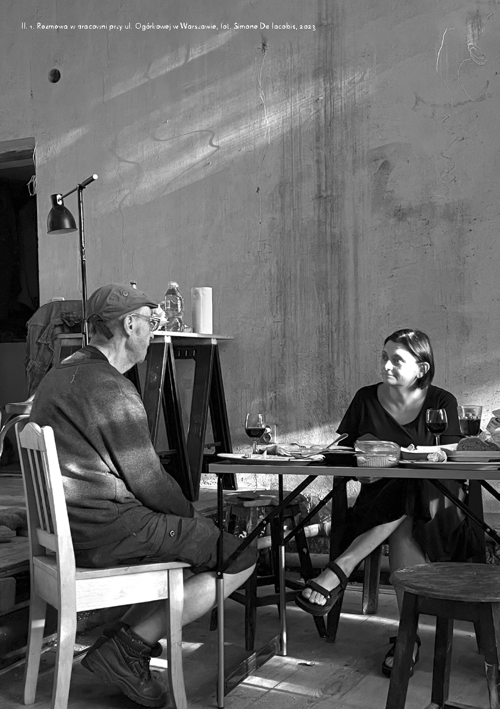
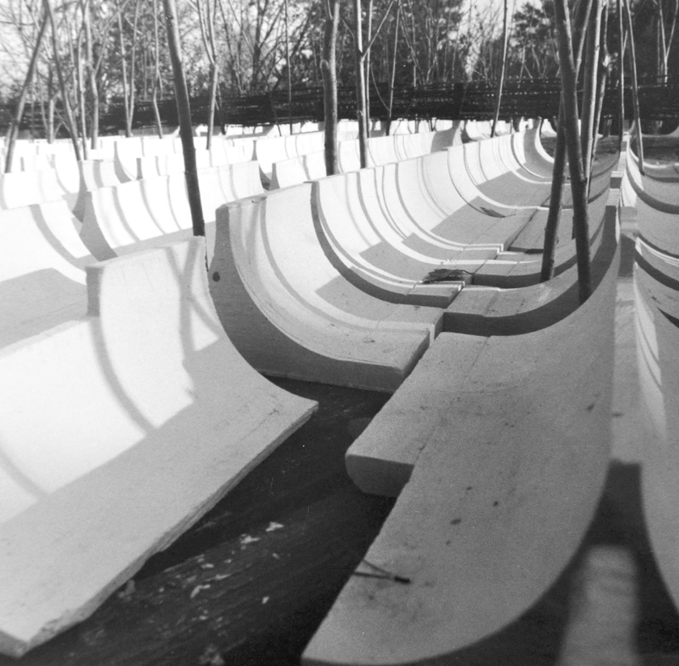
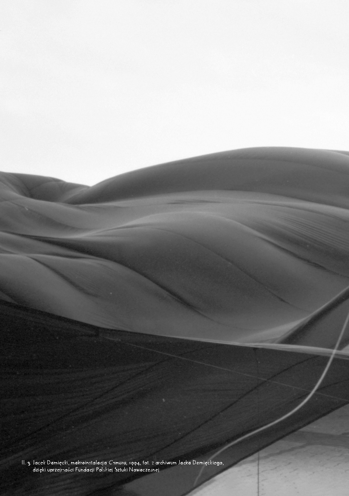
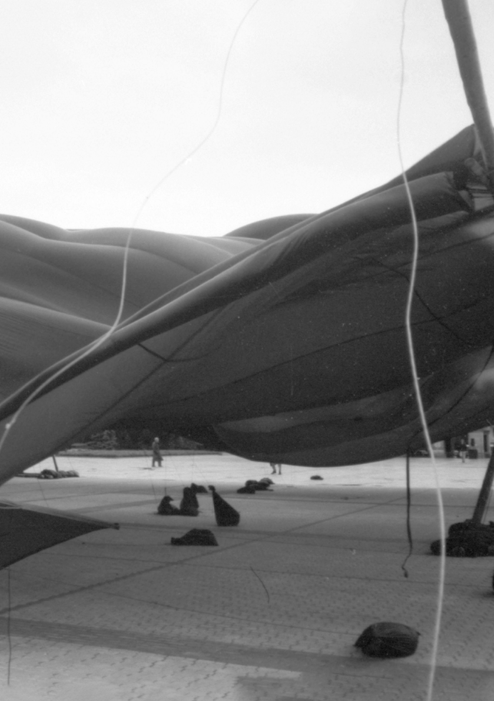

# TUTAJ NIE CHODZI O BRYK

# ~

z Jackiem Damięckim, architektem i wynalazcą rozmawiali: Małgorzata Kuciewicz Simone De Iacobis

~Jakie były kluczowe momenty w twojej edukacji?

Mój ojciec budował Dom Żeglarza Polskiego w Gdyni, więc jako chłopiec mogłem obserwować powstawanie portu, przypływanie Batorego1, załadunki statków. Przesiąkłem myśleniem o podróżach. Nabrałem powietrza i potem przez całe życie nic mnie nie potrafiło przydusić.

W domu, w Warszawie, byłem wychowywany w sposób nowoczesny, to znaczy bez skrajnych rygorów, i pewnie dlatego nadużywałem tej wolności. Wychodziłem z domu, wrzucałem teczkę przez okienko do piwnicy, brałem na kredyt czereśnie w zaprzyjaźnionym sklepiku i szedłem do klubu żeglarskiego. Tam brałem łódkę i płynąłem w górę Wisły. Sześć metrów żagla pozwalało wiosną, gdy były przybory, kręcić się po chaszczach i szuwarach.

1 Statek pasażerski, transatlantyk – przyp. red.

Miałem marzenie, by woda zalała całą Saską Kępę i żebym mógł tą łódką przypłynąć pod dom.

A „ZASKOCZYŁEM” W LICEUM SZTUK PLASTYCZNYCH. RYSUNEK, MALARSTWO, RZEŹBA, LITERNICTWO – NA PIĘĆ, Z RESZTY PRZEDMIOTÓW – TRÓJE. BEZ SZKICOWNIKA NIE MOGĘ ŻYĆ DO DZISIAJ.

TAKI PRZEŁOM JEST NAJWAŻNIEJSZY – NAPOTKAĆ COŚ DLA NAS WŁAŚCIWEGO I WEJŚĆ Z TYM W KONTAKT, BY ZACZĘŁO

SIĘ NASZE FORMOWANIE

Brak zakazów skończył się wysłaniem mnie do szkoły salezjańskiej we Włocławku. Wtedy powiało grozą. Zaczął się rygor. Udało mi się wrócić, dopiero gdy poznałem, co to samodyscyplina.

### Il. 1. Rozmowa w pracowni przy ul. Ogórkowej w Warszawie, fot. Simone De Iacobis, 2023

A „zaskoczyłem” w Liceum Sztuk Plastycznych. Rysunek, malarstwo, rzeźba, liternictwo – na pięć, z reszty przedmiotów – tróje. Bez szkicownika nie mogę żyć do dzisiaj. Taki przełom jest najważniejszy – napotkać coś dla nas właściwego i wejść z tym w kontakt, by zaczęło się nasze formowanie.

Później, na Akademii Sztuk Pięknych w Warszawie, miałem obsesję na punkcie ciągłego wymyślania. A byłem pod wielkim wpływem rzeczy, które mi się podobały, działały na mnie nieomal zabójczo. Jeżeli coś zrobiło na mnie wrażenie, to przeżywałem kryzys, że nie mogę wymyślić czegoś równie dobrego. Ale kiedy mi się coś udało, byłem szczęśliwy. Gdy z wystawy zginęło zaprojektowane przeze mnie krzesło, to sobie powiedziałem: „O, to dobrze. Jeśli kradną, to znaczy, że się podoba”.

~Żeglowanie na wagarach z czasem przerodziło się w szybownictwo, wioślarstwo. Na ile zanurzenie się w przestrzeni, eksploracja, wyjście w teren są istotne?

To jest poszukiwanie własnej pozycji względem rzeczywistości. Miałem tendencję do bycia w odosobnieniu. Dla mnie to było wyrwanie się z bieżącej sytuacji, czy to szkolnej, czy to rodzinnej. Odizolowanie się – bycie sam na sam z naturą. Miałem z naturą partnerstwo.

~Widzimy je w twoich projektach. Od bycia w chmurze do projektu makroinstalacjiChmuraz 1994 roku – ogromnej czarnej tkaniny łopoczącej nad placem Piłsudskiego w Warszawie.

To echo mojego doświadczenia burzy w powietrzu. Ale sam pomysł przyszedł wtedy, gdy obserwowałem falującą na wietrze płachtę, pod którą murowałem ściany tej pracowni2. Dziesięć metrów stąd jest pięciometrowa skarpa. Chciałbym nowym wałem zrobić tu coś w rodzaju rynny,

2 Pracownia własnoręcznie wybudowana przez Jacka Damięckiego znajduje się przy ul. Ogórkowej w Warszawie, tam odbyła się nasza rozmowa – przyp. red.

napuścić wody i pływać wzdłuż… Co poradzę, że zawsze na wszystko mam jakiś pomysł? Wiem, to dramatyczne.

~Masz problem z hamowaniem pomysłów, a nie z ich brakiem? Mam ich nadmiar. To jest jak choroba. Ciągle mam na coś jakiś pomysł!

~W latach dziewięćdziesiątych nad swoją łodzią wioślarską rozpiąłeś membranę w kształcie liścia, by siedząc wewnątrz pływającego namiotu, móc poddać się sile wiatru. Dryfując, doświadczałeś wpływu powietrza na formę, sam będąc jej częścią. I rejestrowałeś.

Tak, ten skiff3 leży w ogrodzie… Jeżeli wypływam na jezioro w takim garbie, który przypomina ślimaka, to wiatr mnie nie pcha jak w łodzi żeglarskiej, tylko dryfuję. Mam jedynie możliwość kontemplowania i obserwowania, co się dzieje. Dopiero wieczorem, gdy wiatr ustanie, mogę zacząć wiosłować, by wrócić do domu.

~Ten dryfujący namiot to dla ciebie sprzęt sportowy czy architektura?

To filozofia bycia. A moja filozofia jest taka: świat znajduje się w ruchu i nawet jak przebywam w jednym miejscu, to jestem w podróży. Siedząc tu z wami, mam świadomość, że z dużą prędkością poruszamy się w kosmosie. Problemy z ruchem formy plastycznej, bezszelestne przemieszczanie się w pejzażu, obserwowanie oddziaływania przyrody na formę, w której obrysie się znajdowałem – to była dla mnie frajda, w trakcie zarówno wymyślania, jak i doświadczania. Te zagadnienia architektoniki czy tektoniki rozumiem też jako wstrząsowe. Świat leży na dryfujących płytach tektonicznych, które się ścierają. I na tej strukturze my, ludzie, coś stawiamy, szczególnie w Japonii. Wszystko drży, rusza się, pęka. Ulega zmianie lub rozpadowi.

3 Rodzaj łodzi – przyp. red.

73 — kształcenie

## 7435 —RZUT+

~A wspomnisz jakiś inny projekt struktury do doznawania ruchliwości żywiołów?

Zrobiłem takie szkice rzeźbiarskie, bozzetti4 kamiennych nisz. Na brzegu, frontem do morza, umieściłem płaszczyzny z wydrążonymi wnękami, negatywem człowieka. Jeżeli rozmyślasz, czym jest świat, jakie ma cechy i co się w nim dzieje, to wtedy przychodzą ci do głowy takie dziwne rzeczy. Normalne fale wznoszą się na pół metra lub metr, a co pewien czas przychodzi większa. W żeglarstwie nazywa się ją „dziadkiem”. Pomyślałem, że jeśli wzdłuż brzegu zrobię takie płyty, to ktoś, kto zechce doświadczyć, jak to jest, gdy wysoka fala przez niego przechodzi, podpłynie tam i oprze się o taką niszę. Będzie miał podparcie pod głowę, pod tułów i się nie ześlizgnie. Służyłoby to tylko do przeżywania przyrody.

~Mówisz, że będąc w partnerstwie z naturą, cały czas jesteś świadomy siedzenia na ruchomej planecie. „Płynięcie, dryf czy lot jako formy trwania” – mawiasz. Jak możemy trenować taki zmysł?

W okolicach Warszawy jest tunel, gdzie od dołu dmucha wiatr i można fruwać. Dostajesz kask i – tak jak spadochroniarze opadają – ty możesz tam wzlatywać. Czyli jest teraz takie miejsce, gdzie generują ruch powietrza, a ty się unosisz. I lecisz.

~Czyli warto doświadczać, warto polatać!

Robię też inną rzecz. Po akwenach można pływać jachtem przez całą dobę. Ustala się wachty po cztery godziny. Czyli cztery godziny jestem na wachcie, dwie godziny mam spokoju, następne dwie godziny pełnię podwachtę i mogą mnie prosić na pokład, jeżeli jest szkwał, trzeba zmieniać żagle lub pojawi się jakaś inna wymagająca sytuacja. Przyjąłem to jako

4 Wykonane w glinie studium większej formy – przyp. red.

moją codzienną rutynę… Nie śpię w nocy, tylko mam wachty. Kładę się, śpię cztery godziny, wstaję, zaczynam coś pisać czy rysować, później znowu się kładę, śpię kilka godzin, a następnie wstaję. Tak

NIE ŚPIĘ W NOCY, TYLKO MAM WACHTY.

KŁADĘ SIĘ, ŚPIĘ CZTERY GODZINY, WSTAJĘ, ZACZYNAM COŚ PISAĆ CZY RYSOWAĆ, PÓŹNIEJ ZNOWU SIĘ KŁADĘ, ŚPIĘ KILKA

GODZIN, A NASTĘPNIE WSTAJĘ. TAK FUNKCJONUJĘ BEZ PRZERWY. IDĘ COŚ ZJEŚĆ, OBSERWUJĘ ŚWIT O CZWARTEJ

RANO, SPRAWDZAM, CO SIĘ DZIEJE OD STRONY ZACHODNIEJ, OD WSCHODNIEJ,

CO W PIWNICY ITD. TO JEST MOJA PODRÓŻ funkcjonuję bez przerwy. Idę coś zjeść, obserwuję świt o czwartej rano, sprawdzam, co się dzieje od strony zachodniej, od wschodniej, co w piwnicy itd. To jest moja podróż.

~Bardzo poruszająca jest opowieść o tym, jak funkcjonujesz. Zwykle żyjemy w trybie produktywności, osiem godzin pracując, osiem wypoczywając, osiem śpiąc…

Nie chwalę się tym, bo to może naganne. Wstydziłem się nawet, że zapalam światło o drugiej w nocy. Bałem się, że ludzie pomyślą, że oszalałem. Ale teraz wolę się skupić i mieć przemyślenia, skoncentrować się, znaleźć moment. Jest coś takiego jak „myślenie boczne”. Dzięki niemu pewne problemy rozwiązujemy nieklasycznie.

Jestem u schyłku życia, mam za sobą doświadczenia, ale ktoś, kto zaczyna studiować, nie może tego wszystkiego posiąść od razu, musi przebyć pewną drogę, znaleźć tę nić Ariadny – swoją ścieżkę.

Dla mnie tajemniczą sprawą jest fenomen przeżywania wzniosłości. Ten moment zachwytu obecny w twórczości. Przeżywa się wzruszenie, że się coś wynalazło. Dotknęło wyższego poziomu, wygrzebało z niemocy w obszar, kiedy to, co robimy, zaczyna coś znaczyć. I to zyskuje samodzielność, samo w sobie staje się wartością. Gdy czuję, że coś mi się udało, to mam dreszcze.

~Czy fakt, że masz przestronną pracownię i spory teren wokół, przekłada się na twój rozmach? Wiemy, że wielokrotnie budowałeś makiety w olbrzymiej skali, modele, które miały po kilka lub kilkanaście metrów, lub fragmenty w tzw. jedynce, skali 1 : 1. Jak one wpływały na same koncepcje? Tak, robiliśmy olbrzymie makiety, np. projektów cmentarzy wojennych w Katyniu, Miednoje i Charkowie, kamiennych fal, przez które przebijał się dynamizm samosiejek. Wycinałem nad Wisłą półtorametrowe łozy i przetykaliśmy nimi nawiercony blat, na którym stały makiety. Wiklinę wbijaliśmy w ziemię, by ją odpowiednio ustabilizować. Czyli witki wchodziły pod stół, by nad nim udawać drzewa w cmentarnych lasach. Makiety

MAKIETA MA TAKIE WYMIARY, JAKIE MUSI MIEĆ. WYNIKA TO Z TEGO, JAK WYOBRAŻAM SOBIE UPRAWIANIE NASZEGO ZAWODU NA SERIO: ROBI SIĘ TO, CO JEST NIEZBĘDNE. CZŁOWIEK CZASAMI ZNAJDUJE SIĘ W SYTUACJI NIE TYLKO TWÓRCY, ALE TEŻ NIEWOLNIKA WŁASNEGO SYSTEMU

poprzebijane wierzbowymi gałązkami stały na zewnątrz, na terenie otwartym. Udzielał się w nich naturalny krajobraz Wisły. Do zdjęć komponowałem całość tak, by istniejące drzewa tworzyły tło. Zależało mi, żeby oddać skalę pejzażu, pierwszy plan i dal.

W każdej fazie wymagana jest inna skala, od zasad generalnych przechodzi się do detalu, szczegółu, konstrukcji roboczej. Makieta Uniwersytetu w Kalabrii była całościowa, miała pięć czy sześć metrów długości. Przedstawiała liniowy obiekt w formie wiaduktu spinającego brzegi doliny rzeki Crati.

Makieta ma takie wymiary, jakie musi mieć. Wynika to z tego, jak wyobrażam sobie uprawianie naszego zawodu na serio: robi się to, co jest niezbędne. Człowiek czasami znajduje się w sytuacji nie tylko twórcy, ale też niewolnika własnego systemu.

~Wiele podróżowałeś zawodowo: Belgia, Włochy, Francja, Syria, Bułgaria, Jugosławia, Niemcy, ZSRR. Czy jest jakaś przestrzeń, którą polecasz odwiedzić każdemu?

Dla mnie modelowa była Willa Savoye w Poissy. To jest model myślenia Le Corbusiera, ale w skali 1 : 1. Ona jest tak „odpalona” i tak delikatna, jakby była makietą. No ale włazisz tam i mieszkasz.

Powalające było Kioto. Byłem tam, bo dostaliśmy z Violą i Janem, moim synem, pierwszą nagrodę za Bramy Osaki – promenadę w formie ringu pomiędzy nabrzeżem a kanałem. Kontakt z chramami sintoistycznymi5 jest niezwykły. I te kamienne ogrody, w których chodzi się pół metra nad ziemią po drewnianych kładkach… Niżej znajdują się kamienie i żwir grabiony na kształt fal, tak aby powstał morski pejzaż z wyspami.

Pracowałem w Aleppo i muszę przyznać, że krajobraz pustynny też jest niebywały. W Syrii nie było chmur. Patrząc na stosy zboża usypane na polach, niezabezpieczone przed deszczem, bo wiadomo, że nie będzie padać, zrozumiałem genezę piramid.

W podróż poślubną pojechaliśmy z Violą motocyklem i zwiedzaliśmy klasztor Sainte-Marie de La Tourette w budowie. Wspaniały. Wpisany w krajobraz, wkomponowany w zbocze. Cała architektura jest wielką rzeźbą, a nie zagadnieniem par excellencetechnicznym.

5 Typ budowli sakralnej – przyp. red.

## 75 — kształcenie

Il. 2. Makieta cmentarza w Charkowie, fot. archiwum Jacka Damięckiego

We Włoszech kolosalne wrażenie zrobiła na mnie Torre Velasca w Mediolanie. To jest właśnie szukanie specyfiki kulturowej architektury zakorzenionej w krajobrazie danego regionu. Wieżowiec Pirelli to międzynarodowy, okropny twór, za to Torre Velasca jest dobra, niekonwencjonalna.

~Częściej miałeś dreszcze, działając samodzielnie czy pracując razem z Janem

Gootsem? Zrobiliście razem mnóstwo konkursów, pewnie nawet nie wiadomo, kiedy w waszym dialogu powstawały przełomowe pomysły…

Jestem głęboko przekonany, że współpraca z Janem miała charakter unikalny. Ale muszę też powiedzieć, że nie zawsze była przyjemna. Generowała dużo napięć, stres, szok, a nawet łzy. Były sytuacje dramatyczne i niezgody. Mam w głowie, że Jan zawsze oczekuje tego momentu, który nazywa tout est dit, déjà. Wszystko już zostało powiedziane. Ta rzecz już się sama broni, ten projekt już sam wszystko o sobie mówi. Dobijanie się do tego jego momentu jest dramatyczne, trwa i trwa…

W PODRÓŻ POŚLUBNĄ POJECHALIŚMY Z VIOLĄ MOTOCYKLEM I ZWIEDZALIŚMY KLASZTOR SAINTE-MARIE DE LA TOURETTE W BUDOWIE. WSPANIAŁY. WPISANY W KRAJOBRAZ, WKOMPONOWANY W ZBOCZE. CAŁA ARCHITEKTURA JEST WIELKĄ RZEŹBĄ, A NIE ZAGADNIENIEM PAR EXCELLENCETECHNICZNYM

Nie ma nic wspólnego z przyjemnością, tylko raczej z wysiłkiem. W przypadku konkursu, jak jest miesiąc na przygotowanie, pracuje się cały dzień, a noce też są nieprzespane, bo się dalej myśli, czy to będzie tak, czy inaczej, gorzej czy lepiej. Per saldoto wszystko było bardzo wartościowe, ale nie przyjemnościowe.

Z tymi dreszczami – banalny przykład. Poszedłem na Cypel Czerniakowski i tam siedział wędkarz. Patrzę, a jego spławik nie spływa z prądem Wisły, tylko idzie w odwrotną stronę, pod prąd. I zorientowałem się, że w tym zakolu woda się cofa. A skoro ona się cofa, to ja to połączę i będzie można spływać Wisłą, wpływać w kanał i wracać z prądem powracającym. Taki paternoster6 dla pływających. Po dostrzeżeniu ruchu spławika ewidentna staje się baza do projektu. Jan Lis, malarz, nazywał to „przyuważeniem”. Jest to osobliwe spojrzenie na jakąś całostkę i wyciągnięcie dla siebie wniosku, który uruchamia cały proces.

~Jak trenować ten zmysł?

Tutaj nie chodzi o bryk. Nie da się przeczytać, co jakim sposobem się robi, nie

6 Rodzaj windy okrężnej, składający się z połączonych w pętlę otwartych kabin – przyp. red.

działa podejście rzemieślnicze. Najlepsi pianiści nie grają z nut, tylko kreują muzykę dzięki zrozumieniu, jak została zapisana.

Należy patrzeć okiem poszukującym, być w stanie osądu. To takie powiedzenie Le Corbusiera, które powtarzał mi Sołtan: il faut être en état de jugement. Być nastawionym, że cokolwiek się zdarzy i nas poruszy, to trzeba przyjąć to dogłębnie, zarezonować.

Dla mnie czymś takim było poznanie topologii, geometrii powierzchni jednostronnych i jej nadrzędnej zasady ciągłości. Nie ma negatywu i pozytywu, wnętrza i zewnętrza. Jest tylko jedna ciągłość przestrzenna, kontinuum. To mi pozwala marzycielsko kombinować. Szukam tego całe życie. Podczas remontu obserwowałem np. pył w powietrzu, drobinki waty szklanej, nici i powstające między nimi napięcia. To coś niezwykle delikatnego, coś, co płynie w przestrzeni, prawie nic nie waży. Jest tak rozległe, że istnieje i jednocześnie nie istnieje. Krąży i zawraca, szuka optymalnej drogi. Mogłem oglądać taki właśnie model kosmosu.

~My nie mamy bryka, ale dzięki tobie wiemy, jak ważne jest myślenie o tej rozciągłości. Niezależnie, w jakiej skali działamy, musimy widzieć zależności.

Na SGGW spotkałem się z wypowiedzią: „My, ludzie lasu, lubimy granice”. Czyli, przykładowo, jest teren otwarty, łąka i potem lizjera7 lasu. Mówiono o obszarach i brzegach, strukturach, pomiędzy którymi się coś ugniata…

Zrobiłem teraz takąLizjerę lasuz ostrza ręcznej piły do drewna. Bo przecież tylko z daleka lizjera wygląda jak granica, ale jak się do niej zbliżymy, to okazuje się, że można w nią wniknąć. Kiedy myślimy o obiektach, to jesteśmy w stanie ograniczyć ich przedmiotowość, szukając zazębień z zewnętrzem. System powiązań to forma. Tak jak zęby piły. A sam metal, gdybyśmy dokonali przybliżenia,

7 Krawędź, pas graniczny – przyp. red.

## 77 — kształcenie

Il. 3. Jacek Damięcki, makroinstalacja Chmura, 1994, fot. z archiwum Jacka Damięckiego, dzięki uprzejmości Fundacji Polskiej Sztuki Nowoczesnej

## 8035 —RZUT+

pewnie też okazałby się porowatą siatką. Według mnie wszystko jest osmotyczne i podlega przenikaniu. Nawet jajo nie jest hermetyczne, tylko wydzielone pozornie, oddycha przecież dzięki porom.

Dla mnie jest istotne, bym umiał myśleć o przestrzeni jako czymś samoprzenikalnym. By obiekt tracił swoją przedmiotowość i zaczynał być częścią większej całości. By osiągnąć nie statyczny przedmiot, ale przepływ form. Topologia nie znosi przedmiotów, preferuje ciągłość.

~Czyli nie redukować, nie upraszczać? Pokazałeś nam, że zamiast preparować koncept do schematu i sloganu, możemy obrastać nawarstwiającymi się referencjami, by projekt nasycać latami.

Synkretyzm ma konotacje negatywne, jako zbieranie byle czego. A ja go rozumiem jako pietyzm niewyrzucania niczego za burtę, żadnej idei. Latami zbieram, odkładam myśli, aż nadchodzi dzień, kiedy zaczynają pasować do mojej struktury. Wtedy następują kolejne próby składania. Muszę mieć niebywałą pamięć do wszystkiego, bo nawet jak nie umiem czegoś jeszcze zaangażować, to wiem, że ważne jest, by to gromadzić. Szalone zbieractwo, przekonanie, że z czasem się wszystko przyda oraz wytrenowana uwaga totalna – tak to wygląda. Ale co z czym połączyć i w jakim kontekście – na to nie mam schematu. Czasami się sam dziwiłem, że coś zrobiłem, bez pełnej świadomości, jak to się stało.

~My wierzymy, że akumulować doświadczenia należy nie tylko w głowie, ale również w rękach, przez ćwiczenia manualne.

Naturalnie. Ważne jest połączenie między głową i ręką. Należy ciągle robić. Nie tylko gadać, ale też rysować, modelować. Inaczej nie ma warsztatu. Nazywam to modelowaniem organicznym. Przykładowo, praca w glinie to kontakt z materiałem i szybka odpowiedź. Zadawałem studentom takie wprawki, by szukali środka wyrazu. By natychmiastową odpowiedzią znajdowali najlepszą konfigurację. Im to odpowiadało, że muszą się szybko na coś decydować. Na miejscu i od razu. Instant. Umiejętność natychmiastowej reakcji. Tu i teraz.

Czasami walczysz ze sobą, by w możliSTARTUJEMY WIĘC OD KANONU, OD RZECZY TYPOWEJ, I IDZIEMY W STRONĘ CZEGOŚ, CO JEST INNE. WYJŚCIE POZA NORMĘ TO UCIECZKA OD PRZEDMIOTU

W KIERUNKU PRZESTRZENI. COŚ, CO NIE ISTNIAŁO, MA WTEDY RACJĘ BYTU

wie krótkim czasie dotrzeć do konkluzji. I wtedy jesteś w „przejęciu”. Przejęcie jest dobre. Stan osądu również. Czy ta myśl jest dobra, czy jest warta pielęgnacji i rozwoju? Czy jest do odrzucenia? Po tych analizach idziesz w którąś stronę.

Sołtan mówił, że nadrzędną rzeczą, której on poszukiwał w twórczości, jest poetyka. I ja to rozumiem jako ten dreszcz. Złapanie tego momentu, trafienie w punkt. Co do skali, co do decyzji, co do ilości formy, co do konfiguracji.

~Pokazałeś nam Nawodnym pawilonem obrotowymz 1975 roku, że można podmienić grawitację na wyporność. Wszyscy myślą o architekturze jako osadzonej w gruncie. A jak coś dryfuje, pływa, to już nie jest traktowane jako architektura. My też się z tym nie zgadzamy.

No tak. Projekt zakładał umieszczenie w dużym akwenie unoszącej się na wodzie, balastowanej, obrotowej formy topologicznej. Ludzie na łodziach mogli znaleźć się w obrębie jej powłoki, zobaczyć, że wnętrze jest zewnętrzem, a zewnętrze wnętrzem. Obrót to był spektakl.

~„Do wnętrza wpływa się na łodziach bezsilnikowych, forma otacza nas jak nieboskłon, porusza się jak galaktyka i orbituje, stopniowo ujawniając swoją część podwodną. Połowa przestrzeni to zmienna nawodna powłoka, połowa to refleksyjne lustro wodne, również cały czas zmieniające kształt w obrębie pawilonu.”8

Dokładnie. Percepcja ruchu jest tu możliwa dzięki przemieszczeniu się otoczenia, a nie obserwatorów.

Już wcześniej robiono architekturę niestabilną, fundamenty w formie misy, by mogły pływać po niestałym gruncie. To dobre rozwiązanie również dla terenów sejsmicznych. Jeśli mamy fundament w kształcie wanny, to jest to taki amortyzator, cały ten układ jest flottant, pływa. Startujemy więc od kanonu, od rzeczy typowej, i idziemy w stronę czegoś, co jest inne. Wyjście poza normę to ucieczka od przedmiotu w kierunku przestrzeni. Coś, co nie istniało, ma wtedy rację bytu. Przykładowo, ten uskok, tutaj w podłodze, to wynalazek mojego brata Piotra. Chodzi o ucieczkę od mebla przez taki uskok, na którym można też usiąść. To jest coś fantastycznego. Świetnie pomyślanego.

~Jak, po zakończeniu oficjalnej edukacji, zdobyciu dyplomów i wielu doświadczeń, kontynuujesz swój rozwój? Muszę mieć przy sobie pióro i szkicownik, bo myśl jest szalenie ulotna. Jeżeli obudzę się w nocy z jakąś myślą, to muszę ją natychmiast zanotować. Bo za chwilę zniknie na horyzoncie. Myśli są jak lecące ptaki, trzeba je sfotografować. Mam kontakt ze swoją podświadomością. I to się zaczyna w nocy, na wachcie. Teraz w zasadzie śpię tylko po to, żeby się obudzić i zanotować myśli. Tak wygląda początek, a potem do tego siadam.

Niezłapane myśli przepływają. Wszystko ulega zmianie – jak kształt chmury. Wraz z końcem dnia kończy się termika, kończą się ruchy powietrza, słońce zachodzi, a stara chmura się rozpływa •

CENTRALA miała okazję uczyć się od Jacka Damięckiego m.in. podczas prac związanych z jego wystawą „Makroformy”, prezentowaną w Zachęcie – Narodowej Galerii Sztuki na przełomie 2016 i 2017 roku. Archiwum Jacka Damięckiego znajduje się pod kuratorską opieką Sarmena Beglariana oraz Sylwii Szymaniak w Fundacji Polskiej Sztuki Nowoczesnej w Warszawie.

81 — kształcenie

8 A. Ptak (red.), Amplifikacja natury: wyobraźnia planetarna architektury w epoce antropocenu, Warszawa 2018, s. 49.

