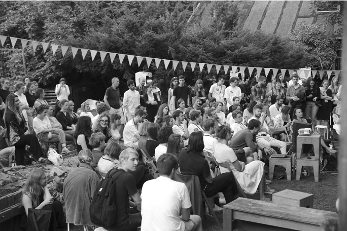
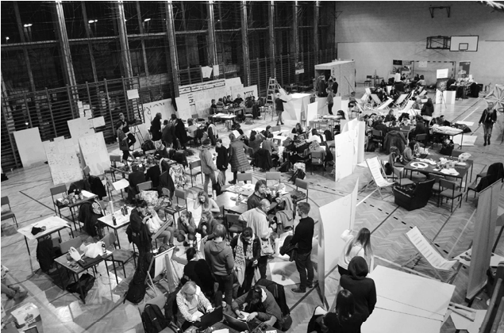
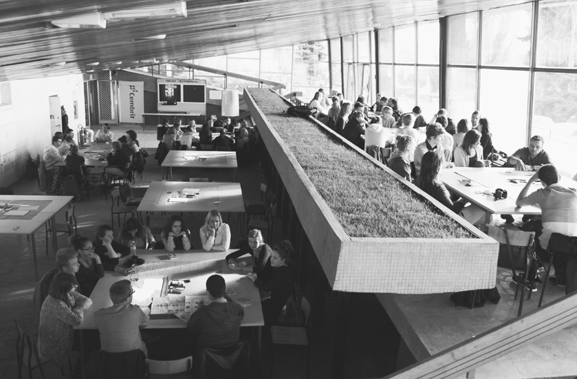
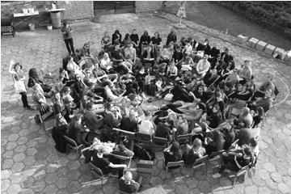
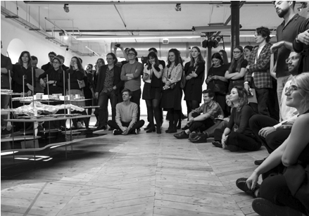

# SPOTKANIA

# ~

z rodziną Domiczów, małżeństwem architektów i ich synem artystą wizualnym rozmawiała: Aleksandra Gryc

Z rodziną Domiczów – Antonim, Małgorzatą i Janem – rozmawiam w ich rodzinnym domu w Opolu. Siedzimy przy wielkim stole w pokoju, który służy za pracownię. Poznaliśmy się na mojej pierwszej OSSIE (Ogólnopolskich Spotkaniach Studentów i Studentek Architektury) w Lublinie w 2012 roku. Już wtedy Domiczowie byli OSSOWĄ legendą.

Antek przywitał mnie ubrany w koszulkę ze swojej pierwszej OSSY, która miała miejsce we Wrocławiu w 2005 roku. Od tamtego czasu warsztaty odbywały się w różnych miastach i w różnym składzie, a ja od roku 2012 z rodziną Domiczów widziałam się na nich niejednokrotnie. Nasza rozmowa jest o tym, co dały nam te wszystkie OSSOWE spotkania i dlaczego są dla nas takie uzależniające.

~Kiedy zaczęła się wasza przygoda z warsztatami architektonicznymi? Antoni Domicz: Moje pierwsze spotkania z nietypowymi formami kształcenia architektonicznego zaczęły się w czasie studiów. Był to rok 1974, może 1975. OSSY wtedy jeszcze nie organizowano, istniał jednak Komitet Koordynacyjny Studentów Architektury. Pojechaliśmy na jego spotkanie do Szczecina. Tematem były „domy studenckie” i większość, a właściwie wszystkie grupy stworzyły konkretne projekty. My natomiast mieliśmy prezentację, i to trochę obrazoburczą, ponieważ uznaliśmy, że najlepszą metodą nauczania architektury i jednocześnie realizacji akademików jest po prostu samodzielne ich budowanie. W ten sposób można najwięcej się nauczyć i zgromadzić doświadczenia. W pierwszych rzędach siedzieli profesorowie i ówczesny dziekan, z tyłu – studenci. Najpierw przenieśliśmy mównicę na środek sali, tak żeby profesorów mieć za plecami, a studentów przed sobą. Prezentacja trwała 10 minut, dyskusja – godzinę. Studenci wyrywali sobie mikrofon. Już wtedy wiedziałem, że architektury nie studiuje się, chodząc na wykłady, zajęcia i ćwiczenia. To nie to. Trzeba mieć wewnętrzną pasję, trzeba rozmawiać, dyskutować.

~A jak to było z OSSĄ?

A.D.: Nasza historia z OSSĄ rozpoczęła się w 2005 roku we Wrocławiu. OSSA to dla nas niezwykła inicjatywa, stworzoARCHITEKTURY NIE STUDIUJE SIĘ, CHODZĄC NA WYKŁADY, ZAJĘCIA I ĆWICZENIA. TO NIE TO. TRZEBA MIEĆ WEWNĘTRZNĄ PASJĘ, TRZEBA ROZMAWIAĆ, DYSKUTOWAĆ na przez studentów dla studentów. Jest miejscem, w którym to właśnie studenci decydują o wszystkim, wybierają temat i tutorów. Nie ma tu władzy zwierzchniej w postaci dziekana czy rektora, SARP-u czy Izby Architektów. Nie jestem pewny, czemu nas wtedy wybrali, ale było to dla nas ogromne wyróżnienie. Przeżyłem to do tego stopnia, że po trzech dniach wysiadłem zdrowotnie i Gosia musiała kontynuować pracę sama. Nie było łatwo, ponieważ trafiliśmy na mocno skonfliktowaną grupę. Wtedy ujawniły się te nieprawdopodobne emocje związane z pracą warsztatową.

~Myślisz, że te emocje, choć może nie zawsze łatwe, to coś, czego brakuje na uczelniach? A.D.: Takie zaangażowanie, wzbudzenie w sobie silnych emocji, na uczelni jest właściwie niemożliwe. Nie ma tam takiego rodzaju pracy. Na warsztatach działa się w grupach. Łączą one studentów z różnych uczelni, miast, czasem nawet krajów, z różnym doświadczeniem, z różnych lat. Każdy jest inny. Do tego dochodzi tutor czy tutorka – osoba najczęściej aktywna zawodowo, wnosząca kolejną perspektywę. Jest to czas niezwykle intensywnej pracy, ale też rozrywki i integracji. Co roku organizatorzy prześcigają się w oferowaniu uczestnikom nowości. Tego, jak wyglądała OSSA we Wrocławiu w 2005 roku, następnie w 2012, a później w 2016, nie można porównać. To jest nieustający i ciągle napędzający się rozwój.

~Dla mnie momentem, który zmienił oblicze OSSY, była bydgOSSA w 2015 roku. Tam po raz pierwszy pojawiła się prawdziwa interdyscyplinarność – przyjechali tutorzy spoza świata architektury. Wtedy też pierwszy raz wzięliście udział jako duet tutorski: ojciec i syn, prawda? To dla mnie kolejny ciekawy aspekt. Na warsztatach spotykałam się ze znajomymi, z tutorami, wykładowcami, ale dla was to także poniekąd spotkania rodzinne! Jan Domicz: Właśnie o tym chciałem powiedzieć (śmiech)! Wtedy pomyślałem, że pierwszy raz od czasu, kiedy jeździliśmy na narty, spędzę trochę czasu z tatą. Mieszkałem poza Polską i rzadko się widywaliśmy. A duet tutorski to był bardzo ciekawy koncept.

A.D.: Bydgoscy tutorzy stanowili niezły zestaw osobowości z różnych dziedzin i światów, nie tylko związanych z zawodem. Byli specjaliści od akustyki, psychologowie, artyści, ale też osoby z niepełnosprawnościami. Ta różnorodność była bardzo cenna. Uważam, że pole do

POLE DO ROZWOJU ARCHITEKTONICZNEGO LEŻY WŁAŚNIE NA STYKU

DZIEDZIN. DOBRZE JEST NAŚWIETLAĆ KAŻDY TEMAT Z RÓŻNYCH STRON

rozwoju architektonicznego leży właśnie na styku dziedzin. Dobrze jest naświetlać każdy temat z różnych stron. Kiedy Jasiu zaczął studiować, otworzył mi oczy

## 83 — kształcenie

Il. 1. OSSA 2019 – Bajka, Warszawa, fot. archiwum OSSY

Il. 2. OSSA 2016 – RÓWNO_REGLE, Zakopane, fot. archiwum OSSY

Il. 3. OSSA 2013 – Wymiar,Wrocław, fot. archiwum OSSY

Il.4. OSSA 2017 – Wielkie Piękno,Wrocław, fot. archiwum OSSY

Il. 5. OSSA 2018 – Widzenie,Łódź, fot. archiwum OSSY

## 8635 —RZUT+

na sztukę. Później bardzo często z tego korzystałem, także kreatywnie i na warsztatach. Pamiętam, że na OSSIE we Wrocławiu w 2016 roku puściłem studentom świetny film – Wszystko już było Grupy Azorro. Artyści zastanawiają się w nim, jak można zrobić coś nowego, na co nikt jeszcze nie wpadł. Na warsztatach studenci też mają często taki imperatyw. Pokazałem im ten film, żeby poczuli, że nie muszą się silić na znalezienie rozwiązania oryginalnego, bo przecież wszystko już było. Po czym i tak to oryginalne rozwiązanie znaleźliśmy.

J.D.: Istotą procesu twórczego jest to, żeby umieć spojrzeć na dany temat inaczej niż zawsze. W przypadku takich spotkań pomysły często biorą źródło z momentów, w których ktoś czegoś nie zrozumie. Dzięki temu można spojrzeć na sprawę w inny sposób i wokół tego zacząć budować.

~Janku, czujesz, że Ty, jako artysta, a nie architekt, możesz być w tym architektonicznym świecie zapalnikiem? J.D.: Tak. Mam poczucie, że mogę mówić rzeczy, które nie będą zrozumiałe. I to jest duża moc.

A.D.: O wielu projektach decyduje też przypadek. Na OSSIE w Warszawie mieliśmy studentkę, która była również pianistką. Grupa przygotowała prezentację o Jazdowie. Zrobiła to jednak za pomocą nie obrazu, tylko dźwięku, który tak dobrze ilustrował wszystko, o czym chcieliśmy opowiedzieć, że prezentację można było zrozumieć bez narracji.

~Dla mnie to też jest wielka wartość. Może to przypadek, ale z drugiej strony dajesz sobie szansę spotkania się z zaangażowanymi, ciekawymi ludźmi, którzy potrafią robić inne rzeczy niż ty. Uważam, że to bardzo inspirujące i wymieniam jako jeden z powodów, dla których OSSA tak mnie wciągnęła. Co sprawiło, że wy wracaliście na nią tyle razy?

A.D.: Każdy udział w OSSIE był dla mnie wyróżnieniem, a do tego każda edycja jest inna. Zawsze chętnie dzielę się swoimi doświadczeniami, ale też sam sporo uczę się od innych. Warsztaty są dla studentów pasjonatów. Tylko tacy tam trafiają. Oczywiście OSSA to też spotkania towarzyskie, trochę rozrywki, dużo emocji. Wcale się nie dziwię, że dla niektórych to wręcz nałóg i muszą być na każdej edycji. Chociażby jako kibice, nie uczestnicy. OSSA przyciąga swoją atmosferą kreowaną przez niespotykane w innych miejscach emocje.

Małgorzata Domicz: Antek zawsze lubił pracować z młodzieżą, ze studentami, ale w Opolu nie było takiej możliwości. Zawsze uważałam, że byłby dobrym wykładowcą, prowadzącym. To jego pasje – architektura i rozmowy z ludźmi.

J.D.: Ja myślę, że pasja to jest sedno. To, w jaki sposób tata mówi o tych projektach, to, że pamięta wszystkie prezentacje, pokazuje rodzaj zaangażowania, który dla studentek i studentów jest jak magnes. Nawet nie zdawałem sobie z tego sprawy do czasu warszawskiej OSSY w 2019 roku. Wtedy na spotkanie w ramach warsztatów przyszedł mój galerzysta. Przez cały wcześniejszy tydzień narzekał: „Po co ty tam idziesz? Architekci? Studenci? Nic ci za to nie zapłacą, to zupełnie bez sensu. Co ty tam będziesz robił? Za dwa miesiące mamy wystawę w Bazylei, musimy tam jechać, produkcja czeka. To jest teraz istotne”. I pewnie miał rację. Ale po spotkaniu podszedł do mnie i powiedział: „Ale oni się tam na was gapią”. Dzięki temu spojrzałem na tę sytuację z zewnątrz. Studenci rzeczywiście nie mogli oderwać oczu od Antka, bo mówił z ogromnym zaangażowaniem. To musiało kontrastować z codziennością znaną im ze szkoły. Nie ukrywajmy – osoby, które wykładają, są na uczelni zdecydowanie dłużej niż studenci, a to generuje dwa zupełnie różne tempa. Inne jest tempo studentów, którzy jak gąbki chcą chłonąć wiedzę, umiejętności, wrażenia, a inne prowadzących, którzy spędzili na uczelni 20 czy 40 lat. Nawiasem mówiąc, jest to dziwactwo, że tak długo można uczyć. W pewnym momencie ta wymiana i te dwa różne tempa rozmowy zupełnie już do siebie nie przystają. W przypadku takich punktowych, kilkudniowych spotkań to jest całkowicie inna historia. Wtedy oba tempa się spotykają. Zarówno tutor, jak i studenci są „zajarani”. Jeśli studenci widzą, że prowadzący jest bardziej wkręcony niż oni, to zaczynają myśleć: „Coś jest nie tak. On jest dużo starszy od nas, a ciągnie i projekt, i imprezy do samego końca, i nie chce dać spokoju”. I to jest rodzaj pasji, od której nie da się odkleić. W tym tkwi moc tego rodzaju spotkań.

M.D.: W czasach, gdy studiowałam, wolałam rozmawiać z zaangażowanymi prowadzącymi. Zresztą, chyba każdy woli, chociaż niektórzy nie mają takiej okazji. U mnie na uczelni był i Gurawski, i Fikus, którzy przez długi czas byli architektami praktykami. Zajęcia z nimi były świetnymi spotkaniami. Rozmowami, a nie nudną szkółką. Oni mieli zupełnie inne spojrzenie, pasję. Był jeszcze jeden profesor, który dojeżdżał z Krakowa – Andrzej Basista. Tak pięknie opowiadał o historii architektury, że zaraził nas miłością do zwiedzania, podróżowania, oglądania i chłonięcia informacji w sposób inny niż na uczelni. Jeśli ktoś ma pasję, to ciągnie za sobą ludzi.

A.D.: To jest wada uczelni architektonicznych w Polsce – nie zatrudniają architektów praktyków. Bardzo mało jest wybitnych dydaktyków, którzy nie zajmują się architekturą czynnie.

J.D.: Pamiętam, jak pojechałem na swoją pierwszą OSSĘ do Lublina latem 2008 roku. Byłem wtedy świeżo upieczonym absolwentem liceum i miałem przed sobą wybór – pójść albo na architekturę we Wrocławiu, albo na intermedia na poznańskiej ASP. Zrobiłem wtedy prostą tabelkę i wpisałem do niej nazwiska prowadzących, których twórczość była mi znana, a którzy wykładali na każdej z tych uczelni. ASP zdecydowanie wygrała. W tamtym okresie ten wydział składał się prawie wyłącznie z praktyków. W trakcie warsztatów rozmawiałem ze studentami z różnych miejsc w Polsce i potwierdziło się to, że na każdym z wydziałów architektury prawdziwych praktyków jest dwóch, w porywach do trzech. I tak zdecydowałem się na ASP.

~Między innymi dlatego warsztaty, takie jak OSSA, są ogromnie ważne. Kontakt z osobami aktywnie działającymi w branży – którego na polskich uczelniach brakuje – jest studentkom i studentom bardzo potrzebny. Również dla tutorów oderwanie się od swoich pracowni i biur może być korzystne. Edukacja architektoniczna nie powinna kończyć się wraz z uzyskaniem tytułem magistra. A.D.: Tak, ale to jest nie tylko nauka architektury. To szersza nauka kreacji. Nikt nie rysuje rzutów, przekrojów, elewacji. Nikt nie mówi o konstrukcji i funkcji. Rozmawia się natomiast o IDEI. Według mnie tworzyć architekturę można tylko wtedy, kiedy zaczyna się właśnie od idei.

~Czy wrócicie jeszcze kiedyś na OSSĘ? J.D.: Towarzysko – tak! Mieliśmy wspólne przemyślenie na ten temat w Warszawie w 2019 roku. Wiedzieliśmy, że nie pojedziemy już na kolejną OSSĘ jako tutorzy. Za długo wykładaliśmy na tym uniwersytecie. Na uczelni we Frankfurcie, gdzie studiowałem, wykładowcy mogli uczyć przez maksymalnie 10 lat, a tata był tutorem właśnie 10 razy. Po tym czasie to tempo, o którym rozmawialiśmy wcześniej, zaczyna się rozjeżdżać. Na takich warsztatach też nie można być za wiele razy. Wszystko musi się zmieniać, bo inaczej nie przetrwa. Brak długowieczności i ciągła zmiana to ogromne zalety •

## 87 — kształcenie

