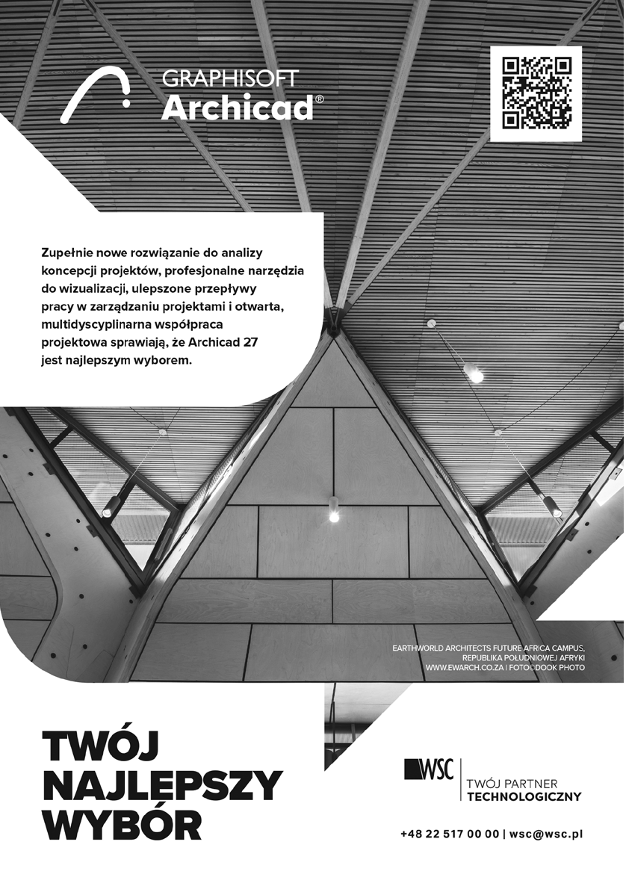
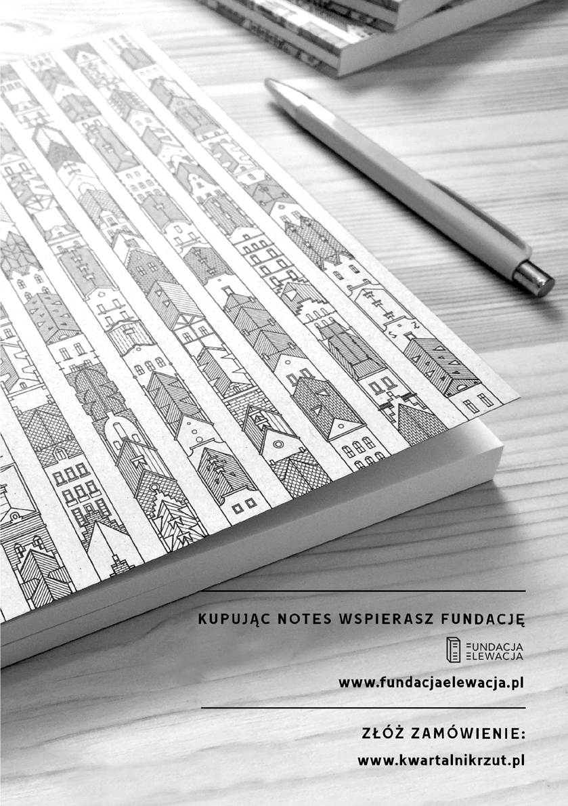
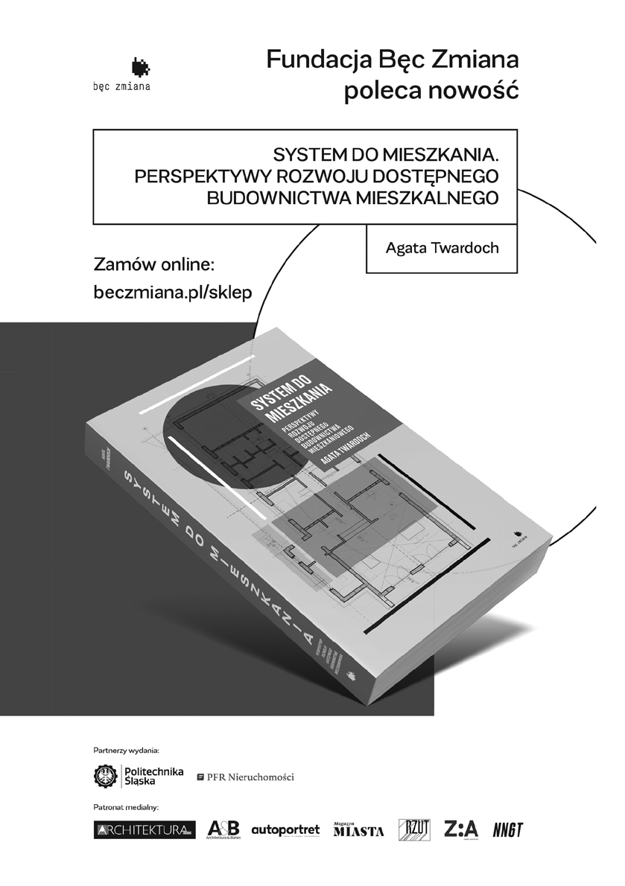
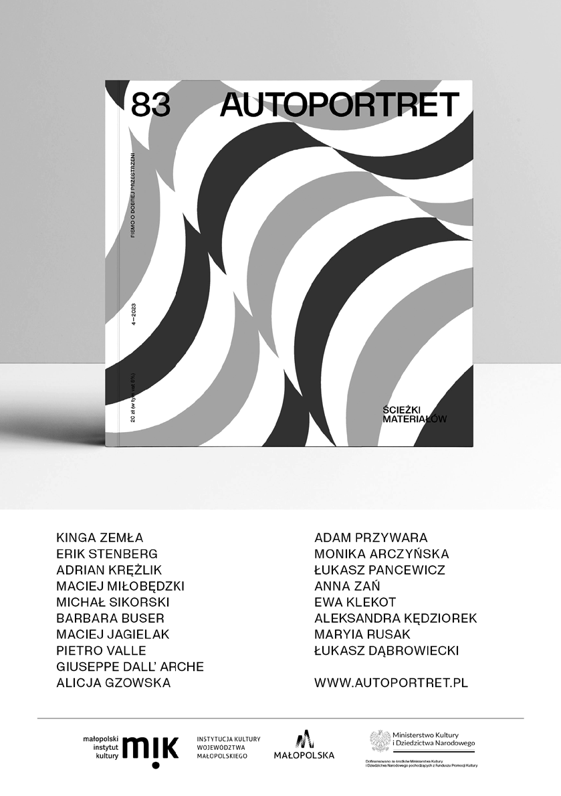
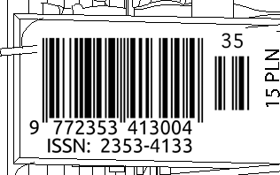

A U T O R Z Y I R O Z M Ó W C Y

Monika Arczyńska•Współzałożycielka A2P2 architecture & planning, firmy konsultingowo-projektowej zajmującej się m.in. masterplanami, doradztwem na etapie przedprojektowym i działaniami partycypacyjnymi w całym kraju. Adiunktka na Politechnice Gdańskiej. Współpracuje z „A&B”, „Architekturą-Murator” i czeskim „INTRO”.

Marcel Bilow• Wykładowca na Wydziale Architektury i Środowiska Zbudowanego Uniwersytetu Technicznego w Delft oraz szef zespołu Bucky Lab. Od ponad 20 lat uczy budownictwa i projektowania produktu w architekturze. W 2014 roku został wykładowcą roku na TU Delft. Oprócz działalności akademickiej prowadził biuro zajmujące się inżynieryjnymi rozwiązaniami fasad. Ekspert w dziedzinie połączeń, materiałów oraz produktu w architekturze. Współautor 15 książek.

CENTRALA (Małgorzata Kuciewicz i Simone De Iacobis)•

Tworzy projekty pod hasłem Amplifikacja natury, oparte na badaniach relacji pomiędzy architekturą, procesami przyrodniczymi i zjawiskami atmosferycznymi. Zespół prezentował swoje projekty na Biennale Architektury w Wenecji (2018, 2023), London Design Biennale (2021), Triennale Architektury w Lizbonie (2022), Gwangju Biennale (2023). Od 2017 roku nieprzerwanie współpracuje z Charkowską Szkołą Architektury; www.centrala.net.pl.

Szymon Ciupiński• Architekt, absolwent Wydziału Architektury Politechniki Wrocławskiej, studiował także na Wydziale Architektury Politecnico di Milano. W swojej pracy projektowej interesuje się architekturą kontekstu oraz szeroko pojętym dziedzictwem modernizmu. Współautor projektu rewitalizacji późnomodernistycznego pawilonu Fandom we Wrocławiu. Na co dzień związany z wrocławską pracownią Arch_it.

Jacek Damięcki•Architekt i wynalazca. Jego koncepcje przestrzenne i synkretyczne projekty wiążą elementy zaczerpnięte z doświadczeń w wielu dyscyplinach – sztuce, geometrii, sporcie. Od lat sześćdziesiątych XX wieku wykonuje projekty architektoniczne, wystawiennicze, makroinstalacje przestrzenne i malarskie. Autor największych instalacji artystycznych w przestrzeni publicznej w Polsce: Warszawy XXX(1974) i Chmury(1994). W 2016 roku Zachęta – Narodowa Galeria Sztuki prezentowała monograficzną wystawę jego dorobku (Jacek Damięcki. Makroformy).

Karolina Dobrzyńska-Szefer• Nauczyciel z 25-letnim stażem i projektant wnętrz. Związana z Zespołem Szkół Zawodowych nr 6 i Zespołem Szkół Budownictwa nr 1 w Poznaniu. W ramach współpracy z Teb Edukacja prowadzi roczne kursy zawodowe z projektowania wnętrz. Od 2009 roku kieruje autorską pracownią IN architektura wnętrz. Projektuje apartamenty i wnętrza użyteczności publicznej. Inspiracje czerpie z duńskiego designu i japońskiego minimalizmu.

Małgorzata, Antoni i Jan Domiczowie•Rodzina twórców z Opola. Od 1990 roku Gosia i Antek prowadzą pracownię architektoniczną, są laureatami Honorowej Nagrody SARP za całokształt twórczości. Jan jest artystą wizualnym, którego prace pokazywane były w m.in. Berlinie, Bazylei, Wenecji i Wiedniu. Kilkukrotnie wspólnie prowadzili grupy na warsztatach dla studentów architektury OSSA.

Sebastian Dziedzic•Architekt, urbanista, nauczyciel akademicki w stanie spoczynku.

Aleksandra Gryc•Architektka, absolwentka Politechniki Krakowskiej. Studiowała w Wiedniu i Berlinie, ukończyła studia podyplomowe z projektowania usług na warszawskim SWPS. Pracowała w tokijskim biurze Sou Fujimoto, berlińskich i polskich pracowniach architektonicznych. Od ośmiu lat pełni funkcję opiekunki warsztatów OSSA. Obecnie mieszka w Warszawie i projektuje wystawy. Głęboko wierzy w kolektywność i w kobiety.

Agata Jasiołek • Architektka i badaczka, absolwentka Wydziału Architektury Politechniki Wrocławskiej, z którym związała się jako doktorantka, a następnie asystentka. Razem z Jerzym Łątką bada możliwości użycia papieru w funkcji proekologicznego materiału budowlanego. W ramach współpracy ze studentami z Koła Naukowego Humanizacja Środowiska Miejskiego (PWr) organizuje warsztaty i wydarzenia edukacyjno-społeczne.

Mariia Kolomiitseva•Architektka i urbanistka. Absolwentka Charkowskiej Szkoły Architektury. Narodowa reprezentantka Ukrainy naEuropean Architecture Student Assembly 2019–2022. Organizatorka wydarzenia SESAM2021 w Sławutyczu. Obecnie działa w pracowni WXCA w Warszawie i jest wolontariuszką w ukraińskiej NGO Ne Sami.

Jerzy Łątka• Architekt i naukowiec związany z Wydziałem Architektury Politechniki Wrocławskiej. W swojej pracy zajmuje się możliwościami wykorzystania papieru jako innowacyjnego materiału budowlanego oraz architekturą pomocową, mieszkaniową i tymczasową. Organizator warsztatów i kursu ProtoLAB(www.protolab.archi). Założyciel platformy projektowo-badawczej architektury papierowej: www.archi-tektura.eu.

89 —autorzy

Gabriela Rembarz, dr inż. arch.•Urbanistka, projektantka, naukowczyni. Absolwentka Wydziału Architektury Politechniki Gdańskiej oraz studiów podyplomowych w Städtebauliches Institut – Fakultät 1 Architektur und Stadtplanung Stuttgart Universität. Członkini Deutsche Akademie für Städtebau und Landesplanung, uczestniczka licznych międzynarodowych stażów naukowych. Autorka i współautorka nowych oraz aktualizowanych programów nauczania.

Kuba Snopek•Urbanista i autor książek o współczesnym mieście. Współautor programu nauczania i pierwszy dyrektor programowy Charkowskiej Szkoły Architektury. Absolwent Instytutu Strelka i Uniwersytetu Kalifornijskiego w Berkeley. Jest twórcą Direction, firmy doradczej w zakresie urbanistyki, gdzie obecnie pracuje. Autor książekBielajewo: Zabytek PrzyszłościiArchitektura VII Dnia.

Marcin Stępień•Absolwent studiów inżynierskich Politechniki Poznańskiej oraz magisterskich na Politechnice Warszawskiej. Wielokrotny uczestnik warsztatówMood for Wood. Od czterech lat aktywnie pracuje w zawodzie architekta – jest związany z biurami, takimi jak UGO, JEJU, Atelier Starzak Strebicki oraz Archigrest. Najbardziej interesuje go relacja zachodząca między architekturą a podmiotami, które są uczestnikami przestrzeni.

Agata Twardoch• Urbanistka, profesorka w Katedrze Urbanistyki i Planowania Przestrzennego Wydziału Architektury Politechniki Śląskiej. Członkini TUP, Affordable Housing Forum i Rady Fundacji Rynku Najmu. Współprowadzi pracownię projektową 44STO. Autorka książek System do mieszkania. Perspektywy rozwoju dostępnego budownictwa mieszkaniowegooraz Architektki. Czy kobiety zaprojektują lepsze miasta.

Magda Wypusz •Pracowniczka poznańskiego oddziału SARP, inicjatorka i koordynatorka warsztatów architektonicznych takich jak Mood for Wood, Kotydż (warsztaty łączące projektowanie i budowanie), czy festiwali m.in. Domokrążcy, prezeska Stowarzyszenia Punkt Wspólny.

Dokonaliśmy wszelkich starań, aby skontaktować się z właścicielami praw autorskich publikowanych materiałów. W przypadku zastrzeżeń ze strony któregokolwiek z właścicieli praw prosimy o kontakt z redakcją.

© 2023, Fundacja Elewacja, Warszawa

Nakład: 1000 egzemplarzy

Wydawca:

Sponsor:

Dofinansowano ze środków Ministra Kultury i Dziedzictwa Narodowego

Druk: Drukarnia EFEKT Piotrowski sp.j., ul. Podkowy 99c, 04-937 Warszawa

| | | |
|---|---|---|
| | | |
| | | |

| | | |
|---|---|---|
| | | |
| | | |

