# Low-Rise, High-Density Housing

Tamás Perényi

Katalin Konczné Theisler Márton Nagy

Zoltán André Adrienn Borbély Kitti Halász Regina Nemecz Alida Szakolczai

Andor Wesselényi-Garay Anikó Annamária Németh

Péter Brenyó Albert Máté

#### Low-Rise, High-Density Housing

by Tamás Perényi by Katalin Konczné Theisler and Márton Nagy by Zoltán André, Adrienn Borbély, Kitti Halász, Regina Nemecz, and Alida Szakolczai by Andor Wesselényi-Garay and Anikó Annamária Németh by Péter Brenyó and Albert Máté

Publication date 2013 Copyright © 2013 Budapest University of Technology and Economics, Department of Residential Buildings, The curriculum development of the BME Department of Residential Building Design was implemented under

the preject TÁMOP-4.1.2.A/1-11/1-2011-0055., , ,

##### Abstract

The collection discusses the examples of low-rise, high-density housing from historical estates to contemporary installations, in international and Hungarian context, concluding with experimental models of sustainable housing solutions.

Copyright 2013

### Table of Contents

- 1. Introduction .............................................................................................................. 1 Contemporariness – Presence ................................................................................... 1 Garden ................................................................................................................. 1 Densification and Tracery ....................................................................................... 2 The Structuring of the Present Selection .................................................................... 2
- 2. The Historic Forms of Low-Rise, High-Density Developments ........................................... 3 The Significance of Historic Projects ........................................................................ 3 The Logic of Historic Examples ............................................................................... 3 Presence in the Past ............................................................................................... 3 The Garden in the Past ........................................................................................... 4 Why is Typology Important? ................................................................................... 4

Fill .............................................................................................................. 4 Growth ........................................................................................................ 4 Pattern ......................................................................................................... 4 Lane ............................................................................................................ 5 Cohesion ...................................................................................................... 5

- 3. Historic Projects ........................................................................................................ 6 Fill - Cohesion ...................................................................................................... 6

- 1. Pueblo Bonito, USA ................................................................................... 6
- 2. Mourabtine Ksar, Tunisia ............................................................................ 9
- 3. Bath Royal Circus, United Kingdom, 1754-1768 ............................................ 12
- 4. Kraals, Ghana and Zambia, Africa ............................................................... 16

Fill - Pattern ....................................................................................................... 20

- 5. Barumini Su Nuraxi, Sardinia, Italy ............................................................. 20
- 6. Great Zimbabwe, Zimbabwe, Africa ............................................................ 24
- 7. Olynthos, Greece ...................................................................................... 29
- 8. Kasbah, the Kasbah of Algiers, Algeria ........................................................ 34

Fill – Lane .......................................................................................................... 38

- 9. Bispukin, Poland ...................................................................................... 38
- 10. Kahun, Illahun, Egypt ............................................................................. 42
- 11. Fugger Estate, Germany ........................................................................... 47
- 12. Camaldulian Hermitage, Majk, Hungary ..................................................... 52

Growth - Cohesion ............................................................................................... 56

- 13. Lake Dwellings, Bodensee (Lake Constance), Germany ................................. 56
- 14. Chuandixia, China .................................................................................. 60
- 15. Machu Picchu, Peru, South-America .......................................................... 64
- 16. Trulli, Alberobello, Italy .......................................................................... 69

Growth - Pattern .................................................................................................. 75

- 17. Çatal Hüyük, Turkey ............................................................................... 75
- 18. Ghadames, Libya .................................................................................... 78
- 19. Dogon Village, Africa ............................................................................. 82
- 20. Lindos, Greece ....................................................................................... 86

Growth - Lane ..................................................................................................... 91

- 21. Acoma Pueblo, United States of America .................................................... 91
- 22. Nyboder Quarter, Copenhagen, Denmark .................................................... 96
- 23. Henan, Underground Dwellings, China ..................................................... 100
- 24. Berberian Village, Takrouna, Tunisia ........................................................ 105

- 4. Low-Rise, High-Density Developments in the 20th Century ........................................... 109 Contemporarineses and Presence in the 20th Century ................................................ 109 The 20th-century Garden ..................................................................................... 110 The Structuring of the Collection of 20th-century Examples ....................................... 110
- 5. International Projects from the First Half of the 20th Century ......................................... 111

....................................................................................................................... 111

- 1. Barry Parker - Raymond Unwin, Letchworth Garden City, United Kingdom, 1903 ......................................................................................................... 111

iv

- 2. Raymond Unwin, Hampstead Garden City, London, United Kingdom,1905 ........ 115
- 3. Michael de Klerk, Third Block of Spaarndammerplantsoen, “The Ship”, Amsterdam, Netherlands, 1917 ..................................................................... 119
- 4. Jacobus Johannes Pieter Oud, Mathenesse Siedlung, Rotterdam, Netherlands, 1922 ......................................................................................................... 124
- 5. Rudolph M. Schindler, Pueblo Ribera Court, San Diego, California, 1923 .......... 127
- 6. Bruno Taut, Onkel-Toms-Hütte, Zehlendorf, Berlin, Germany, 1925-27 ............. 132
- 7. Walter Gropius, Törten Siedlung, Dessau, Germany, 1926-27 .......................... 138
- 8. Ernst May, Praunheim Housing Estate, Frankfurt am Main, Germany, 1926-30 .................................................................................................... 141
- 9. Jacobus Johannes Pieter Oud, Weissenhofsiedlung, Stuttgart, Germany, 1927 ..... 145
- 10. Jacobus Johannes Pieter Oud, Kiefhoek, Rotterdam, Netherlands, 1928-30 ....... 149
- 11. Adolf Loos, A. Lurcat - J. Hoffmann - R. Bauer - O, Strnad - J. Groag - G. Guevrakian - G. Rietweld - Holzmeister - Wachberger - Walter Loos - BieberNiedermoster - L. Pilewski - W. Sobotka - Miklós Velits, Werkbundsiedlung, Vienna, Austria, 1931-32 ............................................................................. 155
- 12. Frank Lloyd Wright, Quadruple Housing Type, Suntop Homes, Pennsylvania 1938-42 .................................................................................................... 161
- 13. Alvar Aalto, Terrace Houses, Kauttua, Helsinki, Finland, 1939 ...................... 164
- 14. Haefeli - Hubacher-Steiger - Moser-Roth - Artaria-Schmidt, Werkbundsiedlung, Zürich, Switzerland, 1939 ................................................. 166

- 6. Hungarian Projects from the First Half of the 20th Century ............................................ 172

....................................................................................................................... 172

- 1. Royal Hungarian Rails, Main Workshop, MÁV Estate, Budapest, 1895 ............. 172
- 2. Károly Kós - Béla Heintz - Lajos Schodits - Béla Eberling - Dezső Zrumeczky Gyula Wälder - Dénes Györgyi, Wekerle Housing Estate, Budapest, 1909-1925 ...... 176
- 3. Ede Novák - Béla Barát, OTI Estate for Workers and Officials, Albertfalva, Budapest, 1929-33 ...................................................................................... 184
- 4. Viktor Böhm, Row Houses of Substandard Apartments, Miskolc-Tapolca, 1933 ......................................................................................................... 189
- 5. Oszkár Füredi, Mine Retirement House, Sopron, 1933 ................................... 190
- 6. Lehoczky György, Manor in Káposztásmegyer, Workers’ Housing, Káposztásmegyer, 1939 ............................................................................... 192

- 7. International Projects from the Latter Half of the 20th century ........................................ 195

....................................................................................................................... 195

- 1. Arne Jacobsen, Soholm, Klampenborg, Denmark, 1950–55 ............................ 195
- 2. Ludwig Mies van der Rohe, Lafayette Park, Detroit, USA, 1955 ...................... 201
- 3. Aldo van Eyck, Burgenweeshuis Orphanage, Amsterdam, Netherlands, 1955-59 .................................................................................................... 205
- 4. Jørn Utzon, Kingo Atrium Houses, Helsingør, Denmark, 1958-60 .................... 210
- 5. Toivo Korhonen, Jaakko Laapotti, Atrium Houses, Espoo, Finland, 1958 ........... 217
- 6. Eric Lyons, Corner Green, London, United Kingdom, 1959 ............................ 220
- 7. Arne Jacobsen, Bellevue Bay, Klampenborg, Denmark, 1960-61 ...................... 224
- 8. Atelier 5, Halen Estate, Bern, Switzerland, 1961 .......................................... 227
- 9. Jakob Berend Bakema, Eindhoven’t Hool Housing Estate, Eindhoven, Netherlands, 1961 ....................................................................................... 232
- 10. Guy Lagneau - Michel Weil - Jean Dimitrijevic, Cansado, New Town, Mauritania, 1961 ........................................................................................ 234
- 11. Jean-François Zevaco, Row Houses with Patios, Agadir, Morocco, 1962-64 ...... 239
- 12. Inger Exner, Johannes Exner, Hillerød, Denmark, 1962-65 ............................ 243
- 13. Roland Rainer, Mauerberg, Vienna, Austria, 1963-64 ................................... 247
- 14. Pentti Ahola, Haka Houses, Tapiola, Helsinki, Finland, 1963-65 .................... 251
- 15. Herman Hertzberger, Diagoon Experimental Apartments, Delft, Netherlands, 1967-70 .................................................................................................... 255
- 16. Jan Verhoeven, Atrium and Row House Complex, Kyftenbeltlaan, Hoevelaken, Holland, 1968 .......................................................................... 260
- 17. Jørn Utzon, Espansiva Modular Apartment, Hallebeak, Denmark, 1969 ........... 263
- 18. Piet Blom, Kasbah Complex, Hengelo, Netherlands, 1969-73 ........................ 269

v

- 19. Candilis - Josic - Woods, Le Mirail Estate, Toulouse, France, 1971–73 ............ 273
- 20. Palle Suensons, Gassehaven Estate, Holte, Denmark, 1973 ............................ 276
- 21. Kiyonori Kikutake, Terrace Houses, Pasadena, Japan, 1973-73 ...................... 280
- 22. Toivo Korhonen, El Naranjal Experimental Housing Estate, Lima, Peru, 1976 ......................................................................................................... 283
- 23. Alvaro Siza, Quinta de Malagueira, Social Housing, Evora, Portugal, 1977-95 .................................................................................................... 285
- 24. Piet Blom, Cube Houses, Rotterdam, Netherlands, 1984 ............................... 290

- 8. Hungarian Projects from the Latter Half of the 20th Century .......................................... 296

....................................................................................................................... 296

- 1. József Szekeres, Farkaslyuk Miners’ Apartments, Ózd, 1957–59 ...................... 296
- 2. János Szigetvári, Semi-detached Group Houses, Komló, 1960 ......................... 299
- 3. Géza Pénzes, Row Houses, Csabagyöngye Street, Szentendre, 1962-64 ............. 304
- 4. Zoltán Veres, Row Houses, Eger, 1968 ....................................................... 306
- 5. Dr. Péter Gáborjáni, Terraced Houses with Studios, Kálvária Road, Szentendre, 1967-69 .................................................................................................... 310
- 6. Béla Borvendég - Ferenc Szabó, Artists’ Apartments with Studios, Hódmezővásárhely, 1970 ............................................................................. 313
- 7. Tamás Maros - Judit Hámory, Two-storey Terraced Houses, Perbál, 1975 .......... 316
- 8. Antal Csíkvári - Miklós Novák, Chain Houses, Kápolnásnyék, 1976-77 ............ 321
- 9. Antal Plesz - József Bihari, Terraced Houses with Studios, Miskolc, 1977 .......... 324
- 10. Ildikó Sz. Buzás, Jankovits Estate, Atrium Houses, Veszprém, 1977 ................ 326
- 11. Csaba Bodonyi, Collective House, Miskolc, 1978 ....................................... 328
- 12. Árpád Weiler, Terraced Apartment Buildings, Pécs, 1979 .............................. 334
- 13. Károly Jurcsik, Prefab Apartment Buildings, Szabadhegy, Győr, 1983 ............. 335
- 14. Tamás Dévényi - Péter Hegedűs, Housing Estate for Disabled People, Budapest, 1987 .......................................................................................... 339

- 9. Contemporary Low-Rise, High-Density Developments – International Examples ................ 343

....................................................................................................................... 343

- 1. Peter Zumthor, Spittelhof Estate, Biel-Benken, Basel, Switzerland, 1989-96 ....... 343
- 2. Eduardo Souto de Moura, Atrium Houses, Mathosinos, Porto, Portugal, 1993 ..... 348
- 3. West 8, Borneo Island, Amsterdam, Netherlands, 1993-96 .............................. 353
- 4. MVRVD, Hageneiland, Ypenburg, Netherlands, 1998-2001 ............................ 356
- 5. Peter Barber, Donnybrook Quarter, London, United Kingdom, 2000 ................. 360
- 6. Maurice Nio, Rotterdam, Netherlands, 2001 ................................................ 365
- 7. NIO Architects, Groenoord - Zuid, Schiedam, Netherlands, 2001 ..................... 368
- 8. MVRVD, Patio Island, Ypenburg, Netherlands, 2001 ..................................... 371
- 9. NKS Architects, Kanoya, Fukuoka, Japan, 2002 ........................................... 376
- 10. Eustaquio Martinez Garcia - Virgilio Gutierrez Herreros, La Mareta, Tenerife, 2002 ......................................................................................................... 380
- 11. Joke Vos Arcitecten, Periscope Houses, Rotterdam, Netherlands, 2002 ............ 385
- 12. Aires Mateus, Bom Successo Group, Obidos, Portugal, 2003 ......................... 390
- 13. Cano y Escario Arquitectura, Row Houses, Madrid, Spain, 2003 .................... 394
- 14. Rafael Otero Gonzalez, Row Houses, Cadiz, Spain, 2004 ............................. 398
- 15. Javier Garcia-Solera, Retirement Home, San Vicente Del Raspeig, Spain, 2005 ......................................................................................................... 402
- 16. Valero and Jimenez Torrecillas, Social Housing, Alameda, Spain, 2005 ........... 406
- 17. Schwalm-Theiss & Gressenbauer, Kabelerk, Vienna, Austria, 2005-2006 ......... 412
- 18. Christian de Portzamparc, Almere, Netherlands, 2006 .................................. 417
- 19. Peter Barber, Colony Mews, London / Islington, United Kingdom, 2006 .......... 421

- 10. Contemporary Low-Rise High-Density Developments – Hungarian Projects ..................... 428

....................................................................................................................... 428

- 1. János Mónus, Zsuzsanna Szőke, Sándor Nagy: Atrium Houses at Víznyelő Street, Budapest, 1992 ................................................................................ 428
- 2. Ferenc Cságoly, Ferenc Keller: Terraced Houses, Barlang Street, Budapest, 2001 ......................................................................................................... 434
- 3. Margit Pelényi: Apartment House, Pécs, 2003 ............................................. 439
- 4. Tamás Tomay, Csévi Street, Budapest, 2008 ............................................... 444

vi

- vii
- 5. Tamás Perényi, Gyula Fülöp: Venezia Villa Residence, Velence, 2008 .............. 448

- 11. Sustainable and Energy-Efficient Low-Rise High-Density Developments ......................... 454

....................................................................................................................... 454

- 1. Tegnestuen Vandkunsten, Viken, Denmark, 2001 ......................................... 454
- 2. Marlies Rohmer: Waterwoningen – Floating Houses, Ijburg, Netherlands, 2001 ......................................................................................................... 462
- 3. Cannatà & Fernandes: Intelligent House, Matosinhos, Portugal, 2003 ............... 465
- 4. Elemental, Alejandro Aravena, Quinta Monroy Estate, Iquique, Chile .............. 469
- 5. Álvaro Siza: SAAL Bouça Social Housing, Porto, Portugal, 2004 ................... 474
- 6. Cubo Arkitekter: Hvide Sande, Denmark, 2004–2006 .................................... 478
- 7. Anne Lacaton & Jean Philippe Vassal, Social Housing, Mulhouse, France, 2005 ......................................................................................................... 481
- 8. Koji Tsutsui, Orphanage, Raki, Uganda, 2007 .............................................. 485
- 9. Anna Heringer, Home-made Houses, Rudrapur, Bangladesh, 2007–2008 ........... 488
- 10. Riches Hawley, "Clay Field", Elmswell, Suffolk, United Kingdom, 2008 ......... 495

- 12. Bibliography ........................................................................................................ 500

# Chapter 1. Introduction

Creating a collection like this practically means initiating a dialogue with relics of bygone times, either of distant or recent past. We treasure their memories – and here we mean those of man-made environments above all – in our minds when travelling, walking the streets everyday, watching TV, or even as a random, disorderly mass of visual effects when surfing the Internet. The dialogue is thus the process of making ourselves aware of these experiences, as well as cataloguing them. A selection of this kind is especially important for both architects and students of architecture. This is the role which the present collection is meant to play in this special topic.

Our using the word awareness is both purposeful and important within this textual context and is by no means to be understood or mistaken as a scientific approach. Undoubtedly, intuition, as opposed to analytical methods, has been a significant agent when creating this database. If we piled up the collected experiences (period, material, site and location) on simple and impassionate shelves, we could easily avoid skipping the most relevant questions and answers applicable in architectural design, which could contain the most relevant responses.

Our collection is meant to present and systematize low-rise, high-density residential developments. Thus, we analyse forms of housing in which constituents – typically dwelling units and their complementary functions – are orchestrated into a certain system to create a harmonious unity, an integral composition also interpretable in itself. What is actually meant by low-rise, high-density development? There are numerous interpretations, primarily defining the concept in terms of the quantity of co-ordinated components contained. Some approaches prioritize housing density, while others rate certain forms of housing according to the method of development and thus relate them in the relevant categories. Kálmán Timon uses the expression “modern developments with gardens” in his book. Contemporary and with a garden. To define the network of classification we have used just now, it seems necessary to clarify these two concepts.

## Contemporariness – Presence

We may approach the concept of contemporariness by interpreting its counterpart or opposite, which is out-of-date, not in tune with the Zeitgeist, discordant with the requirements of the period, anachronistic. Accordingly, contemporary (modern) is in line with Zeitgeist and meets the prevailing requirements of its time. It is important to note here that, in the context of this selection, contemporariness is by no means the equivalent of novelty (modernness), since it is not driven by the ambition “to differ by all means” or by the aspiration to innovate, but by presence, the responses ripened in several stages so as to meet the challenges of “here and now”. In the reality of the present, it is the ambition to create attachment and bonding – both in time and space – which is the most important motivation: the way a building meets the challenges of current conditions of time and space (experienced as a continuum) and gives architectural responses to them driven by practicality and sensitivity to problems. A need for presence is, of course, a constant factor throughout the history of architecture. However, as we shall see apropos of certain projects referred to here, it is a most changeable value rooted in time and space. Thus, we rely upon it as one of the cornerstones of our classification.

## Garden

The garden has been and is present in architecture in numerous formats and ways. Its significance is far from being a novelty to deal with. The presence of fences is a basic manifestation of each garden variety. In this respect, the garden essentially differs from landscape, which lacks defined boundaries. The very act of raising a fence (enclosing) transforms the garden into an architectural category (enclosure) which is part of every project we have included here as a spiritual and physical basic need. However, its role and niche within the composition, its rank in the hierarchy, significantly varies depending on the tracery and density of the development.

Introduction

## Densification and Tracery

We have not yet touched upon the concept of density, which is a key aspect of classification. The developments presented here primarily feature what we regard as independent of location, of cultural and social environment: it is the tracery often fed by extreme densification, the wide variety and versatility of structures, the hierarchy of the composition of the development as such. When interpreting densification as an abstract concept related to architecture, we may think of several associations. One could think of a system growing in an additive way which actually consumes the “empty” space (void) surrounding it, while expanding and thus saturating and condensing it. We may as well associate it with the process whereby built spaces enclose space from the endless domain of nature for our purposes when buildings grow and expand. It can also be interpreted as a two dimensional flat composition made up of layered and co-ordinated lines and patches that an architect immediately grasps with his spatial thinking as a system, the disposition of spaces and volumes, a three-dimensional structure. In this selection, we make distinctions between archetypes according to tracery, the means of densification that convey and maintain architectural continuity by virtue of their permanent character.

## The Structuring of the Present Selection

We have not yet touched upon the concept of density, which is a key aspect of classification. The developments presented here primarily feature what we regard as independent of location, of cultural and social environment: it is the tracery often fed by extreme densification, the wide variety and versatility of structures, the hierarchy of the composition of the development as such. When interpreting densification as an abstract concept related to architecture, we may think of several associations. One could think of a system growing in an additive way which actually consumes the “empty” space (void) surrounding it, while expanding and thus saturating and condensing it. We may as well associate it with the process whereby built spaces enclose space from the endless domain of nature for our purposes when buildings grow and expand. It can also be interpreted as a two dimensional flat composition made up of layered and co-ordinated lines and patches that an architect immediately grasps with his spatial thinking as a system, the disposition of spaces and volumes, a three-dimensional structure. In this selection, we make distinctions between archetypes according to tracery, the means of densification that convey and maintain architectural continuity by virtue of their permanent character.

# Chapter 2. The Historic Forms of Low-Rise, High-Density Developments

## The Significance of Historic Projects

As Tamás Tomay argues, “each building is a continuation”. This, in turn, means that the history of architecture is an evolution of follow-up projects and densifications, not only in the physical, but also in the conceptual sense. This statement deserves special attention apropos of our selection, since it focuses on the importance of continuity and the significance of hidden correlations. It is our aim to present characteristic permanent forms of behaviour, unique variations of the (arche)types evolving throughout centuries and continuously shaped by the need to respond to challenges of contemporariness and presence. Each constituent forms part of a process with antecedents, and most probably they do not represent the end of a journey. Appropriate and moderate changes are only viable in the knowledge of the foregoing; thus, we approach historic examples as the repositories of these antecedents. The continuity of architecture is not unlike a unique ontogenesis, a kind of evolution which features both construction as an activity and the thought creating buildings. Hence, the significance of historic prototypes for us lies in the relation between permanence and uniqueness: a logic we hereby clarify.

## The Logic of Historic Examples

The historic projects we included here reflect approaches from the aspect of composition. They accentuate basic features of composition along geometric correlations that influence it. As functional purity was typically a later development in the wide temporal spectrum of the evolution of historic examples, and only appeared with modernisation, we did not exclusively focus on residential function. The developments cited here include towns existing and evolving even today, closed and yet functionally complex residential systems, hermitages, settlements already destroyed and even ensembles from all over the world. Their geographical and regional diversity was intentional. We tried our best to include examples that characterise each type, both from Europe and beyond, buildings and developments without architects (indigenous or or vernacular architecture), as well as works of architectural art to prove the general-universal spatial and temporal relevance of these behavioural forms and principles of composition.

## Presence in the Past

Examples in the historic selection are typically developments that lack architects. In the case of vernacular architecture, the community intending to build, the designer and the builder tend to be the same as a rule, and their relationship is basically different than that typical of the 20th century. Their close connections are the guarantee of an in-depth knowledge of needs and the adequacy of responses. As a result, practical considerations and architectural responses to functional challenges are reflected in these building complexes in a much more self-evident, legible way. Enclosure-type developments in Africa, the kraals and ksars, were fostered by formations of rites performed around a fire and thus have evolved into estates and villages that offer shelter and exist even today. Although the traceries of developments, the system of lines and patches were created by the users’ trivial considerations, without any kind of superior principle of composition, they reflect the same kind of co-ordination and orderliness as an architectural work. Later examples from the classical period of architectural art are also excitingly educational, since they exemplify an approach prioritizing the clarity of organisation and structuring above all. The hermitage in Majk, the impassionate sequences of residential buildings in the harbour of Copenhagen, as well as England’s much-favoured circuses that radiate perfection are all results of the same gesture: seeking the way out of the organically grown multitude of buildings of medieval towns and cities that sunk into fanciful and vague non-transparency.

## The Garden in the Past

Venues for life and work used to be less separate throughout the centuries than they are today. Activities associated with the ground, garden and courtyard filled the days of the majority of people, and thus gardens were integral parts of their residential environment. Now the question is more about the method of use, the place and size of the garden. In certain regions, the protective function of being fenced in (or enclosed) used to be more important centuries ago than it is today, and residential buildings with their stone-walled gardens combined to make up minor fortifications in the course of time. For some communities, the garden had a different role and thus evolved as the venue for recreation, socializing and a sense of belonging. Attachment to nature or to semi-nature (a smaller personalised part of it) used to be more versatile and much more powerful than today.

## Why is Typology Important?

Typologies convey the genome of continuity by arbitrarily enlarging individual layers, stripping the primary meaning of the spectacle from the genuine contents. The system of viewpoints applied tends to be subjective one, and it only draws attention to the permanence of certain principles of composition. In line with our observations, distinguishing features may be described within a matrix. One of the constituents of this matrix is the response of the development to its environment, which can be either the “fill” model or the “growing” kind. The other component is the internal system or organisation of the development, which may be a pattern, lane or cohesion.

### Fill

This is a finite and complete system confined within a frame. The geometry defining it may be a faculty or endowment, but the development itself may also create for itself the form closing in on itself. The attitude to the frame is varied and versatile. The development by the Fuggers in Augsburg continues and tidies incomplete gestures in the man-made environment. Bispukin’s fortified marshy island is fed by topological features. Sardinia, another island, features nuraghi, offering shelter by creating walllike enclosures.

### Growth

The most significant distinguishing feature of this type is open-endedness. The adjective “growing” does not necessarily mean any change to the structure. More typically, it refers to the endlessly reproducible inner logic of the co-ordination of its constituents. There are no exact boundaries and confines here that could be relied upon as topographical features of the site, and environmental factors do not force the development to turn away or shut itself up. A fine example of additive, growing structures is Çatal Hüyük, where the dimensions of the settlement were only limited by the number of inhabitants.

### Pattern

The most significant, vital feature of pattern is that it is a complex multi-layer system. Besides tracery, its intense spatiality also defines its character. As opposed to the linear nature of the “interstice” or “direction” type, its infilling nature is more accentuated. Its role is to fill in larger surfaces by smaller components featuring similar function and scale according to the logic of a certain system. It creates the development by approaching it from the aspect of built components – either additively, following the logic of African kasbahs, or negatively, by seizure or cutting-out, like in the case of the town of Olynthos. The composition often evolves by building in many layers, by dividing the program into several essential components and grouping them in minor units like fractals, much like Dogon villages do.

### Lane

Here the inner, interim or intermediate space is essential. More important than the relationship with the place, it is a special, often arbitrary system, which sometimes creates a new quality, distinguishing and secluding itself from its environment. More often than not, the new hierarchical situations created by these “transitory” spaces prove to be the most liveable places. Numerous factors may influence the geometry, direction and internal system of tracery that these spaces feature – such as orientation, local climatic features, the preservation of the intimacy of neighbouring buildings, as well as views. The “directional houses” convey powerful militant architectural character, which is the vital condition of their lives and functioning. A multitude of houses built in areas with emphatic directions have the tendency to behave in strikingly similar ways.

### Cohesion

This is the type most in tune with the locational factors or the man-made situation. It is a synonym for adjustment. Adhesion is the means of being nourished from the valuable endowments presupposing a solid and powerful “enclosure-like” frame as a starting point. Owing to the versatility of this frame, it is applicable in several situations. By seizing upon existing, traceable, characteristic features, these developments may climb steep hillsides by adhering to the contour lines and terraces along them, to the counterforts or winding piers of a waterfront, to the paths and ways, as well as to the loose ends of fragmentary or frayed urban fabrics.

Organising the components of this matrix in a grid, we could classify six groups for the examples included in our selection.

Fill – Pattern, Fill – Lane, Fill – Cohesion, Growth – Pattern, Growth – Lane, Growth – Cohesion

# Chapter 3. Historic Projects

## Fill - Cohesion

### 1. Pueblo Bonito, USA

Pueblo Bonito is the largest settlement in Chaco Canyon. Surrounded by a semi-circular wall, this residential block stands in an area between a vertical rock face and a river that is now dried out. The form defining this development is a directional one. It grows towards the former riverbed in a straight line, but with a curve in the direction of the rock face. Dwelling units adhere to the inner side of the solid defensive wall accessible from the roofs, as if descendants of Indian earth houses. The thick, traversable body of the almost 700 rooms connected to each other grows from the wall, which functions as a frame. The thick, terraced semicircle of dwellings overlooks a central plaza. The traversable roofs, terraces, and the plaza next to the two central kivas (ceremonial buildings) cannot be interpreted as a garden. They are rather areas of access and ceremonial use. The composition is an exciting integration of characteristic ceremonial structures of the Navajo Indians and traditional forms of Indian housing. Its masterly stonewall masonry and timbered ceiling evoking a corbelled dome are evidence of superb, thorough building expertise. Smaller kivas, almost 40 in total, are relics of a thriving spiritual-intellectual life.

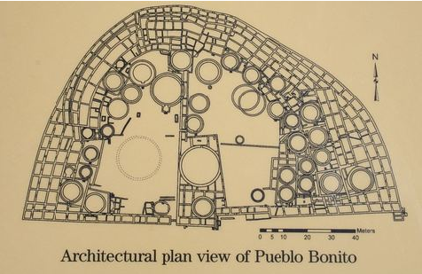

- source: James Q. Jacobs - http://www.jqjacobs.net/southwest/pueblo_bonito.html, 2012.06.21. 16:24

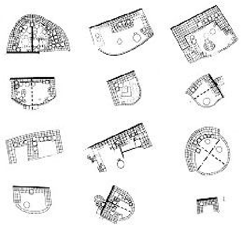

source: /-/ - http://tectonicablog.com/?p=22061, 2012.06.21. 16:22

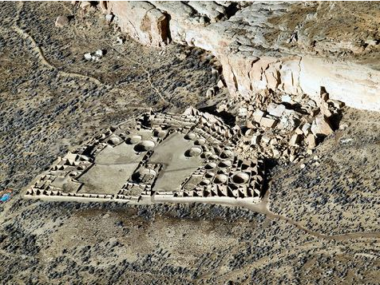

source: Merikanto - http://en.wikipedia.org/wiki/Pueblo_Bonito, 2012.06.21. 14:45

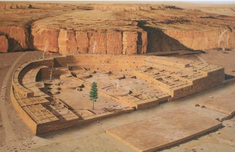

- source: James Q. Jacobs - http://www.jqjacobs.net/southwest/pueblo_bonito.html, 2012.06.21. 16:25

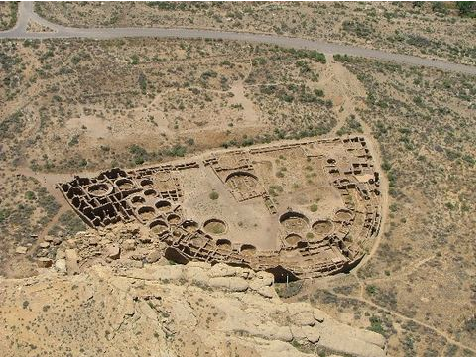

source: Brad Shattuck - http://www.nps.gov/chcu/planyourvisit/pueblo-bonito.htm, 2012.06.21. 16:13

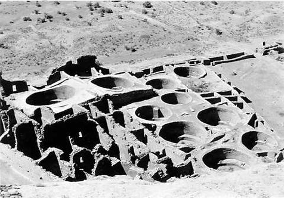

source: Tillman - http://en.wikipedia.org/wiki/Pueblo_Bonito, 2012.06.21. 14:52

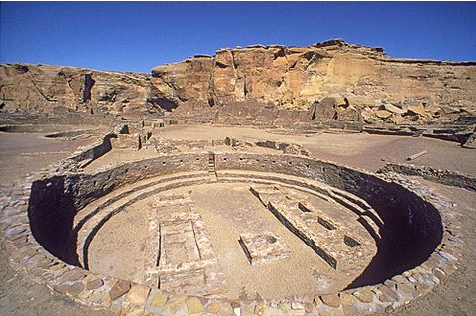

source: /-/ - http://sacredsites.com/americas/united_states/chaco_canyon.html, 2012.06.21. 16:24

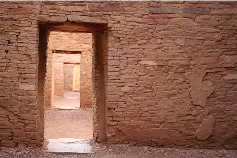

- source: James Q. Jacobs - http://www.jqjacobs.net/southwest/pueblo_bonito.html, 2012.06.21. 16:26

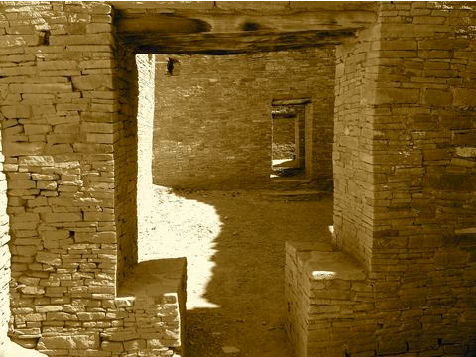

source: Doc Gibson - http://www.flickr.com/photos/30041070@N00/3698613763/, 2012.06.21. 16:50

### 2. Mourabtine Ksar, Tunisia

Like a small fortress built to defend a village, the ksar used to be a typical building of semi-nomadic Berber tribes in North Africa. Odd-looking edifices next to the ksars are ghorfas, usually built on hilltops, which were actually fortified granaries. These buildings are relics of an ancient, wellfunctioning, adequate lifestyle in an area where the protection of yearly, difficult-to-produce crops was the priority concern. Having a shared wall, these granaries of two, three or four storeys were suited to store large quantitiies of crops on a small floor area. The components, just like those of the edifices in Zimbabwe, adhere to a central courtyard, completely filling in a lane along the widening wall. They were built from locally available material – stone and adobe, or exclusively from adobe with roofs of stamped earth (pisé). The function of the courtyard was to offer a protected venue for loading and the exchange of commodities.

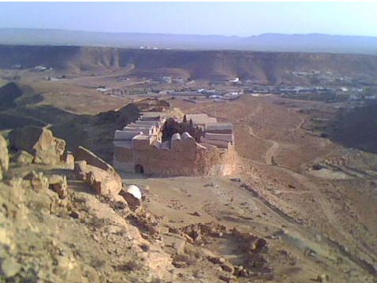

source: Jani Tarek - http://www.geolocation.ws/v/P/52515669/-/en, 2012.06.21. 17:22

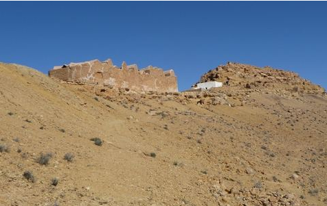

source: EllieGee - http://wherevertheroadgoes.files.wordpress.com/2012/02/ksar_mourabtine.jpg, 2012.06.21. 17:30

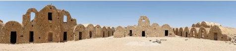

source: Theodore Japin - http://www.geolocation.ws/v/P/38156800/ksar-grenier-grain-/en,

- 2012.06.21. 17:28

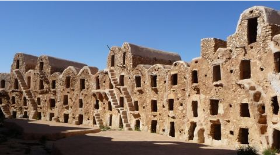

source: EllieGee - http://wherevertheroadgoes.files.wordpress.com/2012/02/ksar_mourabtine.jpg,

- 2012.06.21. 17:29

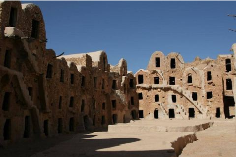

source: Mark Paskowitz - http://www.geolocation.ws/v/ I/5449326388276171745-5449327773874023458/courtyard-of-ksar-mourabtine/en, 2012.06.21.

- 17:18

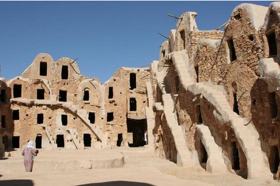

- source: Mark Paskowitz - http://www.geolocation.ws/v/ I/5449326388276171745-5449327773874023458/courtyard-of-ksar-mourabtine/en, 2012.06.21.
- 17:19

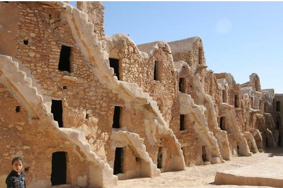

source: Mark Paskowitz - http://www.geolocation.ws/v/ I/5449326388276171745-5449327773874023458/courtyard-of-ksar-mourabtine/en, 2012.06.21.

- 17:20

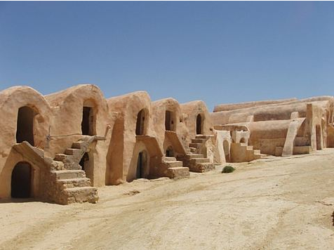

source: Ian Sewell - http://en.wikipedia.org/wiki/File:Ksar_Ouled_Soltane_01.jpg

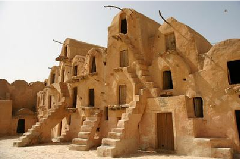

source: Ian Sewell - http://en.wikipedia.org/wiki/File:Ksar_Ouled_Soltane_01.jpg

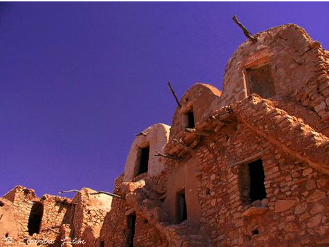

source: Near Ghoumrassen - http://www.pbase.com/cecilialim/image/35510344, 2012.06.21. 17:9

### 3. Bath Royal Circus, United Kingdom, 1754-1768

Reoccurring in various parts of the British Isles, semi-circular or circular compositions (such as Stonehenge and Woodhenge) are not without precedents in England. The complex in Bath is a significant example illustrating this. Georgian buildings from the 18th century adhering to each other within a framework were built from locally-quarried, golden-sandy-brown limestone. Much like the African examples referred to here, the elegant Royal Crescent and Circus ensemble conveys a strong sense of togetherness, in this case primarily within the context of a hierarchy. The Palladian buildings were designed by John Wood Snr and Jnr, to be built in Bath, which is the sole bath centre of England, for the royal family and their retinues. This development surrounds an enormous garden used as a venue for social events.

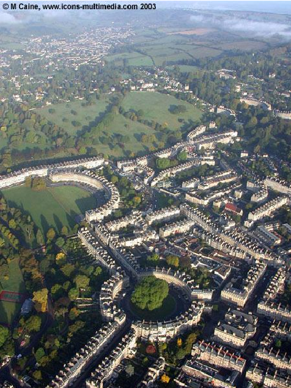

source: M. Caine - http://www.ascent-balloon.co.uk/gallery02.html, 2012.06.21. 20:12

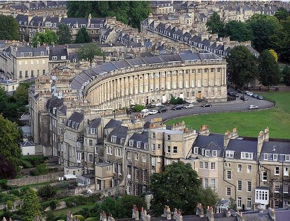

source: /-/ - http://jryan2011.wordpress.com/2011/04/20/bath-and-beyond-england-of-course/, 2012.06.21. 20:08

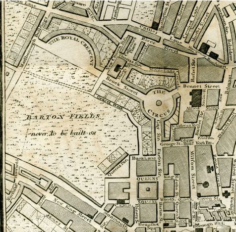

source: /-/ - http://austenonly.com/2010/03/page/2/, 2012.06.21. 20:10

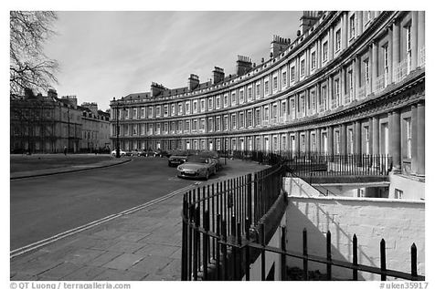

source: QT Luong - http://www.terragalleria.com/black-white/europe/united-kingdom/bath/ picture.uken35917-bw.html, 20127.06.21. 20:07

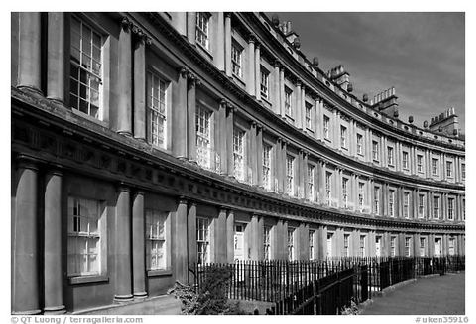

source: QT Luong - http://www.terragalleria.com/black-white/europe/united-kingdom/bath/ picture.uken35916-bw.html, 2012.06.21. 20:07

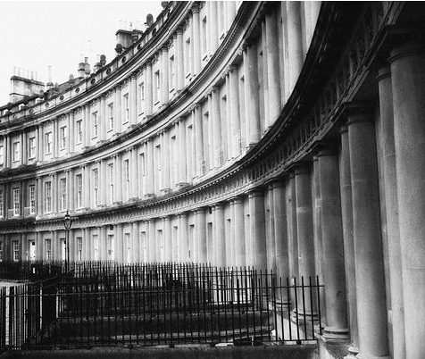

source: pitty107 - http://www.flickr.com/photos/15985961@N00/2797888772/in/photostream/, 2012.06.21. 20:06

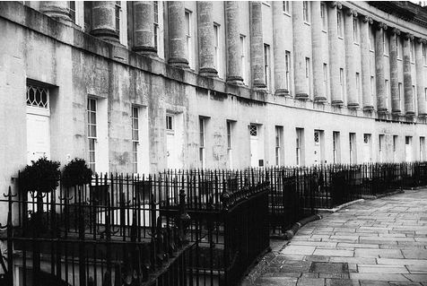

source: pitty107 - http://www.flickr.com/photos/15985961@N00/2797883048/in/photostream/, 2012.06.21. 20:06

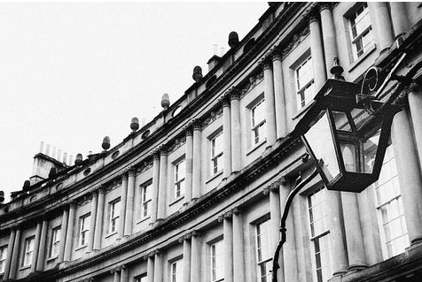

source: pitty107 - http://www.flickr.com/photos/15985961@N00/2797032709/in/photostream/, 2012.06.21. 20:06

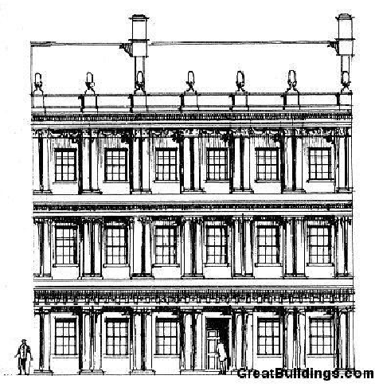

- source: /-/ - http://www.greatbuildings.com/buildings/Circus_at_Bath.html, 2012.06.21. 20:04

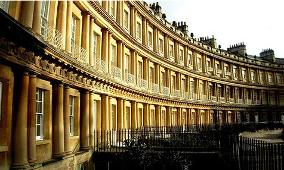

source: /-/ - http://www.dipity.com/tickr/Flickr_georgian_geotag/, 2012.06.21. 20:07

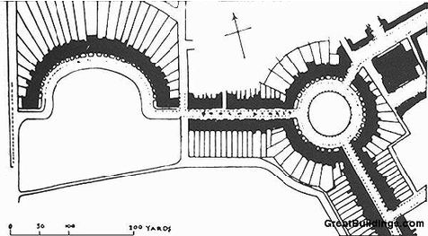

- source: /-/ - http://www.greatbuildings.com/buildings/Circus_at_Bath.html, 2012.06.21. 20:05

### 4. Kraals, Ghana and Zambia, Africa

Kraals are villages of migrating African tribes built primarily for defensive purposes as enclosures. In the lane along the entrenchment built out of thorny branches, buildings are placed in a sequence adhering to the frame. The area left unbuilt in the depth of the village is not public domain. More

often than not, it is surrounded with corrals to provide a sheltered area to pen livestock. This is why we often use the term “corral village” in Hungarian. Developed like a fractal, its upgraded version for permanent use is found in Ba-ila, a village of the African Ila tribe in Zambia. The smaller kraals of the tribal families create a monumental circle with a diameter of several hundred metres. Removed from this framework, like a medal on a necklace, only the house of the chieftain and his family is a freestanding structure. The houses of families of various sizes and social status form smaller enclosures within the village in a sequence starting from the focal point to the entrance to the area. Their positions reflect their relative rank within the hierarchy of the community. The three layers of the fractal form a nice tracery on schematic floor plan designs. The simple circular ground plan of the hut is echoed in the kraal of the family, while these horseshoe-shaped units make up the village itself, integrated as an enclosure.

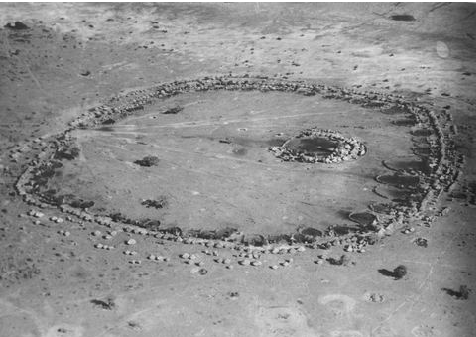

source: Mary Light, American Geographical Society - Bernard Rudolfsky: Architecture without

- architects, New York, 1964

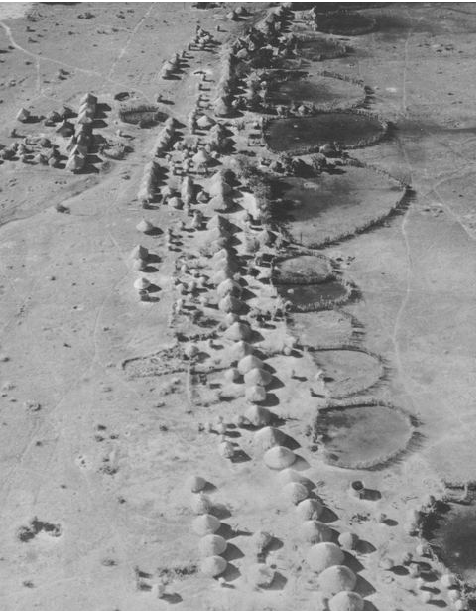

source: Mary Light, American Geographical Society - Bernard Rudolfsky: Architecture without

- architects, New York, 1965

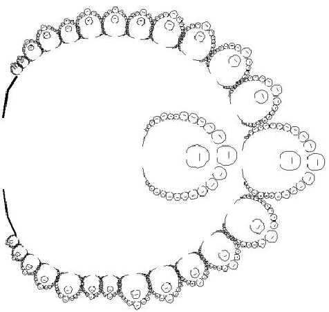

source: /-/ - http://www.superdupershark.com/math-global-fractals-african-villages-chaos/

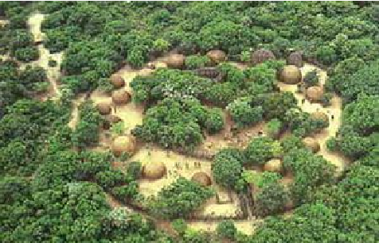

source: Anton Taljaard - http://www.flickr.com

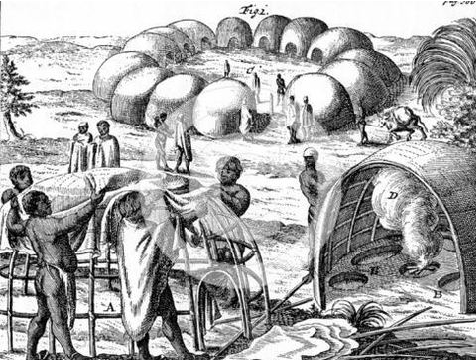

source: Dorothea Fairbridge - http://watermarked.heritage-images.com/2325358.jpg

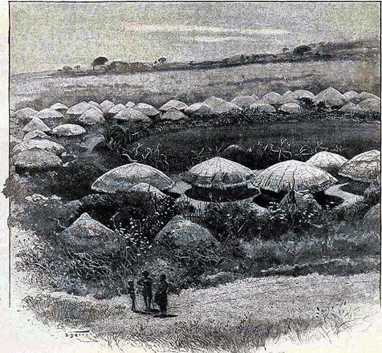

source: Anton Taljaard - http://www.flickr.com

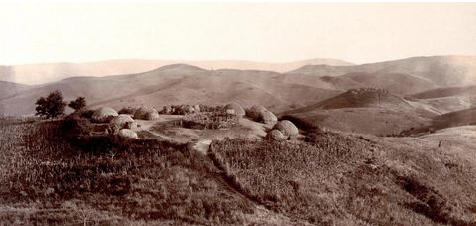

source: Anton Taljaard - http://www.flickr.com

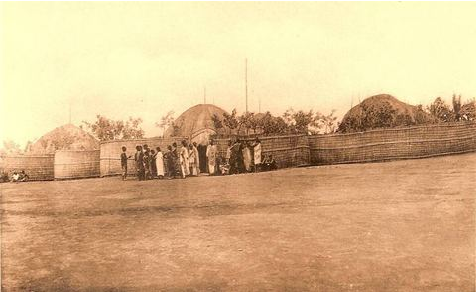

source: Jos. Dardenne - http://www.delcampe.net/page/item/id,177852712,var,Rwanda--Kraal-d %60un-chef-Mututsi--Heliogravure--annee-191020,language,E.html

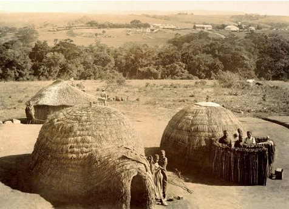

source: Anton Taljaard - http://www.flickr.com

## Fill - Pattern

### 5. Barumini Su Nuraxi, Sardinia, Italy

Nuraghi were cone frustum-type buildings on the island of Sardinia, built from irregular-shaped stones of various sizes. The wall between the external and internal enclosure concealed passage-like spaces or internal spiral staircases leading to the roof. A wall was erected around the central nuragh. This confined framework was filled in by a meandering sequence of small circular huts made of stone. The pattern integrating arches that cling together envelops the site entirely. This civilisation between 1500-500 B.C.E. used surprisingly advanced building technology. Houses constructed without mortar or cement feature corbelled domes and contain interiors with highly inspired sections. Subdivided by curved walls, the area is occupied by exciting, almost labyrinthine gardens which evoke an urban street system of the more intricate type. The smaller houses around the towers featured irregular oval floor plans. Elsewhere, rooms were built as additions to extend a central courtyard.

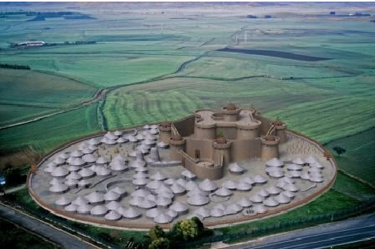

source: Nemesi44 - http://shardanapopolidelmare.forumcommunity.net/?t=44712909, 2012.09.19

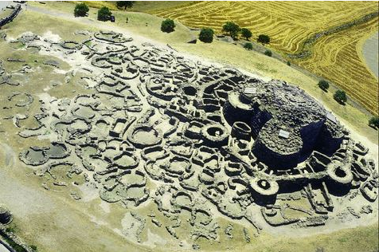

source: Foto Aeronike - http://www.lincei-celebrazioni.it/atlantika/foto.html, 2012.06.21. 21:15

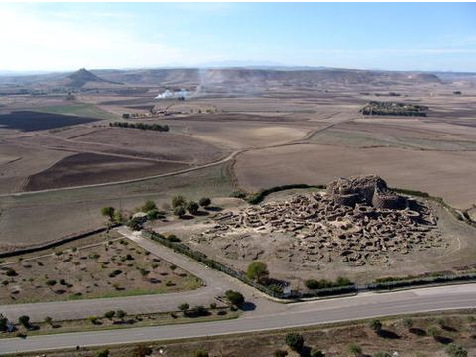

- source: Vicenzo Santoni - http://whc.unesco.org/en/list/833/gallery/, 2012.06.21. 21:12

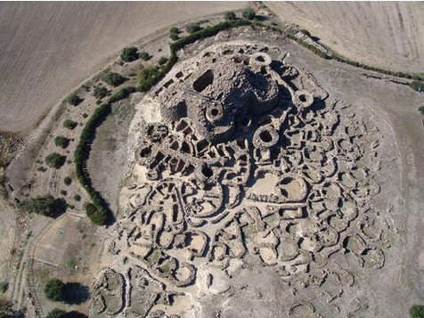

- source: Vicenzo Santoni - http://whc.unesco.org/en/list/833/gallery/, 2012.06.21. 21:13

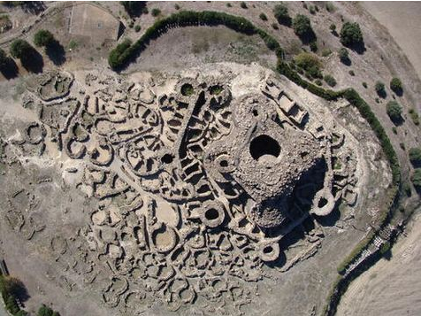

###### source: Vicenzo Santoni - http://whc.unesco.org/en/list/833/gallery/, 2012.06.21. 21:14

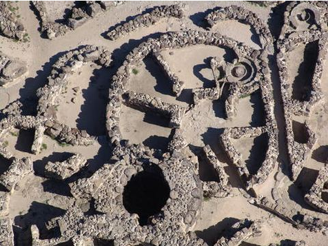

###### source: Vicenzo Santoni - http://whc.unesco.org/en/list/833/gallery/, 2012.06.21. 21:15

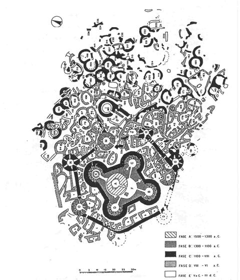

source: /-/ - http://www.agrarioelmas.it/index.php? option=com_content&view=article&id=56:modulo-32&catid=24:ambientinsieme&Itemid=57,

- 2012.06.21. 21:10

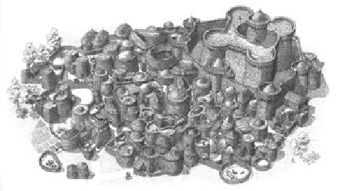

source: /-/ - http://www.agrarioelmas.it/index.php? option=com_content&view=article&id=56:modulo-32&catid=24:ambientinsieme&Itemid=57,

- 2012.06.21. 21:11

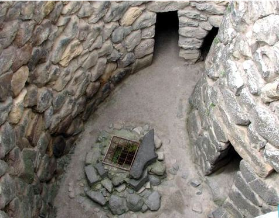

source: /-/ - http://www.charmingsardinia.com/sardinia/su-nuraxi.html, 2012.06.21. 21:9

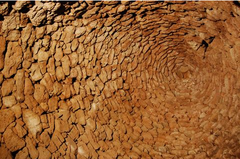

source: Lopez Cortelo - http://tectonicablog.com/?p=3573, 2012.06.21. 21:14

### 6. Great Zimbabwe, Zimbabwe, Africa

This is a city of the Sona, an African nation. The enclosure, which is marked by a thick granite wall, is a powerful structuring agent in this composition. The type frequently used in African tribal architecture, in the kraals or the in the villages (e.g., Ba-ila) of the Ila tribe, is modified to the extent that, instead of the timber and adobe used all over this continent, the wall here was built from curved and carved, granite oblong blocks with a width reaching 1.5 metres. Corrals and residential buildings adhere to the wall, which was built without mortar or cement and ranges 5 and 11 metres in height. The tribe, specialised in primarily nomadic animal husbandry, used this sheltered courtyard as an assembly area and refuge. Narrow circulation passages wind between the fort-like external walls and the corrals, articulating the garden.

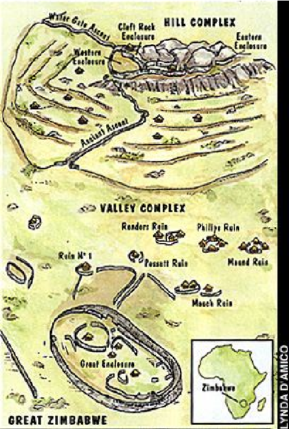

source: Lynda D'anmico - http://archaeology.about.com/gi/o.htm?zi=1/ XJ&zTi=1&sdn=archaeology&cdn=education&tm=4398&f=11&tt=13&bt=0&bts=0&zu=http %3A//www.archaeology.org/9807/abstracts/africa.html 2012.06.17 16:33

source: /-/ - http://www.thenagain.info/webchron/africa/GreatZimbabwe.html, 2012.06.07. 16:20

source: ctsnow (Flikr user) - http://en.wikipedia.org/wiki/Great_Zimbabwe, 2012.06.07. 15:38

source: /-/ - http://www.wayfaring.info/2007/07/10/important-looking-stone-structures-in-greatzimbabwe/, 2012.06.07 16:31

source: Samwise Gamgee, Macvivo - http://en.wikipedia.org/wiki/Great_Zimbabwe, 2012.06.07. 15:39

source: /-/ - http://www.wayfaring.info/2007/07/10/important-looking-stone-structures-in-greatzimbabwe/, 2012.06.07 16:33

source: /-/ - http://www.ngoko.com/zimbabwe/great_zimbabwe.php, 2012.06.07 16:34

source: /-/ - http://www.metmuseum.org/toah/hd/zimb/hd_zimb.htm, 2012.06.07.16:14

source: Ulamm - http://en.wikipedia.org/wiki/Great_Zimbabwe, 2012.06.07. 15:39

### 7. Olynthos, Greece

Observing the general plan of this town which flourished in the Chalkidiki Peninsula in the 5th-3rd centuries B.C.E., an interesting duality is revealed. The old core of Olynthos still shows the tracery of an organically growing town, as a system of houses wedged beside each other showing no sign of deliberate structuring. North of the old town is the new one, which is a classic example of regular, orthogonal, purposefully developed settlements akin to late Greek towns such as Priene and Miletos. The strict quadratic grid of the internal domain fills in the framework created by the castle wall, featuring broken outlines at several points. The simultaneous appearance of the two systems (the organic and orthogonal structuring) is a specialty of the general plan. Dwellings that fill out the grid are of a more advanced type. Parallel main routes are connected by narrower and wider by-ways, providing a more representative and ordinary household access to each residential building. Internal courtyards face south, while along the full length of their northern side is the pastaz, a transitional area akin to porches. Although placed eccentrically within the strictly configured ground plan, the garden is unquestionably the heart of the building.

###### source: /-/ - /-/

source: /-/ - /-/

source: /-/ - http://aytch.mnsu.edu/URBS110/Greeks/

- source: /-/ - http://olynthos-school.gr/?page_id=212

- source: /-/ - http://olynthos-school.gr/?page_id=213

source: /-/ - http://3.bp.blogspot.com/-lRNNDm_5G8c/Ta2aRZ-yHMI/AAAAAAAAAVc/ TkRo2TD6VvY/s1280/ZIMG_D762.JPG

source: /-/ - http://www.proprofs.com/flashcards/cardshowall.php?title=ancient-cities-final

source: Prof. Norbert Schoenauer - http://www.arch.mcgill.ca/prof/schoenauer/arch528/lect04/ n04.htm

source: Dr. Mayer Péter - http://www2.arts.u-szeged.hu/cla/Studies/courses_07-08-1/regtanlakaskult/index.htm

source: Louis C. - http://historum.com/ancient-history/40863-house-sizes-classical-greece-vsusa-2.html

### 8. Kasbah, the Kasbah of Algiers, Algeria

Kasbahs are North African towns typically surrounded by rocky mountains and fortified with castle walls. The ancient core, the Kasbah of Algiers in the capital of Algeria, was built on the ruins of Icosium. This high-density trapezoidal part of the city sloping in the direction of the harbour is bordered by steep rocky hills to the south, by the city walls to the north, and by the sea in the east. Because of its confined position, it has always been densely populated, featuring typically whitewashed courtyard houses that create a pattern completely filling in the site. Within this apparent chaos, the logic of the tracery is defined by the morphological features of the area and the various needs for light conditions. In a chain-like pattern, the quadratic sites of almost identical size are strung along the hillside to create blocks articulated by narrow alleys. The heart of the buildings is a courtyard; thus, rooms face and receive light through this central area. In line with high-density development, the courtyards are of minimal size, but they are extended by terrace gardens on the flat roofs facing the sea.

source: /-/ - http://design.epfl.ch/organicites/2010b/1-assignments/3-vernacular-lessons/casbahalger

source: DigitalGlobe - http://saugy-photo.fr/Algerie/Casbah%20Alger/Casbah_Alger.html

source: iñaki do Campo Gan - http://www.flickr.com/photos/quedate_en_la_luz

source: /-/ - http://www.cparama.com

source: /-/ - http://www.cparama.com

source: /-/ - http://4.bp.blogspot.com/-mtnHxtiPxPg/Te5vtp57rJI/AAAAAAAAC3M/Qswt1Lnqnw0/ s1600/kasba_.jpg

source: /-/ - http://design.epfl.ch/organicites/2010b/1-assignments/3-vernacular-lessons/casbahalger

source: /-/ - http://design.epfl.ch/organicites/2010b/1-assignments/3-vernacular-lessons/casbahalger

source: iñaki do Campo Gan - http://www.flickr.com/photos/quedate_en_la_luz

source: iñaki do Campo Gan - http://www.flickr.com/photos/quedate_en_la_luz

source: iñaki do Campo Gan - http://www.flickr.com/photos/quedate_en_la_luz

## Fill – Lane

### 9. Bispukin, Poland

A fill composition featuring one of the nicest configurations, this was built in the 6th century B.C.E. in today’s Poland on a marsh as a fortified village with log walls. The 160-metre-long and 110-metrewide oval island with a wide perimeter rampart was developed by lanes of buildings with intermediate areas next to them featuring essential contents. On the southern side of the buildings, lanes 3-4 metres wide, covered with pergolas, run parallel to the southern sides of the buildings, to double as access and extend the interior with a space similar to a finely-oriented, quite viable garden. Stretched between the access routes and featuring exact directions are almost 100 dwelling units with identical floor plans, as

a result of careful design work. Accessible exclusively via a bridge from the mainland, this estate was a most adequate response to the challenges of a turbulent and dangerous world – namely, Europe in the 1st millennium B.C.E. The lanes and streets as intermediate areas do not yet take over the functions of a garden, but they are interpretable as extensions of the enclosed buildings, owing to their favourable orientation.

source: /-/ - http://www.turystyka.torun.pl/_upload/galeria_duze/182_7.gif, 2012.06.21. 21:27

source: FxJ - http://commons.wikimedia.org/wiki/File:Biskupin_010.jpg, 2012.06.21. 21:33

- source: /-/ - http://www.netconnect-project.eu/biskupin.htm, 2012.06.21. 21:28

source: Zbigniew Ziółkowski - http://www.mapofpoland.net/Biskupin,photos.html#photos,

- 2012.06.21. 21:30

source: K.Janczyk - http://polskajestfajna.wp.pl/gid,9026866,gpage,1,img,9026888,title,Biskupin-

- pomnik-historii-Polski,galeria.html, 2012.06.21. 21:30

- source: /-/ - http://www.netconnect-project.eu/biskupin.htm, 2012.06.21. 21:29

source: K.Janczyk - http://polskajestfajna.wp.pl/gid,9026866,gpage,1,img,9026888,title,Biskupin-

- pomnik-historii-Polski,galeria.html, 2012.06.21. 21:31

source: Zbigniew Ziółkowski - http://www.mapofpoland.net/Biskupin,photos.html#photos,

- 2012.06.21. 21:31

- source: Zbigniew Ziółkowski - http://www.mapofpoland.net/Biskupin,photos.html#photos,
- 2012.06.21. 21:32

source: Geoff Carter - http://structuralarchaeology.blogspot.hu/2008/12/16-world-of-woos.html, 2012.06.21. 21:34

### 10. Kahun, Illahun, Egypt

Built around 1880 B.C.E., during the 12th dynasty, this was a most significant town of the Middle Kingdom, El Lahun or the town of pyramids. Meant for workers and supervisors hired for the construction work on the tomb of Sesostrist II, an enclosed settlement within a framework divided into two parts by a thick wall was built here, in line with the social hierarchy. The structure articulated by streets and lanes is organised in an orthogonal system of defined directions. North-south and eastwest routes divide the area of the 350 x 400 m rectangular site into smaller sub-units. The western third of the area contains the workers’ dwellings. The smaller dwelling units with a small floor area turned to face each other are accessible via the side streets opening from the main routes. Along the wall separating the two areas, dwellings for supervisors are included. On the larger eastern side of the town, buildings for the officers, priests and the more representative ones for the pharaoh are included, along the road starting from an urban plaza. Each apartment is an introverted one, facing the centre in each case with a north-facing courtyard as their focus and solid facades overlooking the lanes.

source: W.M.F. Petrie - W.M.F. Petrie: Illahun, Kahun and Gurob, London, 1891 (Plate XIV; W.M.F. Petrie, G. Brunton, M.A. Murray, Lahun II, London, 1923, Plates II, XXXIII, XXXVIA; B. J. Kemp, Ancient Egypt. Anatomy of a Civilization, London, 1989, Fig. 53.)

source: /-/ - http://www.theitalianviking.com/art/art_03_egypt/

source: Vasáros Zsolt-Schunk Szabolcs-Tóth Márton Zoltán - (3D rekonstrukció) Vasáros Zsolt-Schunk

- Szabolcs-Tóth Márton Zoltán 2008

source: Vasáros Zsolt-Schunk Szabolcs-Tóth Márton Zoltán - (3D rekonstrukció) Vasáros Zsolt-Schunk

- Szabolcs-Tóth Márton Zoltán 2009

source: Vasáros Zsolt-Schunk Szabolcs-Tóth Márton Zoltán - (3D rekonstrukció) Vasáros Zsolt-Schunk

- Szabolcs-Tóth Márton Zoltán 2010

source: Markh - http://en.wikipedia.org/wiki/File:Pyramid_at_Lahun.jpg

source: hat - http://fotografia.deagostinipassion.com/gallery/image/el-lahun-piramide

source: hat - http://fotografia.deagostinipassion.com/gallery/image/el-lahun-piramide

source: Szépművészeti Múzeum - http://www.szepmuveszeti.hu/data/cikk/358/cikk_358/El-Lahun.jpg

source: /-/ - tudasbazis.sulinet.hu

### 11. Fugger Estate, Germany

This small town surrounded by a wall was built by the prosperous Fuggers, a dynasty of merchants, in German Renaissance style for their own workers. From many aspects, it is a follow-up to the composition seen in Bispukin. Surrounded by a wall, the estate completely takes up the area at its disposal. The lines of buildings contained within are separated from each other by well-defined directional streets. The lanes not only grow physically to reach a width of almost 7 metres, but are also enriched in contents by expanding into vegetable gardens. Conceived in the spirit of presence, the large-scale construction of numerous (originally 106), cheap “social apartments” realised economical utilisation of land and a cost-efficient type of building. Functionally complex, the ensemble features a school, baths, hospital and a church, too. Much in the same way as in Bispukin, the garden adheres to the southern side of the buildings’ lane. However, it was more than the extension of living space. It doubled as a small vegetable garden, as well as a venue for animal husbandry.

source: Mózer István - Timon Kálmán, Korszerű kertes beépítések, a sorháztól a lakódombig, Műszaki

- Könyvkiadó, Budapest, 1980

source: /-/ - http://www.platitudes.nl/hofjes.html, 2012.06.21. 19:38

source: Paolo Bolchi - http://www.geolocation.ws/v/P/51596447/augsburg-fuggerei/en, 2012.06.21. 19:37

source: High Contrast - http://commons.wikimedia.org/wiki/ File:Herrengasse,_Fuggerei,_Augsburg.jpg, 2012.06.21. 19:47

###### source: Tibor Répási - http://www.geolocation.ws/v/ I/5401784697293293217-5401784776232409170/a-fuggerei-a-vilg-legrgibb-szocilis/en, 2012.06.21. 19:38

source: Hans Sterkendries - http://www.panoramio.com/ photo_explorer#view=photo&position=10300&with_photo_id=55733820&order=date_desc&user=68287, 2012.06.21. 19:35

source: Wolfgang B. Kleiner / context medien und verlag Augsburg - http://de.wikipedia.org/w/index.php?title=Datei:Fugger_Fuggerei-Markuskirche %2BHerrengasse.jpg&filetimestamp=20090915094811, 2012.06.21. 19:30

source: Mózer István - Timon Kálmán, Korszerű kertes beépítések, a sorháztól a lakódombig, Műszaki

- Könyvkiadó, Budapest, 1981

source: Lernerfolg - http://de.wikipedia.org/w/index.php? title=Datei:Fugger_viertel_brunnen.jpg&filetimestamp=20110728115542, 2012.06.21. 19:34

source: Mózer István - Timon Kálmán, Korszerű kertes beépítések, a sorháztól a lakódombig, Műszaki

- Könyvkiadó, Budapest, 1982

### 12. Camaldulian Hermitage, Majk, Hungary

An improved version of the fill type articulated by lanes as seen in Bispukin and Augsburg, this site is made up of even more layers owing to uses different from previous examples. Built for the Camaldulian monks, who took an oath of silence, this composition containing cells and a monastery reflects the characteristics of the operation of this religious order. The courtyard fabric, integrating smaller and larger intermediate areas, offers differentiated spaces suited to the experience of community and solitude. The entrances to the hermits’ cells open into their own gardens, the floor-area of which is the same as that of the dwelling unit. Stepping out from the garden, the churchyard transforms into a monastery garden. This ensemble was built between 1753 and 1770, after the war of liberation lead by Rákóczi, along designs by Franz Anton Pilgram, an Austrian architect. It was financed by aristocratic families loyal to this uprising. The development contains 17 cell houses, a church tower and a monastery. Camaldulian hermits living here had a total of 1,200 hectares at their disposal. Besides the task of creating architectural spaces suited to the everyday life of the recluses, the symbolic role of the garden as a venue for contemplation and seclusion is also emphasised.

- source: Tóth Géza - http://www.kastelyok-utazas.hu/Lap.php?cId=804, 2012.06.07. 16:51

- source: Tóth Géza - http://www.kastelyok-utazas.hu/Lap.php?cId=804, 2012.06.07. 16:52

source: /-/ - http://www.muemlekem.hu/muemlek?id=6353, 2012.06.07. 16:55

- source: Gyöngyi - http://www.panoramio.com/photo/34362976, 2012.06.07. 17:06

source: Kontiki - http://hu.wikipedia.org/wiki/Majki_m%C5%B1eml%C3%A9kegy%C3%Bcttes, 2012.06.07. 17:13

- source: Gyöngyi - http://www.panoramio.com/photo/34362976, 2012.06.07. 17:07

source: /-/ - http://kulturalisutvonalak.blogter.hu/329249/harmonia_caelestis__a_majki_kamalduli_remeteseg, 2012.06.07. 17:10

source: /-/ - http://www.muemlekem.hu/fotopalyazat?id=4808, 2012.06.07. 17:05

- source: Gyöngyi - http://www.panoramio.com/photo/34362976, 2012.06.07. 17:08

source: Konti04 - http://www.muemlekem.hu/fotopalyazat?id=3453, 2012.06.07. 17:00

source: /-/ - http://www.muemlekem.hu/muemlek?id=6353, 2012.06.07. 16:55

## Growth - Cohesion

### 13. Lake Dwellings, Bodensee (Lake Constance),Germany

A special, but highly characteristic form of growing structures is this cluster of stilt houses built on the water. Found in several parts of the world, this form of development is a finely reconstructed one on Bodensee (Lake Constance) in Germany. Buildings connected to a small terrace adhere to winding piers that branch off above the water. The direction of growth is defined by the tiers serving access, to which the constituents may connect either one by one or as clusters. The garden is transformed in this environment. The terrace, set on stilts next to the buildings, and the water between the individual components may take on this function. The former is a well-functioning living space, the open-air extension of the building; while the latter could be a means of separation. As we shall see, this kind of development is once again revived in the Netherlands because of the growth of the city, as a response to the urgent issue of land shortage.

source: x_hanni - http://www.flickr.com

source: S. Hoggar - http://www.flickr.com

source: Christine - christine-on-big-trip.blogspot.h

source: Rick van der Klooster - http://www.flickr.com

source: Kookiis - http://www.flickr.com

source: Kookiis - http://www.flickr.com

source: Kookiis - http://www.flickr.com

source: Kookiis - http://www.flickr.com

source: Wolfgang Staudt - http://www.flickr.com

source: Wolfgang Staudt - http://www.flickr.com

### 14. Chuandixia, China

Wedged between mountains, this small Chinese settlement climbs in the direction of peaks arising from the valley route. The terraced hillside cultivation above the village cuts sharp lines into the natural landscape. Stone counterforts supporting the terraces grow higher and thicker while approaching the houses, and they are also complemented with stairs. The tracery of this growing composition is based on the system of counterforts and highlights the terrain’s contours. Courtyard houses adhere to the terrain’s lines and abutments in a sequence like swallows’ nests do. They are accessible via less steep stairs along the counterforts or steeper ones perpendicular to them. The high-density, single-storey development on the south-facing slope is articulated by sunlit courtyards of fine proportions.

Mr Bao - http://www.flickr.com/photos/xiaojiecha/2456357065/sizes/, 2012.06.21. 18:30

Mr Bao - http://www.flickr.com/photos/xiaojiecha/2456357065/sizes/, 2012.06.21. 18:30

###### /-/ - http://www.china.org.cn/travel/gallery/2008-11/13/content_16759910.htm, 2012.06.21. 18:30

###### /-/ - http://www.china.org.cn/travel/gallery/2008-11/13/content_16759910.htm, 2012.06.21. 18:31

###### /-/ - http://www.china.org.cn/travel/gallery/2008-11/13/content_16759910.htm, 2012.06.21. 18:32

/-/ - http://www.chinatourstravel.com/china-travel-photos/china-attraction-pictures/Beijing/ chuandixia-photos_2.html, 2012.06.21. 18:38

Tina Manley - http://tinamanley.smugmug.com/Asia/China/ China/3917423_chwt4k/349931055_pVztX#!i=349931055&k=pVztX, 2012.06.21. 18:34

###### Fabrizio - http://www.borrowedculture.com/2011/09/07/chuandixia-village/, 2012.06.21. 18:32

Fabrizio - http://www.borrowedculture.com/2011/09/07/chuandixia-village/, 2012.06.21. 18:33

Zoe, Marie - http://marieinbeijing.blogspot.hu/2008/09/trip-to-chuandixia-village.html, 2012.06.21.

- 18:32

### 15. Machu Picchu, Peru, South-America

Known as a real gem of the Inca civilisation, this town is still shrouded in legend and speculation. Viewing the settlement built around 1450 after the astonishing conquest of the slopes of the Andes, it is difficult to tell whether the hill was quarried around the buildings and walls, or the terraces and buildings formed a deposit enveloping the terrain. Of all the projects included here, this one embodies

the most intense belongingness, integrity and cohesion. Just like the Chinese village of Chuandixia, residential buildings and ceremonial ones arranged in rows follow the rhythm of the terraced, cultivated hillside. However, the direction of growth is different. Closed from the outer world, buildings at the almost inaccessible ceremonious centre do not climb up the hill (like in the Chinese village), but flow down from it. Besides masterly carved stones and clearly tectonic construction, the dimensions, geometry and function of the gardens are also remarkable. Terraces between expanding and narrowing lines simultaneously integrate sacred zones, a plaza and small, cultivatable vegetable gardens.

source: /-/ - /-/

source: Rtype909 - http://en.wikipedia.org/wiki/File:Machu_Picchu_as_the_mist %27s_rise_at_dawn.jpg, 2012.06.21. 18:53

source: Charles Jsharp - http://en.wikipedia.org/wiki/File:Machu_Picchu_early_morning.JPG,

- 2012.06.21. 18:50

source: /-/ - http://www.waterhistory.org/histories/machupicchu/, 2012.06.21. 19:06

source: Gary Ziegler and J. McKim Malville - http://www.adventurespecialists.org/mapi1.html,

- 2012.06.21. 19:10

source: Danielle Lankhaar - http://travel.nationalgeographic.com/travel/peru/machu-picchu/yourmachu-picchu-photos/#/clouds-machu-picchu_36162_600x450.jpg, 2012.06.21. 19:19

source: Mark Vincent Rudd - http://www.greatbuildings.com/cgi-bin/gbi.cgi/Machu_Picchu.html/ cid_1069884704_7.html, 2012.06.21. 19:23

source: Julie Benson - http://50essentialexperiences.com/2010/12/13/discovering-the-hidden-city-ofthe-incas-2/, 2012.06.21. 19:18

source: /-/ - http://explorebyyourself.com/en/peru/about_the_country/machu_picchu/, 2012.06.21.

- 19:22

source: ahlasny - http://www.flickr.com/photos/14469255@N03/5282612781/in/photostream/, 2012.06.21. 19:03

source: Martin St-Amant - http://en.wikipedia.org/wiki/File:124_-_Machu_Picchu_-_Juin_2009.jpg, 2012.06.21. 18:54

### 16. Trulli, Alberobello, Italy

Trullo is a form of residential house widespread in Puglia (Apulia), a province of Southern Italy, with the most beautiful examples surviving in Alberobello. Adhering closely to one another, these edifices climb the gentle slopes of the hillside along a curved line adjusted to the terrain’s contours. Trulli were built from dry stone masonry, without using mortar or cement, with a quadratic floor plan and conical roof typically featuring a span of 4-6 metres. They were named after their forms. The etymology of the word may be rooted in the Latin turris, or the Greek thólos (cupola, dome). The thick stonewall sides of the trulli are double-layered, their dome being a direct follow-up to the walls. The interior of a trullo is an open-plan one, containing a single room. Thus, families of rooms are created by integrating the adjoining trulli to include separate residence functions. Used for storing, the larger interior space is often covered with a timber roof. Trullo architecture flourished between the 16th and 19th centuries.

source: Enrico Degano - http://www.pierreseche.com/trulli.htm

source: Enrico Degano - http://www.pierreseche.com/trulli.htm

source: Enrico Degano - http://www.pierreseche.com/trulli.htm

source: Enrico Degano - http://www.pierreseche.com/trulli.htm

source: Enrico Degano - http://www.pierreseche.com/trulli.htm

source: Enrico Degano - http://www.pierreseche.com/trulli.htm

source: Enrico Degano - http://www.pierreseche.com/trulli.htm

###### source: Paul Oliver - Paul Oliver: Dwellings, The vernacular house World Wide, Phaidon, 2002

###### source: Paul Oliver - Paul Oliver: Dwellings, The vernacular house World Wide, Phaidon, 2003

###### source: Enrico Degano - http://www.pierreseche.com/trulli.htm

source: Enrico Degano - http://www.pierreseche.com/trulli.htm

## Growth - Pattern

### 17. Çatal Hüyük, Turkey

A settlement dating from the Neolithic age, it is the best known ancient example of structures growing in an additive way. Houses featuring quadratic floor plans were built right next to each other. Their coordination created an extreme degree of density, as it has no street grid in the modern sense. Dwelling units were accessible through the roof by climbing a ladder. Roofs were sequenced close to each other on terraces along the slope. The homogenously spreading development lies between the river and the range of hills like a carpet, thus exposing compositional features of the pattern type. Apartments featuring one or two rooms included an average floor area of 25 m2. Integrating units adhering to each other like this served defence purposes. The garden was reduced to a small courtyard as a result of extremely high density.

source: /-/ - http://leavingbabylon.wordpress.com/book/being-there/, 2012.06.21. 20:37

source: /-/ - http://www.worldend.info/end-of-the-world/ancient-mysteries/the-mystery-of-catalhuyuk/, 2012.06.21. 20:41

source: Nadine Grosgurin - http://www.museum.agropolis.fr/english/pages/expos/fresque/ zm_mod6b.htm, 2012.06.21. 20:36

source: /-/ - http://users.hol.gr/~dilos/prehis/prerm5.htm, 2012.06.21. 20:32

source: Michael Smith - https://plus.google.com/photos/107349581396160428939/ albums/5138690146212588641/5138690348076051570?banner=pwa, 2012.06.21. 20:38

source: /-/ - http://www.ritualgoddess.com/aboutcatalhuyukuyuk.htm, 2012.06.21. 20:40

source: /-/ - http://www.elartetaurino.com/catal%20hoyuk.html, 2012.06.21. 20:43

- source: /-/ - http://www.ritualgoddess.com/aboutcatalhuyuk.htm, 2012.06.21. 20:41

- source: /-/ - http://www.ritualgoddess.com/aboutcatalhuyuk.htm, 2012.06.21. 20:42

source: Mathae - http://en.wikipedia.org/wiki/File:Catal_H%C3%BCy %C3%BCk_Restauration_B.JPG, 2012.06.21. 20:30

### 18. Ghadames, Libya

One of the most ancient existing towns of the Sahara Desert, it evolved in the neighbourhood of an oasis on the frontier of Algeria and Tunisia. Already existed in Roman times under the name Cydamus, it is an outstanding example of traditional growing settlements. The winding, zigzagging line defining the position of buildings seems capable of being continued endlessly. Stretched between lines, volumes of various height, combined with terraces on their roof tops, appear as white grooves,

much like a pattern in a plaster moulding. A prominent feature of presence is vertical construction. The system integrating ground-floor shops and upper-floor homes prevails as of today. This creates not only a living internal sphere, but also protects against the desert sunbeams beating down. Gardens are distorted into alleys and courtyards serve almost exclusively as circulation. In many cases, they are contained beneath the upper floors of houses and thus create an underground system of passages. The roof and the open terrace were reserved for women. Here they could socialise and establish contacts with their neighbours. The narrow alleys on the ground floors were primarily used by men.

source: /-/ - /-/

source: Robert Bamler - http://en.wikipedia.org/wiki/File:Ghadames_Panorama_April_2004.jpg, 2012.06.21. 20:55

source: /-/ - http://www.magic-libya.com/en/sites/details/29/Ghadames, 2012.06.21. 20:57

source: Mike Gadd - http://www.flickr.com/photos/mikegadd/289731644/, 2012.06.21. 21:01

source: /-/ - http://www.sea-desert.net/image/ghadames/ 2012.10.11.

###### source: Mike Gadd - http://www.flickr.com/photos/mikegadd/289730660/, 2012.06.21. 21:00

source: Federica Leone - http://whc.unesco.org/en/list/362/gallery/, 2012.06.21. 20:55

source: Luca Galuzzi - http://en.wikipedia.org/wiki/ File:Libya_4432_Ghadames_Luca_Galuzzi_2007.jpg, 2012.06.21. 20:50

### 19. Dogon Village, Africa

Dogons were settled around the Bandigar plateau (today: Mali Republic) in the 13th century. Their lifestyle and their settlements have hardly changed throughout the centuries. More extensive villages in the plains are fine examples of the growing type. Seen from a bird’s eye view, these villages display their highly special traceries. Although the constituents of the pattern are repeated, the composition’s vibrancy is the result of endless variations on their configuration. The basic element, the dwelling unit of a family, is made up of several files, containing a courtyard or garden with a stonewall border. The

position of the gardens, the fixed reference points of the composition, is defined by trees, elements of scarce vegetation. Basic units of this composition are flat-roofed quadratic dwellings with adobe walls and characteristic cone-roofed, circular stores with farm outbuildings built near them. Cells of versatile dimensions and shapes are divided from each other by small lanes, allowing for thousands of ways of integrating more and more new components in a growing pattern. The function and use of individual constituents is strictly defined. Some of the buildings were built exclusively for men, but there is one also reserved for women having their periods.

source: Zadnoz - http://www.phombo.com/wallpapers/the-best-hd-hq-cityscapes/584304/, 2012.10.04

source: /-/ - http://www.palacetravel.com/african-destinations/west-africa/mali/tours/historicalcultural-tour-of-mali-15-days, 2012.06.21. 17:54

source: Dan Giveon - http://www.flickr.com/photos/dangiveon/2419337658/, 2012.06.21. 17:52

source: Dario Menasce - http://hu.wikipedia.org/w/index.php?title=F %C3%A1jl:DogonVillage.jpg&filetimestamp=20080112125805, 2012.06.21. 17:44

source: /-/ - http://tedchang.free.fr/WestAfrica/Mali/index2.html, 2012.06.21. 17:50

source: Jordi Ber - http://en.urbarama.com/project/dogon-village, 2012.06.21. 17:58

source: Ferdinand Reus - http://www.flickr.com/photos/72092071@N00/119444449/, 2012.06.21. 17:46

source: nanjaandjelle - http://nanjaandjelle.50webs.com/WestAfrica.html, 2012.06.21. 17:52

source: Misha Davids - http://www.flickr.com/photos/misha1138/6652881321/, 2012.06.21. 17:53

source: /-/ - http://www.palacetravel.com/african-destinations/west-africa/mali/tours/festival-in-thedesert-overland-15-days, 2012.06.21. 17:55

### 20. Lindos, Greece

The ancient Greeks referred to Rhodes, this most beautiful island, as Helios, the Sun god. In about 100 B.C.E., martial Doric tribes occupied it and founded three towns, one of them being Lindos. Thanks to its east-facing orientation, the town soon evolved into a trade centre. Thus, it is no accident that Homer mentions it in The Ilyad as one of the most flourishing towns of the region. After the foundation of Rhodes, the new capital Lindos lost its significance, which in turn allowed its characteristic fabric to grow and evolve organically to the present day. At the foot of the acropolis towering above the bay, a pattern resembling bee-hives is made up of snow-white, cell-like buildings grouped around courtyards. Just like in Algir’s kasbah, the direction of growth and the logic of the pattern are defined by topographical features, streets winding along the slope and the orientation of courtyards allowing in light. The crowded additive system contains steep streets resembling thin cuts. The versatile positioning of the courtyards results from their relation with the street and their internal densification. In some cases, one steps into the courtyard directly from the alleys. Elsewhere, there is access to the sheltered back garden through the house, but more often than not, the courtyard transforms into an atrium at the focus of the building. A palette of light colours, lanes of strict proportions (widening here and there), arbours stretched above the streets and canvasses protect against summer heat.

source: Saffron Blaze - http://en.wikipedia.org/wiki/Lindos, 2012.06.21. 13:57

source: /-/ - http://www.lindoseye.com/, 2012.06.21. 14:00

source: Andra MB - http://www.flickr.com/photos/andra_mb/3684203510/ 2012.06.21. 14:35

source: Rnriggins - http://blog.travelpod.com/travel-blog-entries/rnriggins/1995/1275913972/

- tpod.html#_, 2012.06.21. 14:19

source: /-/ - http://www.filmapia.com/published/places/lindos, 2012.06.21. 14:10

source: Saffron Blaze - http://en.wikipedia.org/wiki/Lindos, 2012.06.21. 13:58

source: Sylvia Glebocka - http://www.engelvoelkers.com/gr/rhodes/lindos-region/lindos-centre/ a-traditional-gem-in-lindos-w-00diwu-631038.328782_exp/?language=en?elang=en, 2012.06.21.

- 14:12

- source: Sylvia Glebocka - http://www.engelvoelkers.com/gr/rhodes/lindos-region/lindos-centre/ a-traditional-gem-in-lindos-w-00diwu-631038.328782_exp/?language=en&elang=en, 2012.06.21.
- 14:13

source: Rnriggins - http://blog.travelpod.com/travel-blog-entries/rnriggins/1995/1275913972/

- tpod.html#_, 2012.06.21. 14:20

source: /-/ - http://www.dipity.com/tickr/Flickr_explore_santorini/, 2012.06.21. 14:05

## Growth - Lane

### 21. Acoma Pueblo, United States of America

This ancient Indian village is located in New Mexico, a sandstone plateau referred to as the Enchanted Mesa. This development may be interpreted as a much denser version of the system observed in the case of the Sittard. The higher density and crowdedness of coordinated components can be explained by the limited dimensions of the plateau and the fact that the dwelling units of Indian pueblos are traditionally accessible from above. The unusual placement of the entrance pushes some of the circulation areas onto roof terraces. The individual building lines are sharply defined despite the growth structuring. Piles of boxes facing south accumulate along the main access routes and spread in exact, definite directions. As it is difficult to access the village, defence of dwelling units is a priority concern. Owing to its location on a plateau, the multi-layered pueblo features a circulation system spread out in space. As a result, the residential floors are only accessible via ladders, all of which serve the same function. The lower levels surrounding the intervals were used as businesses, while terraces and upperfloor gardens functioned as cooking sites.

source: SAL - http://saleil.blogspot.hu/2011/07/acoma-pueblo-ancient-sky-city-of-native.html,

- 2012.10.03

source: SAL - http://saleil.blogspot.hu/2011/07/acoma-pueblo-ancient-sky-city-of-native.html,

- 2012.10.04

source: M. James Slack - http://memory.loc.gov/cgi-bin/ampage?collId=hhphoto&fileName=nm/ nm0000/nm0095/photos/browse.db&action=browse&recNum=0&title2=Pueblo%20of%20Acoma, %20Casa%20Blanca%20vicinity,%20Acoma%20Pueblo,%20Valencia, %20NM&displayType=1&itemLink=r?ammem/hh:@field%28DOCID+@lit%28NM0095%29%29, 2012.06.21. 18:08

source: Ansel Adams - http://en.wikipedia.org/wiki/File:Ansel_Adams_-_National_Archives_79-AAA02.jpg, 2012.06.21. 18:05

source: Ansel Adams - http://en.wikipedia.org/wiki/File:Ansel_Adams_-_National_Archives_79-AAA03.jpg, 2012.06.21. 18:02

source: M. James Slack - http://memory.loc.gov/cgi-bin/ampage?collId=hhphoto&fileName=nm/ nm0000/nm0095/photos/browse.db&action=browse&recNum=0&title2=Pueblo%20of%20Acoma, %20Casa%20Blanca%20vicinity,%20Acoma%20Pueblo,%20Valencia, %20NM&displayType=1&itemLink=r?ammem/hh:@field%28DOCID+@lit%28NM0095%29%29, 2012.06.21. 18:08

source: M. James Slack - http://memory.loc.gov/cgi-bin/ampage?collId=hhphoto&fileName=nm/ nm0000/nm0095/photos/browse.db&action=browse&recNum=0&title2=Pueblo%20of%20Acoma, %20Casa%20Blanca%20vicinity,%20Acoma%20Pueblo,%20Valencia, %20NM&displayType=1&itemLink=r?ammem/hh:@field%28DOCID+@lit%28NM0095%29%29, 2012.06.21. 18:08

source: M. James Slack - http://memory.loc.gov/cgi-bin/ampage?collId=hhphoto&fileName=nm/ nm0000/nm0095/photos/browse.db&action=browse&recNum=0&title2=Pueblo%20of%20Acoma, %20Casa%20Blanca%20vicinity,%20Acoma%20Pueblo,%20Valencia, %20NM&displayType=1&itemLink=r?ammem/hh:@field%28DOCID+@lit%28NM0095%29%29, 2012.06.21. 18:08

source: /-/ - memory.loc.gov/cgi-bin/ampage?collId=hhsheet&action=browse&fileName=nm/ nm0000/nm0095/sheet/browse.db&recNum=0&itemLink=r?ammem/hh:@field(DOCID

+@lit(NM0095))&title2=Pueblo of Acoma, Casa Blanca vicinity, Aco, 2012.06.21. 18:11

source: /-/ - memory.loc.gov/cgi-bin/ampage?collId=hhsheet&action=browse&fileName=nm/ nm0000/nm0095/sheet/browse.db&recNum=0&itemLink=r?ammem/hh:@field(DOCID

+@lit(NM0095))&title2=Pueblo of Acoma, Casa Blanca vicinity, Aco, 2012.06.21. 18:12

### 22. Nyboder Quarter, Copenhagen, Denmark

The construction of the Nyboder Quarter, north of the historic core of Copenhagen, was launched in 1631 during the reign of Christian IV. Arranged in long and narrow lines, a total of 600 residential units were built here during 17 years. Turning their backs to each other, the rows of houses facing small gardens are separated by parallel lanes. Streets grew rhythmically south of the ramparts surrounding the city in the direction of the settlement. Perpendicular to the main orientation, two streets intersecting rows of buildings facilitate quicker access, while dividing the long rows into smaller blocks. For more than a century, this development continuously grew and changed. Some of the original single-storey buildings were converted into two-storey ones in 1758 according to designs by Philip de Lange. Built for the crew members of the quickly developing royal navy and their families, this straight, orderly complex was an exemplary model responding to housing issues of densely populated zigzagged towns. Featuring simple functional floor plans decorated in lively red (today ochre yellow); delicate proportions in the façade; wide, breezy and sunlit streets; and vegetable gardens located behind the buildings to serve households – this project was a progressive and novel one in its time. After several renovations and tested by time, it has become a favourite residential environment.

source: /-/ - http://www.zeus2.dk/nyboder.html

source: /-/ - http://archi-tours.dk

source: Jesper Hertel, Mahlum - http://commons.wikimedia.org

source: Filou - http://www.flickr.com/photos

source: Ditte Marie Hallig - http://50mmfromtheworld.blogspot.hu/2011/03/nyboder.html

source: Thomas Roland - http://www.danskkulturarv.dk/

source: Thomas Roland - http://www.danskkulturarv.dk/

source: /-/ - http://www.indenforvoldene.dk/

source: Johan PV Laustsen - http://www.nybodersmindestuer.dk/nyboder.htm

### 23. Henan, Underground Dwellings, China

Underground cave homes are typical features of the loess plateaux in Shanxi, Shaanxi and provinces in the northern region of China. In Shanxi, Shaanxi and Gansu Provinces, loess was blown along the Yellow River by the winter monsoon from the direction of the Gobi Desert to the area of the former steppes, where the cemented rock formed an easy-to-carve layer. The quadratic areas of the dwellings dug into the ground are grouped around underground courtyards, the pattern of which defines the fabric of the dwelling units. The spread of this fabric is limited by the confines of the loess formations and the riverbank. The cave homes feature 5-10 m areas, 6-8 metres below ground level. They are accessible, receive light and are ventilated from the direction of the courtyards. Their tops double as roofs and as a site for drying crops. Produce dried above was simply and practically placed outside through apertures in the roofs from the storage chambers beneath. It is interesting that the climate of these underground homes is ideal because of the thick protective layer. In most cases, this makes both heating and cooling superfluous. Homes were made waterproof by enveloping them in abode layers and walls. In the courtyard, a well 5-7 metres deep was used to collect rainwater.

- source: /-/ - Bernard Rudolfsky: Architecture without architects, New York, 1961

- source: /-/ - Bernard Rudolfsky: Architecture without architects, New York, 1962

source: Tore Kjeilen, Kevin Poh - http://www.intechopen.com/books/energy-conservation/earthshelters-a-review-of-energy-conservation-properties-in-earth-sheltered-housing

###### source: /-/ - Bernard Rudolfsky: Architecture without architects, New York, 1963

###### source: /-/ - Bernard Rudolfsky: Architecture without architects, New York, 1964

###### source: Tore Kjeilen, Kevin Poh - http://www.intechopen.com/books/energy-conservation/earthshelters-a-review-of-energy-conservation-properties-in-earth-sheltered-housing

source: Tore Kjeilen, Kevin Poh - http://www.intechopen.com/books/energy-conservation/earthshelters-a-review-of-energy-conservation-properties-in-earth-sheltered-housing

source: Tore Kjeilen, Kevin Poh - http://www.intechopen.com/books/energy-conservation/earthshelters-a-review-of-energy-conservation-properties-in-earth-sheltered-housing

source: Tore Kjeilen, Kevin Poh - http://www.intechopen.com/books/energy-conservation/earthshelters-a-review-of-energy-conservation-properties-in-earth-sheltered-housing

source: Tore Kjeilen, Kevin Poh - http://www.intechopen.com/books/energy-conservation/earthshelters-a-review-of-energy-conservation-properties-in-earth-sheltered-housing

source: Tore Kjeilen, Kevin Poh - http://www.intechopen.com/books/energy-conservation/earthshelters-a-review-of-energy-conservation-properties-in-earth-sheltered-housing

### 24. Berberian Village, Takrouna, Tunisia

One of the Berberian villages of the country which survived intact, Takrouna is 200 metres above sea level on top of a projecting rock. Dwellings are clustered by adapting to the edge of the rock face, and they ascend in the opposite direction towards the less steep side. The edges of the rock confine the growth of the village, the direction of which is defined by the incline of the slope. The characteristic, elongated, barrel-vaulted units of Berberian architecture are exposed here, organised around intermediary courtyards. Each small yard is bordered by several vaulted spaces that house a variety of functions: family residences, as well as household and agricultural activities. The descent of elongated components creates groups accessible on four 4 levels, three of which are the families’

living areas. The third, intermediate floor contains a mosque and the tomb of Sidi Abd el Kader, a local saint. As the village was strategically positioned, troops from New Zealand occupied it in 1943, causing devastating destruction in the region. As a result, only a fragment of the original development has survived.

- source: Mutari, Rais66 - http://commons.wikimedia.org/wiki

source: Carsten Goehmann - http://carsten-goehmann.com/Tunisie19.htm

source: Paul Oliver - Paul Oliver: Dwellings, The vernacular house World Wide, Phaidon, 2003

source: Cédric Chatelain - https://picasaweb.google.com/lh/photo/h0ryziBRjx-oDX-KNglCig

- source: Mutari, Rais67 - http://commons.wikimedia.org/wiki

source: Alan Hansford Waters - http://www.flickr.com/photos/16176832@N07/8446577631/in/ photostream/

source: Lívia Vargyai - http://www.flickr.com/photos/lviav

source: Lívia Vargyai - http://www.flickr.com/photos/lviav

source: /-/ - http://members.virtualtourist.com/m/p/m/1eb733/

# Chapter 4. Low-Rise, High-DensityDevelopments in the 20th Century

The first half of our selection was devoted to historic examples which we analysed as compositions to observe general principles and behavioural forms that we also classified as various typologies. In the latter half of our collection, we present developments as variations on permanent features. These two aspects of analysis are relevant and applied in each description, illustrating how each architectural work contains elements of permanence and change simultaneously, and that new structures are also vehicles of living meaning.

After surveying the possible typological correlations, observable changes (as opposed to what is “general”) are more emphasised when analysing 20th-century and contemporary examples. The history of architecture is fostered by the multitudes of such minor deformations in comparison with permanent features. We seek explanations for these deformations in their correlations with location, period and cultural context, as opposed to general principles of composition. As a result, the concepts we have introduced before (such as contemporariness, presence and garden) reoccur. Lessons of the analyses of these concepts are just as important as the clarity of typology and composition, which we referred to in detail previously. When perpetuating general behavioural forms, observed and consciously applied, these areas foster innovative designers’ thinking and guarantee that designs and works do not fall behind the times and become obsolete. Presence and the garden thus attain key roles apropos the projects analysed here, and the continuous revision of these two categories are especially important during design work.

A fascinating example of the latent continuity and renaissance of patterns and types is the terraced structure featured in 10th-century India, 20th-century and contemporary Japanese architecture, much in the same way as a genuinely progressive Danish apartment building system. The “miraculous well” (chand bori) of Abhaneri, the terraced structure of the Japanese Metabolist master Kiyonori Kikukate near the hills of Mishima, the “Pasadena Heights”, Tadao Ando’s botanical garden on the island of Awaji, and the mound house of BIG, a team of Danish architects built in Copenhagen in 2007 – all derive from the same centuries-old tracery, which is continued by responding to issues of presence.

## Contemporarineses and Presence in the 20th Century

One of the most prominent architectural challenges of the last century was the general shortage of housing and, in its wake, the lack of quality housing that persists today. From the industrial revolution on, overpopulation due to masses of people flocking to towns and cities, increasingly intolerable crowding, ravaging epidemics and crime stripped town-dwellers of their human dignity. The lack of housing grew intolerable in the post-war era. To respond to this issue, housing development projects were targeted to construct numerous cost-efficient apartments. Apartment houses, villas and mansions, as well as single-family houses proved uneconomical because of construction and maintenance costs, as well as the provision of infrastructure. Hence, there was no comprehensive solution to the most burning issue of the 20th century. Multi-apartment buildings, though comfortingly economical, did not allow for meaningful contact with gardens and nature. The population boom necessitated quests for solving the issues of housing shortage. Simultaneously with the increasing demand for housing, the potentials of high-density developments with gardens came in focus as a viable form of large-scale housing. In 1902, Sir Ebenezer Howard, in his book entitled Garden Cities of To-morrow, argued that this kind of development may constitute an integrated foundation for more efficient urban life, instead of rural retreat. This form of development provides architects with a non-stop revival for architects in the 20th century and today. As examples of our collection prove, the past century or so saw a large number of successful attempts to spread this concept broadly. Our collection is not meant by any means to survey the entirety of 20th-century architectural history. We have only focussed on examples relevant and important for us, since they contain special lessons for aspects of presence and garden

Low-Rise, High-Density Developments in the 20th Century

uses. In this introduction, we only have three prominent factors that repeatedly fuel this widespread housing form, while also giving it new directions.

Breaking away from former stylistic canons, modern architects prioritized function and envisioned highly viable apartments responding to the changing lifestyle. This approach resulted in the improvement of housing standards, as well as the quality of life in general. Living spaces bathed in light brought about issues of the individual’s autonomy. Besides the former practical considerations, spatial organisation tailor-made to suit a variety of lifestyles became important. Although the strengths of Modernism permeate architecture even today, the past seventy years saw numerous attempts to ameliorate its imperfections, thus differentiating these codified residential environments.

A most exciting trend for us is Structuralism, born in the Netherlands, one of the centres of highdensity modern developments featuring gardens. Representatives of this movement realised that the modern city has broken up into anatomically specialised, lifeless cells. As a result, historic values such as the plazas, streets, enclosures, courtyards and gardens have been lost. This is the reason why a new goal set was to restore life’s entirety and the organic nature of developments. Exemplary patterns were borrowed from indigenous peoples, since their settlements revealed a confluence of simple geometric order and humanism. As they argue, living streets interspersed with bazaars and systematic order must be simultaneously present in architecture. As an influence of Dutch Structuralists, functionally complex organisation evoking that of the kasbahs, combined with “functional mix” and “labyrinthine order” in today’s interpretation, gave new life to the frozen white sculptures of the Modernism.

Starting millennia ago, tendencies in the spirit of permanence and change are still underway, and although the proximity in time makes it difficult to assess purely architectural values, dedication to contemporariness and the quest for presence permeates even the most recent examples of our selection. Pandemic at the turn of the millennia is the atomization of societies, the total collapse of communities and the isolation of individuals. Although restoring collective thinking and responsibility is not a task for architecture exclusively, we believe that participatory ways of thinking and collective design work may be the most important duties today, besides economic considerations, to reform the basis for building residential and other micro-communities.

## The 20th-century Garden

Changes in the role of the garden are ever-important, intriguing aspects. Initially, it was obviously a vegetable garden that belonged to the house. However, this role was gradually taken over by practical, functional and symbolic contents resulting from density, urban lifestyles or the 20th-century manner of living. Allowing light into interiors and the cooling effects of evaporating water surfaces in shady internal courtyards (against a backdrop of certain climatic conditions) were functional considerations present at the time of our historic examples. These days, they are back in focus again. In the Netherlands, where residential areas are reclaimed from the sea, an experimental development in Ijburg near Amsterdam transforms the classic form of the garden. Divided from the sea, the water of the bay regulated by floodgates fills in the space between the floating building components. Besides practical considerations, the role of the symbolic contents of the garden is becoming increasingly tangible. It may function as the venue for recreation and relaxation, can isolate us from the street bustle or connect us with nature and landscape.

## The Structuring of the Collection of 20thcentury Examples

The latter half of this collection contains seven chapters. International and Hungarian examples from the first half of the 20th century are followed by a similar selection from the latter half of the 20th century, and we have used the same classification to present contemporary projects, finishing the selection with those illustrating sustainability.

# Chapter 5. International Projects fromthe First Half of the 20th Century

The condition of housing stock seriously deteriorated in the first half of the 20th century because of the two world wars and the global economic crises in the 1930s. Shortage of housing was an urgent issue throughout Europe, combined with the high ratio of poor-quality housing lacking modern conveniences. As masses of people flocked to towns and cities in search of employment, a demographical boom was underway. The situation required a re-interpretation of housing, as well as the construction of new apartments.

As several architectural trends responded to housing issues, the developments included here are exemplary projects of the British garden-city movement, aiming to blend the advantages of rural and urban lifestyles in the hope of harmony, such as Letchworth and Hampstead; the brick architecture maisonettes of the Amsterdam School such as the third block of Spaarndammerplantsoen; developments embodying the German Bauhaus ideals; and exemplary housing estates from the exhibitions in Vienna, Stuttgart and Switzerland featuring modern contemporary apartments.

These forms of housing were typically meant for workers and sometimes for the middle-class, featuring identical dwelling units and economical solutions. The external appearance of these ensembles was deeply influenced by the Modernist movement and thus translate into a vocabulary of unadorned, decently functional, crystallised forms. Their distinguishing features are best illustrated by J. J. P. Oud’s Kiefhoek estate or apartment blocks in the Weissenhofsiedlung of Vienna.

Apartments, as a rule, were designed to suit contemporary comfort demands and family models undergoing changes. As more and more women were employed, the appearance of household appliances was reflected in floor plans. A novelty of design is the lack of servant’s quarters, as well as the ambition to improve the convenience and hygienic conditions of workers’ housing. In Western Europe, there was a strong tendency to create independent private spheres for every member of a family, while seeking modest dimensions and affordable costs to meet economic concerns. As a result, living areas tend to be very small as a rule. Laundry and two-way access (a household and a private one) to apartments appearing in the Weissenhofsiedlung Project prove that household-related activities still occupied fairly large floor areas.

### 1. Barry Parker - Raymond Unwin, Letchworth GardenCity, United Kingdom, 1903

In his book entitled Garden Cities of To-morrow, Ebenezer Howard outlined his vision of gardencity life, blending the positive aspects of rural and urban lifestyles. He worked out in detail a model of this working utopia, the system of occupants’ cooperation and institutions, sustainable economic operation and maintenance, the rules orchestrating the man-made environment, as well as the principle of a meaningful co-existence with nature. In 1899, he founded the Garden Cities Association to spread his views and thus expose them to discussion. Because it generated much interest, the Garden City Pioneers Company was founded to create the very first garden city on an area of 2,300-3,400 acres with efficient railway connections and economically developable public utilities in the catchment area of a city. Thus, Letchworth was chosen, and the site was purchased by 15 private individuals. The winner of the garden city design contest was Raymond Unwin, who successfully combined English vernacular architectural traditions with modern principles of civic design. The town featured radial streets leading to the main square with a grid of streets adapted to the existing natural features of the site. Designers strove to preserve the precious vegetation, and design work was defined by strict regulations including the proposed ratio of development, garden designs, dimensions of rooms, and areas integrated in floor plans, as well as the exterior appearance of the buildings. In 1905, Letchworth hosted the “exhibition of inexpensive housing” on an area designated for this purpose. Houses of various designs and structures were built, ranging from concrete to lightweight technology, which allowed clients to choose designers to their liking later on. Social provision and the presence of industries were at the focus of attention

in the garden city. As a result, by 1913, more than 30 industries were active on the site, while the ensemble was inhabited by 9,000 people over the same period of time.

source: Mervyn Miller collection - Mervyn Miller, A. Stuart Gray: Hampstead Garden Suburb,

- Phillmore, 1982

source: Mervyn Miller collection - Mervyn Miller, A. Stuart Gray: Hampstead Garden Suburb,

- Phillmore, 1983

- source: Mervyn Miller collection - Mervyn Miller, A. Stuart Gray: Hampstead Garden Suburb,
- Phillmore, 1984

source: Mervyn Miller collection - Mervyn Miller, A. Stuart Gray: Hampstead Garden Suburb,

- Phillmore, 1985

source: Mervyn Miller collection - Mervyn Miller, A. Stuart Gray: Hampstead Garden Suburb,

- Phillmore, 1986

source: Mervyn Miller collection - Mervyn Miller, A. Stuart Gray: Hampstead Garden Suburb,

- Phillmore, 1987

source: Szelényi Károly - Nagy Gergely, Szelényi Károly: Kertváros-építészet, Az angol példa Magyarországon, Magyar Képek Kiadó, 2008

source: Mervyn Miller collection - Mervyn Miller, A. Stuart Gray: Hampstead Garden Suburb,

- Phillmore, 1988

source: Mervyn Miller collection - Mervyn Miller, A. Stuart Gray: Hampstead Garden Suburb,

- Phillmore, 1989

- source: Mervyn Miller collection - Mervyn Miller, A. Stuart Gray: Hampstead Garden Suburb,
- Phillmore, 1990

### 2. Raymond Unwin, Hampstead Garden City, London,United Kingdom,1905

The British garden city movement aimed to create a high-standard residential environment affordable for anyone, independent of their social status. As impoverished and defenceless people had no chance of finding employment besides in the cities, potential was seen in the revival of urbanized areas – namely, in garden suburbs. Supported by influential individuals, Henrietta Benett founded the Hampstead Garden Suburb Trust in 1904 in this very spirit. In 1905, Raymond Unwin made the first designs for an area of 243 English acres. Strict regulations were introduced to realise a high-standard project defining the maximum quantity of apartments for each acre, the maximum length and minimum width of the streets, as well as the minimu dimensions of rooms integrated in designs. Areas, plazas, streets and gardens between the buildings were prevailing features of the tracery and layout, much like a mathematics formula. The site was divided into smaller sub-units with versatile geometry. To avoid uniform streetscapes, intensive green areas were integrated. Several architects were involved in the design work. The site is accessible via a town gate which embodies the idea of protection, analogous with medieval towns on the boundaries of nature and the urban domain. As a result of the success of the project, Hampstead continuously grew and evolved by integrating more and more sites.

source: Mervyn Miller collection - Mervyn Miller, A. Stuart Gray: Hampstead Garden Suburb,

- Phillmore, 1988

- source: Mervyn Miller collection - Mervyn Miller, A. Stuart Gray: Hampstead Garden Suburb,
- Phillmore, 1989

source: Mervyn Miller collection - Mervyn Miller, A. Stuart Gray: Hampstead Garden Suburb,

- Phillmore, 1990

source: Mervyn Miller collection - Mervyn Miller, A. Stuart Gray: Hampstead Garden Suburb,

- Phillmore, 1991

- source: Mervyn Miller collection - Mervyn Miller, A. Stuart Gray: Hampstead Garden Suburb,
- Phillmore, 1992

source: Szelényi Károly - Nagy Gergely, Szelényi Károly: Kertváros-építészet, Az angol példa

- Magyarországon, Magyar Képek Kiadó, 2004

source: Szelényi Károly - Nagy Gergely, Szelényi Károly: Kertváros-építészet, Az angol példa

- Magyarországon, Magyar Képek Kiadó, 2005

- source: Szelényi Károly - Nagy Gergely, Szelényi Károly: Kertváros-építészet, Az angol példa
- Magyarországon, Magyar Képek Kiadó, 2006

source: Szelényi Károly - Nagy Gergely, Szelényi Károly: Kertváros-építészet, Az angol példa

- Magyarországon, Magyar Képek Kiadó, 2007

- source: Szelényi Károly - Nagy Gergely, Szelényi Károly: Kertváros-építészet, Az angol példa
- Magyarországon, Magyar Képek Kiadó, 2008

### 3. Michael de Klerk, Third Block ofSpaarndammerplantsoen, “The Ship”, Amsterdam,Netherlands, 1917

A founding member of the Amsterdam School active in the early 1900s in the Netherlands, de Klekr was a prolific designer whose most significant realised work is Spaarndannerplatsoen, a development in the north-western part of Amsterdam inhabited by workers. The plaza is surrounded by three blocks, the third one being an infill on a characteristic, not quite spacious triangular site containing rows of houses adhering to the confines of the area. Breaking away from the boundaries defines the situation of two characteristic components of the mass – in both cases, the result of urban associations. The small plaza including the post office is a place of arrival at one of the triangle’s vertices, while the retracted volume on the opposite side and the tower communicate with the building and a sequence of internal gardens starting on the other side. Contemporary critics consider De Klerk’s apartment houses differentiated entities compared to standardised sequences of functionalist complexes. De Klerk designed “The Ship” as a richly decorated whole unfolded from the contexts of an urban fabric, which he then broke down into dwelling units. In the depths of the enclosure, there is a garden open and accessible to everyone. It offers a venue for socialising, not seclusion, and features a small communal building on one side.

source: Frank den Oudsten, Amsterdam - Wim de Wit, The Amsterdam School, The MIT Press, Cambridge, Massachusetts, 1983

source: Collection NDB, Amsterdam - Wim de Wit, The Amsterdam School, The MIT Press, Cambridge, Massachusetts, 1983

source: Nederlands Documentatiecentrum voor de Bouwkunst, Amsterdam - Wim de Wit, The Amsterdam School, The MIT Press, Cambridge, Massachusetts, 1983

source: Franco Panzini, Rome - Wim de Wit, The Amsterdam School, The MIT Press, Cambridge, Massachusetts, 1983

source: Fotografische Dienst Faculteit Bouwkunde TU Delft, Ger van der Vlugt - S. Umberto Barbieri,

- Leen van Duin: A Hundred Years of Dutch Architecture 1901-2000, Uitgeverij SUN, Amsterdam, 1998

source: Cooper-Hewitt Museum, New York - Wim de Wit, The Amsterdam School, The MIT Press,

- Cambridge, Massachusetts, 1983

- source: Cooper-Hewitt Museum, New York - Wim de Wit, The Amsterdam School, The MIT Press,
- Cambridge, Massachusetts, 1984

source: Gemeentelijke Dienst Volkshuisvesting, Amsterdam - Wim de Wit, The Amsterdam School, The MIT Press, Cambridge, Massachusetts, 1983

source: Fotografische Dienst Faculteit Bouwkunde TU Delft, Ger van der Vlugt - S. Umberto Barbieri,

- Leen van Duin: A Hundred Years of Dutch Architecture 1901-2000, Uitgeverij SUN, Amsterdam, 1999

source: Fotografische Dienst Faculteit Bouwkunde TU Delft, Ger van der Vlugt - S. Umberto Barbieri,

- Leen van Duin: A Hundred Years of Dutch Architecture 1901-2000, Uitgeverij SUN, Amsterdam, 2000

source: Fotografische Dienst Faculteit Bouwkunde TU Delft, Ger van der Vlugt - S. Umberto Barbieri,

- Leen van Duin: A Hundred Years of Dutch Architecture 1901-2000, Uitgeverij SUN, Amsterdam, 2001

- source: Fotografische Dienst Faculteit Bouwkunde TU Delft, Ger van der Vlugt - S. Umberto Barbieri,
- Leen van Duin: A Hundred Years of Dutch Architecture 1901-2000, Uitgeverij SUN, Amsterdam, 2002

source: Fotografische Dienst Faculteit Bouwkunde TU Delft, Ger van der Vlugt - S. Umberto Barbieri,

- Leen van Duin: A Hundred Years of Dutch Architecture 1901-2000, Uitgeverij SUN, Amsterdam, 2003

### 4. Jacobus Johannes Pieter Oud, MathenesseSiedlung, Rotterdam, Netherlands, 1922

The Dutch architect designed several row house estates in the 1920s and 30s. The Mathenesse ensemble is one of his earliest projects, responding to the burning housing issues of the period. As a result, this development contains more than 1,000 small-size apartments built for workers in Rotterdam on a triangular site wedged between streets and canals. The site is taken up by rows of buildings parallel with the confining lines. Being an introverted development, it contains areas for communal use in its depths. Intermediate areas and gardens feature fairly differentiated uses, much in the same way as the hermitage in Majk. Rows of buildings rotated toward each other surround vegetable gardens, while there is a sequence of spaces for communal uses in the centre of the development. The development impresses us as a small autonomous village with smoothly-rendered dwelling units and integrated businesses. This is reflected in its name, “wittedorp", meaning “white village”. Small apartments correspond to compact floor plans. Simple materials and traditional forms integrated in the design also feature the clear palette of de Stijl in some details, such as the doors and windows.

source: /-/ - Günther Satmm, J.J.P.Oud, Bauten und Projekte 1906 bis 1963, Florian Kupferberg Verlag, Mainz, 1982

source: /-/ - Günther Satmm, J.J.P.Oud, Bauten und Projekte 1906 bis 1963, Florian Kupferberg Verlag, Mainz, 1983

source: /-/ - Günther Satmm, J.J.P.Oud, Bauten und Projekte 1906 bis 1963, Florian Kupferberg Verlag, Mainz, 1984

source: Martien Kerkhof, Studio Retina, Amsterdam - Ed Taverne/Cor Wagenaar/Martien de Vletter:

- J.J.P.Oud, Poetic Functionalist, Nai Publishers, Rotterdam, 1996

source: Martien Kerkhof, Studio Retina, Amsterdam - Ed Taverne/Cor Wagenaar/Martien de Vletter:

- J.J.P.Oud, Poetic Functionalist, Nai Publishers, Rotterdam, 1997

source: Martien Kerkhof, Studio Retina, Amsterdam - Ed Taverne/Cor Wagenaar/Martien de Vletter:

- J.J.P.Oud, Poetic Functionalist, Nai Publishers, Rotterdam, 1998

- source: Martien Kerkhof, Studio Retina, Amsterdam - Ed Taverne/Cor Wagenaar/Martien de Vletter:
- J.J.P.Oud, Poetic Functionalist, Nai Publishers, Rotterdam, 1999

source: Martien Kerkhof, Studio Retina, Amsterdam - Ed Taverne/Cor Wagenaar/Martien de Vletter:

- J.J.P.Oud, Poetic Functionalist, Nai Publishers, Rotterdam, 2000

source: Martien Kerkhof, Studio Retina, Amsterdam - Ed Taverne/Cor Wagenaar/Martien de Vletter:

- J.J.P.Oud, Poetic Functionalist, Nai Publishers, Rotterdam, 2001

### 5. Rudolph M. Schindler, Pueblo Ribera Court, SanDiego, California, 1923

This development is one of the projects in which R. M. Schindler experimented with concrete. Made up of 12 dwelling units, this composition is wedged between two busy roads leading towards the Pacific Ocean. The roads, patios, car storage, lower single-storey concrete masses and roof terraces topped with pergolas produce the characteristically distinct components of this pattern similar to Dogon villages, owing to their distinctly different functions. The logic of the configuration of the

6 constituents varies with each one of them. The organisation permits the optimal utilisation of the site, which is trapezoid-shaped thanks to the gently bending road. It creates a versatile pattern despite the identical design of the basic constituents, containing the main functions as well as an internal spatial domain. The location offers superb views for the apartments, while the shady roof terrace (covered with a large expanse of pergola to prevent the ground-floor residences from overheating) is an adequate response to the climatic challenges. Owing to the organisation of the development and the planted vegetation, the units are U-shaped with gardens at their focus. These are screened from outside observation without being entirely closed.

source: /-/ - http://www.hottr6.com/pueblo/

- source: /-/ - James Steel: R. M. Schindler 1887-1953; An Exploration of Space, Taschen, 2003

###### source: /-/ - James Steel: R. M. Schindler 1887-1953; An Exploration of Space, Taschen, 2004

###### source: /-/ - James Steel: R. M. Schindler 1887-1953; An Exploration of Space, Taschen, 2005

source: /-/ - http://www.hottr6.com/pueblo/

source: /-/ - http://www.hottr6.com/pueblo/

source: /-/ - http://www.hottr6.com/pueblo/

source: /-/ - http://www.hottr6.com/pueblo/

source: Kansas Sebastian - http://www.flickr.com/photos/kansas_sebastian/4765090591/in/ photostream/

source: Kansas Sebastian - http://www.flickr.com/photos/kansas_sebastian/4765090591/in/ photostream/

source: Kansas Sebastian - http://www.flickr.com/photos/kansas_sebastian/4765090591/in/ photostream/

### 6. Bruno Taut, Onkel-Toms-Hütte, Zehlendorf, Berlin,Germany, 1925-27

Bruno Taut designed several housing estates containing row houses in the 1920s and 30s – first in Magdeburg, then in Berlin. His developments, known as Schiller Park and Horseshoe Estate, were built beside the green-belt Zehlendorf Estate in the German capital. Zehlendorf Estate contains six characteristic building types, and the framework of this development was provided by higher buildings along the bordering thoroughfares. This protective frame is filled in by rows of buildings sequenced along a north-south longitudinal axis, featuring the two and a half storeys typical of the area. This quarter does not only meet the criteria formulated in the 1920s, but also exceeds them by creating a balance between the contemporary practice of standardized sequencing and the richness of details featuring designs of the Arts and Crafts Movement. Taut’s genius is actually expressed in the fact that he strived for more than the basic schemes of row house projects or their minimal follow-ups. Instead, he created a uniquely rich and individual architectural world with simple means, though confined within narrow bounds. Typical architectural devices applied by him are the hierarchical design of the street grid and building types that rhyme with it, the sequencing of individual types of houses inside them, the resulting potentials for streetscapes, as well as mass formation and façade design that betray engineering accuracy even in the details.

source: Bruno Taut - Winkler Oszkár, Bruno Taut, Akadémia Kiadó, Budapest, 1980

source: H. Pitz - Heraugsgegeben von Winfried Nerdinger, Kristiana Hartman, Matthias Schirren,

- Manfred Speidel, Buno Taut 1880-1938, Deutsche Verlags, Munchen 1997

- source: H. Pitz - Heraugsgegeben von Winfried Nerdinger, Kristiana Hartman, Matthias Schirren,
- Manfred Speidel, Buno Taut 1880-1938, Deutsche Verlags, Munchen 1998

source: H. Pitz - Heraugsgegeben von Winfried Nerdinger, Kristiana Hartman, Matthias Schirren,

- Manfred Speidel, Buno Taut 1880-1938, Deutsche Verlags, Munchen 1999

###### source: Arthur Köster - Winkler Oszkár, Bruno Taut, Akadémia Kiadó, Budapest, 1976

###### source: Arthur Köster - Winkler Oszkár, Bruno Taut, Akadémia Kiadó, Budapest, 1977

###### source: Arthur Köster - Winkler Oszkár, Bruno Taut, Akadémia Kiadó, Budapest, 1978

- source: Arthur Köster - Winkler Oszkár, Bruno Taut, Akadémia Kiadó, Budapest, 1979

source: H. Pitz - Heraugsgegeben von Winfried Nerdinger, Kristiana Hartman, Matthias Schirren,

- Manfred Speidel, Buno Taut 1880-1938, Deutsche Verlags, Munchen 2000

- source: H. Pitz - Heraugsgegeben von Winfried Nerdinger, Kristiana Hartman, Matthias Schirren,
- Manfred Speidel, Buno Taut 1880-1938, Deutsche Verlags, Munchen 2001

- source: Arthur Köster - Winkler Oszkár, Bruno Taut, Akadémia Kiadó, Budapest, 1980

### 7. Walter Gropius, Törten Siedlung, Dessau, Germany,1926-27

During the Weimar Republic (1919–33), the German government prioritized social housing policy as its major duty in response to the housing shortage. Walter Gropius, in his capacity as the leading figure of the Bauhaus Movement, was commissioned by the city of Dessau to design a new economical contemporary housing estate on the outskirts of Törten to contain 314 dwelling units. Although the fan-shape composition disrupted by every tenth dwelling unit is confined by the streets flanking it, the complex stretching along exact lines is an open-ended one. The clear hierarchy of their intervals distinguish between the access routes. Household paths behind well-functioning back gardens and narrow front gardens facilitate intimacy. Gropius responded to the shortage of housing in the postwar era with contemporary cubes, built from in-situ prefab aerated concrete components, featuring simple ribbon windows. Although the spacious gardens turned toward each other loosen up the density of development, because of their spaciousness they are suited to host a variety of activities. The apartments were built to three different standardized designs with a floor plan area of 57, 70 and 74 m2 respectively.

source: david ruizadm - http://davidruizadm.blogspot.hu/2011/05/walter-gropius-sistemesprefabricats.html, 2012.07.19.

source: Bauhaus, Dessau - James Marston Fitch: Walter Gropius, Otto Maier Verlag, Ravensburg,

- 1958

source: tipografos - http://www.tipografos.net/bauhaus/SiedlungsplanToerten2.jpg 2012.07.19.

source: /-/ - http://www.flickr.com/photos/doctorcasino/4911132608/ 2012.07.19.

source: /-/ - http://www.flickr.com/photos/vortez/4264190392/sizes/z/in/photostream/ 2012.07.19.

source: Bauhaus, Dessau - James Marston Fitch: Walter Gropius, Otto Maier Verlag, Ravensburg,

- 1959

source: /-/ - http://www.flickr.com/photos/doctorcasino/4911132608/ 2012.07.19.

source: Bauhaus, Dessau - James Marston Fitch: Walter Gropius, Otto Maier Verlag, Ravensburg,

- 1960

source: /-/ -

### 8. Ernst May, Praunheim Housing Estate, Frankfurt amMain, Germany, 1926-30

Ernst May became familiar with the projects and principles of the garden city movement in the early 1900s during his studies in England. Later on, responding to the housing shortage, he relied upon the English prototypes and initiated the construction of this large-scale housing estate in Frankfurt, while organising a team of progressive architects. Built in three stages, this complex contains 1,440 dwelling units along a road which starts southwest of the city centre. The stages themselves and the surrounding developments are separated by busy roads. The three stages, Interpretable as independent, are enclosed by high-rise structures protecting the infill inclusion from the racket of the roads. Buildings of various types were built on this area. The most interesting one is the two-flat row house type featuring a floor plan which allows for the integration of the two parts later on, since it actually introduces the concept of flexibility in residential design. Gardens on 100-150 m2 plots are divided into two parts, adapted to terrain features. The higher paved level connected to the apartment functions as a terrace from where a small flight of stairs leads to the vegetable garden.

source: google - https://maps.google.hu/maps?hl=hu 2012.07.20.

source: nürnbergi Germanisches National-Museum - Preisich Gábor: Ernst May, Akadémia kiadó,

- Budapest, 1979

source: nürnbergi Germanisches National-Museum - Preisich Gábor: Ernst May, Akadémia kiadó,

- Budapest, 1980

source: Historisches Museum Frankfurt am Main - Preisich Gábor: Ernst May, Akadémia kiadó, Budapest, 1983

source: nürnbergi Germanisches National-Museum - Preisich Gábor: Ernst May, Akadémia kiadó,

- Budapest, 1981

- source: nürnbergi Germanisches National-Museum - Preisich Gábor: Ernst May, Akadémia kiadó,
- Budapest, 1982

source: archinform - http://eng.archinform.net/projekte/903.htm 2012.07.17.

source: archinform - http://eng.archinform.net/projekte/903.htm 2012.07.17.

source: nürnbergi Germanisches National-Museum - Preisich Gábor: Ernst May, Akadémia kiadó,

- Budapest, 1983

### 9. Jacobus Johannes Pieter Oud, Weissenhofsiedlung,Stuttgart, Germany, 1927

Organised by Mies van der Rohe, the Architectural Exhibition of the Deutscher Werkbund Builtfounded in 1927 was built along roads winding along the hillside near Stuttgart. Free-standing mansions, multiple-storey row houses and apartments were designed by 16 architects invited for this project, among them Le Corbusier, Walter Gropius, Mies van der Rohe and J. J. P. Oud. Within this prominent complex of Modernist architecture, a row house unit containing five apartments was designed by Oud. The floor plan is a perfect response to economical, modern, finely-oriented housing with a garden, just like earlier designs of workers’ housing estates by Oud featuring a small 74 m2 fourroom apartment with access to a garden of communal use. The personnel entrance is accessible via a 140 m2garden along the side of the south-facing residential rooms, while the northern side contains a small patio and household entrance serving the laundry and kitchen.

source: /-/ - http://cilo329.blogspot.hu/2011/09/weienhofsiedlung-settlement-and-loos.html , 2012.07.19.

source: Martien Kerkhof, Studio Retina, Amsterdam - Ed Taverne/Cor Wagenaar/Martien de Vletter:

- J.J.P.Oud, Poetic Functionalist, Nai Publishers, Rotterdam, 1995

source: Martien Kerkhof, Studio Retina, Amsterdam - Ed Taverne/Cor Wagenaar/Martien de Vletter:

- J.J.P.Oud, Poetic Functionalist, Nai Publishers, Rotterdam, 1996

source: Martien Kerkhof, Studio Retina, Amsterdam - Ed Taverne/Cor Wagenaar/Martien de Vletter:

- J.J.P.Oud, Poetic Functionalist, Nai Publishers, Rotterdam, 1997

source: Jörn Schiemann - http://www.flickr.com/photos/jschiemann/6904150172/, 2012.07.19.

source: Martien Kerkhof, Studio Retina, Amsterdam - Ed Taverne/Cor Wagenaar/Martien de Vletter:

- J.J.P.Oud, Poetic Functionalist, Nai Publishers, Rotterdam, 1998

- source: Martien Kerkhof, Studio Retina, Amsterdam - Ed Taverne/Cor Wagenaar/Martien de Vletter:
- J.J.P.Oud, Poetic Functionalist, Nai Publishers, Rotterdam, 1999

source: Martien Kerkhof, Studio Retina, Amsterdam - Ed Taverne/Cor Wagenaar/Martien de Vletter:

- J.J.P.Oud, Poetic Functionalist, Nai Publishers, Rotterdam, 2000

- source: Martien Kerkhof, Studio Retina, Amsterdam - Ed Taverne/Cor Wagenaar/Martien de Vletter:
- J.J.P.Oud, Poetic Functionalist, Nai Publishers, Rotterdam, 2001

source: Martien Kerkhof, Studio Retina, Amsterdam - Ed Taverne/Cor Wagenaar/Martien de Vletter: J.J.P.Oud, Poetic Functionalist, Nai Publishers, Rotterdam, 1994

### 10. Jacobus Johannes Pieter Oud, Kiefhoek,Rotterdam, Netherlands, 1928-30

Of the workers’ housing estates designed by J. J. P. Oud, it is the Kiefhoek development which most prominently shows the stylistic features and crystallised forms of Modernism. Wedged in the fabric of Dutch brick buildings as a snow-white inclusion, it is configured along well-defined directions. The winding lines of this high-density development completely fill the area at its disposal, featuring courtyards, plazas and routes between them. Completely simplified, unadorned façades, proportionately articulated with lines of windows, highlight the practicality also manifest in the floor

plan. Counteracting the monotony of the dwelling units, however, are carefully placed and welldesigned details such as the small rounded-off balcony and the curved, projecting roof of the gateway structure. The Kiefhoek is a mature version of designs offering minimal size, but intimate residential spaces suited for seclusion. The 2-metre-wide front yard, which functions apart from the garden and offers bicycle storage, and the 60 m2 back garden complemented with a coal depot to prevent outside observation are the fruits of precisely calculated dimensions and practicality.

source: Martien Kerkhof, Studio Retina, Amsterdam - Ed Taverne/Cor Wagenaar/Martien de Vletter:

- J.J.P.Oud, Poetic Functionalist, Nai Publishers, Rotterdam, 1998

source: Hans Jan Dürr - http://www.flickr.com/photos/durr-architect/4575220541/in/photostream/, 2012.07.19.

source: Hans Jan Dürr - http://www.flickr.com/photos/durr-architect/4575220541/in/photostream/, 2012.07.19.

source: Martien Kerkhof, Studio Retina, Amsterdam - Ed Taverne/Cor Wagenaar/Martien de Vletter:

- J.J.P.Oud, Poetic Functionalist, Nai Publishers, Rotterdam, 1999

source: Tim Benton - http://www.artandarchitecture.org.uk/search/results.html?object_id= %22683bfe21edc72ba7338423b826bcccc5aa9ff931%22&display=Kiefhoek%20Estate, 2012.07.19.

source: Tim Benton - http://www.artandarchitecture.org.uk/search/results.html?object_id= %22683bfe21edc72ba7338423b826bcccc5aa9ff931%22&display=Kiefhoek%20Estate, 2012.07.19.

source: Martien Kerkhof, Studio Retina, Amsterdam - Ed Taverne/Cor Wagenaar/Martien de Vletter:

- J.J.P.Oud, Poetic Functionalist, Nai Publishers, Rotterdam, 2000

source: /-/ - http://www.joostdevree.nl/shtmls/functionalisme.shtml, 2012.07.19.

source: Martien Kerkhof, Studio Retina, Amsterdam - Ed Taverne/Cor Wagenaar/Martien de Vletter:

- J.J.P.Oud, Poetic Functionalist, Nai Publishers, Rotterdam, 2001

source: /-/ - Günther Satmm, J.J.P.Oud, Bauten und Projekte 1906 bis 1963, Florian Kupferberg Verlag, Mainz, 1984

source: /-/ - Günther Satmm, J.J.P.Oud, Bauten und Projekte 1906 bis 1963, Florian Kupferberg Verlag, Mainz, 1984

source: /-/ - Günther Satmm, J.J.P.Oud, Bauten und Projekte 1906 bis 1963, Florian Kupferberg Verlag, Mainz, 1984

source: /-/ - Günther Satmm, J.J.P.Oud, Bauten und Projekte 1906 bis 1963, Florian Kupferberg Verlag, Mainz, 1984

### 11. Adolf Loos, A. Lurcat - J. Hoffmann - R. Bauer -O, Strnad - J. Groag - G. Guevrakian - G. Rietweld

### - Holzmeister - Wachberger - Walter Loos - BieberNiedermoster - L. Pilewski - W. Sobotka - Miklós Velits, Werkbundsiedlung, Vienna, Austria, 1931-32

Five years after the first exemplary housing estate in Stuttgart presented the concepts of Modernist architects with regard to contemporary housing and residential environment, the substantially larger exhibition in Vienna followed. A total of 70 houses were built along designs by 31 architects on the site. As for its character, this development is more like a pile of free-standing pavilion-like buildings meant to be realised as a fabric of structures combined with integrated palettes. Each building is an experiment in itself. Owing to their character, they reflect the architects’ responses to issues concerning the relationship between interiors and nature; the need for minimal size, but contemporary apartments; and the differentiation of interior areas through level shifts.

###### source: Dr. Bierbauer Virgil - Tér és Forma, 1932, 255-265. o.

source: Dr. Bierbauer Virgil - Tér és Forma, 1932, 255-265. o.

source: Dr. Bierbauer Virgil - Tér és Forma, 1932, 255-265. o.

source: Dr. Bierbauer Virgil - Tér és Forma, 1932, 255-265. o.

###### source: Dr. Bierbauer Virgil - Tér és Forma, 1932, 255-265. o.

source: Dr. Bierbauer Virgil - Tér és Forma, 1932, 255-265. o.

source: Dr. Bierbauer Virgil - Tér és Forma, 1932, 255-265. o.

###### source: Dr. Bierbauer Virgil - Tér és Forma, 1932, 255-265. o.

### 12. Frank Lloyd Wright, Quadruple Housing Type,Suntop Homes, Pennsylvania 1938-42

Commissioned to concentrate traditional American garden cities in 1938, Wright designed this development. As an attempt to create a structure with the potential of growing, he integrated a sequence of well-conceived components by rotating them. However, only one of them was realised in Ardmore. The design is based on a 90 degree rotation of the four dwelling units, similar to the logic of pinwheels. Rotation of a basic component and the angle between the quartets imbued both their correlations and the the tracery of the common areas. The components also rotate in relation to each other, while rotation helps to block observation between the private gardens within the four-fold cycle of individual apartments, creating an intricate system of access routes. Although only one component of this building type was built because of the war, Wright went on developing his scheme on several occasions in blueprints, prioritizing economical concerns and blocking outside observation.

source: Frank Lloyd Wright - http://www.mediaarchitecture.at/architekturtheorie/ broadacre_city/2011_ardmore_cloverleaf_en.shtml

- source: Frank Lloyd Wright - Frank Lloyd Wright: The living city, Bramhall House, 1957

- source: Frank Lloyd Wright - Frank Lloyd Wright: The living city, Bramhall House, 1958

source: Frank Lloyd Wright - http://www.mediaarchitecture.at/architekturtheorie/ broadacre_city/2011_ardmore_cloverleaf_en.shtml

source: Frank Lloyd Wright - http://www.mediaarchitecture.at/architekturtheorie/ broadacre_city/2011_ardmore_cloverleaf_en.shtml

source: Frank Lloyd Wright - http://www.mediaarchitecture.at/architekturtheorie/ broadacre_city/2011_ardmore_cloverleaf_en.shtml

source: Frank Lloyd Wright - http://www.mediaarchitecture.at/architekturtheorie/ broadacre_city/2011_ardmore_cloverleaf_en.shtml

### 13. Alvar Aalto, Terrace Houses, Kauttua, Helsinki,Finland, 1939

Commissioned by a factory near Kauttua, Aalto designed these four terrace houses for its workers. Strung along the terrain’s contour lines, they adhere to the slope of a hillside. The composition may grow as a continuation of the contour lines or towards the valley. An interesting aspect of the design, made in 1938, is that only one of the four projected buildings of the first stage was built due to the outbreak of the war. The snow-white volumes adapted to the inclination and shifted level by level are accessible via routes supported by rubble retaining walls which traverse the terrain like tentacles, which in turn reinforces the cohesion of the building and the cultivated environment. By shifting the masses, terraces topped with rough, hand-hewn timber frames could be created on the roofs to function as gardens, but the dwelling units also have access, via small staircases, to the forested preserved for shared use. This humanised modern building by Aalto created a liveable residential environment by blending organic and designed components, relying upon a use of both forest and terraces.

source: Alvar Aalto - Alvar Aalto, Synopsis, Painting, Architecture, Sculpture, Birkhauser Verlag, Basel und Stuttgart, 1970, 98.old

source: Welin - Rudolf Flotho, Neue urbane Wohnformen, VERLAG ULLSTEIN GMBH, Frankfurt,

- Berlin, Wien, 1952

source: Welin - Rudolf Flotho, Neue urbane Wohnformen, VERLAG ULLSTEIN GMBH, Frankfurt,

- Berlin, Wien, 1953

source: Welin - Rudolf Flotho, Neue urbane Wohnformen, VERLAG ULLSTEIN GMBH, Frankfurt,

- Berlin, Wien, 1954

source: Welin - Rudolf Flotho, Neue urbane Wohnformen, VERLAG ULLSTEIN GMBH, Frankfurt,

- Berlin, Wien, 1955

source: Welin - Rudolf Flotho, Neue urbane Wohnformen, VERLAG ULLSTEIN GMBH, Frankfurt, Berlin, Wien, 1955

### 14. Haefeli - Hubacher-Steiger - Moser-Roth - Artaria-Schmidt, Werkbundsiedlung, Zürich, Switzerland, 1939

Following the Viennese exhibition, a showcase was organised of modern Swiss architects’ experimental residential buildings. Unlike the international league of planners up till then, on the developing site in Neubühl, seven Swiss architects were commissioned to head a construction cooperative in the public interest. The area’s 128 flats were arranged in rows along routes spreading in determined directions, with the compass providing the ground plan for the burgeoning composition. On one side of the construction site, classic row houses were arranged on a northwest-southeast axis; on the other, multi-apartment houses lay along a pure north-south axis. The site included multiple variations on the single-unit row houses, designed with well-proportioned ground plans of Swiss precision, while featuring dimensions and rents to suit the sizes and financial means of incoming families. Given the location’s incline, residential units beside one another were shifted in a vertical direction, contributing to the intimacy of gardens and terraces off the living room areas. Row house units were two-storey, varying in size from 3- to 6-room.

source: Adrian Michael - http://de.wikipedia.org/wiki/Datei:Wollishofen_Neub%C3%BChl.jpg, 2012.07.19.

###### source: /-/ - Tér és forma, 1933

###### source: /-/ - Tér és forma, 1934

###### source: /-/ - Tér és forma, 1935

###### source: /-/ - Tér és forma, 1936

###### source: /-/ - Tér és forma, 1937

###### source: /-/ - Tér és forma, 1938

###### source: /-/ - Tér és forma, 1939

source: /-/ - http://www.schmidarch.ch/bauten/bauteninarbeit/2003_neubuehl.php, 2012.07.19.

source: /-/ - http://eng.archinform.net/projekte/4178.htm, 2012.07.19.

# Chapter 6. Hungarian Projects fromthe First Half of the 20th Century

Highly influential international tendencies of the early 20th century did not leave Hungarian architecture unaffected. Two of the projects described below – namely, the Wekerle Housing Estate and that of Albertfalva – were inspired by the principles of the British garden city movement, while developments designed by Viktor Bőhm and Oszkár Füredi preserve stylistic features of Modernism with their vocabulary of unadorned forms and crystallised simplicity.

Simultaneous with the birth of the Modernist principles, the first half of the 20th century saw various attempts made to respond to the housing issues of the working class in Hungary as well. Typical examples were row house developments usually built in mining neighbourhoods to economise the utilisation of sites and minimise buildings costs. As a rule, housing complexes meant for employees of state institutions were facilitated by laws and motivated by tax advantages.

The developments described here were typically realised as public projects under state supervision with substantial government subsidies. These forms of housing were mainly targeted for the employees of public companies, while some projects were meant to improve middle-class housing conditions. The shortage of housing affecting workers flocking to cities from the countryside was a burning issue, thus spurring new housing projects.

The Wekerle, MÁV (Hungarian State Railways) and Albertfalva projects were large-scale developments of the housing estate style defined by traditional principles of urban planning, symmetrical design and centrally placed plazas within a perpendicular system. Early 20th-century buildings still retained the stylistic features and technologies of fin-de-siècle projects. Additionally, the MÁV estate reflects the corporate image of the “Royal Hungarian Railways”. With the passage of time, designers developed a preference for unadorned simplicity, a desire reflected in buildings by Oszkár Füredi and Viktor Bőhm.

As for apartments, designers intended to develop at least two-room dwelling units with rents that were affordable for members of the targeted social layers. Accordingly, the Wekerle project was facilitated by legal regulations. Ground-floor plans typically correspond to small and compact apartments, with substantially smaller floor size than their equivalents in Western Europe.

### 1. Royal Hungarian Rails, Main Workshop, MÁV Estate,Budapest, 1895

In the late19th and early 20th century, the Royal Hungarian Rails managed several social housing projects for its employees and clerks on the outskirts of the capital. These housing estates were closely associated with the railways and are found near railway stations and lines. Two of these developments are located on the corner of Hungária Boulevard and Salgótarjáni Road in Rákospalota, and in Ferencváros along Gyáli Road. The former MÁV estate dates from the late 19th century with general plans made in 1895. From the south, it is defined by the curve of the railway lines; from the north, by Salgótarjáni Road; and from the west, by the perpendicular Zách Street. Hungária Boulevard cuts the development into two. It is flanked by the workers’ houses, placed in a parallel system. Built to standard designs, the apartment houses have identical floor plans and façades with characteristic stylistic features typical of the corporate image of MÁV then. Buildings typically contain four apartments reflected in two directions. In line with the corporate hierarchy of the client, the estate separates different housing forms meant for various social layers: workers lived in single-storey and two-storey buildings, while clerks and officials in two-storey houses. Public institutions were placed surrounding the central square. On the perimeter of the development, a bath complex was built to facilitate sanitary requirements.

source: Magyar Királyi Államvasutak - Budapest Főváros Levéltára, XV-17-d329-Magyar Királyi Államvasutak: Budapest Főműhelyi lakótelep.

source: Magyar Királyi Államvasutak - Budapest Főváros Levéltára, XV-17-d329-Magyar Királyi Államvasutak: Budapest Főműhelyi lakótelep.

source: Magyar Királyi Államvasutak - Budapest Főváros Levéltára, XV-17-d329-Magyar Királyi Államvasutak: Budapest Főműhelyi lakótelep.

source: Magyar Királyi Államvasutak - Budapest Főváros Levéltára, XV-17-d329-Magyar Királyi Államvasutak: Budapest Főműhelyi lakótelep.

source: Magyar Királyi Államvasutak - Budapest Főváros Levéltára, XV-17-d329-Magyar Királyi Államvasutak: Budapest Főműhelyi lakótelep.

source: Magyar Királyi Államvasutak - Budapest Főváros Levéltára, XV-17-d329-Magyar Királyi Államvasutak: Budapest Főműhelyi lakótelep.

source: Magyar Királyi Államvasutak - Budapest Főváros Levéltára, XV-17-d329-Magyar Királyi Államvasutak: Budapest Főműhelyi lakótelep.

source: Magyar Királyi Államvasutak - Budapest Főváros Levéltára, XV-17-d329-Magyar Királyi Államvasutak: Budapest Főműhelyi lakótelep.

source: Magyar Királyi Államvasutak - Budapest Főváros Levéltára, XV-17-d329-Magyar Királyi Államvasutak: Budapest Főműhelyi lakótelep.

source: "Közeg" - http://kozeg.blogspot.hu/2009/10/lokomotiv-utca-mav-telep.html

source: "Közeg" - http://kozeg.blogspot.hu/2009/10/lokomotiv-utca-mav-telep.html

### 2. Károly Kós - Béla Heintz - Lajos Schodits -Béla Eberling - Dezső Zrumeczky - Gyula Wälder -Dénes Györgyi, Wekerle Housing Estate, Budapest,1909-1925

Initiated by Sándor Wekerle, who was then Minister of Finance, this project responded to housing issues faced by workers who flocked to cities from the countryside in the early 1900s. Thus, almost 4,500 apartments were built here between 1909 and 1925, according to designs containing a total of 29 housing types by 11 architects who chose projects of the British Garden City Movement as prototypes for the units, complemented with practical 200 m2gardens. The architect of the main square was selected through an architectural competition. At first sight, the layout of the estate appears to form a definitive system. Organised along the directions of its two frames of reference, the development grows in four layers starting from the centrally placed main square and rotated 45º. The insulated enclosure pierced by two-level gateways was designed by Károly Kós. Spreading in the wake of articles written by Ebenezer Howard, garden city developments reflected the ambition to combine the methods and advantages of mutually-inspiring rural and urban lifestyles. Efficient public transportation, a consistent garden city character, excellent institutional infrastructure, as well as intense and abundant greenery unique in a metropolitan context – all have contributed to make the Wekerle Estate a popular residential environment ever since.

source: Mózer István - Timon Kálmán: Korszerű kertes beépítések, A sorháztól a lakódombig, Műszaki

- Tankönyvkiadó, Budapest, 1979

- source: Mózer István - Timon Kálmán: Korszerű kertes beépítések, A sorháztól a lakódombig, Műszaki
- Tankönyvkiadó, Budapest, 1980

source: Mózer István - Timon Kálmán: Korszerű kertes beépítések, A sorháztól a lakódombig, Műszaki

- Tankönyvkiadó, Budapest, 1981

source: Mózer István - Timon Kálmán: Korszerű kertes beépítések, A sorháztól a lakódombig, Műszaki

- Tankönyvkiadó, Budapest, 1982

###### source: Nagy Gergő - Nagy Gergőtől

###### source: Nagy Gergő - Nagy Gergőtől

###### source: Nagy Gergő - Nagy Gergőtől

###### source: Nagy Gergő - Nagy Gergőtől

###### source: Nagy Gergő - Nagy Gergőtől

source: Nagy Gergő - Nagy Gergőtől

### 3. Ede Novák - Béla Barát, OTI Estate for Workers andOfficials, Albertfalva, Budapest, 1929-33

Béla Barát and Ede Novák formerly participated in the design work of the central square in the Wekerle Estate, which is the reason why their designs for the “Garden City Estate” in Albertfalva (also referred to as “Park City”) reflect their experience gained there. The estate was commissioned by the OTI (National Social Security Institute) as part of a comprehensive housing project facilitated by taxation advantages combined with the intention to offer employees low-budget investment that complemented their income. The estate is organised by streets running parallel with the highway and the river in the former flood area of the Danube along Fehérvári Road. The development is articulated by perpendicular streets. Single-storey terraced houses with identical floor-plans flank the longitudinal streets in a co-ordinated sequence ending with two-storey houses. The estate is focussed on a central square that incorporates communal functions. The sole realised phase of the project, originally planned in several stages, was completed in 1929 to contain mainly two-roomed apartments, as well as some three- and four-roomed units. The organic overall appearance of the development is defined by the rhythm of the vaulted entrances with porches, placed in pairs facing each other. Apartments have both a front garden and a rear one used to grow vegetables.

source: Nagy Gergely - Nagy Gergely, Szelényi Károly: Kertváros-építészet, Az angol példa Magyarországon, Magyar Képek Kiadó, 2008

source: K. Theisler Katalin - saját képek, 2013.04.21., Budapest

source: K. Theisler Katalin - saját képek, 2013.04.21., Budapest

source: K. Theisler Katalin - saját képek, 2013.04.21., Budapest

source: K. Theisler Katalin - saját képek, 2013.04.21., Budapest

source: K. Theisler Katalin - saját képek, 2013.04.21., Budapest

source: K. Theisler Katalin - saját képek, 2013.04.21., Budapest

source: Novák Ede, Barát Béla - Budapest Főváros Levéltára, XV-17-d329-Barát Béla, Novák Ede: Az OTI Építkezésének tervei. Albertfalva.

###### source: Novák Ede, Barát Béla - Budapest Főváros Levéltára, XV-17-d329-Barát Béla, Novák Ede: Az OTI Építkezésének tervei. Albertfalva.

source: Novák Ede, Barát Béla - Budapest Főváros Levéltára, XV-17-d329-Barát Béla, Novák Ede: Az OTI Építkezésének tervei. Albertfalva.

source: Novák Ede, Barát Béla - Budapest Főváros Levéltára, XV-17-d329-Barát Béla, Novák Ede: Az OTI Építkezésének tervei. Albertfalva.

source: Novák Ede, Barát Béla - Budapest Főváros Levéltára, XV-17-d329-Barát Béla, Novák Ede: Az OTI Építkezésének tervei. Albertfalva.

source: Novák Ede, Barát Béla - Budapest Főváros Levéltára, XV-17-d329-Barát Béla, Novák Ede: Az OTI Építkezésének tervei. Albertfalva.

### 4. Viktor Böhm, Row Houses of SubstandardApartments, Miskolc-Tapolca, 1933

Born in Miskolc, Viktor Böhm worked in Hungary for ten years as an architect before immigrating to the USA in 1939. One of his projects in his mother country is this two-storey apartment house built in 1933. It contains four units on each level or a total of eight substandard bedsitters, all of which are single-level. Since the dwelling units co-ordinated along the internal circulation system contain no wet areas, they are housed at the end of the communal corridor instead. The development is an exciting experiment to combine the systems of multi-apartment buildings, two-part peasant houses and row

houses. The garden is accessible from the terrace outside the room via a few steps, but only the groundfloor units have the privilege of garden access. Retracted walls of bay windows create the sculptural quality of the façade, while the more solid volume of the kitchen is projected out of the plane, thus integrated with the parapets of the terraces and balconies.

source: Rosenblatt - Tér és forma, 1934/7.

source: Rosenblatt - Tér és forma, 1934/7.

source: Rosenblatt - Tér és forma, 1934/7.

### 5. Oszkár Füredi, Mine Retirement House, Sopron,1933

Born in Sopron, Oszkár Füredi studied architecture in Munich and also worked there before returning to his mother country. His works were deeply influenced by the Bauhaus. One of his numerous

buildings is the retirement house built in 1933 in Sopron for the retired miners of nearby Brennberg. The mass contains two types of dwelling units: two-bedroom ones equipped with a kitchen and singleroom flats. The rhythm of adhesion is reflected by the entrance areas carved out from the mass and shared by two units respectively. This off-cut runs along the entire height of the façade, deeply articulating the volume. On the upper level, this recess conceals all the window openings and defines the characteristic façade design, which is solid at the top and pierced at the bottom part.

source: Rosenblatt - Tér és forma, 1934/7.

source: Rosenblatt - Tér és forma, 1934/7.

source: Rosenblatt - Tér és forma, 1934/7.

source: Rosenblatt - Tér és forma, 1934/7.

### 6. Lehoczky György, Manor in Káposztásmegyer,Workers’ Housing, Káposztásmegyer, 1939

György Lehoczki spent the first period of his career in Hungary from 1927 on. Then, in 1945, he moved to the Saar region where he worked as an architect designing mainly ecclesiastic buildings. He designed row houses for farm hands in Káposztásmegyer for this project manor-development project dating from 1939. Two zigzagging parallel lines define this open-ended development containing 20 dwelling units. The unusual tracery allows for the differentiated use of intermediate areas. While the lines of buildings surround a spacious communal courtyard, the triangular bays, defined by the domino-like components and moved outside the plane by 45º, may function as private gardens. Each “bay” belongs to an apartment and faces a small porch where the entrance opens from. Meanwhile, the neighbouring unit overlooks the other side. Although the ensemble borrows the internal system of simple two-part peasant houses with porches, by sequencing them, a much more economical and compact development was realised here. Completed with central ancillary functions such as the privy, crop depot and an outbuilding for domestic animals, the estate creates an improved residential environment for workers of the manor’s lands.

source: Bierbauer Virgil - Tér és Forma 1939, 12. o.

source: Bierbauer Virgil - Tér és Forma 1939, 12. o.

source: Bierbauer Virgil - Tér és Forma 1939, 12. o.

source: Bierbauer Virgil - Tér és Forma 1939, 12. o.

# Chapter 7. International Projects fromthe Latter Half of the 20th century

After the devastating world wars, several countries had to face burning issues related to the shortage of housing in the latter half of the century. The steady growth of the population and the activities of the architectural movements born in the first half of the century drew the attention of various architectural teams to housing issues once again.

Architects were engaged in a variety of specific issues depending local features and problems in different countries. Famous projects in Scandinavian countries, Denmark and Finland reflect both the traditional respect for nature and a widespread use of prefab technology as a result of the longish winter season. Experimental apartment systems of Dutch Structuralists illustrate approaches to economical space utilisation in a small country, while projects from countries outside Europe, those of Morocco and Mauritania, focus on the challenges of their dry climates: shading and overexposure to sun.

What is striking as a general issue is the ambition to keep the sensitive balance between the private sphere and communal co-existence. All over Europe, but especially in the West, designs were targeted to include a separate room for each person, as well as sheltered parks and playgrounds in the centre of developments. With the spread of motorisation, the storage of cars posed a new challenge, much in the same way as the separation of motor vehicle traffic and pedestrian access. Both in number and character, transitional spaces connecting exteriors and interiors show a wide variety. More often than not, terraces, patios, front gardens and loggias connect the buildings.

Evolution in floor plans resulted in larger apartments and bedrooms compared to those of the first half of the century, while the dimensions of household rooms and ancillary areas decreased as household gadgets developed and became widespread. Owing to the scarcity of sunshine, one of the interesting features of Danish developments is the living room housed upstairs, as well as the integration of prefab technology to various extents. Example include the modular houses of Hallebaek, which can be assembled from blocks, and Diagoon houses in Delft, which allow for flexible follow-ups.

### 1. Arne Jacobsen, Soholm, Klampenborg, Denmark,1950–55

Built in three stages in Klampenborg, north of Copenhagen, between 1950 and 1955, these seaside houses are the fruits of Jacobsen’s experimental design work. Wedged between the railway and Strandvejen, the structure adheres to the access road. The trees that marked out the place for this transitional development between the northern block-style and the southern mansion-style districts still exist. Three types of houses were built in three stages to show three varieties of both floor plan designs and mass formation in tune with the features of the terrain. The upper-floor living room and dining room of the two-level dwelling units built in the first stage respond to the view of the sea. The roof design is an attempt to reinterpret the traditional pitched roof as opposed to the dogmas of Modernism concerning flat roofs. This section reflects the unity of form and functionality. Containing five buildings, this unit impresses us as a deliberately shaped dynamic mass. Built in the second stage, the two-storey garden-facing apartments with traditional floor plans betray an intention to banish strict orthogonal volume forms, as well as a search for various means of formal freedom with the eaves and the direction of the crest. The third stage was developed along the same principles as the first. It contains four single-storey components oriented towards the sea and extended by a garden created with split levels.

source: Hubert Hoffman - Hubert Hoffmann: Urban Low-Rise Group Housing, Terrace Houses, Patio

- Houses, Linked Houses, Verlag Gerd Hatje, Stuttgard, 1964

source: Hubert Hoffman - Hubert Hoffmann: Urban Low-Rise Group Housing, Terrace Houses, Patio

- Houses, Linked Houses, Verlag Gerd Hatje, Stuttgard, 1965

source: Stürwing - Carsten Thau, Kjeld Vindum: Arne Jacobsen, The Danish Architectural Press / Arkitektens Forlag, Koppenhága, 1998

source: D+W - Carsten Thau, Kjeld Vindum: Arne Jacobsen, The Danish Architectural Press / Arkitektens Forlag, Koppenhága, 2001

source: Stürwing - Carsten Thau, Kjeld Vindum: Arne Jacobsen, The Danish Architectural Press / Arkitektens Forlag, Koppenhága, 1999

source: Hubert Hoffman - Hubert Hoffmann: Urban Low-Rise Group Housing, Terrace Houses, Patio

- Houses, Linked Houses, Verlag Gerd Hatje, Stuttgard, 1966

source: Stürwing - Carsten Thau, Kjeld Vindum: Arne Jacobsen, The Danish Architectural Press / Arkitektens Forlag, Koppenhága, 2000

###### source: Stürwing - Carsten Thau, Kjeld Vindum: Arne Jacobsen, The Danish Architectural Press / Arkitektens Forlag, Koppenhága, 2001

source: Hubert Hoffman - Hubert Hoffmann: Urban Low-Rise Group Housing, Terrace Houses, Patio

- Houses, Linked Houses, Verlag Gerd Hatje, Stuttgard, 1967

source: Kjeld Vindum - Carsten Thau, Kjeld Vindum: Arne Jacobsen, The Danish Architectural Press / Arkitektens Forlag, Koppenhága, 2001

### 2. Ludwig Mies van der Rohe, Lafayette Park, Detroit,USA, 1955

Drawn like lines, the buildings arranged in rows make up an open-ended composition floating in the extensive green park defined by busy roads. The masses contain twenty-storey residential highrises (keeps), two-storey and bungalow-type row houses, a school, a bath and clubhouse, a shopping centre and garages. The park system connecting the intermediate areas reflects the floor plan of the pavilion designed by Mies for the world exhibition in Barcelona with its adjoining spaces flowing into one another. The park is divided into several minor units which are repeated in a sequence of similar development articulated by access routes. Contained within a strict 3.60 m grid, the light steel trusses, the expanses of glass (along the entire width of the span and entire height of the façade), the minimization of the number of walls and doors, and a dividing wall separating the private gardens from the public park – all contribute to the open flowing spaces which define the composition, permeated with the tiniest details. The utilization of greenery is differentiated, but the boundaries are blurred. The semi-private green areas surrounding the building clusters are accessible from a park with sports fields in the heart of the development. The private garden is contained between the mass and the low confining walls that reach out like tentacles.

source: S Nagel, S Linke - S. Nagel, S. Linke: Reihenhäuser, Gruppenhäuser, Hochhäuser,

- BERTELSMANN FACHVERLAG REINHARD MOHN, Gütersloh, 1959

- source: S Nagel, S Linke - S. Nagel, S. Linke: Reihenhäuser, Gruppenhäuser, Hochhäuser,
- BERTELSMANN FACHVERLAG REINHARD MOHN, Gütersloh, 1960

source: S Nagel, S Linke - S. Nagel, S. Linke: Reihenhäuser, Gruppenhäuser, Hochhäuser,

- BERTELSMANN FACHVERLAG REINHARD MOHN, Gütersloh, 1961

source: Hubert Hoffman - Hubert Hoffmann: Urban Low-Rise Group Housing, Terrace Houses, Patio Houses, Linked Houses, Verlag Gerd Hatje, Stuttgard, 1967

source: S Nagel, S Linke - S. Nagel, S. Linke: Reihenhäuser, Gruppenhäuser, Hochhäuser,

- BERTELSMANN FACHVERLAG REINHARD MOHN, Gütersloh, 1962

source: S Nagel, S Linke - S. Nagel, S. Linke: Reihenhäuser, Gruppenhäuser, Hochhäuser,

- BERTELSMANN FACHVERLAG REINHARD MOHN, Gütersloh, 1963

source: S Nagel, S Linke - S. Nagel, S. Linke: Reihenhäuser, Gruppenhäuser, Hochhäuser,

- BERTELSMANN FACHVERLAG REINHARD MOHN, Gütersloh, 1964

source: S Nagel, S Linke - S. Nagel, S. Linke: Reihenhäuser, Gruppenhäuser, Hochhäuser,

- BERTELSMANN FACHVERLAG REINHARD MOHN, Gütersloh, 1965

- source: S Nagel, S Linke - S. Nagel, S. Linke: Reihenhäuser, Gruppenhäuser, Hochhäuser,
- BERTELSMANN FACHVERLAG REINHARD MOHN, Gütersloh, 1966

- source: S Nagel, S Linke - S. Nagel, S. Linke: Reihenhäuser, Gruppenhäuser, Hochhäuser,
- BERTELSMANN FACHVERLAG REINHARD MOHN, Gütersloh, 1967

### 3. Aldo van Eyck, Burgenweeshuis Orphanage,Amsterdam, Netherlands, 1955-59

A member of Team 10 and a prominent figure of Dutch Structuralism, Aldo van Eyeck researched the correlations of space and structure, the part and the whole, the cell and the system. He also studied Dogon villages and their decentralized structuring in Africa. “The city is a large dwelling place, the dwelling place is a large city,” he wrote in the book he published in 1962 as a result of his research work. This orphanage in Amsterdam echoes the growing pattern of the villages of indigenous African tribes based on the coordination of various components with different functions. The basic element is a spatial unit with a shell cupola, to which several smaller units with cupolas adhere. These clusters of cells are then sequenced along two diagonal lines within a perpendicular system. Each cell cluster contains the children’s dwellings, a kitchen, wet areas, study and a site for physical education. Containing several units, the structure is integrated by closed and open areas, corridors, passages and courtyards to create the spatial organisation of a small decentralised town. As a result of diagonal shifts, outer areas, patios and courtyards weave through the development completely. Besides the large communal courtyard at the entrance, each cell group features its own courtyard opening from the area of residence, all of which open into the green garden.

source: Archives, Bouw-en Woningtoezicht Amsterdam-Zuid - S. Umberto Barbieri, Leen van Duin: A

- Hundred Years of Dutch Architecture 1901-2000, Uitgeverij SUN, Amsterdam, 1995

source: CCA Mellon Lectures - http://www.archdaily.com/151566/ad-classics-amsterdam-orphanagealdo-van-eyck/8-161/

source: Archives, Bouw-en Woningtoezicht Amsterdam-Zuid - S. Umberto Barbieri, Leen van Duin: A

- Hundred Years of Dutch Architecture 1901-2000, Uitgeverij SUN, Amsterdam, 1996

source: Archives, Bouw-en Woningtoezicht Amsterdam-Zuid - S. Umberto Barbieri, Leen van Duin: A

- Hundred Years of Dutch Architecture 1901-2000, Uitgeverij SUN, Amsterdam, 1997

- source: Archives, Bouw-en Woningtoezicht Amsterdam-Zuid - S. Umberto Barbieri, Leen van Duin: A
- Hundred Years of Dutch Architecture 1901-2000, Uitgeverij SUN, Amsterdam, 1998

source: Archives, Bouw-en Woningtoezicht Amsterdam-Zuid - S. Umberto Barbieri, Leen van Duin: A

- Hundred Years of Dutch Architecture 1901-2000, Uitgeverij SUN, Amsterdam, 1999

- source: Archives, Bouw-en Woningtoezicht Amsterdam-Zuid - S. Umberto Barbieri, Leen van Duin: A
- Hundred Years of Dutch Architecture 1901-2000, Uitgeverij SUN, Amsterdam, 2000

source: Archives, Bouw-en Woningtoezicht Amsterdam-Zuid - S. Umberto Barbieri, Leen van Duin: A

- Hundred Years of Dutch Architecture 1901-2000, Uitgeverij SUN, Amsterdam, 1999

source: Archives, Bouw-en Woningtoezicht Amsterdam-Zuid - S. Umberto Barbieri, Leen van Duin: A

- Hundred Years of Dutch Architecture 1901-2000, Uitgeverij SUN, Amsterdam, 2001

source: Archives, Bouw-en Woningtoezicht Amsterdam-Zuid - S. Umberto Barbieri, Leen van Duin: A

- Hundred Years of Dutch Architecture 1901-2000, Uitgeverij SUN, Amsterdam, 2000

source: Archives, Bouw-en Woningtoezicht Amsterdam-Zuid - S. Umberto Barbieri, Leen van Duin: A

- Hundred Years of Dutch Architecture 1901-2000, Uitgeverij SUN, Amsterdam, 2002

source: Archives, Bouw-en Woningtoezicht Amsterdam-Zuid - S. Umberto Barbieri, Leen van Duin: A

- Hundred Years of Dutch Architecture 1901-2000, Uitgeverij SUN, Amsterdam, 2003

### 4. Jørn Utzon, Kingo Atrium Houses, Helsingør,Denmark, 1958-60

Kingo Houses is the best known of atrium house development in Denmark, designed by Jørn Utzon. At first sight, it appears to be a string of buildings winding along curves that could be continued endlessly along the gently sloping hillside and around a small pond nestled in the valley. The invisible force drawing this tracery may be best understood by studying the general contour-line plan. The 60 atrium houses measuring 15 m x 15 m adhere to the gently undulating hillside while making maximum use of the morphological features and orientations of the site. The most important aspects of harmonisation with the environment are the views of the greenery, comprehensively landscaped with trees and lawns, as well as the southern exposure guaranteed each unit. Besides defining a small, basic, functional module, the floor plan design allows the specific needs of people moving in to be met with the largest possible scope and versatility. As an architectural means, the yellowish sand masonry walls and the trussing spread to every horizontal surface. When walking the access routes, the carefully designed disorderliness gives the impression of oasis settlements or kasbahs in Morocco, North Africa. The hierarchy of the exteriors is as clear as if we saw a bunch of grapes hanging intact in nature. The stems connecting the buildings with the surrounding roads only reclaim a minimal area from the greenery. The private garden is contained inside the grapes – that is, the constituents hanging on the stem.

source: Jorn Utzon - Jorn Utzon / Richard Weston, The Countryard Houses, Jorn Utzon Logbook,

- Morgens Prip-Buus /Edition Blondal, Hellerup 2001

source: Arne Magnussen - Jorn Utzon / Richard Weston, The Countryard Houses, Jorn Utzon Logbook, Morgens Prip-Buus /Edition Blondal, Hellerup 2004

source: Ole Rafn - Jorn Utzon / Richard Weston, The Countryard Houses, Jorn Utzon Logbook,

- Morgens Prip-Buus /Edition Blondal, Hellerup 2003

- source: Bent Ryberg - Jorn Utzon / Richard Weston, The Countryard Houses, Jorn Utzon Logbook,
- Morgens Prip-Buus /Edition Blondal, Hellerup 2004

source: Ole Rafn - Jorn Utzon / Richard Weston, The Countryard Houses, Jorn Utzon Logbook, Morgens Prip-Buus /Edition Blondal, Hellerup 2004

source: Morgens Prip-Buus - Jorn Utzon / Richard Weston, The Countryard Houses, Jorn Utzon Logbook, Morgens Prip-Buus /Edition Blondal, Hellerup 2004

source: Jorn Utzon - Jorn Utzon / Richard Weston, The Countryard Houses, Jorn Utzon Logbook,

- Morgens Prip-Buus /Edition Blondal, Hellerup 2002

###### Morgens Prip-Buus /Edition Blondal, Hellerup 2003

- Morgens Prip-Buus /Edition Blondal, Hellerup 2004

### 5. Toivo Korhonen, Jaakko Laapotti, Atrium Houses,Espoo, Finland, 1958

This is a growing composition divided into three rows by intermediate areas, built near Helsinki according to designs by Toivo Korhonen, a Finnish architect. The modules of organisation are defined by the size of the green lane of pedestrian access. The domain of the Modernist buildings, rendered in white, is blended with the traditional timber architecture of Scandinavia to produce characteristic finish patterns. Boarded and exposed concrete walls painted white, as well as brown planking and large expanses of glass mark the boundaries of the various zones of utilisation. All the 100-110 m² apartments and atriums are oriented in the same direction to face south. Access to each unit is permitted from two sides separately. The floor plan configuration of the apartments reflects the same clarity as the development itself. Organised into two spans, the intimate bedrooms and daylight zones are separated from each other. Birch trees and pine trees stand in the courtyard, the yards, intervals and areas prohibited for motor vehicles. The yards are highly functional, almost doubling the residential area.

source: S. Nagel, S. Linke - S. Nagel, S. Linke: Reihenhäuser, Gruppenhäuser, Hochhäuser,

- BERTELSMANN FACHVERLAG REINHARD MOHN, Gütersloh, 1960

source: S. Nagel, S. Linke - S. Nagel, S. Linke: Reihenhäuser, Gruppenhäuser, Hochhäuser,

- BERTELSMANN FACHVERLAG REINHARD MOHN, Gütersloh, 1961

source: Mózer István - Timon Kálmán: Korszerű kertes beépítések, A sorháztól a lakódombig, Műszaki

- Tankönyvkiadó, Budapest, 1982

source: Mózer István - Timon Kálmán: Korszerű kertes beépítések, A sorháztól a lakódombig, Műszaki

- Tankönyvkiadó, Budapest, 1983

source: S. Nagel, S. Linke - S. Nagel, S. Linke: Reihenhäuser, Gruppenhäuser, Hochhäuser,

- BERTELSMANN FACHVERLAG REINHARD MOHN, Gütersloh, 1962

- source: S. Nagel, S. Linke - S. Nagel, S. Linke: Reihenhäuser, Gruppenhäuser, Hochhäuser,
- BERTELSMANN FACHVERLAG REINHARD MOHN, Gütersloh, 1963

source: Mózer István - Timon Kálmán: Korszerű kertes beépítések, A sorháztól a lakódombig, Műszaki

- Tankönyvkiadó, Budapest, 1984

source: S. Nagel, S. Linke - S. Nagel, S. Linke: Reihenhäuser, Gruppenhäuser, Hochhäuser,

- BERTELSMANN FACHVERLAG REINHARD MOHN, Gütersloh, 1964

- source: S. Nagel, S. Linke - S. Nagel, S. Linke: Reihenhäuser, Gruppenhäuser, Hochhäuser,
- BERTELSMANN FACHVERLAG REINHARD MOHN, Gütersloh, 1965

source: S. Nagel, S. Linke - S. Nagel, S. Linke: Reihenhäuser, Gruppenhäuser, Hochhäuser,

- BERTELSMANN FACHVERLAG REINHARD MOHN, Gütersloh, 1966

### 6. Eric Lyons, Corner Green, London, United Kingdom,1959

Several residential developments by Eric Lyons have been built in London. Based on his experience, this one is economical and yet spacious, which is combined with a carefully designed environment. An exciting enclosure-type composition is created by the rows of buildings completed with walled gardens adhering to the contours of the site with a communal courtyard in the centre. The latter is accessible via three points from the direction of the car parks. This courtyard is the place of arrival, communication and play. This is where the entrances to the apartments open and where the kitchens and dining areas face. This kind of turned-out development guarantees the tranquillity of the exposed private gardens, as well as the living room and study that overlook them by housing communal activities within the site. As opposed to the in-fill developments described here, this enclosure now does not appear as a means of introversion and thus exclusion, but that of exploring the new potentials of relations between the outside and inside – two different entities, but still desirable and positive qualities for the occupants. Each dwelling unit features a floor area of 74 m2, containing three bedrooms with built-in furniture, which – despite the small floor area – permits everyone living here to have their own room, which is basic criterion of contemporary housing.

source: Owen Lawrence Ltd., London - Hubert Hoffmann: Urban Low-Rise Group Housing, Terrace

- Houses, Patio Houses, Linked Houses, Verlag Gerd Hatje, Stuttgard, 1963

source: Henk Snoek - Hubert Hoffmann: Urban Low-Rise Group Housing, Terrace Houses, Patio Houses, Linked Houses, Verlag Gerd Hatje, Stuttgard, 1967

source: Owen Lawrence Ltd., London - Hubert Hoffmann: Urban Low-Rise Group Housing, Terrace

- Houses, Patio Houses, Linked Houses, Verlag Gerd Hatje, Stuttgard, 1964

- source: Owen Lawrence Ltd., London - Hubert Hoffmann: Urban Low-Rise Group Housing, Terrace
- Houses, Patio Houses, Linked Houses, Verlag Gerd Hatje, Stuttgard, 1965

- source: Owen Lawrence Ltd., London - Hubert Hoffmann: Urban Low-Rise Group Housing, Terrace
- Houses, Patio Houses, Linked Houses, Verlag Gerd Hatje, Stuttgard, 1966

- source: Owen Lawrence Ltd., London - Hubert Hoffmann: Urban Low-Rise Group Housing, Terrace
- Houses, Patio Houses, Linked Houses, Verlag Gerd Hatje, Stuttgard, 1967

### 7. Arne Jacobsen, Bellevue Bay, Klampenborg,Denmark, 1960-61

Jacobsen designed Bellevue Development just a few years after his project in nearby Soholm, which we have described above. Yet, these experimental works feature entirely different characters. Although the composition is not an enclosed one, it is defined by the fact that it stretches between the access roads separating it from two adjacent sites while also filling in their spaces like a wedge. The structure is highly directional. Divided into seven rows, the development appears consistently more open and enriched with more representative functions from the access road towards the beach along the sea. On one side, there is the busy seaside north of Copenhagen; while on the other, the proximity of a four-storey house justifies the orientation of the two internal peaceful courtyards. Bedrooms fill one of the lanes in addition to the central dining area facing the patios. The living room enjoys the sheltered intimacy of the patios and views of the protective green lane that divide it from the seaside road and the sea beyond. Each dwelling unit is enriched with three external areas of well-definable functions. The patio between the garage and the children’s rooms simultaneously serves as the venue for arrival and a playing area for children, while the central courtyard may extend the living and dining room during meals and when receiving guests. The green lane outside the living area is actually a park, functioning as a buffer zone.

source: Strüwing, Kopenhagen - Hubert Hoffmann: Urban Low-Rise Group Housing, Terrace Houses,

- Patio Houses, Linked Houses, Verlag Gerd Hatje, Stuttgard, 1962

source: Strüwing, Kopenhagen - Hubert Hoffmann: Urban Low-Rise Group Housing, Terrace Houses,

- Patio Houses, Linked Houses, Verlag Gerd Hatje, Stuttgard, 1963

- source: Strüwing, Kopenhagen - Hubert Hoffmann: Urban Low-Rise Group Housing, Terrace Houses,
- Patio Houses, Linked Houses, Verlag Gerd Hatje, Stuttgard, 1964

source: Strüwing, Kopenhagen - Hubert Hoffmann: Urban Low-Rise Group Housing, Terrace Houses,

- Patio Houses, Linked Houses, Verlag Gerd Hatje, Stuttgard, 1965

- source: Strüwing, Kopenhagen - Hubert Hoffmann: Urban Low-Rise Group Housing, Terrace Houses,
- Patio Houses, Linked Houses, Verlag Gerd Hatje, Stuttgard, 1966

### 8. Atelier 5, Halen Estate, Bern, Switzerland, 1961

Seemingly an inclusion organised with precise engineering, this development, evoking the structure of Mediterraneran towns, was realised in an intact romantic natural environment adhering to the hillside. To integrate it into the terrain, a portion of nature was reclaimed to create an enclosure surrounded by dense forest all around, much like a castle wall. Each detail of this framework is purposefully designed to be occupied by intervals, courtyards and buildings. One arrives here via small broken-line streets to the central square surrounded by communal functions, from where steep stairs lead towards the riverbank or the hill and the forest. The potentials and the challenges of the location are exploited to the fullest. With a section focussed on the incline, it creates a rich interior and exterior, immediate garden

or terrain access for two levels of the three-storey apartments, as well as a terrace with fascinating views on each level. A public plaza, access routes, terraces, courtyards and patios create venues of various standards with potentially versatile utilisation. Two types of apartments are contained within, either 186 or 215 square metres.

source: Albert Winkler - Hubert Hoffmann: Urban Low-Rise Group Housing, Terrace Houses, Patio

- Houses, Linked Houses, Verlag Gerd Hatje, Stuttgard, 1959

source: Albert Winkler - Hubert Hoffmann: Urban Low-Rise Group Housing, Terrace Houses, Patio

- Houses, Linked Houses, Verlag Gerd Hatje, Stuttgard, 1960

- source: Albert Winkler - Hubert Hoffmann: Urban Low-Rise Group Housing, Terrace Houses, Patio
- Houses, Linked Houses, Verlag Gerd Hatje, Stuttgard, 1961

source: Albert Winkler - Hubert Hoffmann: Urban Low-Rise Group Housing, Terrace Houses, Patio

- Houses, Linked Houses, Verlag Gerd Hatje, Stuttgard, 1962

source: Albert Winkler - Hubert Hoffmann: Urban Low-Rise Group Housing, Terrace Houses, Patio

- Houses, Linked Houses, Verlag Gerd Hatje, Stuttgard, 1963

- source: Albert Winkler - Hubert Hoffmann: Urban Low-Rise Group Housing, Terrace Houses, Patio
- Houses, Linked Houses, Verlag Gerd Hatje, Stuttgard, 1964

source: Albert Winkler - Hubert Hoffmann: Urban Low-Rise Group Housing, Terrace Houses, Patio

- Houses, Linked Houses, Verlag Gerd Hatje, Stuttgard, 1965

- source: Albert Winkler - Hubert Hoffmann: Urban Low-Rise Group Housing, Terrace Houses, Patio
- Houses, Linked Houses, Verlag Gerd Hatje, Stuttgard, 1966

source: Albert Winkler - Hubert Hoffmann: Urban Low-Rise Group Housing, Terrace Houses, Patio Houses, Linked Houses, Verlag Gerd Hatje, Stuttgard, 1966

source: Albert Winkler - Hubert Hoffmann: Urban Low-Rise Group Housing, Terrace Houses, Patio Houses, Linked Houses, Verlag Gerd Hatje, Stuttgard, 1967

### 9. Jakob Berend Bakema, Eindhoven’t Hool HousingEstate, Eindhoven, Netherlands, 1961

A complex system conceived by Bakema (the so-called father of Structuralism, which originated from the Netherlands), this development was designed as several layers placed on top of one another. Smaller enclosed units, interpretable as independent, are sequenced to fill in strips covering a flat area of 35 hectares. The strips are separated from each other by routes for pedestrians and motor vehicles surrounded by shared-use greenery that soften the high-density development. Houses with various designs and their private gardens adhere to the access street, which widens into a plaza to create one strip. The 11 house types include those usual in the Netherlands. Single-storey atrium houses with large floor areas and a courtyard alternate with three-storey row houses. The average floor area of the apartments is equal to that of the country: approximately 140-150 square metres.

source: Mózer István - Timon Kálmán: Korszerű kertes beépítések, A sorháztól a lakódombig, Műszaki

- Tankönyvkiadó, Budapest, 1976

source: Mózer István - Timon Kálmán: Korszerű kertes beépítések, A sorháztól a lakódombig, Műszaki

- Tankönyvkiadó, Budapest, 1977

- source: Mózer István - Timon Kálmán: Korszerű kertes beépítések, A sorháztól a lakódombig, Műszaki
- Tankönyvkiadó, Budapest, 1978

source: Mózer István - Timon Kálmán: Korszerű kertes beépítések, A sorháztól a lakódombig, Műszaki

- Tankönyvkiadó, Budapest, 1979

- source: Mózer István - Timon Kálmán: Korszerű kertes beépítések, A sorháztól a lakódombig, Műszaki
- Tankönyvkiadó, Budapest, 1980

source: Mózer István - Timon Kálmán: Korszerű kertes beépítések, A sorháztól a lakódombig, Műszaki

- Tankönyvkiadó, Budapest, 1981

source: Mózer István - Timon Kálmán: Korszerű kertes beépítések, A sorháztól a lakódombig, Műszaki

- Tankönyvkiadó, Budapest, 1982

### 10. Guy Lagneau - Michel Weil - Jean Dimitrijevic,Cansado, New Town, Mauritania, 1961

Designed for 35,000 people, the town of Cansado was built in Mauritania in order to expand the capacity of the Miferma Company, specialised in steel trade. First, a district for 5,000 people was developed. Considering the prevailing north-south winds, the town was positioned north of the heavy industrial zone. As the yet intact region features a dry climate, rocky soil, scarcity of drinking water and cultivable land, the design work faced the challenge of developing a comprehensive service system. During the first stage, medium-height residential buildings and a service centre were constructed to meet basic needs. This was followed by the construction of high rises and a cultural centre in the second stage. A total of five districts containing single- and two-storey buildings were developed for workers, artisans and managers coming from various regions with diverse ethnic backgrounds. The coordinated sequence of rare and denser fabrics comprising a growing pattern surrounded courtyards that integrated playgrounds and car parks. To protect against sunshine, shaded patios articulate the

masses; while solid fences, small apertures and reflective white finishes define the character of the streets. The compact volumes of residential buildings feature few cooling surfaces, while only a few windows pierce the northern façade to protect against wind. A specialty of the first type is that the rooms of the apartment, the kitchen and the bedrooms open from the roofed patio of the entrance area. In the case of the other types, the living room and the kitchen are accessible from the entrance area, while the rooms are contained either on the ground floor or upstairs, depending on their size.

source: Coussi Jan, S.E.T.A.P - Gianpiero Aloi: Case di abitazione, prima seria, Dwelling-houses,

- Milano, 1960

source: Coussi Jan, S.E.T.A.P - Gianpiero Aloi: Case di abitazione, prima seria, Dwelling-houses,

- Milano, 1961

- source: Coussi Jan, S.E.T.A.P - Gianpiero Aloi: Case di abitazione, prima seria, Dwelling-houses,
- Milano, 1962

source: Coussi Jan, S.E.T.A.P - Gianpiero Aloi: Case di abitazione, prima seria, Dwelling-houses,

- Milano, 1963

source: Coussi Jan, S.E.T.A.P - Gianpiero Aloi: Case di abitazione, prima seria, Dwelling-houses,

- Milano, 1964

- source: Coussi Jan, S.E.T.A.P - Gianpiero Aloi: Case di abitazione, prima seria, Dwelling-houses,
- Milano, 1965

source: Coussi Jan, S.E.T.A.P - Gianpiero Aloi: Case di abitazione, prima seria, Dwelling-houses,

- Milano, 1966

- source: Coussi Jan, S.E.T.A.P - Gianpiero Aloi: Case di abitazione, prima seria, Dwelling-houses,
- Milano, 1967

source: Coussi Jan, S.E.T.A.P - Gianpiero Aloi: Case di abitazione, prima seria, Dwelling-houses,

- Milano, 1968

source: Coussi Jan, S.E.T.A.P - Gianpiero Aloi: Case di abitazione, prima seria, Dwelling-houses,

- Milano, 1969

source: Coussi Jan, S.E.T.A.P - Gianpiero Aloi: Case di abitazione, prima seria, Dwelling-houses,

- Milano, 1970

- source: Coussi Jan, S.E.T.A.P - Gianpiero Aloi: Case di abitazione, prima seria, Dwelling-houses,
- Milano, 1971

### 11. Jean-François Zevaco, Row Houses with Patios,Agadir, Morocco, 1962-64

After the devastating earthquake in 1961, with the worst damage inflicted upon Agadir, reconstruction projects included this downtown development designed by Zevaco. A total of 17 row houses with patios were meant for middle-class families with two floor plan types. Coordinated and rotated, the elongated units completely occupy the site defined by streets. Design work in the case of singlestorey row houses primarily concerned the challenges of climate and orientation, since each room is a transitional, featuring two-directional contact adjusted to winter and summer orientation, which facilitates natural ventilation. To allow for two-directional external connection, several cut-out patios in various sizes articulate the elongated block-form dwelling units. The two types of apartments feature three or four bedrooms with communal functions. In both variations, bedrooms are contained in two Lshaped units turned to face each other. The designer carefully studied the lifestyle of Muslim families and adjusted designs to their introverted model. Thus, the entrance leads to the depths of the house through the long patio, where the typical residential venue for children and women (i.e., the sitting room and the kitchen) open from the entrance area. Internal gardens offer an external residential venue for women without exposing them visually to other men.

source: J. F. Zavaco - Gianpiero Aloi: Case di abitazione, seonda seria, Dwelling-houses, Milano,

- 1970

- source: J. F. Zavaco - Gianpiero Aloi: Case di abitazione, seonda seria, Dwelling-houses, Milano,
- 1971

source: J. F. Zavaco - Gianpiero Aloi: Case di abitazione, seonda seria, Dwelling-houses, Milano,

- 1972

source: Christopher Little - http://www.akdn.org/architecture/pdf/0155_Mor.pdf

source: Christopher Little - http://www.akdn.org/architecture/pdf/0155_Mor.pdf

source: Christopher Little - http://www.akdn.org/architecture/pdf/0155_Mor.pdf

source: Christopher Little - http://www.akdn.org/architecture/pdf/0155_Mor.pdf

source: Christopher Little - http://www.akdn.org/architecture/pdf/0155_Mor.pdf

source: Christopher Little - http://www.akdn.org/architecture/pdf/0155_Mor.pdf

source: Christopher Little - http://www.akdn.org/architecture/pdf/0155_Mor.pdf

### 12. Inger Exner, Johannes Exner, Hillerød, Denmark,1962-65

This duo of Danish architects designed 11 clusters of houses built near the town of Hillerød. Each group contains 10-20 dwelling units in an estate placed on a hillside with highly varied gradients adjusted to terrain contours and routes defining the boundaries. The chain-like clusters of buildings are connected via routes to each other creating a circular form like beads on a necklace. The enclosed area provides the more than 5,000 people living there with a communally-used green area. The clusters of houses themselves are enclosed entities like beads, and they nestle together, while the intervals contain a shared courtyard smaller than the aforementioned one. Designs of dwelling unit types feature a floor area ranging from 100 to 130 m2, each house being two-storey. The two types contain upstairs living rooms, typical of Danish residential designs. Private patios or upstairs terraces connect to the dwelling units, depending on whether the living room is contained on the ground floor or upstairs. Every unit is adjusted to face the same direction, their contacts with the shared courtyard changes along the sides.

source: K. Helmer-Petersen - Karl Krämer, Einfalmilienhauser in der Gruppe, KARL KRÄMER VERLAG, Stuttgart, 1966, 56, 58-59.o.

source: K. Helmer-Petersen - Karl Krämer, Einfalmilienhauser in der Gruppe, KARL KRÄMER VERLAG, Stuttgart, 1966, 56, 58-59.o.

source: K. Helmer-Petersen - Karl Krämer, Einfalmilienhauser in der Gruppe, KARL KRÄMER VERLAG, Stuttgart, 1966, 56, 58-59.o.

source: K. Helmer-Petersen - Karl Krämer, Einfalmilienhauser in der Gruppe, KARL KRÄMER VERLAG, Stuttgart, 1966, 56, 58-59.o.

source: K. Helmer-Petersen - Karl Krämer, Einfalmilienhauser in der Gruppe, KARL KRÄMER VERLAG, Stuttgart, 1966, 56, 58-59.o.

source: K. Helmer-Petersen - Karl Krämer, Einfalmilienhauser in der Gruppe, KARL KRÄMER VERLAG, Stuttgart, 1966, 56, 58-59.o.

source: K. Helmer-Petersen - Karl Krämer, Einfalmilienhauser in der Gruppe, KARL KRÄMER VERLAG, Stuttgart, 1966, 56, 58-59.o.

source: K. Helmer-Petersen - Karl Krämer, Einfalmilienhauser in der Gruppe, KARL KRÄMER VERLAG, Stuttgart, 1966, 56, 58-59.o.

###### source: K. Helmer-Petersen - Karl Krämer, Einfalmilienhauser in der Gruppe, KARL KRÄMER VERLAG, Stuttgart, 1966, 56, 58-59.o.

source: K. Helmer-Petersen - Karl Krämer, Einfalmilienhauser in der Gruppe, KARL KRÄMER VERLAG, Stuttgart, 1966, 56, 58-59.o.

### 13. Roland Rainer, Mauerberg, Vienna, Austria, 1963-64

Roland Rainer wished to support his theoretical works through practical examples. He designed Mauerberg Estate relying upon the experience he gained during the Veltingergasse project in Vienna. Containing a total of 43 residential units separated from each other by their own gardens and access stairs intervals, this development echoes the image of a grown alpine village when viewed from the valley. Facing southwest, the densely scattered buildings stand on a slope wedged between two roads, which allows pedestrian routes that are totally free from motor traffic. Parking is permitted in the central parking lot on the upper side of the development. To meet a variety of needs, three

types of design were introduced here by Rainer in various dimensions, but with similar floor plan configurations. The designer’s residential buildings were defined by his experimentation with prefab elements and his quest for potentials in economically-realised low-rise residential buildings. This development in Mauerberg features walls made from durisol bricks filled in with concrete and trussing that integrates prefab layered and cemented beams. Via the system of stairs enveloping the site, one arrives in a courtyard carved into the terrain and defined by a small wall. Because of the incline, the gardens are supported by low counterforts and double as green terraces separated from the access routes by their shifts in level.

source: Verlag des ÖGB, Wien - Hubert Hoffmann: Urban Low-Rise Group Housing, Terrace Houses,

- Patio Houses, Linked Houses, Verlag Gerd Hatje, Stuttgard, 1966

source: Verlag des ÖGB, Wien - Hubert Hoffmann: Urban Low-Rise Group Housing, Terrace Houses,

- Patio Houses, Linked Houses, Verlag Gerd Hatje, Stuttgard, 1967

source: Hubert Hoffman - Hubert Hoffmann: Urban Low-Rise Group Housing, Terrace Houses, Patio

- Houses, Linked Houses, Verlag Gerd Hatje, Stuttgard, 1960

source: Hubert Hoffman - Hubert Hoffmann: Urban Low-Rise Group Housing, Terrace Houses, Patio

- Houses, Linked Houses, Verlag Gerd Hatje, Stuttgard, 1961

source: Hubert Hoffman - Hubert Hoffmann: Urban Low-Rise Group Housing, Terrace Houses, Patio

- Houses, Linked Houses, Verlag Gerd Hatje, Stuttgard, 1962

- source: Hubert Hoffman - Hubert Hoffmann: Urban Low-Rise Group Housing, Terrace Houses, Patio
- Houses, Linked Houses, Verlag Gerd Hatje, Stuttgard, 1963

source: Hubert Hoffman - Hubert Hoffmann: Urban Low-Rise Group Housing, Terrace Houses, Patio

- Houses, Linked Houses, Verlag Gerd Hatje, Stuttgard, 1964

source: Hubert Hoffman - Hubert Hoffmann: Urban Low-Rise Group Housing, Terrace Houses, Patio

- Houses, Linked Houses, Verlag Gerd Hatje, Stuttgard, 1965

- source: Hubert Hoffman - Hubert Hoffmann: Urban Low-Rise Group Housing, Terrace Houses, Patio
- Houses, Linked Houses, Verlag Gerd Hatje, Stuttgard, 1966

source: Hubert Hoffman - Hubert Hoffmann: Urban Low-Rise Group Housing, Terrace Houses, Patio

- Houses, Linked Houses, Verlag Gerd Hatje, Stuttgard, 1967

### 14. Pentti Ahola, Haka Houses, Tapiola, Helsinki,Finland, 1963-65

Tapiola, a green-belt zone on the outskirts of Helsinki was a kind of experimental terrain for the exhibition of 18 patio houses designed by Pentti Ahola, a Finnish architect. Houses spread like creepers, creating a growing pattern all over the site. Tracery and the versatile connections of components were defined by the vegetation of the site and the positions of the existing birch trees. Individual dwelling units are separated by pedestrian paths winding like tendrils to create yet another layer to the pattern. Defining the courtyard on three sides, the asymmetrical U-shaped buildings contain the main functions of the 120-square-metre apartments. The main volume is connected to a smaller wing containing a sauna, workshop and spare room on the fourth side of the courtyard via an open roofed space. Functional complexity resulted in various interior heights. The simple quadratic composition divided into smaller components produces façades of appropriate scales. A sequence of exterior spaces and the changing density of vegetation are fine examples of the same playful variations in scales. Approaching it along the forest paths connecting Helsinki to Tapiola, we arrive in a grove interspersed with paths among buildings rendered in white and birch trees with white trunks.

source: VERLAG GEORG D.W. CALLWEY, München - Paulhans Peters: Neue Atriumhäuser,

- VERLAG GEORG D.W. CALLWEY, München, 1961

source: The Museum of Finnish Architecture, Helsinki - Hubert Hoffmann: Urban Low-Rise Group

- Housing, Terrace Houses, Patio Houses, Linked Houses, Verlag Gerd Hatje, Stuttgard, 1965

- source: The Museum of Finnish Architecture, Helsinki - Hubert Hoffmann: Urban Low-Rise Group
- Housing, Terrace Houses, Patio Houses, Linked Houses, Verlag Gerd Hatje, Stuttgard, 1966

source: VERLAG GEORG D.W. CALLWEY, München - Paulhans Peters: Neue Atriumhäuser,

- VERLAG GEORG D.W. CALLWEY, München, 1962

source: VERLAG GEORG D.W. CALLWEY, München - Paulhans Peters: Neue Atriumhäuser,

- VERLAG GEORG D.W. CALLWEY, München, 1963

source: The Museum of Finnish Architecture, Helsinki - Hubert Hoffmann: Urban Low-Rise Group

- Housing, Terrace Houses, Patio Houses, Linked Houses, Verlag Gerd Hatje, Stuttgard, 1967

source: VERLAG GEORG D.W. CALLWEY, München - Paulhans Peters: Neue Atriumhäuser,

- VERLAG GEORG D.W. CALLWEY, München, 1964

- source: VERLAG GEORG D.W. CALLWEY, München - Paulhans Peters: Neue Atriumhäuser,
- VERLAG GEORG D.W. CALLWEY, München, 1965

source: VERLAG GEORG D.W. CALLWEY, München - Paulhans Peters: Neue Atriumhäuser,

- VERLAG GEORG D.W. CALLWEY, München, 1966

source: VERLAG GEORG D.W. CALLWEY, München - Paulhans Peters: Neue Atriumhäuser,

- VERLAG GEORG D.W. CALLWEY, München, 1967

### 15. Herman Hertzberger, Diagoon ExperimentalApartments, Delft, Netherlands, 1967-70

Early example of experimental works by Hermann Hertzberger, a Dutch Structuralist architect, are the “Diagoon Houses”. Although the dwelling units were originally designed for a larger garden city, only a development containing 8 units was realised in Delft. Adhering to one another in an L shape,

the houses surround the gardens and the communal area. Their sequence is incomplete and could be continued endlessly. Reflecting the Modernist slogan of “function follows form”, the building was defined by Hertzberger as a flexible, semi-ready framework. Houses adhering to each other contain two basic shifted units – one of them containing the stairs, the other the kitchen and a bathroom as fixed components. A sequence of half-levels create space for the selected functions, leaving scope for spatial separation and flowing spatial formation. The name Diagoon refers to the diagonal shift of the two volumes. Houses feature two and three storeys, with the car park integrated into the building and the entrance accessible from the street. The daytime and residential rooms are placed on semi-levels. With variability as a key concept in mind, the designer outlined a total of 32 variations, of which a few are presented here for illustration.

source: Cliché + Litho AG, Zürich - Architectenburo Herman Hertzbereger: Herman Hertzberger, Arch-Edition, Den Haag Hollandia, 1987

source: Marcel Vendoner, Badhoevedorp - Architectenburo Herman Hertzbereger: Herman Hertzberger, Arch-Edition, Den Haag Hollandia, 1987

source: Mózer István - Timon Kálmán: Korszerű kertes beépítések, A sorháztól a lakódombig, Műszaki

- Tankönyvkiadó, Budapest, 1981

source: Willem Diepraam, Amsterdam - Architectenburo Herman Hertzbereger: Herman Hertzberger, Arch-Edition, Den Haag Hollandia, 1987

source: Manfred Kansen, Amsterdam - Architectenburo Herman Hertzbereger: Herman Hertzberger, Arch-Edition, Den Haag Hollandia, 1987

source: Mózer István - Timon Kálmán: Korszerű kertes beépítések, A sorháztól a lakódombig, Műszaki

- Tankönyvkiadó, Budapest, 1982

source: Herman Hertzberger - Architectenburo Herman Hertzbereger: Herman Hertzberger, Arch-

- Edition, Den Haag Hollandia, 1982

source: Herman Hertzberger - Architectenburo Herman Hertzbereger: Herman Hertzberger, Arch-

- Edition, Den Haag Hollandia, 1983

- source: Herman Hertzberger - Architectenburo Herman Hertzbereger: Herman Hertzberger, Arch-
- Edition, Den Haag Hollandia, 1984

source: Herman Hertzberger - Architectenburo Herman Hertzbereger: Herman Hertzberger, Arch-

- Edition, Den Haag Hollandia, 1985

- source: Herman Hertzberger - Architectenburo Herman Hertzbereger: Herman Hertzberger, Arch-
- Edition, Den Haag Hollandia, 1986

source: Herman Hertzberger - Architectenburo Herman Hertzbereger: Herman Hertzberger, Arch-

- Edition, Den Haag Hollandia, 1987

### 16. Jan Verhoeven, Atrium and Row House Complex,Kyftenbeltlaan, Hoevelaken, Holland, 1968

A Dutch Structuralist architect, Jan Verhoeven, designed this composition containing 35 dwelling units for his hometown, Hoevelaken. This growing geometrical pattern is much like the tiles of a terrazzo floor rotated to join each other in a versatile way. As the development was built in several stages, the site block falls into smaller units. Areas allocated for the individual stages were occupied by dwelling units with a similar floor plan configuration. First, the enclosures were created by rotating the four components around a central subdivided courtyard. The second stage realised units in a snakelike format. Surfaces included in a system of strict right angles divided into 45º may be interpreted as a geometrical experiment. Verhoeven tends to return to this building form, which he perfected for decades in his designs. Brick cladding and the central fireplace are references to traditional Dutch townhouses. Simple materials and often exposed, untreated, natural surfaces (such as brick, wood, bitumen plate and exposed thermal insulation panels) created economical buildings with highstandard, well-conceived details combined with prominent forms. External areas belonging to the dwelling units may be divided into three surfaces that are functionally well separated. Besides the internal enclosed patio, a garden and an arrival courtyard belong to the apartments.

source: Mózer István - Timon Kálmán: Korszerű kertes beépítések, A sorháztól a lakódombig, Műszaki Tankönyvkiadó, Budapest, 1981

source: /-/ - http://www.architectuur.org/nieuwsitem/2698/Recensie:_Jan_Verhoeven_%281926__1994%29.html, 2012.07.19.

source: /-/ - http://www.architectuur.org/nieuwsitem/2698/Recensie:_Jan_Verhoeven_%281926__1994%29.html, 2012.07.19.

source: google - https://maps.google.hu/maps?hl=hu&client=firefox-a&q=Jan

+Verhoeven&ie=UTF-8, 2012.07.11

source: /-/ - http://www.architectuur.org/nieuwsitem/2698/Recensie:_Jan_Verhoeven_%281926__1994%29.html, 2012.07.19.

source: Mózer István - Timon Kálmán: Korszerű kertes beépítések, A sorháztól a lakódombig, Műszaki Tankönyvkiadó, Budapest, 1982

### 17. Jørn Utzon, Espansiva Modular Apartment,Hallebeak, Denmark, 1969

Utzon designed several estate-like residential developments in Denmark, one of them being the Kingo Houses described above. The basic concept of this design is growth and change as a distinguishing feature of living nature. Thus, it is analogous with the domain of foliage and petals of plants, trees and flowers – built up of similar components, yet offering endless variations. Utzon referred to the method applied on several buildings designed by him in the 1960s as "additive architecture", since it was based on the versatile configuration of simple basic constituents following examples seen in nature. The development designed here exposes several layers. The first one is the tracery of the basic constituents. The dwelling units are created by various configurations of boxes that adhere along the circulation passage. The small forking elements produce a characteristic growing pattern to form the second layer of the composition. This method is an adequate means not only for mass formation, but also for intermediate areas like courtyards and gardens. A Danish timber merchant was the client who was commissioned to elaborate this lightweight structure system named "Espansiva". This intention fortunately coincided with Utzon’s ambition and interest then. As a result, he designed three basic constituents from light prefab timber frames in three sizes which allowed versatile apartments to be built. This method also involved a larger scope for materials used. The walls could be built from brick clad in slate, or glass or wood. Likewise, there were alternatives for the shell and the roof, too. The technology failed to spread, though, and only one experimental house was built. However, the basic idea created an early example of prefabrication and modular architecture, which has reoccurred in the recent past and in several buildings today.

###### source: Per Nagel - Per Nagel: Jorn Utzon Houses, Living Architecture Publishing, Koppenhága, 1995

###### source: Per Nagel - Per Nagel: Jorn Utzon Houses, Living Architecture Publishing, Koppenhága, 1996

###### source: Per Nagel - Per Nagel: Jorn Utzon Houses, Living Architecture Publishing, Koppenhága, 1997

###### source: Per Nagel - Per Nagel: Jorn Utzon Houses, Living Architecture Publishing, Koppenhága, 1998

###### source: Per Nagel - Per Nagel: Jorn Utzon Houses, Living Architecture Publishing, Koppenhága, 1999

###### source: Per Nagel - Per Nagel: Jorn Utzon Houses, Living Architecture Publishing, Koppenhága, 2000

###### source: Per Nagel - Per Nagel: Jorn Utzon Houses, Living Architecture Publishing, Koppenhága, 2001

###### source: Per Nagel - Per Nagel: Jorn Utzon Houses, Living Architecture Publishing, Koppenhága, 2002

###### source: Per Nagel - Per Nagel: Jorn Utzon Houses, Living Architecture Publishing, Koppenhága, 2003

- source: Per Nagel - Per Nagel: Jorn Utzon Houses, Living Architecture Publishing, Koppenhága, 2004

### 18. Piet Blom, Kasbah Complex, Hengelo, Netherlands,1969-73

Piet Blom, whose master was Aldo van Eyck, the prominent figure of Structuralism, designed several complex residential ensembles in the Netherlands. Collecting and interpreting historic prototypes, as well as reviving compositions rooted in the past were favourite methods of Dutch Structuralists. The “Kasbah", as the name indicates, translates the spatial complexity of the characteristic village typology of North Africa into 20th-century Dutch housing in practice. "Living beneath the Roofs of a Town" was the title given to this ideal plan containing extremely dense coordinated sequences of zigzagging roofs. Although the development may be interpreted as an enclosure because of the space created in its depths, the composition is an open one owing to its linear organisation and the roofs undulating along these lines. The versatility of these components, the varied nature of the connections between the rows of roofs, and the rhythm of mass and space created by their shifts – all produced a purposefully woven pattern. The scheme introduced at the Rotterdam exhibition entitled "Strutuur" draws attention to the intricacy of organically evolved urban environments and the versatility of life in the cities, as opposed to the lifeless and disintegrating compositions of designed settlements made up specialized constituents. Owing to the density of the development, the garden is transformed. Besides the central area and minor residential courts, most of the dwelling units possess a 30 m2 garden or terrace separated by shifts in level.

source: archined - http://www.classic.archined.nl/news/9811/kasbah.jpg 2012.07.11.

- source: Piet Blom - http://www.kasbah.nu/ 2012.07.6

###### source: architectuur.org - http://www.architectuur.org, 2012.07.9

###### source: architectuur.org - http://www.architectuur.org, 2012.07.10

###### source: architectuur.org - http://www.architectuur.org, 2012.07.11

###### source: Piet Blom - http://www.kasbah.nu/ 2012.07.7

###### source: Piet Blom - http://www.kasbah.nu/ 2012.07.8

###### source: Piet Blom - http://www.kasbah.nu/ 2012.07.9

###### source: Piet Blom - http://www.kasbah.nu/ 2012.07.10

###### source: Piet Blom - http://www.kasbah.nu/ 2012.07.11

###### source: Piet Blom - http://www.kasbah.nu/ 2012.07.12

- source: Piet Blom - http://www.kasbah.nu/ 2012.07.13

### 19. Candilis - Josic - Woods, Le Mirail Estate,Toulouse, France, 1971–73

Toulouse came into the focus of architectural debates after a design contest in 1961 for Le Mirail, a district of the town. Of the plans to develop the 800-hectare area, the jury chose that of Candilis-JosichWoods, a trio of architects with a characteristic branching circulation system. The estate described here contains 89 atrium houses on 3.2 hectares. By rotating and inserting the four dwelling units like elements in a game of Tetris, small frameworks as basic units were produced to create more complex bunches of buildings. The incompleteness of the cell clusters intensify the open-ended growing character of the prolific, lush pattern. Apartments making up the cells rotate around the central garden depots like pinwheels. It is interesting how the intricate geometry of the dwelling units become interpretable through the logic of the components’ integration. Clear floor plan layout allows for extensions by adding another floor, hence adjusting to meet a variety of clients’ needs despite the integral floor plan contour. Green areas permit versatile utilisation. Inside the development, collective areas prevail. Living rooms face the atrium protected by the buildings surrounding it. By adding a floor, the living space may be extended with a roof terrace above the kitchen and the dining area.

source: VERLAG ULLSTEIN GMBH - Rudolf Flotho, Neue urbane Wohnformen, VERLAG ULLSTEIN

- GMBH, Frankfurt, Berlin, Wien, 1956

- source: VERLAG ULLSTEIN GMBH - Rudolf Flotho, Neue urbane Wohnformen, VERLAG ULLSTEIN
- GMBH, Frankfurt, Berlin, Wien, 1957

source: VERLAG ULLSTEIN GMBH - Rudolf Flotho, Neue urbane Wohnformen, VERLAG ULLSTEIN

- GMBH, Frankfurt, Berlin, Wien, 1958

source: VERLAG ULLSTEIN GMBH - Rudolf Flotho, Neue urbane Wohnformen, VERLAG ULLSTEIN

- GMBH, Frankfurt, Berlin, Wien, 1959

- source: VERLAG ULLSTEIN GMBH - Rudolf Flotho, Neue urbane Wohnformen, VERLAG ULLSTEIN
- GMBH, Frankfurt, Berlin, Wien, 1960

source: Mózer István - Timon Kálmán: Korszerű kertes beépítések, A sorháztól a lakódombig, Műszaki

- Tankönyvkiadó, Budapest, 1980

- source: Mózer István - Timon Kálmán: Korszerű kertes beépítések, A sorháztól a lakódombig, Műszaki
- Tankönyvkiadó, Budapest, 1981

source: Mózer István - Timon Kálmán: Korszerű kertes beépítések, A sorháztól a lakódombig, Műszaki

- Tankönyvkiadó, Budapest, 1982

### 20. Palle Suensons, Gassehaven Estate, Holte,Denmark, 1973

Designed by Palle Suensons, this ensemble illustrates developments integrating careful environmentdesign so characteristic of Danish housing projects. Serving the dwelling units, four dead-ends branch off from a frame-like central access route. Building clusters adhere to these expanding dead-ends like bulbs on a festoon. Dwelling units are accessible from the depth of the enclosure, filtering through several layers such an ancillary building, the front garden or also via the building to the other side of the framework, the back garden, and then into the natural lakeshore. Organised in two spans, the floor plan reveals an exciting duality. Dwelling units have a floor area of 150 square metres on average. Bedrooms are contained in the closed block-structure part of the building, while the glazed span connecting the front garden with the back garden visually and functionally houses the kitchen, the dining area and the living room upstairs. Functioning as a suntrap, this glazed space is meant to attract the energy of the sun in spring and autumn under the cold Scandinavian climate. An interesting addition is that the upper floor can be flexibly rearranged, just like several other houses from the same period that are described here.

source: Keld Helmer - Petersen - Paulhans Peters, Rolf Rosner: Wohn-Häuser, VERLAG GEORG D.

- W. CALLWEY, München, 1977

source: Keld Helmer - Petersen - Paulhans Peters, Rolf Rosner: Wohn-Häuser, VERLAG GEORG D.

- W. CALLWEY, München, 1978

- source: Keld Helmer - Petersen - Paulhans Peters, Rolf Rosner: Wohn-Häuser, VERLAG GEORG D.
- W. CALLWEY, München, 1979

source: Keld Helmer - Petersen - Paulhans Peters, Rolf Rosner: Wohn-Häuser, VERLAG GEORG D.

- W. CALLWEY, München, 1980

source: Keld Helmer - Petersen - Paulhans Peters, Rolf Rosner: Wohn-Häuser, VERLAG GEORG D.

- W. CALLWEY, München, 1981

- source: Keld Helmer - Petersen - Paulhans Peters, Rolf Rosner: Wohn-Häuser, VERLAG GEORG D.
- W. CALLWEY, München, 1982

source: Keld Helmer - Petersen - Paulhans Peters, Rolf Rosner: Wohn-Häuser, VERLAG GEORG D.

- W. CALLWEY, München, 1983

source: Keld Helmer - Petersen - Paulhans Peters, Rolf Rosner: Wohn-Häuser, VERLAG GEORG D.

- W. CALLWEY, München, 1984

- source: Keld Helmer - Petersen - Paulhans Peters, Rolf Rosner: Wohn-Häuser, VERLAG GEORG D.
- W. CALLWEY, München, 1985

### 21. Kiyonori Kikutake, Terrace Houses, Pasadena,Japan, 1973-73

Wedged into a bay of the hillside above Mishima, this complex containing 120 apartments was designed by Kiyonori Kikutake, a prominent figure of Japanese Metabolist architecture. Adhering to the contour lines and winding along them, a complex multi-level spatial system is created to fill in the area defined by the terrain. Access is possible from the direction of the valley – that is, from the car parks at the foot of the terraced structure on two levels. On the exterior surface of the development, one can access the decks used as outdoor gardens via sunny terraces, or via stairs from the roofed circulation system beneath the R-C structure set on plinths. Besides arrival, the allotment of functions also follows the logic of the two-level composition. Areas used by individual families are part of the outer crust, being intertwined with the public circulation system; while the lower level, protected against the rain and sun, features communal functions, a laundry, conference room, children’s library and game hall. In Japan, plains suitable for development have become populated. As a result, conquering the formerly uninhabited steep hillsides is a primary task left for architects. The terrace house built on the Pasadéna heights does not only respond adequately to the topographical features, but also provides an example of the architectural expression of co-existence and communal lifestyle as an open and yet introvert development.

- source: /-/ - Timon Kálmán: Korszerű kertes beépítések, Műszaki Könyvkiadó, Budapest, 1979

###### source: /-/ - Timon Kálmán: Korszerű kertes beépítések, Műszaki Könyvkiadó, Budapest, 1980

###### source: /-/ - Timon Kálmán: Korszerű kertes beépítések, Műszaki Könyvkiadó, Budapest, 1981

- source: /-/ - Timon Kálmán: Korszerű kertes beépítések, Műszaki Könyvkiadó, Budapest, 1982

- source: Roger Sherwood - http://housingprototypes.org/project?File_No=JAP002

- source: Roger Sherwood - http://housingprototypes.org/project?File_No=JAP003

### 22. Toivo Korhonen, El Naranjal Experimental HousingEstate, Lima, Peru, 1976

Responding to the housing shortage in the wake of a population boom, the Peruvian government invited 13 architects from all over the world to design El Naranjal, an experimental housing estate in Lima, to contain innovative apartments realisable within short notice. Along with James Stirling, the Atelier 5 team, Kurokawa and Aldo van Eyck, Toivo Korhonen was one of the architects participating in the design work. Designs by Korhonen feature a pattern organized into a strict grid of 3.75 m x 3.75 m, to

form the basis of this open-ended composition. The possible directions of growth are defined by the streets bordering the site. Each dwelling unit takes up 8 modules of the grid. Using prefab R-C pillars and boardwalks allowed for more scope within the confined framework. Rooms vary in sizes of onehalf or three-quarters with courtyards, patios, kitchens and wet areas integrated within one grid. An entrance and stairs the size of a quarter of a grid are the building blocks of the kit. By using these constituents, at least two bedrooms can be contained. By adding another storey, a maximum of five can be created. Although the interior rooms are minimal in size, the floor area of living spaces may be almost doubled, even in the case of the largest apartment type, by integrating the sky-lit patios with vegetation, the well-separated courtyards connected to the living-rooms (thus suited both for dining and hosting guests), or joining the kitchen with household functions.

source: Mózer István - Timon Kálmán: Korszerű kertes beépítések, A sorháztól a lakódombig, Műszaki

- Tankönyvkiadó, Budapest, 1979

source: Mózer István - Timon Kálmán: Korszerű kertes beépítések, A sorháztól a lakódombig, Műszaki

- Tankönyvkiadó, Budapest, 1980

- source: Mózer István - Timon Kálmán: Korszerű kertes beépítések, A sorháztól a lakódombig, Műszaki
- Tankönyvkiadó, Budapest, 1981

source: Mózer István - Timon Kálmán: Korszerű kertes beépítések, A sorháztól a lakódombig, Műszaki

- Tankönyvkiadó, Budapest, 1982

### 23. Alvaro Siza, Quinta de Malagueira, Social Housing,Evora, Portugal, 1977-95

Built in several stages, the composition of this development sensitively responds to the city undergoing permanent transformations. The topographical features, the road system of the existing urban fabric, and the past of the city deeply rooted in Roman times are all readily-found mosaic pieces which can be integrated into the new design, helping to articulate the new texture and connect it to the old. The structure, filling in several patches, contains 1,200 dwelling units. The first stage is wedged between busy access routes and unfinished rows of houses, the loose ends of the growing city’s fabric. The other stages continue the development north of the first one as independently interpretable enclosed units. It evolves by integrating two types of apartments – one of them turning towards the street with its courtyard, while the other features a courtyard blocked from the street by the building. Both floor plan variations contain potentials for further extension in three different ways, leaving room for the users’ ambitions to decorate, colour and build. This in turn reproduces the naturalness typical of small streets in Portuguese towns. Reoccurring service bridges rhyming with Roman aqueducts enrich the composition with yet another layer. Shading is a priority concern under such an arid climate, and density of development is one of the simplest responses to related issues. The white rendering of the development is only softened by the greenery of the communal parks adhering to the boundaries of the stages and small patios with a variety of uses that belong to the dwelling units.

source: /-/ - http://arquitectures234.blogspot.hu/2011/03/alvaro-siza-quinta-malagueira.html, 2012.07.19.

- source: /-/ - Philip Jodido: Alvaro Siza, Taschen GmbH, Köln, 2000

source: /-/ - http://arquitectures234.blogspot.hu/2011/03/alvaro-siza-quinta-malagueira.html, 2012.07.19.

source: /-/ - http://arquitectures234.blogspot.hu/2011/03/alvaro-siza-quinta-malagueira.html, 2012.07.19.

source: flickr il deserto rosso - http://www.archdaily.com.br/49523/classicos-da-arquitetura-quintada-malagueira-alvaro-siza/, 2012.07.19.

source: flickr gva_jb - http://www.archdaily.com.br/49523/classicos-da-arquitetura-quinta-damalagueira-alvaro-siza/, 2012.07.19.

###### source: flickr ekainj - http://www.archdaily.com.br/49523/classicos-da-arquitetura-quinta-damalagueira-alvaro-siza/, 2012.07.19.

###### source: /-/ - Philip Jodido: Alvaro Siza, Taschen GmbH, Köln, 2001

###### source: /-/ - Philip Jodido: Alvaro Siza, Taschen GmbH, Köln, 2002

- source: /-/ - Philip Jodido: Alvaro Siza, Taschen GmbH, Köln, 2003

### 24. Piet Blom, Cube Houses, Rotterdam, Netherlands,1984

Two variations of cube houses designed by Piet Blom were realised in the Netherlands, the project in Rotterdam being the second. This development drew inspiration from the forest as a special form of communal co-existence. Should we connect its name to that of the other related design by Blom, “Living in the Foliage of the City” would be a most expressive one. This development adheres to a busy junction of Rotterdam, more precisely to a bridge over a multi-lane road and railway lines leading to the seashore. Just like a forest, this structure is also capable of growing, although it has been surrounded by the urban fabric to such an extent that by now it may as well be categorised as an infill in its presentday condition. Much in the same way as the “Kasbah”, this development is also meant to reproduce the functional and spatial complexity of organically evolving settlements in a designed format. We arrive from the traversable public domain, abounding in businesses and communal functions, via a stairwell imitating the trunk of a tree. The apartments concealed in cubes – the foliage – are set along their tips. Lightweight structure technology permits these three-storey dwellings to feature large, open expanses of confining surfaces. Although the apartments have no gardens or terraces, the shade of the foliage offers a pleasant and lively transition area for communal use.

source: van Menno - http://blogger.xs4all.nl/osdorp

source: Piet Blom, NAI - Netherlands Architecture Institute, http://en.nai.nl/

source: Piet Blom, NAI - Netherlands Architecture Institute, http://en.nai.nl/

###### source: /-/ - http://openbuildings.com/buildings/cube-houses-profile-38456

###### source: /-/ - http://openbuildings.com/buildings/cube-houses-profile-38457

source: /-/ - http://collthings.soup.io/tag/Cool%20Buildings

source: Dirk Verwoerd - www.architectuur-fotograaf.eu

source: Dirk Verwoerd - www.architectuur-fotograaf.eu

source: Piet Blom, NAI - Netherlands Architecture Institute, http://en.nai.nl/

source: Piet Blom, NAI - Netherlands Architecture Institute, http://en.nai.nl/

source: Piet Blom, NAI - Netherlands Architecture Institute, http://en.nai.nl/

###### source: Piet Blom, NAI - Netherlands Architecture Institute, http://en.nai.nl/

# Chapter 8. Hungarian Projects fromthe Latter Half of the 20th Century

The Communist system of the post-war era heralded the representation of the working class and thus artificially swelled this social layer. With workplaces offered in towns and cities, masses of people flocked from the countryside, while the majority of town- and city-dwellers typically lived in poorquality flats and tenements, owing to the housing shortage caused by war damage. In response to the burning issues of housing, projects were launched from the 1950s on when the economy and building industry started to grow again. The government-managed housing projects were centralised as a rule. Low-rise high-density developments were rare and less of a priority than high-rise multi-apartment buildings with prefab technology, since they were easier to produce within short notice. Low-rise highdensity developments became more widespread after resolving issues related to the housing shortage and the increase of housing dimensions.

Although the country was separated from Western Europe by the Iron Curtain, architectural trends still influenced designs – as is illustrated by the separate parking areas and the ambition to keep communal and private spaces in balance, which are featured in the projects described here (e. g., the estate made up of two-storey terraced houses in Perbál). The majority of the developments included in this chapter were realised as projects of building societies and the OTP (National Savings Bank), as opposed to public projects under state supervision.

These projects typically offered dwellers a garden of their own and apartments with configurations guaranteeing privacy, free of outside observation. However, developments were usually realised on one site as a result of legal restrictions imposed on housing projects all over the country. As a result, estate-style developments were few, as opposed to the mushrooming “group houses” that contained few dwelling units and developed as “patch sites”. During the Communist era, the political system favoured and supported certain branches of arts, resulting in the proliferation of “artist’s apartments”, such as the terraced houses equipped with studios in Szentendre and Miskolc, or apartments featuring studios in Hódmezővásárhely.

As an adjustment to contemporary demands, the size of dwelling units was on the increase, but floor sizes were still modest in comparison to western standards. Apartments were increasingly equipped with modern conveniences; and as their size grew, communal areas and private bedrooms were separated, while the kitchen retained its household functions and was separated from the living room as such.

### 1. József Szekeres, Farkaslyuk Miners’ Apartments,Ózd, 1957–59

As part of a comprehensive nationwide housing project launched in 1957, this development was to contain 45 two-level apartments for miners in Ózd. Arranged in eight rows, the 45 units rotate parallel with the gradient line blending with the hillside. Tuned gently to the terrain, buildings are terraced both vertically and horizontally, thus pushed from behind one another. As the aerial photo shows, the growth of the composition is only limited by the nearby forest. As these apartments were built for miners, cost-efficiency was a must and a basic requirement. This is the reason why rationally designed and quite practical dwelling units were built here on a floor area of 71 m2 using simple materials. The garden is accessible via the terrace that is connected to the ground-floor rooms. Making the best of terrain features, this development integrates terraces and gardens separated from each other by shifts in level. Their independence is highlighted by the lateral walls of the terrace with pierced masonry.

source: Mózer István - Timon Kálmán, Korszerű kertes beépítések, a sorháztól a lakódombig, Műszaki

- Könyvkiadó, Budapest, 1982

source: Mózer István - Timon Kálmán, Korszerű kertes beépítések, a sorháztól a lakódombig, Műszaki

- Könyvkiadó, Budapest, 1983

source: Mózer István - Timon Kálmán, Korszerű kertes beépítések, a sorháztól a lakódombig, Műszaki

- Könyvkiadó, Budapest, 1984

- source: Mózer István - Timon Kálmán, Korszerű kertes beépítések, a sorháztól a lakódombig, Műszaki
- Könyvkiadó, Budapest, 1985

source: Mózer István - Timon Kálmán, Korszerű kertes beépítések, a sorháztól a lakódombig, Műszaki

- Könyvkiadó, Budapest, 1986

- source: Mózer István - Timon Kálmán, Korszerű kertes beépítések, a sorháztól a lakódombig, Műszaki
- Könyvkiadó, Budapest, 1987

source: /-/ -

### 2. János Szigetvári, Semi-detached Group Houses,Komló, 1960

Strung along the winding road on a hillside of Komló, in the neighbourhood of the ruins of a church from the 13th century, these apartment houses resemble the reduplicated beads on a necklace. The pattern could be continued as a lengthy development over the entire hill. The two-storey units contain independent apartments on each level. Organised in pairs, the semi-detached buildings feature a total of 4 apartments each. All of them have an entrance opening from the outside. The stairs climb along lines adhering to the side of the house or gently drawn further on upward around the volumes. The inclination of the site, the masses with their sensitive shifts in level and their positioning permitted each apartment to have a garden of its own. Dwelling units correspond to two types of ground floor plans containing two or three rooms with a floor area of 63 or 81 m2. Rooms open from the relatively large hallway and central hall with a traditionally separate kitchen and (in one of the floor-plan variations) a laundry. The intention to adapt, as well as to show respect for traditions, is reflected by the external appearance. Volumes feature enclosed forms typical of austere alpine climates. The roof forms and squat, solid walls evoke the atmosphere of traditional houses of the region. As for materials used, ashlar walls respond to what is locally available from the nearby mine. The buildings sensitively blend in with their residential neighbourhood, which is facilitated by their scale and dimensions, similar to those of semi-detached single-family houses.

source: Szigetvári János - Gianpiero Aloi: Case di abitazione, seonda seria, Dwelling-houses, Milano,

- 1961

source: Szigetvári János - Gianpiero Aloi: Case di abitazione, seonda seria, Dwelling-houses, Milano,

- 1962

source: Szigetvári János - Gianpiero Aloi: Case di abitazione, seonda seria, Dwelling-houses, Milano,

- 1963

- source: Szigetvári János - Gianpiero Aloi: Case di abitazione, seonda seria, Dwelling-houses, Milano,
- 1964

- source: Szigetvári János - Gianpiero Aloi: Case di abitazione, seonda seria, Dwelling-houses, Milano,
- 1965

- source: Szigetvári János - Gianpiero Aloi: Case di abitazione, seonda seria, Dwelling-houses, Milano,
- 1966

source: Szigetvári János - Gianpiero Aloi: Case di abitazione, seonda seria, Dwelling-houses, Milano,

- 1967

source: Szigetvári János - Gianpiero Aloi: Case di abitazione, seonda seria, Dwelling-houses, Milano,

- 1968

- source: Szigetvári János - Gianpiero Aloi: Case di abitazione, seonda seria, Dwelling-houses, Milano,
- 1969

### 3. Géza Pénzes, Row Houses, Csabagyöngye Street,Szentendre, 1962-64

Commissioned by OTP (National Savings Bank), this development contains 36 row houses in total on a sloping area in Szentendre. Prominent features defining the composition are two streets framing the development and providing orientation. Sites featuring a regular grid along a south-facing hillside, with building lines adhering to the street-side boundaries, create a sheltered internal domain. Placed along two sides, masses are each other’s mirror images. Facing east-west and featuring living rooms and kitchens overlooking the garden, apartments have a floor-area of 65 m2. The development adheres to the terrain by small jumps both vertically and horizontally. The subtle play of gabled roofs as a result of the shifting orchestrates the buildings, creating the spatial wall from the direction of the street and all the while articulating them from the garden. Terraces separated by pantry boxes connect to the courtyards, doubling as vegetable gardens. Some of which have a small built-in cellar, too.

source: Mózer István - Timon Kálmán, Korszerű kertes beépítések, a sorháztól a lakódombig, Műszaki

- Könyvkiadó, Budapest, 1976

- source: Mózer István - Timon Kálmán, Korszerű kertes beépítések, a sorháztól a lakódombig, Műszaki
- Könyvkiadó, Budapest, 1977

source: Mózer István - Timon Kálmán, Korszerű kertes beépítések, a sorháztól a lakódombig, Műszaki

- Könyvkiadó, Budapest, 1978

source: Mózer István - Timon Kálmán, Korszerű kertes beépítések, a sorháztól a lakódombig, Műszaki

- Könyvkiadó, Budapest, 1979

- source: Mózer István - Timon Kálmán, Korszerű kertes beépítések, a sorháztól a lakódombig, Műszaki
- Könyvkiadó, Budapest, 1980

source: Mózer István - Timon Kálmán, Korszerű kertes beépítések, a sorháztól a lakódombig, Műszaki

- Könyvkiadó, Budapest, 1981

### 4. Zoltán Veres, Row Houses, Eger, 1968

With OTP (National Savings Bank) as a client, this development was commissioned to contain 40 apartments in row houses on a site in Almagyardomb, part of Eger. As a growing composition, it adheres to the gently ascending road and the curves of the terrain lines. A through-cut after every fifth unit loosens the line and opens up the landscape to the viewer. The steady slope and the views of the

natural surrounding landscape define the internal structuring of dwelling units. As a result of half-level shifts, three planes have been created – that of the entrance from the direction of the street, containing the ancillary rooms, and two others towards views of the valley with the general rooms. Dwellers had an option to choose from two variations in floor plan: to have either a dining area doubling as a kitchen, or a separate kitchen plus a dining area. Upstairs there are two bedrooms, and downstairs the living room connects to the garden via a roofed terrace. Observation between the neighbouring units is blocked by cross-walls framing the terraces and horizontal shifts.

source: Mózer István - Timon Kálmán, Korszerű kertes beépítések, a sorháztól a lakódombig, Műszaki

- Könyvkiadó, Budapest, 1981

source: Panyik István - Magyar Építőművészet 1969/3, Műszaki könyvkiadó, Budapest

source: Panyik István - Magyar Építőművészet 1969/3, Műszaki könyvkiadó, Budapest

source: Mózer István - Timon Kálmán, Korszerű kertes beépítések, a sorháztól a lakódombig, Műszaki

- Könyvkiadó, Budapest, 1982

source: Panyik István - Magyar Építőművészet 1969/3, Műszaki könyvkiadó, Budapest

###### source: Panyik István - Magyar Építőművészet 1969/3, Műszaki könyvkiadó, Budapest

### 5. Dr. Péter Gáborjáni, Terraced Houses with Studios,Kálvária Road, Szentendre, 1967-69

Dr. Péter Gáborjáni designed the artists’ colony in Szentendre for the Fine Arts Fund. The pattern creeping up the hillside from Kálvária Road contains twelve artist’s apartments with studios and a caretaker’s unit. The basic T-shaped constituents of the pattern may be divided into smaller parts such as lounge, residential and creative boxes. The variety of their coordinated sequences creates a playful undulation in the balancing act of tiled roofs with gentle inclines. Gardens and terraces converge, but are gently separated by hedges and thus connect to the lounge area extended by a winter garden to offer venues for recreation, meetings and socialising. Everything is subordinated to work. Apartments with a floor space of 80 m2 include 40-square-metre studios with large interior heights oriented north with a glass expanse along their entire width as the fixed points of the pattern. Partial constituents, the subordination of which is also reflected in their dimensions, are situated around the studios.

source: Gáborjáni Péter - Magyar Építőművészet 1971/1, Műszaki Könyvkiadó, Budapest

source: Mózer István - Timon Kálmán, Korszerű kertes beépítések, a sorháztól a lakódombig, Műszaki

- Könyvkiadó, Budapest, 1982

source: Gáborjáni Péter - Magyar Építőművészet 1971/1, Műszaki Könyvkiadó, Budapest

source: Gáborjáni Péter - Magyar Építőművészet 1971/1, Műszaki Könyvkiadó, Budapest

source: Mózer István - Timon Kálmán, Korszerű kertes beépítések, a sorháztól a lakódombig, Műszaki

- Könyvkiadó, Budapest, 1983

source: Mózer István - Timon Kálmán, Korszerű kertes beépítések, a sorháztól a lakódombig, Műszaki

- Könyvkiadó, Budapest, 1984

source: Gáborjáni Péter - Magyar Építőművészet 1971/1, Műszaki Könyvkiadó, Budapest

source: Gáborjáni Péter - Magyar Építőművészet 1971/1, Műszaki Könyvkiadó, Budapest

### 6. Béla Borvendég - Ferenc Szabó, Artists’ Apartmentswith Studios, Hódmezővásárhely, 1970

A development of a corner site in Hódmezővásárhely in an area of single-family houses, it contains three units. Adhering to one another, the terraced houses are clustered on the edge of the site, leaving the majority of the area for courtyards with gardens. Apartments include studios for painters and integrate both a flat-roofed and a pent-roofed volume. The characteristic appearance of the orchestrated mass containing three houses is defined by the rhythm of pent roofs. From the entrance area accessible from the street, separate rooms open, with each apartment featuring two rooms, a kitchen doubling as a dining area, and a painter’s workshop with large interior height. Studios are exposed to light from the north and receive diffused light from the slanted roofing. Large interior height allows occupants to furnish a gallery. Private areas include front terraces carved out from the mass in both directions, as well as a garden fenced off with paling. The communal courtyard is a venue for collective creative activities. The designer’s careful attention to details is evinced by the cast stone planters beneath the windows and the “metal tanks” draining rainwater from the flat roof.

source: Borvendég Béla - Magyar Építőművészet 1975/2, Műszaki Könyvkiadó, Budapest

source: Borvendég Béla - Magyar Építőművészet 1975/2, Műszaki Könyvkiadó, Budapest

source: Borvendég Béla - Magyar Építőművészet 1975/2, Műszaki Könyvkiadó, Budapest

source: Borvendég Béla - Magyar Építőművészet 1975/2, Műszaki Könyvkiadó, Budapest

source: Borvendég Béla - Magyar Építőművészet 1975/2, Műszaki Könyvkiadó, Budapest

source: Borvendég Béla - Magyar Építőművészet 1975/2, Műszaki Könyvkiadó, Budapest

source: Borvendég Béla - Magyar Építőművészet 1975/2, Műszaki Könyvkiadó, Budapest

### 7. Tamás Maros - Judit Hámory, Two-storey TerracedHouses, Perbál, 1975

Designed by Tamás Maros, these terraced houses were built in Perbál, a village in the Zsámbék Basin, as building society projects, primarily for members of the cooperative farms. A total of 90 apartments were designed and grouped in four lines, but only 60 were actually built. Despite its incompleteness, the tracery of the composition growing in east-west lines survived intact, thanks to the open-endedness of the system. The solid character of clusters containing five buildings is softened by one-unit gaps between them. The trussing of the strikingly narrow spans (4.1 metres wide) starts from almost ground level. The roof formation and the sculptural brickwork round off the development so that it blends in with the landscape, as if sand dunes were growing out of it. Rationally organised floor plans may be extended vertically by building a gallery beneath the roof. Gardens and terraces facilitate versatile uses. As continuations of the roofs, cross-walls define well-separated terraces from where stairs provide access to the small representative courtyards belonging to the house. Used for growing vegetables as well as keeping livestock, small-size (approx. 100 m2) gardens at the end of the street also belong to these apartments.

###### source: Lelkes László, Móser Zoltán - Magyar Építőmúvészet 1975/2, Műszaki könyvkiadó, Budapest

source: Lelkes László, Móser Zoltán - Magyar Építőmúvészet 1975/2, Műszaki könyvkiadó, Budapest

source: Mózer István - Timon Kálmán, Korszerű kertes beépítések, a sorháztól a lakódombig, Műszaki Könyvkiadó, Budapest, 1978

source: Mózer István - Timon Kálmán, Korszerű kertes beépítések, a sorháztól a lakódombig, Műszaki Könyvkiadó, Budapest, 1979

source: Mózer István - Timon Kálmán, Korszerű kertes beépítések, a sorháztól a lakódombig, Műszaki Könyvkiadó, Budapest, 1980

source: Lelkes László, Móser Zoltán - Magyar Építőmúvészet 1975/2, Műszaki könyvkiadó, Budapest

source: Mózer István - Timon Kálmán, Korszerű kertes beépítések, a sorháztól a lakódombig, Műszaki Könyvkiadó, Budapest, 1981

source: Mózer István - Timon Kálmán, Korszerű kertes beépítések, a sorháztól a lakódombig, Műszaki Könyvkiadó, Budapest, 1982

### 8. Antal Csíkvári - Miklós Novák, Chain Houses,Kápolnásnyék, 1976-77

A development commissioned by the Oil Pipelines Company for its employees in Kápolnásnyék by Lake Velencei, it is an open-ended composition along the main road of the village containing 38 units as a co-ordinated sequence separated by passages and front and rear gardens. The intermediate areas are well-defined zones of various uses. The paths facilitate access. The well-tended integral green lane made up of front gardens provides an area of arrival, while the gardens are venues for relaxation in a natural environment. Turned away from the busy road, dwelling units, featuring a storage facilities and workshops between them, face south. Characteristic upper volumes with half-saddle roofs intensify the dynamics of the coordinated sequence to create a streetscape typical of small towns. Besides the economical and quite practical system of floor plan openings, appearing as large two-dimensional compositions, carefully conceived high-standard details, the materials and differentiated external areas make this project a remarkable, as opposed to schematic. Apartments with a 75 m2 floor space feature a living room surrounded by an L-shaped terrace. One of its arm features a shady space defined on three sides, while the other is a roofed open area protected by the continuation of the neighbour’s crosswall. A landscaped garden connects to courtyard of comprehensive use, paved with discontinuous concrete tiles.

source: Mózer István - Timon Kálmán, Korszerű kertes beépítések, a sorháztól a lakódombig, Műszaki

- Könyvkiadó, Budapest, 1975

- source: Mózer István - Timon Kálmán, Korszerű kertes beépítések, a sorháztól a lakódombig, Műszaki
- Könyvkiadó, Budapest, 1976

source: Mózer István - Timon Kálmán, Korszerű kertes beépítések, a sorháztól a lakódombig, Műszaki

- Könyvkiadó, Budapest, 1977

source: Mózer István - Timon Kálmán, Korszerű kertes beépítések, a sorháztól a lakódombig, Műszaki

- Könyvkiadó, Budapest, 1978

- source: Mózer István - Timon Kálmán, Korszerű kertes beépítések, a sorháztól a lakódombig, Műszaki
- Könyvkiadó, Budapest, 1979

source: Mózer István - Timon Kálmán, Korszerű kertes beépítések, a sorháztól a lakódombig, Műszaki Könyvkiadó, Budapest, 1981

source: Mózer István - Timon Kálmán, Korszerű kertes beépítések, a sorháztól a lakódombig, Műszaki Könyvkiadó, Budapest, 1982

### 9. Antal Plesz - József Bihari, Terraced Houses withStudios, Miskolc, 1977

Commissioned by the Investment Company of Miskolc, this development features eight apartments. The houses, sequenced along a slightly curved street, reveal a tracery with a simple basic scheme – defined by both the rhythm of terracing, which follows the inclination, and volumes which are alternately moved back or forth. The section of the units with large floor areas conceals interiors differentiated by multiple terracing on three levels. Living areas face south, while the studio needed for creative activities is furnished in a tranquil garden-facing northern space with a gallery receiving diffused light. Artists may retreat into the seclusion of the attic’s enormous terrace, which is also suited

to receive fellow artists. Each apartment has a car park area accessible from the street via a roofed driveway connected to the house. Flanked by a breast wall, the stairs leading to the entrance accentuate the boundaries between the apartments. A smaller garden connects to the houses at the rear.

source: Mózer István - Timon Kálmán, Korszerű kertes beépítések, a sorháztól a lakódombig, Műszaki Könyvkiadó, Budapest, 1978

source: Mózer István - Timon Kálmán, Korszerű kertes beépítések, a sorháztól a lakódombig, Műszaki Könyvkiadó, Budapest, 1979

source: Mózer István - Timon Kálmán, Korszerű kertes beépítések, a sorháztól a lakódombig, Műszaki Könyvkiadó, Budapest, 1981

source: Mózer István - Timon Kálmán, Korszerű kertes beépítések, a sorháztól a lakódombig, Műszaki Könyvkiadó, Budapest, 1982

### 10. Ildikó Sz. Buzás, Jankovits Estate, Atrium Houses,Veszprém, 1977

This atrium complex was built by OTP (National Savings Bank) in Jankovits Estate, Veszprém. The development containing 8 dwelling units appears to float in the beautifully landscaped greenery built in with various types of high-density buildings. A thin green area surrounds the composition, which intensifies the appearance of the complex as an independent enclosure. In a dense pattern, the dwelling units fill their areas, which are larger than those belonging to the other free-standing buildings, although similar in ration. By rotating the courtyards of the L-shaped units to face each other, the enclosure appears to be closed when viewed from the outside, and it is only the entrances and the prominent chimneys that lend a certain rhythm to the mass. The individual constituents’ floor plan configuration is articulated in harmony with the form. One arm of the L shape houses the private zone, while the other is the communal one. The sheltered interior of the enclosure conceals small 42 m2 patios functioning as gardens, which create an open-plan continuum with the interiors thanks to doors and windows without parapets. As a result, they expand the living space both functionally and visually. Each apartment has a floor area of 73 m2.

source: Mózer István - Timon Kálmán, Korszerű kertes beépítések, a sorháztól a lakódombig, Műszaki

- Könyvkiadó, Budapest, 1978

source: Mózer István - Timon Kálmán, Korszerű kertes beépítések, a sorháztól a lakódombig, Műszaki

- Könyvkiadó, Budapest, 1979

source: Mózer István - Timon Kálmán, Korszerű kertes beépítések, a sorháztól a lakódombig, Műszaki

- Könyvkiadó, Budapest, 1980

- source: Mózer István - Timon Kálmán, Korszerű kertes beépítések, a sorháztól a lakódombig, Műszaki
- Könyvkiadó, Budapest, 1981

source: Mózer István - Timon Kálmán, Korszerű kertes beépítések, a sorháztól a lakódombig, Műszaki

- Könyvkiadó, Budapest, 1982

### 11. Csaba Bodonyi, Collective House, Miskolc, 1978

This development is a creation of the intellectual community of the Miskolc Architects’ Workshop to facilitate communal co-existence. The small site wedged between volumes of the housing estate is taken up by the mass interpretable as a single building and loosened up by intervals, both private and communal courtyards. The building’s design is based on an innovative interpretation of the relationship between the individual and the community. In line with this approach, the collective house designed purposefully for architects may be divided into two lanes. One of them is that of private living areas resembling hotel rooms, where families can retreat to their small living rooms. The other is reserved for communal activities as the venue for design work, recreation, games, exhibitions and collective events. The mass is a complex one, not only regarding its interiors. The gardens are also used in exciting ways, facilitating a variety of activities. Besides the small adjoining patios connected to the living room alcoves, two large courtyards extend the communal area allow for a broad range of use.

source: Golda János - szerzőtől

source: Bodonyi Csaba, Golda János, Pirity Attila, Rudolf Mihály - Kollektív Ház, Miskolc '79-'09,

- Miskolc Galéria, 2008

source: Mózer István - Timon Kálmán, Korszerű kertes beépítések, a sorháztól a lakódombig, Műszaki

- Könyvkiadó, Budapest, 1979

source: Golda János - szerzőtől

source: Bodonyi Csaba, Golda János, Pirity Attila, Rudolf Mihály - Kollektív Ház, Miskolc '79-'09,

- Miskolc Galéria, 2009

source: Mózer István - Timon Kálmán, Korszerű kertes beépítések, a sorháztól a lakódombig, Műszaki

- Könyvkiadó, Budapest, 1980

###### source: Golda János - szerzőtől

###### source: Golda János - szerzőtől

source: Mózer István - Timon Kálmán, Korszerű kertes beépítések, a sorháztól a lakódombig, Műszaki

- Könyvkiadó, Budapest, 1981

source: Mózer István - Timon Kálmán, Korszerű kertes beépítések, a sorháztól a lakódombig, Műszaki

- Könyvkiadó, Budapest, 1982

### 12. Árpád Weiler, Terraced Apartment Buildings, Pécs,1979

Adhering to the steep hillside, four dwelling units are terraced from the road towards the hilltop. The lane made up of roofs and terraces stretches between a natural and an artificial line which define the development as such. However, the composition still remains an open-ended one, and the system itself appears more related to growing structures. A zigzagging lightweight structure roof veils the semi-ground floor within the dwelling units and the interiors extended by a gallery that skips a whole level between them. Responding to the challenges of the terrain, the designer provided a practical and complex internal spatial system, terraces separated with roofs, and views for each apartment. The living room and the dining area are extended by a 50 m2 terrace, while the bedrooms connect to a south-oriented garden.

source: Weiler Árpád - Magyar Építőművészet 1989/6, Műszaki könyvkiadó, Budapest

source: Weiler Árpád - Magyar Építőművészet 1989/6, Műszaki könyvkiadó, Budapest

source: Weiler Árpád - Magyar Építőművészet 1989/6, Műszaki könyvkiadó, Budapest

### 13. Károly Jurcsik, Prefab Apartment Buildings,Szabadhegy, Győr, 1983

Systematic production development allowed for prefab technology and panels on terraced houses. Sponsored by OTP (National Savings Bank) as a client, this complex in Győr contains a total of 55 chain houses. Wedged between semi-detached, single-family houses, this development spreads as the growing pattern of a complex system. Mix-use roads and paths to access the gardens divide the area. The pattern is made up of 11 constituents sequenced in various directions, creating an area that functions as a central park. The segments themselves contain intermediate areas with differentiated uses. The roads are flanked by the lane of front gardens, while shared areas are separated from the gardens by the buildings themselves. Using prefab modular structures rarely applied on small-scale, low-rise buildings was an attempt here to realise both cost-efficient and rapid construction. Two narrow spans make up each dwelling unit, the larger constituent of which features an archetypal form owing to the 45º roof, while the smaller is flat-roofed. Gardens in various sizes are accessible from the groundfloor terrace. Connected to one of the living rooms upstairs, the timber-frame balcony doubles as the roof of the terrace.

###### source: Jurcsik Károly - Magyar Építőművészet 1985/3, Műszaki könyvkiadó, Budapest

source: Jurcsik Károly - Magyar Építőművészet 1985/3, Műszaki könyvkiadó, Budapest

source: Jurcsik Károly - Magyar Építőművészet 1985/3, Műszaki könyvkiadó, Budapest

source: Jurcsik Károly - Magyar Építőművészet 1985/3, Műszaki könyvkiadó, Budapest

source: Jurcsik Károly - Magyar Építőművészet 1985/3, Műszaki könyvkiadó, Budapest

source: /-/ -

### 14. Tamás Dévényi - Péter Hegedűs, Housing Estatefor Disabled People, Budapest, 1987

Designed by Tamás Dévényi and Péter Hegedűs, this housing estate was built in Pesthidegkút for disabled people in the International Year of the Disabled at the initiative of the Budapest Committee of the Communist Youth Association as an orchestrated cooperation between society and the political core. The development takes up the whole site bordered by four streets. The large mass is divided into smaller ranges by spaces, of which only a few were built in. The structure, featuring the proper scale and proportions, evokes traditional rows of cellars and rural streetscapes of vernacular architecture. Consciously built for disabled people, this complex challenged the architect with unusual expectations. Aiming for affordability, the apartments are modest in size with a 60 m2 floor space and short distances resulting from high density. Placed in the centre of the ensemble, communal and sports functions are also easy to access. Being a social housing development, it was designed with a rational configuration, small span sizes combined with traditional-style building, and durable masonry to respond to sensitive issues of cost efficiency and low maintenance. The simple architectural approach, refined details and well-known architectural basics were orchestrated here in an appropriate way to avoid disintegrating or becoming too schematic. Architecture here went beyond the creation of buildings and the elaboration of finishes, involving the utilisation of external intermediate areas as well. A small path leads from the private courtyards into the residential community’s shared garden, which is complemented by a public park and sports areas in the heart of the estate.

source: Magyari Róbert, Réz Mihály - Magyar Építőművészet 1987/1, Műszaki könyvkiadó, Budapest

source: Magyari Róbert, Réz Mihály - Magyar Építőművészet 1987/1, Műszaki könyvkiadó, Budapest

source: Magyari Róbert, Réz Mihály - Magyar Építőművészet 1987/1, Műszaki könyvkiadó, Budapest

source: Magyari Róbert, Réz Mihály - Magyar Építőművészet 1987/1, Műszaki könyvkiadó, Budapest

source: Magyari Róbert, Réz Mihály - Magyar Építőművészet 1987/1, Műszaki könyvkiadó, Budapest

source: Magyari Róbert, Réz Mihály - Magyar Építőművészet 1987/1, Műszaki könyvkiadó, Budapest

source: Magyari Róbert, Réz Mihály - Magyar Építőművészet 1987/1, Műszaki könyvkiadó, Budapest

# Chapter 9. Contemporary Low-Rise, High-Density Developments –International Examples

The revolution in communications technology brought about global trends in the contemporary architectural community as well. It sped up the intellectual mobilisation of cross-pollinating cultures, global trends appeared, and local circumstances were temporarily relegated to the background. At the same time, we can observe an approach that stresses the individual; instead of architectural schools, we rather speak of star architects. Besides trends in globalisation, the characteristics of a given area and its local issues, inherited over generations, still remain – hence, the sculptural nature of Spanish examples, closed off from the sky to provide protection from the sun; the density and the inherited inclination to experiment in Dutch examples; as well as English architect Peter Barber’s constructions, which are unique and monolithic, while still conforming to the formal world of London.

Globally speaking, a common demand is to break the monotony that arises from repetition or to fortify that very rhythm. Among the examples for breaking monotony, different techniques were used to establish an identity. In the case of the Borneo Island construction in Amsterdam, a different architect was involved with each plot; in the case of Kabelwerk, colourful façades were employed; and for Hageneiland, diverse cladding on buildings. Examples of emphasis upon the uniform rhythm of units include the Cyclops Row designed by Maurice Nio in Rotterdam or the Spanish row houses in Cadiz.

Due to the increased spread of automobile usage in the new millennium, the placement of parking spaces has become a significant design question. The demand for privacy and seclusion has grown in direct proportion with a prosperous society, while demand for common spaces and their areas have decreased. The majority of construction is in apartments that are valued on the market; social housing and rental flats are built more rarely. The floor area of dwelling units has not grown in comparison with the past. Not without precedent, a demand for flexible, adjustable spaces has reasserted itself. With the further development of household appliances, we can observe the reduction of spaces (even the size of cabinets) to a minimum. American kitchen designs are common.

### 1. Peter Zumthor, Spittelhof Estate, Biel-Benken,Basel, Switzerland, 1989-96

Peter Zumthor’s respect for the landscape, use of simple materials and detailed development of his buildings is shown in his Spittelhof development. The frame is suited to the slightly sloping plot that reaches the edge of the forest on the hilly area just outside the city. Three masses make up this composition, closed within a frame that suits the bucolic, alpine courtyard environment. Two classic lines of row houses angle upwards and, enclosing one another at the highest constructed point, enjoy a view at the border of untouched nature and the edge of the city. At the vortex of this triangle, oriented towards the valley, is a three-storey apartment house. The two smaller elements are harmonised with the garden; while the larger, three-storey element is in tune with the view. Parking is only possible outside the barrier underneath levels of the tall building that open like a cabinet, or on separate levels built for that purpose. The inner green areas, divided into small displays, are only accessible on foot. Adjustment to the environment and the row house elements’ independent shifts in direction do not only give logic to the interior spatial structure. Interconnecting terraces and the awnings’ terraced concrete elements make up the façade as well. Staircases of parallel slope run through the buildings’ cores, dividing the interior space into two strips and reducing traffic surfaces to a minimum. Matching the entrance, the foyer’s level is somewhat lower; and in accordance with the staircase structure, the upper levels’ mass extends over the neighbouring units. Every unit has a separate street entrance. The linedup two-storey apartments have a garden, while the single-storey units possess a two-sided veranda and an extensive loggia.

###### Héléne Binet - Lars Müller, Peter Zumthor: Peter Zumthor Works, Lars Müller Publishers, Baden, 1998

###### Héléne Binet - Lars Müller, Peter Zumthor: Peter Zumthor Works, Lars Müller Publishers, Baden, 1999

###### Héléne Binet - Lars Müller, Peter Zumthor: Peter Zumthor Works, Lars Müller Publishers, Baden, 2000

###### Héléne Binet - Lars Müller, Peter Zumthor: Peter Zumthor Works, Lars Müller Publishers, Baden, 2001

###### Héléne Binet - Lars Müller, Peter Zumthor: Peter Zumthor Works, Lars Müller Publishers, Baden, 2002

###### Héléne Binet - Lars Müller, Peter Zumthor: Peter Zumthor Works, Lars Müller Publishers, Baden, 2003

###### Héléne Binet - Lars Müller, Peter Zumthor: Peter Zumthor Works, Lars Müller Publishers, Baden, 2004

###### Héléne Binet - Lars Müller, Peter Zumthor: Peter Zumthor Works, Lars Müller Publishers, Baden, 2005

###### Héléne Binet - Lars Müller, Peter Zumthor: Peter Zumthor Works, Lars Müller Publishers, Baden, 2006

- Héléne Binet - Lars Müller, Peter Zumthor: Peter Zumthor Works, Lars Müller Publishers, Baden, 2007

Héléne Binet - Lars Müller, Peter Zumthor: Peter Zumthor Works, Lars Müller Publishers, Baden, 2007

Héléne Binet - Lars Müller, Peter Zumthor: Peter Zumthor Works, Lars Müller Publishers, Baden, 2007

### 2. Eduardo Souto de Moura, Atrium Houses,Mathosinos, Porto, Portugal, 1993

The construction detailed here is a mature example of Eduado Souto de Moura’s purified, minimalist architecture. The ten residential units along the Porto seaside, with their backs toward the traffic route, extend north along the downtown side and, progressing in zigzag rows, drive a wedge among the harbour’s docks. Its slice of practical gardens protects the unfinished urban construction towards the gulf. Along the green belt, the entrances can be approached via a new service route that cuts the site in two. The larger trapezoid-shaped part provides space for nine apartments, while the smaller triangular portion houses one. Solid storey-high walls, on which steel and concrete plates lie in an interesting stripe pattern, define the residential sites and the gardens. The scale of the units determine the pattern’s logic, as well as the rhythm of the green stripy that run the full length or half the length of the roof.

Between the solid roof-top strips, the order is broken up by smaller-scale elements. Roofed areas and illuminated patios succeed one another. The apartments can be divided into five strips according to the pattern. The first is the arrival strip, where a guest room is located beside the parking area and a smaller welcoming courtyard. The second is for sitting rooms, while the third contains a work area complemented by a passageway that looks onto an inner courtyard. The fourth contains the kitchen and living room, and the fifth houses the garden. The strictly designed order continues beyond the roofs along the façade. The solid, windowless walls alternate with bands of permeable elements.

Eduardo Souto de Moura, Teresa Siza - Mónica Gili: 2G-Eduardo Souto de Moura, Editorial Gustavo

- Gili, Barcelona, 1991

- Eduardo Souto de Moura, Teresa Siza - Mónica Gili: 2G-Eduardo Souto de Moura, Editorial Gustavo
- Gili, Barcelona, 1992

- Orsenigo - Antonio Esposito, Giovanni Leoni: Eduardo Souto de Moura, Electa, Milano, 2003

Eduardo Souto de Moura, Teresa Siza - Mónica Gili: 2G-Eduardo Souto de Moura, Editorial Gustavo

- Gili, Barcelona, 1993

- Orsenigo - Antonio Esposito, Giovanni Leoni: Eduardo Souto de Moura, Electa, Milano, 2004

Eduardo Souto de Moura, Teresa Siza - Mónica Gili: 2G-Eduardo Souto de Moura, Editorial Gustavo

- Gili, Barcelona, 1994

- Eduardo Souto de Moura, Teresa Siza - Mónica Gili: 2G-Eduardo Souto de Moura, Editorial Gustavo
- Gili, Barcelona, 1995

- Orsenigo - Antonio Esposito, Giovanni Leoni: Eduardo Souto de Moura, Electa, Milano, 2005

Eduardo Souto de Moura, Teresa Siza - Mónica Gili: 2G-Eduardo Souto de Moura, Editorial Gustavo

- Gili, Barcelona, 1996

Eduardo Souto de Moura, Teresa Siza - Mónica Gili: 2G-Eduardo Souto de Moura, Editorial Gustavo

- Gili, Barcelona, 1997

### 3. West 8, Borneo Island, Amsterdam, Netherlands,1993-96

The previously flourishing eastern pier of Amsterdam began to lose significance after the Second World War. The city purchased the vast territory of islands and peninsulas, intending for it to provide a residential belt containing nearly 8,000 apartments. As a legacy of its industrial past, the new buildings occupied the same sites as the old, while the proportions, silhouettes and even the use of dark cladding technology remained. From a financial point of view, a housing density of 100 apartments for every 2.5 acres was planned for the area, which – after long preparation and several changes in plans – the version by the West 8 architectural office realised the most inventively. Due to the intensive construction, the water’s blue takes over the role of green surfaces. The area, designed by 30 architects, is made up of strips containing 8-metre-wide and 35-metre-deep plots. With wider, intervening elements, the residential units with their backs to each other fill the narrower strips. Among the residential strips, situated along squares that rhythmically interrupt the streets, are large-scale “plunging” blocks of flats or “meteorites” that provide variety. Besides strengthening the area’s identity and spatial diversity, they also boost the housing density significantly. Another feature of the view is the red bridge connecting the defining focal points of the two stretches of land. The eastern shore of the Spronenburg Peninsula’s inner lagoon provides the site for an interesting experiment. Sixty plots that are 16 metres deep and 4 or 6 metres wide are given to individuals, who, while conforming to strict regulations, could choose from a long list of architects. This became the area’s most colourful portion. Within its small area, the vast arsenal of the eastern pier’s contemporary architecture is displayed.

Dienst Ruimtelijke Erdening Amsterdam - Jaap Evert Abrahamse, Marlies Buurman: Eastern Harbour District Amsterdam: urbanism and architecture, NAi Publishers, 2006

Jeroen Musch - Jaap Evert Abrahamse, Marlies Buurman: Eastern Harbour District Amsterdam:

- urbanism and architecture, NAi Publishers, 2003

West 8 Urban Design & Landscape Architecture - Jaap Evert Abrahamse, Marlies Buurman: Eastern Harbour District Amsterdam: urbanism and architecture, NAi Publishers, 2006

West 8 Urban Design & Landscape Architecture - http://www.west8.nl/projects/all/ borneo_sporenburg/

West 8 Urban Design & Landscape Architecture - http://www.west8.nl/projects/all/ borneo_sporenburg/

West 8 Urban Design & Landscape Architecture - http://www.west8.nl/projects/all/ borneo_sporenburg/

West 8 Urban Design & Landscape Architecture - http://www.west8.nl/projects/all/ borneo_sporenburg/

Jeroen Musch - Jaap Evert Abrahamse, Marlies Buurman: Eastern Harbour District Amsterdam:

- urbanism and architecture, NAi Publishers, 2004

Jeroen Musch - Jaap Evert Abrahamse, Marlies Buurman: Eastern Harbour District Amsterdam:

- urbanism and architecture, NAi Publishers, 2005

- Jeroen Musch - Jaap Evert Abrahamse, Marlies Buurman: Eastern Harbour District Amsterdam:
- urbanism and architecture, NAi Publishers, 2006

Kees Hummel - Jaap Evert Abrahamse, Marlies Buurman: Eastern Harbour District Amsterdam: urbanism and architecture, NAi Publishers, 2005

Kees Hummel - Jaap Evert Abrahamse, Marlies Buurman: Eastern Harbour District Amsterdam: urbanism and architecture, NAi Publishers, 2006

### 4. MVRVD, Hageneiland, Ypenburg, Netherlands,1998-2001

The MVRDV’s playfully experimental architecture with simplified masses resulted in the Ypenburg development. Channels define this island approached by four bridges. The trapezoid of land, framed by routes also accessible to cars, is filled with a pattern of colourful apartment buildings in various sizes and garden enclosures. Although the planning is simple, the existing spatial order is complex. Three parallel pedestrian routes, connected by public areas created by leaving plots undeveloped, cut the site into four uniform strips. Plots divide the strips perpendicularly, along which the residential units and the storage buildings lie on one side or the other, like beads on an abacus. The homogeneous blocks of different sizes (fashioned according to archetypes and containing from one to eight residential units) combined with garden structures (either isolated or branching off one another) give rise to interesting points of transparency. Use of central squares is varied, dedicated to a park or a playground, while gardens are filled with flowers and useful plants. The 37 buildings are made up of five materials: tile, shingles, green or blue synthetic boards, or ribbed aluminium plates. Each house features a single material, which further augments the format and lends a determined identity that connects the home and its occupant. On the ground floor of the two-storey residences, the living room is connected to the garden, while bedrooms are arranged on the upper floor.

ismeretlen - https://www.japlusu.com/sites/default/files/styles/slideshow/public/ au1201074077_MVRDV-1.jpg

phelle - http://straatkaart.nl/2497ZE-Stiemensvaart/media_fotos/mvrdv-ypenburg-M7j/

Jeroen Musch - Anne Hoogewoning, Roemer van Toorn, Piet Vollaard, Arthur Wortmann: Architecture

- in the Netherlands, NAi Uitgevers, 2001

Jeroen Musch - Anne Hoogewoning, Roemer van Toorn, Piet Vollaard, Arthur Wortmann: Architecture

- in the Netherlands, NAi Uitgevers, 2002

Rob't Haart - http://www.archined.nl/oem/reportages/hageneiland/hageneiland-eng.html

Rob't Haart - http://www.archined.nl/oem/reportages/hageneiland/hageneiland-eng.html

Rob't Haart - http://www.archined.nl/oem/reportages/hageneiland/hageneiland-eng.html

Jeroen Musch - Anne Hoogewoning, Roemer van Toorn, Piet Vollaard, Arthur Wortmann: Architecture

- in the Netherlands, NAi Uitgevers, 2003

Jeroen Musch - Anne Hoogewoning, Roemer van Toorn, Piet Vollaard, Arthur Wortmann: Architecture

- in the Netherlands, NAi Uitgevers, 2004

Jeroen Musch - Anne Hoogewoning, Roemer van Toorn, Piet Vollaard, Arthur Wortmann: Architecture

- in the Netherlands, NAi Uitgevers, 2005

### 5. Peter Barber, Donnybrook Quarter, London, UnitedKingdom, 2000

Several places in London there are elements of the city’s fabric that want “patching”, corner plots that serve as development sites. Peter Barber’s distinct architectural approach is to fill the gap with a block that is plastered snow-white, permeable, pierced with passages and fashioned with cut-outs. Typical of the island nation and its high population are streets populated with people conversing with pints in hand. The creation of a lively urban community was the goal. Two pedestrian routes cut the ensemble into three portions. Two narrower blocks touch the existing structures on the borders of the neighbouring plots. Meanwhile, on the corner, the third mass towers with landmark emphasis, cut free by the passages. Besides breaking it into smaller, independent elements, the two streets aim to draw the city life inside, giving rise to a triangular area that serves as a meeting place in the building’s core. The shorter masses, characteristically articulated with narrow cut-outs, the terraces, courts, patios, passages, and the functions served by associating one of the city’s squares with a street front give the development its diversity. Upper-storey terraces, accessible via the courtyard used as a garden or its own ground-floor entrance, are connected to the street-level apartments, as well as the maisonettes on the first floor. The maisonettes, with their ground-floor entrances and wide terraces, have the feel of separate houses. Due to the qualities of the site and the unique proportions, it is endowed with a changeable floor plan. The flats vary in size from 40 to 100 square metres.

Peter Barber - http://www.peterbarberarchitects.com/01_Donny_1_5.html, dátum: 2013. január 10.

Peter Barber - http://www.peterbarberarchitects.com/01_Donny_1_4.html#, dátum: 2013. január 10.

Peter Barber - http://www.peterbarberarchitects.com/01_Donny_1_4.html#, dátum: 2013. január 10.

ismeretlen - http://www.peterbarberarchitects.com/01_Donny_3.html, dátum: 2013. január 10.

###### ismeretlen - http://www.peterbarberarchitects.com/01_Donny.html, dátum: 2013. január 10.

###### ismeretlen - http://www.peterbarberarchitects.com/01_Donny.html, dátum: 2013. január 10.

ismeretlen - http://www.peterbarberarchitects.com/01_Donny.html, dátum: 2013. január 10.

Peter Barber - http://www.peterbarberarchitects.com/01_Donny_5.html, dátum: 2013. január 10.

Peter Barber - http://www.peterbarberarchitects.com/01_Donny_1_3.html, dátum: 2013. január 10.

Peter Barber - http://www.peterbarberarchitects.com/01_Donny_1_3.html, dátum: 2013. január 10.

### 6. Maurice Nio, Rotterdam, Netherlands, 2001

Twelve residential units grow out of this fill-in of nearly two storeys. They are arranged along the crown that runs parallel to the traffic route, although the futuristically-formed “Cyclops” block is barely noticeable behind the translucent, sound-absorbing wall. When planning these units backed into the coastline, illumination and sound insulation were the two key concerns. Two small interior floors were created with a roof rising slightly away from the street, to keep the disturbance of traffic noise to a minimum. The lower levels with smaller floor areas are interconnected, and only one side receives natural lighting through skylights. The L-shaped floor, which opens like a cabinet, receives light from two sides. The separate levels are also distinguished in terms of material. The lower brickclad area gives the impression of a retaining wall, on which the storey shaped like a saw blade appears like a shingled roof installed on top of it. The 120 m2 flats are connected by their own courtyards to a common green area that separates the ground-floor sitting rooms with greenery. Beside them, there is a garage; and under the ledge, a covered car park extends towards the street. On the upper level, the living room connects to a shady, intimate, patio-size terrace, bordered by buildings on three sides. In front of the buildings, there is an extensive, common green area and a vast playground, interrupted only by two narrow tracks for automobile traffic.

Ralph Richter architekturphoto, Düsseldorf - Ralph Richter: in DETAIL Semi-Detached and Terraced Houses, Institut fürinternationale Architektur-Dokumentation GmbH & Co. KG, München, 2006.

Ralph Richter architekturphoto, Düsseldorf - Ralph Richter: in DETAIL Semi-Detached and Terraced Houses, Institut fürinternationale Architektur-Dokumentation GmbH & Co. KG, München, 2006.

Ralph Richter architekturphoto, Düsseldorf - Ralph Richter: in DETAIL Semi-Detached and Terraced Houses, Institut fürinternationale Architektur-Dokumentation GmbH & Co. KG, München, 2006.

Ralph Richter architekturphoto, Düsseldorf - Ralph Richter: in DETAIL Semi-Detached and Terraced Houses, Institut fürinternationale Architektur-Dokumentation GmbH & Co. KG, München, 2006.

Ralph Richter architekturphoto, Düsseldorf - Ralph Richter: in DETAIL Semi-Detached and Terraced Houses, Institut fürinternationale Architektur-Dokumentation GmbH & Co. KG, München, 2006.

Ralph Richter architekturphoto, Düsseldorf - Ralph Richter: in DETAIL Semi-Detached and Terraced Houses, Institut fürinternationale Architektur-Dokumentation GmbH & Co. KG, München, 2006.

Ralph Richter architekturphoto, Düsseldorf - Ralph Richter: in DETAIL Semi-Detached and Terraced Houses, Institut fürinternationale Architektur-Dokumentation GmbH & Co. KG, München, 2006.

Ralph Richter architekturphoto, Düsseldorf - Ralph Richter: in DETAIL Semi-Detached and Terraced Houses, Institut fürinternationale Architektur-Dokumentation GmbH & Co. KG, München, 2006.

### 7. NIO Architects, Groenoord - Zuid, Schiedam,Netherlands, 2001

Among multi-storey residential flats built in the 70s, in a park divested of identity, stands a closed mass made up of three pieces welded into a framework. At first glance, it gives the impression of dark boxes stacked on top of each other. Several flats arranged beside one other, terrace-style, make up this strange form. The number of building elements steadily decreases from the ground floor upwards. With the exception of eight small patios, the framework is completely filled with flats at the ground level. On the first floor, the network is truncated further with terraces created on the roof-tops; while boxes situated on the highest level look outwards like an aviary. The structure’s strange form appears like a UFO in the setting. Turning in on itself despite the park’s openness, it responds to the area’s loose development with extreme compactness. The complete lack of identification with its man-made environment can be best appreciated through a model. While the brick-cladding drags the suggestive plan back into the world of traditional Dutch houses, its mass and behaviour transform the structure into a game of stacking building blocks. Flat sizes vary between 110 and 200 square metres. On the ground floor, the kitchen and living room areas embrace the courtyard. Upper-storey bedrooms overlook the inner courtyard and terrace. The game room on the second story sits like a box on the roof.

Hans Pattist - Juan Blesa, Multi-Family Housing, EDITORAL PENCIL, Valencia, 2008.

Hans Pattist - Juan Blesa, Multi-Family Housing, EDITORAL PENCIL, Valencia, 2008.

Hans Pattist - Juan Blesa, Multi-Family Housing, EDITORAL PENCIL, Valencia, 2008.

Hans Pattist - Juan Blesa, Multi-Family Housing, EDITORAL PENCIL, Valencia, 2008.

Hans Pattist - Juan Blesa, Multi-Family Housing, EDITORAL PENCIL, Valencia, 2008.

Hans Pattist - Juan Blesa, Multi-Family Housing, EDITORAL PENCIL, Valencia, 2008.

Hans Pattist - Juan Blesa, Multi-Family Housing, EDITORAL PENCIL, Valencia, 2008.

Hans Pattist - Juan Blesa, Multi-Family Housing, EDITORAL PENCIL, Valencia, 2008.

Hans Pattist - Juan Blesa, Multi-Family Housing, EDITORAL PENCIL, Valencia, 2008.

Hans Pattist - Juan Blesa, Multi-Family Housing, EDITORAL PENCIL, Valencia, 2008.

### 8. MVRVD, Patio Island, Ypenburg, Netherlands, 2001

In the neighbourhood of MVRDV’s Hageneiland development stands another experimental construction of patio houses in rows, not typical of the overcast climate. Among the Dutch channels appears this contemporary transcribing of compositional features from Bispukin’s ancient building ensembles erected in the swamp. Four residential units make up the twelve building strips and the line of courtyards between them, which fill this site bordered by walls and roadway. Parking is provided along the road. It is only possible to pass below the wall on foot. The flats, accessible directly from the street or across the common area, open from the patios. On the southeast side overlooking the courtyard, the entire façade surface is glassed; while the northwest façade, which is the border wall for the neighbouring patios, is solid. The vast glass surfaces meld the two areas into one and direct the south-eastern light into the garden like a mirror. Every site overlooks the courtyard, while the formation of smaller masses with half-saddle roofs on the ground floor further strengthens the orientation of interior spaces. Following the changes in flat sizes, playful shade roofs extend out from behind one another, beneficially affecting the views from upper-storey rooms and terraces. The black slate cladding that melts into itself emphasises not only the doors, but the idea of openings turned inwards, away from the man-made environment.

Rob't Hart - Architecture + Urbanism, 2006-6: Housing Currents, 113-115 old

Rob't Hart - Architecture + Urbanism, 2006-6: Housing Currents, 113-115 old

Piotr Krajewski - http://www.mimoa.eu/projects/Netherlands/Den%20Haag/Patio%20Island

Piotr Krajewski - http://www.mimoa.eu/projects/Netherlands/Den%20Haag/Patio%20Island

Piotr Krajewski - http://www.mimoa.eu/projects/Netherlands/Den%20Haag/Patio%20Island

ismeretlen - http://www.theplan.it/J/index.php? option=com_content&view=article&id=653%3Apatio-island&Itemid=141&lang=en, dátum: 2013. január 10.

Rob't Hart - Architecture + Urbanism, 2006-6: Housing Currents, 113-115 old

Rob't Hart - Architecture + Urbanism, 2006-6: Housing Currents, 113-115 old

Rob't Hart - Architecture + Urbanism, 2006-6: Housing Currents, 113-115 old

Rob't Hart - Architecture + Urbanism, 2006-6: Housing Currents, 113-115 old

### 9. NKS Architects, Kanoya, Fukuoka, Japan, 2002

This building, which contains two businesses on the ground floor and nine residential units with three separate floor plans on the upper storeys, is the first element in a residential belt made up of similarlysized blocks arranged in several rhythms. The logic of this continuously expanding development is built upon its sense of rhythm, its functional division into two parts, and the storage of automobiles as indispensible accessories to the 21st-century lifestyle. Buildings erected in the first (and second) rhythm have two faces, separated by routes for dwellers and shoppers. The eastern side of the mass is open at the ground floor and closed on the upper storeys. The southern side is the exact opposite – closed on the ground floor and open at the upper storeys. Residents arrive by car into parking bays surrounded by low concrete walls. From here, a characteristically shaped staircase, with a banister of the same material as the dividing walls, leads to the recessed entrance, which is framed by a protruding, concrete blade wall and an awning. A system of concrete plates broken in many places connects the cars to the flats and residents like an umbilical cord, a critique of the motorised world. In this setting, garden usage is re-interpreted. Of the nine flats, 25-45 m2 in size, three include a second, upper-storey terrace. There are three types of residential units that are fitted together like pieces in a game of Tetris. Their galleried spaces are the embodiment of Japanese minimalism.

Okamoto Kouji Technistaff - Kouji Okamoto: in DETAIL Semi-Detached and Terraced Houses, Intstitut für internationale Architektur-Dokumentation GmbH & Co. KG, München, 2006.

Okamoto Kouji Technistaff - Kouji Okamoto: in DETAIL Semi-Detached and Terraced Houses, Intstitut für internationale Architektur-Dokumentation GmbH & Co. KG, München, 2006.

Okamoto Kouji Technistaff - Kouji Okamoto: in DETAIL Semi-Detached and Terraced Houses, Intstitut für internationale Architektur-Dokumentation GmbH & Co. KG, München, 2006.

Okamoto Kouji Technistaff - Kouji Okamoto: in DETAIL Semi-Detached and Terraced Houses, Intstitut für internationale Architektur-Dokumentation GmbH & Co. KG, München, 2006.

Okamoto Kouji Technistaff - Kouji Okamoto: in DETAIL Semi-Detached and Terraced Houses, Intstitut für internationale Architektur-Dokumentation GmbH & Co. KG, München, 2006.

Okamoto Kouji Technistaff - Kouji Okamoto: in DETAIL Semi-Detached and Terraced Houses, Intstitut für internationale Architektur-Dokumentation GmbH & Co. KG, München, 2006.

Okamoto Kouji Technistaff - Kouji Okamoto: in DETAIL Semi-Detached and Terraced Houses, Intstitut für internationale Architektur-Dokumentation GmbH & Co. KG, München, 2006.

Okamoto Kouji Technistaff - Kouji Okamoto: in DETAIL Semi-Detached and Terraced Houses, Intstitut für internationale Architektur-Dokumentation GmbH & Co. KG, München, 2006.

Kouji Okamoto - http://www.japan-architects.com/en/nksarc/en/ 2012.12.20.

### 10. Eustaquio Martinez Garcia - Virgilio GutierrezHerreros, La Mareta, Tenerife, 2002

These 18 residential units are arranged in strips that run along bound directions and a strict raster. Only the size of the site provides boundaries for the composition. The system is open and can grow according to well-established rules. The elements, arranged along a construction-defining north-south approach route of 45º, shift away from each other. This outward movement brings a beneficial disruption to the tight order. Jagged area walls appear in the streetscape and the site’s open, internal passageways. The view, landscape, hilliness and the northeast wind determine the building’s motions. The L-shaped wall and roof protect the interior spaces from unfavourable directions like a thick, solid, homogeneous plate, while these areas are practically completely open toward the view on the southwestern side. The materials, colours and surfaces strengthen the relationship to the location. Although the houses are reminiscent of stone masses growing out of the sea of sand, the development does not copy the environment; rather, it re-evaluates and reforms the environment with architectural means for practical purposes. The development is ventilated by winds passing through the intervals like tight canyons, while the roof terraces and shady, wind-protected patios of extended proportions double the dwelling space. Both apartment types are two-storey, with 15 two-bedroom units of 95 m2 and 3 one-bedroom units of 57 m2. In the case of the former, the communal areas, kitchen, dining room and living room are on the upper entry level. The lower level contains the bedrooms and areas open to the patio. The stairs placed at the central point as a spatial element gives the interior zones character. In the smaller flats, the communal areas are on the ground floor, while the bedroom is found upstairs.

Miguel Curbelo - Antonio Giménez, Conchi Monzonís: Collective Housing, EDITORIAL PENCIL, S.L., Valencia, 2006.

Miguel Curbelo - Antonio Giménez, Conchi Monzonís: Collective Housing, EDITORIAL PENCIL, S.L., Valencia, 2006.

Miguel Curbelo - Antonio Giménez, Conchi Monzonís: Collective Housing, EDITORIAL PENCIL, S.L., Valencia, 2006.

Miguel Curbelo - Antonio Giménez, Conchi Monzonís: Collective Housing, EDITORIAL PENCIL, S.L., Valencia, 2006.

Miguel Curbelo - Antonio Giménez, Conchi Monzonís: Collective Housing, EDITORIAL PENCIL, S.L., Valencia, 2006.

Miguel Curbelo - Antonio Giménez, Conchi Monzonís: Collective Housing, EDITORIAL PENCIL, S.L., Valencia, 2006.

###### Miguel Curbelo - Antonio Giménez, Conchi Monzonís: Collective Housing, EDITORIAL PENCIL, S.L., Valencia, 2006.

Miguel Curbelo - Antonio Giménez, Conchi Monzonís: Collective Housing, EDITORIAL PENCIL, S.L., Valencia, 2006.

Miguel Curbelo - Antonio Giménez, Conchi Monzonís: Collective Housing, EDITORIAL PENCIL, S.L., Valencia, 2006.

Miguel Curbelo - Antonio Giménez, Conchi Monzonís: Collective Housing, EDITORIAL PENCIL, S.L., Valencia, 2006.

### 11. Joke Vos Arcitecten, Periscope Houses,Rotterdam, Netherlands, 2002

Built at the entrance of Rotterdam’s new Nesseland residential belt, this ensemble is expressive and perhaps too clearly constructed. Surrounded by water on three sides, the four masses – reminiscent of a periscope and melding three apartments into one – clings to the shore of an artificial peninsula. Like buds along a tree branch, the three-storey flats planted upon the water seem to grow out of the dry land and con be approached by a stretch of land or over water. The garden is re-interpreted; here everything is about water. On the ground level, connected to the large area next to the parking area is a jetty, floating on the water and divided into two levels. Above, rising from the water, is a grandscale dining terrace; while below, directly on the water’s surface, is a smaller-scale dock or place devoted to fishing. On the lower level, arranged like a pedestal, are two-level, bobbing boxes ending in a loggia, as though it were a periscope turning in different directions, staring out over the water towards the view. The flexibly adjustable ground plan, designed in two phases, serves the fulfilment of the owners’ changing needs. On the middle level – retained as a vast, undivided space – only the location of the narrow unit containing the staircase and water facilities is fixed. The site of the kitchen is not pre-determined. It may be installed either on the ground floor or the first storey. Rooms may also be divided as individual needs dictate.

###### ismeretlen -

Ger van der Vlugt, Markéta Jirousková - Juan Blesa, Multi-Family Housing, EUDOTIRAL PENCIL, Valnecia, 2008.

Ger van der Vlugt, Markéta Jirousková - Juan Blesa, Multi-Family Housing, EUDOTIRAL PENCIL, Valnecia, 2008.

Ger van der Vlugt, Markéta Jirousková - Juan Blesa, Multi-Family Housing, EUDOTIRAL PENCIL, Valnecia, 2008.

Ger van der Vlugt, Markéta Jirousková - Juan Blesa, Multi-Family Housing, EUDOTIRAL PENCIL, Valnecia, 2008.

Ger van der Vlugt, Markéta Jirousková - Juan Blesa, Multi-Family Housing, EUDOTIRAL PENCIL, Valnecia, 2008.

###### Ger van der Vlugt, Markéta Jirousková - Juan Blesa, Multi-Family Housing, EUDOTIRAL PENCIL, Valnecia, 2008.

Ger van der Vlugt, Markéta Jirousková - Juan Blesa, Multi-Family Housing, EUDOTIRAL PENCIL, Valnecia, 2008.

Ger van der Vlugt, Markéta Jirousková - Juan Blesa, Multi-Family Housing, EUDOTIRAL PENCIL, Valnecia, 2008.

Ger van der Vlugt, Markéta Jirousková - Juan Blesa, Multi-Family Housing, EUDOTIRAL PENCIL, Valnecia, 2008.

### 12. Aires Mateus, Bom Successo Group, Obidos,Portugal, 2003

The lagoon in Obidos, opening into the Atlantic Ocean, is 6 kilometres northwest of the city and is a favoured resort. Since 2006, the Bom Sucesso residential zone, developed at the deepest point within the gulf, has been complemented by service and recreation functions. Along one off its newly opened routes is a row of 19 houses in an abstract, geometric pattern. The pattern has two layers – one being the ground plan, the other being the roof, seen from above, which is integrally related to the former and yet completely different in character. Similar to Aires Mateus’s house in Alvalade, the ground plan’s contour is square here as well. Wall masses of different thickness border areas that melt into one and also include service functions. Scrutinizing the plan, it can be interpreted as a transcription of a painting by Theo van Doesburg, a decisive figure in the Dutch De Stijl Movement (Neo-Plasticism), made up of lines “in a Russian dance rhythm”. Constructed of tectonic, vertical and horizontal blocks, it is reminiscent of the mystical stone works from the megalithic cultures of the Late Stone Age. The roof masses, instead of closing of the inner areas in an angular or box-like manner, are set on top like Balearic taluas. Thus, its pattern, in terms of the roof seen from above, is rather external, akin to Piet Mondrian’s Neo-Plasticist pictures. The layering can be interpreted not only vertically, but horizontally, too. Strolling freely among dolmens and menhirs, the border between interior and exterior disappears. Arrival and car parking is in front of the dwelling. In the direction of the garden, broken-up masses provide an area for dining and rest that is protected from the sun and the wind. Graphic works transliterated into space remove the house’s completely closed feeling, melding the courts, gardens and residential areas into one.

- Hisao Suzuki - El Croquis 154: AIRES MATEUS 2002-2003

###### Hisao Suzuki - El Croquis 154: AIRES MATEUS 2002-2004

###### Hisao Suzuki - El Croquis 154: AIRES MATEUS 2002-2005

###### Hisao Suzuki - El Croquis 154: AIRES MATEUS 2002-2006

###### Hisao Suzuki - El Croquis 154: AIRES MATEUS 2002-2007

###### Hisao Suzuki - El Croquis 154: AIRES MATEUS 2002-2008

###### Hisao Suzuki - El Croquis 154: AIRES MATEUS 2002-2009

###### Hisao Suzuki - El Croquis 154: AIRES MATEUS 2002-2010

- Hisao Suzuki - El Croquis 154: AIRES MATEUS 2002-2011

- ismeretlen - http://www.bomsucesso.net/gallery-category-800

- ismeretlen - http://www.bomsucesso.net/gallery-category-801

### 13. Cano y Escario Arquitectura, Row Houses, Madrid,Spain, 2003

This dense construction made up of 10 dwellings clings to the last street of a residential belt developed in the recent past. Closed cubes that are three-storey, stone-clad, and complete with roof-top terraces run along the curved street, moulded into a single mobile mass. Serving to mitigate these unwieldy stone blocks are the cut-outs, awnings, and the vertical and horizontal outcroppings that result from following the incline and curve of the street. The typically closed southern façade protects from the summer heat. Openings (doors and windows) only occur on account of the cut-outs or movements out of the plane. Thanks to the formation of mass, changeable roofed and open spaces arise in connection with different seasons and activities. There is a passageway (between the courtyard and dining area), a terrace (on the bedroom level), and finally a shadable roof-top deck (along the steel structuring) that can be put to different uses. The floor area of the units is 206 m2. The living and dining rooms on the ground floor can be opened completely in the direction of the courtyard. Three bedrooms on the upper storey constitute a private living area. From here, the staircase leads on to the roof terrace, its monolithic mass further differentiating the Tetris-like stone blocks of the houses.

Angel Baltanas - Antonio Giménez, Conchi Monzonís: Collective Housing, EDITORIAL PENCIL, S.L., Valencia, 2006.

###### Angel Baltanas - Antonio Giménez, Conchi Monzonís: Collective Housing, EDITORIAL PENCIL, S.L., Valencia, 2006.

Angel Baltanas - Antonio Giménez, Conchi Monzonís: Collective Housing, EDITORIAL PENCIL, S.L., Valencia, 2006.

Angel Baltanas - Antonio Giménez, Conchi Monzonís: Collective Housing, EDITORIAL PENCIL, S.L., Valencia, 2006.

Angel Baltanas - Antonio Giménez, Conchi Monzonís: Collective Housing, EDITORIAL PENCIL, S.L., Valencia, 2006.

###### Angel Baltanas - Antonio Giménez, Conchi Monzonís: Collective Housing, EDITORIAL PENCIL, S.L., Valencia, 2006.

Angel Baltanas - Antonio Giménez, Conchi Monzonís: Collective Housing, EDITORIAL PENCIL, S.L., Valencia, 2006.

### 14. Rafael Otero Gonzalez, Row Houses, Cadiz, Spain,2004

This narrow plot, bordered by a wall of one or two storeys, is entirely closed from the outside. The construction is completely cut off from the dense, surrounding residential environment. On one side, a small private route, branching off from the main road, arrives at the entrance. The broken line of houses proceeds along a diagonal line and divides the garden into two parts. One is designated as the space for arrival and parking, while the other provides a site for gardening activities. The two distinct areas, although one may pass between them through a door, are indeed separate, with the house acting as a buffer. Beside the two yards, a significant amount of the roof surface is dedicated to a terrace. From here, there are views of the sea and the city. This seclusion is not only insular, it is also a means of protection from the heat on one of Europe’s southern islands. The snow-white walls are only broken up by small, shaded openings. Light also reaches the inner areas through light corridors, gaps between the roof-top surfaces. The finely-shaped, blinding, winding cubes spiral in one themselves and have a sculptural effect on the landscape. We arrive from the wedge-shaped courtyard into the living and dining rooms, and from here a passage leads back to the private rooms, to the ground-floor bedroom and the stairs to the upper storey. Beside the three bedrooms on the upper floor, a two-storey skylight, opening from the dining area, extends the space. The stairs lead up to the roof-top terrace. The floor area of the flats is 108 m2.

Fernando Alda - Antonio Giménez, Conchi Monzonís: Collective Housing, EDITORIAL PENCIL, S.L., Valencia, 2006.

Fernando Alda - Antonio Giménez, Conchi Monzonís: Collective Housing, EDITORIAL PENCIL, S.L., Valencia, 2006.

Fernando Alda - Antonio Giménez, Conchi Monzonís: Collective Housing, EDITORIAL PENCIL, S.L., Valencia, 2006.

Fernando Alda - Antonio Giménez, Conchi Monzonís: Collective Housing, EDITORIAL PENCIL, S.L., Valencia, 2006.

Fernando Alda - Antonio Giménez, Conchi Monzonís: Collective Housing, EDITORIAL PENCIL, S.L., Valencia, 2006.

Fernando Alda - Antonio Giménez, Conchi Monzonís: Collective Housing, EDITORIAL PENCIL, S.L., Valencia, 2006.

Fernando Alda - Antonio Giménez, Conchi Monzonís: Collective Housing, EDITORIAL PENCIL, S.L., Valencia, 2006.

Fernando Alda - Antonio Giménez, Conchi Monzonís: Collective Housing, EDITORIAL PENCIL, S.L., Valencia, 2006.

Fernando Alda - Antonio Giménez, Conchi Monzonís: Collective Housing, EDITORIAL PENCIL, S.L., Valencia, 2006.

Fernando Alda - Antonio Giménez, Conchi Monzonís: Collective Housing, EDITORIAL PENCIL, S.L., Valencia, 2006.

### 15. Javier Garcia-Solera, Retirement Home, SanVicente Del Raspeig, Spain, 2005

The city, as investor, initially had two had two distinct plans for this triangular site: a public park and a six-storey residential building for retirees. Planners advised combining the tasks into a system

of strips that would span the entire area and integrate the different functions. Stretched between the two routes, the two-storey building (including communal functions and parking on the lower floor and residential units on the upper storey) spreads into the depths of the site, up to the border of the neighbouring hospital’s wooded park. Behind it, a service route allows for automobile access; in front, there is a city square and public park arranged in strips. The greatest virtue of the building is that the elderly people’s living area is not segregated, but manages to be integrated into the city’s life. While retaining opportunities for medical supervision, the public functions are separate by level. The continuation of the city and the park creates an innovative, attractive residential quality, as though it were an independent home. For each 44 m2 residential unit (designed for one person) there is a small balcony on the side of the sleeping compartment and a covered terrace on the entrance side. Along the lane of traffic on the park side are individual units and a terrace opening from them, accessible on foot as well. These constitute an especially important venue for the elderly to meet, talk and observe.

Joan Roig, Roland Halbe - Aurora Fernández Per, Javier Mozas, Javier Arpa: D BOOK. Density, Data,

- Diagrams, Dwellings, a+t ediciones, Vitoria-Gasteiz, Spanyolország, 2004

Roland Halbe - http://www.via-arquitectura.net/16/16-072.htm 2012.12.20.

Roland Halbe - http://www.via-arquitectura.net/16/16-072.htm 2012.12.20.

Roland Halbe - http://www.via-arquitectura.net/16/16-072.htm 2012.12.20.

Joan Roig, Roland Halbe - Aurora Fernández Per, Javier Mozas, Javier Arpa: D BOOK. Density, Data,

- Diagrams, Dwellings, a+t ediciones, Vitoria-Gasteiz, Spanyolország, 2005

- Joan Roig, Roland Halbe - Aurora Fernández Per, Javier Mozas, Javier Arpa: D BOOK. Density, Data,
- Diagrams, Dwellings, a+t ediciones, Vitoria-Gasteiz, Spanyolország, 2006

Joan Roig, Roland Halbe - Aurora Fernández Per, Javier Mozas, Javier Arpa: D BOOK. Density, Data,

- Diagrams, Dwellings, a+t ediciones, Vitoria-Gasteiz, Spanyolország, 2007

Roland Halbe - http://www.via-arquitectura.net/16/16-072.htm 2012.12.20.

Aurora Fernández Per, Javier Mozas, Javier Arpa - Aurora Fernández Per, Javier Mozas, Javier Arpa: D BOOK. Density, Data, Diagrams, Dwellings, a+t ediciones, Vitoria-Gasteiz, Spanyolország, 2006

Aurora Fernández Per, Javier Mozas, Javier Arpa - Aurora Fernández Per, Javier Mozas, Javier Arpa: D BOOK. Density, Data, Diagrams, Dwellings, a+t ediciones, Vitoria-Gasteiz, Spanyolország, 2007

### 16. Valero and Jimenez Torrecillas, Social Housing,Alameda, Spain, 2005

Completely filling the site are building strips along two decisive east-west longitudinal axes and, belonging to the flats, a line of front and back yards bordered by low walls. The development is ordered into six strips. Two blocks include the 26 residential units. Within the sunny arrival courtyard strip, beside the streets that border the site’s longer side, there are two complementary rows of residential courtyards that are cooler, shady and more protected. They conclude with wall surfaces of the same texture as the gables at the ends of the buildings, which reinforce the defining frame. The goal was construction of low-cost social housing. Starting from its relation to the elevations and the area’s climate, the designer chose to use simple materials and traditional architectural techniques for practical reasons. Following the incline along the hillside and connecting the dwelling units, the roof, treated as a consistently warped sheet, not only emphasises the concept of collective existence formally, but is also a functional element. Raised more than 8 metres along its entire length, it creates heat-activated ventilation within the attic space, protecting against overheating in summer. In front of the openings cut into the simple white-plastered walls are characteristic shading devices which, besides preventing outside observation and ventilating the apartments, relieve the monotonous façade with their plasticity. The compact structure of the 87 m² flats includes areas for the living and dining rooms, kitchen and washroom on the ground floor, as well as three bedrooms and a bathroom on the upper storey.

Fernando Alda - http://europaconcorsi.com/projects/128680-Viviendas-en-Alameda 2012.12.10.

Fernando Alda - http://europaconcorsi.com/projects/128680-Viviendas-en-Alameda 2012.12.10.

Fernando Alda - http://europaconcorsi.com/projects/128680-Viviendas-en-Alameda 2012.12.10.

Fernando Alda - http://europaconcorsi.com/projects/128680-Viviendas-en-Alameda 2012.12.10.

Fernando Alda - http://europaconcorsi.com/projects/128680-Viviendas-en-Alameda 2012.12.10.

###### Fernando Alda - http://europaconcorsi.com/projects/128680-Viviendas-en-Alameda 2012.12.10.

Fernando Alda - http://europaconcorsi.com/projects/128680-Viviendas-en-Alameda 2012.12.10.

Fernando Alda - http://europaconcorsi.com/projects/128680-Viviendas-en-Alameda 2012.12.10.

###### Fernando Alda - Aurora Fernández Per, Javier Mozas, Javier Arpa: D BOOK. Density, Data, Diagrams, Dwellings, a+t ediciones, Vitoria-Gasteiz, Spanyolország, 2007

Fernando Alda - http://europaconcorsi.com/projects/128680-Viviendas-en-Alameda 2012.12.10.

### 17. Schwalm-Theiss & Gressenbauer, Kabelerk,Vienna, Austria, 2005-2006

Six architects’ offices planned this special type of residential building on a former industrial area. Perhaps the most exciting elements of this development at the dense row houses wedged among the multi-storey buildings like colourful sponges. Twenty-six dwelling units hide within the block, pierced with narrow passages, which completely fills the brick-shaped plot. To achieve in a small area the same density with apartment complexes was the goal without having to sacrifice a private entrance, garden

or terrace. From the outside, these three-storey dwellings – supplied with a small patio on the ground floor and a terrace on the recessed upper storeys – seem completely closed. The garden is pressed up against the courtyard; yet, despite its small size, it is still quite practical as an outdoor living room or dining area that complements the compact interior spaces. Sand-blasted glass elements protect the privacy of the upper-floor terraces, which are places of quiet seclusion. Sharp shading gives the units their identity and brings singularity to the elements that meld into a single block. Colour is a simple means, which, together with a personal attachment, establishes the “city within a city” character of the entire development.

Hertha Hurnaus - Andrea Nussbaum: Kabelwer Housing Development, Vienna, Architecture Aktuell

- 2006/11., Sringer-Verlag GmbH, Wien, 1998

- Hertha Hurnaus - Andrea Nussbaum: Kabelwer Housing Development, Vienna, Architecture Aktuell
- 2006/11., Sringer-Verlag GmbH, Wien, 1999

Hertha Hurnaus - Andrea Nussbaum: Kabelwer Housing Development, Vienna, Architecture Aktuell

- 2006/11., Sringer-Verlag GmbH, Wien, 2000

- Hertha Hurnaus - Andrea Nussbaum: Kabelwer Housing Development, Vienna, Architecture Aktuell
- 2006/11., Sringer-Verlag GmbH, Wien, 2001

Hertha Hurnaus - Andrea Nussbaum: Kabelwer Housing Development, Vienna, Architecture Aktuell

- 2006/11., Sringer-Verlag GmbH, Wien, 2002

- Hertha Hurnaus - Andrea Nussbaum: Kabelwer Housing Development, Vienna, Architecture Aktuell
- 2006/11., Sringer-Verlag GmbH, Wien, 2003

Hertha Hurnaus - Andrea Nussbaum: Kabelwer Housing Development, Vienna, Architecture Aktuell

- 2006/11., Sringer-Verlag GmbH, Wien, 2004

- Hertha Hurnaus - Andrea Nussbaum: Kabelwer Housing Development, Vienna, Architecture Aktuell
- 2006/11., Sringer-Verlag GmbH, Wien, 2005

### 18. Christian de Portzamparc, Almere, Netherlands,2006

This development – integrating a parking deck, shopping centre, urban service functions and residential units – wishes to establish the organically growing complex of several medieval cities stacked on top of one another over the centuries. The dwellings that cling to the perimeter of this superblock – cut in four by the streets – frame its roof like a crown. The framework’s interior is filled with a comprehensive green area and a residential tower set on legs. The building is a new example in the series of experiments initiated by Dutch Structuralists, which treats the city as an organic whole and fights against the disintegration of functional elements. The plan grew upon layering, natural growth, and the desire to pass through. Despite their distinct functions, the level place on top of one another, the block can always be traversed both horizontally and vertically. The vertically ribbed surface on the façade conjures the sense of a sedimentary stone mass rising from the earth. Although the plans included cows grazing on the green roof, and the initial concept was the inner-city settlement of country and suburban life; the realised building, with minor alterations, shows a working model of how to use the roof surface of vast urban-centre blocks. On the roof level, around the perimeter, there is a line of 52 flats with different shapes and floor plan sizes and a direct entrance from the designed public domain.

###### ediciones, Vitoria-Gasteiz, Spanyolország, 1997

Aurora Fernández Per, Javier Mozas, Javier Arpa, Luuk Kramer, Christian de Portzamparc - Aurora Fernández Per, Javier Mozas, Javier Arpa: D BOOK. Density, Data, Diagrams, Dwellings, a+t

###### ediciones, Vitoria-Gasteiz, Spanyolország, 1998

Aurora Fernández Per, Javier Mozas, Javier Arpa, Luuk Kramer, Christian de Portzamparc - Aurora Fernández Per, Javier Mozas, Javier Arpa: D BOOK. Density, Data, Diagrams, Dwellings, a+t

###### ediciones, Vitoria-Gasteiz, Spanyolország, 1999

Aurora Fernández Per, Javier Mozas, Javier Arpa, Luuk Kramer, Christian de Portzamparc - Aurora Fernández Per, Javier Mozas, Javier Arpa: D BOOK. Density, Data, Diagrams, Dwellings, a+t

###### ediciones, Vitoria-Gasteiz, Spanyolország, 2000

Aurora Fernández Per, Javier Mozas, Javier Arpa, Luuk Kramer, Christian de Portzamparc - Aurora Fernández Per, Javier Mozas, Javier Arpa: D BOOK. Density, Data, Diagrams, Dwellings, a+t

- ediciones, Vitoria-Gasteiz, Spanyolország, 2001

Aurora Fernández Per, Javier Mozas, Javier Arpa, Luuk Kramer, Christian de Portzamparc - Aurora Fernández Per, Javier Mozas, Javier Arpa: D BOOK. Density, Data, Diagrams, Dwellings, a+t

- ediciones, Vitoria-Gasteiz, Spanyolország, 2002

###### ediciones, Vitoria-Gasteiz, Spanyolország, 2003

Aurora Fernández Per, Javier Mozas, Javier Arpa, Luuk Kramer, Christian de Portzamparc - Aurora Fernández Per, Javier Mozas, Javier Arpa: D BOOK. Density, Data, Diagrams, Dwellings, a+t

###### ediciones, Vitoria-Gasteiz, Spanyolország, 2004

Aurora Fernández Per, Javier Mozas, Javier Arpa, Luuk Kramer, Christian de Portzamparc - Aurora Fernández Per, Javier Mozas, Javier Arpa: D BOOK. Density, Data, Diagrams, Dwellings, a+t

###### ediciones, Vitoria-Gasteiz, Spanyolország, 2005

Aurora Fernández Per, Javier Mozas, Javier Arpa, Luuk Kramer, Christian de Portzamparc - Aurora Fernández Per, Javier Mozas, Javier Arpa: D BOOK. Density, Data, Diagrams, Dwellings, a+t

- ediciones, Vitoria-Gasteiz, Spanyolország, 2006

### 19. Peter Barber, Colony Mews, London / Islington,United Kingdom, 2006

One of Peter Barber’s developments filling the gaps of London is the Colony Mews. Four flats and a workshop occupy a leftover plot in the dense downtown fabric. With houses on every side, gardens connect the site surrounded by fencing. The hierarchy of the intermediate zones is clear. We arrive from the noisy, bustling urban street to the peaceful family home through several buffers. Starting from the Victorian house’s gate a thin stretch reaches to an inclusion connected to the city’s network of streets. Opening from the alleyway and connected to the stretch is the soul of the house, a southernexposed two-level courtyard. The essence of the courtyard is two-fold. The entrance opens from here, so it is the point of arrival, but natural light can only arrive from here. Almost completely solid walls enclose the aparment areas along the neighbouring plots and the alley. Two bedrooms face the square intervening space on the ground floor. The terrace bears a visual connection to the upper-storey patio, complementing the living room and dining area. Tenants have already taken possession of the garden, where plants grow out of enormous flower pots amid the walls.

- Peter Barber - http://www.peterbarberarchitects.com/07_Colony_1.html# dátum: 2012.12.14.

###### Peter Barber - http://www.peterbarberarchitects.com/07_Colony_2.html dátum: 2012.12.14.

###### Peter Barber - http://www.peterbarberarchitects.com/07_Colony_2.html dátum: 2012.12.14.

###### Peter Barber - http://www.peterbarberarchitects.com/07_Colony_2.html dátum: 2012.12.14.

###### Peter Barber - http://www.peterbarberarchitects.com/07_Colony_2.html dátum: 2012.12.14.

Peter Barber - http://www.peterbarberarchitects.com/07_Colony_2.html dátum: 2012.12.14.

Peter Barber - http://www.peterbarberarchitects.com/07_Colony_4.html dátum: 2012.12.14.

Peter Barber - http://www.peterbarberarchitects.com/07_Colony_4.html dátum: 2012.12.14.

Peter Barber - http://www.peterbarberarchitects.com/07_Colony_4_2.html dátum: 2012.12.14.

Peter Barber - http://www.peterbarberarchitects.com/07_Colony_4_2.html dátum: 2012.12.14.

# Chapter 10. Contemporary LowRise High-Density Developments – Hungarian Projects

We have defined this chapter in the chronology of contemporary Hungarian developments as a period starting after the change of the political system in 1989, since this era brought about radical changes in the country. By the end of the Communist system, the participation of the state significantly decreased in home-building, while the housing stock was privatised, the market reconfigured, and groups of building contractors and investors appeared.

The restructuring of society, the opening up of markets and the investment of accumulated capital generated a large-scale construction boom. The most widespread form of housing was the “residential community”. Being market-targeted, this form of housing had the potential to realize higher profit margins. Low-rise, high-density developments remained scarce throughout this period and are primarily concentrated in agglomerations. Projects in Budapest referred to here, such as the apartments in Barlang and Víznyelő Streets, were typically meant for higher social strata, especially among the upper-middle class. In these cases, architects asserted a powerful vision if investors could be convinced to shift over to low-rise, high-density developments. This situation is illustrated by a few projects described below.

Restrictions imposed on housing by regulations in Hungary tend, as a rule, to confine development to one site at a time, which is the reason why housing projects integrating multiple sites remain sporadic. One of the few exceptions can be found in the villa residences in Velence, where the integrated design ensemble was realised in several stages on more than 70 sites. Schemes typically feature separate car parks, just like that of the project in Víznyelő Street, Budapest. Apartments tend to realize the advantages of private gardens in a denser, urban or urban-style environment. In this context, an approach respecting nature is especially prioritized. The development with a shared garden in Barlang Street, by shaping and preserving its original environment, offers a fine example of this.

### 1. János Mónus, Zsuzsanna Szőke, Sándor Nagy:Atrium Houses at Víznyelő Street, Budapest, 1992

As a team, the architects started the project with the ambition to realise pure intentions of design. Rather than following the uncertain financing practice typical of the era after the change of political system, which more often than not yielded doubtful results, they opted for a radically new system to realise the buildings. Thus, creating the financial background of the project, purchasing the sites, and revising the development plan, design work, construction and even marketing and selling was self-managed by the designers, who were also the builders in this case. The immediate neighbourhood of this estate is a heterogeneous architectural environment containing both residential and commercial buildings with various scales and different standards. Every means of the composition serves to distance it and turn it inwards. Approaching it via winding, increasingly smaller, spiral streets from Szentendrei Road, we arrive at the pedestrian path free of motor traffic in the depth of the 12-unit estate. Slowing down and separation is facilitated further on by the design of the car parks, reminiscent of moats, including their accessibility via the bridge over the ditch. The units are organised in two parallel rows, each containing 6 L-shaped components. The framework of the development is made up of closed twostorey masses. The tight confines are filled in by the single-level volumes of the living rooms and the typically green structure divided into zones of various functions, while their intervals are occupied by the level-high wall defining the atriums. The central atrium facilitating access to the apartment is extended by a private, turfed sundeck on the roof of the living room. The disciplined and yet elegant floor plan designs correspond to apartments with a 140 m² floor area. As realised, these dwellings reflect carefully conceived details combined with thoughtfully selected materials.

###### source: Mónus János - Magyar Építőmúvészet 1995/1

###### source: Mónus János - Magyar Építőmúvészet 1995/2

###### source: Mónus János - Magyar Építőmúvészet 1995/3

###### source: Mónus János - Magyar Építőmúvészet 1995/4

###### source: Mónus János - Magyar Építőmúvészet 1995/5

###### source: Mónus János - Magyar Építőmúvészet 1995/6

###### source: Mónus János - Magyar Építőmúvészet 1995/7

###### source: Mónus János - Magyar Építőmúvészet 1995/8

###### source: Mónus János - Magyar Építőmúvészet 1995/9

- source: Mónus János - Magyar Építőmúvészet 1995/10

### 2. Ferenc Cságoly, Ferenc Keller: Terraced Houses,Barlang Street, Budapest, 2001

Designers Ferenc Cságoly and Ferenc Keller intended to integrate the development with the terrain and relief of the site shaped by the forces of nature. Containing a total of 20 dwelling units, this development responds to a hillside in Buda pierced by caves. Grouped in seven lanes featuring 2-4 units, the volumes adhere to the contour lines of the site. The tracery of the development is reminiscent of a hand. The fingers of various lengths grow out from the palm as if it were a point of arrival, then wind across the sloping site. The materials and chosen structures further intensify this binding to the location. Ripped out as green sheets, the roofs are clad in light-coloured bricks and supported by plastered walls featuring a palette of earthy colours. Every means serves to connect the torn-out components and the terrain. The dwelling units in various floor plan configurations feature analogous façades which are still delicately differentiated and coordinated in a sequence. The elevations of different lengths are sculptural, porous and pierced to such an extent that they seem to transform the buildings into pierced limestone blocks. Artificially separating the gardens and courtyards by architectural means was beside the point here. Buildings seem to float on the large expanses of “village greens”. The terrace belonging to the apartments is only marked by a light wooden frame, while the rest has been left to be reclaimed by nature later on. Housing the communal functions downstairs and the private rooms upstairs, the two levels of the apartments feature a simple configuration.

source: Keller Ferenc - from designer

source: Keller Ferenc - from designer

source: Keller Ferenc - from designer

source: Keller Ferenc - from designer

source: Keller Ferenc - from designer

source: Keller Ferenc - from designer

###### source: Keller Ferenc - from designer

###### source: Keller Ferenc - from designer

source: Keller Ferenc - from designer

### 3. Margit Pelényi: Apartment House, Pécs, 2003

Designed by Margit Pelényi, along with several other buildings in this city, this development contains four apartments stretched along the longitudinal boundaries of a corner site in downtown Pécs on Radnics Street, which creeps up a hillside. The levels of the commonly used smaller terraced courtyard between the apartments are accessible from the corner via a lower entrance, the design of which was meant to soften the compact appearance of the mass. The site, much like a frame, is filled in by the houses and their courtyards, outlined by walls. Within this split-up, enclosure-type development, the apartments turn inward and open towards the surrounded internal courtyard with a fenced-off yard on the ground floor. There are large expanses of windows upstairs. The development shows its more closed façade towards the street. In the direction of the less busy street, the frame is split into two parts. Inside the cleft, the volumes of the stairs angling inward and blade walls rising as high as chimneys intensify the rhythm of the units. The floor plans are organised as one and the same type. The ground floor contains the communal kitchen, dining area and living rooms, the areas of which can be extended by opening them to the full in the direction of the marked-off patios, weather permitting. Stairs contained in a separate volume lead upstairs, where two or three bedrooms are housed. The hanging box evoking the colour of the neighbouring house, the recessed row of garages continuing the line of eaves on the ground floor, the roof inclinations, and the softening of the corner are sophisticated gestures expressing the goal of assimilation.

source: Pelényi Margit - from designer

source: Pelényi Margit - from designer

###### source: Pelényi Margit - from designer

###### source: Pelényi Margit - from designer

source: Pelényi Margit - from designer

source: Pelényi Margit - from designer

source: Pelényi Margit - from designer

source: Pelényi Margit - from designer

### 4. Tamás Tomay, Csévi Street, Budapest, 2008

This is an example illustrative of the compact, elegant, yet quintessential houses designed by Tamás Tomay. Joining Csévi Street via a narrow stalk, this odd-shape “leftover” site is located in the depths of a triangular block. Seemingly free-standing components of the four dwelling units grow out from and adhere to the basement beneath them, which begins with a driveway from the street. Defined by walls on the basement and garden levels, the enclosure almost entirely fills in the site. Undeveloped for a long time, this narrow strip of land looked so unsuited and hopeless for the development and inclusion of four practical apartments that the designer first advised the client against purchasing the property. Climbing along the slight slope, the four components turn slightly away from each other and are separated both in level and by a garden that perfectly responds to the challenges of a somewhat difficult site. Every unit is advantageously oriented with undisturbed views. Although seemingly identical, each is a different variation of the same typology regarding both exterior and interior design. Tailor-made to the clients’ needs, the monolith volumes with exposed brick cladding were shaped to reflect purposeful randomness, which is also apparent in the general plan configuration. The asymmetrical angles of roof inclinations, their rotation out of the longitudinal axis of the ridge by 90 degrees, the sliced-out terrace on the roof level, and the roof itself gently counterbalance the predominance of cubes. The houses are closed towards the greenery meant to reveal the shared pedestrian access. Façades are exposed to the viewer upon entering the private courtyard, and their block-like appearance is softened by terraces.

source: Bujnovszky Tamás - from designer

source: Bujnovszky Tamás - from designer

source: Bujnovszky Tamás - from designer

###### source: Bujnovszky Tamás - from designer

source: Bujnovszky Tamás - from designer

source: Bujnovszky Tamás - from designer

source: Bujnovszky Tamás - from designer

source: Bujnovszky Tamás - from designer

source: Bujnovszky Tamás - from designer

### 5. Tamás Perényi, Gyula Fülöp: Venezia VillaResidence, Velence, 2008

A wish for the harmony of garden city lifestyle was the client’s ambition when realising this ensemble. Thus, Tamás Perényi and Gyula Fülöp were commissioned to design 2-4 apartment houses per site with a comprehensive integral design orchestrating 71 sites in total. Initially, only four of the houses designed by them had been built, while the others were constructed simultaneously with the marketing of the site. In line with the relevant regulations, the patterns of the houses adjusting to the scales of the surrounding resort zone follow the sides of the site as units adhering to the lateral boundaries. Like beads on a necklace, they create a coordinated sequence along the edges of the sites strung along the roads. Designers relied upon 10 different apartment types featuring 2–4 rooms on 80–150 m² to meet the needs of various family models, while creating an integral character. Green areas are shared within the individual sites, and the dwelling units are connected by a pedestrian path. As the buildings are shifted and rotated, each apartment features a ground-floor and upstairs terrace suited to create privacy, since they are defined by the rhythm of pergolas to prevent outside observation on the sides. The apartments contain communal functions on the ground floor and in the living areas upstairs.

source: Tóth Máté - from designer

source: Tóth Máté - from designer

###### source: Tóth Máté - from designer

###### source: Tóth Máté - from designer

###### source: Tóth Máté - from designer

###### source: Tóth Máté - from designer

# Chapter 11. Sustainable and EnergyEfficient Low-Rise High-Density Developments

Because we are facing issues of both global and local crises, sustainability is a most extensively used term nowadays, the interpretation of it still requires some explanation in the complex system of definitions. The most widely known approach to sustainability is based on three cornerstones of the concept, distinguishing economic, environmental and social sustainability. Sciences focus on various aspects of this concept, while breaking down its integral unity into several parts. Housing as such and architecture in general associate themselves with each of the three pillars of sustainability, true to the complexity of design and construction. Hence, the challenge for architects is to create a response integrating the threefold criteria and find an approach that unites all aspects of the concept. Thus, sustainability in architecture means a quest for individual responses in each case. The projects described here are quests for a sustainable future, apropos of which we shall discuss the correlations of the three cornerstones as they apply to low-rise, high-density housing developments.

Economic sustainability in housing is associated with the concept of “affordable dwelling”, available to everyone in proportion to their income, which involves cost-efficient and rational construction, maintenance and management. One of the projects described here is Alejandro Aravena’s housing estate in Chile, designed for families already living there. The three apartments designed by Anna Heringer in Rudrapur is a fine example of housing using locally available materials without relying on external resources; thus, it is sustainable in the long run. The intelligent house in Matosinhos differs from the previous projects, since it focuses on the economic aspect of maintenance and management, with the aim to minimize reliance on external resources during its life-cycle following construction.

Accelerated industrial production has brought about the phenomena of environment pollution. The ecological footprint of a human being today is the several times that of people living a century ago. Besides, the global population boom involves accelerated consumption of finite resources. Solving issues such as global warming and reducing the ecological footprint are factual challenges demanding communal responses. Excessive environmental burden is exorbitant in the building industry, since it causes almost 40% of carbon dioxide emission. Environmental sustainability draws attention to the rational and restrained utilisation of tight resources, as well as the appreciation and protection of environments. The Parisian project with the “use what you find” approach is a fine example of rationally recycling existing values. Meanwhile, intelligent houses and floating homes are exemplary models of reducing reliance on fossil fuels by using renewable energies, while meeting contemporary comfort demands.

The aspect of social sustainability is manifest in the self-sustaining forms of societal co-operation, the shared communal utilisation of resources, and the economical approach of old times. Low-rise, high-density developments boosting communal co-existence rely on sharing construction charges, infrastructure, maintenance and management. One example illustrating this is Clay Field in England, Suffolk, which has reduced its ecological footprint by sharing resources and local responses to needs and demands as rural communities do. Another similar project is that of Vandkusten, a team of Danish architects. As a follow-up concept integrating natural or semi-natural existence and Danish “cohousing” tradition, this development features mutual care and minimal reliance on external resources.

### 1. Tegnestuen Vandkunsten, Viken, Denmark, 2001

When designing this development in Viken, Vandkusten Architects could already rely on their experience of several similar projects. Bordered from the north by the embankment of a busy by-pass route, the site is accessible from the south via three dead-ends. Just like leaves on the branches of a tree, the small car parks and the houses containing greater or fewer dwelling units and adhere to the

ribbons winding into the depths of the site. The body of this black snake, intruding into the intact “village green”, fills out further on with the garden lanes that complete the row of buildings defined by solid fences. The ratio of man-made to natural domain, the contemporary architectural means, the high-density of housing, as well as the versatility of the designs and the sizes of the dwellings – all have contributed to create an environment bucolic in tone. The vocabulary of forms and the materials used on the buildings are far from luxurious. They are socially sensitive, rational and daring responses. Large out-of-plane sun traps on the façade reach out to lure light and warmth into the interiors, which are especially valued under Scandinavia’s climate. The intervals in the prefab timber frame are filled with thick thermal insulation. Black-fibre cement cladding warms the buildings from the outside in sunny weather, while the roof is wrapped in metal sheets. Three different floor plan designs have been used – single-storey houses with two or three bedrooms and duplex flats with three bedrooms. As a distinguishing feature of Danish configurations, the upper-floor living room of the two-storey houses is connected with the dining area downstairs via a gallery, and the communal spaces are lit by large expanses piercing the two-level façade.

source: Olof Hultin - Hultin Olof: in DETAIL Semi-Detached and Terraced Houses, Institut für internationale Architektur-Dokumentation GmbH & Co. KG, München, 2006.

source: Olof Hultin - Hultin Olof: in DETAIL Semi-Detached and Terraced Houses, Institut für internationale Architektur-Dokumentation GmbH & Co. KG, München, 2006.

source: Olof Hultin - Hultin Olof: in DETAIL Semi-Detached and Terraced Houses, Institut für internationale Architektur-Dokumentation GmbH & Co. KG, München, 2006.

source: Olof Hultin - Hultin Olof: in DETAIL Semi-Detached and Terraced Houses, Institut für internationale Architektur-Dokumentation GmbH & Co. KG, München, 2006.

source: Olof Hultin - Hultin Olof: in DETAIL Semi-Detached and Terraced Houses, Institut für internationale Architektur-Dokumentation GmbH & Co. KG, München, 2006.

source: Olof Hultin - Hultin Olof: in DETAIL Semi-Detached and Terraced Houses, Institut für internationale Architektur-Dokumentation GmbH & Co. KG, München, 2006.

source: Olof Hultin - Hultin Olof: in DETAIL Semi-Detached and Terraced Houses, Institut für internationale Architektur-Dokumentation GmbH & Co. KG, München, 2006.

###### source: Olof Hultin - Hultin Olof: in DETAIL Semi-Detached and Terraced Houses, Institut für internationale Architektur-Dokumentation GmbH & Co. KG, München, 2006.

###### source: Olof Hultin - Hultin Olof: in DETAIL Semi-Detached and Terraced Houses, Institut für internationale Architektur-Dokumentation GmbH & Co. KG, München, 2006.

source: Olof Hultin - Hultin Olof: in DETAIL Semi-Detached and Terraced Houses, Institut für internationale Architektur-Dokumentation GmbH & Co. KG, München, 2006.

source: Olof Hultin - Hultin Olof: in DETAIL Semi-Detached and Terraced Houses, Institut für internationale Architektur-Dokumentation GmbH & Co. KG, München, 2006.

### 2. Marlies Rohmer: Waterwoningen – Floating Houses,Ijburg, Netherlands, 2001

“While the world was created by God, the Netherlands was created by the Dutch people.” This saying is often heard apropos of the residential area on the man-made islands on Lake Ij, in the eastern part of Amsterdam. In Dutch culture, the mainland is not a given, but the fruit of toilsome centurieslong labour that continues today. In Zeeburg, which is part of the city, the former eastern harbour was revived as a result of waterfront rehabilitation projects which are in progress nowadays all over the world. The islands were built at the mouth of the River Ij as a genuine blue-field project (water housing). Upon its completion, the new city quarter, built in several stages by a variety of architects’ teams, will be populated by 45,000 dwellers. This is why not only homes, but also shops, office blocks, schools and recreational facilities are at their disposal here. Actually, the northern side of the first member of this cluster of islands is not mainland, but a bay. Its water level is regulated by dikes in the embrace of a headland. By the time the area becomes fully inhabited, a total of 175 floating dwelling units will adhere to the piers that wind out from the shore to fill out the expanse of water. Three variants of dwellings are on offer – “free-floating” residential buildings, and blocks featuring two or three dwelling units. In addition, there are also some high towers raised on piles to function as fixed points of reference within the pier system. From the mainland, the site is exclusively accessible on foot or by water. The foundation of each floating house is an R-C tub, allowing them to float only through the force of buoyancy. The more a house weighs, the deeper it sinks. Bedrooms are contained underwater. As a response to this unique situation, the garden is transformed. The upper floors feature terraces, while the resting decks floating on the water are accessible via walkways.

source: Marcel van der Burg, Luuk Kramer, Roos Aldershoff - www.rohmer.nl

source: Marcel van der Burg, Luuk Kramer, Roos Aldershoff - www.rohmer.nl

source: Marcel van der Burg, Luuk Kramer, Roos Aldershoff - www.rohmer.nl

source: Marcel van der Burg, Luuk Kramer, Roos Aldershoff - www.rohmer.nl

source: Marcel van der Burg, Luuk Kramer, Roos Aldershoff - www.archdaily.com

source: Marcel van der Burg, Luuk Kramer, Roos Aldershoff - www.rohmer.nl

source: Marcel van der Burg, Luuk Kramer, Roos Aldershoff - www.rohmer.nl

### 3. Cannatà & Fernandes: Intelligent House,Matosinhos, Portugal, 2003

A duo of Portuguese architects experimenting with “smart” or “intelligent” housing designs for a long time, Michele Cannatá and Fátima Fernandes often use the term “intelligent” to describe their designs because of its complex meaning. In their logic, contemporary residential buildings must be functional, logical, durable and comfortable besides aesthetically attractive. They argue that economic efficiency should not only be a priority during the construction stage, but also during the maintenance and management throughout its life cycle. Their approach favours prefab technology, as opposed to traditional construction methods that entail a multitude of inaccuracies and technical problems. Their dwelling units are more aptly interpretable as objects with independent identities. However, by stringing up and co-ordinating the modules, complex systems are also constructible. In 2002 and 2003, two experimental buildings were introduced by the architects. The first one is an apartment with a minimum floor size in a quadratic enclosure which is flanked by a garden and a terrace on two sides, then set in another framing enclosure with a glass boardwalk. The second is the CAPA or DST module, transportable to the construction site by lorry or even helicopter as an entirely prefabricated capsule. While the former presupposes a minimal level of infrastructure, water supply and sewage system, the latter is an entirely autonomous module containing every service unit in its lower service box. Featuring 27-square-metre floor space, including a minimal-size kitchen and wet areas, these “studios” permit temporary or long-term housing in zones without infrastructure, far away from inhabited places or in environmentally protected areas. Solar cells and wind farms serve the larger types, and photovoltaic panels generate electricity. Built-in storage cells and a 500-litre water tank provide electric energy and water supply for three days without having to recharge. Installed to a closed tank, the sewage system is vacuum operated, while heating and domestic hot water supply runs with electricity through solar collectors that are gas-assisted if necessary.

source: Luis Ferreira Alves - http://europaconcorsi.com/projects/169721-SELF-SUFFICIENTMODULES

source: Luis Ferreira Alves - http://europaconcorsi.com/projects/169721-SELF-SUFFICIENTMODULES

source: Luis Ferreira Alves - http://europaconcorsi.com/projects/169721-SELF-SUFFICIENTMODULES

source: Luis Ferreira Alves - http://europaconcorsi.com/projects/169721-SELF-SUFFICIENTMODULES

source: Luis Ferreira Alves - http://europaconcorsi.com/projects/169721-SELF-SUFFICIENTMODULES

source: Luis Ferreira Alves - http://europaconcorsi.com/projects/169721-SELF-SUFFICIENTMODULES

source: Luis Ferreira Alves - http://europaconcorsi.com/projects/169721-SELF-SUFFICIENTMODULES

source: Cannata&Fernandes - http://www.cannatafernandes.com/eproj137.html

source: Cannata&Fernandes - Luisella Gelsomino, Ottorino Marinoni: European Housingh Concepts

- 1990-2010, Editrice Compositori, Bologna, 2009

source: Cannata&Fernandes - Luisella Gelsomino, Ottorino Marinoni: European Housingh Concepts

- 1990-2010, Editrice Compositori, Bologna, 2010

### 4. Elemental, Alejandro Aravena, Quinta MonroyEstate, Iquique, Chile

Endeavouring to solve issues of social inequality manifest in housing, the Elemental Project’s team responded to the sensitive problems of an advantageously oriented downtown area illegally used by 100 families. At the beginning of the design work, it soon turned out that the budget allocated by the city for the project would only cover the building costs of apartments with a maximum of 30-squaremetre floor space for each family. The concept, according to which apartments that can be enlarged individually could resolve the tension generated by cash shortage, had its own architectural, social and economical advantages. The refined pattern of the development fills in the former slum enclosure. Divided into two entrance levels, the independent dwellings are organised around four courtyards to form quadratic enclosures with shifts in level. The lower components feature two spans and can be extended at the rear, while the two-level ones on the upper floor have the potential to double the floor size of dwelling areas by filling the “vacancies” between them. What is a rare phenomenon in the case of state-sponsored housing projects, the value of these homes can increase by extensions financed privately after moving in. As a rule, investors often must face serious devaluation in these situations. Boxes made up of concrete components form the strict framework. Thus, the trusses of the annexes, which designers defined in advance, still afford a variety of options. Almost each extension shall contribute with a small covered and uncovered space to round off the cube which is a closed till then. Besides the porches, the shared closed courtyards in between the buildings take over the role of the garden in the traditional sense, while also boosting the communal feeling of belongingness. The development has been embellished by now. As a result of the active participation of tenants who shape their living spaces themselves, within strict restrictions, the chaos of the former slum has evolved into a flourishing residential environment.

source: Cristobal Palma - http://www.moma.org/interactives/exhibitions/2010/smallscalebigchange/ projects/quinta_monroy_housing

source: Elemental, Cristóbal Palma, Tadeuz Jalocha - http://www.archdaily.com/10775/quintamonroy-elemental/ dátum: 2013.01.10.

source: Elemental, Cristóbal Palma, Tadeuz Jalocha - http://www.archdaily.com/10775/quintamonroy-elemental/ dátum: 2013.01.10.

source: Elemental, Cristóbal Palma, Tadeuz Jalocha - http://www.archdaily.com/10775/quintamonroy-elemental/ dátum: 2013.01.10.

source: Elemental, Cristóbal Palma, Tadeuz Jalocha - http://www.archdaily.com/10775/quintamonroy-elemental/ dátum: 2013.01.10.

source: Elemental, Cristóbal Palma, Tadeuz Jalocha - http://www.archdaily.com/10775/quintamonroy-elemental/ dátum: 2013.01.10.

source: Elemental, Cristóbal Palma, Tadeuz Jalocha - http://www.archdaily.com/10775/quintamonroy-elemental/ dátum: 2013.01.10.

source: Elemental, Cristóbal Palma, Tadeuz Jalocha - http://www.archdaily.com/10775/quintamonroy-elemental/ dátum: 2013.01.10.

source: Elemental, Cristóbal Palma, Tadeuz Jalocha - http://www.archdaily.com/10775/quintamonroy-elemental/ dátum: 2013.01.10.

source: Elemental, Cristóbal Palma, Tadeuz Jalocha - http://www.archdaily.com/10775/quintamonroy-elemental/ dátum: 2013.01.10.

source: Elemental, Cristóbal Palma, Tadeuz Jalocha - http://www.archdaily.com/10775/quintamonroy-elemental/ dátum: 2013.01.10.

### 5. Álvaro Siza: SAAL Bouça Social Housing, Porto,Portugal, 2004

As Portuguese architect Álvaro Siza argues, maintaining the continuity of social tradition is the most important means of social sustainability. This wedge-shaped site is located between the railways and a busy urban avenue at the intersection of the historic fabric of the city and the suburban zone. The project had to keep the balance between heterogeneity, typical of contemporary cities, and hardly noticeable linkage points. The development completely fills in the triangular site, rounding off the street as a development in unbroken rows and turning towards the railway with a solid, sound-absorbing wall. In the depths of the mass, it is divided into four lanes. In between the four-storey rows, there are courtyards, gardens and venues for community life. The lower two-level apartments open directly from the intervals, while the upper-floor units open from court-facing perimeter galleries that start from the central stairwells. The multi-storey urban space offers a meeting place for the residential community. The communal functions, a library, a shop and a bank housed at the end of the lanes facilitate integration with the city, while enlivening the sequence of coordinated spaces along the smaller street. Besides morphological connections, understanding the cultural context is also a priority task in social housing. Although appearing somewhat rigid at first sight, this ensemble creates a residential environment designed, after lengthy discourses, to offer socially sensitive and realistic responses justified by utilisation. Simple and durable materials, untreated finishes, and apartments with small floor sizes organized within a narrow span that are still comfortable provide sustainable housing for residents who move in.

source: El Croquis - http://www.elcroquis.es/Shop/Issue/Details/31?ptID=1&shPg=4&artID=751

- source: Roberto Collová, Toshiaki Tange - Peter Testa: Alvaro Siza, Birkhauser, 1995

- source: Roberto Collová, Toshiaki Tange - Peter Testa: Alvaro Siza, Birkhauser, 1996

source: João Sousa - http://www.mimoa.eu/projects/Portugal/Porto/Bou%E7a%20Housing %20Complex

source: João Sousa - http://www.mimoa.eu/projects/Portugal/Porto/Bou%E7a%20Housing %20Complex

source: Manuel de Sousa - https://commons.wikimedia.org

source: Alvaro siza - http://wiki.ead.pucv.cl/images/thumb/d/d6/Plantatercerabouca.jpg/

source: Alvaro siza - http://wiki.ead.pucv.cl/images/thumb/d/d6/Plantatercerabouca.jpg/

source: Alvaro siza - http://wiki.ead.pucv.cl/images/thumb/d/d6/Plantatercerabouca.jpg/

source: Alvaro siza - http://wiki.ead.pucv.cl/images/thumb/d/d6/Plantatercerabouca.jpg/

### 6. Cubo Arkitekter: Hvide Sande, Denmark, 2004–2006

Formerly a fishing hamlet, Hvide Sande is located in a spectacular environment where the North Sea and Ringkobing Fjord meet. As the ancient trade has mostly evolved into industry by now, it is only a reminiscence of the past, even in small villages where streets flanked by fish hung out to dry are busy now with noisy holidaymakers – an obvious sign of new winds blowing through the fjords of Scandinavia, too. It is only forms that have survived here. Evoking typical designs of fisherman’s houses, a total of 70 black-painted holiday homes with gable roofs and wood panelling are coordinated in a row moored to the shore along the fjord. Beneath the zigzagging roofs, single-story and two-level apartments are placed in two rows joined by car parks and garden sheds of their own. In between the lanes, practical and confined transitional spaces are revealed. Open terraces face south to enjoy views, and there are also small patios protected against northern winds that can be used as dining or recreational areas. The exterior spaces are protected against outside observation by level-high walls. Pressed together, apartments with small floor sizes are open at both ends. The wet areas are found in the middle, the dwelling rooms and the kitchen along the façade in line with the narrow-width span. The compact, archetypal form, disciplined ground-plans, simple materials used, thick thermal insulation enveloping the interior, the palette of the façades designed to take maximum benefit from the sunlight, as well as the openings – all reflect an energy-conscious, sustainable approach.

Thomas Molvig, Arhus - Thomas Molvig: in DETAIL Semi-Detached and Terraced Houses, Institut für internationale Architektur-Dokumentation GmbH &Co. KG, München, 2006.

für internationale Architektur-Dokumentation GmbH &Co. KG, München, 2006.

Thomas Molvig, Arhus - Thomas Molvig: in DETAIL Semi-Detached and Terraced Houses, Institut für internationale Architektur-Dokumentation GmbH &Co. KG, München, 2006.

Thomas Molvig, Arhus - Thomas Molvig: in DETAIL Semi-Detached and Terraced Houses, Institut für internationale Architektur-Dokumentation GmbH &Co. KG, München, 2006.

Thomas Molvig, Arhus - Thomas Molvig: in DETAIL Semi-Detached and Terraced Houses, Institut für internationale Architektur-Dokumentation GmbH &Co. KG, München, 2006.

Thomas Molvig, Arhus - Thomas Molvig: in DETAIL Semi-Detached and Terraced Houses, Institut für internationale Architektur-Dokumentation GmbH &Co. KG, München, 2006.

Thomas Molvig, Arhus - Thomas Molvig: in DETAIL Semi-Detached and Terraced Houses, Institut für internationale Architektur-Dokumentation GmbH &Co. KG, München, 2006.

für internationale Architektur-Dokumentation GmbH & Co. KG, München, 2006.

Thomas Molvig, Arhus - Thomas Molvig: in DETAIL Semi-Detached and Terraced Houses, Institut für internationale Architektur-Dokumentation GmbH & Co. KG, München, 2006.

Thomas Molvig, Arhus - Thomas Molvig: in DETAIL Semi-Detached and Terraced Houses, Institut für internationale Architektur-Dokumentation GmbH & Co. KG, München, 2006.

### 7. Anne Lacaton & Jean Philippe Vassal, SocialHousing, Mulhouse, France, 2005

A total of 60 social housing units were designed by five architects’ teams for the site to replace a former textile factory. Divided into five parts, a 27 x 60 m portion of the block is filled by 14 dwelling units condensed into a single mass after designs by the French team of architects. The goal set was to create quality housing both economically and sustainably. Accordingly, the realised social housing contains apartments almost twice as spacious as the average dwelling units in France with similar functions. Built for the same building costs, they feature floor sizes of 100–180 square metres. As the site is an internal buffer zone which has lost its functions, but features excellent infrastructure, the municipal management made a progressive decision about its utilisation. The past rooted in industry, the multinave halls that once stood on the site, and the functional approach akin to spontaneous architecture were the starting points of design work now in the spirit of the slogan, “Use what you find”. The ground-floor platform is made up of prefab posts and beams and floor planks resting on R-C columns which support a prefab greenhouse structure topped with a barrel vault like three “naves”. Two rows are insulated, one is not. This way each apartment has a greenhouse of its own to benefit from sunshine as a natural renewable energy source. The various sizes of the apartments and the interiors separated by the few built-in components invite occupants to shape their dwelling spaces as they liking. Although the house looks surprising at first sight, the simple natural finishes, industrial materials, steel frame and polycarbonate walls communicate with the location in a distinguished way and thus create a wellfunctioning residential environment.

Lacaton & Vassal - http://openbuildings.com/buildings/social-housing-in-mulhouse-profile-39112

- dátum:2013.01.9

Jean-Michel Landecy, Geneva - Jean- Michael Landecy: in DETAIL Semi-Detached and Terraced Houses, Institut für internationale Architektur-Dokumentation GmbH & Co. KG, München, 2006.

Jean-Michel Landecy, Geneva - Jean- Michael Landecy: in DETAIL Semi-Detached and Terraced Houses, Institut für internationale Architektur-Dokumentation GmbH & Co. KG, München, 2006.

Philip Ruault - http://www.spatialagency.net/database/lacaton.vassal, dátum: 2013.01.10.

Jean-Michel Landecy, Geneva - Jean- Michael Landecy: in DETAIL Semi-Detached and Terraced Houses, Institut für internationale Architektur-Dokumentation GmbH & Co. KG, München, 2006.

Lacaton & Vassal - http://www.spatialagency.net/database/lacaton.vassal, dátum: 2013.01.10.

Lacaton & Vassal - http://openbuildings.com/buildings/social-housing-in-mulhouse-profile-39112

- dátum:2013.01.10

Jean-Michel Landecy, Geneva - Jean- Michael Landecy: in DETAIL Semi-Detached and Terraced Houses, Institut für internationale Architektur-Dokumentation GmbH & Co. KG, München, 2006.

Jean-Michel Landecy, Geneva - Jean- Michael Landecy: in DETAIL Semi-Detached and Terraced Houses, Institut für internationale Architektur-Dokumentation GmbH & Co. KG, München, 2006.

Jean-Michel Landecy, Geneva - Jean- Michael Landecy: in DETAIL Semi-Detached and Terraced Houses, Institut für internationale Architektur-Dokumentation GmbH & Co. KG, München, 2006.

### 8. Koji Tsutsui, Orphanage, Raki, Uganda, 2007

The HIV virus was first identified in 1982 in the province of Raki, Uganda. Designed as a composition allowing for an organic future growth, the orphanage will be home to masses of children who lost their parents and were thus orphaned at a tender age because of this illness. The basic constituents of the composition are a total of eight boxes grouped in a cluster around central courtyards of various sizes and functions. The frame – which is roofed, but left open in the middle – is made up of two bedrooms, three classrooms, two offices and a wet area. The pattern follows fixed rules. The boxes are rectangular blocks, and the neighbouring units are juxtaposed radially at 45º with a minimal interval of 120 centimetres between them. This strict system permits the spread of the pattern and thus the extension of the development later on. Designs reflect respect for traditions and the concept of sustainability as a rule. The focus of each enclosure is a tree under which children can gather. Joining the centre, the roofed triangular spaces among the boxes provide space for a variety of activities. In line with the primary goal, which is private construction, the components can be built with traditional means and without in-depth engineering expertise or technological skills. Wrapped in solar panels, the planes of the simple unbroken timber roof project in every direction above the masonry walls. Also, just like leaves of a tree, they collect rainwater to be channelled into a cistern. If this structure proves to be viable, the small concentrically organised modules could be used to develop a homogeneous fabric with several centres which may function as a healthy village.

Koji Tsutsui - http://www.holcimfoundation.org/T868/A08AMEsi.htm#prj

Koji Tsutsui - http://www.holcimfoundation.org/T868/A08AMEsi.htm#prj

Koji Tsutsui - http://www.holcimfoundation.org/T868/A08AMEsi.htm#prj

Koji Tsutsui - http://www.holcimfoundation.org/T868/A08AMEsi.htm#prj

Koji Tsutsui - http://www.holcimfoundation.org/T868/A08AMEsi.htm#prj

Koji Tsutsui - http://www.holcimfoundation.org/T868/A08AMEsi.htm#prj

Koji Tsutsui - http://www.holcimfoundation.org/T868/A08AMEsi.htm#prj

Koji Tsutsui - http://www.holcimfoundation.org/T868/A08AMEsi.htm#prj

Iwan Baan - http://iwan.com/photo_MUKWANO_Home_Uganda_Koji_Tsutsui.php

Iwan Baan - http://iwan.com/photo_MUKWANO_Home_Uganda_Koji_Tsutsui.php

### 9. Anna Heringer, Home-made Houses, Rudrapur,Bangladesh, 2007–2008

Sustainability in Anna Heringer’s interpretation is the synonym of beauty, and architecture is not a means of self-expression, but a potential device for improving our living conditions. Devised in this spirit, the project in Rudrapur, Bangladesh, is the follow-up to what the Austrian architect started with the Handmade METI School a few years ago, by involving students and young architects who designed and constructed residential buildings. In cooperation with the locals, she aimed to create sustainable and modern architecture rooted in the vernacular. Her latest project is the integration of three family houses for low-income local families in the dense and always-changing fabric of the city. The new constituents of the pattern, designed as a mosaic, were used to developing vacant sites. Economising on a limited budget, designs efficiently concentrated resources in order to meet the basic needs of tenants. The pure forms and the materials used impress us with social sensitivity, rationality and courage instead of luxury. Sustainability relies on two main pillars here. Renewable local materials – mud and bamboo – were used in combination with a two-level design, which does not reduce the area of farmland at the expense of agriculture. The maintenance of ecological equilibrium, as well as the utilisation of local materials rooted in traditions to enliven internal economy also contributed to the strengthening of architectural and cultural identity. Blending traditional and contemporary needs, the buildings are made up of small components. Designed as independent units, the kitchen, the bathroom and the store rooms are separate from the living space. The two-storey design also allowed for the creation of private rooms upstairs. Coconut fibre insulation, a permanent ventilation system of locally produced ceramic, insulated seating and rodent-proofing are meant to guarantee comfort, contemporariness and durability. The area spared by introducing the two-storey model houses can be cultivated as a vegetable garden to complement the diet of an average family on a daily basis. The know-how worked out during

the construction stage (as well as sketches drawn into clay) will hopefully be carried on by the trained local craftsmen.

Anna Heringer - szerzőtől

###### ismeretlen - http://www.website.hoerbst.com/2009_home/

###### ismeretlen - http://www.website.hoerbst.com/2009_home/

ismeretlen - http://www.website.hoerbst.com/2009_home/

ismeretlen - http://www.website.hoerbst.com/2009_home/

B.K.S. Inan, Katharina Doblinger - http://www.livegreenblog.com/materials/homemade-bybasehabitat-three-model-homes-for-bangladesh-7697/

B.K.S. Inan, Katharina Doblinger - http://www.livegreenblog.com/materials/homemade-bybasehabitat-three-model-homes-for-bangladesh-7697/

B.K.S. Inan, Katharina Doblinger - http://www.livegreenblog.com/materials/homemade-bybasehabitat-three-model-homes-for-bangladesh-7697/

Anna Heringer - szerzőtől

Anna Heringer - szerzőtől

Anna Heringer - szerzőtől

### 10. Riches Hawley, "Clay Field", Elmswell, Suffolk,United Kingdom, 2008

Published with the title "Field of Dreams”, CPRE (Campaign to Protect Rural England) launched its demonstration program in 2004. As part of this, the designer of the 26 homes to be built in Elmswell, a typical village in Suffolk, was commissioned after winning an invitational design competition. Design work was to create sustainable and affordable family homes expressing the wholeness of life in the countryside, while continuing local traditions of architecture. The winner intended to realise the idea of a lively and versatile region, relying on the potentials of the site. Located on the perimeters of the village, this development is divided into two in order to fill in the vacancy in the depths of an enclosure. A “village green” occupies the western side, also used as a soccer field; while the eastern side is organized according to a chess board pattern. A north-south asphalt road also suited for motor vehicles winds across the site. Perpendicular to this, brick-clad pedestrian routes provide access to the dwellings. Arranged in three rows, groups of structures similar to outbuildings alternate with green areas, with each lane having a different greenery of its own. The sophisticated distinction is a device for creating identity here. A low-maintenance flowery field, a traditional orchard typical of Suffolk and a playground define the unique characteristics of the individual rows. Reminiscent of regional barns, three coordinated apartments make up one component, united beneath a large expanse of roof reaching down to the ground around the structures. The sectioning of these frames is a key factor. The passive energy-gain along the southern façades, along with the gravitational ventilation system triggered by warming, heats and cools the dwellings even without investing energy. Sustainable economical maintenance is served by a communal woodchip biomass plant, rainwater utilisation assisted with tanks, a heat-exchanging ventilation system operated in wintertime, and innovative, efficient heat insulation with local building materials. The walls are built of rendered clay brick from Elmswell and thermal insulation filled with Hemcrete.

Nick Kane - http://europaconcorsi.com/projects/80111-Clay-Field dátum: 2013.01.10.

Nick Kane - http://europaconcorsi.com/projects/80111-Clay-Field dátum: 2013.01.10.

Nick Kane - http://europaconcorsi.com/projects/80111-Clay-Field dátum: 2013.01.10.

Nick Kane - http://europaconcorsi.com/projects/80111-Clay-Field dátum: 2013.01.10.

Nick Kane - http://europaconcorsi.com/projects/80111-Clay-Field dátum: 2013.01.10.

Nick Kane - http://europaconcorsi.com/projects/80111-Clay-Field dátum: 2013.01.10.

Nick Kane - http://europaconcorsi.com/projects/80111-Clay-Field dátum: 2013.01.10.

Nick Kane - http://europaconcorsi.com/projects/80111-Clay-Field dátum: 2013.01.10.

Nick Kane - http://europaconcorsi.com/projects/80111-Clay-Field dátum: 2013.01.10.

Nick Kane - http://europaconcorsi.com/projects/80111-Clay-Field dátum: 2013.01.10.

# Chapter 12. Bibliography

- • Comprehensive Works ABRAHAMSE Jaap Evert, BUURMAN, Marlies: Eastern Harbour District Amsterdam: urbanism and architecture, NAiPublishers, 2006
- • ALOI, Gianpiero: Case di abitazione, primaseria, Dwelling-houses, Milano, 1971
- • BARBIERI, S. Umberto, VAN DUIN, Leen: A Hundred Years of Dutch Architecture, 1901-2000, Uitgeverij SUN, Amsterdam, 2003
- • BITÓ, János: Lakóházak tervezése („Residential Design”), B+V Kiadó, Budapest, 2003
- • BLESA, Juan, Multi-Family Housing, Eudotiral Pencil, Valnecia, 2008
- • DE WIT, Wim, The Amsterdam School, The MIT Press, Cambridge, Massachusetts, 1983
- • FERNÁNDEZ PER, Aurora, MOZAS, Javier, ARPA, Javier: D BOOK. Density, Data, Diagrams, Dwellings, a+t ediciones, Vitoria-Gasteiz, Spanyolország, 2007
- • FLOTHO, Rudolf: Neue urbane Wohnformen, Verlag Ullstein GMBH, Frankfurt, Berlin, Wien, 1956
- • FRENCH, Hilary: Key Urban Housing of the Twentieth Century, W.W. Norton &Company, London, 2008
- • GELSOMINO, Luisella, MARINONI, Ottorino: European Housing Concepts 1990-2010, Editrice Compositori, Bologna, 2009
- • GIMÉNEZ, Antonio, MONZONÍS, Conchi: Collective Housing, Editorial Pencil, S.L., Valencia, 2006
- • HOFFMANN, Hubert: Urban Low-Rise Group Housing, Terrace Houses, Patio Houses, Linked Houses,Verlag Gerd Hatje, Stuttgard, 1967
- • HOOGEWONING, Anne, VAN TOORN, Roemer, VOLLAARD, Piet, WORTMANN, Arthur: Architecture in the Netherlands,Nai Uitgevers, 2001
- • KÖRNER, Zsuzsa: A telepszerű lakásépítés története Magyarországon 1850-1945 („The History of Estate-Style Housing Projects in Hungary”), Terc, Budapest, 2004
- • KÖRNER, Zsuzsa, NAGY Márta: Az európai és magyar telepszerű lakásépítés története Magyarországon 1945-tól napjainkig („The History of European and Hungarian Estate-Style Housing Projects in Hungary from 1945 till Today”), Terc, Budapest, 2006
- • KRÄMER, Karl: Esinfalmilienhauser in der Gruppe, Karl Krämer Verlag, Stuttgart, 1966
- • MILLER, Mervyn, GRAY, A. Stuart: Hampstead Garden Suburb, Phillmore, 1992
- • NAGEL, S., LINKE, S.: Reihenhäuser, Gruppenhäuser, Hochhäuser, Bertelsmann Fachverlag Reinhardmohn, Gütersloh, 1968
- • NAGY, Gergely, SZELÉNYI, Károly: Kertváros-építészet, Az angol példa Magyarországon („Garden City Architecture, The British Model in Hungary”), Magyar Képek Kiadó, 2008
- • OLIVER, Paul: Dwellings, The Vernacular House World-Wide, Phaidon, 2003
- • PETERS, Paulhans, ROSNER, Rolf: Wohn-Häuser, Verlag Georg D. W. Callwey, München, 1977
- • PETRIE, W.M.F.: Illahun, Kahun and Gurob, London, 1891
- • RUDOLFSKY, Bernard: Architecture without Architects, New York, 1964

Bibliography

- • SCHITTICH, Christian (Ed.): DETAIL Semi-Detached and Terraced Houses, Institut für internationale Architektur-Dokumentation GmbH & Co. KG, München, 2006
- • TIMON, Kálmán: Korszerű kertes beépítések, a sorháztól a lakódombig („Contemporary Developments with Gardens, from Row Houses to lakódomb”), Műszaki Könyvkiadó, Budapest, 1982
- • WRIGHT, Frank Lloyd: The living city, Bramhall House, 1958
- • Monographies ESPOSITO, Antonio, LEONI, Giovanni: Eduardo Souto de Moura, Electa, Milano, 2003
- • FITCH, James Marston: Walter Gropius, Otto Maier Verlag, Ravensburg, 1960
- • GILI, Mónica: 2G-Eduardo Souto de Moura, Editorial Gustavo Gili, Barcelona, 1997
- • HERTZBEREGER, Architectenburo Herman: Herman Hertzberger, Arch-Edition, Den Haag Hollandia, 1987
- • JODIDO, Philip: Alvaro Siza, Taschen GmbH, Köln, 2003
- • MÜLLER, Lars, ZUMTHOR, Peter: Peter Zumthor Works, Lars Müller Publishers, Baden, 1998
- • NAGEL, Per: Jorn Utzon Houses, Living Architecture Publishing, Koppenhága, 2004
- • PREISICH, Gábor: Ernst May, Akadémia kiadó, Budapest ,1983
- • SATMM, Günther: J.J.P.Oud, Bauten und Projekte 1906 bis 1963, Florian Kupferberg Verlag, Mainz, 1984
- • STEEL, James: R. M. Schindler 1887-1953; An Exploration of Space, Taschen, 2005
- • TAVERNE, Ed, WAGENAAR Cor, DE VLETTER, Martien: J.J.P.Oud, Poetic Functionalist, Nai Publishers, Rotterdam, 2001
- • TESTA, Peter: Alvaro Siza, Birkhause, Verlag, Berlin, 1996
- • THAU, Carsten, VINDUM, Kjeld: Arne Jacobsen, The Danish Architectural Press / Arkitektens Forlag, Koppenhága, 2001
- • UTZON, Jørn, WESTON, Richard: The Courtyard Houses, Houses, Jørn Utzon Logbook, Morgens Prip-Buus, Edition Blondal, Hellerup 2004
- • VON WINFRIED NERDINGER, Heraugsgegeben, HARTMAN,Kristiana, SCHIRREN, Matthias, SPEIDEL, Manfred, Buno Taut 1880–1938, Deutsche Verlags, Munchen 2001
- • WINKLER, Oszkár, Bruno Taut, Akadémia Kiadó, Budapest, 1980 Periodicals
- • Architecture + Urbanism, 2006-6: Housing Currents
- • El Croquis 154: AIRES MATEUS 2002–2011
- • Magyar Építőművészet („Hungarian Architecture”) 1969-95, Műszaki könyvkiadó, Budapest
- • NUSSBAUM, Andrea: Kabelwer Housing Development, Vienna,Architecture Aktuell 2006/11., Sringer-Verlag GmbH, Wien, 2006
- • Tér és Forma („Space and Form”), 1932–1939

