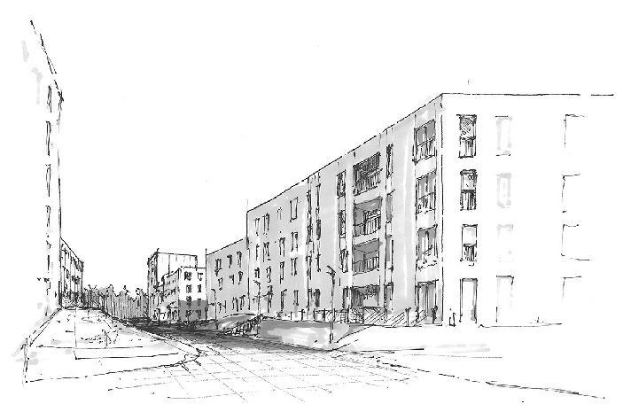
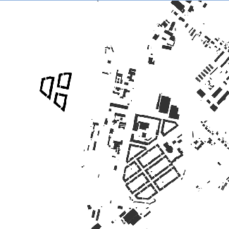
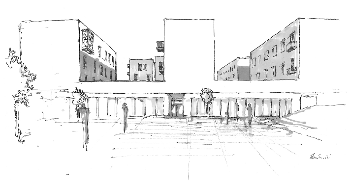
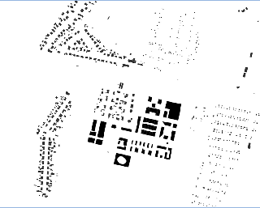
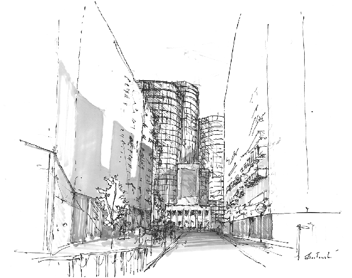
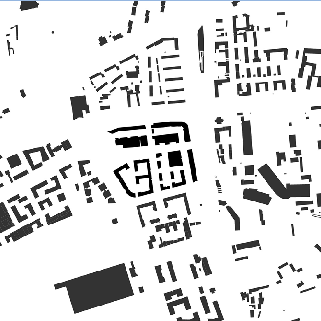

2(66) 2021 ISSN 2082‑0658 s. 51–82 studiabas.sejm.gov.pl 51

# Agata Twardoch Polityka mieszkaniowa w kontekście kształtowania ładu przestrzennego w Polsce. Poziom centralny, regionalny i lokalny

Housing policy in Poland versus spatial order: national, regional, and local levels

The aim of this paper is to analyse the current housing policy in Poland in terms of its influence on spatial order. The author discusses the relationship between housing policy and spatial order, as well as housing policy instruments that can contribute to shaping spatial order. The article presents the results of a quantitative study of documents and a qualitative study of selected housing complexes in Katowice, Warsaw and Wrocław treated as an outcome of the general state housing policy.

DOI https://doi.org/10.31268/StudiaBAS.2021.17 Słowa kluczowe polityka mieszkaniowa w Polsce, ład przestrzenny w Polsce, Narodowy

Program Mieszkaniowy, Katowice, Warszawa, Wrocław

Keywords housing policy in Poland, spatial order in Poland, National Housing

Programme, Katowice, Warsaw, Wrocław O autorce doktor hab. inż. arch., Katedra Urbanistyki i Planowania

Przestrzennego, Wydział Architektury, Politechnika Śląska •

Agata.Twardoch@polsl.pl • ORCID 0000‑0002‑9351‑6502

Artykuł został udostępniony na licencji Creative Commons – Uznanie Autorstwa 3.0 Polska (CC BY 3.0 PL).

Autorka dziękuje p. Joannie Golbie i p. Michałowi Mirosławskiemu za pomoc w przygotowaniu analizy wybranych osiedli.

## Wstęp

W Polsce polityka mieszkaniowa ma umocowanie w systemie prawnym1. Tworzenie warunków do zaspokajania potrzeb mieszkaniowych wspólnoty samorządowej należy do zadań własnych gminy2. Obowiązkiem tej jednostki samorządu terytorialnego (JST) jest także zapewnienie lokali socjalnych i zamiennych oraz zaspokajanie potrzeb mieszkaniowych gospodarstw domowych o niskich dochodach. Szczebel centralny powinien dostarczać narzędzi, które umożliwiają prowadzenie działań na poziomie lokalnym. Żeby można było mówić o polityce mieszkaniowej, nie musi być ona regulowana w odrębnym dokumencie, choć często takie kierunkowe druki

- 1 Por. Konstytucja Rzeczypospolitej Polskiej z dnia 2 kwietnia 1997 r. (Dz.U. nr 78, poz. 483, ze zm.); ustawa z dnia 8 marca 1990 r. o samorządzie terytorialnym (Dz.U. 2020, poz. 713, ze zm.); ustawa z dnia 27 marca 2003 r. o planowaniu przestrzennym (Dz.U. 2021, poz. 741, ze zm.).
- 2 Ustawa z dnia 21 czerwca 2001 r. o ochronie praw lokatorów, mieszkaniowym zasobie gminy i o zmianie Kodeksu cywilnego (Dz.U. 2020, poz. 611, ze zm.), dalej: ustawa o ochronie praw lokatorów.

są opracowywane. Od 2016 r. głównym dokumentem określającym politykę mieszkaniową w Polsce jest przyjęty uchwałą Rady Ministrów3 Narodowy Program Mieszkaniowy (NPM)4.

Polityka mieszkaniowa obejmuje działania władz różnych szczebli samorządności (centralnego, regionalnego i lokalnego) i jest częścią polityki społecznej. Nadrzędnym więc celem polityki mieszkaniowej jest rozwiązywanie problemu mieszkaniowego i zapewnienie bezpieczeństwa socjalnego. Ponieważ jest powiązana z pozostałymi gałęziami polityki społecznej oraz z polityką finansową i przestrzenną, ma także inne zadania – spójne z celami pozostałych polityk. Koordynacja polityki mieszkaniowej z innymi działaniami sektorowymi powinna prowadzić do zjawiska synergii. Artykuł traktuje o powiązaniach pomiędzy polityką mieszkaniową a polityką przestrzenną, a konkretnie – ładem przestrzennym, stanowiącym podstawę działań z zakresu polityki przestrzennej.

## Cel pracy, pytania badawcze

Celem artykułu jest przedstawienie związków pomiędzy polską polityką mieszkaniową a ładem przestrzennym. Ocenie zostały poddane założenia polityki mieszkaniowej sformułowane w Narodowym Programie Mieszkaniowym, narzędzia prowadzenia polityki mieszkaniowej charakterystyczne dla każdego z trzech szczebli administracji i efekty polityki mieszkaniowej – ewaluowane przez analizę wybranych inwestycji mieszkaniowych.

W pracy postawiono następujące pytania badawcze: Czy polityka mieszkaniowa jest powiązana z kwestią ładu przestrzennego? A jeśli tak, to w jaki sposób? Jakimi narzędziami do realizacji polityki mieszkaniowej w kontekście kształtowania ładu przestrzennego dysponują władze? Czy przy realizacji najnowszej zabudowy mieszkaniowej spełniono wymagania wynikające z definicji ładu przestrzennego? (pytanie pomocnicze: Czy stosowane narzędzia wymuszają zachowanie ładu przestrzennego?) Czy jest możliwe zastosowanie narzędzi, dzięki którym polityka mieszkaniowa będzie uwzględniała wymagania ładu przestrzennego?

## Metoda oceny powiązania polskiej polityki mieszkaniowej z kwestią ładu przestrzennego

###### Politykę mieszkaniową można oceniać przez pryzmat jej założeń (czyli celów deklaratywnych), przez sposób jej prowadzenia i przez efekty jej realizacji. Na potrzeby opracowania politykę mieszkaniową rozpatrywano pod względem jej wpływu na kształtowanie ładu przestrzennego

- 3 Uchwała nr 115/2016 Rady Ministrów z dnia 27 września 2016 r. w sprawie przyjęcia Narodowego Programu Mieszkaniowego (RM‑111‑119‑16), https://narodowyprogram.pl/wp‑content/uploads/2017/03/ uchwa%C5%82a_narodowy_program_mieszkaniowy.pdf [dostęp: 31 maja 2021 r.].
- 4 https://www.gov.pl/web/rozwoj‑praca‑technologia/polityka‑mieszkaniowa [dostęp: 27 maja 2021 r.].

###### zabudowy mieszkaniowej wraz z miernikami

|Wymagania wynikające z definicji ładu przestrzennego|Cechy zabudowy mieszkaniowej|Mierniki (przydatne przy ewaluacji zabudowy mieszkaniowej)|
|---|---|---|
|Wymagania funkcjonalne|lokalizacja|odległość do usług społecznych i komercyjnych|
| |parametry zabudowy i ich dopasowanie do strefy urbanizacyjnej|gęstość zabudowy|
| | |intensywność zabudowy (iloraz sumy powierzchni zabudowy na wszystkich kondygnacjach i powierzchni opracowania – pokazuje stopień intensywności zabudowy działki)|
| | |liczba mieszkań/ha|
| | |dopasowanie do otoczenia|
| | |struktura zabudowy|
| | |standard zabudowy|
| |skomunikowanie z centrum miasta/dzielnicy|komunikacja publiczna|
| | |komunikacja rowerowa|
| | |komunikacja piesza|
| | |komunikacja kołowa indywidualna|
| |dostęp do infrastruktury|dostęp do infrastruktury społecznej|
| | |dostęp do infrastruktury technicznej|
|Wymagania społeczno‑  ‑gospodarcze|zróżnicowanie funkcjonalne|różne funkcje w obrębie obiektu|
| | |różne funkcje w obrębie osiedla|
| |zróżnicowanie społeczne|mieszkania własnościowe|
| | |mieszkania na wynajem komercyjny|
| | |mieszkania na wynajem społeczny|
| | |mieszkania komunalne|
| | |uwzględnienie potrzeb osób starszych|
| | |uwzględnienie potrzeb osób z niepełnosprawnościami (OzN)|
|Wymagania środowiskowe|rozwiązania proekologiczne w zakresie architektury|właściwości przegród (ścian zewnętrznych, okien i drzwi oraz dachu)|
| | |sposób ogrzewania|
| | |usytuowanie względem stron świata|
| | |środowiskowe koszty wytworzenia materiałów budowlanych|
| | |środowiskowe koszty transportu materiałów budowlanych i budowy|
| | |środowiskowe koszty utylizacji materiałów budowlanych|
| |urbanistyczne rozwiązania prośrodowiskowe|lokalizacja na terenach uprzednio zainwestowanych* (brownfields)|
| | |bioretencja|
| | |naturalna ochrona przed wiatrem i nagrzewaniem|
| | |przewietrzanie|
| | |powierzchnie biologicznie czynne|
| | |liczba dużych drzew|
| | |poszanowanie stref ochrony przyrody i środowiska naturalnego|

zabudowy mieszkaniowej wraz z miernikami (cd.)

|Wymagania wynikające z definicji ładu przestrzennego|Cechy zabudowy mieszkaniowej|Mierniki (przydatne przy ewaluacji zabudowy mieszkaniowej)|
|---|---|---|
|Wymagania kulturowe|ochrona i konserwacja zabytków|ochrona obiektów zabytkowych|
| | |zachowanie historycznych układów urbanistycznych|
| |obiekty o funkcji kulturowej|dostęp do obiektów kultury|
| | |dostęp do obiektów sakralnych|
|Wymagania kompozycyjno-  -estetyczne|kontekst|poszanowanie kontekstu przestrzennego|
| |jakość projektu|sposób wyboru projektu – konkurs|
| | |udział architekta miejskiego|
| | |subiektywna ocena inwestycji|
| | |podstawa wykonania inwestycji|

* tereny niezielone, a zatem poprzemysłowe, polotniskowe, pokolejowe itp. Źródło: opracowanie własne.

w ramach ilościowej ewaluacji celów deklaratywnych i sposobu ich realizacji oraz jakościowej oceny jej efektów.

Ocenę założeń polityki mieszkaniowej sformułowano na podstawie analizy Narodowego Programu Mieszkaniowego (por. tabela 2), a ocenę sposobu realizacji wytycznych – w oparciu o analizę narzędzi, za pomocą których można spełniać poszczególne wymogi ładu przestrzennego (w podziale na poziom centralny, regionalny i lokalny; por. tabela 3). Na koniec przeprowadzono jakościową ewaluację efektów polskiej polityki mieszkaniowej i oceniono, w jakim stopniu spełniono wymagania ładu przestrzennego przy realizacji trzech wybranych osiedli mieszkaniowych (tabele 4–6).

W celu przeprowadzenia oceny polityki mieszkaniowej pod względem realizacji wymagań wynikających z definicji ładu przestrzennego poszczególne wymogi rozpisano na łatwe do oceny ilościowej cechy oraz mierniki pomocne przy ocenie jakościowej zespołów mieszkaniowych (por. tabela 1).

## Powiązania między ładem przestrzennym a polityką mieszkaniową

###### Polityka mieszkaniowa nie może być aprzestrzenna5. Ze względu na swoją specyfikę jest najbardziej umocowaną w przestrzeni, a przez to – najsilniej powiązaną z polityką przestrzenną gałęzią polityki społecznej. Jedną z zasad ogólnych – a zatem „założeń wyjętych przed nawias

5 T. Markowski et al., Raport w sprawie polityki mieszkaniowej państwa, „Studia KPZK” 2018, t. 185, s. 20.

wszystkiego, co jest wspólne i ważne dla całej gałęzi lub działu prawa”6 – określających politykę przestrzenną jest ład przestrzenny, który zgodnie z ustawą o planowaniu i zagospodarowaniu przestrzennym powinien stanowić podstawę działań związanych z przeznaczaniem terenów oraz ich zagospodarowaniem7. Z tego powodu ład przestrzenny powinien być także wyznacznikiem prowadzenia polityki mieszkaniowej. Zgodnie z tą samą ustawą „ład przestrzenny to takie ukształtowanie przestrzeni, które tworzy harmonijną całość oraz uwzględnia w uporządkowanych relacjach wszelkie uwarunkowania i wymagania funkcjonalne, społeczno-gospodarcze, środowiskowe, kulturowe oraz kompozycyjno-estetyczne”8. Ład przestrzenny jest zatem pojęciem, które mimo że dotyczy zagospodarowania przestrzennego, czyli de facto kwestii przestrzeni fizycznej, odnosi się także do zagadnień pozaprzestrzennych. Ograniczanie pojęcia ładu przestrzennego do zagadnień jedynie kompozycyjnych i estetycznych jest często popełnianym błędem. Takie zawężenie definicji ładu przestrzennego widać szczególnie w języku potocznym, ale także w debacie publicznej prowadzonej przez osoby niezwiązane bezpośrednio z urbanistyką i planowaniem przestrzennym. Wydaje się, że podobnie traktowane jest pojęcie ładu przestrzennego w NPM – temat ten został szerzej opisany w dalszej części tekstu.

Specjalista ds. systemu gospodarczego z Kancelarii Sejmu M. Gwiazdowicz wskazuje na bezpośredni związek pomiędzy ładem przestrzennym a zagadnieniami właściwymi polityce mieszkaniowej. Pisze, że „ład przestrzenny […] pozostaje elementem […] działań dwojakiego rodzaju: po pierwsze – wpływania na udostępnianie odpowiednich terenów inwestycyjnych, po drugie – określania zasad i wymogów właściwego przygotowania terenów pod zabudowę mieszkaniową”9. Zdaniem autorki niniejszej pracy te dwa zagadnienia może łączyć znacznie więcej – nie tylko wymagania techniczne i jakościowe związane z zabudową mieszkaniową i ustalane na poziomie centralnym (rozporządzenie o warunkach technicznych, jakie mają spełniać budynki i ich usytuowanie10, oraz normatywy urbanistyczne), lecz także zapisy prawa miejscowego, głównie miejscowe plany zagospodarowania przestrzennego (MPZP), oraz inne akty prawa miejscowego, np. uchwały krajobrazowe.

Ekonomista i urbanista T. Markowski w ocenie poprzedniej polityki mieszkaniowej podkreśla, że „właściwie prowadzona polityka mieszkaniowa może (poza zapewnianiem dostępności mieszkań dla ludności) rozwiązać wiele problemów przestrzennych, a w szczególności wspierać policentryczność w rozwoju sieci osadniczej”11. Zdanie to podziela także autorka.

- 6 M. Woźniak, Ład przestrzenny jako paradygmat zrównoważonego gospodarowania przestrzenią, „Białostockie Studia Prawnicze” 2015, z. 18, s. 167–182, https://doi.org/10.15290/bsp.2015.18.13.
- 7 Ustawa z dnia 27 marca 2003 r. o planowaniu i zagospodarowaniu przestrzennym (Dz.U. nr 80, poz. 717), art. 1.
- 8 Ibidem, art. 2.
- 9 M. Gwiazdowicz, Problemy gospodarki przestrzennej a rozwój budownictwa, „Studia BAS” 2007, nr 6 [Polityka mieszkaniowa, red. Ewa Karpowicz].
- 10 Rozporządzenie ministra infrastruktury z dnia 12 kwietnia 2002 r. w sprawie warunków technicznych, jakim powinny odpowiadać budynki i ich usytuowanie (Dz.U. nr 75, poz. 690, ze zm.).
- 11 T. Markowski et al., op. cit.

## Założenia polskiej polityki mieszkaniowej pod kątem realizacji założeń ładu przestrzennego

Od 2016 r. instrumenty służące do realizacji polityki mieszkaniowej są opisane w Narodowym Programie Mieszkaniowym12, dlatego do oceny sfery deklaratywnej polskiej polityki mieszkaniowej posłużono się tym dokumentem. W całym NPM znajdują się cztery bezpośrednie odwołania do ładu przestrzennego. Po raz pierwszy jest on wspominany w części poświęconej diagnozie mieszkaniowej, w ramach przywołania wniosków z diagnozy mieszkaniowej przyjętej przez Radę Ministrów w 2010 r. (s. 32). Druga wzmianka znajduje się w ostatnim z 16 wniosków aktualnej diagnozy, w punkcie poświęconym krytyce programu Mieszkanie dla Młodych (s. 48)13. Dwa odniesienia z czterech pojawiają się zatem w kontekście negatywnej oceny obecnej sytuacji mieszkaniowej. Kolejne odwołanie można odnaleźć w opisie priorytetowego działania A dotyczącego konieczności wprowadzenia zmian prawnych usprawniających proces planowania. Znalazł się tu zapis o „zapewnieniu zachowania ładu przestrzennego oraz walorów ekonomicznych przestrzeni i charakteru danych obszarów, w szczególności ze względu na ich walory krajobrazowe, kulturowe i przyrodnicze” (s. 55). Jeśli zgłębić ów zapis, to można dojść do wniosku, że autorzy dokumentu nie do końca zdają sobie sprawę z pojemności użytego pojęcia, uzupełniają je bowiem o „walory ekonomiczne”, mimo że te zawierają się przecież w jego spektrum znaczeniowym. Ponadto druga część zdania wskazuje, że ład przestrzenny rozumiany jest tu jako wartość głównie estetyczna (związana z walorami krajobrazu). Ostatnie odwołanie do ładu przestrzennego znajduje się w priorytecie rozwojowym E jako uzasadnienie postulatu opracowania i wdrożenia standardów dotyczących mieszkań budowanych w ramach społecznego budownictwa czynszowego (s. 68).

Analizę występowania samego określenia „ład przestrzenny” w głównym dokumencie traktującym o polityce mieszkaniowej należy uznać za niewystarczającą do wyciągnięcia wiążących wniosków. Z tego powodu w tabeli 2 zaprezentowano zawarte w NPM odniesienia do poszczególnych cech zabudowy związanych z wymaganiami wynikającymi z definicji ładu przestrzennego.

W Narodowym Programie Mieszkaniowym najczęściej pojawia się odwołanie do wymagań funkcjonalnych wynikających z definicji ładu przestrzennego. Pozostałe kategorie nie są przywoływane wprost lub są wspomniane w ograniczonym zakresie. Dla przykładu, wielokrotnie podkreślano kwestię efektywności energetycznej obiektów, ale w ogóle nie poruszono innych wymagań środowiskowych.

Nie wszystkie rozwiązania związane z ładem przestrzennym wpływają jednak na niego pozytywnie. W ramach odniesień do wymagań funkcjonalnych znajdują się postulaty: lokalizowania nowych mieszkań na terenach należących do Skarbu Państwa, ułatwień w odrolnianiu gruntów

- 12 Uchwała nr 115/2016…
- 13 „Polityka mieszkaniowa powinna być ściślej, niż to miało miejsce dotychczas, powiązana z polityką planistyczną, a interwencja publiczna na rynku mieszkaniowym powinna być rozpatrywana w kategorii wspierania ładu przestrzennego, zwłaszcza przez uwypuklenie walorów krajobrazu kulturowego i przyrodniczego NPM”.

###### a realizowaną w Polsce polityką mieszkaniową – ocena polityki na szczeblu centralnym

|Cechy zabudowy|Odniesienie w Narodowym Programie Mieszkaniowym| |
|---|---|---|
| | |Forma i miejsce odniesienia|
|Wymagania funkcjonalne| |(są odniesienia)|
|Lokalizacja|–|■ Jednym z narzędzi realizacji NPM jest program Mieszkanie Plus, którego celem jest realizacja nowych mieszkań na terenach należących do Skarbu Państwa (s. 51). Taki zapis należy uznać za szkodliwy z punktu widzenia zachowania ładu przestrzennego, gdyż uniezależnia decyzje lokalizacyjne od polityki przestrzennej gminy. Dodatkowo w priorytecie 4 (s. 53) postuluje się ułatwienia w zakresie odralniania gruntów należących do Skarbu Państwa, na których ma być realizowany program Mieszkanie Plus ■ W dokumencie zauważa się szkodliwość złej lokalizacji (o programie Mieszkanie dla Młodych napisano: „Adresowany do ludzi młodych program negatywnie mógł tym samym oddziaływać na jakość życia przez odcięcie od dostępu do funkcji miastotwórczych, a także utrudnienia w dostępie do infrastruktury społecznej czy komunikacji publicznej” (s. 48)) |
|Parametry zabudowy i ich dopasowanie do strefy urbanizacyjnej|0| |
|Skomunikowanie z centrum miasta/dzielnicy|+|■ Przy opisie programu „budowy dostępnych mieszkań na wynajem w ramach inwestycji prowadzonych na zasadach pilotażowych przez Bank Gospodarstwa Krajowego” (s. 64) wskazuje się, że „przy doborze nieruchomości preferowane będą lokalizacje umożliwiające osiągnięcie umiarkowanego kosztu gruntu oraz charakteryzujące się dobrym skomunikowaniem i dostępem do infrastruktury społecznej” (s. 66) ■ W części IV, w „Priorytetowych działaniach i instrumentach”, jako jedno z rozwiązań wymienia się „dążenie do lokalizacji inwestycji na terenach wyposażonych w niezbędną infrastrukturę techniczną i społeczną, zgodnie z prowadzoną przez gminę polityką przestrzenną” (s. 55). Osłabieniem wymowy tego punktu jest wskazanie na prowadzoną przez gminę politykę przestrzenną jako główny punkt odniesienia przy realizacji wspomnianego wymogu |
|Dostęp do infrastruktury|+| |
|Wymagania społeczno-gospodarcze| |(niewiele odniesień)|
|Zróżnicowanie funkcjonalne|0| |
|Zróżnicowanie społeczne|+/–|■ W tekście nie ma wzmianki o łączeniu i mieszaniu zabudowy o różnych formach własnościowych (mieszkań własnościowych, na wynajem, komunalnych, społecznych). Natomiast zarówno cel 1. (Zwiększenie dostępu do mieszkań dla osób o dochodach uniemożliwiających obecnie nabycie lub wynajęcie mieszkania na zasadach komercyjnych), jak i cel 2. (Zwiększenie możliwości zaspokojenia podstawowych potrzeb mieszkaniowych osób zagrożonych wykluczeniem społecznym ze względu na niskie dochody lub szczególnie trudną sytuację życiową) odnoszą się do zwiększenia podaży mieszkań z sektora lokali dostępnych (s. 49, 50). W całym dokumencie w różnych miejscach jako potrzebujące wsparcia wymieniane są mieszkania komunalne, o obniżonych czynszach, spółdzielcze (np. s. 53). W priorytecie 4. „Dobre prawo” wskazuje się na potrzebę wsparcia rynku najmu (s. 53)|

́ ́

̨ ̨

a realizowaną w Polsce polityką mieszkaniową – ocena polityki na szczeblu centralnym (cd.)

|Cechy zabudowy|Odniesienie w Narodowym Programie Mieszkaniowym| |
|---|---|---|
| | |Forma i miejsce odniesienia|
|Wymagania środowiskowe| |(odniesienia do efektywności energetycznej)|
|Rozwiązania proekologiczne w zakresie architektury|+/–|■ W wielu miejscach wspomina się o efektywności energetycznej, wielokrotnie w kontekście termomodernizacji (np. s. 45, 49); tego problemu dotyczy także jeden z celów priorytetowych („Cel 3. Poprawa warunków mieszkaniowych społeczeństwa, stanu technicznego zasobów mieszkaniowych oraz zwiększenie efektywności energetycznej” (s. 49)) ■ Postuluje się opracowanie i wdrożenie obowiązkowych standardów dotyczących mieszkań budowanych w ramach społecznego budownictwa czynszowego (s. 67) |
|Urbanistyczne rozwiązania prośrodowiskowe|0| |
|Wymagania kulturowe| |(niewiele odniesień)|
|Ochrona i konserwacja zabytków| |■ „Priorytet 3. Nowoczesne, efektywne energetycznie i bezpieczne technicznie mieszkania” (s. 53) wskazuje na potrzebę wspierania procesów rewitalizacji|
|Obiekty o funkcji kulturowej|0| |
|Wymagania kompozycyjno-estetyczne| |(niewiele odniesień)|
|Kontekst|+/–|■ Odniesienie do krajobrazu znalazło się w części dotyczącej diagnozy stanu istniejącego (analogicznie do dwóch pierwszych zastosowań określenia „ład przestrzenny” (s. 48 i 55))|
|Jakość projektu|0| |

(0) – nie ma odniesienia (+) – jest odniesienie wprost (+/–) – jest odniesienie nie wprost (–) – jest zapis o negatywnym wpływie na ład przestrzenny Źródło: opracowanie własne.

i ułatwień w procesie budowlanym. Takie podejście jest dla ładu przestrzennego szkodliwe. Wyłącza bowiem tereny mieszkaniowe z systemu planowania, który ma zapewnić, że nowa zabudowa będzie miała dostęp do koniecznej infrastruktury i że nie będzie powstawała ze szkodą dla istniejącej zabudowy i obecnych mieszkańców. Wynikiem wspomnianych zapisów była ustawa o ułatwieniach w przygotowaniu i realizacji inwestycji mieszkaniowych oraz inwestycji towarzyszących14, zgodnie z którą zabudowa mieszkaniowa może powstawać na terenach przeznaczonych w miejscowym planie zagospodarowania przestrzennego (MPZP) do innych celów, a w miastach powyżej 100 tys. może mieć wysokość do 14 kondygnacji niezależnie od zapisów planu.

- 14 Ustawa z dnia 5 lipca 2018 r. o ułatwieniach w przygotowaniu i realizacji inwestycji mieszkaniowych oraz inwestycji towarzyszących (Dz.U. 2020, poz. 219, ze zm.).

## Narzędzia polskiej polityki mieszkaniowej w kontekście możliwości kształtowania ładu przestrzennego – badania ilościowe

#### Poziom centralny

Narzędzia polityki mieszkaniowej dostępne na poziomie centralnym to te rozwiązania prawne, które dotyczą wszystkich terenów w państwie. Za dwa główne instrumenty, które spełniają to kryterium, a przy tym stanowią element zarówno polityki mieszkaniowej, jak i polityki przestrzennej, należy uznać prawo budowlane15 i rozporządzenie o warunkach technicznych, jakie powinny spełniać budynki i ich zagospodarowanie16, oraz ustawę o planowaniu i zagospodarowaniu przestrzennym. W pierwszym ustalono standardy, jakie powinny spełniać wszystkie budynki (także mieszkaniowe) i ich otoczenie w państwie, w drugim wprowadzono odniesienie do ładu przestrzennego i ogólne zasady lokalizowania nowej zabudowy w sposób zrównoważony (art. 1.4).

#### Poziom regionalny

Ekonomiści oceniają, że dysproporcje w rozwoju regionów w Polsce są duże17. Po pierwsze, nadal widoczny jest wyraźny podział na bardziej rozwiniętą zachodnią Polskę (Polska A) i mniej rozwiniętą wschodnią Polskę (Polska B). Po drugie, coraz bardziej uwidacznia się podział na duże i rosnące aglomeracje oraz kurczące się małe i peryferyjne ośrodki. Uwarunkowania społeczne oraz potrzeby i możliwości mieszkańców różnią się zatem nie tylko między regionami, lecz także w ramach regionów. O ile w kraju prowadzi się politykę regionalną, której celem jest zwiększanie konkurencyjności województw, o tyle w zakresie polityki mieszkaniowej nie są podejmowane żadne ukierunkowane działania. Polityka mieszkaniowa nie jest dostosowywana do województwa, co oznacza, że w ramach centralnej polityki mieszkaniowej są proponowane dokładnie takie same rozwiązania dla gwałtownie rozwijającej się Warszawy i dla tracącego mieszkańców Bytomia. Polityka mieszkaniowa nie jest także planowo koordynowana w ramach samych województw, bo nie wchodzi w zakres przewidzianych dla nich ustawowo zadań i kompetencji. Jeżeli w strategiach rozwoju województw pojawiają się zapisy dotyczące celów mieszkaniowych, to nie idą za nimi ani środki finansowe, ani narzędzia. Dla przykładu, w strategii rozwoju województwa śląskiego18 jako jeden z celów wskazano ochronę terenów otwartych przed suburbanizacją19, jednak województwo nie ma żadnych narzędzi, żeby wdrażać ten punkt strategii. Podobnie sprawa wygląda na poziomie powiatów, które nie mogą koordynować polityki osiedleńczej.

- 15 Ustawa z dnia 7 lipca 1994 r. – Prawo budowlane (Dz.U. 2020, poz. 1333, ze zm.).
- 16 Rozporządzenie Ministra Infrastruktury z dnia 12 kwietnia 2002 r. w sprawie warunków technicznych, jakim powinny odpowiadać budynki i ich usytuowanie (Dz.U. 2019, poz. 1065).
- 17 A. Wójtowicz, Zróżnicowanie rozwoju regionalnego w Polsce, „Zeszyty Naukowe Polskiego Towarzystwa Ekonomicznego w Zielonej Górze” 2016, nr 4, s. 302–211, https://doi.org/10.26366/PTE.ZG.2016.57.
- 18 Strategia rozwoju województwa śląskiego ŚLĄSKIE 2020+, Katowice 2013.
- 19 Ibidem, s. 57.

Jedyne narzędzia, które mogą być używane na szczeblu wojewódzkim, związane są z ochroną krajobrazu i ochroną przyrody. Zgodnie z ustawą o planowaniu i zagospodarowaniu przestrzennym województwa mają możliwość wskazywania granic parków kulturowych, narodowych, rezerwatów przyrody, parków krajobrazowych i obszarów chronionego krajobrazu, zatem do pewnego stopnia mogą chronić przed zabudową obszary cenne przyrodniczo. Drugie narzędzie obowiązuje od 2015 r., gdy weszła w życie nowelizacja ustawy o ochronie środowiska, dzięki której województwa mają prawo wprowadzać tzw. uchwały antysmogowe i określać konkretne wymagania dotyczące sposobu ogrzewania i niskiej emisji, które powinna spełniać zabudowa zlokalizowana na obszarze danej JST.

#### Poziom lokalny

Najwięcej narzędzi, które mogą być wykorzystane do kształtowania ładu przestrzennego w ramach polityki mieszkaniowej, mają do dyspozycji gminy, a najważniejszym instrumentem jest możliwość kształtowania prawa lokalnego obowiązującego na konkretnych obszarach. W tej kategorii kluczowe są miejscowe plany zagospodarowania przestrzennego20, zgodnie z którymi można ustalać lokalizację i większość parametrów zabudowy mieszkaniowej. Kwestie te jednak znacznie osłabiła ustawa o ułatwieniach w przygotowaniu i realizacji inwestycji mieszkaniowych oraz inwestycji towarzyszących, wprowadzona w 2018 r. w ramach NPM.

W kompetencjach gmin leżą także uchwały krajobrazowe, za pomocą których można regulować możliwości grodzenia zespołów mieszkaniowych21. Ważne narzędzie daje gminom ustawa o rewitalizacji22, zgodnie z którą w specjalnych strefach rewitalizacyjnych miasta mogą m.in. wchodzić w partnerstwa publiczno-prywatne oraz podejmować działania modernizacyjne. Na poziomie lokalnym ustala się również sposoby wspierania osób, które potrzebują pomocy w zaspokojeniu swoich potrzeb mieszkaniowych, oraz zasady przyznawania lokali komunalnych, socjalnych i społecznych, a także podejmuje się decyzje o ich budowie lub remoncie23. Wydaje się, że pomocniczym rozwiązaniem, zwiększającym różnorodność modeli mieszkaniowych, będzie także ustawa o kooperatywach mieszkaniowych24, jeżeli wejdzie w życie.

#### Zestawienie

###### W tabeli 3 zawarto zestawienie dostępnych narzędzi polskiej polityki mieszkaniowej w kontekście możliwości kształtowania ładu przestrzennego w podziale na trzy szczeble administracji. Najwięcej narzędzi mają do dyspozycji władze lokalne.

- 20 Ustalane na mocy ustawy o planowaniu i zagospodarowaniu przestrzennym (Dz.U. nr 80, poz. 717, ze zm.).
- 21 Uchwały krajobrazowe zostały wprowadzone ustawą z dnia 24 kwietnia 2015 r. o zmianie niektórych ustaw w związku ze wzmocnieniem narzędzi ochrony krajobrazu (Dz.U. 2015, poz. 774, 1688).
- 22 Ustawa z dnia 9 października 2015 r. o rewitalizacji (Dz.U. 2021, poz. 485).
- 23 Na podstawie ustawy o ochronie praw lokatorów.
- 24 Projekt ustawy o kooperatywach mieszkaniowych, https://legislacja.gov.pl/projekt/12332757/katalog/12680409#12680409 [dostęp: 20 marca 2021 r.].

###### Tabela 3. Narzędzia polskiej polityki mieszkaniowej w kontekście możliwości kształtowaniaładu przestrzennego

|Parametr – rozwinięcie wymagań określonych w definicji ładu przestrzennego|Narzędzia kształtowania ładu przestrzennego| | |
|---|---|---|---|
| |poziom centralny|poziom regionalny|poziom lokalny|
|Wymagania funkcjonalne| | | |
|lokalizacja|–|–|+|
|parametry zabudowy i ich dopasowanie do strefy urbanizacyjnej|+/–|–|+|
|skomunikowanie z centrum miasta/dzielnicy|–|–|+|
|Wymagania społeczno‑gospodarcze| | | |
|zróżnicowanie funkcjonalne|–|–|+/–|
|zróżnicowanie społeczne|–|–|+/–|
|Wymagania środowiskowe| | | |
|rozwiązania proekologiczne w zakresie architektury|+|+|+|
|urbanistyczne rozwiązania prośrodowiskowe|–|+|+|
|Wymagania kulturowe| | | |
|ochrona i konserwacja zabytków|–|–|+|
|obiekty o funkcji kulturowej|–|–|–|
|Wymagania kompozycyjno‑estetyczne| | | |
|kontekst|–|–|–|
|jakość projektu|–|–|+/–|

(+) – są dostępne (+/–) – są częściowo dostępne (–) – nie są dostępne Źródło: opracowanie własne.

## Analiza wybranych osiedli mieszkaniowych pod kątem realizacji założeń ładu przestrzennego – badania jakościowe

Wybrane osiedla mieszkaniowe zostały przeanalizowane w niniejszym opracowaniu jako efekt końcowy prowadzonej w państwie polityki mieszkaniowej. Wytypowano zarówno zabudowę całkowicie prywatną (deweloperską), jak i powstającą z udziałem jednostek publicznych. Uwzględnienie w badaniach nad polityką mieszkaniową zabudowy prywatnej jest uzasadnione, ponieważ w ramach polityki mieszkaniowej zapadają decyzje o lokalizacji zabudowy oraz o wymaganiach przestrzennych i technicznych, jakie muszą spełniać budynki oraz zagospodarowanie terenu. Dzieje się tak nawet wtedy, gdy wszystkie lub wybrane zagadnienia są nieuregulowane i celowo (lub nie) pozwala się na to, by działały na nie mechanizmy wolnego rynku – brak intencjonalnej polityki mieszkaniowej również jest rodzajem polityki mieszkaniowej.

Przykłady osiedli do oceny wybrano tak, by różniły się udziałem sektora publicznego w procesie planowania i budowy. Przeanalizowano zatem osiedle Nowy Nikiszowiec w Katowicach, w przypadku którego inwestorem były spółki z udziałem miasta (katowickie TBS) oraz Skarbu

Państwa (PFR Nieruchomości), osiedle Nowe Żerniki we Wrocławiu, które powstało w ramach współpracy publiczno-prywatnej (za projekt i planowanie byli odpowiedzialni przedstawiciele miasta Wrocławia oraz 40 pracowni wrocławskich architektów, za poszczególne realizacje odpowiadali prywatni deweloperzy, kooperatywy mieszkaniowe i TBS) oraz całkowicie prywatne warszawskie osiedle Bliska Wola.

#### Nowy Nikiszowiec w Katowicach. Osiedle realizowane w ramach programu Mieszkanie Plus

Koncepcja osiedla została wyłoniona w konkursie architektonicznym, a realizacja zwycięskiego projektu zdobyła już pierwsze nagrody. Kompleks mieszkaniowy budowany jest w ramach rządowego programu Mieszkanie Plus w katowickiej dzielnicy Nikiszowiec. Od początku wątpliwości budzi jednak lokalizacja osiedla w lesie, w znacznym oddaleniu od centrum miasta, bez dostępu do infrastruktury społecznej i usług.

Rysunek 1. Nowy Nikiszowiec, rys. M. Mirosławski

|2(66) 2021 studiabas.sejm.gov.pl| |
|---|---|
|Informacje wyjściowe| |
|Nazwa|osiedle Nowy Nikiszowiec|
|Adres|Katowice, ul. Górniczego Dorobku|
|Wielkość|netto: 5,5 ha; brutto: 7,5 ha*|
|Liczba mieszkań|513, z tego: 236 dwupokojowych, 197 trzypokojowych i 80 czteropokojowych|
|Liczba mieszkańców|między 900 a 1500|
|Rok projektu/budowy|2017/2018|
|Inwestor|BGK Nieruchomości SA|
|Klient|MDR Katowice sp. z o. o. (katowickie TBS / PFR Nieruchomości SA)|
|Architekt|22Architekci|
|Generalny wykonawca|IDS‑BUD SA|
|Powierzchnia całkowita|46 278 m2|
|Kubatura|147 633 m2|

* Wartość netto odnosi się do jednostki urbanistycznej (często działki), na której znajduje się dana zabudowa, wartość brutto to wartość netto plus infrastruktura uzupełniająca i drogi wewnętrzne.

### 63

###### Tabela 4. Ocena spełnienia wymagań wynikających z definicji ładu przestrzennego w nowychrealizacjach mieszkaniowych na przykładzie osiedla wybudowanego w ramach programuMieszkanie Plus – Nowy Nikiszowiec w Katowicach

|Cechy|Mierniki|Ocena|Opis/detale|
|---|---|---|---|
|Wymagania funkcjonalne| |raczej uwzględnione| |
|Lokalizacja|odległość do usług społecznych i komercyjnych|obecnie: – docelowo: +/–|obecnie: 500 m do najbliższej usługi (apteka), żłobek  – 1,7 km, przedszkole – 2,2 km, szkoła podstawowa – 2,1 km, kościół rzymskokatolicki – 2,2 km, sklep spożywczy – 1,6 km;   docelowo: w centralnym punkcie osiedla zaprojektowano plac z lokalami usługowymi na parterze|
| |lokalizacja na terenach uprzednio zainwestowanych|–|nie|
|Parametry zabudowy i ich  dopasowanie do strefy urbanizacyjnej|gęstość zabudowy|+|netto: 0,84; brutto: 0,62|
| |intensywność zabudowy|+|netto: 2,68; brutto: 1,97 (zgodnie z założeniami konkursu maksymalny wskaźnik – 1,2)|
| |liczba mieszkań/ha|+|48|
| |dopasowanie do otoczenia|+|nawiązania do sąsiadującego Nikiszowca, przewaga budynków 4‑kondygnacyjnych, nieliczne 8‑kondygnacyjne; zabudowa kwartałowa – 3 kwartały|

### 64

|studiabas.sejm.gov.pl 2(66) 2021  | | | |
|---|---|---|---|
| |struktura zabudowy|+/–|struktura naśladuje układ Nikiszowca, osiedle jest jednak zlokalizowane w całkowitym oderwaniu od istniejącej zabudowy  |
|Skomunikowanie z centrum miasta/dzielnicy|komunikacja publiczna|obecnie: – docelowo: +/–|obecnie: najbliższy przystanek 900 m, dojazd do rynku – ok. 35 min; w planach: nowy przystanek autobusowy przy osiedlu, z autobusem kursującym co ok. 20–30 min|
| |komunikacja rowerowa|+/–|rozwinięta infrastruktura rekreacyjna; podróż do centrum (ok. 7,3 km) trwa 26 min*|
| |komunikacja piesza|+/–|rozwinięta rekreacyjnie; osiedle Nowy Nikiszowiec jest otoczone lasem i ogródkami działkowymi; dojście do rynku: 5 km, 1 h*|
| |komunikacja kołowa indywidualna|+|dojazd do rynku: 8 km, 14 min;* 2 km od drogi krajowej nr 79, 6 km od autostrady A4 i drogi ekspresowej S86; w budowie: nowa droga dojazdowa do osiedla|
|Wymagania społeczno-gospodarcze| |słabo uwzględnione| |
|Zróżnicowanie  funkcjonalne|różne funkcje w obrębie obiektu|–|14 lokali usługowych na parterach budynków|
| |różne funkcje w obrębie osiedla|obecnie: – docelowo: +/–|na terenie po kopalni Wieczorek jest planowana budowa dzielnicy nowych technologii, w której mają się ulokować m.in. firmy z branży gier komputerowych|
|Zróżnicowanie społeczne|mieszkania własnościowe|–|wszystkie mieszkania będą wynajmowane na zasadach TBS – program Mieszkanie Plus|
| |mieszkania na wynajem komercyjny|–|jw.|
| |mieszkania na wynajem społeczny|+|jw.|
| |mieszkania komunalne|–|jw.|
| |uwzględnienie potrzeb osób starszych|+|program skierowany do rodzin, studentów i osób starszych|
| |uwzględnienie potrzeb osób z niepełnosprawnością (OzN)|+|część mieszkań przeznaczona dla OzN|

|2(66) 2021 studiabas.sejm.gov.pl| | | |
|---|---|---|---|
|Wymagania środowiskowe| |średnio uwzględnione| |
|Rozwiązania proekologiczne w zakresie architektury|właściwości przegród|+/–|zgodnie z rozporządzeniem o warunkach technicznych, jakim mają odpowiadać budynki i ich zagospodarowanie|
| |ogrzewanie|+|miejska sieć ciepłownicza|
| |usytuowanie względem stron świata|+/–|część mieszkań w zabudowie kwartałowej zazwyczaj jest gorzej doświetlona|
| |środowiskowe koszty wytworzenia materiałów budowlanych|+/–|budynki z żelbetowych prefabrykatów, które generują średnie koszty środowiskowe|
| |środowiskowe koszty transportu materiałów budowlanych i budowy|+|przy zastosowaniu prefabrykacji nie jest konieczny daleki transport|
| |środowiskowe koszty utylizacji materiałów budowlanych|–|budynki z żelbetowych prefabrykatów, które nie są łatwe w utylizacji|
| |zielone dachy|–|nie|
|Urbanistyczne rozwiązania prośrodowiskowe|bioretencja|–|odprowadzenie wód deszczowych do miejskiej sieci kanalizacji deszczowej|
| |naturalna ochrona przed wiatrem i nagrzewaniem|–|nie|
| |przewietrzanie|–|układy kwartałowe nie sprzyjają przewietrzaniu|
| |powierzchnia biologicznie czynna|+|zgodnie z założeniami min. 40%|
| |liczba dużych drzew|+/–|na terenie osiedla brak starych drzew, ale są nowe nasadzenia, niedaleko las|
| |poszanowanie stref ochrony przyrody i środowiska naturalnego|+|brak konfliktów|
|Wymagania kulturowe| |średnio uwzględnione| |
|Ochrona i konser-  wacja zabytków|ochrona obiektów zabytkowych|nd.|brak zabudowy historycznej|
| |zachowanie historycznych układów|nd.|brak historycznego układu|
|Obiekty o funkcji  kulturowej|dom kultury / biblioteka|–|najbliższa biblioteka – 1,3 km, ośrodek sportu (lodowisko) – 600 m, centrum dzielnicy ok. 700 m|
| |miejsce kultu|–|najbliższe miejsce kultu: 700 m – kościół rzymskokatolicki pw. św. Anny|
|Wymagania kompozycyjno-estetyczne| |uwzględnione| |
|Kontekst|poszanowanie kontekstu przestrzennego|+|architektura z założenia nawiązuje do architektury znajdującego się Nikiszowca; zachowano podobny układ i zbliżone materiały elewacyjne|

Rozwiązania proekologiczne w zakresie architekturyowe

### 65

### 66

|studiabas.sejm.gov.pl 2(66) 2021  | | | |
|---|---|---|---|
|Jakość projektu|sposób wyboru projektu|+|konkurs realizacyjny|
| |udział architekta miejskiego|–|nie|
| |subiektywna ocena inwestycji|+|nominacja do Mies van der Rohe Award 2022|
| |podstawa wykonania inwestycji|+|MPZP; w fazie konkursu: obszar opracowania obejmował teren w granicach przystąpienia do sporządzenia planu miejscowego|

Jakość projektu

(++) – wybitna (+) – pozytywna (+/–) – przeciętna (–) – negatywna

* Według www.google.maps.pl [dostęp: marzec 2021 r.]. Źródło: opracowanie J. Golby na podstawie: https://sztuka‑architektury.pl/article/13617/nowy‑nikiszowiec‑osiedle‑w‑relacji‑z‑przeszloscia, https://www.katowice.eu/dla‑mieszka%C5%84ca/aktualnosci?ItemID=4416&ListID=% 7B75169DCB‑89EF‑46CD‑A876‑165C1E838909%7D, https://katowice.mdr.pl/, https://ids‑bud.pl/?id=news&p=371, http://www.sarp.org.pl/pliki/2447_5979a251c005a‑nksz‑kn‑a‑opis.pdf, https://katowice.mdr.pl/ [dostęp: marzec 2021 r.) oraz badań i obserwacji A. Twardoch i J. Golby.

#### Nowe Żerniki we Wrocławiu. Osiedle realizowane w szerokim partnerstwie publiczno-prywatnym

Osiedle Nowe Żerniki powstaje od 2012 r., gdy wrocławskie Stowarzyszenie Architektów Polskich zorganizowało warsztaty architektoniczne w celu opracowania głównego planu modelowego osiedla. W proces włączył się architekt miejski Wrocławia. Cała inwestycja przebiega modelowo: najpierw powstał główny plan, następnie plan miejscowy i na jego podstawie wydzielono działki budowlane udostępniane deweloperom publicznym i prywatnym. Już na poziomie wstępnego planu przewidziano miejsce pod usługi i rekreację.

Rysunek 2. Nowe Żerniki, rys. M. Mirosławski

|2(66) 2021 studiabas.sejm.gov.pl| |
|---|---|
|Informacje wyjściowe| |
|Nazwa|Nowe Żerniki (WuWa2)|
|Adres|Wrocław, Nowe Żerniki, ul. Kosmonautów, al. Architektów|
|Wielkość|docelowa: 40 ha, obecnie: 7 ha|
|Liczba mieszkań|ok. 1500|
|Liczba mieszkańców|ok. 3000|
|Rok projektu/budowy|2010 – pomysł, 2013–2023 – planowane ramy realizacji|
|Inwestor|Wrocław – infrastruktura, deweloperzy – budynki|
|Architekt|Zbigniew Maćków + 40 wrocławskich pracowni projektowych|

### 67

###### Tabela 5. Ocena spełnienia wymagań wynikających z definicji ładu przestrzennego w nowych realizacjach mieszkaniowych na przykładzie osiedla Nowe Żerniki we Wrocławiu, wybudowanego w partnerstwie publiczno-prywatnym

|Punkt z definicji| |Ocena|Opis/detale|
|---|---|---|---|
|Wymagania funkcjonalne| |uwzględnione| |
|Lokalizacja|odległość do usług społecznych i komercyjnych|obecnie: +/– docelowo: +|podstawowe usługi, bazarek, żłobek, przedszkole, dom kultury i kościół są zaplanowane w obrębie osiedla (część w realizacji); szpital – 3 km, szkoła podstawowa – 2,1 km, apteka  – możliwa lokalizacja w ramach osiedla, obecnie: 2,5 km, poczta – 2 km, kawiarnie i restauracje – 2 km|
| |lokalizacja na terenach uprzednio zainwestowanych|–|nie|
|Parametry zabudowy i ich dopasowanie do strefy urbanizacyjnej|gęstość zabudowy|bd.|bd.|
| |intensywność zabudowy|+|od 0,5 do 2,7 (w zależności od zespołu), brak danych zbiorczych|
| |liczba mieszkań/ha|+|214|
| |dopasowanie do otoczenia|+/–|wysokość maks. 40 m; duże, zwarte osiedle powstało w otoczeniu zabudowy niskiej, jednorodzinnej; pozytywem jest to, że nowa dzielnica stanowi lokalne centrum także dla mieszkańców istniejącej zabudowy|
| |struktura zabudowy|+||

Par

### 68

|studiabas.sejm.gov.pl 2(66) 2021  | | | |
|---|---|---|---|
|Skomunikowanie z centrum  miasta/dzielnicy|komunikacja publiczna|obecnie: +/– docelowo: +|obecnie: tramwaj – 300 m, dojazd do rynku – 40 min*; docelowo: przystanek na terenie założenia  + lokalne autobusy elektryczne|
| |komunikacja rowerowa|+/–|w założeniu są ścieżki rowerowe, ale nie da się jeszcze nimi dotrzeć do centrum; dojazd do rynku – 10,6 km, 36 min*|
| |komunikacja piesza|+|w ramach osiedla bardzo rozwinięta; dojście do centrum – 10,2 km, 2 h 7 min*|
| |komunikacja kołowa indywidualna|+/–|dojazd do centrum – 10,3 km, 20 min; wewnątrz rozwinięta, jednak nie dominuje nad pieszą – część ciągów o ruchu uspokojonym|
|Wymagania społeczno-gospodarcze| |uwzględnione| |
|Zróżnicowanie  funkcjonalne|różne funkcje w obrębie obiektu|+/–|obiekty usługowe w parterach części budynków|
| |różne funkcje w obrębie osiedla|++|funkcje kultury, oświaty oraz kultu|
|Zróżnicowanie społeczne|mieszkania własnościowe|+| |
| |mieszkania na wynajem komercyjny|+| |
| |mieszkania na wynajem społeczny|+|obecnie jeden obiekt w systemie TBS|
| |mieszkania komunalne|–| |
| |uwzględnienie potrzeb osób starszych|+|układ przyjazny osobom starszym oraz OzN, jeden z budynków (TBS) przystosowano specjalnie dla seniorów i OzN oraz wzbogacono o odpowiednią infrastrukturę i zaplecze|
| |uwzględnienie potrzeb OzN|+|jw.|
|Wymagania środowiskowe| |raczej uwzględnione| |
|Rozwiązania proekologiczne w zakresie architektury|właściwości przegród|+/–|zgodnie z warunkami technicznymi, jakie powinny spełniać budynki oraz ich usytuowanie|
| |ogrzewanie|++|miejska sieć ciepłownicza + kolektory słoneczne i fotowoltaika|
| |usytuowanie względem stron świata|+/–|neutralne – w zależności od inwestycji układy są lepiej lub gorzej usytuowane względem stron świata, brak znaczących błędów|
| |środowiskowe koszty wytworzenia materiałów budowlanych|–|duże – większość budynków powstała z udziałem konstrukcji żelbetowych, które wymagają materiałów o wysokim stopniu przetworzenia|
| |środowiskowe koszty transportu materiałów budowlanych|+/–|konstrukcje żelbetowe są ciężkie, więc ich transport jest mniej ekologiczny, są jednak szeroko dostępne, więc nie wymagają transportu z daleka|
| |środowiskowe koszty utylizacji materiałów budowlanych|+/–|konstrukcje żelbetowe są trudne w utylizacji, jednak trwałe, więc mogą być długo eksploatowane|
| |zielone dachy|+/–|częściowo, brak wymogów w MPZP|
|Urbanistyczne rozwią-  zania prośrodowiskowe|bioretencja|+|w centrum zlokalizowany jest zbiornik retencyjny, woda deszczowa użytkowana jest jako „szara woda”|
| |naturalna ochrona przed wiatrem i nagrzewaniem|–| |
| |przewietrzanie|+/–| |

Skomunikowanie z centrum

miasta/dzielnicy Zróżnicowanie

funkcjonalne Urban

zania p

|2(66) 2021 studiabas.sejm.gov.pl| | | |
|---|---|---|---|
| |powierzchnia biologicznie czynna|+/–|w zależności od typu działek minimalna powierzchnia biologicznie czynna wynosi od 15% do 50%|
| |liczba dużych drzew|+/–|brak starodrzewu, lecz nowe drzewa zostały zasadzone już na wstępnym etapie przygotowania terenu|
| |poszanowanie stref ochrony przyrody i środowiska naturalnego|+|brak konfliktów ze strefami ochrony|
|Wymagania kulturowe| |docelowo uwzględnione| |
|Ochrona i konserwacja  zabytków|ochrona obiektów zabytkowych|+|w zapisie MPZP widnieje informacja o ustaleniu „Strefy ochrony konserwatorskiej zabytków archeologicznych na całym obszarze objętym planem”|
| |zachowanie historycznych układów urbanistycznych|+/–|otaczająca zabudowa to głównie zabudowa jednorodzinna o niskiej intensywności. W nowym zespole zabudowa jest znacznie wyższa, jednak obniża się w stronę zabudowy istniejącej, żeby zminimalizować konflikty przestrzenne|
|Obiekty o funk-  cji kulturowej|dostęp do obiektów kultury|obecnie: – docelowo: +|od samego początku w sercu planowany jest dom kultury. Obecnie rozstrzygnięto konkurs i w najbliższym czasie ma się rozpocząć jego budowa|
| |dostęp do obiektów sakralnych|obecnie: – docelowo: +|planowana jest budowa kościoła rzymskokatolickiego na kolejnym etapie budowy osiedla|
|Wymagania kompozycyjno-estetyczne| |uwzględnione| |
|Kontekst|poszanowanie kontekstu przestrzennego|+/–|zespół ma znacznie większą intensywność zabudowy niż zabudowa dookoła, jednak autorzy starali się zmniejszyć możliwe konflikty za pomocą kształtowania zabudowy|
|Jakość projektu|sposób wyboru projektu: konkurs|+|master plan powstawał w ramach warsztatów architektonicznych i konsultacji z mieszkańcami oraz ekspertami; pojedyncze inwestycje to w większości realizacje deweloperskie nieobejmujące konkursu, często jednak opierające się na propozycjach grup warsztatowych; w ramach konkursu wybrano projekt budynku TBS oraz domu kultury|
| |udział architekta miejskiego|+|w cały cykl warsztatowy był zaangażowany architekt miejski|
| |subiektywna ocena inwestycji|+|estetyczne osiedle, o prostym, czytelnym układzie; laureat pierwszej nagrody w konkursie „Życie w Architekturze” na najlepsze realizacje w Polsce powstałe w latach 2015–2019|
| |podstawa wykonania inwestycji|++|MPZP został przygotowany na podstawie specjalnie opracowanego dla osiedla master planu i uchwalony w 2012 r.|

Ochrona i konserwacja

zabytków o funk-

rowej

(++) – wybitna (+) – pozytywna (+/–) – przeciętna (–) – negatywna

* Według https://www.google.com/maps [dostęp: marzec 2021 r.]. Źródło: opracowanie M. Mirosławskiego na podstawie: P. Horn, Zrównoważony rozwój w procesie kształtowania współczesnego osiedla. Idee, przykłady, Oficyna Wydawnicza Politechniki Wrocławskiej, Wrocław 2019; A. Twardoch, Nowe Żerniki we Wrocławiu a Aspern Seestadt w Wiedniu. Czy wrocławska realizacja nadąża za europejskimi trendami urbanistycznymi?, „Studia KPZK” 2018, t. 187; uchwała nr XXXI/703/12 Rady Miejskiej Wrocławia z dnia 13 września 2012 r. w sprawie uchwalenia miejscowego planu zagospodarowania przestrzennego w rejonie północnego odcinka Trasy Targowej we Wrocławiu, http://nowezerniki.pl/ [dostęp: 27 maja 2021 r.].

### 69

70 studiabas.sejm.gov.pl 2(66) 2021

#### Bliska Wola w Warszawie. Osiedle deweloperskie

Bliska Wola jest nowym osiedlem deweloperskim w Warszawie. Od początku jego powstanie budzi kontrowersje – szczególnie ze względu na bardzo wysoką intensywność zabudowy.

Rysunek 3. Bliska Wola, rys. Michał Mirosławski

|Informacje wyjściowe| |
|---|---|
|Nazwa|Bliska Wola|
|Adres|Warszawa‑Wola, ul. Kasprzaka; al. Prymasa Tysiąclecia, ul. J. Ordona|
|Wielkość|ok. 9,5 ha|
|Liczba mieszkań|3998|
|Liczba mieszkańców|10 tys.|
|Daty|planowany koniec: 2021 r.|
|Inwestorzy|J.W. Construction|
|Architekci|Studio B.A.U.|

2(66) 2021 studiabas.sejm.gov.pl 71

###### Tabela 6. Ocena spełnienia wymagań wynikających z definicji ładu przestrzennego w nowych realizacjach mieszkaniowych na przykładzie osiedla Bliska Wola w Warszawie, wybudowanego przez inwestora prywatnego

|Punkt z definicji| |Ocena|Opis/detale|
|---|---|---|---|
|Wymagania funkcjonalne| |słabo uwzględnione| |
|Lokalizacja|odległość do usług społecznych i komercyjnych|+|przedszkole, sklepy spożywcze, kawiarnie – w ramach założenia, kościół rzymskokatolicki – 150 m, szpital – 2 km, dyskont spożywczy – 250 m|
|Parametry zabudowy i ich dopasowanie do strefy urbanizacyjnej|gęstość zabudowy|–|brak danych liczbowych, jednak ocena wizualna oraz docelowa gęstość zaludnienia wskazują, że budynki – szczególnie w północnej części – są zlokalizowane zbyt gęsto|
| |intensywność zabudowy|–|ogólnie wysoka, w nowej części zbyt wysoka, by zapewnić odpowiedni dystans społeczny i dostęp do terenów zieleni; od 2,5 do 8 w zależności od etapu inwestycji (8 dla fragmentu Bliska Wola Tower)|
| |liczba mieszkań/ha|–|420 (zbyt dużo)|
| |dopasowanie do otoczenia|+/–|od 6 do 27 pięter (najwyższy budynek ma 92 m wysokości – stanowi wyraźną dominantę w tej części miasta)|
| |struktura zabudowy|+||
|Skomunikowanie z centrum  miasta/dzielnicy|komunikacja publiczna|+/–|podpięta pod istniejącą komunikację publiczną rozwiniętą w tej części miasta – nie spowodowała zmian w rozkładach jazdy mimo znacznej liczby nowych mieszkańców|
| |komunikacja rowerowa|–|niewydzielona w ramach osiedla|
| |komunikacja piesza|–|chodniki wewnętrzne w kilku miejscach kończą się wraz z końcem działki i nie są połączone z ciągami miejskimi|
| |komunikacja kołowa indywidualna|+/–|dwie nowe ulice, parkingi podziemne, miejscami brak połączeń między drogami wewnętrznymi a miejską siatką ulic|

Lokalizacja

### 72

|studiabas.sejm.gov.pl 2(66) 2021  | | | |
|---|---|---|---|
|Wymagania społeczno-gospodarcze| |Uwzględnione wymagania gospodarcze / nieuwzględnione społeczne| |
|Zróżnicowanie  funkcjonalne|różne funkcje w obrębie obiektu|+/–|w części parterów lokale usługowe|
| |różne funkcje w obrębie osiedla|+/–|na terenie osiedla znajduje się niepubliczne przedszkole|
|Zróżnicowanie społeczne|mieszkania własnościowe|+| |
| |mieszkania na wynajem komercyjny|+| |
| |mieszkania na wynajem społeczny|–|nie|
| |mieszkania komunalne|–|nie|
| |uwzględnienie potrzeb osób starszych|–|przytłaczająca skala, wysokie krawężniki, niewiele zieleni|
| |uwzględnienie potrzeb osób niepełnosprawnych|–|jedyne rozwiązania to te wymagane prawem budowlanym|
|Wymagania środowiskowe| |słabo uwzględnione| |
|Rozwiązania proekologiczne w zakresie architektury|właściwości przegród|+/–|zgodnie z warunkami technicznymi, jakie powinny spełniać budynki oraz ich usytuowanie|
| |ogrzewanie|+|ogrzewanie miejskie|
| |usytuowanie względem stron świata|–|kierunki świata niebrane pod uwagę przy projektowaniu inwestycji, część mieszkań – szczególnie w dolnych partiach – niedoświetlona|
| |środowiskowe koszty wytworzenia materiałów budowlanych|–|masywne obiekty żelbetowe, bez rozwiązań zmniejszających wpływ na środowisko|
| |środowiskowe koszty transportu materiałów budowlanych i budowy|+/–|materiał trudny w transporcie, jednak szeroko dostępny|
| |środowiskowe koszty utylizacji materiałów budowlanych|–|bardzo wysokie koszty środowiskowe ewentualnej utylizacji|
| |zielone dachy|+/–|w części, niewpisane do MPZP|
|Urbanistyczne rozwiązania prośrodowiskowe|lokalizacja na terenach uprzednio zainwestowanych|+|obszar opracowania to tereny Państwowej Fabryki Karabinów (zniszczonej w 1944 r.), a później Fabryki Wyrobów Precyzyjnych im. gen. Karola Świerczewskiego i spółki VIS – częściowo wyburzonych ok. 2010 r.|
| |bioretencja|–| |
| |naturalna ochrona przed wiatrem i nagrzewaniem|–|brak, szczególnie wyraźne w przypadku kompleksu Bliska Wola Tower|
| |przewietrzanie|–|układ budynków znacznie utrudnia nie tylko przewietrzanie, lecz także nasłonecznienie|
| |powierzchnia biologicznie czynna|–|niewielka: minimalna – 20% dla usług i 25% dla mieszkań|
| |liczba dużych drzew|–|niewiele, przeważa zieleń niska i średniowysoka|
| |poszanowanie stref ochrony przyrody i środowiska naturalnego|+|brak konfliktów|

Zróżnicowanie

funkcjonalne Zróżnicowanie społeczne

|2(66) 2021 studiabas.sejm.gov.pl| | | |
|---|---|---|---|
|Wymagania kulturowe| |nieuwzględnione| |
|Ochrona i konser-  wacja zabytków|ochrona obiektów zabytkowych|–|inwestycja została zlokalizowana na terenie wyburzonej fabryki, a jedyny zachowany obiekt to zabytkowa wieża ciśnień, obecnie zdominowana przez nową zabudowę|
| |zachowanie historycznych układów urbanistycznych|–|nie|
|Obiekty o funkcji  kulturowej|dostęp do obiektów kultury|–|brak obiektów tego typu na terenie zespołu, niedaleko znajduje się biblioteka|
| |dostęp do obiektów sakralnych|–|brak obiektów tego typu na terenie zespołu, niedaleko znajduje się kościół rzymskokatolicki|
|Wymagania kompozycyjno-estetyczne| |nieuwzględnione| |
|Kontekst|poszanowanie kontekstu przestrzennego|–|zabudowa zbyt intensywna|
|Jakość|sposób wyboru projektu: konkurs|–|nie|
| |udział architekta miejskiego|–|nie|
| |subiektywna ocena inwestycji|–|zespół o zbytniej intensywności, o monotonnej architekturze (szczególnie w pobliżu ul. Kasprzaka), wykończony surowymi materiałami, wielokrotnie krytykowany w prasie branżowej i codziennej|
| |podstawa wykonania inwestycji|+|MPZP (plan budzi jednak spore kontrowersje w środowisku urbanistów)|

Ochrona i konser-

wacja zabytków Obiekty o funkcji

kulturowej Kontekst

(++) – wybitna (+) – pozytywna (+/–) – przeciętna (–) – negatywna Źródło: opracowanie M. Mirosławskiego na podstawie: uchwały nr XXXIX/1011/2012 Rady Miasta Stołecznego Warszawy z dnia 5 lipca 2012 r. w sprawie miejskiego planu zagospodarowania przestrzennego rejonu Czyste – rejon ulicy Prądzyńskiego (tekst ujednolicony, zmiany wprowadzone uchwałą nr XXXVIII/971/2016, sprzed rozstrzygnięcia nadzorczego), https://jwc.pl/lp/bliskawolatower/?utm_ source=OAN&utm_medium=Search&utm_campaign=BWT&gclid=Cj0KCQjwl9GCBhDvARIsAFunhsmjE5B 61qh6dsT‑JgOCaZrF6FxCHyW8uaDMw_QFeUB88PhMSnyyArsaAn_MEALw_wcB, https://noizz.pl/design/ porownalismy‑warszawski‑hong‑kong‑z‑prawdziwym‑osiedle‑wywolalo‑spor/py6jh27, https://natemat. pl/327661,osiedle‑bliska‑wola‑jw‑construction‑czyli‑warszawski‑koszmar‑na‑jawie, https://rynekpierwotny.pl/ oferty/jw‑construction‑holding‑sa/bliska‑wola‑tower‑warszawa‑wola‑odolany‑8363/ [dostęp: 20 marca 2021 r.].

### 73

Ocena trzech inwestycji z perspektywy realizacji założeń ładu przestrzennego za pomocą narzędzi polityki mieszkaniowej wskazuje, że polska polityka mieszkaniowa nie gwarantuje zachowania ładu przestrzennego. Najlepiej pod względem spełnienia jego założeń wypadło osiedle Nowe Żerniki, które powstawało w modelowy sposób, a zatem – z wykorzystaniem wszystkich dostępnych narzędzi właśnie w celu osiągnięcia takiego efektu. Najgorzej należy ocenić osiedle Bliska Wola – przy jego realizacji nie brano pod uwagę wytycznych ładu miejscowego, a obowiązujące prawo nie zagwarantowało realizacji tych założeń.

## Potencjał polityki mieszkaniowej w kwestii kształtowania ładu przestrzennego

#### Wymagania funkcjonalne

Najważniejszym zagadnieniem ze styku polityki mieszkaniowej i przestrzennej oraz z grupy wymagań funkcjonalnych jest bez wątpienia kwestia lokalizacji mieszkań. Z umiejscowieniem kompleksów mieszkaniowych wiąże się wiele problemów o charakterze zarówno urbanistycznym (rozlewanie się zabudowy, nieefektywność infrastruktury), jak i społecznym (pustoszenie śródmieść) oraz środowiskowym, na które od dawna zwracają uwagę architekci i urbaniści25. Gdy uwzględnimy kryzys klimatyczny i postępującą depopulację Polski, przeznaczanie nowych, dotychczas niezagospodarowanych obszarów (greenfields) pod zabudowę okazuje się bezcelowe. Tymczasem polityka mieszkaniowa prowadzona na wszystkich szczeblach jest ukierunkowana na wprowadzanie ułatwień lokalizacyjnych dla nowej zabudowy mieszkaniowej. Z jednej strony bowiem władzom lokalnym trudno jest się wycofać z ekstensywnych planów miejscowych przygotowywanych zgodnie z poprzednim (ilościowym) paradygmatem rozwoju, ponieważ takie decyzje byłyby dla gmin kosztowne i niepopularne, z drugiej strony zgodnie z założeniami NPM w 2018 r. wprowadzono ustawę o ułatwieniach w przygotowaniu i realizacji inwestycji mieszkaniowych oraz inwestycji towarzyszących, która jeszcze bardziej osłabiła funkcję regulującą planów miejscowych.

Polityka ograniczania rozlewania się zabudowy poza obszary miejskie jest prowadzona z sukcesem w różnych państwach. W Wielkiej Brytanii, ale także w wybranych stanach USA (np. w Oregonie26), Szwajcarii27 i Australii28, stosowane są tzw. urban growth boundaries (UGBs)29, czyli linie nieprzekraczalnej granicy zabudowy30 dookoła obszarów zurbanizowanych. Często znaczenie funkcjonalne UGBs wzmacniane jest pasami zieleni otaczającymi obszary zurbanizowane, całkowicie wyłączonymi z możliwości zabudowy (np. green belt w Wielkiej Brytanii, ceinture verte we Francji). Podobnym pomysłem był także leśny pas ochronny wokół Górnośląskiego Okręgu Przemysłowego wprowadzony w 1968 r. uchwałą Komitetu Ekonomicznego Rady Ministrów – niestety z biegiem lat stopniowo znoszono zakaz jego zabudowy. W wielu państwach są wprowadzane limity dla nowej zabudowy na obszarach niezurbanizowanych. Próg dla całej

- 25 Por. np. A. Ogrodowczyk, Polityka przestrzenna a rozwój budownictwa mieszkaniowego po 1990 roku na przykładzie małych miast w województwie łódzkim, „Acta Universitatis Lodziensis. Folia Geographica Socio‑Oeconomica” 2011, nr 11, s. 167–186.
- 26 https://www.oregonmetro.gov/sites/default/files/2020/02/24/UGBCurrent.pdf [dostęp: 9 kwietnia 2021 r.].
- 27 M.P. Gennaio, A.M. Hersperger, M. Bürgi, Containing Urban Sprawl: Evaluating Effectiveness of Urban Growth Boundaries Set by the Swiss Land Use Plan, „Land Use Policy” 2009, t. 26, nr 2, s. 224–232, https://doi. org/10.1016/j.landusepol.2008.02.010.
- 28 https://vpa.vic.gov.au/greenfield/more‑information/urban‑growth‑boundary‑key‑facts/ [dostęp: 27 maja 2021 r.].
- 29 Pierwszym UGB był green belt dookoła Londynu utworzony w 1935 r. w celu zatrzymania rozlewania się metropolii.
- 30 Por. P. Nowak, Eksurbanizacja współczesnych miast, „Studia Miejskie”, t. 20, s. 138.

Wielkiej Brytanii to 40%31, co oznacza, że tylko 40% zabudowy może być lokalizowane na terenach niezagospodarowanych, jednak w niektórych miastach ustalono tę granicę na niższym poziomie. W Niemczech zgodnie z planem 30-ha-Ziel wykorzystanie greenfields obniżono ze 130 ha dziennie w 2001 r. do 30 ha dziennie w roku 202032.

Do ograniczania obszaru zabudowy są wykorzystywane także narzędzia planowania regionalnego. Niemieckie miasta koordynują rozwój w ramach Regional Flächennutzungsplan33, czyli regionalnych planów użytkowania terenu, zastępujących plany dla poszczególnych miast i stanowiących prawo miejscowe. Gminy muszą zatem ustalać między sobą rzeczywiste zapotrzebowanie na nowe obszary inwestycyjne. Decyzje o przeznaczeniu nowych miejsc pod zabudowę są podejmowane dopiero wtedy, gdy koszty infrastrukturalne mogą zostać pokryte z uzyskanych podatków – tereny są więc uwalniane stopniowo, zgodnie z bieżącym zapotrzebowaniem.

Aby ograniczyć rozlewanie się miast, władze decydują się na wprowadzanie zachęt do budowania nowych obiektów na obszarach zurbanizowanych oraz do adaptacji już istniejącej zabudowy, a także wprowadzają wiele rozwiązań ułatwiających wspomniane inwestycje. Działaniom zmierzającym do wykorzystania istniejących zasobów często stoją na przeszkodzie niezagospodarowane lub niezamieszkane (celowo lub w wyniku sytuacji losowych) działki i mieszkania. Polskie władze lokalne właściwie nie dysponują narzędziami, za pomocą których mogłyby usunąć tego typu przeszkody, na dłuższą metę bardzo szkodliwe dla miasta. W Wielkiej Brytanii po upływie określonego czasu podnosi się podatek w przypadku nieużytkowanych nieruchomości do pełnej jego wysokości (anuluje się ulgi związane z niezarobkowaniem). W Waszyngtonie miasto poszło o krok dalej i ustaliło podatki od mieszkań nieużytkowanych na poziomie kilkukrotnie wyższym niż dla mieszkań zamieszkanych34. W Holandii, zgodnie z ustawą z 2000 r., gminy mogą wymuszać na właścicielach pustostanów (gdy stoją puste dłużej niż 3 miesiące) zarejestrowanie ich w bazie lokali komunalnych. Przedstawiciel miasta może wyznaczyć właścicielowi najemcę, przy czym właściciel jest zobowiązany do zaoferowania umowy na określonych przez miasto warunkach35. We Francji miasta mają możliwość przejęcia nieruchomości będących w posiadaniu osób prawnych i nieużytkowanych przez czas dłuższy niż 12 miesięcy i przekształcenia ich w mieszkania komunalne oraz przeznaczone do zakwaterowania w sytuacjach nadzwyczajnych36. Austria wprowadziła także regulację, zgodnie z którą zwlekającego z budową właściciela terenu można zobligować do postawienia planowanego budynku w określonym czasie37.

W kontekście wymagań funkcjonalnych ładu przestrzennego warto zwrócić uwagę na normatywy (standardy) urbanistyczne, o których wprowadzenie cyklicznie apeluje środowisko

- 31 Według Planning Policy Statement 3, Communities and Local Government, London 2011, https://www.housinglin.org.uk/_assets/Resources/Housing/Policy_documents/PPS3.pdf [dostęp: 27 maja 2021 r.].
- 32 Mehr Wert für die Fläche: Das „Ziel-30-ha” für die Nachhaltigkeit in Stadt und Land, Rat für Nachhaltige Entwicklung, Berlin 2004, https://www.nachhaltigkeitsrat.de/wp‑content/uploads/2017/11/Broschuere_Flaechenempfehlung_02.pdf [dostęp: 27 maja 2021 r.].
- 33 Pierwszy taki plan został uchwalony dla Zagłębia Ruhry w 2010 r., drugi – dla regionu Frankfurt Rhein‑Main.
- 34 L. Polyák, Wokół własności, „Autoportret” 2017, nr 58(3), s. 51.
- 35 Ibidem.
- 36 Ibidem, s. 52.
- 37 https://www.wohnnet.at/bauen/bauvorbereitung/baurecht‑15244 [dostęp: 9 kwietnia 2021 r.].

architektów i urbanistów38. Obecnie w niektórych miastach takie standardy są zamieszczane w studiach uwarunkowań i kierunków zagospodarowania przestrzennego, ale te dokumenty nie stanowią prawa miejscowego. Zgodnie z ustawą o ułatwieniach w przygotowaniu i realizacji inwestycji mieszkaniowych gminy mają możliwość uchwalania standardów urbanistycznych, ale jedynie tych, które dotyczą podstawowych kwestii, takich jak odległości do szkoły, do przystanku i do terenów zieleni, oraz zabudowy powstającej zgodnie z tą ustawą, czyli poza regulacjami planów miejscowych.

Standardy mogłyby być wprowadzone na każdym z trzech szczebli administracyjnych, choć najważniejszy jest poziom regionalny lub lokalny, gdyż wówczas normatywy mogą być dostosowane do charakteru miejsca. Istotne jest także, żeby wymogi mogły być realizowane przez inwestorów prywatnych lub od nich egzekwowane. W Londynie nowej zabudowie musi towarzyszyć niezbędna infrastruktura społeczna (szkoły, przedszkola, miejsce spotkań lokalnej społeczności), której budowa powinna być sfinansowana z odpowiedniego podatku od nowych inwestycji39.

W większości dużych miast europejskich dba się o to, żeby aglomeracja rozwijała się przede wszystkim wewnętrznie. W Berlinie w strategii StEP Wohnen są wskazane różne narzędzia, które mają wspierać wewnętrzny rozwój miasta. Na przykład dzięki Innenentwicklungsmaßnahme miasto dokonuje inwentaryzacji wszystkich niezagospodarowanych, nie całkiem zagospodarowanych lub niewłaściwie zagospodarowanych terenów i dąży do ich przeznaczenia do celów mieszkaniowych lub na miejsca pracy. Podstawą działania mają być negocjacje z właścicielami i nakłanianie ich do zabudowy działki, jeżeli jednak właściciel nie współpracuje lub nie realizuje wyznaczonego zadania, wówczas miasto ma prawo wywłaszczyć teren i zabudować go zgodnie z interesem publicznym40.

#### Wymagania społeczno-gospodarcze

O ile wymagania gospodarcze w pewnym stopniu są regulowane w ramach działania wolnego rynku, o tyle wymagania społeczne wymagają regulacji odgórnych. Najważniejsze w tym kontekście jest doprowadzenie do zrównoważenia społecznego w ramach wszystkich jednostek osadniczych, czyli do zlokalizowania mieszkań o różnych formach własnościowych (własnościowych, wynajmowanych, komunalnych i społecznych) w ramach jednej jednostki osadniczej. Taki miks można osiągnąć w ramach integracji, a zatem całkowitego wymieszania, segmentacji (podziału na klatki lub piętra) oraz segregacji, czyli podziału na osobne budynki w ramach tej

- 38 G. Dąbrowska‑Milewska, Standardy urbanistyczne dla terenów mieszkaniowych. Wybrane zagadnienia, „Architecturae et Artibus” 2010, t. 10, nr 2, s. 17–31.
- 39 The London Plan: The Spatial Development Strategy For London Consolidated With Alterations Since 2011, Greater London Authority, March 2016, https://www.london.gov.uk/sites/default/files/the_london_plan_2016_ jan_2017_fix.pdf [dostęp: 27 maja 2021 r.].
- 40 Stadtentwicklungsplan Wohnen 2030. Neue Wohnungen für Berlin, Berlin 2020, s. 85, https://www.stadtentwicklung.berlin.de/planen/stadtentwicklungsplanung/de/wohnen/download/StEPWohnen2030‑Langfassung.pdf [dostęp: 27 maja 2021 r.].

samej inwestycji lub kwartału41. Rozwiązania zmierzające do uzyskania takiego zrównoważenia są stosowane w wielu państwach i wprowadzane na różnych poziomach. Przykładowo we Francji od 2007 r. na poziomie centralnym obowiązuje DALO (droit au logement opposable) – prawo, zgodnie z którym w każdej gminie musi być co najmniej 20% mieszkań z sektora mieszkań dostępnych. Następnie na poziomie gminy uregulowane są kwestie tzw. prowizji mieszkaniowych, czyli liczby mieszkań z sektora dostępnego, ustalonej dla każdej (także prywatnej) inwestycji. W Paryżu odsetek ten wynosi między 20% a 30% (na obszarach, gdzie jest wyjątkowo niewiele zabudowy dostępnej) dla każdej inwestycji powyżej 800 m2. Oznacza to, że każdy paryski deweloper co najmniej 20% lokali z każdej swojej inwestycji musi przekazać do puli mieszkań dostępnych42. Podobne rozwiązania wprowadzają w swoim prawie lokalnym Kopenhaga43 (20% mieszkań dostępnych) i Berlin44 (50%). Wiedeń wymaga, żeby przeznaczać co najmniej dwie trzecie lokali z każdej inwestycji mieszkaniowej na potrzeby mieszkalnictwa dostępnego45. Rozbieżności wynikają z systemów mieszkaniowych obowiązujących w każdym z państw – tj. odsetka mieszkańców, którzy kwalifikują się do otrzymania pomocy mieszkaniowej (w Berlinie i Wiedniu z takiej formy wsparcia korzysta ok. 50% mieszkańców).

#### Wymagania środowiskowe

Wymagania środowiskowe należą do najbardziej uniwersalnych, a więc powinny dotyczyć wszystkich budynków niezależnie od ich lokalizacji. W obowiązującej polityce mieszkaniowej wiele uwagi poświęcono kwestiom przegród budowlanych i niskiej emisji, zaniedbano jednak inne wątki. Jeżeli chodzi o wymagania dotyczące budynków, to brakuje uregulowań związanych z rodzajem materiału budowlanego, jego śladem węglowym czy możliwością recyklingu. Najwięcej zaniedbań zauważono jednak w obszarze rozwiązań urbanistycznych. W prawodawstwie pominięto kwestie naturalnej retencji, ograniczania komunikacji indywidualnej (która znacznie zwiększa ślad węglowy zabudowy rozproszonej w stosunku do tej zwartej), rozproszenia zabudowy czy liczby drzew w inwestycji.

Dla przykładu w Paryżu władze lokalne dążą do podnoszenia intensywności zaludnienia właśnie po to, by mieszkania powstawały w miejscach, gdzie jest dobry dostęp do komunikacji publicznej i można ograniczać transport indywidualny. Jednocześnie są podejmowane działania mające na celu ułatwienie poruszania się pieszo lub rowerem. Do 2030 r. plany miejscowe tere-

- 41 E. Sautkina, L. Bond, A. Kearns, Mixed Evidence on Mixed Tenure Effects: Findings from a Systematic Review of UK Studies, 1995–2009, „Housing Studies” 2012, t. 27, nr 6, s. 748–782, https://doi.org/10.1080/02673037.2 012.714461.
- 42 Plan Local d’Urbanisme PLU. Rapport de présentation du PLU modifié, http://pluenligne.paris.fr/plu/sites‑plu/ site_statique_43/documents/910_Plan_Local_d_Urbanisme_de_P/911_Rapport_de_presentation/912_Rapports_de_presentation_de/C_RP_MG2016_T1‑V01.pdf [dostęp: 27 maja 2021 r.]. Progi będą rosnąć z biegiem lat – tj. do 2025 r. ma to być co najmniej 25% mieszkań, a do 2030 r. – 30%.
- 43 Kommuneplan 15, Københavns Kommune, https://kp15.kk.dk/ [dostęp: 27 maja 2021 r.].
- 44 Stadtentwicklungsplan…, s. 38.
- 45 Wiener Bauordnung. Update Wiener Bauordnung, Wirtschaftskammer Wien, https://www.wko.at/branchen/w/ gewerbe‑handwerk/bau/MA‑37_Bauordnung‑Novelle_weiss_1.pdf [dostęp: 27 maja 2021 r.].

nów zurbanizowanych mają dopuszczać minimum 10-procentowy wzrost gęstości zaludnienia i intensywności zabudowy, a w przypadku obszarów zlokalizowanych blisko stacji kolejowych lub stacji metra wzrost ten musi wynieść 15%46. Wprowadzane są także konkretne zmiany systemu parkingowego zgodnie z zasadą: „mniej miejsc, więcej opłat”. Limity parkingowe zostały ustalone tylko dla obiektów biurowych. W przypadku mieszkań nie opracowano żadnych wytycznych, co znaczy, że budowanym lokalom mieszkaniowym nie są przypisane miejsca postojowe. Mieszkaniom muszą za to towarzyszyć parkingi rowerowe47.

#### Wymagania kulturowe

Regulacja wymagań kulturowych powinna się odbywać na poziomie lokalnym, gdyż jest to problematyka właściwa danemu miejscu. Wydaje się, że w tej materii obowiązujące rozwiązania są stosunkowo satysfakcjonujące. Problemem pozostają sprawczość konserwatorów miejskich i ograniczona skuteczność narzędzi, którymi dysponują, służących do przeciwdziałania łamaniu prawa w kwestii ochrony zabytków. Sfera kulturowa to ponadto wiele dylematów tożsamościowych i innych delikatnych kwestii, które powinny być przedmiotem odrębnego opracowania.

#### Wymagania kompozycyjno-estetyczne

Na spełnienie wymagań kompozycyjno-estetycznych bardzo duży wpływ mają proces przedprojektowy i przygotowanie inwestycji. Jak pokazały przeanalizowane wcześniej przykłady osiedli, najlepsze rezultaty dało przygotowanie spójnego master planu i uchwalenie planu miejscowego dopiero na jego podstawie. Takie rozwiązanie, nowatorskie w skali naszego kraju, jest właściwie standardem w państwach Europy Zachodniej. Dobrymi przykładami są tu wiedeńska dzielnica Seestadt Aspern czy znajdujące się w Hamburgu HafenCity. Powstanie obu dzielnic poprzedziły warsztaty i konkursy oraz szeroka publiczna dyskusja.

W Wiedniu wprowadzono obowiązujący wszystkie powstające na jego terenie inwestycje Model 4 Filarów (4-Saulen Modell). W założeniu każda inwestycja jest oceniana w 4 kategoriach (architektura, ekonomia, ekologia i zrównoważenie społeczne)48. Kryteria oceny są ogólnodostępne i każdy może się z nimi zapoznać, a kolejne projekty inwestycyjne są cyklicznie publikowane. Wszyscy zainteresowani inwestowaniem w stolicy Austrii dostają więc jasną informację, jaka zabudowa będzie dopuszczona do realizacji. Dzięki takim rozwiązaniom Wiedeń znajduje się w czołówce miast najlepszych do życia.

- 46 Schéma de Cohérence Territoriale de la Métropole du Grand Paris, Document support du debat sur les orientations du Projet d’Aménagement et de Développement Durables (PADD), listopad 2019, s. 17, https://scot. metropolegrandparis.fr/wp‑content/uploads/2018/11/183011‑MGP‑SCOT‑padd.pdf [dostęp: 15 października 2019 r.].
- 47 Plan Local…, s. 91.
- 48 Das Wiener Modell. Wohnbau für die Stadt des 21. Jahrhunderts, red. W. Förster, W. Menkind, Jovis, Berlin 2016.

#### Poziomy odpowiedzialności – zestawienie

W tabeli 7 przedstawiono poziomy odpowiedzialności za kształtowanie parametrów wynikających z wymagań ładu przestrzennego.

Tabela 7. Potencjał kształtowania ładu przestrzennego przez działania z zakresu polityki mieszkaniowej. Poziomy odpowiedzialności przy kształtowaniu poszczególnych wątków

|Parametr – rozwinięcie wymagań określonych w definicji ładu przestrzennego|Narzędzia kształtowania ładu przestrzennego| | |
|---|---|---|---|
| |poziom centralny|poziom regionalny|poziom lokalny|
|Wymagania funkcjonalne| | | |
|lokalizacja| | | |
|parametry zabudowy i ich dopasowanie do strefy urbanizacyjnej| | | |
|skomunikowanie z centrum miasta/dzielnicy| | | |
|Wymagania społeczno‑gospodarcze| | | |
|zróżnicowanie funkcjonalne| | | |
|zróżnicowanie społeczne| | | |
|Wymagania środowiskowe| | | |
|rozwiązania proekologiczne w zakresie architektury| | | |
|urbanistyczne rozwiązania prośrodowiskowe| | | |
|Wymagania kulturowe| | | |
|ochrona i konserwacja zabytków| | | |
|obiekty o funkcji kulturowej| | | |
|Wymagania kompozycyjno‑estetyczne| | | |
|kontekst| | | |
|jakość| | | |

Kolorem czerwonym zaznaczono szczeble administracyjne, na których powinny być zapewnione narzędzia pozwalające na kształtowanie kolejnych wymagań wynikających z definicji ładu przestrzennego (ciemniejszy kolor dotyczy kategorii zbiorczych wymagań). Źródło: opracowanie własne.

## Wnioski

Przeprowadzone badania dały odpowiedź na postawione pytania badawcze. Polityka mieszkaniowa jest powiązana z ładem przestrzennym po pierwsze ze względu na swoją specyfikę, czyli bardzo silne umocowanie w przestrzeni, a po drugie dlatego, że obszary oddziaływania polityki mieszkaniowej i wymagań ładu przestrzennego w wielu punktach się zazębiają.

W ramach polskiej polityki mieszkaniowej istnieje wiele narzędzi, które mogą być zastosowane do kształtowania ładu przestrzennego. Jest ich szczególnie dużo na szczeblu lokalnym. Nie wszystkie instrumenty są jednak w pełni wykorzystywane – głównie ze względu na obowiązu-

jące w Polsce bardzo silne prawo własności. Silne zarówno w literze, jak i w duchu sprawia, że samorządy nie mają ani woli politycznej, ani możliwości ograniczania prawa własności. A takie ograniczenia – szczególnie jeżeli chodzi o przeznaczanie terenów pod zabudowę mieszkaniową oraz wprowadzenie obowiązkowych prowizji mieszkaniowych – byłyby niezbędne do osiągnięcia ładu przestrzennego.

Stosowane w Polsce narzędzia nie wymuszają zachowania ładu przestrzennego. Powstają całe kompleksy mieszkaniowe, które w ogóle nie uwzględniają jego wymogów. Co ważne, lokalizowanie inwestycji na podstawie obowiązującego MPZP nie gwarantuje zachowania ładu przestrzennego. Jednakże analiza inwestycji, w których spełniono wiele wymogów ładu, wskazuje, że nie jest to zasługa ani polityki mieszkaniowej, ani systemu planowania przestrzennego. Badania jakościowe wykorzystane w niniejszym opracowaniu przeprowadzono na niewielkiej próbie badawczej, więc nie pozwalają na wyciągnięcie ogólnych wniosków. Można jednak domniemywać, że dobre efekty przynoszą zaangażowanie w proces projektowy strony publicznej oraz szersza publiczna debata poprzedzająca sam proces projektowy – czy to w postaci konkursu, czy warsztatów, czy konsultacji społecznych.

W polityce mieszkaniowej wielu państw uwzględnia się wymagania ładu przestrzennego na różnych szczeblach administracji państwowej. Na poziomie centralnym instrumenty służące do spełnienia wymogów ładu muszą być uniwersalne i pasować do każdego typu zabudowy mieszkaniowej, zatem ich stosowanie powinno być ograniczone do kwestii ogólnych. Narzędzia na szczeblu regionalnym sprawdzają się najlepiej w kwestiach lokalizacji zabudowy, gdyż pomagają koordynować procesy osadnicze zachodzące w sąsiednich gminach oraz działania w zakresie ochrony środowiska. Jeśli chodzi o dbałość o środowisko naturalne, to stosowane rozwiązania mają wpływ na obszar większy niż teren danej gminy, ale niekoniecznie powinny być takie same dla całego państwa. Ponadto decyzje związane z gospodarką naturalną mogą być niepopularne i przez to trudne do wykonania na poziomie lokalnym.

Do głównych barier w realizacji wytycznych ładu przestrzennego w ramach polityki miesz-

kaniowej należy zaliczyć: nacisk na aspekt ilościowy w polityce mieszkaniowej, który przeważa nad dostępnością i jakością mieszkań mimo niewystępowania statystycznego deficytu mieszkań (według ostatniego spisu powszechnego, z 2011 r., stan zasobów mieszkaniowych w Polsce dekadę temu wynosił 13,6 mln mieszkań49, a liczbę gospodarstw domowych szacowano na 13,5 mln, czyli o ok. 100 tys. mniej od liczby mieszkań; od tego czasu wybudowano bardzo dużo nowych mieszkań, spadła natomiast liczba ludności)50; bardzo duże znaczenie własności w Polsce, utrudniające wprowadzanie rozwiązań, które przedkładałyby interes publiczny nad interes prywatny, takich jak nakazy zabudowy kluczowych działek miejskich, regulacje zapobiegające utrzymywaniu pustostanów, scalanie i reparcelacja gruntów zgodnie z przyjętym planem urbanistycznym czy w ogóle zakazy zabudowy terenów otwartych;

- 49 Narodowy Spis Powszechny Ludności i Mieszkań 2011. Raport z wyników, GUS, Warszawa 2012, s. 109, https:// stat.gov.pl/cps/rde/xbcr/gus/lud_raport_z_wynikow_NSP2011.pdf [dostęp: 27 maja 2021 r.].
- 50 A. Twardoch, System do mieszkania, Bęc Zmiana!, Warszawa 2019, s. 29.

brak podmiotowości miast i ich słabość w konfrontacji z silnym kapitałem; niewielkie znaczenie w powszechnym mniemaniu wartości wspólnotowych, dobra wspólnego i interesu publicznego. Połączenie celów polityki mieszkaniowej i polityki przestrzennej może przynieść korzyści zarówno pod względem polityki mieszkaniowej, jak i w kwestii jakości przestrzeni. Na świecie stosuje się rozwiązania prawne, które pomagają kształtować politykę mieszkaniową, tak aby uwzględniała wymagania ładu przestrzennego. Takie narzędzia z powodzeniem mogłyby być wprowadzone także w Polsce. Wymaga to jednak zmian w świadomości społecznej, przede wszystkim podniesienia rangi interesu publicznego i dobra wspólnego, oraz w kwestiach kształtowania polityki przestrzennej i polityki mieszkaniowej, z czym wiąże się przyznanie im pierwszeństwa przed interesem prywatnym.

## Bibliografia

Dąbrowska‑Milewska G., Standardy urbanistyczne dla terenów mieszkaniowych. Wybrane zagadnienia, „Architecturae et Artibus” 2010, t. 10, nr 2.

Gennaio M.P., Hersperger A.M., Bürgi M., Containing Urban Sprawl: Evaluating Effectiveness of Urban Growth Boundaries Set by the Swiss Land Use Plan, „Land Use Policy” 2009, t. 26, nr 2, https://doi.org/10.1016/j. landusepol.2008.02.010.

Grochowski M., Metropolizacja a kształtowanie ładu przestrzennego układów zurbanizowanych, „Mazowsze. Studia Regionalne”, 2011, nr 6. Gwiazdowicz M., Problemy gospodarki przestrzennej a rozwój budownictwa, „Studia BAS” 2007, nr 6 [Polityka mieszkaniowa, red. Ewa Karpowicz]. Horn P., Zrównoważony rozwój w procesie kształtowania współczesnego osiedla. Idee, przykłady, Oficyna Wydawnicza

Politechniki Wrocławskiej, Wrocław 2019, https://doi.org/10.37190/PHorn2019. Markowski T. et al., Raport w sprawie polityki mieszkaniowej państwa, „Studia KPZK” 2018, t. 185. Nowak P., Eksurbanizacja współczesnych miast, „Studia Miejskie” 2015, t. 20. Ogrodowczyk A., Polityka przestrzenna a rozwój budownictwa mieszkaniowego po 1990 roku na przykładzie małych

miast w województwie łódzkim, „Acta Universitatis Lodziensis. Folia Geographica Socio‑Oeconomica” 2011, nr 11.

Polyák L., Wokół własności, „Autoportret” 2017, nr 58(3). Sautkina E., Bond L., Kearns A., Mixed Evidence on Mixed Tenure Effects: Findings from a Systematic Review of

UK Studies, 1995–2009, „Housing Studies” 2012, t. 27, nr 6, https://doi.org/10.1080/02673037.2012.714461. Twardoch A., Nowe Żerniki we Wrocławiu a Aspern Seestadt w Wiedniu. Czy wrocławska realizacja nadąża za euro-

pejskimi trendami urbanistycznymi?, „Studia KPZK” 2018, t. 187. Twardoch A., System do mieszkania, Bęc Zmiana!, Warszawa 2019. Woźniak M., Ład przestrzenny jako paradygmat zrównoważonego gospodarowania przestrzenią, „Białostockie Studia

Prawnicze” 2015, z. 18, https://doi.org/10.15290/bsp.2015.18.13. Wójtowicz A., Zróżnicowanie rozwoju regionalnego w Polsce, „Zeszyty Naukowe Polskiego Towarzystwa Ekonomicznego w Zielonej Górze” 2016, nr 4.

#### Raporty, plany zagospodarowania przestrzennego

Kommuneplan 15, Københavns Kommune, https://kp15.kk.dk/. Mehr Wert für die Fläche: Das „Ziel-30-ha” für die Nachhaltigkeit in Stadt und Land, Rat für Nachhaltige Entwicklung, Berlin

2004, https://www.nachhaltigkeitsrat.de/wp‑content/uploads/2017/11/Broschuere_Flaechenempfehlung_02.pdf.

Plan Local dʼUrbanisme. Rapport de présentation du PLU modifié, http://pluenligne.paris.fr/plu/sites‑plu/site_statique_43/documents/910_Plan_Local_d_Urbanisme_de_P/911_Rapport_de_presentation/912_Rapports_de_ presentation_de/C_RP_MG2016_T1‑V01.pdf.

Planning Policy Statement 3, Communities and Local Government, London 2011, https://www.housinglin.org. uk/_assets/Resources/Housing/Policy_documents/PPS3.pdf.

Schéma de Cohérence Territoriale de la Métropole du Grand Paris, Document support du debat sur les orientations du Projet d’Aménagement et de Développement Durables (PADD), listopad 2019, https://scot.metropolegrandparis.fr/wp‑content/uploads/2018/11/183011‑MGP‑SCOT‑padd.pdf.

Stadtentwicklungsplan Wohnen 2030. Neue Wohnungen für Berlin, Berlin 2020, https://www.stadtentwicklung.

berlin.de/planen/stadtentwicklungsplanung/de/wohnen/download/StEPWohnen2030‑Langfassung.pdf. Strategia rozwoju województwa śląskiego ŚLĄSKIE 2020+, Katowice 2013. Wiener Bauordnung. Update Wiener Bauordnung, Wirtschaftskammer Wien, https://www.wko.at/branchen/w/

gewerbe‑handwerk/bau/MA‑37_Bauordnung‑Novelle_weiss_1.pdf. Das Wiener Modell. Wohnbau für des Stadt des 21. Jahrhunderts, red. W. Förster, W. Menkind, Jovis, Berlin 2016.

#### Akty prawne, dokumenty

Konstytucja Rzeczypospolitej Polskiej z dnia 2 kwietnia 1997 r. (Dz.U. nr 78, poz. 483, ze zm.). Projekt ustawy o kooperatywach mieszkaniowych, https://legislacja.gov.pl/projekt/12332757/katalog/1268

0409#12680409. Rozporządzenie Ministra Infrastruktury z dnia 12 kwietnia 2002 r. w sprawie warunków technicznych, jakim powinny odpowiadać budynki i ich usytuowanie (Dz.U. 2019, poz. 1065). Uchwała nr XXXI/703/12 Rady Miejskiej Wrocławia z dnia 13 września 2012 r. w sprawie uchwalenia miejscowego planu zagospodarowania przestrzennego w rejonie północnego odcinka Trasy Targowej we Wrocławiu. Uchwała nr XXXIX/1011/2012 Rady Miasta Stołecznego Warszawy z dnia 5 lipca 2012 r. w sprawie miejskiego planu zagospodarowania przestrzennego rejonu Czyste – rejon ulicy Prądzyńskiego.

Uchwała nr 115/2016 Rady Ministrów z dnia 27 września 2016 r. w sprawie przyjęcia Narodowego Programu Mieszkaniowego (RM‑111‑119‑16), https://narodowyprogram.pl/wp‑content/uploads/2017/03/uchwała_narodowy_program_mieszkaniowy.pdf.

- Ustawa z dnia 8 marca 1990 r. o samorządzie terytorialnym (Dz.U. 2020, poz. 713, ze zm.). Ustawa z dnia 7 lipca 1994 r. – Prawo budowlane (Dz.U. 2020, poz. 1333, ze zm.). Ustawa z dnia 21 czerwca 2001 r. o ochronie praw lokatorów, mieszkaniowym zasobie gminy i o zmianie Kodeksu

cywilnego (Dz.U. 2020, poz. 611, ze zm.). Ustawa z dnia 27 marca 2003 r. o planowaniu przestrzennym (Dz.U. 2021, poz. 741, ze zm.).

- Ustawa z dnia 9 października 2015 r. o rewitalizacji (Dz.U. 2021, poz. 485). Ustawa z dnia 5 lipca 2018 r. o ułatwieniach w przygotowaniu i realizacji inwestycji mieszkaniowych oraz inwestycji

towarzyszących (Dz.U. 2020, poz. 219, ze zm.).

